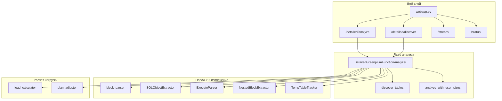
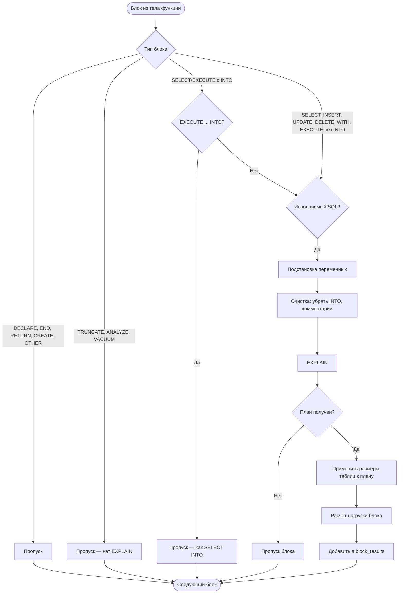
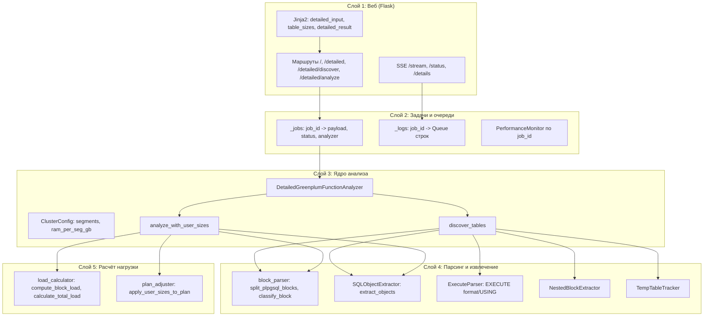
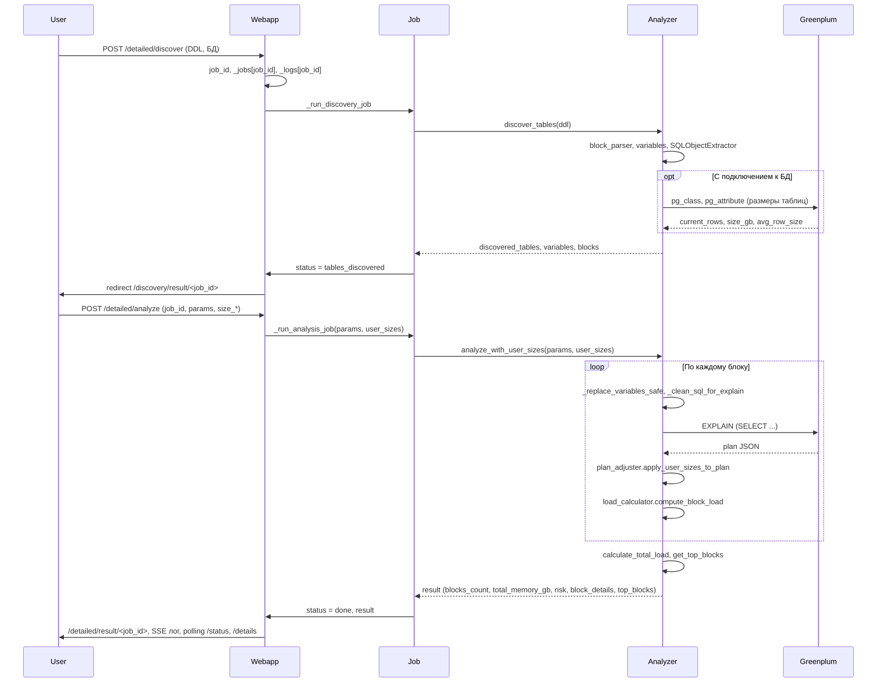

# GPA Analyzer

**Оценка нагрузки и рисков выполнения PL/pgSQL-функций в Greenplum по планам запросов.**

Приложение анализирует DDL функции, извлекает SQL-блоки, подставляет параметры и переменные, выполняет `EXPLAIN` для каждого блока и оценивает пиковую нагрузку на память сегментов кластера. Распространяется по лицензии [MIT](LICENSE).

---

## Описание приложения

GPA Analyzer — веб-приложение для предварительной оценки того, как выполнение PL/pgSQL-функции в Greenplum нагрузит кластер. Оно:

- **Обнаруживает таблицы** в теле функции (включая представления и временные таблицы) и при наличии подключения к БД запрашивает текущие размеры (строки, средняя ширина строки, оценка в GB).
- **Позволяет задать желаемые размеры** таблиц (например, для сценария роста данных) и параметры вызова функции.
- **Строит планы** (`EXPLAIN`) для каждого рабочего SQL-блока с подставленными значениями, применяет пользовательские размеры к планам и оценивает нагрузку по типам узлов плана (множители для Seq Scan, Hash Join, Sort и т.д.).
- **Суммирует нагрузку** по всем блокам и выдаёт итоговую оценку: общий объём (GB), уровень риска (низкий / средний / высокий) и оценочное время выполнения.

Интерфейс: форма ввода DDL, опциональное подключение к Greenplum, пошаговый лог в реальном времени, таблицы с результатами и топ запросов по нагрузке.

---

## Установка и настройка

### Требования

- Python 3.9+
- Доступ к кластеру Greenplum (опционально; без него можно задавать только размеры таблиц вручную).

### Зависимости

Установите зависимости из `app_gpa/requirements.txt`:

```bash
cd app_gpa
pip install -r requirements.txt
```

Основные пакеты:

| Пакет | Назначение |
|-------|------------|
| flask | Веб-сервер и маршруты |
| psycopg2-binary | Подключение к PostgreSQL/Greenplum |
| psutil | Мониторинг ресурсов (CPU, память) при расчёте |
| pglast | Парсинг SQL и извлечение объектов (таблицы, представления) |

### Запуск

Из каталога `app_gpa` (чтобы корректно резолвились импорты и шаблоны):

```bash
cd app_gpa
python webapp.py
```

По умолчанию приложение слушает `http://0.0.0.0:8000`. Откройте в браузере `http://localhost:8000` или `http://localhost:8000/detailed`.

### Настройка подключения к БД

На странице «Детальный анализ» можно включить «Использовать подключение к БД» и указать:

- **Стенд** — пресет (PROM, LD, IFT) или свои Host, Port, DB name.
- **User** и **Password** — учётные данные Greenplum.

Без подключения приложение работает только с введённым вручную DDL и размерами таблиц (без автоматического получения статистики из БД).

---

## Инструкция по работе с приложением

### Шаг 1. Открытие приложения

1. Запустите сервер (`python webapp.py` из каталога `app_gpa`).
2. В браузере откройте `http://localhost:8000` — откроется страница **«Детальный анализ»**.

### Шаг 2. Ввод DDL функции

1. В поле **«DDL функции»** вставьте полный текст функции (CREATE OR REPLACE FUNCTION … AS $$ … $$ LANGUAGE plpgsql).
2. При необходимости нажмите **«Подсказки»** в шапке карточки — откроется краткая справка по заполнению формы.

### Шаг 3. Подключение к БД (опционально)

- Если нужны **текущие размеры таблиц из кластера**: включите чекбокс **«Использовать подключение к БД»**.
- Укажите **Стенд** (пресет) или вручную **Host**, **Port**, **DB name**, **User**, **Password**.
- Если БД не используется — размеры таблиц потом задаются только вручную на шаге 6.

### Шаг 4. Параметры кластера

- **Количество сегментов** и **RAM на сегмент (GB)** — используются для расчёта нагрузки и риска. Подставьте значения вашего кластера или оставьте по умолчанию.

### Шаг 5. Обнаружение таблиц (первый этап)

1. Нажмите **«Обнаружить таблицы»**.
2. Произойдёт переход на страницу с **онлайн-логом** и индикатором «Сканирование таблиц…».
3. В логе отображаются: разбор блоков, извлечённые таблицы, при наличии БД — запросы размеров. Дождитесь статуса **«tables_discovered»** (зелёный бейдж).
4. Появится форма **«Настройка размеров таблиц и параметров функции»**.

### Шаг 6. Параметры функции и размеры таблиц

1. **Параметры функции** — введите значения параметров вызова в том же порядке, что и в сигнатуре функции, через запятую. Например: `'2024-01-01', 'current_date', 5`. Для строк — в кавычках.
2. В таблице **«Найденные таблицы»** проверьте столбец **«Желаемое строк»**: по умолчанию подставлено текущее (из БД) или 0. При необходимости измените значения (например, для сценария роста данных).
3. Нажмите **«Запустить анализ нагрузки»**.

### Шаг 7. Просмотр результата анализа (второй этап)

1. Откроется страница **«Результат детального анализа»** с логом и блоком **«Краткая статистика»**.
2. В логе в реальном времени выводятся обработанные блоки и возможные предупреждения. Дождитесь завершения (статус **«done»**).
3. После завершения появятся:
   - **Панель ключевых метрик** — риск, нагрузка (GB), число блоков, оценочное время.
   - **Вкладки**: «Таблицы», «Блоки», «Топ-3 запроса», «Статистика выполнения».
4. Кнопка **«Копировать весь лог»** копирует содержимое лога в буфер обмена.

### Шаг 8. Пересчёт с другими размерами таблиц (опционально)

1. На вкладке **«Таблицы»** измените значения в столбце **«Желаемое строк»**.
2. Нажмите **«Применить размеры и пересчитать»** — анализ запустится заново с новыми размерами (параметры функции сохраняются).

### Краткая схема

| Действие | Страница / элемент |
|---------|---------------------|
| Ввод DDL, БД, параметров кластера | Детальный анализ (форма) |
| Запуск первого этапа | Кнопка «Обнаружить таблицы» |
| Ввод параметров функции и размеров таблиц | Настройка размеров таблиц |
| Запуск второго этапа | Кнопка «Запустить анализ нагрузки» |
| Просмотр лога и сводки | Результат детального анализа |
| Пересчёт с новыми размерами | Вкладка «Таблицы» → «Применить размеры и пересчитать» |

---

## Результаты анализа и их интерпретация

После второго этапа (анализ с пользовательскими размерами) приложение выдаёт:

### Сводные показатели

| Показатель | Описание |
|------------|----------|
| **Риск** | НИЗКИЙ / СРЕДНИЙ / ВЫСОКИЙ — по доле суммарной оценки памяти от доступной RAM на сегмент (пороги: &lt;15% низкий, 15–40% средний, &gt;40% высокий). |
| **Нагрузка (GB)** | Сумма пиковых оценок памяти по всем проанализированным блокам (в GB). |
| **Блоков** | Количество логических блоков в теле функции и сколько из них реально проанализировано (часть блоков не считается — см. ограничения). |
| **Время (сек)** | Оценочное время выполнения (сумма по блокам на основе Total Cost плана и коэффициентов). |

### Таблицы

- **Найденные таблицы** — список таблиц/представлений из DDL с текущими (из БД) или введёнными вручную размерами: строки, размер в GB, средняя ширина строки. Можно изменить «Желаемое строк» и перезапустить анализ.

### Блоки

- Таблица блоков: тип (SELECT, INSERT, EXECUTE и т.д.), категория, оценка нагрузки (GB), строки, задействованные таблицы. Цветовая полоска слева от строки показывает уровень нагрузки (низкая / средняя / высокая). Клик по строке показывает превью SQL.

### Топ-3 запроса

- Три блока с максимальной оценкой нагрузки (GB) — основные кандидаты на оптимизацию.

### Интерпретация

- **НИЗКИЙ риск** — расчётная нагрузка в пределах нормы для типичного кластера.
- **СРЕДНИЙ / ВЫСОКИЙ** — стоит проверить тяжёлые блоки (топ-3), возможность разбиения или изменения запросов, индексов и размеров таблиц.
- Оценки основаны на планах `EXPLAIN` и эвристических множителях по типам узлов; они дают порядок величины, а не точное время и память.

---

## Ограничения анализа

Учтены типичные проблемы, с которыми сталкивались при отладке. Ниже — что приложение **учитывает** и чего **не делает**.

### Учитываемые моменты

- **SELECT … INTO** в PL/pgSQL трактуется как присвоение переменным; такие блоки **не считаются** рабочими блоками нагрузки и не отправляются в EXPLAIN. Вместо выполнения запроса переменным присваиваются безопасные значения по умолчанию (в т.ч. для агрегатов типа `min/max`).
- **EXECUTE … INTO …** (динамический SQL с записью результата в переменные) обрабатывается так же, как SELECT INTO — блок **не учитывается** в нагрузке.
- **Подстановка переменных** в SQL выполняется с защитой: целевые имена в `INTO` не подменяются значениями; литералы дат приводятся к виду `'YYYY-MM-DD'::date` без двойных кавычек; обрабатываются значения с уже имеющимся `::type`.
- **Временные таблицы** отслеживаются по `CREATE TEMP TABLE` и учитываются при сборе объектов.

### Ограничения и что может пойти не так

1. **Только часть блоков в нагрузке**  
   В расчёт попадают только блоки, которые удаётся разобрать и для которых строится EXPLAIN. Не учитываются: SELECT INTO, EXECUTE … INTO …, TRUNCATE, ANALYZE, VACUUM, блоки с неразобранным динамическим SQL, блоки с ошибкой парсинга или выполнения EXPLAIN. Поэтому «Блоков» может быть меньше, чем визуально в DDL.

2. **Динамический SQL (EXECUTE)**  
   Поддерживаются форматы `EXECUTE '...' USING a, b` и `EXECUTE format('...', a, b)` с подстановкой переменных. Сложные конкатенации строк, условная сборка запроса или неподдерживаемые плейсхолдеры могут привести к тому, что блок будет пропущен или подставленный SQL окажется некорректным.

3. **Типы данных и литералы**  
   Подстановка параметров и переменных ориентирована на типы date, timestamp, varchar, integer и т.п. Экзотические типы, кастомные приведения или сложные выражения могут дать неверный литерал в SQL и ошибку при EXPLAIN.

4. **Агрегаты в SELECT INTO**  
   Для `SELECT min(col), max(col) INTO v1, v2 FROM t` запрос к БД не выполняется; переменным присваиваются дефолтные значения (например, даты по умолчанию). Реальные min/max из данных в оценку не входят.

5. **Функции, отсутствующие в Greenplum**  
   Если в подставленном SQL вызывается функция, которой нет в кластере (например, `round(double precision, integer)`), EXPLAIN может вернуть ошибку и блок будет пропущен.

6. **Парсер pglast**  
   Извлечение таблиц/представлений и обход плана зависят от pglast. Нестандартный или невалидный SQL может не распарситься; при смене версии pglast возможны изменения в AST (например, имена узлов).

7. **Один сценарий на запуск**  
   Оценка делается для одного набора параметров функции и одного набора размеров таблиц. Сравнение нескольких сценариев требует нескольких запусков.

8. **Оценка по плану, не по факту**  
   Используется только план запроса (cost, rows, width) и множители по типам узлов. Реальное потребление памяти и время выполнения могут отличаться (статистика, skew, конкуренция за ресурсы).

---

## Техническая часть

### Структура проекта

```
overhead_analyzer/
├── LICENSE
├── README.md
└── app_gpa/
    ├── webapp.py              # Flask: маршруты, очереди логов, запуск задач
    ├── requirements.txt
    ├── static/
    │   ├── styles.css         # Общие стили, лог, формы
    │   └── detailed.css       # Загрузка, системная статистика
    ├── templates/
    │   ├── about_modal.html   # О приложении, лицензия MIT
    │   └── tips_modal.html   # Подсказки по форме
    └── detailed/
        ├── detailed_analyzer.py  # Ядро: discover_tables, analyze_with_user_sizes
        ├── block_parser.py       # Разбиение PL/pgSQL на блоки, классификация
        ├── sql_object_extractor.py  # pglast: извлечение таблиц/представлений из SQL
        ├── execute_parser.py    # EXECUTE format/USING, SELECT INTO
        ├── nested_block_extractor.py  # Вложенные SQL-блоки
        ├── load_calculator.py   # Оценка нагрузки по плану (множители узлов)
        ├── plan_adjuster.py     # Подстановка пользовательских размеров в план
        ├── temp_table_tracker.py
        ├── performance_monitor.py  # CPU/память процесса
        └── templates/
            ├── detailed_input.html   # Форма DDL, БД
            ├── table_sizes.html     # Результат discovery, форма размеров и параметров
            └── detailed_result.html # Лог, сводка, вкладки (таблицы, блоки, топ-3)
```

### Связи объектов (компоненты и зависимости)

Основные модули приложения и их зависимости:



### Алгоритм (этапы работы)

Двухэтапный процесс: сначала обнаружение таблиц и параметров, затем анализ нагрузки с пользовательскими размерами.

```mermaid
flowchart LR
    subgraph Stage1["Этап 1: Обнаружение"]
        A[DDL + опция БД] --> B[Парсинг тела функции]
        B --> C[Переменные и параметры]
        C --> D[Разбиение на блоки]
        D --> E[Извлечение таблиц/представлений]
        E --> F[Опционально: запрос размеров из БД]
        F --> G[Страница настроек размеров]
    end

    subgraph Stage2["Этап 2: Анализ"]
        G --> H[Параметры + размеры таблиц]
        H --> I[Подстановка переменных в блоки]
        I --> J[Очистка SQL, удаление INTO]
        J --> K[EXPLAIN по каждому блоку]
        K --> L[Применение размеров к плану]
        L --> M[Расчёт нагрузки по узлам]
        M --> N[Сумма, риск, топ-3]
    end

    Stage1 --> Stage2
```



### Логика обработки блоков

Решение по каждому блоку: учитывать в нагрузке или пропустить.



### Архитектура (слои приложения)

Распределение по слоям: веб, задачи, ядро анализа, парсеры, расчёт.



### Поток данных (от ввода до результата)

Как данные проходят от формы до JSON-результата и UI.



---

## Лицензия

Проект распространяется под лицензией [MIT](LICENSE). Автор: Dmitry Solonnikov.
