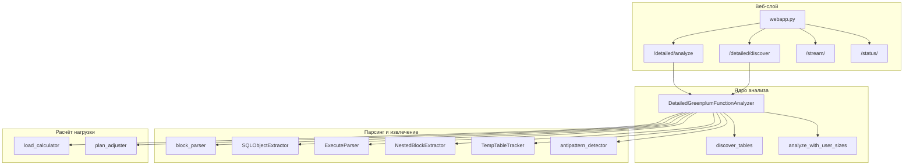
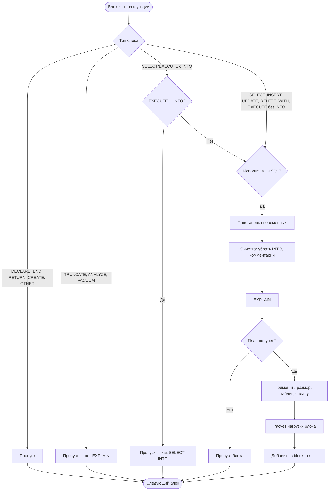
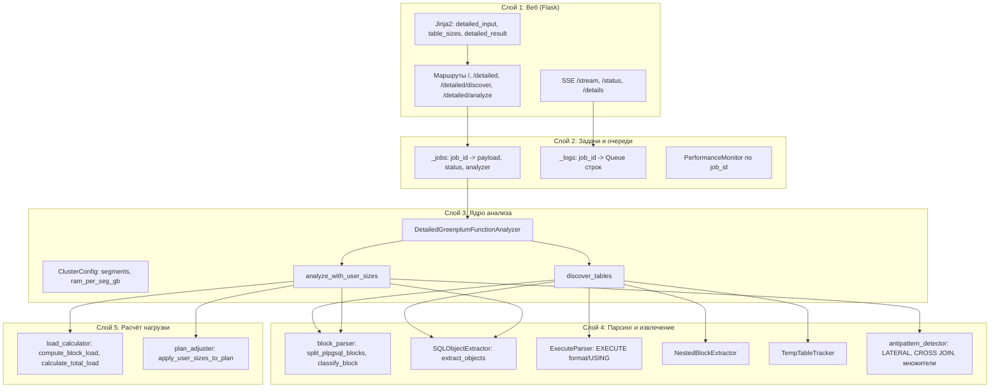
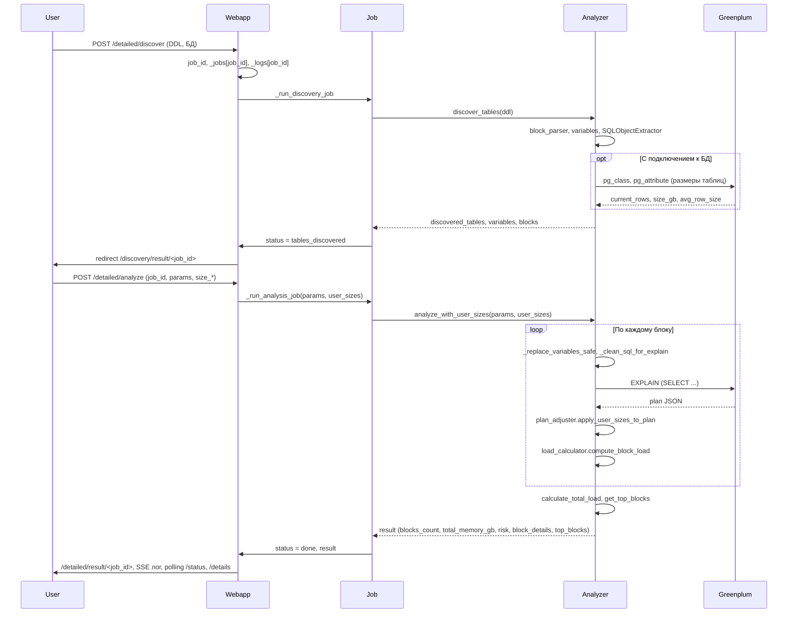

Ниже представлен технический контекст проекта (TIG Snapshot).
Пожалуйста, проанализируй его исходя из текущей цели: Разработка проекта

```text
================================================================================
TIG UNIFIED SNAPSHOT v1.3
================================================================================

ПРОЕКТ: /Users/dmitrysolonnikov/PycharmProjects/overhead_analyzer
ДАТА:   2026-03-30 09:36:01
ЦЕЛЬ (GOAL): Разработка проекта
ДЕЙСТВИЕ (DO): Анализ текущего состояния
РЕЖИМ:  REVIEW | ТИП: feature

================================================================================
ЭВОЛЮЦИЯ ПРОЕКТА (GIT)
================================================================================
Корень репозитория: /Users/dmitrysolonnikov/PycharmProjects/overhead_analyzer

=== ТЕКУЩИЙ СТАТУС ===
D unpack_from_txt.py
?? README_confluence.wiki
?? unpack_from_txt.txt

=== ИСТОРИЯ (5 коммитов) ===
a6329d8 - Dmitry Solonnikov, 10 days ago : rem md
 OPERATIONS_RUNBOOK.md                     | 126 ---------------------------
 PRODUCTION_ROADMAP.md                     | 136 ------------------------------
 pack_to_txt.py                            |  87 +++++++++++--------
 pack_umpack.txt                           |  23 +++--
 unpack_from_txt.txt => unpack_from_txt.py |  45 +++++++---
 5 files changed, 97 insertions(+), 320 deletions(-)

5b0107b - Dmitry Solonnikov, 11 days ago : ui + linter
 .github/workflows/python-tests.yml                 |   33 +
 .gitignore                                         |   67 +-
 OPERATIONS_RUNBOOK.md                              |  126 +
 PRODUCTION_ROADMAP.md                              |  136 +
 README.md                                          |  189 +-
 app_gpa/agent/agent_prompts.py                     |   70 +-
 app_gpa/agent/gigachat_agent.py                    |  921 ++++++-
 app_gpa/agent_profiles.json                        |    6 +-
 app_gpa/app_settings.py                            |  134 +
 app_gpa/check_gigachat_connection.py               |   74 +-
 app_gpa/detailed/analysis_handlers.py              |  132 +
 app_gpa/detailed/analysis_orchestrator.py          |   81 +
 app_gpa/detailed/antipattern_detector.py           |  117 +
 app_gpa/detailed/api_contracts.py                  |   41 +
 app_gpa/detailed/detailed_analyzer.py              |  126 +-
 app_gpa/detailed/job_contracts.py                  |   28 +
 app_gpa/detailed/job_runner.py                     |   58 +
 app_gpa/detailed/job_service.py                    |   55 +
 app_gpa/detailed/job_store.py                      |  210 ++
 app_gpa/detailed/lint/__init__.py                  |   15 +
 app_gpa/detailed/lint/base.py                      |   81 +
 app_gpa/detailed/lint/common.py                    |  171 ++
 app_gpa/detailed/lint/factory.py                   |   16 +
 app_gpa/detailed/lint/postgres_linter.py           |   35 +
 app_gpa/detailed/lint/pyspark_linter.py            |  239 ++
 app_gpa/detailed/lint/spark_linter.py              |  223 ++
 app_gpa/detailed/observability.py                  |   99 +
 app_gpa/detailed/persistence_service.py            |   37 +
 app_gpa/detailed/queue_backend.py                  |   16 +
 app_gpa/detailed/request_validation.py             |   23 +
 app_gpa/detailed/runtime_analyzers.py              |  625 +++++
 app_gpa/detailed/runtime_preset_store.py           |  268 ++
 app_gpa/detailed/runtime_registry.py               |  255 ++
 app_gpa/detailed/security.py                       |   34 +
 app_gpa/detailed/sql_completion.py                 |  289 +++
 app_gpa/detailed/sql_validator.py                  |  778 ++++++
 app_gpa/detailed/templates/detailed_input.html     | 2637 +++++++++++++++++---
 app_gpa/detailed/templates/detailed_result.html    |  462 +++-
 .../templates/prepare_sidebar_controls.html        |   14 +
 app_gpa/detailed/templates/reset_cache_modal.html  |   22 +-
 app_gpa/detailed/templates/table_sizes.html        |  235 +-
 app_gpa/pytest.ini                                 |    2 +
 app_gpa/requirements.txt                           |   11 +
 app_gpa/sql_function_profiles.json                 |    3 +
 app_gpa/static/detailed.css                        | 1789 +++++++++++--
 app_gpa/static/styles.css                          | 1554 ++++++++++--
 app_gpa/templates/about_modal.html                 |   33 +-
 app_gpa/templates/app_footer.html                  |   68 +-
 app_gpa/templates/apple_sidebar.html               |   69 +
 app_gpa/templates/tips_modal.html                  |   78 +-
 app_gpa/tests/test_agent_prompts.py                |   16 +
 app_gpa/tests/test_api_contracts.py                |   39 +
 app_gpa/tests/test_gigachat_model_fallback.py      |   84 +
 app_gpa/tests/test_gigachat_token_parsing.py       |   68 +
 app_gpa/tests/test_json_escape_repair.py           |   31 +
 app_gpa/tests/test_request_validation.py           |   24 +
 app_gpa/tests/test_security.py                     |   30 +
 app_gpa/tests/test_sqlite_stores.py                |   57 +
 app_gpa/tests/test_webapp_integration.py           |  208 ++
 app_gpa/validate_gigachat_models.py                |  172 ++
 app_gpa/webapp.py                                  | 1521 +++++++++--
 app_gpa/worker.py                                  |   17 +
 pack_to_txt.py                                     |   39 +-
 pack_umpack.txt                                    |   12 +-
 unpack_from_txt.py => unpack_from_txt.txt          |   20 +-
 65 files changed, 13601 insertions(+), 1522 deletions(-)

4eb5b5f - Dmitry Solonnikov, 3 weeks ago : add agent func
 .env                                              |   18 +
 .gitignore                                        |   11 +
 README.md                                         |   73 +-
 app_gpa/agent/__init__.py                         |    1 +
 app_gpa/agent/agent_cache_db.py                   |  613 +++++++++++
 app_gpa/agent/agent_prompts.py                    |  172 +++
 app_gpa/agent/gigachat_agent.py                   | 1089 +++++++++++++++++++
 app_gpa/agent_profiles.json                       |   14 +
 app_gpa/check_gigachat_connection.py              |   85 ++
 app_gpa/detailed/antipattern_detector.py          |  195 ++++
 app_gpa/detailed/detailed_analyzer.py             |  321 +++++-
 app_gpa/detailed/load_calculator.py               |    4 +-
 app_gpa/detailed/plan_adjuster.py                 |  269 +++--
 app_gpa/detailed/templates/detailed_input.html    | 1157 ++++++++++++++++++++-
 app_gpa/detailed/templates/detailed_result.html   |  286 ++++-
 app_gpa/detailed/templates/reset_cache_modal.html |  142 +++
 app_gpa/detailed/templates/table_sizes.html       |  121 ++-
 app_gpa/requirements.txt                          |   25 +-
 app_gpa/static/detailed.css                       |  173 +++
 app_gpa/static/styles.css                         |   40 +-
 app_gpa/templates/app_footer.html                 |   19 +
 app_gpa/templates/result.html                     |    6 +-
 app_gpa/templates/tips_modal.html                 |   48 +-
 app_gpa/webapp.py                                 |  869 +++++++++++++++-
 pack_to_txt.py                                    |  101 ++
 pack_umpack.txt                                   |    4 +
 unpack_from_txt.py                                |   71 ++
 27 files changed, 5717 insertions(+), 210 deletions(-)

7b7fb56 - Dmitry Solonnikov, 3 weeks ago : update gitignore
 .gitignore                 |    2 +-
 test_cases/function.sql    |  456 --------------------
 test_cases/function_1.sql  |  806 ----------------------------------
 test_cases/function_2.sql  |  298 -------------
 test_cases/heavy_query.sql | 1024 --------------------------------------------
 test_cases/only_query.sql  |  428 ------------------
 6 files changed, 1 insertion(+), 3013 deletions(-)

f995ed4 - Dmitry Solonnikov, 3 weeks ago : Merge branch 'update-ui' into master

================================================================================
СТРУКТУРА ДИРЕКТОРИЙ
================================================================================
overhead_analyzer/
├── .github/
│   ├── workflows/
│   │   ├── python-tests.yml
├── .runtime_store/
│   ├── jobs_state/
│   │   ├── jobs/
│   ├── presets/
│   ├── app_state.sqlite3-shm
│   ├── app_state.sqlite3-wal
├── app_gpa/
│   ├── agent/
│   │   ├── .agent_cache.json
│   │   ├── __init__.py
│   │   ├── agent_cache_db.py
│   │   ├── agent_prompts.py
│   │   ├── gigachat_agent.py
│   ├── detailed/
│   │   ├── lint/
│   │   │   ├── __init__.py
│   │   │   ├── base.py
│   │   │   ├── common.py
│   │   │   ├── factory.py
│   │   │   ├── postgres_linter.py
│   │   │   ├── pyspark_linter.py
│   │   │   ├── spark_linter.py
│   │   ├── static/
│   │   │   ├── detailed.css
│   │   ├── templates/
│   │   │   ├── detailed_input.html
│   │   │   ├── detailed_result.html
│   │   │   ├── prepare_sidebar_controls.html
│   │   │   ├── reset_cache_modal.html
│   │   │   ├── table_sizes.html
│   │   ├── .DS_Store
│   │   ├── __init__.py
│   │   ├── analysis_handlers.py
│   │   ├── analysis_orchestrator.py
│   │   ├── antipattern_detector.py
│   │   ├── api_contracts.py
│   │   ├── block_parser.py
│   │   ├── detailed_analyzer.py
│   │   ├── execute_parser.py
│   │   ├── job_contracts.py
│   │   ├── job_runner.py
│   │   ├── job_service.py
│   │   ├── job_store.py
│   │   ├── load_calculator.py
│   │   ├── nested_block_extractor.py
│   │   ├── observability.py
│   │   ├── performance_monitor.py
│   │   ├── persistence_service.py
│   │   ├── plan_adjuster.py
│   │   ├── queue_backend.py
│   │   ├── request_validation.py
│   │   ├── runtime_analyzers.py
│   │   ├── runtime_preset_store.py
│   │   ├── runtime_registry.py
│   │   ├── security.py
│   │   ├── sql_completion.py
│   │   ├── sql_object_extractor.py
│   │   ├── sql_validator.py
│   │   ├── temp_table_tracker.py
│   ├── static/
│   │   ├── detailed.css
│   │   ├── styles.css
│   ├── templates/
│   │   ├── about_modal.html
│   │   ├── app_footer.html
│   │   ├── apple_sidebar.html
│   │   ├── result.html
│   │   ├── tips_modal.html
│   ├── .DS_Store
│   ├── agent_profiles.json
│   ├── app_settings.py
│   ├── check_gigachat_connection.py
│   ├── pytest.ini
│   ├── requirements.txt
│   ├── sql_function_profiles.json
│   ├── validate_gigachat_models.py
│   ├── webapp.py
│   ├── worker.py
├── .DS_Store
├── .gitignore
├── .key
├── LICENSE
├── pack_to_txt.py
├── pack_umpack.txt
├── README.md
├── README_confluence.wiki
├── unpack_from_txt.txt

================================================================================
СОДЕРЖИМОЕ ФАЙЛОВ
================================================================================

--- FILE: LICENSE ---
MIT License

Copyright (c) 2025 Dmitry Solonnikov

Permission is hereby granted, free of charge, to any person obtaining a copy
of this software and associated documentation files (the "Software"), to deal
in the Software without restriction, including without limitation the rights
to use, copy, modify, merge, publish, distribute, sublicense, and/or sell
copies of the Software, and to permit persons to whom the Software is
furnished to do so, subject to the following conditions:

The above copyright notice and this permission notice shall be included in all
copies or substantial portions of the Software.

THE SOFTWARE IS PROVIDED "AS IS", WITHOUT WARRANTY OF ANY KIND, EXPRESS OR
IMPLIED, INCLUDING BUT NOT LIMITED TO THE WARRANTIES OF MERCHANTABILITY,
FITNESS FOR A PARTICULAR PURPOSE AND NONINFRINGEMENT. IN NO EVENT SHALL THE
AUTHORS OR COPYRIGHT HOLDERS BE LIABLE FOR ANY CLAIM, DAMAGES OR OTHER
LIABILITY, WHETHER IN AN ACTION OF CONTRACT, TORT OR OTHERWISE, ARISING FROM,
OUT OF OR IN CONNECTION WITH THE SOFTWARE OR THE USE OR OTHER DEALINGS IN THE
SOFTWARE.

--- EOF: LICENSE ---

--- FILE: unpack_from_txt.txt ---
"""
Скрипт 2: распаковывает zip в целевую директорию по структуре,
читает мапу расширений и переименовывает все .txt обратно в исходные расширения.
"""

import base64
import os
import sys
import json
import zipfile
from pathlib import Path

# Корень проекта — директория, где лежит этот скрипт
PROJECT_ROOT = Path(__file__).resolve().parent


def unpack_and_restore_extensions(input_zip: str, output_dir: str) -> None:
    """
    Распаковывает input_zip в output_dir, затем по extension_map.json
    заменяет расширения .txt на соответствующие из мапы.
    """
    input_path = Path(input_zip).resolve()
    if not input_path.is_file():
        # Если архив не найден в cwd — ищем в корне проекта
        alt = PROJECT_ROOT / input_zip
        if alt.is_file():
            input_path = alt.resolve()

    out_path = Path(output_dir).resolve()

    if not input_path.is_file():
        raise FileNotFoundError(f"Архив не найден: {input_zip}")

    out_path.mkdir(parents=True, exist_ok=True)

    with zipfile.ZipFile(input_path, "r") as zf:
        # Сначала извлекаем extension_map.json
        if "extension_map.json" not in zf.namelist():
            raise ValueError("В архиве отсутствует extension_map.json")

        map_data = zf.read("extension_map.json").decode("utf-8")
        extension_map = json.loads(map_data)
        use_base64 = extension_map.pop("_format", None) == "base64"

        # Распаковываем все файлы
        for name in zf.namelist():
            if name == "extension_map.json":
                continue
            data = zf.read(name)
            if use_base64:
                data = base64.b64decode(data)
            target = out_path / name
            target.parent.mkdir(parents=True, exist_ok=True)
            target.write_bytes(data)

    # Восстанавливаем исходные расширения по мапе (заменяем .txt на оригинал)
    renamed = 0
    for rel_txt, original_ext in extension_map.items():
        file_path = out_path / rel_txt
        if not file_path.exists():
            continue
        # original_ext: "" или None = без расширения; иначе "ext" (без точки)
        # Важно: никогда не формировать suffix "." — Path.with_suffix(".") вызывает ValueError
        ext_str = (original_ext or "").strip() if original_ext is not None else ""
        suffix = ("." + ext_str) if ext_str else ""
        rel_path = Path(rel_txt)
        new_name = rel_path.stem + suffix  # stem — имя без .txt
        new_path = file_path.parent / new_name
        if file_path != new_path:
            file_path.rename(new_path)
            renamed += 1

    print(f"Распаковано в: {out_path}")
    print(f"Восстановлено расширений: {renamed}")


def main():
    if len(sys.argv) < 2:
        print("Использование: python unpack_from_txt.py <архив.zip> [целевая_директория]")
        print("  По умолчанию распаковка в корень проекта (где лежит скрипт).")
        sys.exit(1)

    input_zip = sys.argv[1]
    output_dir = sys.argv[2] if len(sys.argv) > 2 else str(PROJECT_ROOT)

    unpack_and_restore_extensions(input_zip, output_dir)


if __name__ == "__main__":
    main()

--- EOF: unpack_from_txt.txt ---

--- FILE: pack_umpack.txt ---
# Упаковщик

# Упаковать корень проекта в packed.zip
python pack_to_txt.py

# Указать папку и путь к архиву
python pack_to_txt.py <исходная_папка> <путь_к_архиву>
python pack_to_txt.py . packed.zip

#Распаковщик

# Распаковать packed.zip в корень проекта
python unpack_from_txt.py packed.zip

# Указать папку для распаковки
python unpack_from_txt.py packed.zip ./
python unpack_from_txt.py packed.zip /путь/к/папке
--- EOF: pack_umpack.txt ---

--- FILE: .key ---
b7e38e99-3850-4004-ba56-204d8322a69d
GIGACHAT_API_PERS

GIGACHAT_TOKEN=YjdlMzhlOTktMzg1MC00MDA0LWJhNTYtMjA0ZDgzMjJhNjlkOmRhZDRiNzc0LWIyZDUtNDE2Yi1hZjdjLTA1Yzc0NTEyNDhiZg==

python check_gigachat_connection.py --token "YjdlMzhlOTktMzg1MC00MDA0LWJhNTYtMjA0ZDgzMjJhNjlkOmRhZDRiNzc0LWIyZDUtNDE2Yi1hZjdjLTA1Yzc0NTEyNDhiZg==" --scope GIGACHAT_API_PERS

--- EOF: .key ---

--- FILE: README.md ---
# GPA Analyzer

**Оценка нагрузки и рисков выполнения PL/pgSQL-функций в Greenplum по планам запросов.**

Приложение анализирует DDL функции, извлекает SQL-блоки, подставляет параметры и переменные, выполняет `EXPLAIN` для каждого блока и оценивает пиковую нагрузку на память сегментов кластера. Распространяется по лицензии [MIT](LICENSE).

---

## Описание приложения

GPA Analyzer — веб-приложение для предварительной оценки того, как выполнение PL/pgSQL-функции в Greenplum нагрузит кластер. Оно:

- **Обнаруживает таблицы** в теле функции (включая представления и временные таблицы) и при наличии подключения к БД запрашивает текущие размеры (строки, средняя ширина строки, оценка в GB).
- **Позволяет задать желаемые размеры** таблиц (например, для сценария роста данных) и параметры вызова функции.
- **Строит планы** (`EXPLAIN`) для каждого рабочего SQL-блока с подставленными значениями, применяет пользовательские размеры к планам и оценивает нагрузку по типам узлов плана (множители для Seq Scan, Hash Join, Sort и т.д.).
- **Суммирует нагрузку** по всем блокам и выдаёт итоговую оценку: общий объём (GB), уровень риска (низкий / средний / высокий) и оценочное время выполнения.
- **Детектирует антипаттерны** (LATERAL с ORDER BY + LIMIT 1, CROSS JOIN, коррелированные подзапросы, SELECT DISTINCT и др.) и применяет множители нагрузки на скейле данных.
- **Поддерживает режим без БД** (чистый агент): агент извлекает блоки и объекты, синтезирует планы. Для больших скриптов — чанкинг и повторные попытки при таймауте.
- **GigaChat:** одна выбранная чат-модель и одна модель эмбеддингов на вызов (UI / `GIGACHAT_*` / значение по умолчанию); в UI — информационная проверка доступности моделей и отображение имён на шагах подготовки, настройки таблиц и в итоге анализа.

Интерфейс: форма ввода DDL, опциональное подключение к Greenplum, пошаговый лог в реальном времени, таблицы с результатами и топ запросов по нагрузке.

---

## Установка и настройка

### Требования

- Python 3.9+
- Доступ к кластеру Greenplum (опционально; без него можно задавать только размеры таблиц вручную).

### Зависимости

Установите зависимости из `app_gpa/requirements.txt`:

```bash
cd app_gpa
pip install -r requirements.txt
```

Основные пакеты:

| Пакет | Назначение |
|-------|------------|
| flask | Веб-сервер и маршруты |
| psycopg2-binary | Подключение к PostgreSQL/Greenplum |
| psutil | Мониторинг ресурсов (CPU, память) при расчёте |
| pglast | Парсинг SQL и извлечение объектов (таблицы, представления) |
| gigachat | GigaChat API: извлечение блоков/объектов, синтез планов (режим агента) |

### Запуск

Из каталога `app_gpa` (чтобы корректно резолвились импорты и шаблоны):

```bash
cd app_gpa
python webapp.py
```

По умолчанию приложение слушает `http://0.0.0.0:8000`. Откройте в браузере `http://localhost:8000` или `http://localhost:8000/detailed`.

### Production queue backend

Для production можно переключить выполнение фоновых job'ов с локальных потоков на `Redis + RQ`.

Пример переменных окружения:

```bash
export JOB_RUNNER_BACKEND=queue
export REDIS_URL=redis://localhost:6379/0
export JOB_QUEUE_NAME=gpa-jobs
```

Запуск web-приложения:

```bash
cd app_gpa
python webapp.py
```

Запуск worker-процесса:

```bash
cd app_gpa
python worker.py
```

Если `JOB_RUNNER_BACKEND` не задан, приложение использует текущий режим `thread`, удобный для локальной разработки.

### DB-backed persistence

Состояние job'ов, логи и runtime presets теперь можно хранить в SQLite вместо файлового каталога.

Пример:

```bash
export RUNTIME_STORE_DIR=.runtime_store
export PERSISTENCE_DB_PATH=.runtime_store/app_state.sqlite3
```

По умолчанию база создается автоматически по пути `RUNTIME_STORE_DIR/app_state.sqlite3`.
При первом запуске сервис пытается мягко перенести legacy-данные из старых файловых store в SQLite.

### Security baseline

Для non-debug запуска задайте безопасный `APP_SECRET_KEY`. В режиме `FLASK_DEBUG=false` приложение не стартует с дефолтным ключом.

Полезные переменные окружения:

```bash
export APP_SECRET_KEY='replace-with-long-random-secret'
export MAX_CONTENT_LENGTH_BYTES=2097152
export SESSION_COOKIE_SECURE=true
export SESSION_COOKIE_HTTPONLY=true
export SESSION_COOKIE_SAMESITE=Lax
export SESSION_LIFETIME_MINUTES=120
```

### Minimal auth and rate limiting

Для базовой защиты production-инстанса можно включить HTTP Basic Auth и простое ограничение частоты запросов:

```bash
export APP_BASIC_AUTH_USERNAME=admin
export APP_BASIC_AUTH_PASSWORD='replace-with-strong-password'
export RATE_LIMIT_ENABLED=true
export RATE_LIMIT_REQUESTS=120
export RATE_LIMIT_WINDOW_SECONDS=60
```

Особенности текущего baseline:

- Basic Auth применяется глобально ко всем non-static routes.
- Rate limiting применяется на web-слое по IP-адресу клиента.
- Это минимальный baseline, а не полноценная IAM/SSO-схема.

### Automated tests

Минимальный test baseline запускается из каталога `app_gpa`:

```bash
cd app_gpa
python -m pytest
```

Покрытый минимум:

- API contract helpers
- request validation helpers
- in-memory rate limiter
- SQLite job/preset stores
- Flask integration endpoints для contract-safe API
- выбор одной чат-/embedding-модели GigaChat (`app_gpa/tests/test_gigachat_model_fallback.py`)

CI:

- GitHub Actions workflow: `.github/workflows/python-tests.yml`
- Workflow устанавливает зависимости из `app_gpa/requirements.txt` и запускает `python -m pytest`

### Observability baseline

В приложении включён минимальный observability baseline:

- `X-Request-ID` выставляется в ответах и может быть передан извне через заголовок запроса
- structured logs пишутся для:
  - начала/завершения HTTP request
  - rate limiting / unauthorized событий
  - создания, enqueue и completion/failure job'ов
- health endpoints:
  - `/health/live`
  - `/health/ready`
  - `/health`

`/health/ready` проверяет как минимум SQLite persistence. Если включён queue backend, дополнительно проверяется доступность Redis.

Приложение пока не упаковывается в контейнеры; запуск — процессы на хосте (см. разделы выше: web, worker, Redis, persistence). Операционные процедуры и диагностика описаны в `OPERATIONS_RUNBOOK.md`.

### Настройка подключения к БД

На странице «Детальный анализ» можно включить «Использовать подключение к БД» и указать:

- **Стенд** — пресет (PROM, LD, IFT) или свои Host, Port, DB name.
- **User** и **Password** — учётные данные Greenplum.

Без подключения приложение работает только с введённым вручную DDL и размерами таблиц (без автоматического получения статистики из БД).

### Режим агента (GigaChat API)

В разделе **«Способ выполнения аналитики»** можно выбрать **«Режим агента»**: генерация SQL или DDL функции по текстовому описанию через [GigaChat API](https://developers.sber.ru/docs/ru/gigachain/overview) (GigaChain).

**Режимы анализа:**

| Режим | Описание |
|-------|----------|
| **Только логика** | Парсер извлекает блоки и объекты из DDL, планы берутся из БД (EXPLAIN). Требуется подключение к БД. |
| **Гибрид** | С БД: парсер + EXPLAIN в БД; при ошибках — агент (DDL по объектам, синтез планов). Без БД: чистый агент. |
| **Чистый агент** | Агент сам извлекает блоки и объекты из DDL/SQL, синтезирует планы. БД не требуется. Поддерживает PL/pgSQL функции, один SQL-запрос и скрипты (DDL/DML). |

**Чистый агентский режим:** агент интерпретирует тип ввода (функция, запрос или скрипт), извлекает блоки и объекты, синтезирует планы. Для больших текстов (>35k символов) используется чанкинг с таймаутом и повторными попытками. Временные таблицы и наследование определяются агентом по контексту.

**Настройка:**

1. Получите ключ авторизации в [личном кабинете GigaChat API](https://developers.sber.ru/studio/) (проект → Настройки).
2. Задайте ключ одним из способов:
   - **В UI:** режим «Гибрид» → «Ввести ключ» (ключ не сохраняется — только в памяти до перезагрузки страницы)
   - **В .key:** создайте файл `.key` в корне проекта, первая строка — токен base64 (для профиля «разработчик»).
   - **В .env:** `GIGACHAT_CREDENTIALS=<ключ>` или `GIGACHAT_TOKEN=<ключ>`.

   Пример файла `.key` (корень проекта):
   ```
   ваш_base64_токен_из_личного_кабинета
   ```
   Или несколько строк (токен — строка, похожая на base64, ≥32 символов):
   ```
   client_id
   GIGACHAT_API_PERS
   ваш_base64_токен
   ```

   Альтернатива: `GIGACHAT_CLIENT_ID` + `GIGACHAT_CLIENT_SECRET` в .env (приложение соберёт credentials автоматически).
3. Опционально в .env:
   - `GIGACHAT_MODEL` — чат-модель по умолчанию, если в запросе/UI не передано другое имя. Если не задано — используется `GigaChat-2-Max` (см. [модели GigaChat](https://developers.sber.ru/docs/ru/gigachat/models/gigachat-2-max)). Перебора моделей при ошибке API нет.
   - `GIGACHAT_EMBEDDING_MODEL` — модель эмбеддингов по умолчанию; если не задано — `EmbeddingsGigaR` ([документация](https://developers.sber.ru/docs/ru/gigachat/models/embeddings-giga-r)).
   - `GIGACHAT_SCOPE` — версия API: `GIGACHAT_API_PERS` (физлица), `GIGACHAT_API_B2B`, `GIGACHAT_API_CORP`.
   - `GIGACHAT_VERIFY_SSL_CERTS=false` — отключить проверку SSL (если не установлены сертификаты Минцифры).
   - `GIGACHAT_HTTP_TIMEOUT_SEC` — таймаут HTTP-клиента Python SDK (сек.) для всех вызовов GigaChat (chat, embeddings, OAuth-запросы через тот же клиент). По умолчанию **180**; если не задано, используется `GIGACHAT_TIMEOUT_SEC`, иначе 180. Без этого у SDK часто **30 с** и обрыв генерации с «The read operation timed out».
   - `GIGACHAT_TIMEOUT_SEC` — таймаут синтеза плана в отдельном потоке (по умолчанию 120 с); также подставляется как HTTP-таймаут, если не задан `GIGACHAT_HTTP_TIMEOUT_SEC`.
   - `GIGACHAT_BLOCKS_TIMEOUT_SEC` — таймаут извлечения блоков и объектов (по умолчанию 180 с).

Проверка списка моделей из UI (простой `chat` и `embeddings` на каждое имя из `CHAT_MODEL_PRIORITY` / `EMBEDDING_MODEL_PRIORITY`), при валидном ключе:

```bash
.venv/bin/python app_gpa/validate_gigachat_models.py
```

(используйте интерпретатор из venv проекта, где установлен пакет `gigachat`).

Учёт токенов в приложении опирается на официальные методы GigaChat:
- **Остаток:** [GET /balance](https://developers.sber.ru/docs/ru/gigachat/api/reference/rest/get-balance) (доступен при пакетах токенов; при pay-as-you-go часто **403** — тогда в UI показывается оценка по лимиту Lite Freemium).
- **Подсчёт до запроса:** [POST /tokens/count](https://developers.sber.ru/docs/ru/gigachat/api/reference/rest/post-tokens-count) — обёртка `POST /api/agent/tokens_count` (тело JSON: `input` — массив строк, опционально `model`, `credentials`, `scope`).

#### Справочные списки моделей и один выбор на вызов

В коде заданы упорядоченные списки имён (для UI и для **«Проверить доступность»** — там по очереди опрашивается каждая модель):

| Тип | Порядок имён (справочно) |
|-----|--------------------------|
| **Чат** | `GigaChat-2-Max` → `GigaChat-2-Pro` → `GigaChat-2` (значения поля `model`, [гайд](https://developers.sber.ru/docs/ru/gigachat/guides/selecting-a-model); лёгкий тариф — `GigaChat-2`, не `GigaChat-2-Lite`) |
| **Эмбеддинги** | `EmbeddingsGigaR` → `GigaEmbeddings-3B-2025-09` → `Embeddings-2` → `Embeddings` |

- Рабочие вызовы API используют **ровно одну** чат-модель и **одну** модель эмбеддингов: приоритет — поле из запроса/UI, затем **`GIGACHAT_MODEL`** / **`GIGACHAT_EMBEDDING_MODEL`**, затем первая строка из соответствующего списка.
- Для job в discovery/analyze передаётся выбранная чат-модель (см. ниже); она имеет приоритет над `GIGACHAT_MODEL`.

#### Выбор моделей в окне профиля GigaChat

В модальном окне **«Ключ GigaChat API»** задаются поля **«Чат-модель»** и **«Модель эмбеддингов»** (список имён совпадает со справочными списками в коде). После **«Применить»**:

- выбор сохраняется в **`localStorage`** браузера (`gpa_agent_chat_model`, `gpa_agent_embedding_model`) и в записи профиля в **`agent_profiles.json`** (поля `chatModel`, `embeddingModel`), если выбран или создан именованный профиль;
- при следующем открытии окна можно **сменить модели**; последний выбранный профиль подставляется по ключу `gpa_agent_last_profile_name` в `localStorage`;
- скрытые поля формы `agent_chat_model` / `agent_embedding_model` уходят на сервер с **«Обнаружить таблицы»** / анализом — попадают в **job** и в **`/status/<job_id>`**.

Кнопка **«Проверить доступность»** открывает **информационный модал**: по API проверяется ответ по каждой модели (✓/✗); он **не подменяет** выбранные в окне профиля значения — только подсказка.

**Где видны выбранные модели:** полоска на шаге **1. Подготовка**, бейдж в шапке лога на шаге **2**, бейдж в сводке на странице **результата**; в логе анализа — строка о выбранных моделях.

#### API: списки моделей и проверка доступности

`GET /api/agent/model-options` — в `data`: массивы имён `chat` и `embedding` (как `CHAT_MODEL_PRIORITY` / `EMBEDDING_MODEL_PRIORITY` в `gigachat_agent.py`).

`POST /api/agent/probe-models` — тело JSON (часть полей опциональна):

- `credentials` — base64-токен; либо пара `client_id` + `client_secret` (соберётся в credentials на сервере);
- если ключа в теле нет — используется `.key` / `.env` на сервере (как у `validate-env`); `use_env_credentials: true` по-прежнему может отправлять UI для явного указания режима;
- `scope` — например `GIGACHAT_API_PERS`;
- `verify_ssl` — boolean, переопределяет проверку SSL для этого запроса.

Успешный ответ (формат contract-safe API, данные в `data`): массивы `chat` и `embedding` с элементами `{ "model", "ok", "error" }`, поля `selected_chat`, `selected_embedding`, а также `chat_priority` и `embedding_priority` — полные цепочки, как в коде.

`POST /api/agent/generate` (генерация SQL/DDL по описанию) дополнительно принимает **`chat_model`** или **`agent_chat_model`** — чат-модель для этого вызова (приоритет над `GIGACHAT_MODEL`).

Документация: [Python SDK](https://developers.sber.ru/docs/ru/gigachain/tools/python/gigachat), [выбор модели](https://developers.sber.ru/docs/ru/gigachat/guides/selecting-a-model). Для RAG можно установить `langchain-gigachat` (см. комментарии в `app_gpa/requirements.txt`).

---

## Инструкция по работе с приложением

### Шаг 1. Открытие приложения

1. Запустите сервер (`python webapp.py` из каталога `app_gpa`).
2. В браузере откройте `http://localhost:8000` — откроется страница **«Детальный анализ»**.

### Шаг 2. Выбор режима и ввод DDL

1. **Режим анализа:** выберите один из трёх:
   - **Только логика** — нужна БД, планы из EXPLAIN.
   - **Гибрид** — с БД или без; при «без БД» автоматически чистый агент.
   - **Чистый агент** — без БД, нужен ключ GigaChat («Ввести ключ» или .key/.env).
2. **GigaChat (гибрид / агент):** в окне **«Ввести ключ»** выберите **чат-модель** и **embedding-модель**, нажмите **«Применить»** — выбор запоминается в браузере и в профиле (`agent_profiles.json`). При следующем открытии окна модели можно изменить. Опционально: **«Проверить доступность»** — только справка по ответам API.
3. **В поле «DDL функции»** вставьте:
   - PL/pgSQL функцию (CREATE OR REPLACE FUNCTION … AS $$ … $$ LANGUAGE plpgsql), или
   - один SQL-запрос (SELECT/INSERT/UPDATE/DELETE), или
   - скрипт (несколько DDL/DML). Агент сам определит тип.
4. При необходимости нажмите **«Подсказки»** — краткая справка по режимам и заполнению.

### Шаг 3. Подключение к БД (опционально)

- Если нужны **текущие размеры таблиц из кластера**: включите чекбокс **«Использовать подключение к БД»**.
- Укажите **Стенд** (пресет) или вручную **Host**, **Port**, **DB name**, **User**, **Password**.
- Если БД не используется — размеры таблиц потом задаются только вручную на шаге 6.

### Шаг 4. Параметры кластера

- **Количество сегментов** и **RAM на сегмент (GB)** — используются для расчёта нагрузки и риска. Подставьте значения вашего кластера или оставьте по умолчанию.

### Шаг 5. Обнаружение таблиц (первый этап)

1. Нажмите **«Обнаружить таблицы»**.
2. Произойдёт переход на страницу с **онлайн-логом** и индикатором «Сканирование таблиц…».
3. В логе отображаются: разбор блоков, извлечённые таблицы, при наличии БД — запросы размеров. Дождитесь статуса **«tables_discovered»** (зелёный бейдж). Если расчёт шёл через агентный контур, в шапке лога может отображаться **бейдж GigaChat** с чат- и embedding-моделью этого job.
4. Появится форма **«Настройка размеров таблиц и параметров функции»**.

### Шаг 6. Параметры функции и размеры таблиц

1. **Параметры функции** — введите значения параметров вызова в том же порядке, что и в сигнатуре функции, через запятую. Например: `'2024-01-01', 'current_date', 5`. Для строк — в кавычках.
2. В таблице **«Найденные таблицы»** проверьте столбец **«Желаемое строк»**: по умолчанию подставлено текущее (из БД) или 0. При необходимости измените значения (например, для сценария роста данных).
3. Нажмите **«Запустить анализ нагрузки»**.

### Шаг 7. Просмотр результата анализа (второй этап)

1. Откроется страница **«Результат детального анализа»** с логом и блоком **«Краткая статистика»**.
2. В логе в реальном времени выводятся обработанные блоки и возможные предупреждения. Дождитесь завершения (статус **«done»**).
3. При использовании GigaChat в сводке может отображаться **бейдж с именами чат- и embedding-модели**, зафиксированными для этого расчёта.
4. После завершения появятся:
   - **Панель ключевых метрик** — риск, нагрузка (GB), число блоков, оценочное время. При наличии антипаттернов — «+X GB антипаттерны».
   - **Вкладки**: «Таблицы», «Блоки», «Топ-3 запроса», «Статистика выполнения». В блоках с антипаттернами — бейдж с предупреждением.
5. Кнопка **«Копировать весь лог»** копирует содержимое лога в буфер обмена.

### Шаг 8. Пересчёт с другими размерами таблиц (опционально)

1. На вкладке **«Таблицы»** измените значения в столбце **«Желаемое строк»**.
2. Нажмите **«Применить размеры и пересчитать»** — анализ запустится заново с новыми размерами (параметры функции сохраняются).

### Краткая схема

| Действие | Страница / элемент |
|---------|---------------------|
| Ввод DDL, БД, параметров кластера | Детальный анализ (форма) |
| Ключ GigaChat и модели (гибрид/агент) | «Ввести ключ» → выбор моделей в окне профиля → «Применить» |
| Запуск первого этапа | Кнопка «Обнаружить таблицы» |
| Ввод параметров функции и размеров таблиц | Настройка размеров таблиц |
| Запуск второго этапа | Кнопка «Запустить анализ нагрузки» |
| Просмотр лога и сводки | Результат детального анализа |
| Пересчёт с новыми размерами | Вкладка «Таблицы» → «Применить размеры и пересчитать» |

---

## Результаты анализа и их интерпретация

После второго этапа (анализ с пользовательскими размерами) приложение выдаёт:

### Сводные показатели

| Показатель | Описание |
|------------|----------|
| **Риск** | НИЗКИЙ / СРЕДНИЙ / ВЫСОКИЙ — по доле суммарной оценки памяти от доступной RAM на сегмент (пороги: &lt;15% низкий, 15–40% средний, &gt;40% высокий). |
| **Нагрузка (GB)** | Сумма пиковых оценок памяти по всем проанализированным блокам (в GB). При наличии антипаттернов добавляется множитель (+X GB от антипаттернов на скейле). |
| **Блоков** | Количество логических блоков в теле функции и сколько из них реально проанализировано (часть блоков не считается — см. ограничения). |
| **Время (сек)** | Оценочное время выполнения (сумма по блокам на основе Total Cost плана и коэффициентов). |

### Таблицы

- **Найденные таблицы** — список таблиц/представлений из DDL с текущими (из БД) или введёнными вручную размерами: строки, размер в GB, средняя ширина строки. Можно изменить «Желаемое строк» и перезапустить анализ.

### Блоки

- Таблица блоков: тип (SELECT, INSERT, EXECUTE и т.д.), категория, оценка нагрузки (GB), строки, задействованные таблицы. Цветовая полоска слева от строки показывает уровень нагрузки (низкая / средняя / высокая). Клик по строке показывает превью SQL.

### Топ-3 запроса

- Три блока с максимальной оценкой нагрузки (GB) — основные кандидаты на оптимизацию.

### Интерпретация

- **НИЗКИЙ риск** — расчётная нагрузка в пределах нормы для типичного кластера.
- **СРЕДНИЙ / ВЫСОКИЙ** — стоит проверить тяжёлые блоки (топ-3), возможность разбиения или изменения запросов, индексов и размеров таблиц.
- Оценки основаны на планах `EXPLAIN` и эвристических множителях по типам узлов; они дают порядок величины, а не точное время и память.

---

## Ограничения анализа

Учтены типичные проблемы, с которыми сталкивались при отладке. Ниже — что приложение **учитывает** и чего **не делает**.

### Учитываемые моменты

- **SELECT … INTO** в PL/pgSQL трактуется как присвоение переменным; такие блоки **не считаются** рабочими блоками нагрузки и не отправляются в EXPLAIN. Вместо выполнения запроса переменным присваиваются безопасные значения по умолчанию (в т.ч. для агрегатов типа `min/max`).
- **EXECUTE … INTO …** (динамический SQL с записью результата в переменные) обрабатывается так же, как SELECT INTO — блок **не учитывается** в нагрузке.
- **Подстановка переменных** в SQL выполняется с защитой: целевые имена в `INTO` не подменяются значениями; литералы дат приводятся к виду `'YYYY-MM-DD'::date` без двойных кавычек; обрабатываются значения с уже имеющимся `::type`.
- **Временные таблицы** отслеживаются по `CREATE TEMP TABLE` и учитываются при сборе объектов.

### Ограничения и что может пойти не так

1. **Только часть блоков в нагрузке**  
   В расчёт попадают только блоки, которые удаётся разобрать и для которых строится EXPLAIN. Не учитываются: SELECT INTO, EXECUTE … INTO …, TRUNCATE, ANALYZE, VACUUM, блоки с неразобранным динамическим SQL, блоки с ошибкой парсинга или выполнения EXPLAIN. Поэтому «Блоков» может быть меньше, чем визуально в DDL.

2. **Динамический SQL (EXECUTE)**  
   Поддерживаются форматы `EXECUTE '...' USING a, b` и `EXECUTE format('...', a, b)` с подстановкой переменных. Сложные конкатенации строк, условная сборка запроса или неподдерживаемые плейсхолдеры могут привести к тому, что блок будет пропущен или подставленный SQL окажется некорректным.

3. **Типы данных и литералы**  
   Подстановка параметров и переменных ориентирована на типы date, timestamp, varchar, integer и т.п. Экзотические типы, кастомные приведения или сложные выражения могут дать неверный литерал в SQL и ошибку при EXPLAIN.

4. **Агрегаты в SELECT INTO**  
   Для `SELECT min(col), max(col) INTO v1, v2 FROM t` запрос к БД не выполняется; переменным присваиваются дефолтные значения (например, даты по умолчанию). Реальные min/max из данных в оценку не входят.

5. **Функции, отсутствующие в Greenplum**  
   Если в подставленном SQL вызывается функция, которой нет в кластере (например, `round(double precision, integer)`), EXPLAIN может вернуть ошибку и блок будет пропущен.

6. **Парсер pglast**  
   Извлечение таблиц/представлений и обход плана зависят от pglast. Нестандартный или невалидный SQL может не распарситься; при смене версии pglast возможны изменения в AST (например, имена узлов).

7. **Один сценарий на запуск**  
   Оценка делается для одного набора параметров функции и одного набора размеров таблиц. Сравнение нескольких сценариев требует нескольких запусков.

8. **Оценка по плану, не по факту**  
   Используется только план запроса (cost, rows, width) и множители по типам узлов. Реальное потребление памяти и время выполнения могут отличаться (статистика, skew, конкуренция за ресурсы).

---

## Техническая часть

### Структура проекта

```
overhead_analyzer/
├── LICENSE
├── README.md
└── app_gpa/
    ├── webapp.py              # Flask: маршруты, очереди логов, запуск задач
    ├── requirements.txt
    ├── static/
    │   ├── styles.css         # Общие стили, лог, формы
    │   └── detailed.css       # Загрузка, системная статистика
    ├── templates/
    │   ├── about_modal.html   # О приложении, лицензия MIT
    │   └── tips_modal.html   # Подсказки по форме
    ├── agent/
    │   ├── gigachat_agent.py    # GigaChat: блоки/объекты, синтез планов
    │   └── agent_prompts.py    # Промпты для агента
    └── detailed/
        ├── detailed_analyzer.py  # Ядро: discover_tables, analyze_with_user_sizes
        ├── block_parser.py       # Разбиение PL/pgSQL на блоки, классификация
        ├── sql_object_extractor.py  # pglast: извлечение таблиц/представлений из SQL
        ├── execute_parser.py    # EXECUTE format/USING, SELECT INTO
        ├── nested_block_extractor.py  # Вложенные SQL-блоки
        ├── antipattern_detector.py  # Детекция антипаттернов, множители нагрузки
        ├── load_calculator.py   # Оценка нагрузки по плану (множители узлов)
        ├── plan_adjuster.py     # Подстановка пользовательских размеров в план
        ├── temp_table_tracker.py
        ├── performance_monitor.py  # CPU/память процесса
        └── templates/
            ├── detailed_input.html   # Форма DDL, БД
            ├── table_sizes.html     # Результат discovery, форма размеров и параметров
            └── detailed_result.html # Лог, сводка, вкладки (таблицы, блоки, топ-3)
```

### Связи объектов (компоненты и зависимости)

Основные модули приложения и их зависимости:



### Алгоритм (этапы работы)

Двухэтапный процесс: сначала обнаружение таблиц и параметров, затем анализ нагрузки с пользовательскими размерами.

```mermaid
flowchart LR
    subgraph Stage1["Этап 1: Обнаружение"]
        A[DDL + опция БД] --> B[Парсинг тела функции]
        B --> C[Переменные и параметры]
        C --> D[Разбиение на блоки]
        D --> E[Извлечение таблиц/представлений]
        E --> F[Опционально: запрос размеров из БД]
        F --> G[Страница настроек размеров]
    end

    subgraph Stage2["Этап 2: Анализ"]
        G --> H[Параметры + размеры таблиц]
        H --> I[Подстановка переменных в блоки]
        I --> J[Очистка SQL, удаление INTO]
        J --> K[EXPLAIN по каждому блоку]
        K --> L[Применение размеров к плану]
        L --> M[Расчёт нагрузки по узлам]
        M --> N[Сумма, риск, топ-3]
    end

    Stage1 --> Stage2
```



### Логика обработки блоков

Решение по каждому блоку: учитывать в нагрузке или пропустить.



### Архитектура (слои приложения)

Распределение по слоям: веб, задачи, ядро анализа, парсеры, расчёт.



### Поток данных (от ввода до результата)

Как данные проходят от формы до JSON-результата и UI.



---

## Лицензия

Проект распространяется под лицензией [MIT](LICENSE). Автор: Dmitry Solonnikov.

--- EOF: README.md ---

--- FILE: .gitignore ---
# --- Python ---
.venv/
venv/
**/__pycache__/
*.py[cod]
*$py.class
*.so
.Python
**/.pytest_cache/
.mypy_cache/
.ruff_cache/
.coverage
htmlcov/
*.egg-info/
.eggs/
dist/
build/

# --- Секреты и локальная конфигурация ---
.key
.env
.env.local
.env.*.local

# --- Локальное состояние приложения (SQLite jobs и т.п.) ---
.runtime_store/

# --- Кэш агента GigaChat ---
.agent_cache.json
.agent_cache.db
.agent_cache.baseline.json
.agent_cache.baseline.db
app_gpa/agent/.agent_cache.json
app_gpa/agent/.agent_cache.db
app_gpa/agent/.agent_cache.baseline.json
app_gpa/agent/.agent_cache.baseline.db

# --- Логи и архивы ---
*.log
*.zip

# --- Проектные артефакты / одноразовые скрипты 
restore_obj.sql
extension_map.json
app_gpa_structure.json
arch/
/test_cases/

# Локальные утилиты 
TreeINsideGit.py
backup_to_zip.py
get_project_struct.py
restore_from_zip.py
test_query

# --- ОС и IDE ---
.DS_Store
.idea/
*.swp
*~

--- EOF: .gitignore ---

--- FILE: README_confluence.wiki ---
h1. GPA Analyzer
{anchor:gpa-analyzer}

*Оценка нагрузки и рисков выполнения PL/pgSQL-функций в Greenplum по планам запросов.*

Приложение анализирует DDL функции, извлекает SQL-блоки, подставляет параметры и переменные, выполняет {{EXPLAIN}} для каждого блока и оценивает пиковую нагрузку на память сегментов кластера. Распространяется по лицензии [MIT|LICENSE].

----

h2. Описание приложения
{anchor:opisanie-prilozheniya}

GPA Analyzer — веб-приложение для предварительной оценки того, как выполнение PL/pgSQL-функции в Greenplum нагрузит кластер. Оно:

* *Обнаруживает таблицы* в теле функции (включая представления и временные таблицы) и при наличии подключения к БД запрашивает текущие размеры (строки, средняя ширина строки, оценка в GB).
* *Позволяет задать желаемые размеры* таблиц (например, для сценария роста данных) и параметры вызова функции.
* *Строит планы* ({{EXPLAIN}}) для каждого рабочего SQL-блока с подставленными значениями, применяет пользовательские размеры к планам и оценивает нагрузку по типам узлов плана (множители для Seq Scan, Hash Join, Sort и т.д.).
* *Суммирует нагрузку* по всем блокам и выдаёт итоговую оценку: общий объём (GB), уровень риска (низкий / средний / высокий) и оценочное время выполнения.
* *Детектирует антипаттерны* (LATERAL с ORDER BY + LIMIT 1, CROSS JOIN, коррелированные подзапросы, SELECT DISTINCT и др.) и применяет множители нагрузки на скейле данных.
* *Поддерживает режим без БД* (чистый агент): агент извлекает блоки и объекты, синтезирует планы. Для больших скриптов — чанкинг и повторные попытки при таймауте.
* *GigaChat:* одна выбранная чат-модель и одна модель эмбеддингов на вызов (UI / {{GIGACHAT_*}} / значение по умолчанию); в UI — информационная проверка доступности моделей и отображение имён на шагах подготовки, настройки таблиц и в итоге анализа.

Интерфейс: форма ввода DDL, опциональное подключение к Greenplum, пошаговый лог в реальном времени, таблицы с результатами и топ запросов по нагрузке.

----

h2. Установка и настройка
{anchor:ustanovka-i-nastroyka}

h3. Требования
{anchor:trebovaniya}

* Python 3.9+
* Доступ к кластеру Greenplum (опционально; без него можно задавать только размеры таблиц вручную).

h3. Зависимости
{anchor:zavisimosti}

Установите зависимости из {{app_gpa/requirements.txt}}:

{code:bash}
cd app_gpa
pip install -r requirements.txt
{code}

Основные пакеты:

|| Пакет || Назначение ||
| flask | Веб-сервер и маршруты |
| psycopg2-binary | Подключение к PostgreSQL/Greenplum |
| psutil | Мониторинг ресурсов (CPU, память) при расчёте |
| pglast | Парсинг SQL и извлечение объектов (таблицы, представления) |
| gigachat | GigaChat API: извлечение блоков/объектов, синтез планов (режим агента) |

h3. Запуск
{anchor:zapusk}

Из каталога {{app_gpa}} (чтобы корректно резолвились импорты и шаблоны):

{code:bash}
cd app_gpa
python webapp.py
{code}

По умолчанию приложение слушает {{http://0.0.0.0:8000}}. Откройте в браузере [http://localhost:8000|http://localhost:8000] или [http://localhost:8000/detailed|http://localhost:8000/detailed].

h3. Production queue backend
{anchor:production-queue-backend}

Для production можно переключить выполнение фоновых job'ов с локальных потоков на {{Redis + RQ}}.

Пример переменных окружения:

{code:bash}
export JOB_RUNNER_BACKEND=queue
export REDIS_URL=redis://localhost:6379/0
export JOB_QUEUE_NAME=gpa-jobs
{code}

Запуск web-приложения:

{code:bash}
cd app_gpa
python webapp.py
{code}

Запуск worker-процесса:

{code:bash}
cd app_gpa
python worker.py
{code}

Если {{JOB_RUNNER_BACKEND}} не задан, приложение использует текущий режим {{thread}}, удобный для локальной разработки.

h3. DB-backed persistence
{anchor:db-backed-persistence}

Состояние job'ов, логи и runtime presets теперь можно хранить в SQLite вместо файлового каталога.

Пример:

{code:bash}
export RUNTIME_STORE_DIR=.runtime_store
export PERSISTENCE_DB_PATH=.runtime_store/app_state.sqlite3
{code}

По умолчанию база создается автоматически по пути {{RUNTIME_STORE_DIR/app_state.sqlite3}}.
При первом запуске сервис пытается мягко перенести legacy-данные из старых файловых store в SQLite.

h3. Security baseline
{anchor:security-baseline}

Для non-debug запуска задайте безопасный {{APP_SECRET_KEY}}. В режиме {{FLASK_DEBUG=false}} приложение не стартует с дефолтным ключом.

Полезные переменные окружения:

{code:bash}
export APP_SECRET_KEY='replace-with-long-random-secret'
export MAX_CONTENT_LENGTH_BYTES=2097152
export SESSION_COOKIE_SECURE=true
export SESSION_COOKIE_HTTPONLY=true
export SESSION_COOKIE_SAMESITE=Lax
export SESSION_LIFETIME_MINUTES=120
{code}

h3. Minimal auth and rate limiting
{anchor:minimal-auth-rate-limiting}

Для базовой защиты production-инстанса можно включить HTTP Basic Auth и простое ограничение частоты запросов:

{code:bash}
export APP_BASIC_AUTH_USERNAME=admin
export APP_BASIC_AUTH_PASSWORD='replace-with-strong-password'
export RATE_LIMIT_ENABLED=true
export RATE_LIMIT_REQUESTS=120
export RATE_LIMIT_WINDOW_SECONDS=60
{code}

Особенности текущего baseline:

* Basic Auth применяется глобально ко всем non-static routes.
* Rate limiting применяется на web-слое по IP-адресу клиента.
* Это минимальный baseline, а не полноценная IAM/SSO-схема.

h3. Automated tests
{anchor:automated-tests}

Минимальный test baseline запускается из каталога {{app_gpa}}:

{code:bash}
cd app_gpa
python -m pytest
{code}

Покрытый минимум:

* API contract helpers
* request validation helpers
* in-memory rate limiter
* SQLite job/preset stores
* Flask integration endpoints для contract-safe API
* выбор одной чат-/embedding-модели GigaChat ({{app_gpa/tests/test_gigachat_model_fallback.py}})

CI:

* GitHub Actions workflow: {{.github/workflows/python-tests.yml}}
* Workflow устанавливает зависимости из {{app_gpa/requirements.txt}} и запускает {{python -m pytest}}

h3. Observability baseline
{anchor:observability-baseline}

В приложении включён минимальный observability baseline:

* {{X-Request-ID}} выставляется в ответах и может быть передан извне через заголовок запроса
* structured logs пишутся для:
** начала/завершения HTTP request
** rate limiting / unauthorized событий
** создания, enqueue и completion/failure job'ов
* health endpoints:
** {{/health/live}}
** {{/health/ready}}
** {{/health}}

{{/health/ready}} проверяет как минимум SQLite persistence. Если включён queue backend, дополнительно проверяется доступность Redis.

Приложение пока не упаковывается в контейнеры; запуск — процессы на хосте (см. разделы выше: web, worker, Redis, persistence). Операционные процедуры и диагностика описаны в {{OPERATIONS_RUNBOOK.md}}.

h3. Настройка подключения к БД
{anchor:nastroyka-podklyucheniya-bd}

На странице «Детальный анализ» можно включить «Использовать подключение к БД» и указать:

* *Стенд* — пресет (PROM, LD, IFT) или свои Host, Port, DB name.
* *User* и *Password* — учётные данные Greenplum.

Без подключения приложение работает только с введённым вручную DDL и размерами таблиц (без автоматического получения статистики из БД).

h3. Режим агента (GigaChat API)
{anchor:rezhim-agenta-gigachat}

В разделе *«Способ выполнения аналитики»* можно выбрать *«Режим агента»*: генерация SQL или DDL функции по текстовому описанию через [GigaChat API|https://developers.sber.ru/docs/ru/gigachain/overview] (GigaChain).

*Режимы анализа:*

|| Режим || Описание ||
| *Только логика* | Парсер извлекает блоки и объекты из DDL, планы берутся из БД (EXPLAIN). Требуется подключение к БД. |
| *Гибрид* | С БД: парсер + EXPLAIN в БД; при ошибках — агент (DDL по объектам, синтез планов). Без БД: чистый агент. |
| *Чистый агент* | Агент сам извлекает блоки и объекты из DDL/SQL, синтезирует планы. БД не требуется. Поддерживает PL/pgSQL функции, один SQL-запрос и скрипты (DDL/DML). |

*Чистый агентский режим:* агент интерпретирует тип ввода (функция, запрос или скрипт), извлекает блоки и объекты, синтезирует планы. Для больших текстов (>35k символов) используется чанкинг с таймаутом и повторными попытками. Временные таблицы и наследование определяются агентом по контексту.

*Настройка:*

# Получите ключ авторизации в [личном кабинете GigaChat API|https://developers.sber.ru/studio/] (проект → Настройки).
# Задайте ключ одним из способов:
#* *В UI:* режим «Гибрид» → «Ввести ключ» (ключ не сохраняется — только в памяти до перезагрузки страницы)
#* *В .key:* создайте файл {{.key}} в корне проекта, первая строка — токен base64 (для профиля «разработчик»).
#* *В .env:* {{GIGACHAT_CREDENTIALS=<ключ>}} или {{GIGACHAT_TOKEN=<ключ>}}.
# Опционально в .env:
#* {{GIGACHAT_MODEL}} — чат-модель по умолчанию
#* {{GIGACHAT_EMBEDDING_MODEL}} — модель эмбеддингов по умолчанию
#* {{GIGACHAT_SCOPE}} — версия API
#* {{GIGACHAT_VERIFY_SSL_CERTS=false}} — отключить проверку SSL
#* {{GIGACHAT_HTTP_TIMEOUT_SEC}} — таймаут HTTP-клиента (по умолчанию 180)
#* {{GIGACHAT_TIMEOUT_SEC}} — таймаут синтеза плана (по умолчанию 120 с)
#* {{GIGACHAT_BLOCKS_TIMEOUT_SEC}} — таймаут извлечения блоков (по умолчанию 180 с)

Проверка списка моделей:

{code:bash}
.venv/bin/python app_gpa/validate_gigachat_models.py
{code}

Документация: [Python SDK|https://developers.sber.ru/docs/ru/gigachain/tools/python/gigachat], [выбор модели|https://developers.sber.ru/docs/ru/gigachat/guides/selecting-a-model].

----

h2. Инструкция по работе с приложением
{anchor:instrukciya-po-rabote}

h3. Шаг 1. Открытие приложения
{anchor:shag-1-otkrytie}

# Запустите сервер ({{python webapp.py}} из каталога {{app_gpa}}).
# В браузере откройте {{http://localhost:8000}} — откроется страница *«Детальный анализ»*.

h3. Шаг 2. Выбор режима и ввод DDL
{anchor:shag-2-vybor-rezhima}

# *Режим анализа:* выберите один из трёх: Только логика, Гибрид, Чистый агент.
# *GigaChat:* в окне «Ввести ключ» выберите чат-модель и embedding-модель, нажмите «Применить».
# *В поле «DDL функции»* вставьте PL/pgSQL функцию, один SQL-запрос или скрипт.
# При необходимости нажмите «Подсказки».

h3. Шаг 3. Подключение к БД (опционально)
{anchor:shag-3-podklyuchenie-bd}

Включите чекбокс «Использовать подключение к БД», укажите Стенд или вручную Host, Port, DB name, User, Password.

h3. Шаг 4. Параметры кластера
{anchor:shag-4-parametry-klastera}

*Количество сегментов* и *RAM на сегмент (GB)* — используются для расчёта нагрузки и риска.

h3. Шаг 5. Обнаружение таблиц
{anchor:shag-5-obnaruzhenie-tablic}

Нажмите «Обнаружить таблицы», дождитесь статуса *tables_discovered*, появится форма «Настройка размеров таблиц и параметров функции».

h3. Шаг 6. Параметры функции и размеры таблиц
{anchor:shag-6-parametry-funkcii}

Введите параметры вызова, проверьте «Желаемое строк» в таблице, нажмите «Запустить анализ нагрузки».

h3. Шаг 7. Просмотр результата
{anchor:shag-7-prosmotr-rezultata}

Откроется страница «Результат детального анализа» с логом, панелью метрик и вкладками: Таблицы, Блоки, Топ-3 запроса, Статистика.

h3. Шаг 8. Пересчёт (опционально)
{anchor:shag-8-pereschet}

На вкладке «Таблицы» измените «Желаемое строк» и нажмите «Применить размеры и пересчитать».

h3. Краткая схема
{anchor:kratkaya-shema}

|| Действие || Страница / элемент ||
| Ввод DDL, БД, параметров кластера | Детальный анализ (форма) |
| Ключ GigaChat и модели | «Ввести ключ» → «Применить» |
| Запуск первого этапа | Кнопка «Обнаружить таблицы» |
| Ввод параметров функции и размеров | Настройка размеров таблиц |
| Запуск второго этапа | Кнопка «Запустить анализ нагрузки» |
| Просмотр лога и сводки | Результат детального анализа |
| Пересчёт с новыми размерами | Вкладка «Таблицы» → «Применить размеры и пересчитать» |

----

h2. Результаты анализа и их интерпретация
{anchor:rezultaty-analiza}

h3. Сводные показатели
{anchor:svodnye-pokazateli}

|| Показатель || Описание ||
| *Риск* | НИЗКИЙ / СРЕДНИЙ / ВЫСОКИЙ — по доле суммарной оценки памяти от доступной RAM на сегмент |
| *Нагрузка (GB)* | Сумма пиковых оценок памяти по всем блокам |
| *Блоков* | Количество логических блоков в теле функции |
| *Время (сек)* | Оценочное время выполнения |

h3. Интерпретация
{anchor:interpretaciya}

* *НИЗКИЙ риск* — расчётная нагрузка в пределах нормы.
* *СРЕДНИЙ / ВЫСОКИЙ* — стоит проверить тяжёлые блоки (топ-3), возможность разбиения или изменения запросов.

----

h2. Ограничения анализа
{anchor:ogranicheniya-analiza}

h3. Учитываемые моменты
{anchor:uchityvaemye-momenty}

* SELECT … INTO и EXECUTE … INTO — не считаются рабочими блоками нагрузки.
* Подстановка переменных выполняется с защитой.
* Временные таблицы отслеживаются по CREATE TEMP TABLE.

h3. Ограничения и что может пойти не так
{anchor:ogranicheniya-problemy}

# Только часть блоков в нагрузке — не учитываются SELECT INTO, EXECUTE INTO, TRUNCATE, блоки с ошибкой парсинга.
# Динамический SQL — поддерживаются EXECUTE format/USING, сложные конкатенации могут привести к пропуску блока.
# Типы данных и литералы — экзотические типы могут дать неверный литерал.
# Функции, отсутствующие в Greenplum — EXPLAIN может вернуть ошибку.
# Парсер pglast — нестандартный SQL может не распарситься.
# Оценка по плану, не по факту — реальное потребление может отличаться.

----

h2. Техническая часть
{anchor:tehnicheskaya-chast}

h3. Структура проекта
{anchor:struktura-proekta}

{code}
overhead_analyzer/
├── LICENSE
├── README.md
└── app_gpa/
    ├── webapp.py
    ├── requirements.txt
    ├── static/
    ├── templates/
    ├── agent/
    └── detailed/
        ├── detailed_analyzer.py
        ├── block_parser.py
        ├── sql_object_extractor.py
        ├── execute_parser.py
        ├── nested_block_extractor.py
        ├── antipattern_detector.py
        ├── load_calculator.py
        ├── plan_adjuster.py
        └── templates/
{code}

h3. Связи объектов (компоненты и зависимости)
{anchor:svyazi-obektov}

{info}
*Адаптация для Confluence:* вставьте макрос Mermaid (/Mermaid) и задайте ширину в настройках макроса (например 100% или 800px) под колонку страницы.
{info}

{mermaid}
graph TB
    subgraph Web["Веб-слой"]
        webapp[webapp.py]
        webapp --> discover_route["/detailed/discover"]
        webapp --> analyze_route["/detailed/analyze"]
        webapp --> stream_route["/stream/<job_id>"]
        webapp --> status_route["/status/<job_id>"]
    end

    subgraph Analyzer["Ядро анализа"]
        analyzer[DetailedGreenplumFunctionAnalyzer]
        analyzer --> discover_tables[discover_tables]
        analyzer --> analyze_with_sizes[analyze_with_user_sizes]
    end

    subgraph Parsing["Парсинг и извлечение"]
        block_parser[block_parser]
        sql_extractor[SQLObjectExtractor]
        execute_parser[ExecuteParser]
        nested_extractor[NestedBlockExtractor]
        temp_tracker[TempTableTracker]
        antipattern[antipattern_detector]
    end

    subgraph Calculation["Расчёт нагрузки"]
        load_calc[load_calculator]
        plan_adj[plan_adjuster]
    end

    discover_route --> analyzer
    analyze_route --> analyzer
    analyzer --> block_parser
    analyzer --> sql_extractor
    analyzer --> execute_parser
    analyzer --> nested_extractor
    analyzer --> temp_tracker
    analyzer --> antipattern
    analyzer --> load_calc
    analyzer --> plan_adj
{mermaid}

h3. Алгоритм (этапы работы)
{anchor:algoritm-etapy}

{mermaid}
flowchart LR
    subgraph Stage1["Этап 1: Обнаружение"]
        A[DDL + опция БД] --> B[Парсинг тела функции]
        B --> C[Переменные и параметры]
        C --> D[Разбиение на блоки]
        D --> E[Извлечение таблиц/представлений]
        E --> F[Опционально: запрос размеров из БД]
        F --> G[Страница настроек размеров]
    end

    subgraph Stage2["Этап 2: Анализ"]
        G --> H[Параметры + размеры таблиц]
        H --> I[Подстановка переменных в блоки]
        I --> J[Очистка SQL, удаление INTO]
        J --> K[EXPLAIN по каждому блоку]
        K --> L[Применение размеров к плану]
        L --> M[Расчёт нагрузки по узлам]
        M --> N[Сумма, риск, топ-3]
    end

    Stage1 --> Stage2
{mermaid}

h3. Логика обработки блоков
{anchor:logika-obrabotki-blokov}

{mermaid}
flowchart TD
    Start([Блок из тела функции]) --> Classify{Тип блока}
    Classify -->|DECLARE, END, RETURN, CREATE, OTHER| Skip1[Пропуск]
    Classify -->|TRUNCATE, ANALYZE, VACUUM| Skip2[Пропуск — нет EXPLAIN]
    Classify -->|SELECT/EXECUTE с INTO| CheckINTO{EXECUTE ... INTO?}
    CheckINTO -->|Да| Skip3[Пропуск — как SELECT INTO]
    CheckINTO -->|Нет| IsSQL{Исполняемый SQL?}
    Classify -->|SELECT, INSERT, UPDATE, DELETE, WITH, EXECUTE без INTO| IsSQL
    IsSQL -->|Да| Subst[Подстановка переменных]
    Subst --> Clean[Очистка: убрать INTO, комментарии]
    Clean --> Explain[EXPLAIN]
    Explain --> PlanOK{План получен?}
    PlanOK -->|Нет| Skip4[Пропуск блока]
    PlanOK -->|Да| ApplySizes[Применить размеры таблиц к плану]
    ApplySizes --> Load[Расчёт нагрузки блока]
    Load --> Append[Добавить в block_results]
    Skip1 --> Next
    Skip2 --> Next
    Skip3 --> Next
    Skip4 --> Next
    Append --> Next([Следующий блок])
{mermaid}

h3. Архитектура (слои приложения)
{anchor:arhitektura-sloi}

{mermaid}
flowchart TB
    subgraph Layer1["Слой 1: Веб (Flask)"]
        Routes[Маршруты]
        SSE[SSE /stream, /status]
        Templates[Jinja2 templates]
    end

    subgraph Layer2["Слой 2: Задачи и очереди"]
        Jobs[_jobs]
        Logs[_logs]
        Monitor[PerformanceMonitor]
    end

    subgraph Layer3["Слой 3: Ядро анализа"]
        AnalyzerCore[DetailedGreenplumFunctionAnalyzer]
        Discover[discover_tables]
        Analyze[analyze_with_user_sizes]
    end

    subgraph Layer4["Слой 4: Парсинг"]
        BlockParser[block_parser]
        SQLObj[SQLObjectExtractor]
        ExecParser[ExecuteParser]
        Nested[NestedBlockExtractor]
        TempTrack[TempTableTracker]
        AntiPattern[antipattern_detector]
    end

    subgraph Layer5["Слой 5: Расчёт нагрузки"]
        LoadCalc[load_calculator]
        PlanAdj[plan_adjuster]
    end

    Routes --> Jobs
    SSE --> Logs
    Jobs --> AnalyzerCore
    AnalyzerCore --> Discover
    AnalyzerCore --> Analyze
    Discover --> BlockParser
    Discover --> SQLObj
    Analyze --> LoadCalc
    Analyze --> PlanAdj
{mermaid}

h3. Поток данных (от ввода до результата)
{anchor:potok-dannyh}

{mermaid}
sequenceDiagram
    participant User
    participant Webapp
    participant Job
    participant Analyzer
    participant DB as Greenplum

    User->>Webapp: POST /detailed/discover (DDL, БД)
    Webapp->>Job: _run_discovery_job
    Job->>Analyzer: discover_tables(ddl)
    opt С подключением к БД
        Analyzer->>DB: pg_class, pg_attribute
        DB-->>Analyzer: current_rows, size_gb
    end
    Analyzer-->>Job: discovered_tables, variables, blocks
    User->>Webapp: POST /detailed/analyze (job_id, params, size_*)
    Webapp->>Job: _run_analysis_job
    Job->>Analyzer: analyze_with_user_sizes
    loop По каждому блоку
        Analyzer->>DB: EXPLAIN
        DB-->>Analyzer: plan JSON
        Analyzer->>Analyzer: load_calculator.compute_block_load
    end
    Analyzer-->>Job: result
    Webapp->>User: /detailed/result, SSE лог
{mermaid}

----

h2. Лицензия
{anchor:licenziya}

Проект распространяется под лицензией [MIT|LICENSE]. Автор: Dmitry Solonnikov.

--- EOF: README_confluence.wiki ---

--- FILE: pack_to_txt.py ---
"""
Скрипт 1: упаковывает директорию в zip, сохраняя структуру,
создаёт мапу «файл → расширение» и в архиве все файлы имеют расширение .txt.
Служебные каталоги (.venv, .git, __pycache__ и др.) не включаются в архив.
"""

import base64
import os
import sys
import json
import zipfile
from pathlib import Path

# Корень проекта — директория, где лежит этот скрипт
PROJECT_ROOT = Path(__file__).resolve().parent

# Каталоги, которые не упаковываются (кеш, служебные)
EXCLUDE_DIRS = {
    ".venv",
    ".git",
    ".qodo",
    "__pycache__",
    ".pytest_cache",
    ".mypy_cache",
    ".ruff_cache",
    "node_modules",
    ".cursor",
    ".idea",
    ".vscode",
    "venv",
    "env",
    ".eggs",
    "dist",
    "build",
    "htmlcov",
}

# Расширения и имена файлов кеша, которые не упаковываются
EXCLUDE_FILE_EXTENSIONS = {".pyc", ".pyo", ".pyd"}
EXCLUDE_FILE_NAMES = {".coverage", "coverage.xml", ".DS_Store"}


def _should_skip_dir(dirname: str) -> bool:
    if dirname in EXCLUDE_DIRS:
        return True
    if dirname.endswith(".egg-info"):
        return True
    return False


def pack_directory_to_txt(source_dir: str, output_zip: str) -> None:
    """
    Упаковывает source_dir в output_zip по структуре каталогов.
    Для каждого файла запоминает исходное расширение в мапе.
    В архиве все файлы сохраняются с расширением .txt.
    Каталоги из EXCLUDE_DIRS (например .venv) пропускаются.
    """
    source_path = Path(source_dir).resolve()
    if not source_path.is_dir():
        raise FileNotFoundError(f"Директория не найдена: {source_dir}")

    extension_map = {}  # путь в архиве (с .txt) -> исходное расширение без точки

    output_path = Path(output_zip).resolve()
    output_path.parent.mkdir(parents=True, exist_ok=True)

    # ZIP_STORED — без сжатия, максимальная совместимость с корпоративными
    # почтовыми системами (ZIP_DEFLATED иногда помечается как «повреждённый»)
    with zipfile.ZipFile(output_path, "w", zipfile.ZIP_STORED) as zf:
        for root, dirs, files in os.walk(source_path):
            # Не спускаемся в исключённые каталоги
            dirs[:] = [d for d in dirs if not _should_skip_dir(d)]

            root_path = Path(root)
            for name in files:
                if name in EXCLUDE_FILE_NAMES:
                    continue
                ext = os.path.splitext(name)[1].lower()
                if ext in EXCLUDE_FILE_EXTENSIONS:
                    continue
                file_path = root_path / name
                try:
                    rel = file_path.relative_to(source_path)
                except ValueError:
                    continue
                rel_str = rel.as_posix()
                rel_path = Path(rel_str)
                _, ext = os.path.splitext(name)
                original_ext = (ext or "").lstrip(".") or ""  # "" для файлов без расширения

                # Заменяем расширение на .txt (не дописываем!), чтобы службы безопасности
                # не видели реальные расширения (.py, .exe и т.д.)
                rel_txt = (rel_path.parent / (rel_path.stem + ".txt")).as_posix()
                extension_map[rel_txt] = original_ext

                # Base64 — всё содержимое в текстовом виде, сканер не находит бинарник/код
                content = file_path.read_bytes()
                encoded = base64.b64encode(content).decode("ascii")
                zf.writestr(rel_txt, encoded)

        extension_map["_format"] = "base64"
        map_json = json.dumps(extension_map, ensure_ascii=False, indent=2)
        zf.writestr("extension_map.json", map_json.encode("utf-8"))

    # Проверка: архив должен открываться и содержать extension_map
    try:
        with zipfile.ZipFile(output_path, "r") as zf:
            zf.testzip()
            if "extension_map.json" not in zf.namelist():
                raise ValueError("extension_map.json отсутствует в архиве")
    except zipfile.BadZipFile as e:
        raise RuntimeError(f"Архив повреждён: {e}") from e

    print(f"Упаковано в: {output_path}")
    print(f"Записей в мапе расширений: {len(extension_map)}")


def main():
    # По умолчанию: упаковываем корень проекта, архив в корне проекта
    source_dir = sys.argv[1] if len(sys.argv) > 1 else str(PROJECT_ROOT)
    output_zip = sys.argv[2] if len(sys.argv) > 2 else str(PROJECT_ROOT / "packed.zip")

    pack_directory_to_txt(source_dir, output_zip)


if __name__ == "__main__":
    main()

--- EOF: pack_to_txt.py ---

--- FILE: .runtime_store/app_state.sqlite3-wal ---

--- EOF: .runtime_store/app_state.sqlite3-wal ---

--- FILE: app_gpa/worker.py ---
from __future__ import annotations

from app_settings import settings
from detailed.queue_backend import create_redis_connection


def main() -> None:
    from rq import Connection, Worker

    connection = create_redis_connection(settings.redis_url)
    with Connection(connection):
        worker = Worker([settings.job_queue_name])
        worker.work()


if __name__ == "__main__":
    main()

--- EOF: app_gpa/worker.py ---

--- FILE: app_gpa/validate_gigachat_models.py ---
#!/usr/bin/env python3
# -*- coding: utf-8 -*-
"""
Проверка чат- и embedding-моделей из CHAT_MODEL_PRIORITY / EMBEDDING_MODEL_PRIORITY:
простой chat и один вызов embeddings на каждую модель.

Запуск (из корня репозитория):
  python app_gpa/validate_gigachat_models.py
или из app_gpa:
  python validate_gigachat_models.py

Креды: как у check_gigachat_connection.py (.key, .env, --token, client id/secret).
"""
from __future__ import annotations

import argparse
import base64
import os
import re
import sys

_script_dir = os.path.dirname(os.path.abspath(__file__))
_app_gpa = os.path.join(_script_dir, "app_gpa")
if os.path.isdir(_app_gpa):
    sys.path.insert(0, _app_gpa)
    _project_root = _script_dir
else:
    sys.path.insert(0, _script_dir)
    _project_root = os.path.dirname(_script_dir)

for _d in (_project_root, _script_dir):
    _env_path = os.path.join(_d, ".env")
    if os.path.isfile(_env_path):
        try:
            from dotenv import load_dotenv

            load_dotenv(_env_path)
        except ImportError:
            pass
        break


def _read_token_from_key(key_path: str) -> str:
    if not os.path.isfile(key_path):
        return ""
    candidates = []
    with open(key_path, "r", encoding="utf-8") as f:
        for line in f:
            s = line.strip()
            if not s or s.startswith("#"):
                continue
            if len(s) >= 32 and re.match(r"^[A-Za-z0-9+/=]+$", s):
                return s
            candidates.append(s)
    return candidates[0] if candidates else ""


def _resolve_token(args: argparse.Namespace) -> tuple[str, str]:
    token = (args.token or "").strip()
    scope = (args.scope or "").strip() or os.environ.get("GIGACHAT_SCOPE", "GIGACHAT_API_PERS").strip() or "GIGACHAT_API_PERS"
    if not token and args.client_id and args.client_secret:
        raw = f"{args.client_id.strip()}:{args.client_secret.strip()}"
        token = base64.b64encode(raw.encode()).decode()
    if not token:
        token = _read_token_from_key(os.path.join(_project_root, ".key"))
    if not token:
        token = (os.environ.get("GIGACHAT_CREDENTIALS") or os.environ.get("GIGACHAT_TOKEN") or "").strip()
    if not token and os.environ.get("GIGACHAT_CLIENT_ID") and os.environ.get("GIGACHAT_CLIENT_SECRET"):
        raw = f"{os.environ['GIGACHAT_CLIENT_ID']}:{os.environ['GIGACHAT_CLIENT_SECRET']}"
        token = base64.b64encode(raw.encode()).decode()
    return token, scope


def _validate_chat(credentials: str, scope: str, model: str) -> tuple[bool, str]:
    from agent.gigachat_agent import _gigachat_client_kwargs
    from gigachat import GigaChat

    kw = _gigachat_client_kwargs(
        credentials_override=credentials,
        scope_override=scope,
        model_override=model,
    )
    if not kw:
        return False, "no credentials"
    prompt = 'Ответь одним словом на русском: результат 2+2 (только цифра).'
    try:
        with GigaChat(**kw) as giga:
            resp = giga.chat(prompt)
        text = ""
        if resp.choices:
            text = (resp.choices[0].message.content or "").strip()
        if not text:
            return False, "empty content"
        if not any(c.isdigit() for c in text):
            return False, f"unexpected: {text[:80]!r}"
        return True, text[:200]
    except Exception as e:
        return False, str(e).strip()[:500]


def _validate_embedding(credentials: str, scope: str, model: str) -> tuple[bool, str]:
    from agent.gigachat_agent import _gigachat_client_kwargs
    from gigachat import GigaChat

    kw = _gigachat_client_kwargs(
        credentials_override=credentials,
        scope_override=scope,
        model_override=model,
    )
    if not kw:
        return False, "no credentials"
    try:
        with GigaChat(**kw) as giga:
            r = giga.embeddings(["тест"])
        data = getattr(r, "data", None) or []
        if not data:
            return False, "empty data"
        emb = getattr(data[0], "embedding", None) or []
        dim = len(emb)
        if dim < 8:
            return False, f"vector dim too small: {dim}"
        return True, f"dim={dim}"
    except Exception as e:
        return False, str(e).strip()[:500]


def main() -> int:
    parser = argparse.ArgumentParser(description="Проверка моделей GigaChat из списков UI")
    parser.add_argument("--token", "-t", default="")
    parser.add_argument("--client-id", default="")
    parser.add_argument("--client-secret", default="")
    parser.add_argument("--scope", "-s", default="")
    parser.add_argument("--no-ssl-verify", action="store_true")
    args = parser.parse_args()

    if args.no_ssl_verify:
        os.environ["GIGACHAT_VERIFY_SSL_CERTS"] = "false"

    token, scope = _resolve_token(args)
    if not token:
        print("Нет ключа: .key, GIGACHAT_CREDENTIALS или --token / --client-id+--client-secret", file=sys.stderr)
        return 2

    from agent.gigachat_agent import CHAT_MODEL_PRIORITY, EMBEDDING_MODEL_PRIORITY

    print(f"Scope: {scope}")
    print("--- Чат (простая генерация) ---")
    chat_ok = 0
    for m in CHAT_MODEL_PRIORITY:
        ok, info = _validate_chat(token, scope, m)
        status = "OK " if ok else "FAIL"
        print(f"  [{status}] {m}: {info}")
        if ok:
            chat_ok += 1

    print("--- Эмбеддинги ---")
    emb_ok = 0
    for m in EMBEDDING_MODEL_PRIORITY:
        ok, info = _validate_embedding(token, scope, m)
        status = "OK " if ok else "FAIL"
        print(f"  [{status}] {m}: {info}")
        if ok:
            emb_ok += 1

    total = len(CHAT_MODEL_PRIORITY) + len(EMBEDDING_MODEL_PRIORITY)
    passed = chat_ok + emb_ok
    print(f"--- Итого: {passed}/{total} ---")
    return 0 if passed == total else 1


if __name__ == "__main__":
    raise SystemExit(main())

--- EOF: app_gpa/validate_gigachat_models.py ---

--- FILE: app_gpa/app_settings.py ---
from __future__ import annotations

import os
from dataclasses import dataclass
from datetime import timedelta


WEBAPP_DIR = os.path.dirname(os.path.abspath(__file__))
PROJECT_ROOT = os.path.dirname(WEBAPP_DIR)


def _env_bool(name: str, default: bool) -> bool:
    value = os.environ.get(name)
    if value is None:
        return default
    return value.strip().lower() in {"1", "true", "yes", "on"}


def _env_int(name: str, default: int) -> int:
    value = os.environ.get(name, "").strip()
    if not value:
        return default
    try:
        return int(value)
    except ValueError:
        return default


def _env_str(name: str, default: str) -> str:
    value = os.environ.get(name)
    if value is None:
        return default
    normalized = value.strip()
    return normalized or default


def load_project_environment() -> None:
    try:
        from dotenv import load_dotenv
    except ImportError:
        return

    for candidate_dir in (PROJECT_ROOT, WEBAPP_DIR):
        env_path = os.path.join(candidate_dir, ".env")
        if os.path.isfile(env_path):
            load_dotenv(env_path)
            return
    load_dotenv()


@dataclass(frozen=True)
class AppSettings:
    secret_key: str
    flask_host: str
    flask_port: int
    flask_debug: bool
    job_runner_backend: str
    redis_url: str
    job_queue_name: str
    max_content_length_bytes: int
    basic_auth_username: str
    basic_auth_password: str
    rate_limit_enabled: bool
    rate_limit_requests: int
    rate_limit_window_seconds: int
    session_cookie_secure: bool
    session_cookie_httponly: bool
    session_cookie_samesite: str
    session_lifetime_minutes: int
    app_name: str
    app_author: str
    app_version: str
    app_description: str
    runtime_store_dir: str
    persistence_db_path: str

    @classmethod
    def from_env(cls) -> "AppSettings":
        return cls(
            secret_key=os.environ.get("APP_SECRET_KEY", "your-secret-key-here-change-this-in-production"),
            flask_host=os.environ.get("FLASK_HOST", "0.0.0.0"),
            flask_port=_env_int("FLASK_PORT", 8003),
            flask_debug=_env_bool("FLASK_DEBUG", True),
            job_runner_backend=os.environ.get("JOB_RUNNER_BACKEND", "thread").strip().lower() or "thread",
            redis_url=os.environ.get("REDIS_URL", "redis://localhost:6379/0").strip() or "redis://localhost:6379/0",
            job_queue_name=os.environ.get("JOB_QUEUE_NAME", "gpa-jobs").strip() or "gpa-jobs",
            max_content_length_bytes=_env_int("MAX_CONTENT_LENGTH_BYTES", 2 * 1024 * 1024),
            basic_auth_username=_env_str("APP_BASIC_AUTH_USERNAME", ""),
            basic_auth_password=_env_str("APP_BASIC_AUTH_PASSWORD", ""),
            rate_limit_enabled=_env_bool("RATE_LIMIT_ENABLED", False),
            rate_limit_requests=_env_int("RATE_LIMIT_REQUESTS", 120),
            rate_limit_window_seconds=_env_int("RATE_LIMIT_WINDOW_SECONDS", 60),
            session_cookie_secure=_env_bool("SESSION_COOKIE_SECURE", False),
            session_cookie_httponly=_env_bool("SESSION_COOKIE_HTTPONLY", True),
            session_cookie_samesite=_env_str("SESSION_COOKIE_SAMESITE", "Lax"),
            session_lifetime_minutes=_env_int("SESSION_LIFETIME_MINUTES", 120),
            app_name=os.environ.get("APP_NAME", "GPA Analyzer"),
            app_author=os.environ.get("APP_AUTHOR", "Dmitry Solonnikov"),
            app_version=os.environ.get("APP_VERSION", "1.0"),
            app_description=os.environ.get(
                "APP_DESCRIPTION",
                "Оценка нагрузки и рисков выполнения PL/pgSQL-функций в Greenplum по планам запросов.",
            ),
            runtime_store_dir=os.environ.get("RUNTIME_STORE_DIR", os.path.join(PROJECT_ROOT, ".runtime_store")),
            persistence_db_path=os.environ.get(
                "PERSISTENCE_DB_PATH",
                os.path.join(
                    os.environ.get("RUNTIME_STORE_DIR", os.path.join(PROJECT_ROOT, ".runtime_store")),
                    "app_state.sqlite3",
                ),
            ),
        )

    @property
    def session_lifetime(self) -> timedelta:
        return timedelta(minutes=max(1, self.session_lifetime_minutes))

    # Placeholders that must be replaced before production (incl. Docker default)
    _INSECURE_SECRET_PLACEHOLDERS = (
        "your-secret-key-here-change-this-in-production",
        "change-me-before-production",
    )

    @property
    def uses_default_secret_key(self) -> bool:
        return (self.secret_key or "").strip() in self._INSECURE_SECRET_PLACEHOLDERS

    @property
    def basic_auth_enabled(self) -> bool:
        return bool(self.basic_auth_username and self.basic_auth_password)


load_project_environment()
settings = AppSettings.from_env()

--- EOF: app_gpa/app_settings.py ---

--- FILE: app_gpa/pytest.ini ---
[pytest]
testpaths = tests

--- EOF: app_gpa/pytest.ini ---

--- FILE: app_gpa/requirements.txt ---
# Зависимости приложения (app_gpa)
# webapp.py
flask
jinja2
python-dotenv
gunicorn

# detailed_analyzer.py, sql_object_extractor.py
pglast
psycopg2-binary

# Spark SQL / Databricks SQL parsing (detailed/lint/spark_linter.py)
sqlglot>=24,<27

# performance_monitor.py
psutil

# Production queue backend
redis
rq

# Automated test baseline
pytest

# agent/gigachat_agent.py — генерация и анализ через GigaChat
gigachat

# agent/agent_cache_db.py — семантический кэш (похожие запросы → экономия токенов)
sqlite-vec

# Опционально: в gigachat_agent.py есть интеграция (invoke_with_prompt(use_langchain=True), _langchain_giga_chat).
# Основные сценарии работают через gigachat SDK; эти пакеты нужны для цепочек и RAG.
# langchain-gigachat
# langchain-core

# Опционально для графов агентов (в коде только упоминание в комментариях, не используется):
# langgraph
--- EOF: app_gpa/requirements.txt ---

--- FILE: app_gpa/check_gigachat_connection.py ---
#!/usr/bin/env python3
# -*- coding: utf-8 -*-
"""
Скрипт проверки подключения к GigaChat API.
Запуск из корня проекта: python app_gpa/check_gigachat_connection.py
Или из app_gpa: python check_gigachat_connection.py

Источники кредов (по приоритету):
  1. Аргументы: --token TOKEN или --client-id ID --client-secret SECRET [--scope SCOPE]
  2. Файл .key в корне проекта (первая непустая строка, похожая на base64, или строка ≥32 символов)
  3. .env: GIGACHAT_CREDENTIALS или GIGACHAT_TOKEN; либо GIGACHAT_CLIENT_ID + GIGACHAT_CLIENT_SECRET

При 401 «credentials doesn't match db data»: ключ не совпадает с данными в ЛК.
  → В личном кабинете developers.sber.ru: Настройки API → сгенерировать новый ключ (показывается один раз).
  → Либо передать Client ID и Client Secret: --client-id ID --client-secret SECRET
"""
import argparse
import base64
import os
import re
import sys

# Пути: скрипт может быть в корне проекта или в app_gpa
_script_dir = os.path.dirname(os.path.abspath(__file__))
_app_gpa = os.path.join(_script_dir, "app_gpa")
if os.path.isdir(_app_gpa):
    sys.path.insert(0, _app_gpa)
    _project_root = _script_dir
else:
    sys.path.insert(0, _script_dir)
    _project_root = os.path.dirname(_script_dir)

# Загрузка .env (корень проекта и app_gpa)
for _d in (_project_root, _script_dir):
    _env_path = os.path.join(_d, ".env")
    if os.path.isfile(_env_path):
        try:
            from dotenv import load_dotenv
            load_dotenv(_env_path)
        except ImportError:
            pass
        break


def _read_token_from_key(key_path: str) -> str:
    """Читает токен из .key: приоритет — строка, похожая на base64 (≥32 символов); иначе первая непустая."""
    if not os.path.isfile(key_path):
        return ""
    candidates = []
    with open(key_path, "r", encoding="utf-8") as f:
        for line in f:
            s = line.strip()
            if not s or s.startswith("#"):
                continue
            if len(s) >= 32 and re.match(r"^[A-Za-z0-9+/=]+$", s):
                return s  # сразу подходящая строка
            candidates.append(s)
    return candidates[0] if candidates else ""


def main():
    parser = argparse.ArgumentParser(
        description="Проверка подключения к GigaChat API",
        epilog="При 401 проверьте ключ в ЛК developers.sber.ru или используйте --client-id и --client-secret.",
    )
    parser.add_argument("--token", "-t", help="Ключ авторизации: Base64(ClientID:ClientSecret)")
    parser.add_argument("--client-id", help="Client ID из личного кабинета (в паре с --client-secret)")
    parser.add_argument("--client-secret", help="Client Secret из личного кабинета (в паре с --client-id)")
    parser.add_argument("--scope", "-s", default="", help="Scope: GIGACHAT_API_PERS, GIGACHAT_API_B2B, GIGACHAT_API_CORP")
    parser.add_argument("--verbose", "-v", action="store_true", help="Показать параметры подключения (без секрета)")
    parser.add_argument("--no-ssl-verify", action="store_true", help="Отключить проверку SSL (self signed cert)")
    args = parser.parse_args()

    if args.no_ssl_verify:
        os.environ["GIGACHAT_VERIFY_SSL_CERTS"] = "false"

    token = (args.token or "").strip()
    scope = (args.scope or "").strip() or os.environ.get("GIGACHAT_SCOPE", "GIGACHAT_API_PERS").strip() or "GIGACHAT_API_PERS"

    if not token and args.client_id and args.client_secret:
        try:
            raw = f"{args.client_id.strip()}:{args.client_secret.strip()}"
            token = base64.b64encode(raw.encode()).decode()
        except Exception as e:
            print(f"Ошибка формирования ключа: {e}")
            sys.exit(1)

    if not token:
        token = _read_token_from_key(os.path.join(_project_root, ".key"))
    if not token:
        token = (os.environ.get("GIGACHAT_CREDENTIALS") or os.environ.get("GIGACHAT_TOKEN") or "").strip()
    if not token and os.environ.get("GIGACHAT_CLIENT_ID") and os.environ.get("GIGACHAT_CLIENT_SECRET"):
        try:
            raw = f"{os.environ['GIGACHAT_CLIENT_ID']}:{os.environ['GIGACHAT_CLIENT_SECRET']}"
            token = base64.b64encode(raw.encode()).decode()
        except Exception:
            pass

    if not token:
        print("Ошибка: Токен не задан.")
        print("Задайте: --token TOKEN, или --client-id ID --client-secret SECRET,")
        print("  или положите ключ в .key (одна строка Base64), или GIGACHAT_CREDENTIALS в .env")
        sys.exit(1)

    print("Проверка подключения к GigaChat API…")
    print(f"  Scope: {scope}")
    if args.verbose:
        print(f"  Token (первые 12 символов): {token[:12]}…" if len(token) > 12 else "  Token: ***")

    try:
        from agent.gigachat_agent import validate_credentials
        validate_credentials(credentials_override=token, scope_override=scope)
        print("\n✓ Подключение успешно. Креды валидны.")
        sys.exit(0)
    except Exception as e:
        err_text = str(e)
        print(f"\n✗ Проверка не пройдена: {e}")
        if "401" in err_text and ("credentials" in err_text.lower() or "match" in err_text.lower() or "db data" in err_text.lower()):
            print("\nПодсказка (401): ключ не совпадает с данными в личном кабинете GigaChat.")
            print("  • Зайдите в developers.sber.ru → ваш проект → Настройки API.")
            print("  • Нажмите «Получить ключ» / сгенерируйте новый ключ (он показывается один раз).")
            print("  • Либо скопируйте Client ID и Client Secret и запустите:")
            print("    python app_gpa/check_gigachat_connection.py --client-id ВАШ_ID --client-secret ВАШ_SECRET")
        if args.verbose:
            import traceback
            traceback.print_exc()
        sys.exit(1)


if __name__ == "__main__":
    main()

--- EOF: app_gpa/check_gigachat_connection.py ---

--- FILE: app_gpa/webapp.py ---
#!/usr/bin/env python3
# -*- coding: utf-8 -*-

import hashlib
import hmac
import io
import json
import os
import re
import queue
import time
from contextlib import redirect_stdout
from datetime import datetime
from typing import Dict, Any, List, Optional

from app_settings import PROJECT_ROOT, WEBAPP_DIR, settings

# Базовое состояние зашито в ядре — при старте применяем baseline (из файла или из ядра)
try:
    from agent.agent_cache_db import restore_baseline_config
    restore_baseline_config()
except Exception:
    pass

from flask import Flask, render_template, request, redirect, url_for, Response, jsonify, session, send_file, g
from jinja2 import ChoiceLoader, FileSystemLoader
from werkzeug.exceptions import RequestEntityTooLarge

from detailed.detailed_analyzer import DetailedGreenplumFunctionAnalyzer
from detailed.analysis_handlers import (
    build_analysis_runtime_context,
    build_discovery_runtime_context,
    log_runtime_execution_banner,
)
from detailed.api_contracts import api_error, api_ok, read_json_object
from detailed.analysis_orchestrator import AnalysisOrchestrator
from detailed.job_contracts import (
    JOB_STATUS_DONE,
    JOB_STATUS_ERROR,
    JOB_STATUS_NOT_FOUND,
    JOB_STATUS_RUNNING,
    JOB_STATUS_TABLES_DISCOVERED,
)
from detailed.job_store import JobStore
from detailed.job_runner import create_job_runner
from detailed.job_service import JobService
from detailed.lint.factory import get_linter
from detailed.observability import check_redis_health, check_sqlite_health, generate_request_id, log_event
from detailed.persistence_service import PersistenceService
from detailed.performance_monitor import PerformanceMonitor
from detailed.request_validation import RequestValidationError, expect_list_payload, require_non_empty_string
from detailed.runtime_registry import (
    get_runtime_descriptor,
    get_supported_scenarios,
    get_supported_stacks,
    normalize_scenario,
    normalize_stack,
)
from detailed.security import InMemoryRateLimiter
from detailed.sql_validator import (
    CompositeSQLMetadataProvider,
    OfflineFunctionRegistryProvider,
    PostgresMetadataProvider,
)

app = Flask(__name__)
app.secret_key = settings.secret_key
app.config["MAX_CONTENT_LENGTH"] = settings.max_content_length_bytes
app.config["SESSION_COOKIE_HTTPONLY"] = settings.session_cookie_httponly
app.config["SESSION_COOKIE_SECURE"] = settings.session_cookie_secure
app.config["SESSION_COOKIE_SAMESITE"] = settings.session_cookie_samesite
app.config["PERMANENT_SESSION_LIFETIME"] = settings.session_lifetime

if not settings.flask_debug and settings.uses_default_secret_key:
    raise RuntimeError("APP_SECRET_KEY must be set for non-debug mode.")
if settings.basic_auth_username and not settings.basic_auth_password:
    raise RuntimeError("APP_BASIC_AUTH_PASSWORD must be set when APP_BASIC_AUTH_USERNAME is configured.")
if settings.basic_auth_password and not settings.basic_auth_username:
    raise RuntimeError("APP_BASIC_AUTH_USERNAME must be set when APP_BASIC_AUTH_PASSWORD is configured.")

# Добавляем пути для шаблонов
app.jinja_loader = ChoiceLoader([
    FileSystemLoader('templates'),
    FileSystemLoader('detailed/templates')
])

# Информация об приложении для модального окна «О приложении»
@app.context_processor
def inject_app_info():
    return {
        'app_name': settings.app_name,
        'app_author': settings.app_author,
        'app_version': settings.app_version,
        'app_description': settings.app_description,
        'app_year': datetime.now().year,
    }


try:
    from agent.gigachat_agent import is_agent_available, generate_sql_from_description, generate_sql_with_review
except ImportError:
    is_agent_available = lambda: False
    generate_sql_from_description = None
    generate_sql_with_review = None


def _agent_credentials_from_key_file() -> Optional[str]:
    """Читает токен из .key в корне проекта. Поддерживает: GIGACHAT_TOKEN=..., GIGACHAT_CREDENTIALS=..., или строка base64."""
    _b64_chars = set("ABCDEFGHIJKLMNOPQRSTUVWXYZabcdefghijklmnopqrstuvwxyz0123456789+/=")
    for _d in (PROJECT_ROOT, WEBAPP_DIR):
        key_path = os.path.join(_d, ".key")
        if os.path.isfile(key_path):
            try:
                with open(key_path, "r", encoding="utf-8") as f:
                    lines = [ln.strip() for ln in f.read().splitlines() if ln.strip()]
                for ln in lines:
                    if "=" in ln and ln.startswith(("GIGACHAT_TOKEN=", "GIGACHAT_CREDENTIALS=")):
                        val = ln.split("=", 1)[1].strip()
                        if val:
                            return val
                    if len(ln) >= 32 and all(c in _b64_chars for c in ln):
                        return ln
                return lines[0] if lines else None
            except Exception:
                pass
    return None


def _agent_credentials(override: Optional[str] = None):
    """Ключ агента: override (из запроса) или .key или .env."""
    if override and str(override).strip():
        return override.strip()
    return (
        _agent_credentials_from_key_file()
        or os.environ.get("GIGACHAT_CREDENTIALS")
        or os.environ.get("GIGACHAT_TOKEN")
        or _agent_credentials_from_client_id_secret()
    )


def _agent_credentials_from_client_id_secret():
    """Собирает credentials из GIGACHAT_CLIENT_ID + GIGACHAT_CLIENT_SECRET."""
    cid = os.environ.get("GIGACHAT_CLIENT_ID", "").strip()
    csec = os.environ.get("GIGACHAT_CLIENT_SECRET", "").strip()
    if cid and csec:
        import base64
        return base64.b64encode(f"{cid}:{csec}".encode()).decode()
    return None


def _agent_scope(override: Optional[str] = None):
    """Scope агента: override (из запроса) или .env."""
    if override and str(override).strip():
        return override.strip()
    return os.environ.get("GIGACHAT_SCOPE", "GIGACHAT_API_PERS")


def _agent_chat_model_from(data: Optional[Dict[str, Any]]) -> Optional[str]:
    if not data:
        return None
    m = (data.get("agent_chat_model") or "").strip()
    return m or None


def _agent_embedding_model_from(data: Optional[Dict[str, Any]]) -> Optional[str]:
    if not data:
        return None
    m = (data.get("agent_embedding_model") or "").strip()
    return m or None


@app.route('/api/agent/env-token-status', methods=['GET'])
def api_agent_env_token_status():
    """Проверка наличия токена в .key или .env (без раскрытия значения)."""
    creds = _agent_credentials()
    return api_ok(hasToken=bool(creds))


@app.route('/api/agent/validate-env', methods=['POST'])
def api_agent_validate_env():
    """Проверка валидности токена из .key или .env."""
    creds = _agent_credentials()
    if not creds:
        return api_error(
            "agent_credentials_missing",
            "Токен не задан. Добавьте в .key (корень проекта) или в .env: GIGACHAT_CREDENTIALS / GIGACHAT_TOKEN.",
            http_status=400,
            valid=False,
        )
    _ensure_event_loop()
    try:
        from agent.gigachat_agent import validate_credentials
        data = read_json_object()
        scope = (data.get("scope") or "").strip() or _agent_scope()
        validate_credentials(credentials_override=creds, scope_override=scope)
        return api_ok(valid=True)
    except Exception as e:
        return api_error("agent_validate_env_failed", str(e), valid=False)


@app.route('/api/agent/status', methods=['GET', 'POST'])
def api_agent_status():
    """Проверка доступности режима агента (GigaChat): ключ из запроса (JSON) или .env."""
    creds = None
    scope = None
    if request.method == 'POST':
        data = read_json_object()
        creds = (data.get("credentials") or "").strip()
        cid = (data.get("client_id") or "").strip()
        csec = (data.get("client_secret") or "").strip()
        if cid and csec:
            import base64
            creds = base64.b64encode(f"{cid}:{csec}".encode()).decode()
        scope = (data.get("scope") or "").strip()
    return api_ok(available=bool(_agent_credentials(creds)) and (generate_sql_from_description is not None))


@app.route('/api/agent/token_usage', methods=['GET', 'POST'])
def api_agent_token_usage():
    """Использованные токены и (при пакетной оплате) доступный остаток. Ключ из запроса (JSON) или .env."""
    creds = None
    scope = None
    if request.method == 'POST':
        data = read_json_object()
        creds = (data.get("credentials") or "").strip()
        cid = (data.get("client_id") or "").strip()
        csec = (data.get("client_secret") or "").strip()
        if cid and csec:
            import base64
            creds = base64.b64encode(f"{cid}:{csec}".encode()).decode()
        scope = (data.get("scope") or "").strip()
    try:
        from agent.gigachat_agent import get_token_usage
        data = get_token_usage(credentials_override=_agent_credentials(creds), scope_override=_agent_scope(scope))
        return api_ok(data=data, **data)
    except Exception:
        fallback = {"used": {"prompt_tokens": 0, "completion_tokens": 0, "total_tokens": 0}, "available": None}
        return api_ok(data=fallback, **fallback)


@app.route('/api/agent/tokens_count', methods=['POST'])
def api_agent_tokens_count():
    """POST /tokens/count: подсчёт токенов в строках (массив input + model). Документация GigaChat REST."""
    data = read_json_object()
    raw_input = data.get("input")
    if raw_input is None:
        raw_input = data.get("inputs")
    if isinstance(raw_input, str):
        strings = [raw_input]
    elif isinstance(raw_input, list):
        strings = [str(x) for x in raw_input]
    else:
        strings = []
    model = (data.get("model") or "").strip() or None
    creds = (data.get("credentials") or "").strip()
    cid = (data.get("client_id") or "").strip()
    csec = (data.get("client_secret") or "").strip()
    if cid and csec:
        import base64
        creds = base64.b64encode(f"{cid}:{csec}".encode()).decode()
    scope = (data.get("scope") or "").strip()
    try:
        from agent.gigachat_agent import count_input_tokens
        result = count_input_tokens(
            strings,
            credentials_override=_agent_credentials(creds),
            scope_override=_agent_scope(scope),
            model_override=model,
        )
        return api_ok(data=result)
    except Exception as e:
        return api_ok(
            data={"ok": False, "per_input": [], "total": 0, "model": model, "error": str(e)},
            http_status=200,
        )


def _mask_secret(s: str) -> str:
    """Маскирует секреты для логов — ключ никогда не выводится в явном виде."""
    if not s or not isinstance(s, str):
        return ""
    masked = str(s)
    secret_field_pattern = r"(?i)\b(" + "|".join(("pass" + "word", "passwd", "token", "credentials", "client_secret")) + r")\s*[:=]\s*([^\s,;]+)"
    conn_password_pattern = r"(?i)\b(user=\S+\s+" + "pass" + r"word=)(\S+)"
    masked = re.sub(
        secret_field_pattern,
        lambda match: f"{match.group(1)}=***",
        masked,
    )
    masked = re.sub(conn_password_pattern, r'\1***', masked)
    masked = re.sub(r'[A-Za-z0-9+/]{32,}={0,2}', "***", masked)
    return masked


def _request_client_identity() -> str:
    forwarded_for = (request.headers.get("X-Forwarded-For") or "").strip()
    if forwarded_for:
        return forwarded_for.split(",", 1)[0].strip() or "unknown"
    return request.remote_addr or "unknown"


def _is_request_authorized() -> bool:
    if not settings.basic_auth_enabled:
        return True
    auth = request.authorization
    if not auth:
        return False
    username = auth.username or ""
    password = auth.password or ""
    return hmac.compare_digest(username, settings.basic_auth_username) and hmac.compare_digest(
        password,
        settings.basic_auth_password,
    )


def _unauthorized_response() -> Response:
    response = Response("Authentication required", 401)
    response.headers["WWW-Authenticate"] = 'Basic realm="GPA Analyzer"'
    return response


@app.before_request
def apply_session_baseline():
    g.request_id = (request.headers.get("X-Request-ID") or "").strip() or generate_request_id()
    g.request_started_at = time.time()
    session.permanent = True
    if _is_public_endpoint():
        return None
    log_event(
        "http.request.started",
        request_id=g.request_id,
        method=request.method,
        path=request.path,
        remote_addr=_request_client_identity(),
    )
    if not _is_request_authorized():
        log_event(
            "http.request.unauthorized",
            request_id=g.request_id,
            method=request.method,
            path=request.path,
        )
        return _unauthorized_response()
    if _rate_limiter is not None:
        decision = _rate_limiter.check(_request_client_identity())
        if not decision.allowed:
            log_event(
                "http.request.rate_limited",
                request_id=g.request_id,
                method=request.method,
                path=request.path,
                retry_after_seconds=decision.retry_after_seconds,
            )
            response = api_error(
                "rate_limit_exceeded",
                "Слишком много запросов. Повторите позже.",
                http_status=429,
                retry_after_seconds=decision.retry_after_seconds,
            )
            response.headers["Retry-After"] = str(decision.retry_after_seconds)
            return response
    return None


@app.after_request
def apply_security_headers(response):
    response.headers.setdefault("X-Content-Type-Options", "nosniff")
    response.headers.setdefault("X-Frame-Options", "SAMEORIGIN")
    response.headers.setdefault("Referrer-Policy", "same-origin")
    response.headers.setdefault("Permissions-Policy", "geolocation=(), microphone=(), camera=()")
    request_id = getattr(g, "request_id", "")
    if request_id:
        response.headers.setdefault("X-Request-ID", request_id)
    if request.path.startswith("/api/") or request.path.startswith("/stream/"):
        response.headers.setdefault("Cache-Control", "no-store")
    started_at = getattr(g, "request_started_at", None)
    duration_ms = None
    if started_at is not None:
        duration_ms = int((time.time() - started_at) * 1000)
    log_event(
        "http.request.completed",
        request_id=request_id,
        method=request.method,
        path=request.path,
        status_code=response.status_code,
        duration_ms=duration_ms,
    )
    return response


@app.errorhandler(RequestEntityTooLarge)
def handle_request_entity_too_large(_error):
    return api_error(
        "request_too_large",
        "Размер запроса превышает допустимый лимит.",
        http_status=413,
        max_content_length_bytes=settings.max_content_length_bytes,
    )


@app.route("/health/live", methods=["GET"])
def health_live():
    payload = {"status": "live", "checks": {"app": {"ok": True}}}
    return api_ok(data=payload, **payload)


@app.route("/health/ready", methods=["GET"])
@app.route("/health", methods=["GET"])
def health_ready():
    checks = {
        "sqlite": check_sqlite_health(_persistence.db_path),
    }
    if settings.job_runner_backend == "queue":
        checks["redis"] = check_redis_health(settings.redis_url)
    else:
        checks["queue_backend"] = {"ok": True, "backend": settings.job_runner_backend, "mode": "local"}

    overall_ok = all(bool(item.get("ok")) for item in checks.values())
    payload = {
        "status": "ready" if overall_ok else "degraded",
        "checks": checks,
    }
    return api_ok(data=payload, http_status=200 if overall_ok else 503, **payload)


def _ensure_event_loop():
    """В worker-потоке GigaChat SDK требует event loop. Создаём его, если нет или он закрыт."""
    import asyncio
    try:
        loop = asyncio.get_event_loop()
        if loop.is_closed():
            raise RuntimeError("closed")
    except RuntimeError:
        asyncio.set_event_loop(asyncio.new_event_loop())


@app.route('/api/agent/validate', methods=['POST'])
def api_agent_validate():
    """Проверка валидности кредов подключения к GigaChat API."""
    data = read_json_object()
    creds = (data.get("credentials") or "").strip()
    scope = (data.get("scope") or "").strip()
    verify_ssl = data.get("verify_ssl")
    if verify_ssl is None:
        verify_ssl = True
    else:
        verify_ssl = bool(verify_ssl)
    if not creds:
        return api_error("agent_token_missing", "Не указан Token", http_status=400, valid=False)
    _ensure_event_loop()
    try:
        from agent.gigachat_agent import validate_credentials
        validate_credentials(
            credentials_override=_agent_credentials(creds),
            scope_override=_agent_scope(scope),
            verify_ssl_override=verify_ssl,
        )
        return api_ok(valid=True)
    except Exception as e:
        err_msg = str(e).strip() or "Неизвестная ошибка"
        err_lower = err_msg.lower()
        is_ssl = (
            "ssl" in err_lower or "certificate" in err_lower or "eof" in err_lower or "protocol" in err_lower
            or "connection reset" in err_lower or "reset by peer" in err_lower
        )
        if is_ssl and verify_ssl:
            try:
                validate_credentials(
                    credentials_override=_agent_credentials(creds),
                    scope_override=_agent_scope(scope),
                    verify_ssl_override=False,
                )
                os.environ["GIGACHAT_VERIFY_SSL_CERTS"] = "false"
                return api_ok(valid=True, verify_ssl_used=False)
            except Exception:
                pass
        if is_ssl:
            if not verify_ssl:
                err_msg = f"{err_msg} — проверка SSL уже отключена. Проверьте сеть, firewall, прокси."
            elif "connection reset" in err_lower or "reset by peer" in err_lower:
                err_msg = (
                    f"{err_msg} — соединение сброшено удалённой стороной (часто из‑за SSL/прокси/фаервола). "
                    "Снимите галочку «Проверять SSL-сертификат» и нажмите «Применить», или задайте GIGACHAT_VERIFY_SSL_CERTS=false в .env. "
                    "Проверьте доступность API с этой машины: curl -k https://api.sber.ru или check_gigachat_connection.py --no-ssl-verify."
                )
            elif "timeout" in err_lower or "timed out" in err_lower or "handshake" in err_lower:
                err_msg = (
                    f"{err_msg} — таймаут подключения к API. Снимите галочку «Проверять SSL-сертификат» "
                    "или добавьте GIGACHAT_VERIFY_SSL_CERTS=false в .env."
                )
            else:
                err_msg = (
                    f"{err_msg} — снимите галочку «Проверять SSL-сертификат» и нажмите «Применить» снова, "
                    "или добавьте GIGACHAT_VERIFY_SSL_CERTS=false в .env и перезапустите приложение."
                )
        elif "auth" in err_lower or "401" in err_msg or "unauthorized" in err_lower:
            err_msg = f"Неверные креды: {err_msg}"
        elif "event loop" in err_lower:
            err_msg = f"{err_msg} (внутренняя ошибка — перезапустите приложение)"
        return api_error("agent_validate_failed", err_msg, http_status=401, valid=False)


@app.route("/api/agent/probe-models", methods=["POST"])
def api_agent_probe_models():
    """Проверка доступности чат- и embedding-моделей (для информационного модала в UI)."""
    data = read_json_object()
    creds = (data.get("credentials") or "").strip()
    if not creds:
        cid = (data.get("client_id") or "").strip()
        csec = (data.get("client_secret") or "").strip()
        if cid and csec:
            import base64

            creds = base64.b64encode(f"{cid}:{csec}".encode()).decode()
    # Как validate-env: если в теле нет ключа (часто — кнопка «Проверить» до «Применить»),
    # берём .key / .env на сервере. Явный credentials в теле имеет приоритет.
    if not creds:
        creds = _agent_credentials()
    if not creds:
        return api_error(
            "agent_credentials_required",
            "Ключ не передан. Введите токен в окне и нажмите «Применить», либо задайте .key / GIGACHAT_CREDENTIALS на сервере.",
            http_status=400,
        )
    scope = (data.get("scope") or "").strip()
    verify_ssl = data.get("verify_ssl")
    if verify_ssl is None:
        vssl: Optional[bool] = None
    else:
        vssl = bool(verify_ssl)
    _ensure_event_loop()
    try:
        from agent.gigachat_agent import probe_models_availability

        out = probe_models_availability(
            _agent_credentials(creds),
            scope_override=_agent_scope(scope),
            verify_ssl_override=vssl,
        )
        return api_ok(data=out)
    except Exception as e:
        return api_error("agent_probe_models_failed", str(e).strip() or type(e).__name__, http_status=500)


# Профили GigaChat (Client ID + Scope): файл в проекте для ручного редактирования
_AGENT_PROFILES_PATH = os.path.join(os.path.dirname(os.path.abspath(__file__)), 'agent_profiles.json')


def _load_agent_profiles() -> List[Dict[str, str]]:
    """Читает профили из agent_profiles.json."""
    try:
        if os.path.isfile(_AGENT_PROFILES_PATH):
            with open(_AGENT_PROFILES_PATH, 'r', encoding='utf-8') as f:
                data = json.load(f)
                return data if isinstance(data, list) else []
    except Exception:
        pass
    return []


def _save_agent_profiles(profiles: List[Dict[str, str]]) -> None:
    """Сохраняет профили в agent_profiles.json."""
    with open(_AGENT_PROFILES_PATH, 'w', encoding='utf-8') as f:
        json.dump(profiles, f, ensure_ascii=False, indent=2)


@app.route('/api/agent/profiles', methods=['GET'])
def api_agent_profiles_get():
    """Получить список профилей (Client ID + Scope) из agent_profiles.json."""
    profiles = _load_agent_profiles()
    return api_ok(data=profiles, items=profiles)


@app.route('/api/agent/profiles', methods=['POST'])
def api_agent_profiles_post():
    """Сохранить профили в agent_profiles.json. Тело: [{ name, clientId, scope, tokenFromEnv?, sourceProfile? }, ...]."""
    try:
        data = expect_list_payload(
            request.get_json(force=True, silent=True),
            code="invalid_profiles_payload",
            message="Ожидается массив профилей",
        )
    except RequestValidationError as exc:
        return api_error(exc.code, exc.message, http_status=400)
    existing = _load_agent_profiles()
    existing_by_name = {p.get("name"): p for p in existing if isinstance(p, dict) and p.get("name")}
    profiles = []
    for p in data:
        if isinstance(p, dict) and p.get("name"):
            name = str(p.get("name", "")).strip()
            item = {
                "name": name,
                "clientId": str(p.get("clientId", "")).strip(),
                "scope": str(p.get("scope", "GIGACHAT_API_PERS")).strip() or "GIGACHAT_API_PERS",
            }
            if p.get("tokenFromEnv"):
                item["tokenFromEnv"] = True
            if p.get("sourceProfile"):
                item["sourceProfile"] = str(p.get("sourceProfile", "")).strip()
            elif name in existing_by_name and existing_by_name[name].get("tokenFromEnv"):
                item["tokenFromEnv"] = True
            if name in existing_by_name and existing_by_name[name].get("sourceProfile"):
                item["sourceProfile"] = existing_by_name[name]["sourceProfile"]
            if "chatModel" in p:
                cm = str(p.get("chatModel") or "").strip()
                if cm:
                    item["chatModel"] = cm
            elif name in existing_by_name and existing_by_name[name].get("chatModel"):
                item["chatModel"] = existing_by_name[name]["chatModel"]
            if "embeddingModel" in p:
                em = str(p.get("embeddingModel") or "").strip()
                if em:
                    item["embeddingModel"] = em
            elif name in existing_by_name and existing_by_name[name].get("embeddingModel"):
                item["embeddingModel"] = existing_by_name[name]["embeddingModel"]
            profiles.append(item)
    _save_agent_profiles(profiles)
    return api_ok()


@app.route("/api/agent/model-options", methods=["GET"])
def api_agent_model_options():
    """Список имён чат- и embedding-моделей (как в gigachat_agent), для выбора в UI."""
    try:
        from agent.gigachat_agent import CHAT_MODEL_PRIORITY, EMBEDDING_MODEL_PRIORITY

        return api_ok(
            data={
                "chat": list(CHAT_MODEL_PRIORITY),
                "embedding": list(EMBEDDING_MODEL_PRIORITY),
            }
        )
    except Exception as e:
        return api_error("agent_model_options_failed", str(e).strip() or type(e).__name__, http_status=500)


@app.route('/api/agent/credentials', methods=['POST'])
def api_agent_credentials():
    """Ключ не сохраняется на сервере. Вводится в UI и передаётся с каждым запросом."""
    return api_ok()


@app.route('/api/agent/generate', methods=['POST'])
def api_agent_generate():
    """Генерация SQL/функции по текстовому описанию через GigaChat.
    При with_review=True — анализ описания, предупреждение и SQL; по умолчанию второй проход модели (ревизия кода).
    Отключить ревизию: code_revision_pass=false (экономия токенов)."""
    _ensure_event_loop()
    data = read_json_object()
    try:
        description = require_non_empty_string(data, "description", code="description_required")
    except RequestValidationError as exc:
        return api_error(exc.code, "Не передано описание", http_status=400)
    with_review = data.get("with_review") is True
    code_revision_pass = data.get("code_revision_pass") is not False
    creds = (data.get("credentials") or "").strip()
    if not creds:
        cid, csec = (data.get("client_id") or "").strip(), (data.get("client_secret") or "").strip()
        if cid and csec:
            import base64
            creds = base64.b64encode(f"{cid}:{csec}".encode()).decode()
    use_env = data.get("use_env_credentials") is True
    if not creds and not use_env:
        return api_error(
            "agent_credentials_required",
            "Ключ не передан. Введите ключ в модальном окне «Ввести ключ» и нажмите «Применить».",
            http_status=503,
        )
    if not creds and use_env:
        creds = _agent_credentials()
    if not creds:
        return api_error(
            "agent_credentials_not_found",
            "Ключ не найден в .key. Введите ключ вручную в модальном окне.",
            http_status=503,
        )
    scope = _agent_scope((data.get("scope") or "").strip())
    chat_model = (data.get("chat_model") or data.get("agent_chat_model") or "").strip() or None
    if generate_sql_from_description is None:
        return api_error("agent_generate_unavailable", "Модуль генерации недоступен.", http_status=503)
    try:
        if with_review and generate_sql_with_review is not None:
            result = generate_sql_with_review(
                description,
                credentials_override=creds,
                model_override=chat_model,
                code_revision_pass=code_revision_pass,
            )
            payload = {
                "sql_or_ddl": result.get("sql_or_ddl", ""),
                "warning": result.get("warning"),
                "analysis": result.get("analysis"),
                "revision_applied": bool(result.get("revision_applied")),
                "code_revision_ran": bool(result.get("code_revision_ran")),
            }
            return api_ok(data=payload, **payload)
        sql_or_ddl = generate_sql_from_description(
            description,
            credentials_override=creds,
            model_override=chat_model,
        )
        return api_ok(data={"sql_or_ddl": sql_or_ddl}, sql_or_ddl=sql_or_ddl)
    except Exception as e:
        err_str = str(e)
        err_lower = err_str.lower()
        if "429" in err_str or "Too Many Requests" in err_str:
            return api_error(
                "agent_rate_limited",
                "Превышен лимит запросов GigaChat (429). Подождите и повторите.",
                http_status=429,
                rate_limit_429=True,
            )
        if (
            "read operation timed out" in err_lower
            or "readtimeout" in err_lower.replace(" ", "")
            or ("timed out" in err_lower and "operation" in err_lower)
            or "connecttimeout" in err_lower.replace(" ", "")
        ):
            return api_error(
                "agent_generate_timeout",
                "Таймаут ответа GigaChat. В .env задайте GIGACHAT_HTTP_TIMEOUT_SEC (сек., приоритет) или "
                "GIGACHAT_TIMEOUT_SEC — таймаут HTTP-клиента SDK (по умолчанию 180 с; у SDK из коробки ~30 с).",
                http_status=504,
            )
        return api_error("agent_generate_failed", err_str, http_status=500)


@app.route('/api/sql/validate', methods=['POST'])
def api_sql_validate():
    """Stack-aware advisory linting with GreenPlum default compatibility."""
    data = read_json_object()
    source_text = data.get("source_text") or data.get("sql") or ""
    stack = normalize_stack(data.get("stack"))
    scenario = normalize_scenario(data.get("scenario") or data.get("validation_mode"))
    runtime_descriptor = get_runtime_descriptor(stack, scenario)
    linter = get_linter(stack)
    offline_provider = OfflineFunctionRegistryProvider()
    metadata_provider = offline_provider
    user = (data.get("user") or "").strip()
    password = (data.get("password") or "").strip()
    if runtime_descriptor.capabilities.supports_catalog_metadata and user and password:
        stand_type = (data.get("stand_type") or "").strip() or "PROM"
        host = (data.get("host") or "").strip() or None
        dbname = (data.get("dbname") or "").strip() or None
        port = data.get("port")
        if port is not None and port != "":
            try:
                port = int(port)
            except (TypeError, ValueError):
                port = None
        else:
            port = None
        try:
            conn_string = _build_conn_string(stand_type, user, password, host, port, dbname)
            metadata_provider = CompositeSQLMetadataProvider([
                PostgresMetadataProvider(conn_string),
                offline_provider,
            ])
        except Exception:
            metadata_provider = offline_provider
    result = linter.validate(source_text, scenario=scenario, metadata_provider=metadata_provider)
    return api_ok(data=result, **result)


@app.route('/api/sql/complete', methods=['POST'])
def api_sql_complete():
    """Stack-aware completion with GreenPlum default compatibility."""
    data = read_json_object()
    source_text = data.get("source_text") or data.get("sql") or ""
    stack = normalize_stack(data.get("stack"))
    scenario = normalize_scenario(data.get("scenario") or data.get("validation_mode"))
    runtime_descriptor = get_runtime_descriptor(stack, scenario)
    linter = get_linter(stack)
    cursor_index = data.get("cursor_index")
    try:
        cursor_index = int(cursor_index)
    except (TypeError, ValueError):
        cursor_index = len(source_text)
    conn_string = None
    user = (data.get("user") or "").strip()
    password = (data.get("password") or "").strip()
    if runtime_descriptor.capabilities.supports_catalog_metadata and user and password:
        stand_type = (data.get("stand_type") or "").strip() or "PROM"
        host = (data.get("host") or "").strip() or None
        dbname = (data.get("dbname") or "").strip() or None
        port = data.get("port")
        if port is not None and port != "":
            try:
                port = int(port)
            except (TypeError, ValueError):
                port = None
        else:
            port = None
        try:
            conn_string = _build_conn_string(stand_type, user, password, host, port, dbname)
        except Exception:
            conn_string = None
    result = linter.complete(source_text, cursor_index, scenario=scenario, conn_string=conn_string)
    return api_ok(data=result, **result)


@app.route('/api/runtime/descriptor', methods=['GET', 'POST'])
def api_runtime_descriptor():
    """Expose stack/scenario descriptor for future multi-stack UI."""
    payload = read_json_object() if request.method == 'POST' else request.args
    data = payload or {}
    stack = normalize_stack(data.get("stack"))
    scenario = normalize_scenario(data.get("scenario"))
    descriptor = get_runtime_descriptor(stack, scenario)
    result = {
        "stack": descriptor.stack,
        "scenario": descriptor.scenario,
        "descriptor": descriptor.to_dict(),
        "supported_stacks": get_supported_stacks(),
        "supported_scenarios": get_supported_scenarios(),
    }
    return api_ok(data=result, **result)


def _test_runtime_payload(data: Dict[str, Any]) -> tuple[Dict[str, Any], int]:
    stack = normalize_stack(data.get("stack"))
    scenario = normalize_scenario(data.get("scenario"))
    descriptor = get_runtime_descriptor(stack, scenario)

    if stack == "greenplum":
        stand_type = (data.get("stand_type") or "").strip() or "PROM"
        user = (data.get("user") or "").strip()
        password = (data.get("password") or "").strip()
        host = (data.get("host") or "").strip() or None
        port = data.get("port")
        if port is not None and port != "":
            try:
                port = int(port)
            except (TypeError, ValueError):
                port = None
        dbname = (data.get("dbname") or "").strip() or None
        if not user or not password:
            return {"ok": False, "error": descriptor.ui.get("connection_missing") or "Не указаны логин и пароль."}, 400
        try:
            conn = _build_conn_string(stand_type, user, password, host, port, dbname)
            import psycopg2
            c = psycopg2.connect(conn)
            c.close()
            return {"ok": True, "message": descriptor.ui.get("connection_success")}, 200
        except Exception as e:
            return {"ok": False, "error": str(e)}, 500

    master_url = (data.get("master_url") or "").strip()
    if not master_url:
        return {"ok": False, "error": descriptor.ui.get("connection_missing") or "Не указан runtime endpoint."}, 400
    return {
        "ok": True,
        "message": descriptor.ui.get("connection_success"),
        "stack": stack,
        "runtime_note": "Runtime test works in MVP mode for this stack and validates access parameters without a native connector.",
    }, 200


@app.route('/api/runtime/test', methods=['POST'])
def api_runtime_test():
    """Stack-aware runtime access test for GreenPlum, Spark and PySpark."""
    data = read_json_object()
    body, status = _test_runtime_payload(data)
    if status >= 400:
        return api_error("runtime_test_failed", str(body.get("error") or "Runtime test failed"), http_status=status, **body)
    return api_ok(data=body, http_status=status, **body)


@app.route('/api/runtime-presets', methods=['GET', 'POST', 'DELETE'])
def api_runtime_presets():
    if request.method == 'GET':
        stack = normalize_stack(request.args.get('stack')) if request.args.get('stack') else None
        kind = (request.args.get('kind') or '').strip().lower() or None
        if stack or kind:
            items = _preset_store.list_presets(stack=stack, kind=kind)
            return api_ok(data={"items": items}, items=items)
        grouped = _preset_store.list_grouped_values()
        return api_ok(data={"grouped": grouped}, grouped=grouped)

    data = read_json_object()
    stack = normalize_stack(data.get('stack'))
    try:
        kind = require_non_empty_string(data, "kind", code="preset_kind_required").lower()
        name = require_non_empty_string(data, "name", code="preset_name_required")
    except RequestValidationError as exc:
        if request.method == 'DELETE':
            return api_error(exc.code, "kind and name are required", http_status=400)
        return api_error(exc.code, "stack, kind and name are required", http_status=400)

    if request.method == 'DELETE':
        deleted = _preset_store.delete_preset(stack, kind, name)
        if not deleted:
            return api_error("preset_not_found", "Preset not found", http_status=404, deleted=False)
        return api_ok(deleted=True)

    value = data.get('value')
    if value is None:
        return api_error("preset_value_required", "Preset value is required", http_status=400)
    try:
        record = _preset_store.upsert_preset(stack, kind, name, str(value))
    except ValueError as exc:
        return api_error("preset_invalid", str(exc), http_status=400)
    return api_ok(data={"preset": record}, preset=record)


@app.route('/license')
def license_page():
    """Отдаёт текст MIT-лицензии из корня проекта."""
    root = os.path.dirname(os.path.dirname(os.path.abspath(__file__)))
    path = os.path.join(root, 'LICENSE')
    if not os.path.isfile(path):
        return 'License file not found', 404
    return send_file(path, mimetype='text/plain', as_attachment=False, download_name='LICENSE')


@app.route('/api/db/test', methods=['POST'])
def api_db_test():
    """Backward-compatible runtime test endpoint."""
    data = read_json_object()
    if "stack" not in data:
        data["stack"] = "greenplum"
    body, status = _test_runtime_payload(data)
    if status >= 400:
        return api_error("runtime_test_failed", str(body.get("error") or "Runtime test failed"), http_status=status, **body)
    return api_ok(data=body, http_status=status, **body)


@app.route('/api/cache/baseline', methods=['GET'])
def api_cache_baseline_exists():
    """Проверка наличия базового снимка."""
    try:
        from agent.agent_cache_db import baseline_exists
        return api_ok(exists=baseline_exists())
    except Exception:
        return api_ok(exists=False)


@app.route('/api/cache/baseline/save', methods=['POST'])
def api_cache_baseline_save():
    """Сохранить текущее состояние кэшей как базовое. При сбросе данные не будут удаляться ниже этого снимка."""
    try:
        from agent.agent_cache_db import save_baseline
        if save_baseline():
            return api_ok(message="Базовое состояние сохранено")
        return api_error("baseline_save_failed", "Не удалось сохранить", http_status=500)
    except Exception as e:
        return api_error("baseline_save_failed", str(e), http_status=500)


@app.route('/api/cache/reset', methods=['POST'])
def api_cache_reset():
    """
    Сброс кэшей к базовым настройкам.
    Если есть сохранённый baseline — восстанавливает из него (не ниже текущего состояния).
    Иначе — полная очистка.
    Тело: JSON с полями vector, cache, state (bool) — что сбросить.
    """
    data = read_json_object()
    reset_vector = bool(data.get("vector", False))
    reset_cache = bool(data.get("cache", False))
    reset_state = bool(data.get("state", False))
    if not (reset_vector or reset_cache or reset_state):
        return api_ok(message="Ничего не выбрано для сброса", reset={})
    result = {}
    try:
        from agent.agent_cache_db import reset_vector_cache, reset_agent_cache, reset_state_cache, baseline_exists, restore_baseline_config
        has_baseline = baseline_exists()
        config_restored = restore_baseline_config()
        if config_restored:
            result["config"] = "восстановлено"
        if reset_vector:
            result["vector"] = reset_vector_cache()
        if reset_cache:
            n = reset_agent_cache()
            try:
                from agent.gigachat_agent import reset_agent_cache_memory
                reset_agent_cache_memory()
            except Exception:
                pass
            result["cache"] = n
        if reset_state:
            result["state"] = reset_state_cache()
    except Exception as e:
        return api_error("cache_reset_failed", str(e), http_status=500)
    msg = "Восстановлено из базового снимка" if has_baseline else "Сброс выполнен"
    return api_ok(message=msg, reset=result, from_baseline=has_baseline)


# Default stand presets
STANDS = {
    'PROM': {
        'host': 'gp_dns_gp_rozn4.gp.df.sbrf.ru',
        'port': 5432,
        'dbname': 'gp_rozn2',
    },
    'LD': {
        'host': 'gp_dns_pkap1150.gp.df.sbrf.ru',
        'port': 5432,
        'dbname': 'gp_rozn2',
    },
    'IFT': {
        'host': 'tvlds-sdpgp0478.qa.df.sbrf.ru',
        'port': 5432,
        'dbname': 'iftadbcom',
    },
    'Пользовательский': {
        'host': None,
        'port': None,
        'dbname': None,
    },
}

# In-memory store of running jobs and logs
_persistence = PersistenceService(settings.runtime_store_dir, settings.persistence_db_path)
_job_store: JobStore = _persistence.job_store
_preset_store = _persistence.runtime_preset_store
_jobs: Dict[str, Dict[str, Any]] = _job_store.load_jobs()
_logs: Dict[str, "queue.Queue[str]"] = {}
_performance_monitors: Dict[str, PerformanceMonitor] = {}
_job_service = JobService(_job_store, _jobs, _logs)
_job_runner = create_job_runner(
    settings.job_runner_backend,
    redis_url=settings.redis_url,
    queue_name=settings.job_queue_name,
)
_analysis_orchestrator = AnalysisOrchestrator(_job_service, _performance_monitors, PerformanceMonitor)
_rate_limiter = (
    InMemoryRateLimiter(
        limit=settings.rate_limit_requests,
        window_seconds=settings.rate_limit_window_seconds,
    )
    if settings.rate_limit_enabled
    else None
)

JOB_NOT_FOUND_MESSAGE = "Задача не найдена"
EVENT_JOB_DISCOVERY_COMPLETED = "job.discovery.completed"


def _is_public_endpoint() -> bool:
    return request.endpoint == "static" or request.path.startswith("/health")


def _effective_loader_mode(analysis_mode: str, use_db: bool) -> str:
    if analysis_mode == 'hybrid':
        return 'hybrid' if use_db else 'agent'
    return analysis_mode or 'logic'


def _extract_runtime_analysis_config(data: Dict[str, Any]) -> Dict[str, Any]:
    stack = normalize_stack(data.get('stack'))
    if stack == 'spark':
        return {
            'master_url': data.get('master_url'),
            'catalog': data.get('catalog'),
            'namespace': data.get('namespace'),
            'executor_instances': data.get('executor_instances'),
            'executor_cores': data.get('executor_cores'),
            'executor_memory': data.get('executor_memory'),
            'metadata_json': data.get('spark_metadata_json'),
            'profile_json': data.get('spark_profile_json'),
        }
    if stack == 'pyspark':
        return {
            'master_url': data.get('master_url'),
            'session_name': data.get('session_name'),
            'executor_instances': data.get('pyspark_executor_instances') or data.get('executor_instances'),
            'executor_memory': data.get('pyspark_executor_memory') or data.get('executor_memory'),
            'metadata_json': data.get('pyspark_metadata_json'),
            'profile_json': data.get('pyspark_profile_json'),
        }
    return {
        'stand_type': data.get('stand_type'),
        'host': data.get('host'),
        'port': data.get('port'),
        'dbname': data.get('dbname'),
        'segments': data.get('segments'),
        'ram_per_seg_gb': data.get('ram_per_seg_gb'),
    }


def _apply_runtime_quality_metadata(result: Dict[str, Any], *, stack: str, runtime_descriptor: Any, payload: Dict[str, Any]) -> Dict[str, Any]:
    if stack == 'greenplum':
        segments = payload.get('segments')
        ram_per_seg_gb = payload.get('ram_per_seg_gb')
        try:
            cluster_capacity_gb = float(segments) * float(ram_per_seg_gb) * 0.72
        except (TypeError, ValueError):
            cluster_capacity_gb = 0.0
        result.setdefault('runtime_context', {
            'runtime_label': runtime_descriptor.ui.get('stack_label', stack),
            'quality': 'deep',
            'capacity_gb': round(cluster_capacity_gb, 3),
            'notes': ['GreenPlum path использует нативный analyzer и DB-backed discovery/analyze flow.'],
        })
        result.setdefault('analysis_quality', 'deep')
        result.setdefault('cluster_capacity_gb', round(cluster_capacity_gb, 3))
        total_memory_gb = float(result.get('total_memory_gb') or 0.0)
        result.setdefault('memory_pressure', round(total_memory_gb / cluster_capacity_gb, 3) if cluster_capacity_gb > 0 else None)
        return result

    result.setdefault('runtime_context', {
        'runtime_label': runtime_descriptor.ui.get('stack_label', stack),
        'quality': 'approximate',
        'notes': ['Для этого стека используется runtime-hinted analysis без нативного коннектора.'],
    })
    result.setdefault('analysis_quality', result.get('runtime_context', {}).get('quality', 'approximate'))
    result.setdefault('cluster_capacity_gb', 0.0)
    result.setdefault('memory_pressure', None)
    return result


def _build_conn_string(stand_type: str, user: str, password: str, host: Optional[str], port: Optional[int], dbname: Optional[str]) -> str:
    """Формирует строку подключения к Greenplum"""
    preset = STANDS.get(stand_type.upper(), {})
    host_val = host or preset.get('host')
    port_val = port or preset.get('port')
    db_val = dbname or preset.get('dbname')
    return f"dbname={db_val} user={user} password={password} host={host_val} port={port_val}"


def _enqueue_log(job_id: str, text: str):
    """Добавляет сообщение в лог задачи"""
    for line in text.splitlines():
        _job_service.append_log_line(job_id, line)


def _stream_stdout_to_queue(job_id: str):
    """Перенаправляет stdout в очередь логов с немедленной отправкой. Секреты маскируются."""
    class Stream(io.TextIOBase):
        def write(self, s):
            _enqueue_log(job_id, _mask_secret(str(s)))
            # Принудительно сбрасываем буфер
            if hasattr(self, 'flush'):
                self.flush()
            return len(s)
    return Stream()


def _collect_logic_warning_fragments(analyzer: DetailedGreenplumFunctionAnalyzer, source_text: str) -> Dict[str, Any]:
    """Находит фрагменты, которые логика не смогла уверенно классифицировать, но которые похожи на SQL-блоки."""
    from detailed import block_parser

    sql_markers = (
        "SELECT ", "INSERT ", "UPDATE ", "DELETE ", "MERGE ", "WITH ",
        "EXECUTE ", "RETURN QUERY", "CREATE TEMP", "TRUNCATE "
    )
    warnings: List[str] = []
    fragments: List[str] = []
    executable_count = 0

    blocks = list(getattr(analyzer, "blocks", []) or [])
    block_types = list(getattr(analyzer, "block_types", []) or [])

    for idx, block in enumerate(blocks):
        block_type = block_types[idx] if idx < len(block_types) else "OTHER"
        if block_parser.is_executable_sql(block_type):
            executable_count += 1
            continue
        block_text = str(block or "").strip()
        compact_upper = " ".join(block_text.upper().split())
        if block_text and any(marker in compact_upper for marker in sql_markers):
            warnings.append(
                f"Логика пометила фрагмент {idx + 1} как {block_type}; он передан агенту на валидацию логического блока."
            )
            fragments.append(block_text)

    if executable_count == 0:
        warnings.insert(0, "Логика не выделила исполняемые логические блоки; включён агентский fallback.")
        fallback_text = str(source_text or "").strip()
        if fallback_text and not fragments:
            fragments.append(fallback_text)

    return {
        "warnings": warnings,
        "fragments": fragments,
        "executable_count": executable_count,
    }


def _merge_agent_objects_into_discovery(
    analyzer: DetailedGreenplumFunctionAnalyzer,
    result: Dict[str, Any],
    agent_objects: List[str],
) -> int:
    """Добирает статистику по объектам, которые логика пропустила, но агент обнаружил в предупреждённых фрагментах."""
    if not analyzer.conn:
        return 0

    discovered_tables = getattr(analyzer, "discovered_tables", {}) or {}
    view_to_tables_map = getattr(analyzer, "view_to_tables_map", {}) or {}
    physical_tables = getattr(analyzer, "physical_tables", set()) or set()
    added = 0

    for full_name in agent_objects or []:
        raw_name = str(full_name or "").strip()
        if not raw_name:
            continue

        if "." in raw_name:
            schema, table = raw_name.split(".", 1)
        else:
            schema, table = "public", raw_name

        schema = schema.strip().lower()
        table = table.strip().lower()
        if not table:
            continue

        resolved = analyzer._resolve_object_to_tables(schema, table) or set()
        if not resolved:
            resolved = {(schema, table)}

        view_key = f"{schema}.{table}"
        view_to_tables_map.setdefault(view_key, [f"{s}.{t}" for s, t in sorted(resolved)])

        for phys_schema, phys_table in resolved:
            physical_tables.add((phys_schema, phys_table))
            key = f"{phys_schema}.{phys_table}"
            if key in discovered_tables:
                continue

            stats = analyzer._get_real_table_stats(phys_schema, phys_table)
            if stats:
                discovered_tables[key] = {
                    "schema": phys_schema,
                    "table": phys_table,
                    "current_rows": stats.rows_estimate,
                    "size_gb": stats.memory_estimate_gb,
                    "avg_row_size_bytes": stats.avg_row_size_bytes,
                    "columns": stats.columns,
                    "user_rows": stats.rows_estimate,
                }
            else:
                discovered_tables[key] = {
                    "schema": phys_schema,
                    "table": phys_table,
                    "current_rows": 0,
                    "size_gb": 0.0,
                    "avg_row_size_bytes": 0,
                    "columns": 0,
                    "user_rows": 0,
                }
            added += 1

    analyzer.discovered_tables = discovered_tables
    analyzer.view_to_tables_map = view_to_tables_map
    analyzer.physical_tables = physical_tables
    result["discovered_tables"] = discovered_tables
    result["view_to_tables_map"] = view_to_tables_map
    result["physical_tables_count"] = len(physical_tables)
    return added


def _apply_hybrid_agent_validation(
    analyzer: DetailedGreenplumFunctionAnalyzer,
    result: Dict[str, Any],
    payload: Dict[str, Any],
) -> None:
    """В гибриде отдаёт предупреждённые фрагменты агенту, если логика не смогла уверенно выделить блоки."""
    if payload.get("analysis_mode") != "hybrid" or not payload.get("use_db_connection"):
        return

    warning_payload = _collect_logic_warning_fragments(analyzer, payload.get("ddl", ""))
    logic_warnings = warning_payload.get("warnings") or []
    if not logic_warnings:
        return

    result["logic_warnings"] = logic_warnings
    result["agent_validated_fragments"] = len(warning_payload.get("fragments") or [])

    print("⚠️ Гибрид: обнаружены предупреждённые фрагменты логики")
    for message in logic_warnings:
        print(f"   • {message}")

    creds = payload.get("agent_credentials") or _agent_credentials()
    if not creds:
        print("⚠️ Гибрид: agent fallback недоступен, ключ GigaChat не задан")
        return

    try:
        from agent.gigachat_agent import get_blocks_and_objects_from_ddl

        fragment_source = "\n\n".join(warning_payload.get("fragments") or []) or payload.get("ddl", "")
        agent_data = get_blocks_and_objects_from_ddl(
            fragment_source,
            credentials_override=creds,
            scope_override=payload.get("agent_scope") or _agent_scope(),
            model_override=_agent_chat_model_from(payload),
        ) or {}
        validated_blocks = agent_data.get("blocks") or []
        replace_logic_blocks = warning_payload.get("executable_count", 0) == 0

        if validated_blocks:
            normalized_existing = set()
            if replace_logic_blocks:
                analyzer.blocks = []
                analyzer.block_types = []
            else:
                normalized_existing = {
                    " ".join(str(block).split()).lower()
                    for block in (getattr(analyzer, "blocks", []) or [])
                    if str(block or "").strip()
                }

            added_blocks = 0
            for block_info in validated_blocks:
                sql = str((block_info or {}).get("sql") or "").strip()
                if not sql:
                    continue
                normalized = " ".join(sql.split()).lower()
                if not replace_logic_blocks and normalized in normalized_existing:
                    continue
                analyzer.blocks.append(sql)
                analyzer.block_types.append(str((block_info or {}).get("type") or "OTHER"))
                normalized_existing.add(normalized)
                added_blocks += 1

            if added_blocks:
                print(f"🤖 Гибрид: агент подтвердил/добавил {added_blocks} логических блоков по предупреждённым фрагментам")
                result["blocks_count"] = len(analyzer.blocks)
                result["block_types"] = analyzer.block_types
                result["use_agent_path"] = True

        merged_objects = _merge_agent_objects_into_discovery(analyzer, result, agent_data.get("objects") or [])
        if merged_objects:
            print(f"🤖 Гибрид: добавлено объектов из агентной валидации: {merged_objects}")
            result["use_agent_path"] = True
            result["objects_referenced_in_blocks"] = max(
                int(result.get("objects_referenced_in_blocks", 0) or 0),
                len(agent_data.get("objects") or []),
            )
    except ImportError as e:
        print(f"⚠️ Гибрид: agent fallback недоступен ({e})")
    except Exception as e:
        print(f"⚠️ Гибрид: ошибка agent fallback для предупреждённых фрагментов: {e}")


def _run_discovery_job(job_id: str, payload: Dict[str, Any]):
    """Запуск первого этапа: обнаружение таблиц"""
    _ensure_event_loop()
    buf = _stream_stdout_to_queue(job_id)
    log_event(
        "job.discovery.worker_started",
        request_id=payload.get("request_id"),
        job_id=job_id,
        stack=payload.get("stack"),
    )
    try:
        with redirect_stdout(buf):
            context = build_discovery_runtime_context(payload, _extract_runtime_analysis_config)
            analysis_mode = context.analysis_mode
            plan_source = context.plan_source
            use_db = context.use_db
            stack = context.stack
            runtime_descriptor = context.runtime_descriptor
            runtime_analysis_config = context.runtime_analysis_config
            analyzer = context.analyzer
            log_runtime_execution_banner(
                stack_label=runtime_descriptor.ui.get('stack_label', stack),
                analysis_mode=analysis_mode,
                plan_source=plan_source,
                use_db=use_db,
                phase='discovery',
                agent_chat_model=_agent_chat_model_from(payload),
                agent_embedding_model=_agent_embedding_model_from(payload),
            )

            if stack != 'greenplum':
                result = analyzer.discover_tables(payload['ddl'])
                result = _apply_runtime_quality_metadata(result, stack=stack, runtime_descriptor=runtime_descriptor, payload=payload)
                result['stack'] = stack
                result['runtime_label'] = runtime_descriptor.ui.get('stack_label', stack)
                result['runtime_config_used'] = runtime_analysis_config
                result['agent_requested_ddl'] = []
                _analysis_orchestrator.set_discovery_result(job_id, analyzer, result)
                log_event(
                    EVENT_JOB_DISCOVERY_COMPLETED,
                    request_id=payload.get("request_id"),
                    job_id=job_id,
                    stack=stack,
                    discovered_objects=len(result.get("discovered_tables", {}) or {}),
                )
                return

            # Чистый агентский режим (гибрид + без БД): блоки и объекты ищет только агент, парсер не вызываем.
            # При ошибке агента — не возвращаемся к логике (парсеру), завершаем с ошибкой.
            # К калькуляции возвращаемся только когда план от агента содержит все множители — без проверки БД.
            is_pure_agent = not use_db and payload.get('analysis_mode') == 'hybrid'
            if is_pure_agent:
                # Кэш: при неизменном DDL переиспользуем результат предыдущего успешного прогона агента
                ddl_hash = hashlib.sha256((payload.get('ddl') or "").encode("utf-8")).hexdigest()
                desc_hash = hashlib.sha256((payload.get('agent_description') or "").encode("utf-8")).hexdigest()
                try:
                    from agent.agent_cache_db import get_state, set_state, state_key_discovery
                    state_key = state_key_discovery(ddl_hash, use_db, desc_hash)
                    cached = get_state(state_key)
                    if cached and cached.get("use_agent_path") and cached.get("discovered_tables") and cached.get("blocks"):
                        analyzer.blocks = cached["blocks"]
                        analyzer.block_types = cached["block_types"]
                        analyzer.input_type = cached.get("input_type", "function")
                        analyzer.discovered_tables = cached["discovered_tables"]
                        analyzer.view_to_tables_map = cached.get("view_to_tables_map") or {}
                        analyzer.variables = cached.get("variables") or {}
                        analyzer.function_params = cached.get("function_params") or []
                        analyzer.func_name = cached.get("function", "unknown")
                        analyzer.temp_tables = set(cached.get("temp_tables") or [])
                        analyzer.physical_tables = set(tuple(p) for p in (cached.get("physical_tables") or []))
                        result = {k: cached[k] for k in (
                            "input_type", "function", "blocks_count", "block_types", "temp_tables",
                            "discovered_tables", "view_to_tables_map", "physical_tables_count",
                            "objects_referenced_in_blocks", "variables", "status"
                        ) if k in cached}
                        result["agent_requested_ddl"] = cached.get("agent_requested_ddl") or []
                        result["use_agent_path"] = True
                        print("📦 [Чистый агент] Использован кэш (блоки и объекты от агента)")
                        _analysis_orchestrator.set_discovery_result(job_id, analyzer, result)
                        log_event(
                            EVENT_JOB_DISCOVERY_COMPLETED,
                            request_id=payload.get("request_id"),
                            job_id=job_id,
                            stack=stack,
                            discovered_objects=len(result.get("discovered_tables", {}) or {}),
                            source="cache",
                        )
                        return
                except Exception:
                    pass

                creds = payload.get('agent_credentials') or _agent_credentials()
                if creds:
                    try:
                        from agent.gigachat_agent import get_blocks_and_objects_from_ddl
                        agent_data = get_blocks_and_objects_from_ddl(
                            payload['ddl'],
                            credentials_override=creds,
                            scope_override=payload.get('agent_scope') or _agent_scope(),
                            model_override=_agent_chat_model_from(payload),
                        )
                        if agent_data and (agent_data.get("blocks") or agent_data.get("objects")):
                            blocks_list = agent_data.get("blocks") or []
                            objects_list = agent_data.get("objects") or []
                            function_params_list = agent_data.get("function_params") or []
                            variables_list = agent_data.get("variables") or []
                            analyzer.blocks = [b.get("sql", "") for b in blocks_list if b.get("sql")]
                            analyzer.block_types = [b.get("type", "OTHER") for b in blocks_list if b.get("sql")]
                            analyzer.input_type = 'function'
                            analyzer.func_name = "unknown"
                            analyzer.function_params = [str(p) for p in function_params_list if p]
                            analyzer.variables = {str(v): "" for v in variables_list if v}
                            analyzer.view_to_tables_map = {}
                            analyzer.temp_tables = {t for t in objects_list if isinstance(t, str) and "." not in t.strip()}
                            analyzer.physical_tables = set()
                            agent_tables = {}
                            for full_name in objects_list:
                                full_name = str(full_name).strip()
                                if not full_name:
                                    continue
                                if "." in full_name:
                                    parts = full_name.split(".", 1)
                                    schema, table = parts[0].strip(), parts[1].strip()
                                else:
                                    schema, table = "public", full_name
                                agent_tables[full_name] = {
                                    'schema': schema, 'table': table, 'current_rows': 0, 'size_gb': 0.0,
                                    'avg_row_size_bytes': 0, 'columns': 0, 'user_rows': 0,
                                }
                            analyzer.discovered_tables = agent_tables
                            result = {
                                'input_type': 'function', 'function': analyzer.func_name,
                                'blocks_count': len(analyzer.blocks), 'block_types': analyzer.block_types,
                                'temp_tables': list(analyzer.temp_tables), 'discovered_tables': agent_tables, 'view_to_tables_map': {},
                                'physical_tables_count': len(objects_list), 'objects_referenced_in_blocks': len(objects_list),
                                'variables': analyzer.variables, 'function_params': analyzer.function_params,
                                'status': 'tables_discovered', 'agent_requested_ddl': [],
                                'use_agent_path': True,
                            }
                            print("🤖 [Агент] Чистый агентский режим: блоки и объекты найдены агентом")
                            print(f"   Итого: блоков {len(analyzer.blocks)}, объектов {len(objects_list)}, параметров {len(analyzer.function_params)}, переменных {len(analyzer.variables)}")
                            _analysis_orchestrator.set_discovery_result(job_id, analyzer, result)
                            log_event(
                                EVENT_JOB_DISCOVERY_COMPLETED,
                                request_id=payload.get("request_id"),
                                job_id=job_id,
                                stack=stack,
                                discovered_objects=len(agent_tables),
                                source="pure_agent",
                            )
                            try:
                                from agent.agent_cache_db import set_state, state_key_discovery
                                ddl_h = hashlib.sha256((payload.get('ddl') or "").encode("utf-8")).hexdigest()
                                desc_h = hashlib.sha256((payload.get('agent_description') or "").encode("utf-8")).hexdigest()
                                state_key = state_key_discovery(ddl_h, use_db, desc_h)
                                state_to_save = dict(result)
                                state_to_save["blocks"] = analyzer.blocks
                                state_to_save["view_to_tables_map"] = {}
                                state_to_save["variables"] = analyzer.variables
                                state_to_save["function_params"] = analyzer.function_params
                                state_to_save["function"] = analyzer.func_name
                                state_to_save["temp_tables"] = []
                                state_to_save["physical_tables"] = []
                                state_to_save["input_type"] = "function"
                                set_state(state_key, state_to_save)
                            except Exception:
                                pass
                            return
                        else:
                            print("⚠️ Чистый агентский режим: агент вернул пустой результат (нет блоков и объектов)")
                    except ImportError as e:
                        if "gigachat" in str(e).lower():
                            print("⚠️ Чистый агентский режим: не установлен пакет gigachat. Выполните: pip install gigachat")
                        else:
                            print(f"⚠️ Чистый агентский режим: {e}")
                    except Exception as e:
                        print(f"⚠️ Чистый агентский режим (блоки и объекты): {e}")
                else:
                    print("⚠️ Чистый агентский режим: ключ GigaChat не задан (введите в форме «Ввести ключ» или задайте в .env)")

                # Чистый агент: при любой ошибке или пустом результате — не переходим на парсер, завершаем с ошибкой
                _analysis_orchestrator.fail_job(
                    job_id,
                    'Чистый агентский режим: не удалось получить блоки и объекты от агента. '
                    'Проверьте ключ GigaChat, установите gigachat (pip install gigachat) и повторите. '
                    'Парсер не используется — только агент.'
                )
                return

            # Проверка кэша состояний: при неизменном DDL и текстовом описании переиспользуем результат (экономия токенов)
            ddl_hash = hashlib.sha256((payload.get('ddl') or "").encode("utf-8")).hexdigest()
            desc_hash = hashlib.sha256((payload.get('agent_description') or "").encode("utf-8")).hexdigest()
            try:
                from agent.agent_cache_db import get_state, set_state, state_key_discovery
                state_key = state_key_discovery(ddl_hash, use_db, desc_hash)
                cached = get_state(state_key)
                # В чистом агентском режиме не используем кэш с пустыми таблицами
                if is_pure_agent and cached:
                    if not cached.get("discovered_tables") or len(cached.get("discovered_tables") or {}) == 0:
                        cached = None
                if cached and cached.get("discovered_tables") is not None and cached.get("blocks") is not None:
                    # Восстановление анализатора из кэша
                    analyzer.blocks = cached["blocks"]
                    analyzer.block_types = cached["block_types"]
                    analyzer.input_type = cached.get("input_type") or (
                        "function" if cached.get("use_agent_path") else None
                    )
                    analyzer.discovered_tables = cached["discovered_tables"]
                    analyzer.view_to_tables_map = cached.get("view_to_tables_map") or {}
                    analyzer.variables = cached.get("variables") or {}
                    analyzer.function_params = cached.get("function_params") or []
                    analyzer.func_name = cached.get("function", "unknown")
                    analyzer.temp_tables = set(cached.get("temp_tables") or [])
                    analyzer.physical_tables = set(tuple(p) for p in (cached.get("physical_tables") or []))
                    result = {k: cached[k] for k in (
                        "input_type", "function", "blocks_count", "block_types", "temp_tables",
                        "discovered_tables", "view_to_tables_map", "physical_tables_count",
                        "objects_referenced_in_blocks", "variables", "status"
                    ) if k in cached}
                    result["agent_requested_ddl"] = cached.get("agent_requested_ddl") or []
                    result["use_agent_path"] = cached.get("use_agent_path", False)
                    if use_db:
                        conn = _build_conn_string(
                            payload.get('stand_type', 'PROM'),
                            payload['user'], payload['password'],
                            payload.get('host'), payload.get('port'), payload.get('dbname')
                        )
                        analyzer.connect(conn)
                    print("📦 Использован кэш состояний (discovery без повторного расчёта)")
                    _analysis_orchestrator.set_discovery_result(job_id, analyzer, result)
                    return
            except Exception:
                pass

            # Подключаемся к БД если нужно
            if use_db:
                conn = _build_conn_string(
                    payload.get('stand_type', 'PROM'),
                    payload['user'], payload['password'],
                    payload.get('host'), payload.get('port'), payload.get('dbname')
                )
                if not analyzer.connect(conn):
                    _analysis_orchestrator.fail_job(job_id, 'Не удалось подключиться к БД. Проверьте логин и пароль.')
                    return

            # Запускаем обнаружение таблиц
            result = analyzer.discover_tables(payload['ddl'])
            result = _apply_runtime_quality_metadata(result, stack=stack, runtime_descriptor=runtime_descriptor, payload=payload)

            # В гибриде предупреждённые логикой фрагменты дополнительно валидирует агент.
            _apply_hybrid_agent_validation(analyzer, result, payload)
            
            # Чистый агентский режим: без БД + гибрид — объекты извлекает агент
            if not use_db and payload.get('analysis_mode') == 'hybrid':
                creds = payload.get('agent_credentials') or _agent_credentials()
                if creds:
                    try:
                        from agent.gigachat_agent import get_objects_from_sql_or_function
                        obj_list = get_objects_from_sql_or_function(
                            payload['ddl'],
                            credentials_override=creds,
                            scope_override=payload.get('agent_scope') or _agent_scope(),
                            model_override=_agent_chat_model_from(payload),
                        )
                        if obj_list:
                            print(f"🤖 [Агент] Гибрид (без БД): объекты найдены — {len(obj_list)} шт.: {', '.join(obj_list[:5])}{'…' if len(obj_list) > 5 else ''}")
                            agent_tables = {}
                            for full_name in obj_list:
                                full_name = str(full_name).strip()
                                if not full_name:
                                    continue
                                if "." in full_name:
                                    parts = full_name.split(".", 1)
                                    schema, table = parts[0].strip(), parts[1].strip()
                                else:
                                    schema, table = "public", full_name
                                agent_tables[full_name] = {
                                    'schema': schema,
                                    'table': table,
                                    'current_rows': 0,
                                    'size_gb': 0.0,
                                    'avg_row_size_bytes': 0,
                                    'columns': 0,
                                    'user_rows': 0,
                                }
                            result['discovered_tables'] = agent_tables
                            result['status'] = 'tables_discovered'
                            result['use_agent_path'] = True
                            analyzer.discovered_tables = agent_tables
                            result['agent_requested_ddl'] = []
                    except ImportError as e:
                        if "gigachat" in str(e).lower():
                            print("⚠️ Чистый агентский режим: не установлен пакет gigachat. Выполните: pip install gigachat")
                        else:
                            print(f"⚠️ Чистый агентский режим (извлечение объектов): {e}")
                    except Exception as e:
                        print(f"⚠️ Чистый агентский режим (извлечение объектов): {e}")
                else:
                    print("⚠️ Чистый агентский режим: ключ GigaChat не задан (введите в форме «Ввести ключ» или задайте в .env)")
            
            # В гибридном режиме: агент сверяет найденные объекты с текстом и запрашивает DDL по недостающим
            if payload.get('analysis_mode') == 'hybrid':
                try:
                    from agent.gigachat_agent import get_missing_objects_for_ddl
                    found_objects = list(result.get('discovered_tables', {}).keys())
                    creds = payload.get('agent_credentials') or _agent_credentials()
                    if creds:
                        missing = get_missing_objects_for_ddl(
                            payload['ddl'],
                            found_objects,
                            credentials_override=creds,
                            scope_override=payload.get('agent_scope') or _agent_scope(),
                            model_override=_agent_chat_model_from(payload),
                        )
                        result['agent_requested_ddl'] = missing
                        if missing:
                            print(f"📋 [Агент] Гибрид: запрос DDL для недостающих объектов: {missing}")
                    else:
                        result['agent_requested_ddl'] = []
                    ref_in_blocks = result.get('objects_referenced_in_blocks', 0)
                    discovered_count = len(result.get('discovered_tables', {}))
                    if discovered_count == 0 or (ref_in_blocks > 0 and discovered_count < ref_in_blocks):
                        result['use_agent_path'] = True
                        print(f"📋 [Агент] Гибрид: включён агентский путь (объектов {discovered_count}, ссылок в блоках {ref_in_blocks})")
                except ImportError as e:
                    result['agent_requested_ddl'] = []
                    if "gigachat" in str(e).lower():
                        print("⚠️ Гибрид: не установлен пакет gigachat. Выполните: pip install gigachat")
                    else:
                        print(f"⚠️ Проверка недостающих объектов агентом: {e}")
                except Exception as e:
                    result['agent_requested_ddl'] = []
                    print(f"⚠️ Проверка недостающих объектов агентом: {e}")
            else:
                result['agent_requested_ddl'] = []
            
            # Сохраняем анализатор и результат
            _analysis_orchestrator.set_discovery_result(job_id, analyzer, result)
            log_event(
                EVENT_JOB_DISCOVERY_COMPLETED,
                request_id=payload.get("request_id"),
                job_id=job_id,
                stack=stack,
                discovered_objects=len(result.get("discovered_tables", {}) or {}),
            )

            # Кэш состояний для переиспользования при следующем discovery без изменений
            # В чистом агентском режиме не кэшируем результат с пустыми таблицами
            try:
                from agent.agent_cache_db import set_state, state_key_discovery
                if not use_db and payload.get('analysis_mode') == 'hybrid' and len(result.get("discovered_tables") or {}) == 0:
                    pass  # не сохраняем неудачный чистый агентский прогон
                else:
                    state_key = state_key_discovery(ddl_hash, use_db, desc_hash)
                    state_to_save = dict(result)
                    state_to_save["blocks"] = getattr(analyzer, "blocks", [])
                    state_to_save["view_to_tables_map"] = getattr(analyzer, "view_to_tables_map", {})
                    state_to_save["variables"] = getattr(analyzer, "variables", {})
                    state_to_save["function_params"] = getattr(analyzer, "function_params", [])
                    state_to_save["function"] = getattr(analyzer, "func_name", "unknown")
                    state_to_save["temp_tables"] = list(getattr(analyzer, "temp_tables", []))
                    state_to_save["physical_tables"] = [list(p) for p in getattr(analyzer, "physical_tables", set())]
                    set_state(state_key, state_to_save)
            except Exception:
                pass
    except Exception as e:
        err_safe = _mask_secret(str(e))
        _analysis_orchestrator.fail_job(job_id, err_safe)
        _enqueue_log(job_id, f"\n❌ Ошибка: {err_safe}\n")
        log_event(
            "job.discovery.failed",
            request_id=payload.get("request_id"),
            job_id=job_id,
            stack=payload.get("stack"),
            error=err_safe,
        )
    finally:
        _enqueue_log(job_id, "\n[STREAM_END]\n")


def _run_analysis_job(job_id: str, payload: Dict[str, Any]):
    """Запуск второго этапа: анализ с пользовательскими размерами"""
    _ensure_event_loop()
    buf = _stream_stdout_to_queue(job_id)
    job = None
    try:
        with redirect_stdout(buf):
            job = _analysis_orchestrator.require_job(job_id)
            log_event(
                "job.analysis.worker_started",
                request_id=job.get("request_id"),
                job_id=job_id,
                stack=job.get("stack"),
            )
            context = build_analysis_runtime_context(
                job,
                credentials_resolver=_agent_credentials,
                scope_resolver=_agent_scope,
            )
            analysis_mode = context.analysis_mode
            plan_source = context.plan_source
            use_db = context.use_db
            stack = context.stack
            runtime_descriptor = context.runtime_descriptor
            analyzer = context.analyzer
            agent_credentials = context.agent_credentials
            agent_scope = context.agent_scope
            log_runtime_execution_banner(
                stack_label=runtime_descriptor.ui.get('stack_label', stack),
                analysis_mode=analysis_mode,
                plan_source=plan_source,
                use_db=use_db,
                phase='analysis',
                agent_chat_model=_agent_chat_model_from(job),
                agent_embedding_model=_agent_embedding_model_from(job),
            )

            # Запускаем анализ с пользовательскими размерами (режим и источник плана передаём в анализатор)
            params = payload.get('params', [])
            
            # Если параметры не переданы, пробуем взять из сохраненных
            if not params and 'saved_params' in job:
                params = job['saved_params']
                print(f"🔄 Использованы сохраненные параметры из saved_params: {params}")
            elif not params and 'discovery_result' in job:
                # Пробуем взять из discovery_result если есть
                discovery = job['discovery_result']
                params = discovery.get('user_params', [])
                print(f"🔄 Использованы параметры из discovery: {params}")
            
            user_sizes = payload.get('user_sizes', {})
            
            print(f"🔍 Запуск анализа с параметрами: {params}")
            print(f"📊 Размеры таблиц: {len(user_sizes)} шт.")
            
            result = analyzer.analyze_with_user_sizes(
                params,
                user_sizes,
                analysis_mode=analysis_mode,
                plan_source=plan_source,
                agent_credentials=agent_credentials,
                agent_scope=agent_scope,
                agent_chat_model=_agent_chat_model_from(job),
                agent_embedding_model=_agent_embedding_model_from(job),
            )
            result = _apply_runtime_quality_metadata(result, stack=stack, runtime_descriptor=runtime_descriptor, payload=job)
            result['stack'] = stack
            result['runtime_label'] = runtime_descriptor.ui.get('stack_label', stack)
            if isinstance(result, dict):
                result["agent_chat_model"] = _agent_chat_model_from(job)
                result["agent_embedding_model"] = _agent_embedding_model_from(job)
            _analysis_orchestrator.complete_analysis(job_id, result)
            log_event(
                "job.analysis.completed",
                request_id=job.get("request_id"),
                job_id=job_id,
                stack=stack,
                risk=result.get("risk"),
                analyzed_blocks=result.get("analyzed_blocks"),
            )
    except Exception as e:
        err_safe = _mask_secret(str(e))
        _analysis_orchestrator.fail_job(job_id, err_safe)
        _enqueue_log(job_id, f"\n❌ Ошибка: {err_safe}\n")
        log_event(
            "job.analysis.failed",
            request_id=(job or {}).get("request_id") if isinstance(job, dict) else payload.get("request_id"),
            job_id=job_id,
            error=err_safe,
        )
        import traceback
        traceback.print_exc()
    finally:
        _enqueue_log(job_id, "\n[STREAM_END]\n")


@app.route('/')
@app.route('/detailed')
def detailed_index():
    """Страница ввода DDL"""
    error = request.args.get('error', '')
    stand_hosts = {k: v.get('host') for k, v in STANDS.items() if v.get('host')}
    return render_template('detailed_input.html', stands=STANDS, stand_hosts=stand_hosts, error=error)


@app.route('/detailed/discover', methods=['POST'])
def detailed_discover():
    """Запуск первого этапа - обнаружение таблиц"""
    # Получаем данные формы
    ddl = request.form.get('ddl')
    stack = normalize_stack(request.form.get('stack'))
    pure_agent_mode = request.form.get('pure_agent_mode') == '1' or request.form.get('pure_agent') == 'on'
    use_db = False if pure_agent_mode else (request.form.get('use_db_connection') == 'on')

    # Режим анализа: logic | hybrid. use_hybrid — checkbox; pure_agent_mode — скрытый input (чистый агент)
    use_hybrid = request.form.get('use_hybrid') == 'on'
    analysis_mode = 'hybrid' if (use_hybrid or pure_agent_mode) else 'logic'
    plan_source = 'agent' if analysis_mode == 'hybrid' else 'db'

    # При гибриде/чистом агенте нужен ключ API
    if analysis_mode == 'hybrid':
        form_creds_raw = (request.form.get('agent_credentials') or '').strip()
        creds = _agent_credentials(form_creds_raw) if form_creds_raw else _agent_credentials()
        if not creds:
            return redirect(url_for('detailed_index', error='agent_key_required'))

    # Базовые настройки (ключ агента передаём в поток — в потоке нет доступа к сессии)
    # agent_description участвует в ключе кэша: при смене описания не переиспользуем старый результат
    agent_description = (request.form.get('agent_description') or '').strip()
    form_creds = (request.form.get('agent_credentials') or '').strip()
    form_scope = (request.form.get('agent_scope') or '').strip()
    form_chat_model = (request.form.get('agent_chat_model') or '').strip()
    form_emb_model = (request.form.get('agent_embedding_model') or '').strip()
    data = {
        'stack': stack,
        'ddl': ddl,
        'agent_description': agent_description,
        'use_db_connection': use_db,
        'segments': int(request.form.get('segments', 120)),
        'ram_per_seg_gb': float(request.form.get('ram_per_seg_gb', 153.6)),
        'analysis_mode': analysis_mode,
        'plan_source': plan_source,
        'agent_credentials': _agent_credentials(form_creds),
        'agent_scope': _agent_scope(form_scope),
        'agent_chat_model': form_chat_model or None,
        'agent_embedding_model': form_emb_model or None,
    }

    if stack == 'spark':
        data.update({
            'catalog': (request.form.get('catalog') or '').strip() or None,
            'namespace': (request.form.get('namespace') or '').strip() or None,
            'executor_instances': request.form.get('executor_instances') or 4,
            'executor_cores': request.form.get('executor_cores') or 4,
            'executor_memory': (request.form.get('executor_memory') or '').strip() or '8g',
            'spark_metadata_json': (request.form.get('spark_metadata_json') or '').strip() or None,
            'spark_profile_json': (request.form.get('spark_profile_json') or '').strip() or None,
        })
    elif stack == 'pyspark':
        data.update({
            'session_name': (request.form.get('pyspark_session_name') or request.form.get('session_name') or '').strip() or None,
            'pyspark_executor_instances': request.form.get('pyspark_executor_instances') or 4,
            'pyspark_executor_memory': (request.form.get('pyspark_executor_memory') or '').strip() or '8g',
            'pyspark_metadata_json': (request.form.get('pyspark_metadata_json') or '').strip() or None,
            'pyspark_profile_json': (request.form.get('pyspark_profile_json') or '').strip() or None,
        })
    
    # Проверяем наличие DDL
    if not ddl or not ddl.strip():
        return redirect(url_for('detailed_index', error='ddl_required'))
    
    # Если используем БД, добавляем параметры подключения
    if use_db:
        if stack == 'greenplum':
            user = request.form.get('user', '').strip()
            password = request.form.get('password', '').strip()
            if not user or not password:
                return redirect(url_for('detailed_index', error='db_required'))
            data.update({
                'stand_type': request.form.get('stand_type', 'PROM'),
                'host': request.form.get('host') or None,
                'port': request.form.get('port') or None,
                'dbname': request.form.get('dbname') or None,
                'user': user,
                'password': password,
            })
        elif stack == 'spark':
            master_url = (request.form.get('master_url') or '').strip()
            if not master_url:
                return redirect(url_for('detailed_index', error='db_required'))
            data.update({
                'master_url': master_url,
                'spark_user': (request.form.get('spark_user') or '').strip() or None,
                'spark_password': (request.form.get('spark_password') or '').strip() or None,
            })
        else:
            master_url = (request.form.get('pyspark_master_url') or '').strip()
            if not master_url:
                return redirect(url_for('detailed_index', error='db_required'))
            data.update({
                'master_url': master_url,
                'pyspark_user': (request.form.get('pyspark_user') or '').strip() or None,
                'pyspark_password': (request.form.get('pyspark_password') or '').strip() or None,
            })
    
    # Создаём задачу (сохраняем режим и источник плана для этапа анализа)
    job_id = datetime.now().strftime('%Y%m%d%H%M%S%f') + '_disc'
    _analysis_orchestrator.create_discovery_job(job_id, {
        'status': JOB_STATUS_RUNNING,
        'stack': stack,
        'execution_backend': settings.job_runner_backend,
        'request_id': getattr(g, 'request_id', None),
        'discovery_result': None,
        'analysis_mode': analysis_mode,
        'plan_source': plan_source,
        'use_db_connection': use_db,
        'agent_credentials': data['agent_credentials'],
        'agent_scope': data['agent_scope'],
        'agent_chat_model': data.get('agent_chat_model'),
        'agent_embedding_model': data.get('agent_embedding_model'),
        'segments': data.get('segments'),
        'ram_per_seg_gb': data.get('ram_per_seg_gb'),
        'master_url': data.get('master_url'),
        'catalog': data.get('catalog'),
        'namespace': data.get('namespace'),
        'session_name': data.get('session_name'),
        'executor_instances': data.get('executor_instances'),
        'executor_cores': data.get('executor_cores'),
        'executor_memory': data.get('executor_memory'),
        'pyspark_executor_instances': data.get('pyspark_executor_instances'),
        'pyspark_executor_memory': data.get('pyspark_executor_memory'),
        'spark_metadata_json': data.get('spark_metadata_json'),
        'spark_profile_json': data.get('spark_profile_json'),
        'pyspark_metadata_json': data.get('pyspark_metadata_json'),
        'pyspark_profile_json': data.get('pyspark_profile_json'),
    })
    log_event(
        "job.discovery.created",
        request_id=getattr(g, "request_id", None),
        job_id=job_id,
        stack=stack,
        analysis_mode=analysis_mode,
        use_db_connection=use_db,
    )
    
    # Запускаем в отдельном потоке
    run_handle = _job_runner.start(_run_discovery_job, job_id, data)
    _job_service.update_job(
        job_id,
        execution_backend=run_handle.backend,
        execution_run_id=run_handle.run_id,
    )
    log_event(
        "job.discovery.enqueued",
        request_id=getattr(g, "request_id", None),
        job_id=job_id,
        backend=run_handle.backend,
        execution_run_id=run_handle.run_id,
    )
    
    return redirect(url_for('discovery_result', job_id=job_id))


@app.route('/discovery/result/<job_id>')
def discovery_result(job_id: str):
    """Страница с результатами обнаружения таблиц"""
    job = _job_service.get_job(job_id)
    if not job:
        return JOB_NOT_FOUND_MESSAGE, 404
    mode = job.get('analysis_mode', 'logic')
    use_db = job.get('use_db_connection', True)
    loader_mode = _effective_loader_mode(mode, use_db)
    return render_template(
        'table_sizes.html',
        job_id=job_id,
        status=job['status'],
        loader_mode=loader_mode,
        stack=job.get('stack', 'greenplum'),
        agent_chat_model=job.get('agent_chat_model') or '',
        agent_embedding_model=job.get('agent_embedding_model') or '',
    )


@app.route('/detailed/analyze', methods=['POST'])
def detailed_analyze():
    """Запуск второго этапа - анализ с пользовательскими размерами"""
    job_id = request.form.get('job_id')
    
    # Проверяем существование задачи
    job = _job_service.get_job(job_id)
    if not job:
        return api_error("job_not_found", JOB_NOT_FOUND_MESSAGE, http_status=404)
    
    # Получаем параметры функции из формы
    params_str = request.form.get('params', '').strip()
    params = [p.strip() for p in params_str.split(',') if p.strip()] if params_str else []
    
    print(f"DEBUG: Получены параметры для анализа из формы: {params}")
    
    # СОХРАНЯЕМ параметры в задаче для последующих запусков
    _analysis_orchestrator.store_analysis_params(job_id, params)
    if job.get('discovery_result'):
        print(f"Сохранены параметры в discovery_result: {params}")
    
    # Очищаем старые данные перед новым запуском
    analyzer = job.get('analyzer')
    if not analyzer:
        return redirect(url_for('detailed_index', error='job_restore_requires_restart'))
    if analyzer:
        analyzer.reset_for_rerun()
        print(f"🔄 Состояние анализатора сброшено для job_id: {job_id}")
    
    # Обновляем статус; сохраняем ключ из задачи (discovery) или .env — не перезаписываем UI-ключ
    _analysis_orchestrator.prepare_analysis_run(job_id, _agent_credentials, _agent_scope)
    
    # Получаем пользовательские размеры из формы
    # Ключи могут быть с ___DOT___ вместо точки (для совместимости)
    user_sizes = {}
    for key in request.form:
        if key.startswith('size_'):
            raw_name = key[5:]  # убираем префикс 'size_'
            table_name = raw_name.replace('___DOT___', '.')
            try:
                val_str = request.form.get(key, '').strip()
                value = int(val_str) if val_str else 0
                if value >= 0:
                    user_sizes[table_name] = value
            except ValueError:
                pass
    
    print(f"DEBUG: Получены пользовательские размеры: {len(user_sizes)} таблиц")
    if user_sizes:
        for t, v in list(user_sizes.items())[:10]:
            print(f"  {t}: {v:,} строк")
        if len(user_sizes) > 10:
            print(f"  ... и ещё {len(user_sizes) - 10}")
    
    # Запускаем мониторинг производительности
    _analysis_orchestrator.start_performance_monitor(job_id)
    log_event(
        "job.analysis.started",
        request_id=job.get("request_id"),
        job_id=job_id,
        params_count=len(params),
        user_sizes_count=len(user_sizes),
    )
    
    # Запускаем анализ в отдельном потоке
    run_handle = _job_runner.start(_run_analysis_job, job_id, {
        'params': params,
        'user_sizes': user_sizes
    })
    _job_service.update_job(
        job_id,
        execution_backend=run_handle.backend,
        execution_run_id=run_handle.run_id,
    )
    log_event(
        "job.analysis.enqueued",
        request_id=job.get("request_id"),
        job_id=job_id,
        backend=run_handle.backend,
        execution_run_id=run_handle.run_id,
    )
    
    # Передаём режим в URL, чтобы при 404 (перезапуск сервера) лоадер показывал правильную иконку
    job = _job_service.require_job(job_id)
    mode = job.get('analysis_mode', 'logic')
    use_db = job.get('use_db_connection', True)
    loader_mode = _effective_loader_mode(mode, use_db)
    return redirect(url_for('detailed_result', job_id=job_id) + f'?mode={loader_mode}')


@app.route('/detailed/result/<job_id>')
def detailed_result(job_id: str):
    """Страница с результатами анализа"""
    job = _job_service.get_job(job_id)
    if not job:
        return JOB_NOT_FOUND_MESSAGE, 404
    # Режим из URL (при редиректе) или из job
    mode = request.args.get('mode')
    if not mode:
        m = job.get('analysis_mode', 'logic')
        use_db = job.get('use_db_connection', True)
        mode = _effective_loader_mode(m, use_db)
    return render_template(
        'detailed_result.html',
        job_id=job_id,
        status=job['status'],
        loader_mode=mode,
        stack=job.get('stack', 'greenplum'),
        agent_chat_model=job.get('agent_chat_model') or '',
        agent_embedding_model=job.get('agent_embedding_model') or '',
    )


@app.route('/stream/<job_id>')
def stream(job_id: str):
    """Server-Sent Events поток логов"""
    if not _job_service.has_log_queue(job_id) and not _job_service.get_job(job_id):
        return "Лог не найден", 404

    def event_stream():
        job = _job_service.get_job(job_id) or {}
        execution_backend = job.get('execution_backend') or settings.job_runner_backend
        q = _job_service.get_log_queue(job_id)
        if q is not None and execution_backend == 'thread':
            while True:
                line = q.get()
                yield f"data: {line}\n\n"
                if line.strip() == '[STREAM_END]':
                    break
            return

        sent_lines = 0
        while True:
            lines = _job_service.read_persisted_logs(job_id)
            while sent_lines < len(lines):
                line = lines[sent_lines]
                sent_lines += 1
                yield f"data: {line}\n\n"
                if line.strip() == '[STREAM_END]':
                    return
            current_job = _job_service.get_job(job_id)
            if current_job and current_job.get('status') in (JOB_STATUS_DONE, JOB_STATUS_ERROR):
                yield "data: [STREAM_END]\n\n"
                return
            time.sleep(0.5)

    return Response(event_stream(), mimetype='text/event-stream')


@app.route('/status/<job_id>')
def status(job_id: str):
    """Возвращает статус задачи"""
    job = _job_service.get_job(job_id)
    if not job:
        return api_error("job_not_found", JOB_NOT_FOUND_MESSAGE, http_status=404, job_status=JOB_STATUS_NOT_FOUND)
    
    st = job['status']
    res = {'status': st}
    res['request_id'] = job.get('request_id')
    res['stack'] = job.get('stack', 'greenplum')
    res['analysis_mode'] = job.get('analysis_mode', 'logic')
    res['use_db_connection'] = job.get('use_db_connection', False)
    res['agent_chat_model'] = job.get('agent_chat_model') or ''
    res['agent_embedding_model'] = job.get('agent_embedding_model') or ''
    res['execution_backend'] = job.get('execution_backend')
    res['execution_run_id'] = job.get('execution_run_id')
    if 'discovery_result' in job and job['discovery_result']:
        res['use_agent_path'] = job['discovery_result'].get('use_agent_path', False)
    
    # Для этапа обнаружения таблиц
    if st == JOB_STATUS_TABLES_DISCOVERED and job.get('discovery_result'):
        res['discovery'] = job['discovery_result']
    
    # Для завершённого анализа
    if st == JOB_STATUS_DONE and job.get('result'):
        jr = job['result']
        fn = jr.get('function')
        in_type = jr.get('input_type')
        fn_l = str(fn or '').strip().lower()
        if not fn_l or fn_l in ('unknown', 'n/a', 'na'):
            fn = 'SQL-запрос' if in_type == 'query' else '—'
        res['summary'] = {
            'function': fn,
            'input_type': in_type,
            'blocks_analyzed': jr.get('analyzed_blocks', 0),
            'total_memory_gb': jr.get('total_memory_gb', 0),
            'antipattern_added_gb': jr.get('antipattern_added_gb', 0),
            'estimated_time_sec': jr.get('estimated_time_sec', 0),
            'risk': jr.get('risk', 'N/A'),
        }
    
    # Если есть ошибка
    if job.get('error'):
        res['error'] = job['error']
    
    return api_ok(data=res, **res)


@app.route('/details/<job_id>')
def details(job_id: str):
    """Возвращает полные результаты анализа в JSON"""
    job = _job_service.get_job(job_id)
    if not job or job['status'] != JOB_STATUS_DONE:
        return api_error("result_unavailable", "Результат недоступен", http_status=400)
    out = dict(job['result'])
    out['request_id'] = job.get('request_id')
    out['stack'] = job.get('stack', 'greenplum')
    out['analysis_mode'] = job.get('analysis_mode', 'logic')
    out['use_db_connection'] = job.get('use_db_connection', False)
    return api_ok(data=out, **out)


@app.route('/performance/<job_id>')
def get_performance(job_id: str):
    """Возвращает статистику производительности"""
    monitor = _performance_monitors.get(job_id)
    if not monitor:
        return api_error("performance_monitor_not_found", "Монитор не найден", http_status=404)
    stats = monitor.get_stats()
    return api_ok(data=stats, **stats)


if __name__ == '__main__':
    app.run(host=settings.flask_host, port=settings.flask_port, debug=settings.flask_debug)
--- EOF: app_gpa/webapp.py ---

--- FILE: app_gpa/agent_profiles.json ---
[
  {
    "name": "дмитрий",
    "clientId": "b7e38e99-3850-4004-ba56-204d8322a69d",
    "scope": "GIGACHAT_API_PERS"
  },
  {
    "name": "разработчик",
    "clientId": "b7e38e99-3850-4004-ba56-204d8322a69d",
    "scope": "GIGACHAT_API_PERS",
    "tokenFromEnv": true,
    "sourceProfile": "дмитрий",
    "chatModel": "GigaChat-2",
    "embeddingModel": "Embeddings-2"
  }
]
--- EOF: app_gpa/agent_profiles.json ---

--- FILE: app_gpa/sql_function_profiles.json ---
{
  "functions": []
}

--- EOF: app_gpa/sql_function_profiles.json ---

--- FILE: app_gpa/detailed/execute_parser.py ---
# ====================================================================
# Файл: detailed/execute_parser.py (исправленная версия)
# ====================================================================
"""
Модуль для разбора и подстановки в EXECUTE ... FORMAT ... в PL/pgSQL.
Позволяет получить итоговый SQL для последующего анализа.
Включает обработку SELECT INTO с парсингом функций агрегации.
"""

import re
from typing import Dict, List, Optional, Tuple, Any


class ExecuteParser:
    """
    Парсер для EXECUTE с поддержкой format() и USING.
    Преобразует динамический SQL в статический, подставляя значения переменных.
    """

    @staticmethod
    def parse(execute_stmt: str, variables: Dict[str, str]) -> Optional[str]:
        stmt = execute_stmt.strip().rstrip(';')
        sql = ExecuteParser._parse_using(stmt, variables)
        if sql is not None:
            return sql
        sql = ExecuteParser._parse_format(stmt, variables)
        if sql is not None:
            return sql
        return None

    @staticmethod
    def _parse_using(stmt: str, variables: Dict[str, str]) -> Optional[str]:
        pattern = r"EXECUTE\s+'((?:[^']|'')*)'\s+USING\s+(.+)"
        match = re.search(pattern, stmt, re.IGNORECASE | re.DOTALL)
        if not match:
            return None
        sql_template = match.group(1).replace("''", "'")
        args_part = match.group(2).strip()
        args = ExecuteParser._split_args(args_part)
        substituted_args = []
        for arg in args:
            arg_clean = ExecuteParser._replace_variables_in_arg(arg, variables)
            substituted_args.append(arg_clean)
        final_sql = sql_template
        for i, arg_val in enumerate(substituted_args, 1):
            final_sql = final_sql.replace(f"${i}", arg_val)
        return final_sql

    @staticmethod
    def _parse_format(stmt: str, variables: Dict[str, str]) -> Optional[str]:
        pattern = r"EXECUTE\s+format\(\s*'((?:[^']|'')*)'\s*,\s*(.+)\)"
        match = re.search(pattern, stmt, re.IGNORECASE | re.DOTALL)
        if not match:
            return None
        format_template = match.group(1).replace("''", "'")
        args_part = match.group(2).strip()
        args = ExecuteParser._split_args(args_part)
        substituted_args = []
        for arg in args:
            arg_clean = ExecuteParser._replace_variables_in_arg(arg, variables)
            substituted_args.append(arg_clean)
        final_sql = ExecuteParser._apply_format_placeholders(format_template, substituted_args)
        return final_sql

    @staticmethod
    def _split_args(args_part: str) -> List[str]:
        args = []
        current = []
        depth = 0
        in_string = False
        i = 0
        n = len(args_part)
        while i < n:
            ch = args_part[i]
            if ch == "'" and (i == 0 or args_part[i-1] != '\\'):
                in_string = not in_string
                current.append(ch)
            elif ch == '(' and not in_string:
                depth += 1
                current.append(ch)
            elif ch == ')' and not in_string:
                depth -= 1
                current.append(ch)
            elif ch == ',' and depth == 0 and not in_string:
                arg = ''.join(current).strip()
                if arg:
                    args.append(arg)
                current = []
            else:
                current.append(ch)
            i += 1
        if current:
            arg = ''.join(current).strip()
            if arg:
                args.append(arg)
        return args

    @staticmethod
    def _replace_variables_in_arg(arg: str, variables: Dict[str, str]) -> str:
        sorted_vars = sorted(variables.items(), key=lambda x: -len(x[0]))
        result = arg
        for var_name, var_value in sorted_vars:
            if var_value in (None, 'NULL', ''):
                continue
            pattern = r'\b' + re.escape(var_name) + r'\b'
            result = re.sub(pattern, var_value, result)
        return result

    @staticmethod
    def _apply_format_placeholders(template: str, args: List[str]) -> str:
        def replace_numbered(match):
            num = int(match.group(1))
            spec = match.group(2)
            if num < 1 or num > len(args):
                return match.group(0)
            return ExecuteParser._format_arg(args[num-1], spec)
        template = re.sub(r'%(\d+)\$([ILs])', replace_numbered, template)
        arg_index = 0
        result = []
        i = 0
        n = len(template)
        while i < n:
            if template[i] == '%' and i+1 < n and template[i+1] in ('I', 'L', 's'):
                if arg_index >= len(args):
                    result.append(template[i:i+2])
                    i += 2
                else:
                    spec = template[i+1]
                    formatted = ExecuteParser._format_arg(args[arg_index], spec)
                    result.append(formatted)
                    arg_index += 1
                    i += 2
            else:
                result.append(template[i])
                i += 1
        return ''.join(result)

    @staticmethod
    def _format_arg(arg: str, spec: str) -> str:
        if arg == 'NULL' or arg is None:
            return 'NULL'
        if spec == 'I':
            escaped = arg.replace('"', '""')
            return f'"{escaped}"'
        elif spec == 'L':
            escaped = arg.replace("'", "''")
            return f"'{escaped}'"
        else:  # 's'
            return arg

    # =========================================================================
    # ОБРАБОТКА SELECT INTO ДЛЯ ПЕРЕМЕННЫХ
    # =========================================================================

    @staticmethod
    def parse_select_into(stmt: str, variables: Dict[str, str], var_types: Dict[str, str] = None) -> Dict[str, Any]:
        """
        Парсит SELECT INTO блок и модифицирует его, добавляя COALESCE с дефолтами.
        Возвращает словарь с переменными и SQL без INTO.
        """
        result_vars = ExecuteParser._parse_select_into_vars(stmt)
        if not result_vars:
            return {}
        agg_functions = ExecuteParser._extract_agg_functions(stmt)
        # Модифицируем SELECT, добавляя COALESCE
        modified_sql = ExecuteParser._add_coalesce_defaults(stmt, result_vars, agg_functions, var_types)
        # Удаляем INTO clause
        sql_without_into = ExecuteParser._remove_into_clause(modified_sql)
        return {
            'variables': result_vars,
            'sql_without_into': sql_without_into,
            'agg_functions': agg_functions
        }

    @staticmethod
    def _parse_select_into_vars(stmt: str) -> List[str]:
        """
        Извлекает список переменных из SELECT ... INTO ... clause.
        """
        match = re.search(r'\bINTO\s+', stmt, re.IGNORECASE)
        if not match:
            return []
        into_start = match.end()
        after_into = stmt[into_start:]
        # Ищем первое ключевое слово после INTO
        kw_match = re.search(r'\b(FROM|WHERE|GROUP|ORDER|LIMIT|RETURNING)\b', after_into, re.IGNORECASE)
        if kw_match:
            var_part = after_into[:kw_match.start()].strip()
        else:
            var_part = after_into.strip()
            # удаляем точку с запятой, если есть
            if var_part.endswith(';'):
                var_part = var_part[:-1].strip()
        # Нормализуем пробелы
        var_part = re.sub(r'\s+', ' ', var_part)
        # Разделяем по запятым
        variables = [v.strip() for v in var_part.split(',') if v.strip()]
        return variables

    @staticmethod
    def _extract_agg_functions(stmt: str) -> Dict[int, str]:
        """
        Извлекает агрегирующие функции из SELECT ... INTO clause.
        Возвращает словарь {позиция_переменной: 'функция'}
        """
        match = re.search(r'\bSELECT\s+(.*?)\s+INTO\b', stmt, re.IGNORECASE | re.DOTALL)
        if not match:
            return {}
        select_part = match.group(1).strip()
        # Разделяем на элементы списка выборки, учитывая вложенные скобки
        parts = ExecuteParser._split_select_items(select_part)
        agg_map = {}
        for idx, part in enumerate(parts):
            part_clean = part.strip()
            agg_match = re.search(r'\b(MIN|MAX|COUNT|SUM|AVG|STDDEV|VARIANCE)\s*\(', part_clean, re.IGNORECASE)
            if agg_match:
                agg_map[idx] = agg_match.group(1).upper()
        return agg_map

    @staticmethod
    def _split_select_items(select_list: str) -> List[str]:
        """
        Разделяет список выборки на отдельные элементы, учитывая вложенные скобки и строки.
        """
        items = []
        current = []
        depth = 0
        in_string = False
        for ch in select_list:
            if ch == "'" and (not current or current[-1] != '\\'):
                in_string = not in_string
                current.append(ch)
            elif ch == '(' and not in_string:
                depth += 1
                current.append(ch)
            elif ch == ')' and not in_string:
                depth -= 1
                current.append(ch)
            elif ch == ',' and depth == 0 and not in_string:
                item = ''.join(current).strip()
                if item:
                    items.append(item)
                current = []
            else:
                current.append(ch)
        if current:
            item = ''.join(current).strip()
            if item:
                items.append(item)
        return items

    @staticmethod
    def _add_coalesce_defaults(stmt: str, variables: List[str], agg_functions: Dict[int, str], var_types: Dict[str, str] = None) -> str:
        """
        Модифицирует SELECT INTO statement, добавляя COALESCE для дефолтных значений.
        """
        match = re.search(r'\bSELECT\s+(.*?)\s+INTO\b', stmt, re.IGNORECASE | re.DOTALL)
        if not match:
            return stmt
        select_part = match.group(1).strip()
        # Разделяем на отдельные выражения
        select_items = ExecuteParser._split_select_items(select_part)
        # Модифицируем каждый item, добавляя COALESCE
        modified_items = []
        for idx, item in enumerate(select_items):
            item_clean = item.strip()
            if idx in agg_functions:
                agg_func = agg_functions[idx]
                var_name = variables[idx] if idx < len(variables) else None
                var_type = var_types.get(var_name, 'text') if var_name and var_types else 'text'
                default_with_type = ExecuteParser._get_default_for_agg_func_and_type(agg_func, var_type)
                modified_item = f"COALESCE({item_clean}, {default_with_type})"
            else:
                modified_item = item_clean
            modified_items.append(modified_item)
        modified_select = ', '.join(modified_items)
        before_select = stmt[:match.start()]
        after_into = stmt[match.end():]
        return f"{before_select}SELECT {modified_select} INTO{after_into}"

    @staticmethod
    def _remove_into_clause(sql: str) -> str:
        """
        Удаляет INTO ... часть из SQL запроса.
        Пример: "SELECT a, b INTO v1, v2 FROM t" -> "SELECT a, b FROM t"
        """
        match = re.search(r'\s+INTO\s+', sql, re.IGNORECASE)
        if not match:
            return sql
        before_into = sql[:match.start()]
        after_into = sql[match.end():]
        # Находим первое ключевое слово после списка переменных
        kw_match = re.search(r'\b(FROM|WHERE|GROUP|ORDER|LIMIT|RETURNING)\b', after_into, re.IGNORECASE)
        if kw_match:
            return before_into + ' ' + after_into[kw_match.start():]
        else:
            # Нет ключевого слова — значит после INTO только переменные и конец
            return before_into

    @staticmethod
    def _get_default_for_agg_func_and_type(agg_func: str, var_type: str) -> str:
        """
        Возвращает дефолт значение с правильной типизацией для функции агрегации и типа переменной.
        """
        agg_upper = agg_func.upper() if agg_func else ''
        var_type_lower = var_type.lower().strip() if var_type else 'text'
        var_type_base = re.sub(r'\(\d+\)', '', var_type_lower)
        if 'date' in var_type_base or 'timestamp' in var_type_base:
            if agg_upper == 'MIN':
                default_val = '1900-01-01'
            else:  # MAX или другие
                default_val = '2099-12-31'
            if 'timestamp' in var_type_base:
                return f"'{default_val}'::timestamp"
            else:
                return f"'{default_val}'::date"
        elif any(t in var_type_base for t in ['int', 'integer', 'bigint', 'smallint']):
            if agg_upper == 'COUNT':
                return "0"
            else:
                return "1"
        elif any(t in var_type_base for t in ['numeric', 'decimal', 'float', 'double', 'real']):
            if agg_upper in ('SUM', 'AVG'):
                return "0.0"
            else:
                return "0.0"
        elif 'uuid' in var_type_base:
            return "'00000000-0000-0000-0000-000000000000'::uuid"
        elif 'json' in var_type_base:
            cast_type = "::jsonb" if 'jsonb' in var_type_base else "::json"
            return f"'{{}}{cast_type}'"
        elif 'time' in var_type_base and 'timestamp' not in var_type_base:
            return "'00:00:00'::time"
        elif any(t in var_type_base for t in ['text', 'varchar', 'char']):
            return "''"
        else:
            return 'NULL'

    @staticmethod
    def get_default_value_for_type(var_type: str) -> str:
        """
        Возвращает значение по умолчанию для заданного типа PostgreSQL (БЕЗ типизации).
        Используется для замены сложных выражений на безопасный дефолт.
        Примеры: 'date' -> '1900-01-01', 'uuid' -> '00000000-...', 'text' -> ''
        """
        var_type_lower = var_type.lower().strip() if var_type else 'text'
        var_type_base = re.sub(r'\(\d+\)', '', var_type_lower)
        
        if 'date' in var_type_base or 'timestamp' in var_type_base:
            return '1900-01-01'
        elif any(t in var_type_base for t in ['int', 'integer', 'bigint', 'smallint']):
            return '0'
        elif any(t in var_type_base for t in ['numeric', 'decimal', 'float', 'double', 'real']):
            return '0.0'
        elif 'uuid' in var_type_base:
            return '00000000-0000-0000-0000-000000000000'
        elif 'json' in var_type_base:
            return '{}'
        elif 'time' in var_type_base and 'timestamp' not in var_type_base:
            return '00:00:00'
        elif any(t in var_type_base for t in ['text', 'varchar', 'char']):
            return ''
        else:
            return 'NULL'

    @staticmethod
    def get_default_literal_for_type(var_type: str) -> str:
        """
        Возвращает SQL-литерал по умолчанию с приведением типа для подстановки в запрос.
        Используется когда значение переменной пустое или сложное — подставляем безопасный
        литерал, чтобы не ломать синтаксис (например, не оставлять "x - " или " - ::INTERVAL").
        """
        var_type_lower = (var_type or 'text').lower().strip()
        var_type_base = re.sub(r'\(\d+\)', '', var_type_lower)
        if 'date' in var_type_base:
            return "'1900-01-01'::date"
        if 'timestamp' in var_type_base:
            return "'1900-01-01'::timestamp"
        if any(t in var_type_base for t in ['int', 'integer', 'bigint', 'smallint']):
            return '0'
        if any(t in var_type_base for t in ['numeric', 'decimal', 'float', 'double', 'real']):
            return '0.0'
        if 'interval' in var_type_base:
            return "'0 days'::interval"
        if 'uuid' in var_type_base:
            return "'00000000-0000-0000-0000-000000000000'::uuid"
        if 'json' in var_type_base:
            return "'{}'::jsonb" if 'jsonb' in var_type_base else "'{}'::json"
        if 'time' in var_type_base and 'timestamp' not in var_type_base:
            return "'00:00:00'::time"
        if any(t in var_type_base for t in ['text', 'varchar', 'char']):
            return "NULL"
        return 'NULL'
--- EOF: app_gpa/detailed/execute_parser.py ---

--- FILE: app_gpa/detailed/request_validation.py ---
from __future__ import annotations

from dataclasses import dataclass
from typing import Any, Dict, List


@dataclass(frozen=True)
class RequestValidationError(Exception):
    code: str
    message: str


def require_non_empty_string(data: Dict[str, Any], field_name: str, *, code: str | None = None) -> str:
    value = str(data.get(field_name) or "").strip()
    if value:
        return value
    raise RequestValidationError(code or f"{field_name}_required", f"Field '{field_name}' is required")


def expect_list_payload(payload: Any, *, code: str = "invalid_payload_list", message: str = "Ожидается массив") -> List[Any]:
    if isinstance(payload, list):
        return payload
    raise RequestValidationError(code, message)

--- EOF: app_gpa/detailed/request_validation.py ---

--- FILE: app_gpa/detailed/analysis_handlers.py ---
from __future__ import annotations

from dataclasses import dataclass
from typing import Any, Callable, Dict, Optional

from .detailed_analyzer import ClusterConfig
from .runtime_analyzers import create_runtime_analyzer
from .runtime_registry import get_runtime_descriptor, normalize_stack


@dataclass
class DiscoveryRuntimeContext:
    analysis_mode: str
    plan_source: str
    use_db: bool
    stack: str
    runtime_descriptor: Any
    cluster_config: ClusterConfig
    runtime_analysis_config: Dict[str, Any]
    analyzer: Any


@dataclass
class AnalysisRuntimeContext:
    analysis_mode: str
    plan_source: str
    use_db: bool
    stack: str
    runtime_descriptor: Any
    analyzer: Any
    agent_credentials: Any
    agent_scope: Any


def _mode_label(analysis_mode: str, use_db: bool) -> str:
    is_pure_agent = analysis_mode == "hybrid" and not use_db
    if is_pure_agent:
        return "чистый агент"
    if analysis_mode == "hybrid":
        return "гибрид"
    return "логика"


def _plan_label(plan_source: str) -> str:
    return "агент (синтез)" if plan_source == "agent" else "БД (EXPLAIN)"


def log_runtime_execution_banner(
    *,
    stack_label: str,
    analysis_mode: str,
    plan_source: str,
    use_db: bool,
    phase: str,
    agent_chat_model: Optional[str] = None,
    agent_embedding_model: Optional[str] = None,
) -> None:
    mode_label = _mode_label(analysis_mode, use_db)
    plan_label = _plan_label(plan_source)
    print("=" * 60)
    print(f"Стек: {stack_label}")
    print(f"Режим анализа: {mode_label}")
    print(f"Источник плана запроса: {plan_label}")
    if agent_chat_model or agent_embedding_model:
        print(
            f"Модели GigaChat (выбранные для сессии): чат={agent_chat_model or 'цепочка по умолчанию'}, "
            f"эмбеддинги={agent_embedding_model or 'цепочка по умолчанию'}"
        )
    if phase == "discovery":
        if analysis_mode == "hybrid":
            if not use_db:
                print("Режим: чистый агентский (без БД) — объекты и планы от агента.")
            else:
                print("Поиск блоков: сначала логика; при частичном результате подключается агент.")
        else:
            print("Поиск логических блоков: логика")
    elif plan_source == "agent":
        print("Планы запросов синтезируются агентом (GigaChat).")
    print("=" * 60)


def build_discovery_runtime_context(
    payload: Dict[str, Any],
    runtime_config_extractor: Callable[[Dict[str, Any]], Dict[str, Any]],
) -> DiscoveryRuntimeContext:
    analysis_mode = payload.get("analysis_mode", "logic")
    plan_source = payload.get("plan_source", "db")
    use_db = bool(payload.get("use_db_connection", True))
    stack = normalize_stack(payload.get("stack"))
    runtime_descriptor = get_runtime_descriptor(stack, "agent" if (analysis_mode == "hybrid" and not use_db) else analysis_mode)
    cluster_config = ClusterConfig(
        segments=payload.get("segments", 120),
        ram_per_seg_gb=payload.get("ram_per_seg_gb", 153.6),
    )
    runtime_analysis_config = runtime_config_extractor(payload)
    analyzer = create_runtime_analyzer(stack, cluster_config, runtime_analysis_config)
    return DiscoveryRuntimeContext(
        analysis_mode=analysis_mode,
        plan_source=plan_source,
        use_db=use_db,
        stack=stack,
        runtime_descriptor=runtime_descriptor,
        cluster_config=cluster_config,
        runtime_analysis_config=runtime_analysis_config,
        analyzer=analyzer,
    )


def build_analysis_runtime_context(
    job: Dict[str, Any],
    *,
    credentials_resolver: Callable[[], Any],
    scope_resolver: Callable[[], Any],
) -> AnalysisRuntimeContext:
    analysis_mode = job.get("analysis_mode", "logic")
    plan_source = job.get("plan_source", "db")
    use_db = bool(job.get("use_db_connection", True))
    stack = normalize_stack(job.get("stack"))
    runtime_descriptor = get_runtime_descriptor(stack, "agent" if (analysis_mode == "hybrid" and not use_db) else analysis_mode)
    analyzer = job["analyzer"]
    agent_credentials = job.get("agent_credentials") or credentials_resolver()
    agent_scope = job.get("agent_scope") or scope_resolver()
    return AnalysisRuntimeContext(
        analysis_mode=analysis_mode,
        plan_source=plan_source,
        use_db=use_db,
        stack=stack,
        runtime_descriptor=runtime_descriptor,
        analyzer=analyzer,
        agent_credentials=agent_credentials,
        agent_scope=agent_scope,
    )

--- EOF: app_gpa/detailed/analysis_handlers.py ---

--- FILE: app_gpa/detailed/queue_backend.py ---
from __future__ import annotations

from typing import Any


def create_redis_connection(redis_url: str) -> Any:
    from redis import Redis

    return Redis.from_url(redis_url)


def create_rq_queue(*, redis_url: str, queue_name: str):
    from rq import Queue

    connection = create_redis_connection(redis_url)
    return Queue(name=queue_name, connection=connection)

--- EOF: app_gpa/detailed/queue_backend.py ---

--- FILE: app_gpa/detailed/load_calculator.py ---
from typing import Dict, List, Any

# Множители операций (Lateral — N+1, подзапрос на каждую строку внешней таблицы)
DEFAULT_MULTIPLIERS = {
    'Seq Scan': 1.15,
    'Index Scan': 0.05,
    'Bitmap Heap Scan': 0.1,
    'Bitmap Index Scan': 0.1,
    'Nested Loop': 1.0,
    'Hash Join': 3.2,
    'Merge Join': 1.0,
    'Sort': 6.0,
    'Hash Aggregate': 5.5,
    'Group Aggregate': 5.5,
    'Unique': 10.0,
    'Gather Motion': 1.5,
    'Redistribute Motion': 1.5,
    'Broadcast Motion': 1.5,
    'ModifyTable': 1.0,
    'Lateral': 2.0,
    'Lateral Join': 2.0,
}

def compute_block_load(plan: dict, multipliers: Dict[str, float] = None, segments: int = 120) -> Dict[str, Any]:
    """
    Оценивает пиковую нагрузку на сегмент для одного блока.
    Возвращает словарь с максимальной памятью (GB), общим количеством строк и т.д.
    """
    if multipliers is None:
        multipliers = DEFAULT_MULTIPLIERS
    
    def extract_max_memory(node: dict) -> float:
        node_type = node.get('Node Type')
        rows = node.get('Plan Rows', 0)
        width = node.get('Plan Width', 0)
        mult = multipliers.get(node_type, 1.0)
        # Объём данных в этом узле (GB) на сегмент (приблизительно)
        node_gb = (rows * width * mult) / 1e9 / segments
        max_child = 0.0
        if 'Plans' in node:
            for child in node['Plans']:
                max_child = max(max_child, extract_max_memory(child))
        return max(node_gb, max_child)
    
    max_memory_gb = extract_max_memory(plan)
    total_rows = plan.get('Plan Rows', 0)
    
    return {
        'max_memory_gb': max_memory_gb,
        'total_rows': total_rows,
    }


def estimate_execution_time(plan: dict, row_coeff: float = 1.0, cost_per_second: float = 100000.0) -> float:
    """
    Оценивает время выполнения на основе стоимости (Total Cost).
    Предполагаем, что 1 cost unit ≈ 1/100000 секунды (настраивается).
    """
    total_cost = plan.get('Total Cost', 0)
    adjusted_cost = total_cost * row_coeff
    return adjusted_cost / cost_per_second


def get_top_blocks(block_results: List[Dict], top_n: int = 3) -> List[Dict]:
    """
    Возвращает топ-N блоков по максимальной нагрузке.
    """
    sorted_blocks = sorted(block_results, key=lambda x: x['load']['max_memory_gb'], reverse=True)
    return sorted_blocks[:top_n]


def calculate_total_load(block_results: List[Dict], segments: int = 120, ram_per_seg_gb: float = 153.6) -> Dict:
    """
    Суммирует нагрузку по всем блокам и определяет риск.
    Возвращает словарь с общей памятью, риском и оценочным временем.
    """
    total_memory_gb = sum(b['load']['max_memory_gb'] for b in block_results)
    max_utilization = total_memory_gb / ram_per_seg_gb * 100 if ram_per_seg_gb > 0 else 0
    
    if max_utilization > 40:
        risk = "ВЫСОКИЙ"
    elif max_utilization > 15:
        risk = "СРЕДНИЙ"
    else:
        risk = "НИЗКИЙ"
    
    total_time_sec = sum(b.get('estimated_time', 0) for b in block_results)
    
    return {
        'total_memory_gb': round(total_memory_gb, 2),
        'max_utilization': round(max_utilization, 2),
        'risk': risk,
        'estimated_time_sec': round(total_time_sec, 2),
    }
--- EOF: app_gpa/detailed/load_calculator.py ---

--- FILE: app_gpa/detailed/security.py ---
from __future__ import annotations

import threading
import time
from collections import defaultdict, deque
from dataclasses import dataclass
from typing import Deque, DefaultDict, Tuple


@dataclass(frozen=True)
class RateLimitDecision:
    allowed: bool
    retry_after_seconds: int


class InMemoryRateLimiter:
    def __init__(self, *, limit: int, window_seconds: int) -> None:
        self.limit = max(1, int(limit))
        self.window_seconds = max(1, int(window_seconds))
        self._lock = threading.Lock()
        self._events: DefaultDict[str, Deque[float]] = defaultdict(deque)

    def check(self, key: str) -> RateLimitDecision:
        now = time.time()
        with self._lock:
            bucket = self._events[key]
            boundary = now - self.window_seconds
            while bucket and bucket[0] <= boundary:
                bucket.popleft()
            if len(bucket) >= self.limit:
                retry_after = max(1, int(bucket[0] + self.window_seconds - now))
                return RateLimitDecision(allowed=False, retry_after_seconds=retry_after)
            bucket.append(now)
            return RateLimitDecision(allowed=True, retry_after_seconds=0)

--- EOF: app_gpa/detailed/security.py ---

--- FILE: app_gpa/detailed/performance_monitor.py ---
import psutil
import os
import time
from datetime import datetime
from typing import Dict
import threading

class PerformanceMonitor:
    """Мониторинг производительности приложения"""
    
    def __init__(self):
        self.process = psutil.Process(os.getpid())
        self.start_time = time.time()
        self.memory_samples = []
        self.cpu_samples = []
        self.monitoring = False
        self.monitor_thread = None
    
    def start_monitoring(self):
        """Запускает мониторинг в фоновом потоке"""
        self.monitoring = True
        self.monitor_thread = threading.Thread(target=self._monitor_loop)
        self.monitor_thread.daemon = True
        self.monitor_thread.start()
    
    def stop_monitoring(self):
        """Останавливает мониторинг"""
        self.monitoring = False
        if self.monitor_thread:
            self.monitor_thread.join(timeout=1)
    
    def _monitor_loop(self):
        """Фоновый сбор метрик"""
        while self.monitoring:
            try:
                # Сбор памяти
                memory_info = self.process.memory_info()
                memory_mb = memory_info.rss / 1024 / 1024
                
                # Сбор CPU
                cpu_percent = self.process.cpu_percent(interval=0.1)
                
                timestamp = time.time() - self.start_time
                self.memory_samples.append((timestamp, memory_mb))
                self.cpu_samples.append((timestamp, cpu_percent))
                
                # Ограничиваем количество семплов
                if len(self.memory_samples) > 1000:
                    self.memory_samples = self.memory_samples[-1000:]
                    self.cpu_samples = self.cpu_samples[-1000:]
                
                time.sleep(1)
            except:
                break
    
    def get_stats(self) -> Dict:
        """Возвращает текущую статистику"""
        if not self.memory_samples:
            return {
                'current_memory_mb': 0,
                'peak_memory_mb': 0,
                'avg_memory_mb': 0,
                'current_cpu_percent': 0,
                'peak_cpu_percent': 0,
                'avg_cpu_percent': 0,
                'uptime_seconds': time.time() - self.start_time,
                'samples_count': 0
            }
        
        current_memory = self.memory_samples[-1][1] if self.memory_samples else 0
        peak_memory = max(m for _, m in self.memory_samples)
        avg_memory = sum(m for _, m in self.memory_samples) / len(self.memory_samples)
        
        current_cpu = self.cpu_samples[-1][1] if self.cpu_samples else 0
        peak_cpu = max(c for _, c in self.cpu_samples)
        avg_cpu = sum(c for _, c in self.cpu_samples) / len(self.cpu_samples) if self.cpu_samples else 0
        
        return {
            'current_memory_mb': round(current_memory, 2),
            'peak_memory_mb': round(peak_memory, 2),
            'avg_memory_mb': round(avg_memory, 2),
            'current_cpu_percent': round(current_cpu, 2),
            'peak_cpu_percent': round(peak_cpu, 2),
            'avg_cpu_percent': round(avg_cpu, 2),
            'uptime_seconds': round(time.time() - self.start_time, 2),
            'samples_count': len(self.memory_samples)
        }
    
    def log_stats(self):
        """Логирует статистику"""
        stats = self.get_stats()
        print(f"\n📊 ПРОИЗВОДИТЕЛЬНОСТЬ:")
        print(f"  Память: {stats['current_memory_mb']} MB (пик: {stats['peak_memory_mb']} MB, сред: {stats['avg_memory_mb']} MB)")
        print(f"  CPU: {stats['current_cpu_percent']}% (пик: {stats['peak_cpu_percent']}%, сред: {stats['avg_cpu_percent']}%)")
        print(f"  Время работы: {stats['uptime_seconds']} сек")
        print(f"  Семплов: {stats['samples_count']}")
--- EOF: app_gpa/detailed/performance_monitor.py ---

--- FILE: app_gpa/detailed/__init__.py ---
# Пакет детального анализа

--- EOF: app_gpa/detailed/__init__.py ---

--- FILE: app_gpa/detailed/observability.py ---
from __future__ import annotations

import json
import logging
import re
import sqlite3
import uuid
from datetime import datetime, timezone
from typing import Any, Dict

from .queue_backend import create_redis_connection


_LOGGER = logging.getLogger("gpa.observability")
if not _LOGGER.handlers:
    _handler = logging.StreamHandler()
    _handler.setFormatter(logging.Formatter("%(message)s"))
    _LOGGER.addHandler(_handler)
_LOGGER.setLevel(logging.INFO)
_LOGGER.propagate = False

_SENSITIVE_KEYS = {
    "password",
    "agent_credentials",
    "spark_password",
    "pyspark_password",
    "authorization",
    "client_secret",
}


def _sanitize_string(value: str) -> str:
    sanitized = str(value)
    sanitized = re.sub(
        r"(?i)\b(pass" + r"word|passwd|token|credentials|client_secret)\s*[:=]\s*([^\s,;]+)",
        lambda match: f"{match.group(1)}=***",
        sanitized,
    )
    sanitized = re.sub(r"[A-Za-z0-9+/]{32,}={0,2}", "***", sanitized)
    return sanitized


def _normalize(value: Any) -> Any:
    if isinstance(value, dict):
        normalized: Dict[str, Any] = {}
        for key, item in value.items():
            key_str = str(key)
            if key_str in _SENSITIVE_KEYS:
                normalized[key_str] = "***"
            else:
                normalized[key_str] = _normalize(item)
        return normalized
    if isinstance(value, list):
        return [_normalize(item) for item in value]
    if isinstance(value, tuple):
        return [_normalize(item) for item in value]
    if isinstance(value, set):
        return sorted((_normalize(item) for item in value), key=lambda item: str(item))
    if isinstance(value, datetime):
        return value.isoformat()
    if isinstance(value, str):
        return _sanitize_string(value)
    if isinstance(value, (int, float, bool)) or value is None:
        return value
    return _sanitize_string(str(value))


def generate_request_id() -> str:
    return uuid.uuid4().hex


def log_event(event: str, **fields: Any) -> None:
    payload = {
        "timestamp": datetime.now(timezone.utc).isoformat(),
        "event": event,
    }
    payload.update({key: _normalize(value) for key, value in fields.items()})
    _LOGGER.info(json.dumps(payload, ensure_ascii=False, sort_keys=True))


def check_sqlite_health(db_path: str) -> Dict[str, Any]:
    try:
        connection = sqlite3.connect(db_path)
        try:
            connection.execute("SELECT 1").fetchone()
        finally:
            connection.close()
        return {"ok": True, "backend": "sqlite", "db_path": db_path}
    except Exception as exc:
        return {"ok": False, "backend": "sqlite", "db_path": db_path, "error": str(exc)}


def check_redis_health(redis_url: str) -> Dict[str, Any]:
    try:
        connection = create_redis_connection(redis_url)
        connection.ping()
        return {"ok": True, "backend": "redis", "redis_url": redis_url}
    except Exception as exc:
        return {"ok": False, "backend": "redis", "redis_url": redis_url, "error": str(exc)}

--- EOF: app_gpa/detailed/observability.py ---

--- FILE: app_gpa/detailed/sql_object_extractor.py ---
# ====================================================================
# Файл: detailed/sql_object_extractor.py (исправленная версия с улучшенным обходом)
# ====================================================================
"""
Модуль для извлечения объектов (таблиц, представлений) из SQL с использованием pglast.
"""

import re
from typing import List, Tuple, Set
import pglast
from pglast.ast import RangeVar, TruncateStmt, InsertStmt, DeleteStmt, UpdateStmt, SelectStmt, CopyStmt, Node


class SQLObjectExtractor:
    """
    Извлекает имена таблиц и представлений из SQL-запросов с использованием pglast.
    """
    
    @staticmethod
    def extract_objects(sql: str) -> List[Tuple[str, str]]:
        objects: Set[Tuple[str, str]] = set()
        clean_sql = re.sub(r'--.*?$', '', sql, flags=re.MULTILINE)
        clean_sql = re.sub(r'/\*.*?\*/', '', clean_sql, flags=re.DOTALL)
        if not clean_sql.strip():
            return []
        try:
            parsed = pglast.parse_sql(clean_sql)
            for stmt in parsed:
                nodes = SQLObjectExtractor._traverse_nodes(stmt)
                for node in nodes:
                    if isinstance(node, RangeVar):
                        schema = node.schemaname or 'public'
                        relname = node.relname
                        if relname:
                            objects.add((schema.lower(), relname.lower()))
                    if isinstance(node, TruncateStmt):
                        for rel in node.relations:
                            schema = rel.schemaname or 'public'
                            name = rel.relname
                            if name:
                                objects.add((schema.lower(), name.lower()))
                    if isinstance(node, CopyStmt):
                        if node.relation:
                            schema = node.relation.schemaname or 'public'
                            name = node.relation.relname
                            if name:
                                objects.add((schema.lower(), name.lower()))
                if hasattr(stmt, 'relation') and stmt.relation:
                    rel = stmt.relation
                    if hasattr(rel, 'relname'):
                        schema = getattr(rel, 'schemaname', 'public')
                        objects.add((schema.lower(), rel.relname.lower()))
        except Exception as e:
            print(f"  [pglast] Ошибка парсинга: {e}")
            objects.update(SQLObjectExtractor._fallback_extract(sql))
        return list(objects)

    @staticmethod
    def _traverse_nodes(root):
        """
        Рекурсивно обходит дерево узлов pglast, возвращая все узлы.
        Улучшенная версия, которая пытается извлечь все возможные дочерние узлы,
        даже если узел не имеет методов traverse/walk.
        """
        nodes = []
        stack = [root]
        seen = set()
        while stack:
            node = stack.pop()
            if id(node) in seen:
                continue
            seen.add(id(node))
            nodes.append(node)
            
            # Если узел имеет стандартные методы обхода
            if hasattr(node, 'traverse'):
                for child in node.traverse():
                    if child not in nodes:
                        stack.append(child)
            elif hasattr(node, 'walk'):
                for child in node.walk():
                    if child not in nodes:
                        stack.append(child)
            else:
                # Ручной обход: перебираем все атрибуты узла
                for attr_name in dir(node):
                    if attr_name.startswith('_'):
                        continue
                    try:
                        child = getattr(node, attr_name)
                    except Exception:
                        continue
                    if child is None:
                        continue
                    if isinstance(child, (list, tuple)):
                        for item in child:
                            if isinstance(item, Node):
                                stack.append(item)
                    elif isinstance(child, Node):
                        # Это узел AST pglast (используем базовый класс Node из pglast.ast)
                        stack.append(child)
        return nodes

    @staticmethod
    def _fallback_extract(sql: str) -> List[Tuple[str, str]]:
        objects = []
        pattern = r'(?:from|join|update|insert\s+into|into|using|table)\s+([a-z_][a-z0-9_]*)\.([a-z_][a-z0-9_]+)'
        matches = re.findall(pattern, sql, re.IGNORECASE)
        seen = set()
        for sch, tbl in matches:
            key = (sch.lower(), tbl.lower())
            if key not in seen:
                objects.append((sch, tbl))
                seen.add(key)
        return objects

    @staticmethod
    def is_dml_statement(sql: str) -> bool:
        try:
            parsed = pglast.parse_sql(sql)
            for stmt in parsed:
                stmt_type = type(stmt).__name__
                if stmt_type in ['SelectStmt', 'InsertStmt', 'DeleteStmt', 'UpdateStmt', 'TruncateStmt']:
                    return True
                if hasattr(stmt, 'utility') and stmt.utility:
                    utility_type = type(stmt.utility).__name__
                    if utility_type in ['SelectStmt', 'InsertStmt', 'DeleteStmt', 'UpdateStmt', 'TruncateStmt']:
                        return True
            return False
        except:
            sql_upper = sql.strip().upper()
            dml_keywords = ['SELECT', 'INSERT', 'UPDATE', 'DELETE', 'TRUNCATE', 'WITH']
            for kw in dml_keywords:
                if sql_upper.startswith(kw):
                    return True
            return False

    @staticmethod
    def extract_temp_tables(sql: str) -> List[str]:
        temp_tables = []
        try:
            parsed = pglast.parse_sql(sql)
            for stmt in parsed:
                for node in SQLObjectExtractor._traverse_nodes(stmt):
                    if isinstance(node, RangeVar) and node.relname:
                        pass
        except:
            pass
        pattern = r'CREATE\s+(?:TEMP|TEMPORARY)\s+TABLE\s+(\w+)'
        matches = re.findall(pattern, sql, re.IGNORECASE)
        for table_name in matches:
            temp_tables.append(table_name.lower())
        return temp_tables
--- EOF: app_gpa/detailed/sql_object_extractor.py ---

--- FILE: app_gpa/detailed/temp_table_tracker.py ---
"""
Модуль для отслеживания происхождения данных временных таблиц.
Позволяет определить, от каких физических таблиц/представлений наследуют данные временные таблицы.
"""

import re
from typing import Dict, List, Set, Tuple, Optional, Any
from dataclasses import dataclass, field
from .sql_object_extractor import SQLObjectExtractor


@dataclass
class TempTableOrigin:
    """Информация о происхождении временной таблицы"""
    table_name: str
    source_tables: Set[Tuple[str, str]]  # физические таблицы-источники
    source_views: Set[Tuple[str, str]]   # представления-источники
    query_type: str                       # 'SELECT', 'INSERT INTO ... SELECT', и т.д.
    sql_preview: str
    estimated_rows: int = 0
    estimated_size_gb: float = 0.0
    avg_row_size_bytes: float = 0.0
    column_count: int = 0
    inheritance_chain: List[str] = field(default_factory=list)  # цепочка наследования


class TempTableTracker:
    """
    Отслеживает создание временных таблиц и их зависимость от физических таблиц/представлений.
    Позволяет в дальнейшем применять характеристики источников к запросам с временными таблицами.
    """
    
    def __init__(self):
        self.temp_tables: Dict[str, TempTableOrigin] = {}  # имя -> информация о происхождении
        self.temp_table_creation_order: List[str] = []     # порядок создания для разрешения зависимостей
        
    def extract_temp_table_from_sql(self, sql: str) -> Optional[Tuple[str, str]]:
        """
        Извлекает имя временной таблицы из CREATE TEMP TABLE или INSERT INTO ... SELECT.
        Возвращает (table_name, query_type) или None.
        """
        sql_upper = sql.upper()
        
        # CREATE TEMP TABLE имя AS ...
        create_temp_match = re.search(r'CREATE\s+TEMP(?:ORARY)?\s+TABLE\s+(\w+)', sql_upper, re.IGNORECASE)
        if create_temp_match:
            return (create_temp_match.group(1).lower(), 'CREATE_TEMP_AS')
        
        # CREATE TABLE имя (как временная, если в temp_tables)
        create_table_match = re.search(r'CREATE\s+TABLE\s+(\w+)', sql_upper, re.IGNORECASE)
        if create_table_match:
            table_name = create_table_match.group(1).lower()
            if table_name in self.temp_tables or 'TEMP' in sql_upper:
                return (table_name, 'CREATE_TABLE')
        
        # INSERT INTO temp_table SELECT ...
        insert_temp_match = re.search(r'INSERT\s+INTO\s+(\w+)\s+SELECT', sql_upper, re.IGNORECASE)
        if insert_temp_match:
            table_name = insert_temp_match.group(1).lower()
            if table_name in self.temp_tables:
                return (table_name, 'INSERT_INTO_SELECT')
        
        return None
    
    def analyze_temp_table_origin(self, sql: str, temp_table_name: str, 
                                  physical_tables: Set[Tuple[str, str]],
                                  views: Set[Tuple[str, str]],
                                  view_definitions: Dict[Tuple[str, str], str]) -> TempTableOrigin:
        """
        Анализирует происхождение данных временной таблицы.
        """
        source_tables = set()
        source_views = set()
        
        # Используем pglast для извлечения объектов
        objects = SQLObjectExtractor.extract_objects(sql)
        
        for schema, obj_name in objects:
            obj_key = (schema.lower(), obj_name.lower())
            if obj_key in physical_tables:
                source_tables.add(obj_key)
            elif obj_key in views:
                source_views.add(obj_key)
                # Рекурсивно раскрываем представление
                if obj_key in view_definitions:
                    view_sql = view_definitions[obj_key]
                    view_objects = SQLObjectExtractor.extract_objects(view_sql)
                    for v_schema, v_name in view_objects:
                        v_key = (v_schema.lower(), v_name.lower())
                        if v_key in physical_tables:
                            source_tables.add(v_key)
        
        # Строим цепочку наследования
        inheritance_chain = [temp_table_name]
        for view in source_views:
            inheritance_chain.append(f"{view[0]}.{view[1]}")
        for table in source_tables:
            inheritance_chain.append(f"{table[0]}.{table[1]}")
        
        return TempTableOrigin(
            table_name=temp_table_name,
            source_tables=source_tables,
            source_views=source_views,
            query_type='CREATE_TEMP_AS' if 'CREATE' in sql.upper() else 'INSERT_INTO_SELECT',
            sql_preview=sql[:200],
            inheritance_chain=inheritance_chain
        )
    
    def register_temp_table(self, sql: str, temp_table_name: str,
                           physical_tables: Set[Tuple[str, str]],
                           views: Set[Tuple[str, str]],
                           view_definitions: Dict[Tuple[str, str], str]) -> None:
        """
        Регистрирует создание временной таблицы и определяет её происхождение.
        """
        if temp_table_name not in self.temp_tables:
            origin = self.analyze_temp_table_origin(
                sql, temp_table_name, physical_tables, views, view_definitions
            )
            self.temp_tables[temp_table_name] = origin
            self.temp_table_creation_order.append(temp_table_name)
            print(f"  📊 Зарегистрирована временная таблица: {temp_table_name}")
            if origin.source_tables:
                print(f"    Источники (таблицы): {', '.join([f'{s}.{t}' for s, t in origin.source_tables])}")
            if origin.source_views:
                print(f"    Источники (представления): {', '.join([f'{s}.{t}' for s, t in origin.source_views])}")
    
    def get_table_characteristics(self, table_name: str, 
                                 physical_table_stats: Dict[str, Dict]) -> Dict[str, Any]:
        """
        Возвращает характеристики таблицы (физической или временной).
        Для временной таблицы возвращает агрегированные характеристики источников.
        """
        table_name_lower = table_name.lower()
        
        # Если это физическая таблица
        for full_name, stats in physical_table_stats.items():
            if full_name.endswith('.' + table_name_lower) or full_name == table_name_lower:
                return {
                    'type': 'physical',
                    'rows': stats.get('current_rows', 0),
                    'size_gb': stats.get('size_gb', 0),
                    'avg_row_size': stats.get('avg_row_size_bytes', 0),
                    'columns': stats.get('columns', 0)
                }
        
        # Если это временная таблица
        if table_name_lower in self.temp_tables:
            origin = self.temp_tables[table_name_lower]
            
            # Если есть прямые источники-таблицы, берём их характеристики
            if origin.source_tables:
                total_rows = 0
                total_size = 0
                total_columns = 0
                count = 0
                
                for schema, table in origin.source_tables:
                    full_name = f"{schema}.{table}"
                    if full_name in physical_table_stats:
                        stats = physical_table_stats[full_name]
                        total_rows += stats.get('current_rows', 0)
                        total_size += stats.get('size_gb', 0)
                        total_columns += stats.get('columns', 0)
                        count += 1
                
                if count > 0:
                    return {
                        'type': 'temp',
                        'rows': total_rows,
                        'size_gb': total_size,
                        'avg_row_size': total_size * 1024**3 / total_rows if total_rows > 0 else 0,
                        'columns': total_columns // count,  # среднее количество колонок
                        'origin': origin.inheritance_chain
                    }
            
            # Если есть только представления, пытаемся получить через них
            elif origin.source_views:
                # Рекурсивно пытаемся найти физические таблицы через представления
                # (упрощённо - возвращаем заглушку)
                return {
                    'type': 'temp_view_based',
                    'rows': 1000000,  # заглушка
                    'size_gb': 1.0,   # заглушка
                    'avg_row_size': 100,  # заглушка
                    'columns': 10,     # заглушка
                    'origin': origin.inheritance_chain
                }
        
        # Таблица не найдена
        return {
            'type': 'unknown',
            'rows': 0,
            'size_gb': 0,
            'avg_row_size': 0,
            'columns': 0
        }
    
    def enhance_plan_with_temp_table_stats(self, plan: dict, 
                                          physical_table_stats: Dict[str, Dict]) -> dict:
        """
        Улучшает план запроса, добавляя информацию о временных таблицах.
        Модифицирует оценки строк для узлов, работающих с временными таблицами.
        """
        def process_node(node: dict):
            if 'Relation Name' in node:
                rel_name = node['Relation Name'].lower()
                
                # Проверяем, не временная ли это таблица
                if rel_name in self.temp_tables:
                    chars = self.get_table_characteristics(rel_name, physical_table_stats)
                    if chars['rows'] > 0:
                        # Корректируем оценку строк
                        node['Plan Rows'] = chars['rows']
                        # Добавляем мета-информацию
                        node['Temp Table Origin'] = chars.get('origin', [])
                        node['Estimated from Source'] = True
                        print(f"    📊 Корректировка временной таблицы {rel_name}: {chars['rows']} строк")
            
            # Рекурсивно обрабатываем дочерние узлы
            if 'Plans' in node:
                for child in node['Plans']:
                    process_node(child)
        
        import copy
        enhanced_plan = copy.deepcopy(plan)
        process_node(enhanced_plan)
        return enhanced_plan
--- EOF: app_gpa/detailed/temp_table_tracker.py ---

--- FILE: app_gpa/detailed/detailed_analyzer.py ---
#!/usr/bin/env python3
# -*- coding: utf-8 -*-

import re
import json
import psycopg2
import hashlib
import pglast
from pglast.ast import RangeVar, TruncateStmt, InsertStmt, DeleteStmt, UpdateStmt, SelectStmt, CopyStmt
from typing import Dict, List, Any, Optional, Tuple, Set
from datetime import datetime, timedelta
from dataclasses import dataclass

from . import block_parser
from . import plan_adjuster
from . import load_calculator
from .temp_table_tracker import TempTableTracker
from .block_parser import split_plpgsql_blocks
from .sql_object_extractor import SQLObjectExtractor
from .nested_block_extractor import extract_nested_sql_blocks, NestedBlockExtractor
from .execute_parser import ExecuteParser
from .antipattern_detector import detect_antipatterns, get_hedge_recommendations, GENERAL_HEDGE_RECOMMENDATIONS


@dataclass
class SourceStats:
    """Статистика источника данных (таблицы)"""
    name: str
    rows_estimate: int
    columns: int
    avg_row_size_bytes: float
    data_types: List[str]
    memory_estimate_gb: float
    source_type: str
    is_temp: bool = False


@dataclass
class ClusterConfig:
    """Конфигурация кластера Greenplum"""
    segments: int = 120
    ram_per_seg_gb: float = 153.6
    work_mem_overhead: float = 1.25


class DetailedGreenplumFunctionAnalyzer:
    """
    Автономный анализатор с двухэтапным процессом
    Поддерживает как функции, так и обычные SQL запросы
    """

    def __init__(self, config: Optional[ClusterConfig] = None):
        self.config = config or ClusterConfig()
        self.conn = None
        self.block_results = []
        self.discovered_tables = {}
        self.physical_tables = set()
        self.temp_tables = set()
        self.blocks = []
        self.block_types = []
        self.func_name = "unknown"
        self.function_params = []
        self.variables = {}
        self.variable_line_numbers = {}
        self.temp_table_tracker = TempTableTracker()
        self.input_type = None
        self.view_to_tables_map = {}
        self.plan_cache = {}
        self.multipliers = {
            'Seq Scan': 1.15,
            'Index Scan': 0.05,
            'Bitmap Heap Scan': 0.1,
            'Bitmap Index Scan': 0.1,
            'Nested Loop': 1.0,
            'Hash Join': 3.2,
            'Merge Join': 1.0,
            'Sort': 6.0,
            'Hash Aggregate': 5.5,
            'Group Aggregate': 5.5,
            'Unique': 10.0,
            'Gather Motion': 1.5,
            'Redistribute Motion': 1.5,
            'Broadcast Motion': 1.5,
            'ModifyTable': 1.0,
        }
        self.var_types: Dict[str, str] = {}  # имя переменной -> тип

    def reset_for_rerun(self):
        """
        Сбрасывает состояние анализатора для повторного запуска
        Очищает результаты предыдущего анализа, сохраняя discovery данные
        """
        print("🔄 Сброс состояния анализатора для повторного запуска")
        self.block_results = []
        self.variables = {}
        self.plan_cache = {}

    def connect(self, conn_string: str) -> bool:
        """Устанавливает соединение с Greenplum"""
        try:
            self.conn = psycopg2.connect(conn_string)
            self.conn.autocommit = True
            print("✅ Подключение к Greenplum установлено")
            return True
        except Exception as e:
            print(f"❌ Ошибка подключения: {e}")
            return False

    def _execute_query(self, query: str, params: tuple = None) -> Optional[List]:
        """Выполняет SQL-запрос и возвращает результаты"""
        if not self.conn:
            return None
        try:
            with self.conn.cursor() as cur:
                cur.execute(query, params or ())
                return cur.fetchall()
        except Exception as e:
            print(f"⚠️ Ошибка запроса: {str(e)[:100]}")
            return None

    def _get_object_type(self, schema: str, name: str) -> Optional[str]:
        """Определяет тип объекта: 'table', 'view' или None"""
        query = """
            SELECT relkind 
            FROM pg_class c 
            JOIN pg_namespace n ON c.relnamespace = n.oid
            WHERE n.nspname = %s AND c.relname = %s
        """
        result = self._execute_query(query, (schema, name))
        if result:
            relkind = result[0][0]
            if relkind == 'r':
                return 'table'
            elif relkind == 'v':
                return 'view'
        return None

    def _get_view_definition(self, schema: str, view_name: str) -> Optional[str]:
        """Получает определение представления"""
        query = """
            SELECT pg_get_viewdef(c.oid, true)
            FROM pg_class c
            JOIN pg_namespace n ON c.relnamespace = n.oid
            WHERE n.nspname = %s AND c.relname = %s AND c.relkind = 'v'
        """
        result = self._execute_query(query, (schema, view_name))
        return result[0][0] if result and result[0] else None

    def _detect_input_type(self, sql_text: str) -> str:
        """
        Определяет тип входных данных: 'function' или 'query'
        """
        sql_upper = sql_text.strip().upper()

        # Признаки функции
        function_indicators = [
            'CREATE OR REPLACE FUNCTION',
            'CREATE FUNCTION',
            'RETURNS',
            'LANGUAGE PLPGSQL',
            'LANGUAGE SQL',
            'AS $$',
            'DECLARE'
        ]

        for indicator in function_indicators:
            if indicator in sql_upper:
                return 'function'

        return 'query'

    def _extract_function_body(self, ddl: str) -> str:
        """
        Извлекает тело функции из DDL (поддержка $tag$ и $$).
        """
        if 'FUNCTION' not in ddl.upper():
            return ddl
        # Пытаемся найти $tag$ ... $tag$
        pattern = r'AS\s*\$([^$]*)\$\s*(.*?)\s*\$\1\$'
        match = re.search(pattern, ddl, re.IGNORECASE | re.DOTALL)
        if match:
            return match.group(2).strip()
        # Пытаемся $$ ... $$
        patterns = [
            r'AS\s*\$\$\s*(.*?)\s*\$\$\s*(?:LANGUAGE|EXECUTE|VOLATILE|IMMUTABLE|STABLE|SECURITY|COST|ROWS|SET|FROM|$$|$)',
            r'AS\s*\$\$([\s\S]*?)\$\$',
        ]
        for pattern in patterns:
            body_match = re.search(pattern, ddl, re.IGNORECASE | re.DOTALL)
            if body_match:
                return body_match.group(1).strip()
        return ddl

    def _extract_objects_from_sql(self, sql: str) -> List[Tuple[str, str]]:
        """
        Извлекает объекты из SQL с использованием pglast.
        """
        return SQLObjectExtractor.extract_objects(sql)

    def _resolve_object_to_tables(self, schema: str, name: str, visited: Set = None) -> Set[Tuple[str, str]]:
        """Рекурсивно раскрывает объект до физических таблиц"""
        if visited is None:
            visited = set()

        key = f"{schema}.{name}".lower()
        if key in visited:
            return set()

        visited.add(key)

        obj_type = self._get_object_type(schema, name)

        if obj_type == 'table':
            return {(schema, name)}

        if obj_type == 'view':
            view_ddl = self._get_view_definition(schema, name)
            if view_ddl:
                objects = self._extract_objects_from_sql(view_ddl)
                tables = set()
                for s, t in objects:
                    tables.update(self._resolve_object_to_tables(s, t, visited))
                return tables

        return set()

    @staticmethod
    def _qualified_name_last_segment(qual: str) -> str:
        """Последний сегмент schema.name или \"Имя\" из квалифицированного идентификатора."""
        qual = qual.strip()
        if not qual:
            return "unknown"
        parts = re.split(r"\s*\.\s*", qual)
        last = parts[-1].strip()
        if len(last) >= 2 and last.startswith('"') and last.endswith('"'):
            return last[1:-1].replace('""', '"')
        return last

    def _split_signature_params(self, sig: str) -> List[str]:
        """Делит список аргументов функции по запятым с учётом скобок в типах (varchar(10) и т.д.)."""
        sig = sig.strip()
        if not sig:
            return []
        params: List[str] = []
        bracket_level = 0
        current: List[str] = []
        for char in sig:
            if char == "(":
                bracket_level += 1
                current.append(char)
            elif char == ")":
                bracket_level -= 1
                current.append(char)
            elif char == "," and bracket_level == 0:
                param = "".join(current).strip()
                if param:
                    params.append(param.split()[0].strip())
                current = []
            else:
                current.append(char)
        if current:
            param = "".join(current).strip()
            if param:
                params.append(param.split()[0].strip())
        return params

    def _parse_function_signature_pglast(self, ddl: str) -> Optional[Tuple[str, List[str]]]:
        """Имя и параметры через pglast (устойчиво к скобкам в типах и кавычкам)."""
        try:
            from pglast.ast import CreateFunctionStmt
        except ImportError:
            return None
        try:
            trees = pglast.parse_sql(ddl)
        except Exception:
            return None
        for tree in trees:
            stmt = getattr(tree, "stmt", None)
            if not isinstance(stmt, CreateFunctionStmt):
                continue
            parts: List[str] = []
            for node in stmt.funcname:
                sv = getattr(node, "sval", None)
                if sv is not None:
                    parts.append(str(sv))
                else:
                    s = getattr(node, "str", None)
                    if s:
                        parts.append(str(s))
            if not parts:
                continue
            func_name = parts[-1]
            params: List[str] = []
            for p in stmt.parameters or []:
                nm = getattr(p, "name", None)
                if nm:
                    params.append(str(nm))
            return func_name, params
        return None

    def _parse_function_signature_regex(self, ddl: str) -> Tuple[str, List[str]]:
        """Fallback: имя через regex + баланс скобок для списка аргументов."""
        m = re.search(
            r"CREATE\s+(?:OR\s+REPLACE\s+)?(?:FUNCTION|PROCEDURE)\s+"
            r"((?:\"[^\"]+\"|[a-zA-Z_]\w*)(?:\s*\.\s*(?:\"[^\"]+\"|[a-zA-Z_]\w*))*)\s*\(",
            ddl,
            re.IGNORECASE | re.DOTALL,
        )
        if not m:
            return "unknown", []

        func_name = self._qualified_name_last_segment(m.group(1))
        open_paren = m.end() - 1
        depth = 0
        i = open_paren
        while i < len(ddl):
            c = ddl[i]
            if c == "(":
                depth += 1
            elif c == ")":
                depth -= 1
                if depth == 0:
                    sig_inner = ddl[open_paren + 1 : i]
                    return func_name, self._split_signature_params(sig_inner)
            i += 1
        return func_name, []

    def _parse_function_signature(self, ddl: str) -> Tuple[str, List[str]]:
        """Извлекает имя функции и параметры из сигнатуры (pglast → regex со скобками)."""
        parsed = self._parse_function_signature_pglast(ddl)
        if parsed:
            return parsed
        return self._parse_function_signature_regex(ddl)

    # -------------------------------------------------------------------------
    # ПАРСИНГ СЕКЦИИ DECLARE
    # -------------------------------------------------------------------------
    def _parse_declare_section(self, body: str) -> Dict[str, Tuple[str, str, int]]:
        """
        Парсит секцию DECLARE и возвращает словарь переменных:
        {имя: (тип, значение_по_умолчанию, номер_строки)}
        """
        declare_match = re.search(r'DECLARE\s+(.*?)BEGIN', body, re.IGNORECASE | re.DOTALL)
        if not declare_match:
            return {}
        declare_text = declare_match.group(1)
        declare_text = re.sub(r'--.*?$', '', declare_text, flags=re.MULTILINE)
        declare_text = re.sub(r'/\*.*?\*/', '', declare_text, flags=re.DOTALL)
        variables = {}
        pattern = re.compile(
            r'''
            \b([a-z_][a-z0-9_]*)\s+           # имя переменной
            (?:CONSTANT\s+)?                   # необязательный CONSTANT
            ([a-z_][a-z0-9_.]+(?:\[\])?)       # тип
            (?:\s+NOT\s+NULL)?                  # необязательный NOT NULL
            (?:\s*:=\s*(.*?))?                   # необязательное значение по умолчанию
            \s*;                                 # завершающая точка с запятой
            ''',
            re.IGNORECASE | re.VERBOSE | re.DOTALL
        )
        for match in pattern.finditer(declare_text):
            var_name = match.group(1)
            var_type = match.group(2).strip().lower()  # нормализуем тип
            var_value = match.group(3)
            if var_value is None:
                var_value = 'NULL'
            else:
                var_value = var_value.strip()
                var_value = self._strip_literal_quotes(var_value)
            variables[var_name] = (var_type, var_value, 0)
        return variables

    # -------------------------------------------------------------------------
    # ВСПОМОГАТЕЛЬНЫЙ МЕТОД: очищение типов кастингов из значений
    # -------------------------------------------------------------------------
    def _strip_all_castings(self, value: str) -> str:
        """
        Полностью удаляет все кастинги типов (::type) из значения.
        Используется для финального очищения переменных перед использованием в SQL.
        """
        if not value or value == 'NULL':
            return value

        value_str = str(value)

        # Удаляем ВСЕ кастинги типов - вне зависимости от того какой это тип
        # Используем цикл чтобы удалить множественные кастинги (::date::int и т.д.)
        prev = None
        while prev != value_str:
            prev = value_str
            # Удаляем ::type где type это последовательность букв и подчёркиваний
            value_str = re.sub(r'::\w+', '', value_str)

        # Убираем множественные пробелы
        value_str = ' '.join(value_str.split())

        # Удаляем оставшиеся одиночные кавычки если выражение стало пустым
        if value_str == "''":
            value_str = ""

        return value_str

    # -------------------------------------------------------------------------
    # ВСПОМОГАТЕЛЬНЫЙ МЕТОД: удаление внешних кавычек у литералов
    # -------------------------------------------------------------------------
    def _strip_literal_quotes(self, value: str) -> str:
        """
        Удаляет внешние одинарные кавычки, если это простой строковый литерал.
        """
        if value is None or value == 'NULL':
            return value
        s = value.strip()
        if s.startswith("'") and s.endswith("'"):
            # Простейшая проверка: нет ли внутри неэкранированных кавычек
            inner = s[1:-1]
            # Если внутри есть кавычка, которая не экранирована (''), то это сложный случай
            # Для простоты будем считать, что если есть кавычка, то не удаляем
            if "'" not in inner:
                return inner
        return value

    # -------------------------------------------------------------------------
    # ВСПОМОГАТЕЛЬНЫЙ МЕТОД: форматирование значения переменной для подстановки
    # -------------------------------------------------------------------------
    def _format_variable_value(self, value: str, var_name: str = None) -> str:
        """
        Возвращает строковое представление значения переменной для подстановки в SQL.
        Если известен тип переменной, добавляет приведение типа.
        Пустые или сложные значения заменяются на типобезопасный литерал (с cast),
        чтобы не ломать синтаксис в обоих типах функций (function.sql и function_1.sql).
        """
        if value is None or value == '' or value == 'NULL':
            if var_name and var_name in self.var_types:
                return ExecuteParser.get_default_literal_for_type(self.var_types[var_name])
            return 'NULL'
        if '::' in value:
            # Нормализуем литерал с приведением типа: убираем лишние кавычки (''2024-01-01'::date' → '2024-01-01'::date).
            v = value.strip()
            # Один или несколько ' в начале, содержимое до '::, тип, опционально пробелы и закрывающая кавычка.
            match = re.match(r"^'+([^']*)'::\s*(\w+)\s*'?\s*$", v)
            if match:
                return f"'{match.group(1)}'::{match.group(2)}"
            # Fallback: извлечь YYYY-MM-DD и тип после последнего ::, чтобы убрать лишние кавычки.
            date_match = re.search(r'(\d{4}-\d{2}-\d{2})', v)
            type_match = re.search(r'::\s*(\w+)\s*$', v)
            if date_match and type_match:
                return f"'{date_match.group(1)}'::{type_match.group(1)}"
            return value
        if re.match(r'^-?\d+(\.\d+)?$', value):
            return value
        if value == 'current_date':
            return 'CURRENT_DATE'
        # Простые литералы даты (только YYYY-MM-DD) не считаем сложными — иначе для function_1
        # значения v_buf_min_dt/v_buf_max_dt (1900-01-01, 2099-12-31) попадают в ветку «сложное» и ломают подстановку.
        if re.match(r'^\d{4}-\d{2}-\d{2}$', value.strip()):
            if var_name and var_name in self.var_types and 'date' in self.var_types[var_name].lower():
                return f"'{value}'::date"
            if var_name and var_name in self.var_types and 'timestamp' in self.var_types[var_name].lower():
                return f"'{value}'::timestamp"
        # Сложное выражение (операции, пробелы, кавычки, interval) — подставляем типобезопасный литерал с cast.
        if any(ch in value for ch in ['+', '-', '*', '/', '(', ')', ' ']) or "'" in value or 'interval' in value.lower():
            if var_name and var_name in self.var_types:
                return ExecuteParser.get_default_literal_for_type(self.var_types[var_name])
            return 'NULL'

        # Если известен тип переменной и это дата/время – добавляем приведение
        if var_name and var_name in self.var_types:
            var_type = self.var_types[var_name].lower()
            if 'date' in var_type:
                return f"'{value}'::date"
            if 'timestamp' in var_type:
                return f"'{value}'::timestamp"
            if 'time' in var_type and 'timestamp' not in var_type:
                return f"'{value}'::time"
        # По умолчанию – строка в кавычках
        return f"'{value}'"

    # -------------------------------------------------------------------------
    # ВСПОМОГАТЕЛЬНЫЙ МЕТОД: получение значения по умолчанию для типа
    # -------------------------------------------------------------------------
    def _get_default_value_for_type(self, var_type: str) -> str:
        """
        Возвращает значение по умолчанию для заданного типа PostgreSQL.
        Делегирует на ExecuteParser.get_default_value_for_type для консистентности.
        """
        return ExecuteParser.get_default_value_for_type(var_type)

    # -------------------------------------------------------------------------
    # ВСПОМОГАТЕЛЬНЫЙ МЕТОД: применение типизации к значению
    # -------------------------------------------------------------------------
    def _apply_type_casting(self, value: str, var_type: str) -> str:
        """
        Применяет типизацию к значению на основе типа переменной.
        Например: '1900-01-01' + 'date' -> '1900-01-01'::date
        """
        if value == 'NULL' or not value:
            return 'NULL'
        
        var_type_lower = var_type.lower().strip()
        # Удаляем размеры типов
        var_type_base = re.sub(r'\(\d+\)', '', var_type_lower)
        
        # Обворачиваем в кавычки (если еще не обвернут) и добавляем типизацию
        if not value.startswith("'"):
            value = f"'{value}'"
        
        # Добавляем типизацию
        if 'date' in var_type_base:
            return f"{value}::date"
        elif 'timestamp' in var_type_base:
            return f"{value}::timestamp"
        elif 'time' in var_type_base and 'timestamp' not in var_type_base:
            return f"{value}::time"
        elif 'uuid' in var_type_base:
            return f"{value}::uuid"
        elif 'json' in var_type_base:
            # Для JSON не добавляем типизацию если уже в кавычках
            return f"{value}::jsonb" if 'jsonb' in var_type_base else f"{value}::json"
        elif 'interval' in var_type_base:
            return f"{value}::interval"
        else:
            # Для остальных типов возвращаем как есть (число не нужно обворачивать)
            if re.match(r'^-?\d+(\.\d+)?$', value.strip("'")):
                return value.strip("'")
            return value

    # -------------------------------------------------------------------------
    # ВЫЧИСЛЕНИЕ ПРОСТЫХ ВЫРАЖЕНИЙ ЧЕРЕЗ SQL
    # -------------------------------------------------------------------------
    def _evaluate_sql_expression(self, expr: str, variables: Dict[str, str]) -> str:
        """
        Облегчённое вычисление выражения БЕЗ обращения к БД.
        Возвращает нормализованную строку после подстановки переменных и удаления кастингов.
        Это устраняет SQL-ошибки при анализе сложных PL/pgSQL выражений.
        """
        expr_with_vars = self._replace_variables_safe(expr, variables)
        expr_clean = self._strip_all_castings(expr_with_vars)
        # Исправляем возможные кавычки вокруг CURRENT_DATE
        expr_clean = re.sub(r"'CURRENT_DATE'", "CURRENT_DATE", expr_clean, flags=re.IGNORECASE)

        return expr_clean

    # -------------------------------------------------------------------------
    # ВЫЧИСЛЕНИЕ ПРОСТЫХ ВЫРАЖЕНИЙ (устаревший, оставлен для обратной совместимости)
    # -------------------------------------------------------------------------
    def _evaluate_expression(self, expr: str, variables: Dict[str, str]) -> str:
        """
        Вычисляет выражение, подставляя значения переменных.
        После подстановки удаляет все кастинги.
        """
        result = expr

        # Подставляем значения переменных (без защиты кастингов)
        sorted_vars = sorted(variables.items(), key=lambda x: (-len(x[0]), x[0]))
        for var_name, var_value in sorted_vars:
            if var_value in (None, 'NULL', ''):
                continue

            # Форматируем значение для подстановки
            formatted_value = self._format_variable_value(var_value)
            pattern = r'\b' + re.escape(var_name) + r'\b'
            result = re.sub(pattern, formatted_value, result)

        # Удаляем все кастинги типов
        result = self._strip_all_castings(result)

        # Защита: если после подстановки остались "подозрительные" идентификаторы, не трогаем дальше
        idents = re.findall(r'\b([a-z_][a-z0-9_]*)\b', result, flags=re.IGNORECASE)
        postgres_keywords = {
            'date', 'interval', 'extract', 'now', 'current_date', 'cast',
            'and', 'or', 'not', 'null', 'case', 'when', 'then', 'else', 'end',
            'greatest', 'least'
        }
        for ident in idents:
            lname = ident.lower()
            if lname in postgres_keywords:
                continue
            if lname not in {v.lower() for v in variables.keys()}:
                return expr  # возвращаем исходное выражение, чтобы не порождать некорректный SQL

        return result

    def _is_expression(self, value: str) -> bool:
        """Определяет, является ли значение выражением"""
        if not value or value == 'NULL' or value == '':
            return False
        if value.startswith("'") and value.endswith("'"):
            return False
        if re.match(r'^-?\d+(\.\d+)?$', value):
            return False
        if re.match(r'^\d{4}-\d{2}-\d{2}$', value):
            return False
        indicators = [
            'date_trunc', 'interval', 'current_date', 'now()',
            '+', '-', '*', '/', '(', ')', '::', 'cast('
        ]
        return any(indicator in value.lower() for indicator in indicators)

    # -------------------------------------------------------------------------
    # БЕЗОПАСНАЯ ПОДСТАНОВКА ПЕРЕМЕННЫХ В SQL
    # -------------------------------------------------------------------------
    def _replace_variables_safe(self, sql: str, variables: Dict[str, str]) -> str:
        """
        Заменяет переменные на значения в SQL с защитой кастингов ::type.
        После замены исправляет возможные кавычки вокруг CURRENT_DATE.
        
        ВАЖНО: не подставляет значения в targets `SELECT ... INTO ...` (PL/pgSQL),
        иначе INTO-часть превращается в литералы и ломает парсинг/EXPLAIN.
        """
        result = sql

        # 0. Защищаем targets в SELECT/WITH ... INTO ... (чтобы не заменить имена переменных значениями)
        into_placeholders: Dict[str, str] = {}
        into_counter = 0

        if re.match(r'^\s*(SELECT|WITH)\b', result, flags=re.IGNORECASE) and re.search(r'\bINTO\b', result, flags=re.IGNORECASE):
            def _protect_into_targets(match: re.Match) -> str:
                nonlocal into_counter
                placeholder = f"__INTO_TARGETS_PROTECT_{into_counter}__"
                into_placeholders[placeholder] = match.group('targets')
                into_counter += 1
                strict_part = match.group('strict') or ''
                # сохраняем INTO и STRICT (если есть), targets заменяем плейсхолдером
                return f"INTO{strict_part} {placeholder}"

            result = re.sub(
                r'(?is)\bINTO\b(?P<strict>\s+STRICT)?\s+(?P<targets>.*?)(?=(\s+\bFROM\b|\s+\bWHERE\b|\s+\bGROUP\b|\s+\bHAVING\b|\s+\bORDER\b|\s+\bLIMIT\b|\s+\bOFFSET\b|\s+\bRETURNING\b|;|$))',
                _protect_into_targets,
                result,
            )
        
        # 1. Защищаем все кастинги ::type
        cast_placeholders = {}
        cast_counter = 0
        for match in re.finditer(r'::[a-zA-Z_][a-zA-Z0-9_]*', result):
            placeholder = f"__CAST_PROTECT_{cast_counter}__"
            cast_placeholders[placeholder] = match.group(0)
            result = result.replace(match.group(0), placeholder, 1)
            cast_counter += 1

        # 2. Заменяем переменные (никогда не пропускаем: пустые/unknown → типобезопасный дефолт или NULL,
        # иначе в SQL остаются обрывки вроде "v_date_from - " или " - ::INTERVAL" и ломается парсинг).
        sorted_vars = sorted(variables.items(), key=lambda x: (-len(x[0]), x[0]))
        for var_name, var_value in sorted_vars:
            if var_value is None or var_value == '':
                cleaned_value = ''
                unquoted = ''
            else:
                raw = str(var_value).strip()
                # Нормализуем вид '...'::type до одного слоя кавычек до strip, иначе в подстановку попадает ''...'::date'.
                if '::' in raw and re.search(r'\d{4}-\d{2}-\d{2}', raw):
                    dm = re.search(r'(\d{4}-\d{2}-\d{2})', raw)
                    tm = re.search(r'::\s*(\w+)\s*$', raw)
                    if dm and tm:
                        raw = f"'{dm.group(1)}'::{tm.group(1)}"
                cleaned_value = self._strip_all_castings(raw)
                unquoted = self._strip_literal_quotes(cleaned_value)
            replacement = self._format_variable_value(unquoted, var_name)
            pattern = r'\b' + re.escape(var_name) + r'\b'
            result = re.sub(pattern, replacement, result)

        # 3. Восстанавливаем кастинги
        for placeholder, original_cast in cast_placeholders.items():
            result = result.replace(placeholder, original_cast)

        # 3.1 Восстанавливаем INTO targets
        for placeholder, original_targets in into_placeholders.items():
            result = result.replace(placeholder, original_targets)

        # 4. Финальное исправление: убираем кавычки вокруг CURRENT_DATE
        result = re.sub(r"'CURRENT_DATE'", "CURRENT_DATE", result, flags=re.IGNORECASE)

        # 5. Убираем лишний слой кавычек у литералов даты (''2024-01-01'::date' → '2024-01-01'::date)
        result = re.sub(r"''(\d{4}-\d{2}-\d{2})'::(\w+)'", r"'\1'::\2", result)

        return result

    # -------------------------------------------------------------------------
    # ОБРАБОТКА EXECUTE
    # -------------------------------------------------------------------------
    def _process_execute_block(self, block: str, variables: Dict[str, str]) -> Optional[str]:
        """
        Пытается извлечь и выполнить подстановку для EXECUTE ... format(...) или EXECUTE ... USING ...
        Возвращает итоговый SQL или None, если не удалось разобрать.
        """
        return ExecuteParser.parse(block, variables)

    # -------------------------------------------------------------------------
    # ВЫПОЛНЕНИЕ SELECT INTO ДЛЯ РАСЧЁТА ПЕРЕМЕННЫХ
    # -------------------------------------------------------------------------
    def _execute_select_into(self, stmt: str, variables: Dict[str, str]) -> Dict[str, str]:
        """
        Выполняет SELECT INTO запрос и возвращает словарь {имя_переменной: значение}.
        SELECT использует COALESCE чтобы всегда возвращать данные (с дефолтами если нет результатов).
        """
        print(f"      [DEBUG] _execute_select_into: processing SELECT INTO statement")
        stmt = stmt.rstrip(';').strip()
        
        # Проверка: в блоке ДОЛЖЕН быть SELECT и INTO для обработки
        if 'SELECT' not in stmt.upper() or 'INTO' not in stmt.upper():
            print(f"      [DEBUG] Not a SELECT INTO statement, skipping")
            return {}
        
        print(f"      [DEBUG] Calling ExecuteParser.parse_select_into...")
        # Парсим SELECT INTO с помощью ExecuteParser (с добавлением COALESCE)
        # Передаем информацию о типах переменных для правильной типизации дефолтов
        parse_result = ExecuteParser.parse_select_into(stmt, variables, self.var_types)
        if not parse_result or 'variables' not in parse_result:
            print(f"      [DEBUG] No variables found in INTO clause")
            return {}
        
        into_vars = parse_result['variables']
        agg_functions = parse_result.get('agg_functions', {})
        
        print(f"      [DEBUG] into_vars: {into_vars}")
        print(f"      [DEBUG] agg_functions: {agg_functions}")
        
        # Вместо реального выполнения SQL используем дефолтные значения
        # на основе функции агрегации и типа переменной.
        res: Dict[str, str] = {}
        for idx, var in enumerate(into_vars):
            agg_func = agg_functions.get(idx)
            var_type = self.var_types.get(var, 'text')
            if agg_func:
                default_with_type = ExecuteParser._get_default_for_agg_func_and_type(agg_func, var_type)
                cleaned = self._strip_all_castings(default_with_type)
                cleaned = self._strip_literal_quotes(cleaned)
                res[var] = cleaned
                print(f"      [DEBUG] var {var} = {cleaned} (default for {agg_func})")
            else:
                res[var] = 'NULL'
                print(f"      [DEBUG] var {var} = NULL (no agg function)")
        
        return res


    # -------------------------------------------------------------------------
    # ПОСЛЕДОВАТЕЛЬНАЯ ОБРАБОТКА ПЕРЕМЕННЫХ
    # -------------------------------------------------------------------------
    def _process_variables_sequentially(self, body: str, param_values: Dict[str, str]) -> Dict[str, str]:
        """
        Последовательно обрабатывает операторы функции для вычисления переменных.
        Правильно обрабатывает зависимости между переменными, включая выражения с датами.
        """
        print("\n📋 [DEBUG] Начало обработки переменных")
        print(f"[DEBUG] Параметры: {param_values}")

        # ОГРОМНЫЙ список типов PostgreSQL/Greenplum - МЫ НИКОГДА не подменяем их как переменные
        postgres_types = {
            'date', 'int', 'bigint', 'integer', 'text', 'varchar', 'numeric', 
            'boolean', 'timestamp', 'interval', 'uuid', 'json', 'jsonb',
            'smallint', 'float', 'double', 'real', 'decimal', 'char', 'bytea',
            'oid', 'name', 'regclass', 'record', 'anyarray', 'anyelement',
            'time', 'timetz', 'timestamptz', 'box', 'point', 'polygon', 'circle',
            'line', 'lseg', 'path', 'inet', 'cidr', 'macaddr', 'bit', 'varbit',
            'tsrange', 'tstzrange', 'daterange', 'int4range', 'int8range', 'numrange',
            'hstore', 'xml', 'money', 'pg_lsn', 'tsvector', 'tsquery'
        }

        # Получаем начальные значения из DECLARE
        declare_vars = self._parse_declare_section(body)
        variables = {}
        variable_expressions = {}  # Отслеживаем исходные выражения
        self.var_types = {}  # очищаем перед новым запуском

        # Добавляем переменные из DECLARE (пропускаем те, которые названы в честь типов PostgreSQL)
        for name, (var_type, value, line) in declare_vars.items():
            if name.lower() not in postgres_types:
                self.var_types[name] = var_type
                variables[name] = value
                variable_expressions[name] = value
                print(f"  [DECLARE] {name} ({var_type}) = {value}")
            else:
                print(f"  [DECLARE] {name} = {value} (⚠️  ПРОПУЩЕНА - это тип PostgreSQL, не переменная!)")

        # Добавляем параметры
        for param_name, param_value in param_values.items():
            if param_name.lower() not in postgres_types:
                variables[param_name] = param_value
                variable_expressions[param_name] = param_value
                print(f"  [PARAM] {param_name} = {param_value}")
            else:
                print(f"  [PARAM] {param_name} = {param_value} (⚠️  ПРОПУЩЕН - это тип PostgreSQL!)")

        statements = self.blocks
        
        # 🔧 Разбиваем каждый блок на отдельные statements по точкам с запятой
        # Это необходимо для выделения SELECT INTO и других отдельных операторов
        expanded_statements = []
        for block in statements:
            # Разбиваем по точкам с запятой, но сохраняем точку с запятой
            parts = block.split(';')
            for part in parts:
                part = part.strip()
                if part:
                    expanded_statements.append(part + ';')
        
        statements = expanded_statements
        print(f"\n[DEBUG] Найдено {len(statements)} операторов для выполнения (после разбиения по ;)")

        # Предварительный проход: обработка значений переменных DECLARE,
        # которые могли содержать кастинги типов и ссылки на параметры
        print(f"\n[DEBUG] Предварительная обработка DECLARE переменных:")
        for var_name in list(variables.keys()):
            var_value = variables[var_name]
            if '::' in str(var_value):
                computed = self._evaluate_expression(str(var_value), param_values)
                cleaned = self._strip_all_castings(computed)
                cleaned = self._strip_literal_quotes(cleaned)
                if cleaned != var_value:
                    print(f"  {var_name}: {var_value} → {cleaned}")
                    variables[var_name] = cleaned

        # Множественные проходы для учёта зависимостей
        max_passes = 10
        for pass_num in range(max_passes):
            changed = False
            print(f"\n[DEBUG] Проход {pass_num + 1}:")

            for i, stmt in enumerate(statements):
                stmt = stmt.strip()
                if not stmt:
                    continue

                # ⭐ Обработка SELECT INTO должна быть самой первой, чтобы переменные получили значения
                # Но ТОЛЬКО если это чистое SELECT INTO, а не SELECT внутри INSERT/WITH/других конструкций
                stmt_upper = stmt.upper()
                has_select = stmt_upper.startswith('SELECT')
                has_into = 'INTO' in stmt_upper
                has_insert = 'INSERT ' in stmt_upper
                has_with = 'WITH ' in stmt_upper
                has_create = 'CREATE ' in stmt_upper
                
                if has_select and has_into and not has_insert and not has_with and not has_create:
                    if pass_num == 0:  # логируем только в первом проходе
                        print(f"      [DEBUG] Found SELECT INTO: {stmt[:60]}...")
                    result_values = self._execute_select_into(stmt, variables)
                    if result_values:
                        for var_name, value in result_values.items():
                            # Добавляем переменные из SELECT INTO даже если их не было в DECLARE
                            # (в агентском режиме блоки могут не включать секцию DECLARE)
                            variables[var_name] = value
                            variable_expressions[var_name] = value
                            changed = True
                            print(f"    📍 {var_name} = {value} (из SELECT INTO)")
                    continue  # переходим к следующему оператору

                # Пропускаем чистые SQL запросы, кроме SELECT INTO (уже обработано выше)
                if SQLObjectExtractor.is_dml_statement(stmt):
                    continue

                # Пропускаем END;
                if re.match(r'^\s*END\s*;', stmt, re.IGNORECASE):
                    continue

                # Обработка присваиваний
                if ':=' in stmt:
                    assign_pattern = r'([a-z_][a-z0-9_]*)\s*:=\s*(.*?);'
                    matches = re.findall(assign_pattern, stmt, re.IGNORECASE | re.DOTALL)
                    for var_name, expr in matches:
                        # Проверка: переменная должна быть объявлена
                        if var_name not in variables:
                            continue

                        expr = ' '.join(expr.split())

                        # DEBUG: показываем исходное выражение
                        if expr != 'NULL' and expr not in [str(variables.get(v, '')) for v in variables]:
                            print(f"      [DEBUG EXPR] {var_name} := {expr[:60]}")

                        has_variables = any(re.search(r'\b' + re.escape(vname) + r'\b', expr) 
                                            for vname in variables if vname != var_name)
                        has_casting = '::' in expr

                        if has_variables or has_casting:
                            # ⭐ Улучшение: если выражение содержит операции с датами, вычисляем через SQL
                            if any(word in expr.lower() for word in ['date_trunc', 'interval', '+', '-', '*', '/']):
                                computed_expr = self._evaluate_sql_expression(expr, variables)
                            else:
                                computed_expr = self._evaluate_expression(expr, variables)
                        else:
                            computed_expr = expr

                        # Проверяем, остались ли неизвестные переменные
                        remaining_vars = re.findall(r'\b[a-z_][a-z0-9_]*\b', computed_expr)
                        unknown_exists = False
                        for v in remaining_vars:
                            if v != var_name and v not in variables:
                                if v.lower() not in ['date', 'interval', 'cast', 'extract', 'now', 'datenow']:
                                    unknown_exists = True
                                    break

                        if not unknown_exists:
                            if var_name not in variables or variables[var_name] != computed_expr:
                                # Очищаем кастинги и внешние кавычки
                                cleaned_expr = self._strip_all_castings(computed_expr)
                                cleaned_expr = self._strip_literal_quotes(cleaned_expr)

                                if cleaned_expr != computed_expr:
                                    print(f"      🧹 Очищено: {computed_expr[:50]} → {cleaned_expr[:50]}")

                                variables[var_name] = cleaned_expr
                                variable_expressions[var_name] = expr
                                changed = True
                                expr_preview = cleaned_expr[:50] if cleaned_expr else 'NULL'
                                print(f"    ⚡ {var_name} = {expr_preview}...")
                    continue

                # Обработка GET DIAGNOSTICS
                if stmt.upper().startswith('GET DIAGNOSTICS'):
                    get_pattern = r'GET\s+DIAGNOSTICS\s+([a-z_][a-z0-9_]*)\s*=\s*ROW_COUNT'
                    get_match = re.search(get_pattern, stmt, re.IGNORECASE)
                    if get_match:
                        var_name = get_match.group(1)
                        if var_name in variables:
                            if variables[var_name] != '0':
                                variables[var_name] = '0'
                                variable_expressions[var_name] = '0'
                                changed = True
                                print(f"    📊 GET DIAGNOSTICS {var_name} = 0")
                    continue

                # Упрощённая обработка IF, LOOP и т.п.
                if any(stmt.upper().startswith(kw) for kw in ['IF', 'LOOP', 'WHILE', 'FOR', 'CASE']):
                    if ':=' in stmt:
                        assign_pattern = r'([a-z_][a-z0-9_]*)\s*:=\s*(.*?);'
                        matches = re.findall(assign_pattern, stmt, re.IGNORECASE | re.DOTALL)
                        for var_name, expr in matches:
                            if var_name not in variables:
                                continue
                            expr = ' '.join(expr.split())
                            computed_expr = self._evaluate_expression(expr, variables)
                            remaining_vars = re.findall(r'\b[a-z_][a-z0-9_]*\b', computed_expr)
                            unknown_exists = any(v != var_name and v not in variables and v.lower() not in 
                                                ['date', 'interval', 'cast', 'extract', 'now', 'datenow'] 
                                                for v in remaining_vars)
                            if not unknown_exists:
                                if var_name not in variables or variables[var_name] != computed_expr:
                                    cleaned_expr = self._strip_all_castings(computed_expr)
                                    cleaned_expr = self._strip_literal_quotes(cleaned_expr)
                                    variables[var_name] = cleaned_expr
                                    variable_expressions[var_name] = expr
                                    changed = True
                                    expr_preview = cleaned_expr[:50] if cleaned_expr else 'NULL'
                                    print(f"    ⚡ {var_name} = {expr_preview}...")
                    continue

            if not changed:
                print(f"    Нет изменений, останов на проходе {pass_num + 1}")
                break

        print("\n[DEBUG] Все переменные после обработки:")
        for var, val in sorted(variables.items()):
            if val is None or val == 'NULL':
                print(f"  {var} = NULL")
            elif len(str(val)) > 100:
                print(f"  {var} = {str(val)[:100]}...")
            else:
                print(f"  {var} = {val}")

        return variables


    # -------------------------------------------------------------------------
    # ВСПОМОГАТЕЛЬНЫЕ МЕТОДЫ ДЛЯ GET DIAGNOSTICS
    # -------------------------------------------------------------------------
    def _process_get_diagnostics_with_rowcount(self, stmt: str, variables: Dict[str, str], rowcount: int) -> bool:
        """Обрабатывает GET DIAGNOSTICS, присваивая переменной реальное количество строк."""
        changed = False
        pattern = r'GET\s+DIAGNOSTICS\s+([a-z_][a-z0-9_]*)\s*=\s*ROW_COUNT'
        match = re.search(pattern, stmt, re.IGNORECASE)
        if match:
            var_name = match.group(1)
            # ПРОВЕРКА: переменная должна быть объявлена
            if var_name in variables:
                str_rowcount = str(rowcount)
                if variables[var_name] != str_rowcount:
                    variables[var_name] = str_rowcount
                    changed = True
                    print(f"    📊 GET DIAGNOSTICS {var_name} = {rowcount}")
        return changed

    # -------------------------------------------------------------------------
    # ОСНОВНЫЕ МЕТОДЫ DISCOVER_TABLES
    # -------------------------------------------------------------------------
    def discover_tables(self, sql_text: str, user_params: List[str] = None) -> Dict[str, Any]:
        """
        Первый этап: обнаружение таблиц в DDL или SQL запросе
        """
        self.discovered_tables = {}
        self.physical_tables = set()
        self.view_to_tables_map = {}
        self.temp_tables = set()
        self.variables = {}
        self.block_types = []
        self.temp_table_tracker = TempTableTracker()

        self.input_type = self._detect_input_type(sql_text)
        print(f"🔍 Обнаружен тип входных данных: {self.input_type}")

        if self.input_type == 'function':
            return self._discover_tables_from_function(sql_text, user_params)
        else:
            return self._discover_tables_from_query(sql_text, user_params)

    def _discover_tables_from_function(self, ddl: str, user_params: List[str] = None) -> Dict[str, Any]:
        """Обнаружение таблиц из функции с использованием pglast"""
        print("🔍 Этап 1: Обнаружение таблиц в DDL функции")
        print("   Поиск блоков и извлечение объектов: логика (парсер pglast/block_parser)")

        function_body = self._extract_function_body(ddl)
        print(f"📄 Извлечено тело функции, длина: {len(function_body)} символов")

        # Находим временные таблицы
        self.temp_tables = block_parser.extract_temp_tables_from_ddl(function_body)
        if self.temp_tables:
            print(f"📋 Найдены временные таблицы: {', '.join(self.temp_tables)}")

        # Парсим сигнатуру и параметры
        self.func_name, self.function_params = self._parse_function_signature(ddl)
        print(f"📋 Функция: {self.func_name}")
        if self.function_params:
            print(f"📋 Параметры функции: {', '.join(self.function_params)}")

        param_values = {}
        if user_params and self.function_params:
            for i, param_name in enumerate(self.function_params):
                if i < len(user_params):
                    clean_val = user_params[i].strip().strip("'").strip('"')
                    if clean_val.lower() == 'current_date':
                        param_values[param_name] = 'current_date'
                    else:
                        param_values[param_name] = clean_val
            print(f"📋 Значения параметров: {param_values}")

        # Разбиваем тело на блоки (используем обновлённую функцию split_plpgsql_blocks)
        self.blocks = split_plpgsql_blocks(function_body)
        self.block_types = [block_parser.classify_block(block) for block in self.blocks]

        print(f"🧩 [Логика] Найдено {len(self.blocks)} логических блоков в теле функции:")
        type_stats = {}
        for bt in self.block_types:
            type_stats[bt] = type_stats.get(bt, 0) + 1
        for bt, cnt in sorted(type_stats.items()):
            print(f"  • {bt}: {cnt}")

        # Вычисляем переменные
        if function_body:
            self.variables = self._process_variables_sequentially(function_body, param_values)
            print(f"📊 Вычислено {len(self.variables)} переменных")

        # Собираем таблицы
        view_definitions: Dict[Tuple[str, str], str] = {}
        all_objects: Set[Tuple[str, str]] = set()

        for i, block in enumerate(self.blocks):
            block_type = self.block_types[i]

            if not block_parser.is_executable_sql(block_type):
                continue

            # Используем безопасную замену переменных
            block_with_vars = self._replace_variables_safe(block, self.variables)

            # Минимальная очистка — только комментарии
            clean_sql = re.sub(r'--.*?$', '', block_with_vars, flags=re.MULTILINE)
            clean_sql = re.sub(r'/\*.*?\*/', '', clean_sql, flags=re.DOTALL | re.MULTILINE)

            print(f"  [DEBUG Блок {i+1} | {block_type}] длина после замены: {len(clean_sql)}")
            if len(clean_sql) > 300:
                preview = ' '.join(clean_sql[:300].splitlines())
                print(f"    Preview (первые 300): {preview} ...")

            # Используем pglast для извлечения объектов
            objects = SQLObjectExtractor.extract_objects(clean_sql)
            for sch, tbl in objects:
                all_objects.add((sch.lower(), tbl.lower()))

            print(f"  [Блок {i+1}] Найдено {len(objects)} объектов: {objects[:5]}...")

        print(f"📋 [Логика] Итого найдено {len(all_objects)} уникальных объектов из всех исполняемых блоков")

        if not self.conn:
            print("❌ Нет подключения к БД. Невозможно раскрыть представления.")
            return {
                'input_type': 'function',
                'function': self.func_name,
                'blocks_count': len(self.blocks),
                'block_types': self.block_types,
                'temp_tables': list(self.temp_tables),
                'discovered_tables': {},
                'objects_referenced_in_blocks': len(all_objects),
                'variables': self.variables,
                'status': 'error',
                'error': 'Нет подключения к БД'
            }

        # Получаем определения представлений
        if self.conn:
            for schema, name in all_objects:
                obj_type = self._get_object_type(schema, name)
                if obj_type == 'view':
                    view_def = self._get_view_definition(schema, name)
                    if view_def:
                        view_definitions[(schema.lower(), name.lower())] = view_def

        # Рекурсивно раскрываем представления
        if all_objects:
            print("\n🔍 Рекурсивное раскрытие объектов:")
            for schema, name in all_objects:
                view_key = f"{schema}.{name}"
                print(f"  📌 {view_key}")

                tables = self._resolve_object_to_tables(schema, name)
                self.physical_tables.update(tables)

                physical_table_keys = [f"{s}.{t}" for s, t in tables]
                self.view_to_tables_map[view_key] = physical_table_keys

                for s, t in tables:
                    print(f"    └─ {s}.{t}")

        print(f"\n📊 Найдено {len(self.physical_tables)} физических таблиц")

        # Отслеживаем создание временных таблиц
        for i, block in enumerate(self.blocks):
            block_type = self.block_types[i]

            temp_info = self.temp_table_tracker.extract_temp_table_from_sql(block)
            if temp_info:
                temp_name, query_type = temp_info
                self.temp_table_tracker.register_temp_table(
                    block, temp_name,
                    self.physical_tables,
                    set(view_definitions.keys()),
                    view_definitions
                )

        # Получаем статистику
        if self.physical_tables:
            print("\n📊 Сбор статистики для физических таблиц:")
            for schema, table in sorted(self.physical_tables):
                key = f"{schema}.{table}"
                stats = self._get_real_table_stats(schema, table)
                if stats:
                    self.discovered_tables[key] = {
                        'schema': schema,
                        'table': table,
                        'current_rows': stats.rows_estimate,
                        'size_gb': stats.memory_estimate_gb,
                        'avg_row_size_bytes': stats.avg_row_size_bytes,
                        'columns': stats.columns,
                        'user_rows': stats.rows_estimate
                    }
                    print(f"  📈 {key}: {stats.rows_estimate:,} строк, {stats.memory_estimate_gb:.3f} GB")
                else:
                    self.discovered_tables[key] = {
                        'schema': schema,
                        'table': table,
                        'current_rows': 0,
                        'size_gb': 0,
                        'avg_row_size_bytes': 0,
                        'columns': 0,
                        'user_rows': 0
                    }
                    print(f"  ⚠️ {key}: статистика недоступна")

        return {
            'input_type': 'function',
            'function': self.func_name,
            'blocks_count': len(self.blocks),
            'block_types': self.block_types,
            'temp_tables': list(self.temp_tables),
            'discovered_tables': self.discovered_tables,
            'view_to_tables_map': self.view_to_tables_map,
            'physical_tables_count': len(self.physical_tables),
            'objects_referenced_in_blocks': len(all_objects),
            'variables': self.variables,
            'status': 'tables_discovered'
        }

    def _discover_tables_from_query(self, query: str, user_params: List[str] = None) -> Dict[str, Any]:
        """Обнаружение таблиц в обычном SQL запросе"""
        print("🔍 Этап 1: Обнаружение таблиц в SQL запросе")
        print("   Поиск блоков и извлечение объектов: логика (парсер)")

        # Очищаем запрос от параметров если они есть
        clean_query = query
        if user_params:
            for i, param in enumerate(user_params, 1):
                placeholder = f"${i}"
                if param.startswith("'") and param.endswith("'"):
                    clean_query = clean_query.replace(placeholder, param)
                else:
                    clean_query = clean_query.replace(placeholder, f"'{param}'")

        self.blocks = block_parser.split_sql_blocks(clean_query)
        self.block_types = [block_parser.classify_block(block) for block in self.blocks]

        print(f"🧩 [Логика] Найдено {len(self.blocks)} логических блоков в запросе")

        all_objects = set()
        view_definitions = {}

        for i, block in enumerate(self.blocks):
            objects = SQLObjectExtractor.extract_objects(block)
            for sch, tbl in objects:
                all_objects.add((sch, tbl))

        print(f"📋 [Логика] Найдено {len(all_objects)} объектов (таблиц/представлений) в запросе")

        if not self.conn:
            print("❌ Нет подключения к БД. Невозможно раскрыть представления.")
            return {
                'input_type': 'query',
                'blocks_count': len(self.blocks),
                'block_types': self.block_types,
                'discovered_tables': {},
                'status': 'error',
                'error': 'Нет подключения к БД'
            }

        if self.conn:
            for schema, name in all_objects:
                obj_type = self._get_object_type(schema, name)
                if obj_type == 'view':
                    view_def = self._get_view_definition(schema, name)
                    if view_def:
                        view_definitions[(schema.lower(), name.lower())] = view_def

        if all_objects:
            print("\n🔍 Рекурсивное раскрытие объектов:")
            for schema, name in all_objects:
                view_key = f"{schema}.{name}"
                print(f"  📌 {view_key}")

                tables = self._resolve_object_to_tables(schema, name)
                self.physical_tables.update(tables)

                physical_table_keys = [f"{s}.{t}" for s, t in tables]
                self.view_to_tables_map[view_key] = physical_table_keys

                for s, t in tables:
                    print(f"    └─ {s}.{t}")

        print(f"\n📊 Найдено {len(self.physical_tables)} физических таблиц")

        if self.physical_tables:
            print("\n📊 Сбор статистики для физических таблиц:")
            for schema, table in sorted(self.physical_tables):
                key = f"{schema}.{table}"
                stats = self._get_real_table_stats(schema, table)
                if stats:
                    self.discovered_tables[key] = {
                        'schema': schema,
                        'table': table,
                        'current_rows': stats.rows_estimate,
                        'size_gb': stats.memory_estimate_gb,
                        'avg_row_size_bytes': stats.avg_row_size_bytes,
                        'columns': stats.columns,
                        'user_rows': stats.rows_estimate
                    }
                    print(f"  📈 {key}: {stats.rows_estimate:,} строк, {stats.memory_estimate_gb:.3f} GB")
                else:
                    self.discovered_tables[key] = {
                        'schema': schema,
                        'table': table,
                        'current_rows': 0,
                        'size_gb': 0,
                        'avg_row_size_bytes': 0,
                        'columns': 0,
                        'user_rows': 0
                    }
                    print(f"  ⚠️ {key}: статистика недоступна")

        return {
            'input_type': 'query',
            'blocks_count': len(self.blocks),
            'block_types': self.block_types,
            'discovered_tables': self.discovered_tables,
            'view_to_tables_map': self.view_to_tables_map,
            'physical_tables_count': len(self.physical_tables),
            'status': 'tables_discovered'
        }

    def _get_real_table_stats(self, schema: str, table_name: str) -> Optional[SourceStats]:
        """Получает реальную статистику таблицы из БД"""
        if not self.conn:
            return None

        rel_q = """
            SELECT COALESCE(reltuples::bigint, 0)
            FROM pg_class c 
            JOIN pg_namespace n ON c.relnamespace = n.oid
            WHERE n.nspname = %s AND c.relname = %s
        """
        rel_r = self._execute_query(rel_q, (schema, table_name))
        if not rel_r:
            return None

        row_count = int(rel_r[0][0]) if rel_r and rel_r[0] else 0

        col_q = """
            SELECT 
                COUNT(*) as column_count,
                AVG(CASE 
                    WHEN data_type IN ('character varying', 'text') THEN 128
                    WHEN data_type IN ('bigint', 'integer', 'smallint') THEN 8
                    WHEN data_type IN ('numeric', 'decimal') THEN 16
                    WHEN data_type IN ('date', 'timestamp', 'timestamptz') THEN 8
                    WHEN data_type IN ('boolean') THEN 1
                    WHEN data_type IN ('real', 'double precision') THEN 8
                    ELSE 32
                END)::float8 as avg_width
            FROM information_schema.columns 
            WHERE table_schema = %s AND table_name = %s
        """
        col_r = self._execute_query(col_q, (schema, table_name.lower()))

        if not col_r:
            return None

        col_count, avg_col = col_r[0]

        if col_count == 0:
            return SourceStats(
                name=f"{schema}.{table_name}",
                rows_estimate=row_count,
                columns=0,
                avg_row_size_bytes=0,
                data_types=[],
                memory_estimate_gb=0,
                source_type='table'
            )

        avg_row = float(avg_col or 32) * col_count * 1.4
        mem_gb = (avg_row * row_count * 1.25) / (1024**3) / self.config.segments

        return SourceStats(
            name=f"{schema}.{table_name}",
            rows_estimate=row_count,
            columns=int(col_count),
            avg_row_size_bytes=round(avg_row, 1),
            data_types=[],
            memory_estimate_gb=round(mem_gb, 3),
            source_type='table'
        )

    # -------------------------------------------------------------------------
    # МЕТОДЫ ДЛЯ ОЧИСТКИ SQL
    # -------------------------------------------------------------------------
    def _clean_sql_for_explain(self, sql: str) -> str:
        """Очистка SQL от PL/pgSQL конструкций и комментариев для EXPLAIN"""
        sql = sql.strip()
        # Удаляем комментарии
        sql = re.sub(r'--.*?$', '', sql, flags=re.MULTILINE)
        sql = re.sub(r'/\*.*?\*/', '', sql, flags=re.DOTALL)
        sql = re.sub(r'^\s*PERFORM\s+', 'SELECT ', sql, flags=re.IGNORECASE)

        # Удаляем INTO targets только для SELECT/WITH (PL/pgSQL SELECT INTO ...).
        # Делаем это до подстановки переменных и устойчиво к любым символам в targets.
        if re.match(r'^\s*(SELECT|WITH)\b', sql, flags=re.IGNORECASE):
            sql = re.sub(
                r'(?is)\s+\bINTO\b(\s+STRICT)?\s+.*?(?=(\s+\bFROM\b|\s+\bWHERE\b|\s+\bGROUP\b|\s+\bHAVING\b|\s+\bORDER\b|\s+\bLIMIT\b|\s+\bOFFSET\b|\s+\bRETURNING\b|;|$))',
                '',
                sql,
            )

        # Если после очистки остались PL/pgSQL конструкции, заменяем на заглушку
        if sql.upper().startswith(('RETURN', 'GET DIAGNOSTICS', 'BEGIN', 'END', 'IF', 'LOOP')):
            return 'SELECT 1;'
        return sql

    def _replace_variables(self, sql: str, variables: Dict[str, str]) -> str:
        """Заменяет переменные на значения в SQL с учётом контекста (устаревший, используйте _replace_variables_safe)"""
        # Для обратной совместимости используем безопасную версию
        return self._replace_variables_safe(sql, variables)

    # -------------------------------------------------------------------------
    # ВСПОМОГАТЕЛЬНЫЕ МЕТОДЫ ДЛЯ ИЗВЛЕЧЕНИЯ ПРИСВАИВАНИЙ
    # -------------------------------------------------------------------------
    def _extract_assignments_from_block_recursive(self, block: str) -> Dict[str, str]:
        """
        Рекурсивно извлекает все присваивания := из блока и всех вложенных блоков
        """
        assignments = {}

        block = re.sub(r'EXCEPTION.*?END;', '', block, flags=re.IGNORECASE | re.DOTALL)

        def extract_from_text(text: str) -> Dict[str, str]:
            result = {}

            assign_pattern = r'([a-z_][a-z0-9_]*)\s*:=\s*(.*?);'
            matches = re.findall(assign_pattern, text, re.IGNORECASE | re.DOTALL)

            for var_name, expr in matches:
                expr = ' '.join(expr.split())
                result[var_name] = expr

            nested_pattern = r'BEGIN\s+(.*?)\s+END;'
            nested_blocks = re.findall(nested_pattern, text, re.IGNORECASE | re.DOTALL)

            for nested_block in nested_blocks:
                nested_result = extract_from_text(nested_block)
                result.update(nested_result)

            return result

        assignments = extract_from_text(block)
        return assignments

    def _extract_select_into_from_block(self, block: str) -> List[str]:
        """
        Извлекает переменные из SELECT INTO во всех вложенных блоках
        """
        variables = []

        block = re.sub(r'EXCEPTION.*?END;', '', block, flags=re.IGNORECASE | re.DOTALL)

        def extract_from_text(text: str) -> List[str]:
            result = []

            pattern = r'SELECT\s+.*?\s+INTO\s+([\w\s_,]+?)\s+FROM'
            matches = re.findall(pattern, text, re.IGNORECASE | re.DOTALL)

            for into_clause in matches:
                vars_list = [v.strip() for v in into_clause.split(',')]
                result.extend(vars_list)

            nested_pattern = r'BEGIN\s+(.*?)\s+END;'
            nested_blocks = re.findall(nested_pattern, text, re.IGNORECASE | re.DOTALL)

            for nested_block in nested_blocks:
                nested_result = extract_from_text(nested_block)
                result.extend(nested_result)

            return result

        variables = extract_from_text(block)
        return list(set(variables))

    def _extract_get_diagnostics(self, block: str) -> List[str]:
        """Извлекает переменные из GET DIAGNOSTICS"""
        variables = []
        pattern = r'GET\s+DIAGNOSTICS\s+([a-z_][a-z0-9_]*)\s*:?=\s*row_count'
        matches = re.findall(pattern, block, re.IGNORECASE)
        return matches

    # -------------------------------------------------------------------------
    # ВТОРОЙ ЭТАП: АНАЛИЗ С ПОЛЬЗОВАТЕЛЬСКИМИ РАЗМЕРАМИ
    # -------------------------------------------------------------------------
    def analyze_with_user_sizes(
        self,
        user_params: List[str],
        user_table_sizes: Dict[str, int],
        analysis_mode: Optional[str] = None,
        plan_source: Optional[str] = None,
        agent_credentials: Optional[str] = None,
        agent_scope: Optional[str] = None,
        agent_chat_model: Optional[str] = None,
        agent_embedding_model: Optional[str] = None,
    ) -> Dict:
        """Второй этап: анализ нагрузки с пользовательскими размерами таблиц.
        analysis_mode: 'logic' | 'agent'; plan_source: 'db' | 'agent'; agent_credentials — ключ GigaChat; agent_scope — GIGACHAT_API_PERS и т.д."""
        del agent_embedding_model  # зарезервировано (эмбеддинги — generate_sql / кэш)
        if self.input_type == 'function':
            return self._analyze_function_with_user_sizes(
                user_params, user_table_sizes,
                analysis_mode=analysis_mode, plan_source=plan_source,
                agent_credentials=agent_credentials, agent_scope=agent_scope,
                agent_chat_model=agent_chat_model,
            )
        else:
            return self._analyze_query_with_user_sizes(user_params, user_table_sizes)

    # -------------------------------------------------------------------------
    # ОСНОВНОЙ МЕТОД АНАЛИЗА ФУНКЦИИ
    # -------------------------------------------------------------------------
    def _analyze_function_with_user_sizes(
        self,
        user_params: List[str],
        user_table_sizes: Dict[str, int],
        analysis_mode: Optional[str] = None,
        plan_source: Optional[str] = None,
        agent_credentials: Optional[str] = None,
        agent_scope: Optional[str] = None,
        agent_chat_model: Optional[str] = None,
    ) -> Dict:
        """Анализ нагрузки для функции с пользовательскими размерами.
        При plan_source=='agent' планы синтезируются агентом (GigaChat), подключение к БД не обязательно."""
        function_body = '\n'.join(self.blocks)
        print("\n[DEBUG] Первые 20 строк тела функции:")
        for i, line in enumerate(function_body.split('\n')[:20]):
            print(f"  {i+1}: {line}")

        self.block_results = []
        use_agent_plan = (plan_source == 'agent' and agent_credentials)
        if use_agent_plan:
            print("\n🔍 Этап 2: Анализ нагрузки (источник плана: агент)")
            try:
                from agent.gigachat_agent import clear_agent_errors
                clear_agent_errors()
            except Exception:
                pass
        else:
            print("\n🔍 Этап 2: Анализ нагрузки функции с пользовательскими размерами")

        if not self.blocks:
            print("❌ Нет блоков для анализа")
            return {}

        print(f"Всего блоков: {len(self.blocks)}")
        if not self.conn and not use_agent_plan:
            print("❌ Нет подключения к БД (для режима «план из БД» нужно подключение)")
            return {'error': 'Нет подключения к БД', 'status': 'error'}

        print(f"[DEBUG] Параметры функции (входные): {user_params}")
        print(f"[DEBUG] Имена параметров из сигнатуры: {self.function_params}")

        param_values = {}
        if user_params and self.function_params:
            for i, param_name in enumerate(self.function_params):
                if i < len(user_params):
                    raw_val = user_params[i].strip()
                    if raw_val.startswith("'") and raw_val.endswith("'"):
                        clean_val = raw_val[1:-1]
                    else:
                        clean_val = raw_val
                    param_values[param_name] = clean_val

        print(f"[DEBUG] После сопоставления: {param_values}")

        computed_vars = self._process_variables_sequentially(function_body, param_values)

        print("\n[DEBUG] Переменные после вычисления:")
        for var, val in sorted(computed_vars.items()):
            if val is None or val == 'NULL':
                print(f"  {var} = NULL")
            elif len(str(val)) > 100:
                print(f"  {var} = {str(val)[:100]}...")
            else:
                print(f"  {var} = {val}")

        current_vars = computed_vars.copy()
        print("\n[DEBUG] Последовательное выполнение блоков:")

        last_sql_rowcount = 0
        last_sql_block_index = -1
        self.plan_cache = {}

        for idx, block in enumerate(self.blocks):
            block_type = self.block_types[idx] if idx < len(self.block_types) else 'UNKNOWN'

            # Пропускаем нетекстовые блоки
            if block_type in ['DECLARE', 'END', 'OTHER', 'CREATE', 'RETURN']:
                continue

            # Пропускаем блоки, для которых EXPLAIN не поддерживается (чтобы не засорять лог)
            if block_type in ['TRUNCATE', 'ANALYZE', 'VACUUM', 'EXPLAIN']:
                print(f"  ⏭️ Блок {block_type} пропущен (не поддерживается EXPLAIN)")
                continue

            print(f"\n--- Блок {idx+1} [{block_type}] ---")

            # Дополнительные присваивания в блоке (если есть)
            if ':=' in block:
                block_vars = self._extract_assignments_from_block_recursive(block)
                if block_vars:
                    print(f"  Найдены присваивания в блоке: {', '.join(block_vars.keys())}")
                    for var_name, expr in block_vars.items():
                        if var_name not in current_vars:
                            continue
                        if expr != 'NULL':
                            computed_expr = expr
                            for other_var, other_val in current_vars.items():
                                if other_var != var_name and other_val != 'NULL':
                                    pattern = r'\b' + re.escape(other_var) + r'\b'
                                    computed_expr = re.sub(pattern, str(other_val), computed_expr)
                            current_vars[var_name] = computed_expr
                            print(f"    ⚡ {var_name} = {computed_expr[:50]}...")

            if 'SELECT' in block.upper() and 'INTO' in block.upper():
                select_vars = self._extract_select_into_from_block(block)
                for var_name in select_vars:
                    if var_name not in current_vars:
                        continue
                    if current_vars[var_name] != 'NULL':
                        current_vars[var_name] = 'NULL'
                        print(f"    📍 {var_name} = (из SELECT INTO)")

            # Обработка EXECUTE – используем парсер
            is_execute = (block_type == 'EXECUTE' or 'EXECUTE' in block.upper())
            if is_execute:
                final_sql = self._process_execute_block(block, current_vars)
                if final_sql is None:
                    # EXECUTE format('...') INTO var USING ... — по смыслу как SELECT INTO (присвоение переменной), в блоках нагрузки не учитываем
                    print("  ⏭️ EXECUTE блок пропущен (EXECUTE … INTO … не считаем блоком нагрузки, как SELECT INTO)")
                    continue
                block_to_analyze = final_sql
                block_type_display = 'EXECUTE'
                print(f"  🔧 Разобран EXECUTE в SQL: {final_sql[:100]}...")
            else:
                block_to_analyze = block
                block_type_display = block_type

            if block_parser.is_executable_sql(block_type) or is_execute:
                # Сначала чистим PL/pgSQL конструкции (особенно SELECT INTO),
                # потом подставляем значения переменных в обычные выражения.
                clean_sql = self._clean_sql_for_explain(block_to_analyze)
                clean_sql = self._replace_variables_safe(clean_sql, current_vars)

                if clean_sql:
                    print(f"  SQL (первые 100): {clean_sql[:100]}...")
                    print(f"  [DEBUG] Полный SQL: {clean_sql}")

                    tables_in_block = SQLObjectExtractor.extract_objects(clean_sql)
                    print(f"  📋 Таблицы в блоке: {[f'{sch}.{tbl}' for sch, tbl in tables_in_block]}")

                    cache_key = hashlib.md5(clean_sql.encode()).hexdigest()
                    sizes_hash = hashlib.sha256(
                        json.dumps(user_table_sizes or {}, sort_keys=True).encode()
                    ).hexdigest()
                    plan_json = None
                    if cache_key in self.plan_cache:
                        plan_json = self.plan_cache[cache_key]
                        print(f"  🔄 Использован кэшированный план")
                    if plan_json is None:
                        try:
                            from agent.agent_cache_db import get_plan
                            plan_json = get_plan(cache_key, sizes_hash)
                            if plan_json:
                                print(f"  🔄 План из персистентного кэша (SQLite)")
                                self.plan_cache[cache_key] = plan_json
                        except Exception:
                            pass
                    if plan_json is None:
                        if use_agent_plan and agent_credentials:
                            try:
                                from agent.gigachat_agent import synthesize_plan_for_query
                                plan_json = synthesize_plan_for_query(
                                    clean_sql,
                                    [(sch, tbl) for sch, tbl in tables_in_block],
                                    credentials_override=agent_credentials,
                                    scope_override=agent_scope,
                                    user_table_sizes=user_table_sizes,
                                    params_and_vars=current_vars,
                                    model_override=agent_chat_model,
                                )
                                if plan_json:
                                    pass  # логирование в gigachat_agent.synthesize_plan_for_query
                            except ImportError:
                                plan_json = self._get_plan_for_block(clean_sql) if self.conn else None
                        else:
                            plan_json = self._get_plan_for_block(clean_sql)
                        if plan_json:
                            self.plan_cache[cache_key] = plan_json
                            try:
                                from agent.agent_cache_db import set_plan
                                set_plan(cache_key, sizes_hash, plan_json)
                            except Exception:
                                pass

                    if plan_json:
                        enhanced_plan = self.temp_table_tracker.enhance_plan_with_temp_table_stats(
                            plan_json, self.discovered_tables
                        )

                        print(f"  📊 Применение пользовательских размеров (таблиц: {len(user_table_sizes)})")
                        try:
                            adjusted_plan = plan_adjuster.apply_user_sizes_to_plan(
                                enhanced_plan,
                                user_table_sizes,
                                self.view_to_tables_map,
                                self.config.segments
                            )
                        except Exception as e:
                            print(f"⚠️ Ошибка коррекции плана: {e}")
                            adjusted_plan = enhanced_plan

                        block_load = plan_adjuster.compute_block_load(
                            adjusted_plan,
                            multipliers=self.multipliers,
                            segments=self.config.segments
                        )

                        blk = {
                            'index': idx+1,
                            'type': block_type_display,
                            'category': block_parser.get_block_category(block_type) if not is_execute else 'EXECUTE',
                            'sql_preview': clean_sql[:200] + '...',
                            'sql_full': clean_sql,
                            'plan': adjusted_plan,
                            'load': block_load,
                            'tables': [f"{sch}.{tbl}" for sch, tbl in tables_in_block]
                        }
                        self._add_antipatterns_to_block(blk, clean_sql)
                        self.block_results.append(blk)
                        print(f"  ✅ Нагрузка блока: {block_load['max_memory_gb']:.3f} GB")
                        last_sql_rowcount = block_load['total_rows']
                        last_sql_block_index = len(self.block_results) - 1
                    else:
                        block_load = plan_adjuster.estimate_block_load_from_tables(
                            tables_in_block,
                            user_table_sizes,
                            self.discovered_tables,
                            segments=self.config.segments,
                            sql=clean_sql,
                        )
                        if block_load['max_memory_gb'] > 0:
                            blk = {
                                'index': idx+1,
                                'type': block_type_display,
                                'category': block_parser.get_block_category(block_type) if not is_execute else 'EXECUTE',
                                'sql_preview': clean_sql[:200] + '...',
                                'sql_full': clean_sql,
                                'plan': None,
                                'load': block_load,
                                'tables': [f"{sch}.{tbl}" for sch, tbl in tables_in_block],
                                'fallback_estimate': True,
                            }
                            if block_load.get('heavy_reason'):
                                blk['heavy_reason'] = block_load['heavy_reason']
                            if block_load.get('heavy_recommendation'):
                                blk['heavy_recommendation'] = block_load['heavy_recommendation']
                            self._add_antipatterns_to_block(blk, clean_sql)
                            self.block_results.append(blk)
                            print(f"  ⚠️ План недоступен (таймаут/ошибка) — оценка по размерам таблиц: {block_load['max_memory_gb']:.3f} GB")
                            last_sql_rowcount = block_load['total_rows']
                            last_sql_block_index = len(self.block_results) - 1
                        else:
                            print(f"  ❌ Не удалось получить план для SQL")
                else:
                    print(f"  ⏭️ Блок не является SQL запросом после очистки")
            else:
                print(f"  ⏭️ Блок не является SQL запросом")

            if 'GET DIAGNOSTICS' in block.upper():
                if self._process_get_diagnostics_with_rowcount(block, current_vars, last_sql_rowcount):
                    print(f"    📊 GET DIAGNOSTICS обновлено с rowcount={last_sql_rowcount}")

        # ===== ДОПОЛНИТЕЛЬНЫЙ АНАЛИЗ: вложенные SQL блоки =====
        print("\n[DEBUG] АНАЛИЗ ВЛОЖЕННЫХ SQL БЛОКОВ")
        function_body = '\n'.join(self.blocks)
        nested_sql_blocks = extract_nested_sql_blocks(function_body)

        if nested_sql_blocks:
            print(f"📊 Найдено {len(nested_sql_blocks)} вложенных SQL блоков")

            for sql_block_obj in nested_sql_blocks:
                # Пропускаем дубликаты
                sql_hash = hashlib.md5(sql_block_obj.sql.encode()).hexdigest()
                if sql_hash in [hashlib.md5(b['sql_preview'][:200].encode()).hexdigest()
                            for b in self.block_results if 'sql_preview' in b]:
                    continue

                # Пропускаем блоки, не поддерживающие EXPLAIN
                if sql_block_obj.block_type in ['TRUNCATE', 'ANALYZE', 'VACUUM', 'EXPLAIN']:
                    continue

                print(f"\n  📌 {sql_block_obj.block_type} блок (линия {sql_block_obj.line_number})")

                is_execute = (sql_block_obj.block_type == 'EXECUTE' or 'EXECUTE' in sql_block_obj.sql.upper())
                if is_execute:
                    final_sql = self._process_execute_block(sql_block_obj.sql, current_vars)
                    if final_sql is None:
                        # EXECUTE … INTO … — как SELECT INTO, в блоках нагрузки не учитываем
                        print("  ⏭️ EXECUTE блок пропущен (EXECUTE … INTO … не считаем блоком нагрузки, как SELECT INTO)")
                        continue
                    sql_to_analyze = final_sql
                    block_type_display = 'EXECUTE'
                    print(f"  🔧 Разобран EXECUTE в SQL: {final_sql[:100]}...")
                else:
                    sql_to_analyze = sql_block_obj.sql
                    block_type_display = sql_block_obj.block_type

                clean_sql = self._clean_sql_for_explain(sql_to_analyze)
                clean_sql = self._replace_variables_safe(clean_sql, current_vars)

                if clean_sql:
                    print(f"    SQL: {clean_sql[:80]}...")
                    print(f"    [DEBUG] Полный SQL: {clean_sql}")

                    tables_in_block = SQLObjectExtractor.extract_objects(clean_sql)
                    print(f"    📋 Таблицы: {[f'{sch}.{tbl}' for sch, tbl in tables_in_block][:3]}")

                    cache_key = hashlib.md5(clean_sql.encode()).hexdigest()
                    sizes_hash_n = hashlib.sha256(
                        json.dumps(user_table_sizes or {}, sort_keys=True).encode()
                    ).hexdigest()
                    plan_json = None
                    if cache_key in self.plan_cache:
                        plan_json = self.plan_cache[cache_key]
                        print(f"    🔄 Кэш")
                    if plan_json is None:
                        try:
                            from agent.agent_cache_db import get_plan
                            plan_json = get_plan(cache_key, sizes_hash_n)
                            if plan_json:
                                print(f"    🔄 План из персистентного кэша")
                                self.plan_cache[cache_key] = plan_json
                        except Exception:
                            pass
                    if plan_json is None:
                        if use_agent_plan and agent_credentials:
                            try:
                                from agent.gigachat_agent import synthesize_plan_for_query
                                plan_json = synthesize_plan_for_query(
                                    clean_sql,
                                    [(sch, tbl) for sch, tbl in tables_in_block],
                                    credentials_override=agent_credentials,
                                    scope_override=agent_scope,
                                    user_table_sizes=user_table_sizes,
                                    params_and_vars=current_vars,
                                    model_override=agent_chat_model,
                                )
                                if plan_json:
                                    pass  # логирование в gigachat_agent.synthesize_plan_for_query
                            except ImportError:
                                plan_json = self._get_plan_for_block(clean_sql) if self.conn else None
                        else:
                            plan_json = self._get_plan_for_block(clean_sql)
                        if plan_json:
                            self.plan_cache[cache_key] = plan_json
                            try:
                                from agent.agent_cache_db import set_plan
                                set_plan(cache_key, sizes_hash_n, plan_json)
                            except Exception:
                                pass

                    if plan_json:
                        try:
                            adjusted_plan = plan_adjuster.apply_user_sizes_to_plan(
                                plan_json,
                                user_table_sizes,
                                self.view_to_tables_map,
                                self.config.segments
                            )
                        except Exception as e:
                            print(f"    ⚠️ Ошибка коррекции: {str(e)[:50]}")
                            adjusted_plan = plan_json

                        block_load = plan_adjuster.compute_block_load(
                            adjusted_plan,
                            multipliers=self.multipliers,
                            segments=self.config.segments
                        )

                        blk = {
                            'index': len(self.block_results) + 1,
                            'type': block_type_display,
                            'category': 'EXECUTE' if is_execute else ('DATA_QUERY' if 'SELECT' in sql_block_obj.block_type else 'DATA_MODIFICATION'),
                            'sql_preview': clean_sql[:200] + ('...' if len(clean_sql) > 200 else ''),
                            'sql_full': clean_sql,
                            'plan': adjusted_plan,
                            'load': block_load,
                            'tables': [f"{sch}.{tbl}" for sch, tbl in tables_in_block],
                            'context': sql_block_obj.block_context,
                            'line': sql_block_obj.line_number
                        }
                        self._add_antipatterns_to_block(blk, clean_sql)
                        self.block_results.append(blk)
                        print(f"    ✅ Нагрузка: {block_load['max_memory_gb']:.3f} GB")
                    else:
                        block_load = plan_adjuster.estimate_block_load_from_tables(
                            tables_in_block,
                            user_table_sizes,
                            self.discovered_tables,
                            segments=self.config.segments,
                            sql=clean_sql,
                        )
                        if block_load['max_memory_gb'] > 0:
                            blk = {
                                'index': len(self.block_results) + 1,
                                'type': block_type_display,
                                'category': 'EXECUTE' if is_execute else ('DATA_QUERY' if 'SELECT' in sql_block_obj.block_type else 'DATA_MODIFICATION'),
                                'sql_preview': clean_sql[:200] + ('...' if len(clean_sql) > 200 else ''),
                                'sql_full': clean_sql,
                                'plan': None,
                                'load': block_load,
                                'tables': [f"{sch}.{tbl}" for sch, tbl in tables_in_block],
                                'context': sql_block_obj.block_context,
                                'line': sql_block_obj.line_number,
                                'fallback_estimate': True,
                            }
                            if block_load.get('heavy_reason'):
                                blk['heavy_reason'] = block_load['heavy_reason']
                            if block_load.get('heavy_recommendation'):
                                blk['heavy_recommendation'] = block_load['heavy_recommendation']
                            self._add_antipatterns_to_block(blk, clean_sql)
                            self.block_results.append(blk)
                            print(f"    ⚠️ План недоступен — оценка по размерам: {block_load['max_memory_gb']:.3f} GB")

        total_load = self._calculate_total_load(self.block_results)
        top_blocks = self._get_top_blocks(self.block_results, 3)

        result = {
            'input_type': 'function',
            'function': self.func_name,
            'blocks_count': len(self.blocks),
            'analyzed_blocks': len(self.block_results),
            'total_memory_gb': total_load['total_memory_gb'],
            'antipattern_added_gb': total_load.get('antipattern_added_gb', 0),
            'max_utilization': total_load['max_utilization'],
            'risk': total_load['risk'],
            'estimated_time_sec': total_load['estimated_time_sec'],
            'user_params': user_params,
            'user_table_sizes': user_table_sizes,
            'discovered_tables': self.discovered_tables,
            'temp_tables': list(self.temp_tables),
            'variables': current_vars,
            'top_blocks': [
                {
                    'index': b['index'],
                    'type': b['type'],
                    'category': b['category'],
                    'max_memory_gb': b['load']['max_memory_gb'],
                    'sql_preview': b['sql_preview'],
                    'tables': b['tables']
                } for b in top_blocks
            ],
            'block_details': [
                {
                    'index': b['index'],
                    'type': b['type'],
                    'category': b['category'],
                    'max_memory_gb': b['load']['max_memory_gb'],
                    'total_rows': b['load']['total_rows'],
                    'sql_preview': b['sql_preview'],
                    'tables': b['tables'],
                    **({k: b[k] for k in ('fallback_estimate', 'heavy_reason', 'heavy_recommendation', 'anti_patterns', 'block_hedge') if k in b}),
                } for b in self.block_results
            ],
            'problematic_blocks': [
                {'index': b['index'], 'type': b['type'], 'anti_patterns': b['anti_patterns'], 'block_hedge': b.get('block_hedge', []), 'max_memory_gb': b['load']['max_memory_gb'], 'tables': b['tables'], 'sql_full': b.get('sql_full', b.get('sql_preview', ''))}
                for b in self.block_results if b.get('anti_patterns')
            ],
            'general_hedge_recommendations': GENERAL_HEDGE_RECOMMENDATIONS,
            'agent_errors': self._get_agent_errors(),
            'timestamp': datetime.now().isoformat()
        }

        self._print_detailed_report(result)
        return result

    # -------------------------------------------------------------------------
    # АНАЛИЗ ОБЫЧНОГО SQL ЗАПРОСА
    # -------------------------------------------------------------------------
    def _analyze_query_with_user_sizes(self, user_params: List[str], user_table_sizes: Dict[str, int]) -> Dict:
        """Анализ нагрузки для обычного SQL запроса"""
        self.block_results = []
        print("\n🔍 Анализ нагрузки SQL запроса с пользовательскими размерами")

        if not self.blocks:
            print("❌ Нет блоков для анализа")
            return {}

        if not self.conn:
            print("❌ Нет подключения к БД")
            return {'error': 'Нет подключения к БД', 'status': 'error'}

        # Создаем хеш от пользовательских размеров для версионирования кэша
        sizes_hash = hashlib.md5(str(sorted(user_table_sizes.items())).encode()).hexdigest()
        versioned_cache_key = f"plan_cache_{sizes_hash}"

        if not hasattr(self, 'versioned_plan_cache'):
            self.versioned_plan_cache = {}

        if versioned_cache_key not in self.versioned_plan_cache:
            self.versioned_plan_cache[versioned_cache_key] = {}
            print(f"🆕 Создан новый кэш планов для текущих размеров")

        current_cache = self.versioned_plan_cache[versioned_cache_key]

        for idx, block in enumerate(self.blocks):
            block_type = self.block_types[idx] if idx < len(self.block_types) else 'UNKNOWN'

            print(f"\n--- Блок {idx+1} [{block_type}] ---")

            if not block_parser.is_executable_sql(block_type):
                continue

            # Пропускаем блоки, не поддерживающие EXPLAIN
            if block_type in ['TRUNCATE', 'ANALYZE', 'VACUUM', 'EXPLAIN']:
                print(f"  ⏭️ Блок {block_type} пропущен (не поддерживается EXPLAIN)")
                continue

            clean_sql = self._clean_sql_for_explain(block)
            if not clean_sql:
                continue

            print(f"  SQL (первые 100): {clean_sql[:100]}...")
            print(f"  [DEBUG] Полный SQL: {clean_sql}")

            tables_in_block = SQLObjectExtractor.extract_objects(clean_sql)
            print(f"  📋 Таблицы в блоке: {[f'{sch}.{tbl}' for sch, tbl in tables_in_block]}")

            cache_key = hashlib.md5(clean_sql.encode()).hexdigest()
            if cache_key in current_cache:
                plan_json = current_cache[cache_key]
                print(f"  🔄 Использован кэшированный план (версия {sizes_hash[:8]})")
            else:
                plan_json = self._get_plan_for_block(clean_sql)
                if plan_json:
                    current_cache[cache_key] = plan_json
                    print(f"  ✅ Получен новый план")

            if plan_json:
                enhanced_plan = self.temp_table_tracker.enhance_plan_with_temp_table_stats(
                    plan_json, self.discovered_tables
                )

                print(f"  📊 Применение пользовательских размеров (таблиц: {len(user_table_sizes)})")
                try:
                    adjusted_plan = plan_adjuster.apply_user_sizes_to_plan(
                        enhanced_plan,
                        user_table_sizes,
                        self.view_to_tables_map,
                        self.config.segments
                    )
                except Exception as e:
                    print(f"⚠️ Ошибка коррекции плана: {e}")
                    adjusted_plan = enhanced_plan

                block_load = plan_adjuster.compute_block_load(
                    adjusted_plan,
                    multipliers=self.multipliers,
                    segments=self.config.segments
                )

                blk = {
                    'index': idx+1,
                    'type': block_type,
                    'category': block_parser.get_block_category(block_type),
                    'sql_preview': clean_sql[:200] + '...',
                    'sql_full': clean_sql,
                    'plan': adjusted_plan,
                    'load': block_load,
                    'tables': [f"{sch}.{tbl}" for sch, tbl in tables_in_block]
                }
                self._add_antipatterns_to_block(blk, clean_sql)
                self.block_results.append(blk)
                print(f"  ✅ Нагрузка блока: {block_load['max_memory_gb']:.3f} GB")
            else:
                block_load = plan_adjuster.estimate_block_load_from_tables(
                    tables_in_block,
                    user_table_sizes,
                    self.discovered_tables,
                    segments=self.config.segments,
                    sql=clean_sql,
                )
                if block_load['max_memory_gb'] > 0:
                    blk = {
                        'index': idx+1,
                        'type': block_type,
                        'category': block_parser.get_block_category(block_type),
                        'sql_preview': clean_sql[:200] + '...',
                        'sql_full': clean_sql,
                        'plan': None,
                        'load': block_load,
                        'tables': [f"{sch}.{tbl}" for sch, tbl in tables_in_block],
                        'fallback_estimate': True,
                    }
                    if block_load.get('heavy_reason'):
                        blk['heavy_reason'] = block_load['heavy_reason']
                    if block_load.get('heavy_recommendation'):
                        blk['heavy_recommendation'] = block_load['heavy_recommendation']
                    self._add_antipatterns_to_block(blk, clean_sql)
                    self.block_results.append(blk)
                    print(f"  ⚠️ План недоступен — оценка по размерам: {block_load['max_memory_gb']:.3f} GB")
                else:
                    print(f"  ❌ Не удалось получить план для SQL")

        total_load = self._calculate_total_load(self.block_results)
        top_blocks = self._get_top_blocks(self.block_results, 3)

        result = {
            'input_type': 'query',
            'function': 'SQL-запрос',
            'blocks_count': len(self.blocks),
            'analyzed_blocks': len(self.block_results),
            'total_memory_gb': total_load['total_memory_gb'],
            'antipattern_added_gb': total_load.get('antipattern_added_gb', 0),
            'max_utilization': total_load['max_utilization'],
            'risk': total_load['risk'],
            'estimated_time_sec': total_load['estimated_time_sec'],
            'user_params': user_params,
            'user_table_sizes': user_table_sizes,
            'discovered_tables': self.discovered_tables,
            'temp_tables': list(self.temp_tables),
            'top_blocks': [
                {
                    'index': b['index'],
                    'type': b['type'],
                    'category': b['category'],
                    'max_memory_gb': b['load']['max_memory_gb'],
                    'sql_preview': b['sql_preview'],
                    'tables': b['tables']
                } for b in top_blocks
            ],
            'block_details': [
                {
                    'index': b['index'],
                    'type': b['type'],
                    'category': b['category'],
                    'max_memory_gb': b['load']['max_memory_gb'],
                    'total_rows': b['load']['total_rows'],
                    'sql_preview': b['sql_preview'],
                    'tables': b['tables'],
                    **({k: b[k] for k in ('fallback_estimate', 'heavy_reason', 'heavy_recommendation', 'anti_patterns', 'block_hedge') if k in b}),
                } for b in self.block_results
            ],
            'problematic_blocks': [
                {'index': b['index'], 'type': b['type'], 'anti_patterns': b['anti_patterns'], 'block_hedge': b.get('block_hedge', []), 'max_memory_gb': b['load']['max_memory_gb'], 'tables': b['tables'], 'sql_full': b.get('sql_full', b.get('sql_preview', ''))}
                for b in self.block_results if b.get('anti_patterns')
            ],
            'general_hedge_recommendations': GENERAL_HEDGE_RECOMMENDATIONS,
            'agent_errors': self._get_agent_errors(),
            'timestamp': datetime.now().isoformat()
        }

        self._print_detailed_report(result)
        return result

    def _get_agent_errors(self) -> List[Dict]:
        """Возвращает ошибки агента (не решённые пересчётом) для вкладки сводки."""
        try:
            from agent.gigachat_agent import get_recent_agent_errors
            return get_recent_agent_errors()
        except Exception:
            return []

    def _add_antipatterns_to_block(self, blk: Dict, clean_sql: str) -> None:
        """Добавляет anti_patterns и block_hedge в блок при обнаружении антипаттернов."""
        ap_list = detect_antipatterns(clean_sql)
        if ap_list:
            blk['anti_patterns'] = ap_list
            blk['block_hedge'] = get_hedge_recommendations(ap_list)

    # -------------------------------------------------------------------------
    # ВЫЧИСЛЕНИЕ НАГРУЗКИ И ОТЧЁТ
    # -------------------------------------------------------------------------
    def _calculate_total_load(self, block_results: List[Dict]) -> Dict:
        """Вычисляет суммарную нагрузку с учётом антипаттернов (доп. нагрузка на скейле)."""
        from .antipattern_detector import get_antipattern_load_multiplier

        total_memory_gb = 0.0
        antipattern_added_gb = 0.0
        for b in block_results:
            base_gb = b['load']['max_memory_gb']
            mult = get_antipattern_load_multiplier(
                b.get('anti_patterns') or [],
                block_max_memory_gb=base_gb,
            )
            adjusted_gb = base_gb * mult
            total_memory_gb += adjusted_gb
            if mult > 1.0:
                antipattern_added_gb += (adjusted_gb - base_gb)

        max_utilization = total_memory_gb / self.config.ram_per_seg_gb * 100 if self.config.ram_per_seg_gb > 0 else 0

        if max_utilization > 40:
            risk = "ВЫСОКИЙ"
        elif max_utilization > 15:
            risk = "СРЕДНИЙ"
        else:
            risk = "НИЗКИЙ"

        estimated_time_sec = total_memory_gb * 10

        return {
            'total_memory_gb': round(total_memory_gb, 2),
            'antipattern_added_gb': round(antipattern_added_gb, 2),
            'max_utilization': round(max_utilization, 2),
            'risk': risk,
            'estimated_time_sec': round(estimated_time_sec, 2)
        }

    def _get_top_blocks(self, block_results: List[Dict], top_n: int = 3) -> List[Dict]:
        """Возвращает топ-N блоков по нагрузке"""
        sorted_blocks = sorted(block_results, key=lambda x: x['load']['max_memory_gb'], reverse=True)
        return sorted_blocks[:top_n]

    def _get_plan_for_block(self, sql: str) -> Optional[dict]:
        """Выполняет EXPLAIN для SQL-запроса"""
        if not self.conn:
            return None
        try:
            explain_sql = f"EXPLAIN (VERBOSE, COSTS, FORMAT JSON) {sql}"
            result = self._execute_query(explain_sql)
            if result and result[0] and result[0][0]:
                plan_data = result[0][0]
                if isinstance(plan_data, list) and len(plan_data) > 0:
                    return plan_data[0]
                return plan_data
        except Exception as e:
            print(f"⚠️ Ошибка EXPLAIN: {e}")
            print(f"  [DEBUG] Проблемный SQL: {sql}")
        return None

    def _print_detailed_report(self, result: Dict):
        """Печать итогового отчёта"""
        print("\n" + "="*80)
        print("ИТОГОВЫЙ ОТЧЁТ ДЕТАЛЬНОГО АНАЛИЗА")
        print("="*80)

        if result.get('input_type') == 'function':
            print(f"Тип: Функция")
            print(f"Функция: {result.get('function', 'unknown')}")
        else:
            print(f"Тип: SQL запрос")

        total = result['blocks_count']
        analyzed = result['analyzed_blocks']
        skipped = total - analyzed
        print(f"Всего блоков: {total}, проанализировано: {analyzed}")
        if skipped > 0:
            print(f"Пропущено: {skipped} (TRUNCATE/ANALYZE/VACUUM или EXECUTE INTO — не оцениваются по плану)")

        if result.get('temp_tables'):
            print(f"\n📋 Временные таблицы: {', '.join(result['temp_tables'])}")

        if result.get('discovered_tables'):
            print(f"\n📊 ФИЗИЧЕСКИЕ ТАБЛИЦЫ:")
            for table, info in result['discovered_tables'].items():
                user_info = ""
                if table in result.get('user_table_sizes', {}):
                    user_info = f" (пользовательские: {result['user_table_sizes'][table]:,})"
                print(f"  • {table}: {info['current_rows']:,} строк, {info['size_gb']:.3f} GB{user_info}")

        if result.get('user_params'):
            print(f"\n📋 Параметры: {', '.join(result['user_params'])}")

        print(f"\nТОП-3 САМЫХ ТЯЖЁЛЫХ ЗАПРОСА:")
        for i, b in enumerate(result['top_blocks'], 1):
            print(f"{i}. Блок {b['index']} [{b['type']}/{b['category']}]: {b['max_memory_gb']:.3f} GB")
            print(f"   Таблицы: {', '.join(b['tables'])}")
            print(f"   SQL: {b['sql_preview'][:100]}...")
        print(f"\nСУММАРНАЯ НАГРУЗКА: {result['total_memory_gb']:.2f} GB")
        if result.get('antipattern_added_gb', 0) > 0:
            print(f"  (в т.ч. +{result['antipattern_added_gb']:.2f} GB от антипаттернов на скейле)")
        print(f"МАКСИМАЛЬНАЯ УТИЛИЗАЦИЯ: {result['max_utilization']:.1f}% RAM/сегмент")
        print(f"РИСК: {result['risk']}")
        print(f"ОЦЕНОЧНОЕ ВРЕМЯ ВЫПОЛНЕНИЯ: {result['estimated_time_sec']:.2f} сек")
        print("="*80)
--- EOF: app_gpa/detailed/detailed_analyzer.py ---

--- FILE: app_gpa/detailed/antipattern_detector.py ---
# -*- coding: utf-8 -*-
"""
Детектор антипаттернов SQL для оценки риска краша расчёта на скейле данных.
Паттерны оцениваются в контексте запроса; рост нагрузки масштабируется с размерами таблиц,
заданными пользователем (user_table_sizes). Возвращает найденные паттерны и рекомендации по хеджированию.

Множители ANTIPATTERN_LOAD_MULTIPLIERS основаны на бенчмарках: N+1 9–26x (Stack Insight),
CROSS JOIN экспоненциальный рост, коррелированный IN 3x+ на больших данных.
"""

import re
from typing import Dict, List, Any, Tuple


# Паттерны: (regex или проверка, название, описание, рекомендация по хеджированию)
_ANTIPATTERNS: List[Tuple[Any, str, str, str]] = [
    (
        lambda s: re.search(r'LATERAL\s*\([\s\S]*?ORDER\s+BY[\s\S]*?LIMIT\s+1\b', s, re.IGNORECASE),
        'LATERAL с ORDER BY + LIMIT 1',
        'Зависимый подзапрос выполняется для каждой строки внешней таблицы — N+1 нагрузка.',
        'Заменить на JOIN с агрегатом или оконной функцией; предварительно материализовать подзапрос.',
    ),
    (
        lambda s: re.search(r'\bCROSS\s+JOIN\b|FROM\s+\w+\s*,\s*\w+(?:\s|$)', s, re.IGNORECASE),
        'CROSS JOIN / декартово произведение',
        'Выходных строк = rows_A × rows_B. На скейле может взорваться до триллионов.',
        'Добавить явное условие JOIN; разбить на чанки по партициям; ограничить размер выборки.',
    ),
    (
        lambda s: re.search(r'WHERE\s+[^;]+IN\s*\(\s*SELECT\s+[^)]+WHERE\s+[^)]*\b\w+\.\w+\s*=', s, re.IGNORECASE | re.DOTALL),
        'Коррелированный подзапрос IN',
        'Подзапрос выполняется для каждой строки внешней таблицы.',
        'Переписать на JOIN или EXISTS; материализовать подзапрос во временную таблицу.',
    ),
    (
        lambda s: re.search(r'\bNOT\s+IN\s*\(\s*SELECT\b', s, re.IGNORECASE),
        'NOT IN (subquery)',
        'Часто выполняется как вложенный SubPlan; NULL в подзапросе даёт неожиданный результат.',
        'Заменить на NOT EXISTS или LEFT JOIN ... IS NULL.',
    ),
    (
        lambda s: re.search(r'\bUNION\b(?!\s+ALL)', s, re.IGNORECASE),
        'UNION без ALL',
        'Требует Sort + Unique для дедупликации — обрабатывает все строки.',
        'Использовать UNION ALL если дубликаты допустимы; фильтровать до UNION.',
    ),
    (
        lambda s: re.search(r'\bRECURSIVE\s+', s, re.IGNORECASE) and 'WITH' in s.upper(),
        'Recursive CTE',
        'При глубокой рекурсии или широком fan-out Plan Rows может взрываться.',
        'Ограничить глубину рекурсии (LIMIT depth); добавить индексы на join-колонки.',
    ),
    (
        lambda s: re.search(r'\bORDER\s+BY\b', s, re.IGNORECASE) and not re.search(r'\bLIMIT\s+\d+', s, re.IGNORECASE),
        'ORDER BY без LIMIT',
        'Полная сортировка всех строк; при больших объёмах — spill на диск.',
        'Добавить LIMIT если нужна выборка; фильтровать до сортировки.',
    ),
    (
        lambda s: re.search(r'\bSELECT\s+DISTINCT\b', s, re.IGNORECASE),
        'SELECT DISTINCT',
        'Sort или HashAggregate по всем входным строкам.',
        'Фильтровать до DISTINCT; рассмотреть GROUP BY вместо DISTINCT.',
    ),
    (
        lambda s: re.search(r'\bDISTINCT\s+ON\s*\(', s, re.IGNORECASE) and 'SELECT' in s.upper(),
        'DISTINCT ON в подзапросе',
        'PostgreSQL обрабатывает весь dataset перед фильтрацией.',
        'Вынести DISTINCT ON из подзапроса; использовать ROW_NUMBER() OVER (PARTITION BY ...).',
    ),
    (
        lambda s: re.search(r'date_trunc\s*\([^)]+\)\s*[=<>]|LOWER\s*\([^)]+\)\s*[=<>]|UPPER\s*\([^)]+\)\s*[=<>]', s, re.IGNORECASE),
        'Функции в условиях (non-SARGable)',
        'Блокирует использование индекса и pushdown — полный скан.',
        'Переписать: ts >= date_trunc(...) AND ts < ...; использовать expression index.',
    ),
    (
        lambda s: re.search(r'\bFROM\s+(\w+)\s+.*\bJOIN\s+.*\s+\1\b', s, re.IGNORECASE),
        'Self-join',
        'Таблица соединена сама с собой; Plan Rows может быть rows² при плохом селекторе. На скейле — квадратичный рост.',
        'Добавить индексы на join-колонки; фильтровать до join; рассмотреть оконные функции.',
    ),
    (
        lambda s: re.search(r'\bIN\s*\(\s*(?!\s*SELECT)[^)]{150,}\s*\)', s, re.IGNORECASE | re.DOTALL) or (len(re.findall(r'\bOR\b', s, re.IGNORECASE)) >= 8),
        'Большие IN / много OR',
        'Длинный IN (val1, val2, ...) или множество OR в WHERE ухудшают производительность; на скейле план может быть неоптимален.',
        'Заменить на JOIN с временной таблицей; использовать IN (SELECT ...) вместо IN (val1, val2, ...).',
    ),
    (
        lambda s: re.search(r'\bLIMIT\s+\d+\b', s, re.IGNORECASE) and re.search(r'\bORDER\s+BY\b', s, re.IGNORECASE),
        'ORDER BY + LIMIT',
        'Планировщик может выбрать full index scan в неправильном направлении; при больших таблицах сканирует миллионы строк.',
        'Составной индекс (filter_cols, order_col); фильтровать до сортировки.',
    ),
    (
        lambda s: re.search(r'\bSELECT\s+\*\s+FROM\b', s, re.IGNORECASE),
        'SELECT *',
        'Тянет все столбцы: шире строки в памяти, хуже covering index, лишний I/O (типичная жалоба DBA на «раздутые» планы).',
        'Явно перечислять нужные столбцы; для исключений — конкретный список или представление с нужной проекцией.',
    ),
    (
        lambda s: re.search(r"\bLIKE\s+['\"]%", s, re.IGNORECASE) or re.search(r"\bILIKE\s+['\"]%", s, re.IGNORECASE),
        'LIKE/ILIKE с ведущим %',
        'Условие не SARGable: часто seq scan, индекс по префиксу не используется.',
        'Full-text / pg_trgm при необходимости; нормализованная колонка для префикса; сузить шаблон.',
    ),
    (
        lambda s: re.search(r'\bOFFSET\s+\d{6,}\b', s, re.IGNORECASE),
        'Большой OFFSET',
        'Сервер обходит и отбрасывает миллионы строк — линейный рост стоимости (классика пагинации в блогах и SO).',
        'Keyset pagination (WHERE id > $last ORDER BY id LIMIT n); курсор; materialized page markers.',
    ),
    (
        lambda s: re.search(r'\bORDER\s+BY\s+RANDOM\s*\(', s, re.IGNORECASE),
        'ORDER BY RANDOM()',
        'Сортировка всего набора для случайной выборки — O(n) и часто spill на больших таблицах.',
        'TABLESAMPLE; random() в подзапросе с индексом по id; предвычисленный random bucket.',
    ),
    (
        lambda s: re.search(r'\bpg_sleep\s*\(', s, re.IGNORECASE),
        'pg_sleep в SQL',
        'Блокирует сессию; в проде и на MPP (Greenplum) недопустимо как «логика».',
        'Убрать из бизнес-SQL; задержки — вне БД / job scheduler.',
    ),
    (
        lambda s: re.search(r'\bFULL\s+OUTER\s+JOIN\b', s, re.IGNORECASE),
        'FULL OUTER JOIN',
        'На больших таблицах часто дорогой full join; DBA рекомендуют сводить к UNION двух полу-join при возможности.',
        'Разбить на UNION ALL двух LEFT/RIGHT; уточнить семантику «все несовпадения».',
    ),
    (
        lambda s: re.search(r'\bOVER\s*\(\s*\)', s, re.IGNORECASE),
        'Оконная функция с пустым OVER ()',
        'Одна партиция на весь набор — рост памяти и сортировки на скейле.',
        'PARTITION BY по ключу; ограничить ROWS/RANGE frame.',
    ),
    (
        lambda s: re.search(r'\bCOUNT\s*\(\s*DISTINCT\b', s, re.IGNORECASE),
        'COUNT(DISTINCT …)',
        'Тяжёлый HashAggregate по всем строкам; на больших данных часто дороже двухшаговой схемы.',
        'APPROX_COUNT_DISTINCT если допустимо; подзапрос с GROUP BY + COUNT(*).',
    ),
    (
        lambda s: re.search(r'\bEXECUTE\s+FORMAT\s*\(', s, re.IGNORECASE),
        'EXECUTE FORMAT(…)',
        'Динамический SQL: риск инъекции и нестабильного плана при неаккуратной сборке строк.',
        'format() с %I/%L; quote_ident; минимизировать динамику; параметры через USING.',
    ),
    (
        lambda s: (
            bool(re.search(r'\bWHILE\b', s, re.IGNORECASE))
            and bool(re.search(r'\bLOOP\b', s, re.IGNORECASE))
            and bool(re.search(r'\b(SELECT|INSERT|UPDATE|DELETE)\b', s, re.IGNORECASE))
        ),
        'Цикл WHILE/LOOP с SQL внутри',
        'RBAR: SQL в цикле вместо set-based — N round-trips и плохая масштабируемость (антипаттерн процедурного SQL).',
        'INSERT…SELECT, generate_series, оконные функции; один батч или временная таблица + один проход.',
    ),
    (
        lambda s: re.search(r',\s*\(\s*SELECT\b', s, re.IGNORECASE),
        'Скалярный подзапрос в списке SELECT',
        'Коррелированное выражение в проекции часто выполняется на каждую строку внешнего набора.',
        'LEFT JOIN + GROUP BY / агрегат; LATERAL с индексами и LIMIT 1 осознанно.',
    ),
    (
        lambda s: re.search(r'\bINTERSECT\b(?!\s+ALL)', s, re.IGNORECASE)
        or re.search(r'\bEXCEPT\b(?!\s+ALL)', s, re.IGNORECASE),
        'INTERSECT / EXCEPT без ALL',
        'Как UNION без ALL: дедупликация через Sort/Unique — полный проход и хеширование уникальности.',
        'INTERSECT ALL / EXCEPT ALL если дубликаты не мешают бизнес-логике.',
    ),
    (
        lambda s: re.search(r'\bGROUP\s+BY\s+[\d,\s]{3,}\s*(?:HAVING|ORDER|LIMIT|;|\)|$)', s, re.IGNORECASE),
        'GROUP BY по номерам позиций',
        'GROUP BY 1,2 хрупко при изменении SELECT; усложняет ревью и план (стиль, часто в плохих примерах из сети).',
        'Явные имена столбцов / алиасов в GROUP BY.',
    ),
    (
        lambda s: re.search(r'\bORDER\s+BY\b[\s\S]{0,400}?\(\s*SELECT\b', s, re.IGNORECASE),
        'Подзапрос в ORDER BY',
        'Коррелированный подзапрос на сортировку — очень дорого на больших выборках.',
        'JOIN с предварительно агрегированной таблицей; выражение из SELECT по алиасу (если поддерживается).',
    ),
    (
        lambda s: re.search(r'\bCOALESCE\s*\([^)]{0,200}?\)\s*[=<>]', s, re.IGNORECASE),
        'COALESCE(колонка,…) в предикате',
        'Часто ломает использование индекса по колонке (аналог функции в WHERE).',
        '(col = @x OR (col IS NULL AND @x IS NULL)); частичные индексы; сгенерированная колонка.',
    ),
    (
        lambda s: re.search(r'\bWHERE\b[\s\S]{0,120}?1\s*=\s*1', s, re.IGNORECASE),
        'WHERE 1=1 для динамики',
        'Усложняет чтение; при неаккуратной сборке динамического SQL маскирует отсутствие фильтров.',
        'Явные предикаты; отдельные ветки SQL; конструктор WHERE в приложении без вечного тавтологического AND.',
    ),
]


def detect_antipatterns(sql: str) -> List[Dict[str, str]]:
    """
    Сканирует SQL на антипаттерны. Возвращает список {pattern, reason, hedge, match_text}.
    match_text — подстрока SQL, соответствующая антипаттерну (для подсветки).
    """
    if not sql or not sql.strip():
        return []
    sql_norm = ' '.join(sql.split())
    found: List[Dict[str, str]] = []
    seen: set = set()
    for check, name, reason, hedge in _ANTIPATTERNS:
        if name in seen:
            continue
        try:
            match_text = name
            if callable(check):
                m = check(sql_norm)
                if m:
                    match_text = m.group(0) if hasattr(m, 'group') else name
                    found.append({'pattern': name, 'reason': reason, 'hedge': hedge, 'match_text': match_text})
                    seen.add(name)
            elif isinstance(check, re.Pattern):
                m = check.search(sql_norm)
                if m:
                    match_text = m.group(0)
                    found.append({'pattern': name, 'reason': reason, 'hedge': hedge, 'match_text': match_text})
                    seen.add(name)
        except Exception:
            pass
    return found


def get_hedge_recommendations(anti_patterns: List[Dict[str, str]]) -> List[str]:
    """
    Собирает уникальные рекомендации по хеджированию из списка антипаттернов.
    """
    hedges: List[str] = []
    seen: set = set()
    for ap in anti_patterns:
        h = ap.get('hedge', '').strip()
        if h and h not in seen:
            seen.add(h)
            hedges.append(h)
    return hedges


# Множители нагрузки для антипаттернов (пристрастная оценка на скейле данных)
ANTIPATTERN_LOAD_MULTIPLIERS = {
    'LATERAL с ORDER BY + LIMIT 1': 2.5,
    'CROSS JOIN / декартово произведение': 2.5,
    'Коррелированный подзапрос IN': 2.0,
    'NOT IN (subquery)': 1.6,
    'UNION без ALL': 1.6,
    'Recursive CTE': 1.8,
    'ORDER BY без LIMIT': 1.5,
    'SELECT DISTINCT': 1.5,
    'DISTINCT ON в подзапросе': 1.6,
    'Функции в условиях (non-SARGable)': 1.4,
    'Self-join': 2.0,
    'Большие IN / много OR': 1.5,
    'ORDER BY + LIMIT': 1.4,
    'SELECT *': 1.35,
    'LIKE/ILIKE с ведущим %': 1.45,
    'Большой OFFSET': 1.55,
    'ORDER BY RANDOM()': 1.7,
    'pg_sleep в SQL': 1.2,
    'FULL OUTER JOIN': 1.65,
    'Оконная функция с пустым OVER ()': 1.5,
    'COUNT(DISTINCT …)': 1.45,
    'EXECUTE FORMAT(…)': 1.25,
    'Цикл WHILE/LOOP с SQL внутри': 2.2,
    'Скалярный подзапрос в списке SELECT': 1.85,
    'INTERSECT / EXCEPT без ALL': 1.55,
    'GROUP BY по номерам позиций': 1.15,
    'Подзапрос в ORDER BY': 1.75,
    'COALESCE(колонка,…) в предикате': 1.35,
    'WHERE 1=1 для динамики': 1.1,
}
DEFAULT_ANTIPATTERN_MULTIPLIER = 1.4  # если паттерн не в списке

# Пороги для скейл-фактора (при большой нагрузке блока множитель дополнительно растёт)
SCALE_FACTOR_THRESHOLDS = [(1.0, 1.15), (5.0, 1.25), (10.0, 1.35), (20.0, 1.5)]


def get_antipattern_load_multiplier(
    anti_patterns: List[Dict[str, str]],
    block_max_memory_gb: float = 0.0,
) -> float:
    """
    Возвращает множитель нагрузки для блока с антипаттернами (1.0 = без изменений).
    На скейле данных (block_max_memory_gb > 1 GB) множитель дополнительно увеличивается.
    """
    if not anti_patterns:
        return 1.0
    mults = [ANTIPATTERN_LOAD_MULTIPLIERS.get(ap.get('pattern', ''), DEFAULT_ANTIPATTERN_MULTIPLIER) for ap in anti_patterns]
    base_mult = max(mults) if mults else 1.0
    # Дополнительный скейл-фактор при большой нагрузке блока
    scale = 1.0
    for threshold_gb, scale_val in SCALE_FACTOR_THRESHOLDS:
        if block_max_memory_gb >= threshold_gb:
            scale = scale_val
    return base_mult * scale


# Общие рекомендации по хеджированию краша расчёта на скейле
GENERAL_HEDGE_RECOMMENDATIONS = [
    'Все паттерны оценивать в контексте запроса: рост нагрузки масштабируется с user_table_sizes.',
    'Ограничить размер входных данных: фильтр по партиции/дате, LIMIT на тестовых прогонах.',
    'Увеличить work_mem для Sort/Hash Join; мониторить spill на диск (Batches > 1 в EXPLAIN).',
    'Разбить тяжёлый блок на чанки: обрабатывать по партициям или батчам.',
    'Предварительно материализовать подзапросы во временные таблицы с индексами.',
    'Добавить statement_timeout для защиты от зависаний.',
    'Проверить статистику: ANALYZE после массовых загрузок; расширенная статистика при многоколоночных фильтрах.',
]

--- EOF: app_gpa/detailed/antipattern_detector.py ---

--- FILE: app_gpa/detailed/job_service.py ---
from __future__ import annotations

import queue
from typing import Any, Dict, Optional

from .job_store import JobStore


class JobService:
    def __init__(self, job_store: JobStore, jobs: Dict[str, Dict[str, Any]], logs: Dict[str, "queue.Queue[str]"]) -> None:
        self.job_store = job_store
        self.jobs = jobs
        self.logs = logs

    def create_job(self, job_id: str, payload: Dict[str, Any]) -> Dict[str, Any]:
        self.jobs[job_id] = dict(payload)
        self.persist_job(job_id)
        self.ensure_log_queue(job_id)
        return self.jobs[job_id]

    def get_job(self, job_id: str) -> Optional[Dict[str, Any]]:
        return self.jobs.get(job_id)

    def require_job(self, job_id: str) -> Dict[str, Any]:
        return self.jobs[job_id]

    def update_job(self, job_id: str, **changes: Any) -> Dict[str, Any]:
        job = self.require_job(job_id)
        job.update(changes)
        self.persist_job(job_id)
        return job

    def persist_job(self, job_id: str) -> None:
        job = self.get_job(job_id)
        if job is None:
            return
        self.job_store.save_job(job_id, job)

    def ensure_log_queue(self, job_id: str) -> "queue.Queue[str]":
        if job_id not in self.logs:
            self.logs[job_id] = queue.Queue()
        return self.logs[job_id]

    def has_log_queue(self, job_id: str) -> bool:
        return job_id in self.logs

    def get_log_queue(self, job_id: str) -> Optional["queue.Queue[str]"]:
        return self.logs.get(job_id)

    def append_log_line(self, job_id: str, line: str) -> None:
        self.ensure_log_queue(job_id).put(line + "\n")
        self.job_store.append_log(job_id, line)

    def read_persisted_logs(self, job_id: str):
        return self.job_store.read_logs(job_id)

--- EOF: app_gpa/detailed/job_service.py ---

--- FILE: app_gpa/detailed/persistence_service.py ---
from __future__ import annotations

import os

from .job_store import FileJobStore, SQLiteJobStore
from .runtime_preset_store import FileRuntimePresetStore, SQLiteRuntimePresetStore


class PersistenceService:
    def __init__(self, root_dir: str, db_path: str) -> None:
        self.root_dir = root_dir
        os.makedirs(root_dir, exist_ok=True)
        self.db_path = db_path
        self.job_store = SQLiteJobStore(db_path)
        self.runtime_preset_store = SQLiteRuntimePresetStore(db_path)
        self._migrate_legacy_file_state()

    def _migrate_legacy_file_state(self) -> None:
        legacy_job_store = FileJobStore(os.path.join(self.root_dir, "jobs_state"))
        if not self.job_store.load_jobs():
            for job_id, payload in legacy_job_store.load_jobs().items():
                self.job_store.save_job(job_id, payload)
                for line in legacy_job_store.read_logs(job_id):
                    self.job_store.append_log(job_id, line)

        legacy_preset_store = FileRuntimePresetStore(os.path.join(self.root_dir, "presets"))
        if not self.runtime_preset_store.list_presets():
            for record in legacy_preset_store.list_presets():
                self.runtime_preset_store.upsert_preset(
                    str(record.get("stack") or ""),
                    str(record.get("kind") or ""),
                    str(record.get("name") or ""),
                    str(record.get("value") or ""),
                )


FilePersistenceService = PersistenceService

--- EOF: app_gpa/detailed/persistence_service.py ---

--- FILE: app_gpa/detailed/sql_completion.py ---
from __future__ import annotations

import re
from typing import Any, Dict, List, Optional, Tuple

from detailed.sql_validator import load_offline_function_registry


SQL_KEYWORDS = [
    "SELECT", "FROM", "WHERE", "JOIN", "LEFT JOIN", "RIGHT JOIN", "INNER JOIN",
    "FULL JOIN", "ON", "GROUP BY", "ORDER BY", "HAVING", "LIMIT", "OFFSET",
    "INSERT INTO", "UPDATE", "DELETE FROM", "VALUES", "RETURNING", "WITH",
    "CREATE", "CREATE OR REPLACE", "FUNCTION", "RETURNS", "LANGUAGE", "BEGIN",
    "END", "DECLARE", "AS", "DISTINCT", "UNION", "ALL", "CASE", "WHEN", "THEN",
    "ELSE", "END", "EXISTS", "IN", "IS NULL", "IS NOT NULL", "LIKE", "ILIKE",
]

SQL_OPERATORS = [
    "AND", "OR", "NOT", "=", "<>", "!=", ">", "<", ">=", "<=", "||", "IN", "LIKE", "ILIKE",
]


def _infer_token_bounds(sql_text: str, cursor_index: int) -> Tuple[int, int, str]:
    left = sql_text[:cursor_index]
    right = sql_text[cursor_index:]
    left_match = re.search(r"[A-Za-z0-9_$]*$", left)
    right_match = re.match(r"^[A-Za-z0-9_$]*", right)
    start = left_match.start() if left_match else cursor_index
    end = cursor_index + (right_match.end() if right_match else 0)
    return start, end, sql_text[start:end]


def _extract_from_tables(sql_text: str) -> Dict[str, Tuple[Optional[str], str]]:
    mappings: Dict[str, Tuple[Optional[str], str]] = {}
    pattern = re.compile(
        r"\b(?:from|join)\s+((?:(?P<schema>[A-Za-z_][\w$]*)\.)?(?P<table>[A-Za-z_][\w$]*))"
        r"(?:\s+(?:as\s+)?(?P<alias>[A-Za-z_][\w$]*))?",
        flags=re.IGNORECASE,
    )
    for match in pattern.finditer(sql_text):
        schema = match.group("schema")
        table = match.group("table")
        alias = match.group("alias")
        key = (alias or table).lower()
        mappings[key] = (schema.lower() if schema else None, table.lower())
    return mappings


def _query_columns_for_table(cursor, schema: Optional[str], table: str, prefix: str) -> List[str]:
    if schema:
        cursor.execute(
            """
            select lower(column_name)
            from information_schema.columns
            where lower(table_schema) = %s
              and lower(table_name) = %s
              and lower(column_name) like %s
            order by 1
            limit 30
            """,
            (schema, table, prefix + "%"),
        )
    else:
        cursor.execute(
            """
            select lower(column_name)
            from information_schema.columns
            where lower(table_name) = %s
              and lower(column_name) like %s
            order by 1
            limit 30
            """,
            (table, prefix + "%"),
        )
    return [str(row[0]) for row in cursor.fetchall()]


def _infer_value_context(sql_text: str, cursor_index: int) -> Optional[Dict[str, Any]]:
    left = sql_text[:cursor_index]
    match = re.search(
        r"([A-Za-z_][A-Za-z0-9_$]*(?:\.[A-Za-z_][A-Za-z0-9_$]*)?)\s*(=|like|ilike)\s*'([^']*)$",
        left,
        flags=re.IGNORECASE,
    )
    if not match:
        return None
    identifier = match.group(1)
    prefix = match.group(3)
    start = cursor_index - len(prefix)
    table_map = _extract_from_tables(sql_text)
    parts = identifier.split(".")
    schema = None
    table = None
    column = None
    if len(parts) == 3:
        schema, table, column = [part.lower() for part in parts]
    elif len(parts) == 2:
        left_part, right_part = [part.lower() for part in parts]
        if left_part in table_map:
            schema, table = table_map[left_part]
            column = right_part
        else:
            table = left_part
            column = right_part
    elif len(parts) == 1:
        column = parts[0].lower()
        first_table = next(iter(table_map.values()), None)
        if first_table:
            schema, table = first_table
    if not table or not column:
        return None
    return {
        "schema": schema,
        "table": table,
        "column": column,
        "prefix": prefix,
        "start": start,
        "end": cursor_index,
    }


def _infer_dot_context(sql_text: str, cursor_index: int) -> Optional[Dict[str, Any]]:
    left = sql_text[:cursor_index]
    match = re.search(r"((?:[A-Za-z_][A-Za-z0-9_$]*\.)+)([A-Za-z_][A-Za-z0-9_$]*)?$", left)
    if not match:
        return None
    parts = [part for part in match.group(1).split(".") if part]
    prefix = match.group(2) or ""
    start = cursor_index - len(prefix)
    return {"parts": [part.lower() for part in parts], "prefix": prefix.lower(), "start": start, "end": cursor_index}


def _build_suggestion(text: str, start: int, end: int, kind: str, detail: str = "", boost: int = 100) -> Dict[str, Any]:
    return {
        "text": text,
        "displayText": text,
        "replace_from": start,
        "replace_to": end,
        "kind": kind,
        "detail": detail,
        "boost": boost,
    }


def _keyword_suggestions(prefix: str, start: int, end: int) -> List[Dict[str, Any]]:
    prefix_upper = prefix.upper()
    suggestions = []
    for keyword in SQL_KEYWORDS + SQL_OPERATORS:
        if not prefix or keyword.startswith(prefix_upper):
            suggestions.append(_build_suggestion(keyword, start, end, "keyword", "SQL"))
    return suggestions


def _offline_function_suggestions(prefix: str, start: int, end: int) -> List[Dict[str, Any]]:
    suggestions = []
    for (schema, name), source in load_offline_function_registry().items():
        candidate = f"{schema}.{name}()"
        if not prefix or candidate.lower().startswith(prefix.lower()) or name.startswith(prefix.lower()):
            suggestions.append(_build_suggestion(candidate, start, end, "function", source, 120))
    return suggestions


def _query_db_suggestions(conn_string: str, sql_text: str, cursor_index: int) -> List[Dict[str, Any]]:
    try:
        import psycopg2
        from psycopg2 import sql as psql
    except Exception:
        return []

    start, end, token = _infer_token_bounds(sql_text, cursor_index)
    prefix = token.lower()
    dot_context = _infer_dot_context(sql_text, cursor_index)
    value_context = _infer_value_context(sql_text, cursor_index)
    table_map = _extract_from_tables(sql_text)

    suggestions: List[Dict[str, Any]] = []
    try:
        conn = psycopg2.connect(conn_string, connect_timeout=2)
        try:
            conn.autocommit = True
            with conn.cursor() as cursor:
                cursor.execute("SET statement_timeout TO 1500")
                if value_context:
                    identifier = psql.Identifier(value_context["column"])
                    table_ident = (
                        psql.Identifier(value_context["schema"], value_context["table"])
                        if value_context["schema"]
                        else psql.Identifier(value_context["table"])
                    )
                    query = psql.SQL(
                        "select distinct {col}::text from {table} "
                        "where {col} is not null and {col}::text ilike %s "
                        "order by 1 limit 8"
                    ).format(col=identifier, table=table_ident)
                    cursor.execute(query, (value_context["prefix"] + "%",))
                    for row in cursor.fetchall():
                        if row and row[0] is not None:
                            suggestions.append(_build_suggestion(str(row[0]), value_context["start"], value_context["end"], "value", "DB value", 140))
                    return suggestions

                if dot_context:
                    parts = dot_context["parts"]
                    dot_prefix = dot_context["prefix"]
                    if len(parts) == 1:
                        base = parts[0]
                        if base in table_map:
                            schema_name, table_name = table_map[base]
                            for column_name in _query_columns_for_table(cursor, schema_name, table_name, dot_prefix):
                                suggestions.append(_build_suggestion(str(column_name), dot_context["start"], dot_context["end"], "column", base, 140))
                            return suggestions
                        cursor.execute(
                            """
                            select lower(table_schema) || '.' || lower(table_name), 'table'
                            from information_schema.tables
                            where lower(table_schema) = %s and lower(table_name) like %s
                            union all
                            select lower(routine_schema) || '.' || lower(routine_name) || '()', 'function'
                            from information_schema.routines
                            where lower(routine_schema) = %s and lower(routine_name) like %s
                            limit 20
                            """,
                            (base, dot_prefix + "%", base, dot_prefix + "%"),
                        )
                        for text, kind in cursor.fetchall():
                            suggestions.append(_build_suggestion(str(text), dot_context["start"], dot_context["end"], str(kind), "DB", 130))
                        for column_name in _query_columns_for_table(cursor, None, base, dot_prefix):
                            suggestions.append(_build_suggestion(str(column_name), dot_context["start"], dot_context["end"], "column", base, 130))
                        return suggestions
                    if len(parts) >= 2:
                        schema_name = parts[0]
                        table_name = parts[1]
                        for column_name in _query_columns_for_table(cursor, schema_name, table_name, dot_prefix):
                            suggestions.append(_build_suggestion(str(column_name), dot_context["start"], dot_context["end"], "column", schema_name + "." + table_name, 135))
                        return suggestions

                if table_map:
                    for alias, (schema_name, table_name) in table_map.items():
                        for column_name in _query_columns_for_table(cursor, schema_name, table_name, prefix):
                            suggestions.append(_build_suggestion(str(column_name), start, end, "column", alias, 125))
                            suggestions.append(_build_suggestion(alias + "." + str(column_name), start, end, "column", table_name, 120))

                cursor.execute(
                    """
                    select lower(table_schema) || '.' || lower(table_name), 'table'
                    from information_schema.tables
                    where lower(table_name) like %s
                    union all
                    select lower(routine_schema) || '.' || lower(routine_name) || '()', 'function'
                    from information_schema.routines
                    where lower(routine_name) like %s
                    union all
                    select lower(column_name), 'column'
                    from information_schema.columns
                    where lower(column_name) like %s
                    limit 40
                    """,
                    (prefix + "%", prefix + "%", prefix + "%"),
                )
                for text, kind in cursor.fetchall():
                    suggestions.append(_build_suggestion(str(text), start, end, str(kind), "DB", 110))
        finally:
            conn.close()
    except Exception:
        return []
    return suggestions


def complete_sql(
    sql_text: str,
    cursor_index: int,
    *,
    validation_mode: str,
    conn_string: Optional[str] = None,
) -> Dict[str, Any]:
    start, end, token = _infer_token_bounds(sql_text, cursor_index)
    suggestions = []
    suggestions.extend(_keyword_suggestions(token, start, end))
    suggestions.extend(_offline_function_suggestions(token, start, end))
    metadata_allowed = validation_mode in {"hybrid", "analytics", "logic"}
    if metadata_allowed and conn_string:
        suggestions.extend(_query_db_suggestions(conn_string, sql_text, cursor_index))

    unique: Dict[tuple[str, int, int], Dict[str, Any]] = {}
    for item in suggestions:
        key = (item["text"], item["replace_from"], item["replace_to"])
        if key not in unique or unique[key].get("boost", 0) < item.get("boost", 0):
            unique[key] = item
    ordered = sorted(unique.values(), key=lambda item: (-item.get("boost", 0), item["text"]))
    return {"items": ordered[:40]}

--- EOF: app_gpa/detailed/sql_completion.py ---

--- FILE: app_gpa/detailed/api_contracts.py ---
from __future__ import annotations

from typing import Any, Dict, Optional

from flask import Response, jsonify, request


def api_ok(*, data: Optional[Any] = None, http_status: int = 200, **extra: Any) -> Response:
    payload: Dict[str, Any] = {"ok": True}
    if data is not None:
        payload["data"] = data
    payload.update(extra)
    response = jsonify(payload)
    response.status_code = http_status
    return response


def api_error(
    code: str,
    message: str,
    *,
    http_status: int = 400,
    details: Optional[Any] = None,
    **extra: Any,
) -> Response:
    payload: Dict[str, Any] = {
        "ok": False,
        "error": message,
        "error_code": code,
        "error_details": details,
        "message": message,
    }
    payload.update(extra)
    response = jsonify(payload)
    response.status_code = http_status
    return response


def read_json_object() -> Dict[str, Any]:
    payload = request.get_json(force=True, silent=True)
    return payload if isinstance(payload, dict) else {}

--- EOF: app_gpa/detailed/api_contracts.py ---

--- FILE: app_gpa/detailed/analysis_orchestrator.py ---
from __future__ import annotations

from typing import Any, Callable, Dict, Optional

from .job_contracts import (
    JOB_STATUS_DONE,
    JOB_STATUS_ERROR,
    JOB_STATUS_RUNNING,
    JOB_STATUS_TABLES_DISCOVERED,
)
from .job_service import JobService


class AnalysisOrchestrator:
    def __init__(
        self,
        job_service: JobService,
        performance_monitors: Dict[str, Any],
        performance_monitor_factory: Callable[[], Any],
    ) -> None:
        self.job_service = job_service
        self.performance_monitors = performance_monitors
        self.performance_monitor_factory = performance_monitor_factory

    def create_discovery_job(self, job_id: str, payload: Dict[str, Any]) -> Dict[str, Any]:
        return self.job_service.create_job(job_id, payload)

    def get_job(self, job_id: str) -> Optional[Dict[str, Any]]:
        return self.job_service.get_job(job_id)

    def require_job(self, job_id: str) -> Dict[str, Any]:
        return self.job_service.require_job(job_id)

    def set_discovery_result(self, job_id: str, analyzer: Any, result: Dict[str, Any]) -> Dict[str, Any]:
        job = self.require_job(job_id)
        job["analyzer"] = analyzer
        job["discovery_result"] = result
        job["status"] = JOB_STATUS_TABLES_DISCOVERED
        self.job_service.persist_job(job_id)
        return job

    def store_analysis_params(self, job_id: str, params: Any) -> Dict[str, Any]:
        job = self.require_job(job_id)
        job["saved_params"] = params
        if job.get("discovery_result"):
            job["discovery_result"]["user_params"] = params
        self.job_service.persist_job(job_id)
        return job

    def prepare_analysis_run(
        self,
        job_id: str,
        credentials_resolver: Callable[[], Any],
        scope_resolver: Callable[[], Any],
    ) -> Dict[str, Any]:
        job = self.require_job(job_id)
        job["status"] = JOB_STATUS_RUNNING
        job["agent_credentials"] = job.get("agent_credentials") or credentials_resolver()
        job["agent_scope"] = job.get("agent_scope") or scope_resolver()
        self.job_service.persist_job(job_id)
        return job

    def complete_analysis(self, job_id: str, result: Dict[str, Any]) -> Dict[str, Any]:
        job = self.require_job(job_id)
        job["result"] = result
        job["status"] = JOB_STATUS_DONE
        self.job_service.persist_job(job_id)
        return job

    def fail_job(self, job_id: str, error: str) -> Dict[str, Any]:
        job = self.require_job(job_id)
        job["status"] = JOB_STATUS_ERROR
        job["error"] = error
        self.job_service.persist_job(job_id)
        return job

    def start_performance_monitor(self, job_id: str) -> Any:
        monitor = self.performance_monitor_factory()
        monitor.start_monitoring()
        self.performance_monitors[job_id] = monitor
        return monitor

--- EOF: app_gpa/detailed/analysis_orchestrator.py ---

--- FILE: app_gpa/detailed/nested_block_extractor.py ---
"""
Модуль для извлечения вложенных SQL блоков из BEGIN...END конструкций PL/pgSQL.
Позволяет найти все SQL операторы внутри функции, включая те что находятся в условиях и циклах.
"""

import re
from typing import List, Dict, Tuple, Optional, Set
from dataclasses import dataclass


@dataclass
class SqlBlock:
    """Информация о найденном SQL блоке"""
    sql: str
    block_type: str  # SELECT, INSERT, UPDATE, DELETE, WITH, etc.
    line_number: int
    block_context: str  # BEGIN, IF, LOOP, etc.
    parent_block: Optional['SqlBlock'] = None
    available_variables: Set[str] = None  # Переменные доступные в этом блоке
    
    def __post_init__(self):
        if self.available_variables is None:
            self.available_variables = set()


class NestedBlockExtractor:
    """
    Извлекает вложенные SQL блоки из PL/pgSQL кода.
    
    Особенности:
    - Обрабатывает BEGIN...END блоки
    - Обрабатывает IF...THEN...ELSE...END IF
    - Обрабатывает циклы (FOR, WHILE, LOOP)
    - Отслеживает доступные переменные для каждого блока
    - Обрабатывает EXCEPTION блоки
    """
    
    def __init__(self):
        self.sql_blocks: List[SqlBlock] = []
        self.current_depth = 0
        self.current_variables: Set[str] = set()
    
    def extract_blocks(self, text: str) -> List[SqlBlock]:
        """
        Главный метод для извлечения всех SQL блоков из текста.
        """
        self.sql_blocks = []
        self.current_depth = 0
        self.current_variables = set()
        
        lines = text.split('\n')
        i = 0
        
        while i < len(lines):
            line = lines[i]
            stripped = line.strip()
            
            # Пропускаем комментарии и пустые строки
            if not stripped or stripped.startswith('--') or stripped.startswith('/*'):
                i += 1
                continue
            
            # Обработка DECLARE блока (сбор переменных)
            if stripped.upper().startswith('DECLARE'):
                i = self._process_declare_block(lines, i)
                continue
            
            # Обработка BEGIN блока
            if stripped.upper().startswith('BEGIN'):
                i = self._process_begin_block(lines, i, parent_context='FUNCTION')
                continue
            
            # Обработка IF блока
            if stripped.upper().startswith('IF'):
                i = self._process_if_block(lines, i, parent_context='IF')
                continue
            
            # Обработка LOOP блока
            if re.match(r'^\s*(FOR|WHILE|LOOP)\s+', stripped, re.IGNORECASE):
                i = self._process_loop_block(lines, i)
                continue
            
            # Обработка отдельных SQL операторов
            if self._is_sql_statement(stripped):
                sql, next_i = self._extract_statement(lines, i)
                if sql:
                    block_type = self._classify_sql(sql)
                    sql_block = SqlBlock(
                        sql=sql,
                        block_type=block_type,
                        line_number=i + 1,
                        block_context='MAIN',
                        available_variables=self.current_variables.copy()
                    )
                    self.sql_blocks.append(sql_block)
                i = next_i
                continue
            
            i += 1
        
        return self.sql_blocks
    
    def _process_declare_block(self, lines: List[str], start_idx: int) -> int:
        """
        Обрабатывает DECLARE блок и собирает имена переменных.
        """
        i = start_idx
        
        while i < len(lines):
            line = lines[i]
            stripped = line.strip()
            
            # Конец DECLARE блока
            if stripped.upper().startswith('BEGIN'):
                return i
            
            # Извлекаем имена переменных
            # Формат: name [CONSTANT] type [DEFAULT|:= value];
            var_match = re.match(r'^\s*([a-z_][a-z0-9_]*)\s+', stripped, re.IGNORECASE)
            if var_match:
                var_name = var_match.group(1).lower()
                self.current_variables.add(var_name)
            
            i += 1
        
        return i
    
    def _process_begin_block(self, lines: List[str], start_idx: int, parent_context: str = 'BEGIN') -> int:
        """
        Рекурсивно обрабатывает BEGIN...END блок.
        """
        i = start_idx + 1
        depth = 1
        
        while i < len(lines) and depth > 0:
            line = lines[i]
            stripped = line.strip()
            
            # Увеличиваем глубину вложенности
            if re.match(r'^\s*BEGIN\s*', stripped, re.IGNORECASE):
                depth += 1
            
            # Уменьшаем глубину вложенности
            if re.match(r'^\s*END\s*', stripped, re.IGNORECASE):
                depth -= 1
                if depth == 0:
                    return i + 1
            
            # Обработка IF внутри BEGIN
            if stripped.upper().startswith('IF'):
                i = self._process_if_block(lines, i, parent_context='IF')
                continue
            
            # Обработка LOOP внутри BEGIN
            if re.match(r'^\s*(FOR|WHILE|LOOP)\s+', stripped, re.IGNORECASE):
                i = self._process_loop_block(lines, i)
                continue
            
            # Обработка EXCEPTION
            if stripped.upper().startswith('EXCEPTION'):
                i = self._process_exception_block(lines, i)
                continue
            
            # Извлечение SQL операторов
            if self._is_sql_statement(stripped):
                sql, next_i = self._extract_statement(lines, i)
                if sql:
                    block_type = self._classify_sql(sql)
                    sql_block = SqlBlock(
                        sql=sql,
                        block_type=block_type,
                        line_number=i + 1,
                        block_context=parent_context,
                        available_variables=self.current_variables.copy()
                    )
                    self.sql_blocks.append(sql_block)
                i = next_i
                continue
            
            # Извлечение присваиваний переменных
            if ':=' in stripped:
                self._extract_assignment_variables(stripped)
            
            i += 1
        
        return i
    
    def _process_if_block(self, lines: List[str], start_idx: int, parent_context: str = 'IF') -> int:
        """
        Обрабатывает IF...THEN...ELSE...END IF блок.
        """
        i = start_idx + 1
        
        while i < len(lines):
            line = lines[i]
            stripped = line.strip()
            
            # Конец IF блока
            if stripped.upper().startswith('END IF'):
                return i + 1
            
            # ELSE IF или ELSIF
            if re.match(r'^\s*(ELSE\s+)?IF\s+', stripped, re.IGNORECASE):
                pass  # Продолжаем обработку
            
            # ELSE
            if stripped.upper().startswith('ELSE'):
                i += 1
                continue
            
            # BEGIN внутри IF
            if stripped.upper().startswith('BEGIN'):
                i = self._process_begin_block(lines, i, parent_context='IF')
                continue
            
            # LOOP внутри IF
            if re.match(r'^\s*(FOR|WHILE|LOOP)\s+', stripped, re.IGNORECASE):
                i = self._process_loop_block(lines, i)
                continue
            
            # SQL операторы
            if self._is_sql_statement(stripped):
                sql, next_i = self._extract_statement(lines, i)
                if sql:
                    block_type = self._classify_sql(sql)
                    sql_block = SqlBlock(
                        sql=sql,
                        block_type=block_type,
                        line_number=i + 1,
                        block_context=parent_context,
                        available_variables=self.current_variables.copy()
                    )
                    self.sql_blocks.append(sql_block)
                i = next_i
                continue
            
            i += 1
        
        return i
    
    def _process_loop_block(self, lines: List[str], start_idx: int) -> int:
        """
        Обрабатывает LOOP/FOR/WHILE блоки.
        """
        i = start_idx + 1
        loop_type = lines[start_idx].strip().split()[0].upper()
        
        while i < len(lines):
            line = lines[i]
            stripped = line.strip()
            
            # Конец цикла
            if stripped.upper().startswith('END LOOP'):
                return i + 1
            
            # BEGIN внутри цикла
            if stripped.upper().startswith('BEGIN'):
                i = self._process_begin_block(lines, i, parent_context=loop_type)
                continue
            
            # SQL операторы
            if self._is_sql_statement(stripped):
                sql, next_i = self._extract_statement(lines, i)
                if sql:
                    block_type = self._classify_sql(sql)
                    sql_block = SqlBlock(
                        sql=sql,
                        block_type=block_type,
                        line_number=i + 1,
                        block_context=loop_type,
                        available_variables=self.current_variables.copy()
                    )
                    self.sql_blocks.append(sql_block)
                i = next_i
                continue
            
            i += 1
        
        return i
    
    def _process_exception_block(self, lines: List[str], start_idx: int) -> int:
        """
        Обрабатывает EXCEPTION блок.
        """
        i = start_idx + 1
        
        while i < len(lines):
            line = lines[i]
            stripped = line.strip()
            
            # Конец EXCEPTION (обычно END блока после него)
            if stripped.upper().startswith('END'):
                return i
            
            # SQL операторы в EXCEPTION
            if self._is_sql_statement(stripped):
                sql, next_i = self._extract_statement(lines, i)
                if sql:
                    block_type = self._classify_sql(sql)
                    sql_block = SqlBlock(
                        sql=sql,
                        block_type=block_type,
                        line_number=i + 1,
                        block_context='EXCEPTION',
                        available_variables=self.current_variables.copy()
                    )
                    self.sql_blocks.append(sql_block)
                i = next_i
                continue
            
            i += 1
        
        return i
    
    def _extract_statement(self, lines: List[str], start_idx: int) -> Tuple[Optional[str], int]:
        """
        Извлекает SQL оператор, начинающийся с start_idx.
        Возвращает (sql_statement, next_line_index).
        """
        i = start_idx
        current = []
        in_string = False
        in_dollar = False
        dollar_quote = None
        
        while i < len(lines):
            line = lines[i]
            
            j = 0
            while j < len(line):
                ch = line[j]
                
                # Обработка доллар-кавычек
                if ch == '$' and not in_string:
                    if not in_dollar:
                        # Начало доллар-кавычки
                        k = j + 1
                        while k < len(line) and (line[k].isalnum() or line[k] == '_'):
                            k += 1
                        if k < len(line) and line[k] == '$':
                            dollar_quote = line[j:k+1]
                            in_dollar = True
                            j = k
                    else:
                        # Проверка конца доллар-кавычки
                        if line[j:j+len(dollar_quote)] == dollar_quote:
                            in_dollar = False
                            dollar_quote = None
                            j += len(dollar_quote) - 1
                
                # Обработка обычных кавычек
                if ch == "'" and not in_dollar:
                    in_string = not in_string
                
                current.append(ch)
                
                # Конец оператора
                if ch == ';' and not in_string and not in_dollar:
                    stmt = ''.join(current).strip()
                    return (stmt, i + 1)
                
                j += 1
            
            current.append('\n')
            i += 1
        
        if current:
            stmt = ''.join(current).strip()
            if stmt and stmt != ';':
                return (stmt, i)
        
        return (None, i)
    
    def _is_sql_statement(self, line: str) -> bool:
        """
        Определяет, является ли строка началом SQL оператора.
        """
        tokens = line.upper().split()
        if not tokens:
            return False
        
        first_token = tokens[0]
        
        sql_starts = [
            'SELECT', 'INSERT', 'UPDATE', 'DELETE', 'WITH',
            'CREATE', 'DROP', 'ALTER', 'TRUNCATE',
            'ANALYZE', 'VACUUM', 'EXECUTE', 'PERFORM',
            'COPY'
        ]
        
        return first_token in sql_starts
    
    def _classify_sql(self, sql: str) -> str:
        """
        Классифицирует SQL оператор по типу.
        """
        sql_upper = sql.strip().upper()
        
        if sql_upper.startswith('SELECT'):
            return 'SELECT'
        elif sql_upper.startswith('INSERT'):
            return 'INSERT'
        elif sql_upper.startswith('UPDATE'):
            return 'UPDATE'
        elif sql_upper.startswith('DELETE'):
            return 'DELETE'
        elif sql_upper.startswith('WITH'):
            return 'WITH'
        elif sql_upper.startswith('CREATE'):
            return 'CREATE'
        elif sql_upper.startswith('DROP'):
            return 'DROP'
        elif sql_upper.startswith('ALTER'):
            return 'ALTER'
        elif sql_upper.startswith('TRUNCATE'):
            return 'TRUNCATE'
        elif sql_upper.startswith('ANALYZE'):
            return 'ANALYZE'
        elif sql_upper.startswith('VACUUM'):
            return 'VACUUM'
        elif sql_upper.startswith('COPY'):
            return 'COPY'
        else:
            return 'OTHER'
    
    def _extract_assignment_variables(self, line: str) -> None:
        """
        Извлекает переменные из левой части присваивания (:=).
        """
        if ':=' in line:
            parts = line.split(':=')
            if parts:
                var_names = re.findall(r'\b([a-z_][a-z0-9_]*)\b', parts[0], re.IGNORECASE)
                for var_name in var_names:
                    self.current_variables.add(var_name.lower())


def extract_nested_sql_blocks(text: str) -> List[SqlBlock]:
    """
    Удобная функция для извлечения всех вложенных SQL блоков.
    """
    extractor = NestedBlockExtractor()
    return extractor.extract_blocks(text)

--- EOF: app_gpa/detailed/nested_block_extractor.py ---

--- FILE: app_gpa/detailed/plan_adjuster.py ---
from typing import Dict, List, Optional, Any

# Множители операций
DEFAULT_MULTIPLIERS = {
    'Seq Scan': 1.15,
    'Index Scan': 0.05,
    'Bitmap Heap Scan': 0.1,
    'Bitmap Index Scan': 0.1,
    'Nested Loop': 1.0,
    'Hash Join': 3.2,
    'Merge Join': 1.0,
    'Sort': 6.0,
    'Hash Aggregate': 5.5,
    'Group Aggregate': 5.5,
    'Unique': 10.0,
    'Gather Motion': 1.5,
    'Redistribute Motion': 1.5,
    'Broadcast Motion': 1.5,
    'ModifyTable': 1.0,
}


def apply_user_sizes_to_plan(plan: dict, user_table_sizes: Dict[str, int], view_to_tables_map: Dict[str, List[str]] = None, segments: int = 120) -> dict:
    """
    Применяет пользовательские размеры таблиц к плану.
    view_to_tables_map: словарь {представление: [физические_таблицы]}
    """
    import copy
    plan_copy = copy.deepcopy(plan)
    
    print("  📊 Применение пользовательских размеров:")
    
    # Если нет пользовательских размеров, выходим
    if not user_table_sizes:
        print("    Нет пользовательских размеров для применения")
        return plan_copy
    
    # Выводим все доступные пользовательские размеры для отладки
    print(f"    Доступные размеры: {list(user_table_sizes.keys())}")
    
    # Маппинг представлений: {view: [физические_таблицы]} — нужен когда план ссылается на view, а размеры заданы для базовых таблиц
    if view_to_tables_map:
        print(f"    Маппинг представлений (view → физические таблицы): {view_to_tables_map}")
    else:
        print(f"    Маппинг представлений: нет (режим без БД — сопоставление по имени таблицы/представления)")
    
    def adjust_node(node: dict):
        if 'Relation Name' in node:
            rel_name = node['Relation Name']
            if rel_name is None:
                # Узлы без имени (Aggregate, Lateral Subquery Scan и т.д.) — пропускаем
                pass
            else:
                schema = node.get('Schema', '')
                full_name = f"{schema}.{rel_name}" if schema else rel_name

                print(f"    🔍 Обработка узла: {full_name}")

                # Проверяем, является ли объект представлением с известным маппингом
                if view_to_tables_map and full_name in view_to_tables_map:
                    physical_tables = view_to_tables_map[full_name]
                    print(f"    📋 Представление {full_name} -> физические таблицы: {physical_tables}")

                    # Для представления используем размеры первой физической таблицы
                    found = False
                    for table_key, rows in user_table_sizes.items():
                        for phys_table in physical_tables:
                            if phys_table in table_key or table_key in phys_table:
                                node['Plan Rows'] = rows
                                if 'Plan Width' not in node or node['Plan Width'] == 0:
                                    node['Plan Width'] = 100
                                print(f"    ✅ {rel_name} (представление) -> {rows:,} строк (через {phys_table})")
                                found = True
                                break
                        if found:
                            break
                    if not found:
                        print(f"    ❌ {rel_name} (представление) - физические таблицы не найдены в пользовательских размерах")

                # Если это не представление или маппинг не дал результата, ищем прямое совпадение
                else:
                    # Формируем возможные имена для поиска
                    possible_names = [
                        rel_name,
                        rel_name.lower(),
                        full_name,
                        full_name.lower(),
                    ]

                    # Добавляем имя без схемы, если есть схема
                    if schema:
                        possible_names.append(rel_name)
                        possible_names.append(rel_name.lower())

                    # Убираем дубликаты
                    possible_names = list(set(possible_names))
                    print(f"    Возможные имена для поиска: {possible_names}")

                    # Ищем совпадение
                    found = False
                    for table_key, rows in user_table_sizes.items():
                        table_key_lower = table_key.lower()
                        for name in possible_names:
                            if name and (name.lower() in table_key_lower or table_key_lower in name.lower()):
                                node['Plan Rows'] = rows
                                if 'Plan Width' not in node or node['Plan Width'] == 0:
                                    node['Plan Width'] = 100
                                print(f"    ✅ {rel_name} -> {rows:,} строк (matched with {table_key})")
                                found = True
                                break
                        if found:
                            break

                    if not found:
                        print(f"    ❌ {rel_name} не найдено в пользовательских размерах")
        
        # Рекурсивно обрабатываем дочерние узлы
        if 'Plans' in node:
            for child in node['Plans']:
                adjust_node(child)
    
    # Начинаем обработку с корневого узла
    if 'Plan' in plan_copy:
        adjust_node(plan_copy['Plan'])
    else:
        adjust_node(plan_copy)
    
    return plan_copy


def compute_block_load(plan: dict, multipliers: Dict[str, float] = None, segments: int = 120) -> Dict[str, Any]:
    """
    Вычисляет нагрузку блока на основе скорректированного плана.
    """
    if multipliers is None:
        multipliers = DEFAULT_MULTIPLIERS
    
    print(f"    📊 Вычисление нагрузки блока (segments={segments})")
    
    def extract_max_memory(node: dict, depth: int = 0) -> float:
        indent = "      " * depth
        node_type = node.get('Node Type', 'Unknown')
        rows = node.get('Plan Rows', 0)
        width = node.get('Plan Width', 100)
        mult = multipliers.get(node_type, 1.0)
        
        # Детальный вывод для каждого узла
        print(f"{indent}📌 Узел: {node_type}")
        print(f"{indent}   Строки: {rows:,}")
        print(f"{indent}   Ширина: {width} байт")
        print(f"{indent}   Множитель: {mult}")
        
        # Объём данных в этом узле (GB) на сегмент
        node_gb = (rows * width * mult) / 1e9 / segments
        print(f"{indent}   Нагрузка узла: {node_gb:.6f} GB")
        
        max_child = 0.0
        if 'Plans' in node:
            for child in node['Plans']:
                child_gb = extract_max_memory(child, depth + 1)
                max_child = max(max_child, child_gb)
        
        result = max(node_gb, max_child)
        print(f"{indent}🔝 Максимум для узла {node_type}: {result:.6f} GB")
        return result
    
    # Начинаем с корневого узла
    if 'Plan' in plan:
        max_memory_gb = extract_max_memory(plan['Plan'])
    else:
        max_memory_gb = extract_max_memory(plan)
    
    total_rows = plan.get('Plan Rows', 0)
    
    print(f"    📊 Итоговая нагрузка блока: {max_memory_gb:.6f} GB")
    print(f"    📊 Всего строк в плане: {total_rows:,}")
    
    return {
        'max_memory_gb': round(max_memory_gb, 3),
        'total_rows': total_rows,
    }


def diagnose_heavy_block(
    sql: str,
    tables_in_block: List[tuple],
    user_table_sizes: Dict[str, int],
    discovered_tables: Dict[str, Any],
) -> Dict[str, str]:
    """
    Определяет причину тяжести и даёт рекомендацию для блока, вызвавшего зависание/таймаут.
    """
    reasons = []
    recommendations = []
    sql_upper = (sql or '').upper()

    # Собираем размеры таблиц
    table_rows: List[tuple] = []
    for sch, tbl in tables_in_block:
        full_name = f"{sch}.{tbl}" if sch else tbl
        full_lower = full_name.lower()
        rows = None
        for key, val in (user_table_sizes or {}).items():
            if key.lower() in full_lower or full_lower in key.lower():
                rows = val
                break
        if rows is None and discovered_tables:
            for key, info in discovered_tables.items():
                if key.lower() in full_lower or full_lower in key.lower():
                    rows = info.get('current_rows', 0)
                    break
        if rows is not None and rows > 0:
            table_rows.append((full_name, rows))

    # Причина: очень большие таблицы
    heavy_tables = [(n, r) for n, r in table_rows if r >= 1_000_000_000]
    if heavy_tables:
        names = [f"{n} (~{r:,} строк)" for n, r in heavy_tables[:3]]
        reasons.append(f"Обращение к крупным таблицам: {', '.join(names)}")
        recommendations.append(
            "Добавьте фильтры (WHERE) по партиционирующим колонкам или датам. "
            "Рассмотрите партиционирование таблиц."
        )

    # Причина: много таблиц в JOIN
    if len(tables_in_block) >= 5:
        reasons.append(f"Сложный запрос: {len(tables_in_block)} таблиц в JOIN")
        recommendations.append(
            "Разбейте на подзапросы с CTE или временными таблицами. "
            "Упростите план выполнения."
        )

    # Причина: агрегация по большой таблице
    if table_rows and any(r in sql_upper for r in ('MIN(', 'MAX(', 'SUM(', 'COUNT(', 'AVG(', 'GROUP BY')):
        max_rows = max(r for _, r in table_rows)
        if max_rows >= 100_000_000:
            reasons.append("Агрегация (MIN/MAX/SUM/GROUP BY) по таблице с сотнями миллионов строк")
            recommendations.append(
                "Используйте предварительную агрегацию в материализованных представлениях "
                "или инкрементальный расчёт."
            )

    # Причина: полное сканирование без фильтров
    if 'WHERE' not in sql_upper and 'JOIN' not in sql_upper and table_rows:
        max_rows = max(r for _, r in table_rows)
        if max_rows >= 10_000_000:
            reasons.append("Полное сканирование таблицы без фильтров WHERE")
            recommendations.append("Добавьте условия WHERE для ограничения объёма данных.")

    # Причина: INSERT/SELECT
    if 'INSERT' in sql_upper and 'SELECT' in sql_upper:
        if table_rows and max(r for _, r in table_rows) >= 100_000_000:
            reasons.append("Массовая вставка из крупной таблицы")
            recommendations.append(
                "Используйте batch-вставку (LIMIT + цикл) или UNLOAD/COPY для больших объёмов."
            )

    reason = "; ".join(reasons) if reasons else "Синтез плана не завершён (таймаут GigaChat). Запрос, вероятно, сложный."
    rec = " ".join(recommendations) if recommendations else (
        "Проверьте запрос на предмет полных сканов и тяжёлых JOIN. "
        "Рассмотрите выполнение с подключением к БД для точного EXPLAIN."
    )
    return {"reason": reason, "recommendation": rec}


def estimate_block_load_from_tables(
    tables_in_block: List[tuple],
    user_table_sizes: Dict[str, int],
    discovered_tables: Dict[str, Any],
    segments: int = 120,
    mult_unknown: float = 2.0,
    sql: Optional[str] = None,
) -> Dict[str, Any]:
    """
    Оценка нагрузки блока по размерам таблиц, когда план недоступен (таймаут GigaChat, ошибка и т.д.).
    Вывод: запрос, вызвавший зависание, скорее всего тяжёлый — используем консервативную оценку.
    """
    total_rows = 0
    max_gb_per_table = 0.0

    for sch, tbl in tables_in_block:
        full_name = f"{sch}.{tbl}" if sch else tbl
        full_lower = full_name.lower()

        rows = None
        for key, val in (user_table_sizes or {}).items():
            if key.lower() in full_lower or full_lower in key.lower():
                rows = val
                break
        if rows is None and discovered_tables:
            for key, info in discovered_tables.items():
                if key.lower() in full_lower or full_lower in key.lower():
                    rows = info.get('current_rows', 0)
                    break

        if rows is None or rows <= 0:
            continue

        width = 100
        if discovered_tables:
            for key, info in discovered_tables.items():
                if key.lower() in full_lower or full_lower in key.lower():
                    width = info.get('avg_row_size_bytes', 100) or 100
                    break

        gb = (rows * width * mult_unknown) / 1e9 / segments
        max_gb_per_table = max(max_gb_per_table, gb)
        total_rows += rows

    max_memory_gb = round(max_gb_per_table, 3)
    out = {
        'max_memory_gb': max_memory_gb,
        'total_rows': total_rows,
        'fallback_estimate': True,
    }
    if sql:
        diag = diagnose_heavy_block(sql, tables_in_block, user_table_sizes, discovered_tables)
        out['heavy_reason'] = diag['reason']
        out['heavy_recommendation'] = diag['recommendation']
    return out


def estimate_execution_time(plan: dict, row_coeff: float = 1.0, cost_per_second: float = 100000.0) -> float:
    """
    Оценивает время выполнения на основе стоимости (Total Cost).
    Предполагаем, что 1 cost unit ≈ 1/100000 секунды (настраивается).
    """
    total_cost = plan.get('Total Cost', 0)
    adjusted_cost = total_cost * row_coeff
    return adjusted_cost / cost_per_second


def get_top_blocks(block_results: List[Dict], top_n: int = 3) -> List[Dict]:
    """
    Возвращает топ-N блоков по максимальной нагрузке.
    """
    sorted_blocks = sorted(block_results, key=lambda x: x['load']['max_memory_gb'], reverse=True)
    return sorted_blocks[:top_n]


def calculate_total_load(block_results: List[Dict], segments: int = 120, ram_per_seg_gb: float = 153.6) -> Dict:
    """
    Суммирует нагрузку по всем блокам и определяет риск.
    """
    total_memory_gb = sum(b['load']['max_memory_gb'] for b in block_results)
    max_utilization = total_memory_gb / ram_per_seg_gb * 100 if ram_per_seg_gb > 0 else 0
    
    if max_utilization > 40:
        risk = "ВЫСОКИЙ"
    elif max_utilization > 15:
        risk = "СРЕДНИЙ"
    else:
        risk = "НИЗКИЙ"
    
    total_time_sec = sum(b.get('estimated_time', 0) for b in block_results)
    
    return {
        'total_memory_gb': round(total_memory_gb, 2),
        'max_utilization': round(max_utilization, 2),
        'risk': risk,
        'estimated_time_sec': round(total_time_sec, 2),
    }
--- EOF: app_gpa/detailed/plan_adjuster.py ---

--- FILE: app_gpa/detailed/block_parser.py ---
import re
from typing import List, Tuple, Optional, Set

# Паттерны для определения типов блоков
SQL_PATTERNS = {
    'WITH': r'^\s*WITH\s+',
    'SELECT': r'^\s*SELECT\s+',
    'INSERT': r'^\s*INSERT\s+INTO\s+',
    'UPDATE': r'^\s*UPDATE\s+',
    'DELETE': r'^\s*DELETE\s+FROM\s+',
    'TRUNCATE': r'^\s*TRUNCATE\s+',
    'ALTER': r'^\s*ALTER\s+',
    'DROP': r'^\s*DROP\s+',
    'CREATE': r'^\s*CREATE\s+',
    'CREATE_TEMP': r'^\s*CREATE\s+(?:TEMP|TEMPORARY)\s+TABLE\s+',
    'ANALYZE': r'^\s*ANALYZE\s+',
    'VACUUM': r'^\s*VACUUM\s+',
    'GRANT': r'^\s*GRANT\s+',
    'REVOKE': r'^\s*REVOKE\s+',
    'COMMENT': r'^\s*COMMENT\s+',
    'DECLARE': r'^\s*DECLARE\s+',
    'BEGIN': r'^\s*BEGIN\s+',
    'END': r'^\s*END\s+',
    'RETURN': r'^\s*RETURN\s+',
    'PERFORM': r'^\s*PERFORM\s+',
    'EXECUTE': r'^\s*EXECUTE\s+',
    'RAISE': r'^\s*RAISE\s+',
    'ASSERT': r'^\s*ASSERT\s+',
    'GET': r'^\s*GET\s+DIAGNOSTICS\s+',
    'IF': r'^\s*IF\s+',
    'CASE': r'^\s*CASE\s+',
    'LOOP': r'^\s*LOOP\s+',
    'WHILE': r'^\s*WHILE\s+',
    'FOR': r'^\s*FOR\s+',
    'EXIT': r'^\s*EXIT\s+',
    'CONTINUE': r'^\s*CONTINUE\s+',
    'NULL': r'^\s*NULL\s*;',
}

# Группировка типов по категориям
BLOCK_CATEGORIES = {
    'DATA_MODIFICATION': ['INSERT', 'UPDATE', 'DELETE', 'TRUNCATE'],
    'DATA_QUERY': ['SELECT', 'WITH'],
    'DDL': ['CREATE', 'ALTER', 'DROP', 'CREATE_TEMP'],
    'MAINTENANCE': ['ANALYZE', 'VACUUM'],
    'PERMISSIONS': ['GRANT', 'REVOKE', 'COMMENT'],
    'PLPGSQL_CONTROL': ['DECLARE', 'BEGIN', 'END', 'IF', 'CASE', 'LOOP', 'WHILE', 'FOR', 'EXIT', 'CONTINUE'],
    'PLPGSQL_EXEC': ['RETURN', 'PERFORM', 'EXECUTE', 'RAISE', 'ASSERT', 'GET'],
    'PLPGSQL_OTHER': ['NULL'],
    'OTHER': []
}


def split_sql_blocks(sql_text: str) -> List[str]:
    """
    Разделяет SQL-текст на блоки по ';' вне кавычек и комментариев.
    """
    # Удаляем многострочные комментарии
    sql_text = re.sub(r'/\*.*?\*/', '', sql_text, flags=re.DOTALL)
    # Удаляем однострочные комментарии
    sql_text = re.sub(r'--.*$', '', sql_text, flags=re.MULTILINE)
    
    blocks = []
    current = []
    in_string = False
    in_dollar_string = False
    dollar_tag = ''
    escape = False
    
    i = 0
    while i < len(sql_text):
        ch = sql_text[i]
        
        # Обработка доллар-кавычек ($$...$$)
        if not in_string and not in_dollar_string and ch == '$' and i+1 < len(sql_text) and sql_text[i+1] == '$':
            in_dollar_string = True
            dollar_tag = '$$'
            current.append(ch)
            i += 1
            current.append(sql_text[i])
            i += 1
            continue
        elif in_dollar_string and ch == '$' and i+1 < len(sql_text) and sql_text[i+1] == '$':
            current.append(ch)
            i += 1
            current.append(sql_text[i])
            in_dollar_string = False
            dollar_tag = ''
            i += 1
            continue
        
        # Обработка обычных кавычек
        if ch == "'" and not escape and not in_dollar_string:
            in_string = not in_string
        elif ch == '\\' and in_string:
            escape = True
        else:
            escape = False
        
        # Разделение по точке с запятой
        if ch == ';' and not in_string and not in_dollar_string:
            block = ''.join(current).strip()
            if block:
                blocks.append(block)
            current = []
        else:
            current.append(ch)
        
        i += 1
    
    if current:
        block = ''.join(current).strip()
        if block:
            blocks.append(block)
    
    return blocks


def split_plpgsql_blocks(text: str) -> List[str]:
    """
    Разделяет PL/pgSQL текст на отдельные операторы.
    Учитывает:
    - долларовые кавычки с тегами (например, $function$)
    - обычные кавычки ' и экранирование ''
    - комментарии -- и /* */
    - вложенные BEGIN/END и EXCEPTION блоки
    - точку с запятой как разделитель только на верхнем уровне (глубина блоков = 0)
    """
    statements = []
    current = []
    depth = 0
    in_string = False
    dollar_tag = None
    dollar_stack = []
    in_comment_line = False
    in_comment_block = False
    i = 0
    n = len(text)

    while i < n:
        ch = text[i]
        next_ch = text[i+1] if i+1 < n else ''

        # ----- однострочные комментарии --
        if not in_string and not dollar_tag and not in_comment_block and ch == '-' and next_ch == '-':
            in_comment_line = True
            i += 2
            continue
        if in_comment_line:
            if ch == '\n':
                in_comment_line = False
                current.append(ch)
            i += 1
            continue

        # ----- блочные комментарии /* */
        if not in_string and not dollar_tag and not in_comment_line and ch == '/' and next_ch == '*':
            in_comment_block = True
            i += 2
            continue
        if in_comment_block:
            if ch == '*' and next_ch == '/':
                in_comment_block = False
                i += 2
                continue
            i += 1
            continue

        if in_comment_line or in_comment_block:
            i += 1
            continue

        # ----- обычные кавычки '
        if ch == "'" and not dollar_tag:
            in_string = not in_string
            current.append(ch)
            i += 1
            continue

        # ----- долларовые кавычки $tag$
        if ch == '$' and not in_string:
            j = i + 1
            while j < n and (text[j].isalnum() or text[j] == '_'):
                j += 1
            if j < n and text[j] == '$':
                tag = text[i:j+1]
                if not dollar_tag:
                    dollar_tag = tag
                    dollar_stack.append(tag)
                else:
                    if dollar_stack and dollar_stack[-1] == tag:
                        dollar_stack.pop()
                        dollar_tag = dollar_stack[-1] if dollar_stack else None
                current.append(tag)
                i = j
                i += 1
                continue

        if dollar_tag:
            current.append(ch)
            i += 1
            continue

        # ----- отслеживание глубины блоков BEGIN/END
        # Проверяем BEGIN (с учётом возможных пробелов)
        if not in_string:
            # Ищем BEGIN как отдельное слово
            if (ch.upper() == 'B' and 
                i+4 < n and 
                text[i:i+5].upper() == 'BEGIN' and 
                (i+5 == n or not text[i+5].isalnum())):
                depth += 1
                for k in range(5):
                    current.append(text[i+k])
                i += 5
                continue
            
            # Ищем END как отдельное слово
            if (ch.upper() == 'E' and 
                i+2 < n and 
                text[i:i+3].upper() == 'END' and 
                (i+3 == n or not text[i+3].isalnum())):
                depth -= 1
                for k in range(3):
                    current.append(text[i+k])
                i += 3
                continue
            
            # Ищем EXCEPTION
            if (ch.upper() == 'E' and 
                i+8 < n and 
                text[i:i+9].upper() == 'EXCEPTION' and 
                (i+9 == n or not text[i+9].isalnum())):
                for k in range(9):
                    current.append(text[i+k])
                i += 9
                continue

        current.append(ch)

        # разделение по точке с запятой на верхнем уровне
        if ch == ';' and depth == 0 and not in_string and not dollar_tag:
            stmt = ''.join(current).strip()
            if stmt:
                statements.append(stmt)
            current = []

        i += 1

    if current:
        stmt = ''.join(current).strip()
        if stmt:
            statements.append(stmt)

    return statements


def classify_block(sql: str) -> str:
    """
    Определяет тип SQL-блока по паттернам.
    Возвращает один из ключей из SQL_PATTERNS или 'OTHER'.
    """
    if not sql or not sql.strip():
        return 'OTHER'
    
    sql_upper = sql.strip().upper()
    
    # Сначала проверяем самые специфичные паттерны
    # CREATE TEMP TABLE
    if re.match(r'^\s*CREATE\s+(?:TEMP|TEMPORARY)\s+TABLE', sql_upper, re.IGNORECASE):
        return 'CREATE_TEMP'
    
    # CREATE TABLE
    if re.match(r'^\s*CREATE\s+TABLE', sql_upper, re.IGNORECASE):
        return 'CREATE'
    
    # INSERT
    if re.match(r'^\s*INSERT\s+INTO', sql_upper, re.IGNORECASE):
        return 'INSERT'
    
    # UPDATE
    if re.match(r'^\s*UPDATE', sql_upper, re.IGNORECASE):
        return 'UPDATE'
    
    # DELETE
    if re.match(r'^\s*DELETE\s+FROM', sql_upper, re.IGNORECASE):
        return 'DELETE'
    
    # TRUNCATE
    if re.match(r'^\s*TRUNCATE', sql_upper, re.IGNORECASE):
        return 'TRUNCATE'
    
    # WITH (CTE)
    if re.match(r'^\s*WITH\s+', sql_upper, re.IGNORECASE):
        return 'WITH'
    
    # SELECT
    if re.match(r'^\s*SELECT\s+', sql_upper, re.IGNORECASE):
        return 'SELECT'
    
    # ANALYZE
    if re.match(r'^\s*ANALYZE', sql_upper, re.IGNORECASE):
        return 'ANALYZE'
    
    # VACUUM
    if re.match(r'^\s*VACUUM', sql_upper, re.IGNORECASE):
        return 'VACUUM'
    
    # ALTER
    if re.match(r'^\s*ALTER', sql_upper, re.IGNORECASE):
        return 'ALTER'
    
    # DROP
    if re.match(r'^\s*DROP', sql_upper, re.IGNORECASE):
        return 'DROP'
    
    # GRANT
    if re.match(r'^\s*GRANT', sql_upper, re.IGNORECASE):
        return 'GRANT'
    
    # REVOKE
    if re.match(r'^\s*REVOKE', sql_upper, re.IGNORECASE):
        return 'REVOKE'
    
    # COMMENT
    if re.match(r'^\s*COMMENT', sql_upper, re.IGNORECASE):
        return 'COMMENT'
    
    # PL/pgSQL конструкции
    if re.match(r'^\s*DECLARE\s+', sql_upper, re.IGNORECASE):
        return 'DECLARE'
    
    if re.match(r'^\s*BEGIN\s+', sql_upper, re.IGNORECASE):
        return 'BEGIN'
    
    if re.match(r'^\s*END\s+', sql_upper, re.IGNORECASE):
        return 'END'
    
    if re.match(r'^\s*RETURN\s+', sql_upper, re.IGNORECASE):
        return 'RETURN'
    
    if re.match(r'^\s*PERFORM\s+', sql_upper, re.IGNORECASE):
        return 'PERFORM'
    
    if re.match(r'^\s*EXECUTE\s+', sql_upper, re.IGNORECASE):
        return 'EXECUTE'
    
    if re.match(r'^\s*RAISE\s+', sql_upper, re.IGNORECASE):
        return 'RAISE'
    
    if re.match(r'^\s*ASSERT\s+', sql_upper, re.IGNORECASE):
        return 'ASSERT'
    
    if re.match(r'^\s*GET\s+DIAGNOSTICS', sql_upper, re.IGNORECASE):
        return 'GET'
    
    if re.match(r'^\s*IF\s+', sql_upper, re.IGNORECASE):
        return 'IF'
    
    if re.match(r'^\s*CASE\s+', sql_upper, re.IGNORECASE):
        return 'CASE'
    
    if re.match(r'^\s*LOOP\s+', sql_upper, re.IGNORECASE):
        return 'LOOP'
    
    if re.match(r'^\s*WHILE\s+', sql_upper, re.IGNORECASE):
        return 'WHILE'
    
    if re.match(r'^\s*FOR\s+', sql_upper, re.IGNORECASE):
        return 'FOR'
    
    if re.match(r'^\s*EXIT\s+', sql_upper, re.IGNORECASE):
        return 'EXIT'
    
    if re.match(r'^\s*CONTINUE\s+', sql_upper, re.IGNORECASE):
        return 'CONTINUE'
    
    if re.match(r'^\s*NULL\s*;', sql_upper, re.IGNORECASE):
        return 'NULL'
    
    return 'OTHER'


def get_block_category(block_type: str) -> str:
    """
    Возвращает категорию блока.
    """
    for category, types in BLOCK_CATEGORIES.items():
        if block_type in types:
            return category
    return 'OTHER'


def is_executable_sql(block_type: str) -> bool:
    # Пропускаем только DECLARE и RETURN — всё остальное анализируем
    return block_type not in ['DECLARE', 'RETURN']


def clean_sql_for_explain(sql: str) -> str:
    """
    Очищает SQL от PL/pgSQL конструкций для выполнения EXPLAIN.
    """
    # Удаляем INTO переменные
    sql = re.sub(r'INTO\s+\w+', '', sql, flags=re.IGNORECASE)
    
    # Удаляем PERFORM
    if re.match(r'^\s*PERFORM\s+', sql, re.IGNORECASE):
        return ''
    
    # Удаляем RETURN
    if re.match(r'^\s*RETURN\s+', sql, re.IGNORECASE):
        return ''
    
    # Удаляем GET DIAGNOSTICS
    if re.match(r'^\s*GET\s+DIAGNOSTICS', sql, re.IGNORECASE):
        return ''
    
    return sql.strip()


def substitute_params(sql: str, params: List[str]) -> str:
    """
    Заменяет позиционные параметры $1, $2, ... на фактические значения.
    """
    for i, val in enumerate(params, start=1):
        sql = re.sub(rf'\${i}\b', val, sql)
    return sql


def extract_temp_tables_from_ddl(ddl: str) -> Set[str]:
    """
    Извлекает имена временных таблиц из CREATE TEMP TABLE statements.
    """
    temp_tables = set()
    
    pattern = r'CREATE\s+(?:TEMP|TEMPORARY)\s+TABLE\s+(\w+)'
    matches = re.findall(pattern, ddl, re.IGNORECASE)
    
    for table_name in matches:
        temp_tables.add(table_name.lower())
    
    return temp_tables


def extract_tables_from_block(sql: str, default_schema: str, temp_tables: Set[str] = None) -> List[Tuple[Optional[str], str]]:
    """
    Извлекает имена таблиц из SQL-блока.
    Возвращает список кортежей (schema, table), где schema может быть None для временных таблиц.
    """
    if temp_tables is None:
        temp_tables = set()
    
    tables = set()
    
    patterns = [
        r'(?:FROM|JOIN|UPDATE|INTO|USING)\s+([a-z_][a-z0-9_]*)\.([a-z_][a-z0-9_]+)',
        r'(?:FROM|JOIN|UPDATE|INTO|USING)\s+([a-z_][a-z0-9_]+)\b',
        r'INSERT\s+INTO\s+([a-z_][a-z0-9_]*)\.([a-z_][a-z0-9_]+)',
        r'INSERT\s+INTO\s+([a-z_][a-z0-9_]+)\b',
        r'TRUNCATE\s+([a-z_][a-z0-9_]*)\.([a-z_][a-z0-9_]+)',
        r'TRUNCATE\s+([a-z_][a-z0-9_]+)\b',
    ]
    
    for pattern in patterns:
        matches = re.findall(pattern, sql, re.IGNORECASE)
        for match in matches:
            if isinstance(match, tuple):
                if len(match) == 2:
                    schema, table = match
                    tables.add((schema, table))
                else:
                    table = match[0]
                    if table.lower() in temp_tables:
                        tables.add((None, table))
                    else:
                        tables.add((default_schema, table))
            else:
                table = match
                if table.lower() in temp_tables:
                    tables.add((None, table))
                else:
                    tables.add((default_schema, table))
    
    return list(tables)


def extract_objects_from_sql(sql: str) -> List[Tuple[str, str]]:
    """Извлекает объекты schema.table из SQL"""
    objects = []
    pattern = r'(?:from|join|update|insert\s+into|into|using|table)\s+([a-z_][a-z0-9_]*)\.([a-z_][a-z0-9_]+)'
    matches = re.findall(pattern, sql, re.IGNORECASE)
    seen = set()
    for sch, tbl in matches:
        key = (sch.lower(), tbl.lower())
        if key not in seen:
            objects.append((sch, tbl))
            seen.add(key)
    return objects
--- EOF: app_gpa/detailed/block_parser.py ---

--- FILE: app_gpa/detailed/job_runner.py ---
from __future__ import annotations

from dataclasses import dataclass
import threading
from typing import Any, Callable, Optional, Protocol

from .queue_backend import create_rq_queue


@dataclass(frozen=True)
class JobRunHandle:
    backend: str
    run_id: str
    native_handle: Optional[Any] = None


class JobRunner(Protocol):
    def start(self, target: Callable[..., Any], *args: Any) -> JobRunHandle:
        ...


class ThreadJobRunner:
    backend_name = "thread"

    def start(self, target: Callable[..., Any], *args: Any) -> JobRunHandle:
        thread = threading.Thread(target=target, args=args, daemon=True)
        thread.start()
        return JobRunHandle(
            backend=self.backend_name,
            run_id=thread.name,
            native_handle=thread,
        )


class QueueJobRunner:
    backend_name = "queue"

    def __init__(self, *, redis_url: str, queue_name: str) -> None:
        self.redis_url = redis_url
        self.queue_name = queue_name

    def start(self, target: Callable[..., Any], *args: Any) -> JobRunHandle:
        queue = create_rq_queue(redis_url=self.redis_url, queue_name=self.queue_name)
        job = queue.enqueue(target, *args)
        return JobRunHandle(
            backend=self.backend_name,
            run_id=job.get_id(),
            native_handle=job,
        )


def create_job_runner(backend: str, *, redis_url: str = "", queue_name: str = "default") -> JobRunner:
    normalized = str(backend or "thread").strip().lower()
    if normalized == "thread":
        return ThreadJobRunner()
    if normalized == "queue":
        return QueueJobRunner(redis_url=redis_url, queue_name=queue_name)
    raise ValueError(f"Unsupported job runner backend: {backend}")

--- EOF: app_gpa/detailed/job_runner.py ---

--- FILE: app_gpa/detailed/job_store.py ---
from __future__ import annotations

import json
import os
import sqlite3
from datetime import datetime, timezone
from typing import Any, Dict, List, Protocol

from .job_contracts import JOB_STATUS_ERROR, JOB_STATUS_RUNNING


SENSITIVE_KEYS = {
    "password",
    "agent_credentials",
    "spark_password",
    "pyspark_password",
}

EXCLUDED_KEYS = {
    "analyzer",
}


def _json_safe(value: Any) -> Any:
    if isinstance(value, dict):
        safe: Dict[str, Any] = {}
        for key, item in value.items():
            key_str = str(key)
            if key_str in EXCLUDED_KEYS:
                continue
            if key_str in SENSITIVE_KEYS:
                continue
            safe[key_str] = _json_safe(item)
        return safe
    if isinstance(value, list):
        return [_json_safe(item) for item in value]
    if isinstance(value, tuple):
        return [_json_safe(item) for item in value]
    if isinstance(value, set):
        return [_json_safe(item) for item in sorted(value, key=lambda item: str(item))]
    if isinstance(value, datetime):
        return value.isoformat()
    if isinstance(value, (str, int, float, bool)) or value is None:
        return value
    return str(value)


class FileJobStore:
    def __init__(self, root_dir: str) -> None:
        self.root_dir = root_dir
        self.jobs_dir = os.path.join(root_dir, "jobs")
        self.logs_dir = os.path.join(root_dir, "logs")
        os.makedirs(self.jobs_dir, exist_ok=True)
        os.makedirs(self.logs_dir, exist_ok=True)

    def _job_path(self, job_id: str) -> str:
        return os.path.join(self.jobs_dir, f"{job_id}.json")

    def _log_path(self, job_id: str) -> str:
        return os.path.join(self.logs_dir, f"{job_id}.log")

    def save_job(self, job_id: str, job: Dict[str, Any]) -> None:
        payload = _json_safe(job)
        payload["job_id"] = job_id
        payload["persisted_at"] = datetime.now(timezone.utc).isoformat()
        with open(self._job_path(job_id), "w", encoding="utf-8") as file:
            json.dump(payload, file, ensure_ascii=False, indent=2)

    def load_jobs(self) -> Dict[str, Dict[str, Any]]:
        jobs: Dict[str, Dict[str, Any]] = {}
        for filename in sorted(os.listdir(self.jobs_dir)):
            if not filename.endswith(".json"):
                continue
            path = os.path.join(self.jobs_dir, filename)
            try:
                with open(path, "r", encoding="utf-8") as file:
                    payload = json.load(file)
            except (OSError, json.JSONDecodeError):
                continue
            job_id = str(payload.get("job_id") or filename[:-5])
            payload.pop("job_id", None)
            payload["restored_from_disk"] = True
            if payload.get("status") == JOB_STATUS_RUNNING:
                payload["status"] = JOB_STATUS_ERROR
                payload["error"] = "Задача была прервана перезапуском приложения. Перезапустите анализ."
            jobs[job_id] = payload
        return jobs

    def append_log(self, job_id: str, line: str) -> None:
        with open(self._log_path(job_id), "a", encoding="utf-8") as file:
            file.write(line.rstrip("\n"))
            file.write("\n")

    def read_logs(self, job_id: str) -> List[str]:
        path = self._log_path(job_id)
        if not os.path.isfile(path):
            return []
        try:
            with open(path, "r", encoding="utf-8") as file:
                return [line.rstrip("\n") for line in file.readlines()]
        except OSError:
            return []


class JobStore(Protocol):
    def save_job(self, job_id: str, job: Dict[str, Any]) -> None:
        ...

    def load_jobs(self) -> Dict[str, Dict[str, Any]]:
        ...

    def append_log(self, job_id: str, line: str) -> None:
        ...

    def read_logs(self, job_id: str) -> List[str]:
        ...


class SQLiteJobStore:
    def __init__(self, db_path: str) -> None:
        self.db_path = db_path
        parent_dir = os.path.dirname(db_path)
        if parent_dir:
            os.makedirs(parent_dir, exist_ok=True)
        self._initialize()

    def _connect(self) -> sqlite3.Connection:
        connection = sqlite3.connect(self.db_path)
        connection.row_factory = sqlite3.Row
        return connection

    def _initialize(self) -> None:
        with self._connect() as connection:
            connection.execute("PRAGMA journal_mode=WAL")
            connection.execute(
                """
                CREATE TABLE IF NOT EXISTS jobs (
                    job_id TEXT PRIMARY KEY,
                    status TEXT,
                    payload_json TEXT NOT NULL,
                    persisted_at TEXT NOT NULL
                )
                """
            )
            connection.execute(
                """
                CREATE TABLE IF NOT EXISTS job_logs (
                    id INTEGER PRIMARY KEY AUTOINCREMENT,
                    job_id TEXT NOT NULL,
                    line TEXT NOT NULL,
                    created_at TEXT NOT NULL
                )
                """
            )
            connection.execute(
                "CREATE INDEX IF NOT EXISTS idx_job_logs_job_id_id ON job_logs(job_id, id)"
            )

    def save_job(self, job_id: str, job: Dict[str, Any]) -> None:
        payload = _json_safe(job)
        payload["job_id"] = job_id
        persisted_at = datetime.now(timezone.utc).isoformat()
        encoded_payload = json.dumps(payload, ensure_ascii=False)
        with self._connect() as connection:
            connection.execute(
                """
                INSERT INTO jobs(job_id, status, payload_json, persisted_at)
                VALUES(?, ?, ?, ?)
                ON CONFLICT(job_id) DO UPDATE SET
                    status = excluded.status,
                    payload_json = excluded.payload_json,
                    persisted_at = excluded.persisted_at
                """,
                (job_id, str(payload.get("status") or ""), encoded_payload, persisted_at),
            )

    def load_jobs(self) -> Dict[str, Dict[str, Any]]:
        jobs: Dict[str, Dict[str, Any]] = {}
        with self._connect() as connection:
            rows = connection.execute(
                "SELECT job_id, payload_json FROM jobs ORDER BY persisted_at ASC"
            ).fetchall()
        for row in rows:
            try:
                payload = json.loads(row["payload_json"])
            except json.JSONDecodeError:
                continue
            job_id = str(payload.get("job_id") or row["job_id"])
            payload.pop("job_id", None)
            payload["restored_from_disk"] = True
            if payload.get("status") == JOB_STATUS_RUNNING:
                payload["status"] = JOB_STATUS_ERROR
                payload["error"] = "Задача была прервана перезапуском приложения. Перезапустите анализ."
            jobs[job_id] = payload
        return jobs

    def append_log(self, job_id: str, line: str) -> None:
        with self._connect() as connection:
            connection.execute(
                "INSERT INTO job_logs(job_id, line, created_at) VALUES(?, ?, ?)",
                (job_id, line.rstrip("\n"), datetime.now(timezone.utc).isoformat()),
            )

    def read_logs(self, job_id: str) -> List[str]:
        with self._connect() as connection:
            rows = connection.execute(
                "SELECT line FROM job_logs WHERE job_id = ? ORDER BY id ASC",
                (job_id,),
            ).fetchall()
        return [str(row["line"]) for row in rows]

--- EOF: app_gpa/detailed/job_store.py ---

--- FILE: app_gpa/detailed/runtime_preset_store.py ---
from __future__ import annotations

import json
import os
import sqlite3
import threading
from datetime import datetime, timezone
from typing import Any, Dict, List, Optional, Protocol


def _now_iso() -> str:
    return datetime.now(timezone.utc).isoformat()


def _normalize_bucket(value: Any) -> Dict[str, Dict[str, Any]]:
    if not isinstance(value, dict):
        return {}
    normalized: Dict[str, Dict[str, Any]] = {}
    for preset_name, preset_payload in value.items():
        name = str(preset_name or "").strip()
        if not name:
            continue
        if isinstance(preset_payload, dict):
            normalized[name] = dict(preset_payload)
        else:
            normalized[name] = {"value": str(preset_payload)}
    return normalized


def _iter_preset_records(raw: Dict[str, Any]):
    for stack_name, stack_bucket in raw.items():
        if not isinstance(stack_bucket, dict):
            continue
        for kind_name, kind_bucket in stack_bucket.items():
            yield str(stack_name), str(kind_name), _normalize_bucket(kind_bucket)


class FileRuntimePresetStore:
    def __init__(self, root_dir: str) -> None:
        self.root_dir = root_dir
        self.path = os.path.join(root_dir, "runtime_presets.json")
        self._lock = threading.Lock()
        os.makedirs(root_dir, exist_ok=True)

    def _load(self) -> Dict[str, Any]:
        if not os.path.isfile(self.path):
            return {}
        try:
            with open(self.path, "r", encoding="utf-8") as file:
                data = json.load(file)
        except (OSError, json.JSONDecodeError):
            return {}
        return data if isinstance(data, dict) else {}

    def _save(self, payload: Dict[str, Any]) -> None:
        with open(self.path, "w", encoding="utf-8") as file:
            json.dump(payload, file, ensure_ascii=False, indent=2)

    def list_grouped_values(self) -> Dict[str, Dict[str, Dict[str, str]]]:
        raw = self._load()
        grouped: Dict[str, Dict[str, Dict[str, str]]] = {}
        for stack, stack_bucket in raw.items():
            if not isinstance(stack_bucket, dict):
                continue
            grouped[str(stack)] = {}
            for kind, kind_bucket in stack_bucket.items():
                records = _normalize_bucket(kind_bucket)
                grouped[str(stack)][str(kind)] = {
                    preset_name: str(record.get("value") or "")
                    for preset_name, record in records.items()
                }
        return grouped

    def list_presets(self, stack: Optional[str] = None, kind: Optional[str] = None) -> List[Dict[str, Any]]:
        raw = self._load()
        items: List[Dict[str, Any]] = []
        for stack_name, kind_name, records in _iter_preset_records(raw):
            if stack and stack_name != stack:
                continue
            if kind and kind_name != kind:
                continue
            for preset_name, record in records.items():
                items.append({
                    "stack": stack_name,
                    "kind": kind_name,
                    "name": preset_name,
                    "value": str(record.get("value") or ""),
                    "created_at": record.get("created_at"),
                    "updated_at": record.get("updated_at"),
                })
        items.sort(key=lambda item: (item["stack"], item["kind"], item["name"]))
        return items

    def upsert_preset(self, stack: str, kind: str, name: str, value: str) -> Dict[str, Any]:
        normalized_stack = str(stack or "").strip().lower()
        normalized_kind = str(kind or "").strip().lower()
        normalized_name = str(name or "").strip()
        if not normalized_stack or not normalized_kind or not normalized_name:
            raise ValueError("stack, kind and name are required")
        with self._lock:
            raw = self._load()
            stack_bucket = raw.setdefault(normalized_stack, {})
            kind_bucket = stack_bucket.setdefault(normalized_kind, {})
            existing = kind_bucket.get(normalized_name) if isinstance(kind_bucket, dict) else None
            created_at = existing.get("created_at") if isinstance(existing, dict) else _now_iso()
            record = {
                "value": str(value or ""),
                "created_at": created_at,
                "updated_at": _now_iso(),
            }
            kind_bucket[normalized_name] = record
            self._save(raw)
        return {
            "stack": normalized_stack,
            "kind": normalized_kind,
            "name": normalized_name,
            **record,
        }

    def delete_preset(self, stack: str, kind: str, name: str) -> bool:
        normalized_stack = str(stack or "").strip().lower()
        normalized_kind = str(kind or "").strip().lower()
        normalized_name = str(name or "").strip()
        with self._lock:
            raw = self._load()
            stack_bucket = raw.get(normalized_stack)
            if not isinstance(stack_bucket, dict):
                return False
            kind_bucket = stack_bucket.get(normalized_kind)
            if not isinstance(kind_bucket, dict) or normalized_name not in kind_bucket:
                return False
            del kind_bucket[normalized_name]
            if not kind_bucket:
                stack_bucket.pop(normalized_kind, None)
            if not stack_bucket:
                raw.pop(normalized_stack, None)
            self._save(raw)
        return True


class RuntimePresetStore(Protocol):
    def list_grouped_values(self) -> Dict[str, Dict[str, Dict[str, str]]]:
        ...

    def list_presets(self, stack: Optional[str] = None, kind: Optional[str] = None) -> List[Dict[str, Any]]:
        ...

    def upsert_preset(self, stack: str, kind: str, name: str, value: str) -> Dict[str, Any]:
        ...

    def delete_preset(self, stack: str, kind: str, name: str) -> bool:
        ...


class SQLiteRuntimePresetStore:
    def __init__(self, db_path: str) -> None:
        self.db_path = db_path
        self._lock = threading.Lock()
        parent_dir = os.path.dirname(db_path)
        if parent_dir:
            os.makedirs(parent_dir, exist_ok=True)
        self._initialize()

    def _connect(self) -> sqlite3.Connection:
        connection = sqlite3.connect(self.db_path)
        connection.row_factory = sqlite3.Row
        return connection

    def _initialize(self) -> None:
        with self._connect() as connection:
            connection.execute("PRAGMA journal_mode=WAL")
            connection.execute(
                """
                CREATE TABLE IF NOT EXISTS runtime_presets (
                    stack TEXT NOT NULL,
                    kind TEXT NOT NULL,
                    name TEXT NOT NULL,
                    value TEXT NOT NULL,
                    created_at TEXT NOT NULL,
                    updated_at TEXT NOT NULL,
                    PRIMARY KEY (stack, kind, name)
                )
                """
            )

    def list_grouped_values(self) -> Dict[str, Dict[str, Dict[str, str]]]:
        grouped: Dict[str, Dict[str, Dict[str, str]]] = {}
        with self._connect() as connection:
            rows = connection.execute(
                "SELECT stack, kind, name, value FROM runtime_presets ORDER BY stack, kind, name"
            ).fetchall()
        for row in rows:
            stack = str(row["stack"])
            kind = str(row["kind"])
            name = str(row["name"])
            grouped.setdefault(stack, {}).setdefault(kind, {})[name] = str(row["value"] or "")
        return grouped

    def list_presets(self, stack: Optional[str] = None, kind: Optional[str] = None) -> List[Dict[str, Any]]:
        query = """
            SELECT stack, kind, name, value, created_at, updated_at
            FROM runtime_presets
            WHERE (? IS NULL OR stack = ?)
              AND (? IS NULL OR kind = ?)
            ORDER BY stack, kind, name
        """
        with self._connect() as connection:
            rows = connection.execute(query, (stack, stack, kind, kind)).fetchall()
        return [
            {
                "stack": str(row["stack"]),
                "kind": str(row["kind"]),
                "name": str(row["name"]),
                "value": str(row["value"] or ""),
                "created_at": row["created_at"],
                "updated_at": row["updated_at"],
            }
            for row in rows
        ]

    def upsert_preset(self, stack: str, kind: str, name: str, value: str) -> Dict[str, Any]:
        normalized_stack = str(stack or "").strip().lower()
        normalized_kind = str(kind or "").strip().lower()
        normalized_name = str(name or "").strip()
        if not normalized_stack or not normalized_kind or not normalized_name:
            raise ValueError("stack, kind and name are required")
        with self._lock:
            with self._connect() as connection:
                row = connection.execute(
                    """
                    SELECT created_at
                    FROM runtime_presets
                    WHERE stack = ? AND kind = ? AND name = ?
                    """,
                    (normalized_stack, normalized_kind, normalized_name),
                ).fetchone()
                created_at = str(row["created_at"]) if row else _now_iso()
                updated_at = _now_iso()
                connection.execute(
                    """
                    INSERT INTO runtime_presets(stack, kind, name, value, created_at, updated_at)
                    VALUES(?, ?, ?, ?, ?, ?)
                    ON CONFLICT(stack, kind, name) DO UPDATE SET
                        value = excluded.value,
                        updated_at = excluded.updated_at
                    """,
                    (normalized_stack, normalized_kind, normalized_name, str(value or ""), created_at, updated_at),
                )
        return {
            "stack": normalized_stack,
            "kind": normalized_kind,
            "name": normalized_name,
            "value": str(value or ""),
            "created_at": created_at,
            "updated_at": updated_at,
        }

    def delete_preset(self, stack: str, kind: str, name: str) -> bool:
        normalized_stack = str(stack or "").strip().lower()
        normalized_kind = str(kind or "").strip().lower()
        normalized_name = str(name or "").strip()
        with self._lock:
            with self._connect() as connection:
                cursor = connection.execute(
                    "DELETE FROM runtime_presets WHERE stack = ? AND kind = ? AND name = ?",
                    (normalized_stack, normalized_kind, normalized_name),
                )
                return cursor.rowcount > 0

--- EOF: app_gpa/detailed/runtime_preset_store.py ---

--- FILE: app_gpa/detailed/job_contracts.py ---
from __future__ import annotations

from typing import Final, FrozenSet


JOB_STATUS_RUNNING: Final[str] = "running"
JOB_STATUS_TABLES_DISCOVERED: Final[str] = "tables_discovered"
JOB_STATUS_DONE: Final[str] = "done"
JOB_STATUS_ERROR: Final[str] = "error"
JOB_STATUS_NOT_FOUND: Final[str] = "not_found"

ACTIVE_JOB_STATUSES: Final[FrozenSet[str]] = frozenset(
    {
        JOB_STATUS_RUNNING,
        JOB_STATUS_TABLES_DISCOVERED,
    }
)

TERMINAL_JOB_STATUSES: Final[FrozenSet[str]] = frozenset(
    {
        JOB_STATUS_DONE,
        JOB_STATUS_ERROR,
    }
)


def is_terminal_job_status(status: str) -> bool:
    return status in TERMINAL_JOB_STATUSES

--- EOF: app_gpa/detailed/job_contracts.py ---

--- FILE: app_gpa/detailed/runtime_analyzers.py ---
from __future__ import annotations

import json
import re
from typing import TYPE_CHECKING, Any, Dict, List, Optional, Protocol, Sequence

if TYPE_CHECKING:
    from .detailed_analyzer import ClusterConfig, DetailedGreenplumFunctionAnalyzer


class RuntimeAnalyzer(Protocol):
    stack: str
    blocks: List[str]
    block_types: List[str]
    input_type: Optional[str]
    discovered_tables: Dict[str, Dict[str, Any]]
    view_to_tables_map: Dict[str, Any]
    variables: Dict[str, Any]
    function_params: List[str]
    func_name: str
    temp_tables: set
    physical_tables: set

    def reset_for_rerun(self) -> None:
        ...

    def discover_tables(self, source_text: str) -> Dict[str, Any]:
        ...

    def analyze_with_user_sizes(
        self,
        params: Sequence[str],
        user_sizes: Dict[str, int],
        *,
        analysis_mode: str,
        plan_source: str,
        agent_credentials: Optional[str] = None,
        agent_scope: Optional[str] = None,
        agent_chat_model: Optional[str] = None,
        agent_embedding_model: Optional[str] = None,
    ) -> Dict[str, Any]:
        ...


def _normalize_object_name(name: str) -> str:
    value = str(name or "").strip().strip('"').strip("'")
    if not value:
        return ""
    return value


def _split_schema_table(value: str) -> tuple[str, str]:
    clean = _normalize_object_name(value)
    if "." in clean:
        schema, table = clean.split(".", 1)
        return schema.strip() or "default", table.strip()
    return "default", clean


def _build_table_info(name: str, avg_row_size_bytes: float) -> Dict[str, Any]:
    schema, table = _split_schema_table(name)
    return {
        "schema": schema,
        "table": table,
        "current_rows": 0,
        "size_gb": 0.0,
        "avg_row_size_bytes": avg_row_size_bytes,
        "columns": 0,
        "user_rows": 0,
    }


def _parse_memory_to_gb(value: Any, default: float = 0.0) -> float:
    text = str(value or "").strip().lower()
    if not text:
        return default
    match = re.match(r"^(\d+(?:\.\d+)?)\s*([kmgt]?)b?$", text)
    if not match:
        return default
    number = float(match.group(1))
    unit = match.group(2)
    if unit == "k":
        return number / (1024 ** 2)
    if unit == "m":
        return number / 1024
    if unit == "g":
        return number
    if unit == "t":
        return number * 1024
    return number / (1024 ** 3)


def _safe_int(value: Any, default: int) -> int:
    try:
        return int(value)
    except (TypeError, ValueError):
        return default


def _safe_float(value: Any, default: float = 0.0) -> float:
    try:
        return float(value)
    except (TypeError, ValueError):
        return default


def _parse_json_document(value: Any) -> Any:
    text = str(value or "").strip()
    if not text:
        return None
    try:
        return json.loads(text)
    except json.JSONDecodeError:
        return None


def _extract_named_mapping(payload: Dict[str, Any]) -> Dict[str, Dict[str, Any]]:
    if all(isinstance(v, dict) for v in payload.values()):
        return {_normalize_object_name(k): dict(v) for k, v in payload.items() if _normalize_object_name(k)}
    return {}


def _extract_named_list(payload: Any) -> Dict[str, Dict[str, Any]]:
    if not isinstance(payload, list):
        return {}
    result: Dict[str, Dict[str, Any]] = {}
    for item in payload:
        if not isinstance(item, dict):
            continue
        name = _normalize_object_name(item.get("name") or item.get("table") or item.get("source") or item.get("dataset"))
        if name:
            result[name] = dict(item)
    return result


def _extract_profile_aliases(profile: Dict[str, Any]) -> Dict[str, float]:
    aliases: Dict[str, float] = {}
    alias_peak = profile.get("peakMemoryGb") or profile.get("peak_memory")
    alias_shuffle_read = profile.get("shuffleReadGb") or profile.get("shuffle_read")
    alias_shuffle_write = profile.get("shuffleWriteGb") or profile.get("shuffle_write")
    if alias_peak is not None:
        aliases["peak_memory_gb"] = _safe_float(alias_peak, 0.0)
    if alias_shuffle_read is not None:
        aliases["shuffle_read_gb"] = _safe_float(alias_shuffle_read, 0.0)
    if alias_shuffle_write is not None:
        aliases["shuffle_write_gb"] = _safe_float(alias_shuffle_write, 0.0)
    return aliases


def _apply_stage_aggregates(profile: Dict[str, Any]) -> Dict[str, Any]:
    stages = profile.get("stages")
    if not isinstance(stages, list):
        return profile
    if "peak_memory_gb" not in profile:
        profile["peak_memory_gb"] = max(
            (_safe_float(item.get("peak_memory_gb"), 0.0) for item in stages if isinstance(item, dict)),
            default=0.0,
        )
    if "shuffle_read_gb" not in profile:
        profile["shuffle_read_gb"] = sum(_safe_float(item.get("shuffle_read_gb"), 0.0) for item in stages if isinstance(item, dict))
    if "shuffle_write_gb" not in profile:
        profile["shuffle_write_gb"] = sum(_safe_float(item.get("shuffle_write_gb"), 0.0) for item in stages if isinstance(item, dict))
    return profile


def _normalize_metadata_payload(payload: Any) -> Dict[str, Dict[str, Any]]:
    if payload is None:
        return {}
    if isinstance(payload, dict):
        nested_metadata = payload.get("metadata") or payload.get("snapshot")
        if isinstance(nested_metadata, (dict, list)):
            payload = nested_metadata
        list_payload = next(
            (payload.get(key) for key in ("tables", "sources", "datasets", "objects", "entities") if isinstance(payload.get(key), list)),
            None,
        )
        if list_payload is not None:
            payload = list_payload
        else:
            return _extract_named_mapping(payload)
    if isinstance(payload, list):
        return _extract_named_list(payload)
    return {}


def _normalize_profile_payload(payload: Any) -> Dict[str, Any]:
    if not isinstance(payload, dict):
        return {}
    nested_profile = payload.get("runtime_profile") or payload.get("profile") or payload.get("telemetry") or payload.get("metrics")
    if isinstance(nested_profile, dict):
        payload = nested_profile
    profile = dict(payload)
    for key, value in _extract_profile_aliases(profile).items():
        profile.setdefault(key, value)
    return _apply_stage_aggregates(profile)


def _derive_analysis_quality(metadata_payload: Dict[str, Dict[str, Any]], profile_payload: Dict[str, Any], has_runtime: bool) -> str:
    if profile_payload:
        return "profile_enriched"
    if metadata_payload:
        return "metadata_enriched"
    if has_runtime:
        return "runtime_hinted"
    return "approximate"


def _estimate_risk(total_memory_gb: float) -> str:
    if total_memory_gb >= 16:
        return "ВЫСОКИЙ"
    if total_memory_gb >= 4:
        return "СРЕДНИЙ"
    return "НИЗКИЙ"


def _unique(values: Sequence[str]) -> List[str]:
    seen = set()
    out: List[str] = []
    for value in values:
        clean = _normalize_object_name(value)
        if not clean or clean in seen:
            continue
        seen.add(clean)
        out.append(clean)
    return out


class BaseMvpRuntimeAnalyzer:
    stack = "runtime"
    source_type = "code"
    avg_row_size_bytes = 256.0

    def __init__(self, runtime_config: Optional[Dict[str, Any]] = None) -> None:
        self.runtime_config = dict(runtime_config or {})
        self.metadata_payload = _normalize_metadata_payload(_parse_json_document(self.runtime_config.get("metadata_json")))
        self.profile_payload = _normalize_profile_payload(_parse_json_document(self.runtime_config.get("profile_json")))
        self.blocks: List[str] = []
        self.block_types: List[str] = []
        self.input_type: Optional[str] = None
        self.discovered_tables: Dict[str, Dict[str, Any]] = {}
        self.view_to_tables_map: Dict[str, Any] = {}
        self.variables: Dict[str, Any] = {}
        self.function_params: List[str] = []
        self.func_name = f"{self.stack}_job"
        self.temp_tables: set = set()
        self.physical_tables: set = set()
        self.runtime_summary = self._build_runtime_summary()

    def reset_for_rerun(self) -> None:
        self.variables = {}

    def _build_runtime_summary(self) -> Dict[str, Any]:
        quality = _derive_analysis_quality(self.metadata_payload, self.profile_payload, bool(self.runtime_config.get("master_url")))
        return {
            "runtime_label": self.stack.upper(),
            "master_url": str(self.runtime_config.get("master_url") or "").strip() or None,
            "quality": quality,
            "default_schema": "default",
            "capacity_gb": 0.0,
            "notes": ["Оценка построена без нативного коннектора и использует runtime hints из формы."],
            "metadata_sources": len(self.metadata_payload),
            "profile_attached": bool(self.profile_payload),
        }

    def _extract_blocks(self, source_text: str) -> List[str]:
        text = str(source_text or "").strip()
        return [text] if text else []

    def _extract_objects(self, _source_text: str) -> List[str]:
        return []

    def _detect_antipatterns(self, _block_sql: str) -> List[Dict[str, str]]:
        return []

    def _block_type(self, _block_sql: str) -> str:
        return "OTHER"

    def _category(self) -> str:
        return self.stack.upper()

    def _decorate_table_info(self, name: str, info: Dict[str, Any]) -> Dict[str, Any]:
        metadata = self._metadata_entry(name)
        if metadata:
            info["current_rows"] = int(metadata.get("rows") or metadata.get("row_count") or metadata.get("current_rows") or info["current_rows"])
            info["size_gb"] = _safe_float(metadata.get("size_gb") or metadata.get("table_size_gb") or metadata.get("size"), info["size_gb"])
            info["avg_row_size_bytes"] = _safe_float(metadata.get("avg_row_size_bytes") or metadata.get("row_size_bytes"), info["avg_row_size_bytes"])
            info["columns"] = int(metadata.get("columns") or metadata.get("column_count") or info["columns"])
            info["ingested_metadata"] = True
        return info

    def _complexity_multiplier(self, block_sql: str) -> float:
        del block_sql
        return 1.0

    def _analysis_quality(self) -> str:
        return str(self.runtime_summary.get("quality") or "approximate")

    def _metadata_entry(self, name: str) -> Dict[str, Any]:
        if name in self.metadata_payload:
            return self.metadata_payload[name]
        schema, table = _split_schema_table(name)
        composed = f"{schema}.{table}"
        if composed in self.metadata_payload:
            return self.metadata_payload[composed]
        return {}

    def _profile_multiplier(self) -> float:
        if not self.profile_payload:
            return 1.0
        peak_memory_gb = _safe_float(self.profile_payload.get("peak_memory_gb"), 0.0)
        shuffle_read_gb = _safe_float(self.profile_payload.get("shuffle_read_gb"), 0.0)
        shuffle_write_gb = _safe_float(self.profile_payload.get("shuffle_write_gb"), 0.0)
        multiplier = 1.0
        multiplier += min(0.6, peak_memory_gb / 128.0)
        multiplier += min(0.35, (shuffle_read_gb + shuffle_write_gb) / 512.0)
        return multiplier

    def discover_tables(self, source_text: str) -> Dict[str, Any]:
        text = str(source_text or "")
        self.input_type = self.source_type
        self.blocks = self._extract_blocks(text)
        self.block_types = [self._block_type(block) for block in self.blocks]
        objects = _unique(list(self._extract_objects(text)) + list(self.metadata_payload.keys()))
        self.discovered_tables = {
            name: self._decorate_table_info(name, _build_table_info(name, self.avg_row_size_bytes))
            for name in objects
        }
        self.physical_tables = {_split_schema_table(name) for name in objects}
        return {
            "input_type": self.input_type,
            "function": self.func_name,
            "blocks_count": len(self.blocks),
            "block_types": self.block_types,
            "temp_tables": list(self.temp_tables),
            "discovered_tables": self.discovered_tables,
            "view_to_tables_map": self.view_to_tables_map,
            "physical_tables_count": len(self.discovered_tables),
            "objects_referenced_in_blocks": len(self.discovered_tables),
            "variables": self.variables,
            "function_params": self.function_params,
            "status": "tables_discovered",
            "agent_requested_ddl": [],
            "use_agent_path": False,
            "stack": self.stack,
            "runtime_context": self.runtime_summary,
            "analysis_quality": self._analysis_quality(),
        }

    def analyze_with_user_sizes(
        self,
        params: Sequence[str],
        user_sizes: Dict[str, int],
        *,
        analysis_mode: str,
        plan_source: str,
        agent_credentials: Optional[str] = None,
        agent_scope: Optional[str] = None,
        agent_chat_model: Optional[str] = None,
        agent_embedding_model: Optional[str] = None,
    ) -> Dict[str, Any]:
        del agent_credentials, agent_scope, agent_chat_model, agent_embedding_model
        block_details: List[Dict[str, Any]] = []
        total_memory_gb = 0.0
        problematic_blocks: List[Dict[str, Any]] = []
        recommendations: List[str] = []
        cluster_capacity_gb = float(self.runtime_summary.get("capacity_gb") or 0.0)

        for index, block_sql in enumerate(self.blocks, start=1):
            objects = _unique(self._extract_objects(block_sql))
            total_rows = 0
            for name in objects:
                info = self.discovered_tables.get(name) or {}
                base_rows = int(info.get("current_rows") or 0)
                total_rows += int(user_sizes.get(name, base_rows))
            complexity_multiplier = self._complexity_multiplier(block_sql)
            complexity_multiplier *= self._profile_multiplier()
            estimated_memory = max(
                0.01,
                ((total_rows or 100000) * self.avg_row_size_bytes) / float(1024 ** 3) * complexity_multiplier,
            )
            anti_patterns = self._detect_antipatterns(block_sql)
            block_result = {
                "index": index,
                "type": self._block_type(block_sql),
                "category": self._category(),
                "max_memory_gb": round(estimated_memory, 3),
                "total_rows": total_rows,
                "tables": objects,
                "sql_preview": block_sql[:180],
                "sql_full": block_sql,
                "anti_patterns": anti_patterns,
                "fallback_estimate": True,
                "heavy_reason": "Использована MVP-оценка по объёму данных выбранного стека.",
                "heavy_recommendation": "Уточните runtime-конфигурацию и объёмы данных для более точного расчёта.",
                "complexity_multiplier": round(complexity_multiplier, 2),
            }
            block_details.append(block_result)
            total_memory_gb += estimated_memory
            if anti_patterns:
                problematic_blocks.append(block_result | {"block_hedge": [item.get("hedge", "") for item in anti_patterns if item.get("hedge")]})
                recommendations.extend([item.get("hedge", "") for item in anti_patterns if item.get("hedge")])

        top_blocks = sorted(block_details, key=lambda item: item.get("max_memory_gb", 0), reverse=True)[:3]
        memory_pressure = round(total_memory_gb / cluster_capacity_gb, 3) if cluster_capacity_gb > 0 else None
        risk_input = total_memory_gb if memory_pressure is None else max(total_memory_gb, memory_pressure * 8)
        result = {
            "function": self.func_name,
            "stack": self.stack,
            "analysis_mode": analysis_mode,
            "plan_source": plan_source,
            "blocks_count": len(self.blocks),
            "analyzed_blocks": len(block_details),
            "block_details": block_details,
            "top_blocks": top_blocks,
            "discovered_tables": self.discovered_tables,
            "user_table_sizes": user_sizes,
            "user_params": list(params),
            "total_memory_gb": round(total_memory_gb, 3),
            "antipattern_added_gb": round(sum(0.15 for block in problematic_blocks if block.get("anti_patterns")), 3),
            "estimated_time_sec": round(max(3.0, total_memory_gb * 12 + len(block_details) * 1.5), 1),
            "risk": _estimate_risk(risk_input),
            "problematic_blocks": problematic_blocks,
            "general_hedge_recommendations": _unique([item for item in recommendations if item]),
            "agent_errors": [],
            "runtime_context": self.runtime_summary,
            "analysis_quality": self._analysis_quality(),
            "cluster_capacity_gb": round(cluster_capacity_gb, 3),
            "memory_pressure": memory_pressure,
        }
        return result


class SparkRuntimeAnalyzer(BaseMvpRuntimeAnalyzer):
    stack = "spark"
    source_type = "spark_sql"
    avg_row_size_bytes = 256.0

    def _build_runtime_summary(self) -> Dict[str, Any]:
        executors = max(1, _safe_int(self.runtime_config.get("executor_instances"), 4))
        cores = max(1, _safe_int(self.runtime_config.get("executor_cores"), 4))
        executor_memory_gb = max(1.0, _parse_memory_to_gb(self.runtime_config.get("executor_memory"), 8.0))
        capacity_gb = executors * executor_memory_gb * 0.72
        namespace = str(self.runtime_config.get("namespace") or "").strip() or "default"
        catalog = str(self.runtime_config.get("catalog") or "").strip() or "hive_metastore"
        return {
            "runtime_label": "Spark",
            "master_url": str(self.runtime_config.get("master_url") or "").strip() or None,
            "catalog": catalog,
            "namespace": namespace,
            "quality": _derive_analysis_quality(self.metadata_payload, self.profile_payload, bool(self.runtime_config.get("master_url"))),
            "default_schema": namespace,
            "capacity_gb": round(capacity_gb, 3),
            "executors": executors,
            "executor_cores": cores,
            "executor_memory_gb": round(executor_memory_gb, 3),
            "notes": [
                "Оценка использует Spark runtime hints: executors, cores и executor memory.",
                "Без нативного Spark connector размеры таблиц и планы остаются approximate.",
            ],
            "metadata_sources": len(self.metadata_payload),
            "profile_attached": bool(self.profile_payload),
        }

    def _extract_blocks(self, source_text: str) -> List[str]:
        text = str(source_text or "")
        parts = [part.strip() for part in re.split(r";\s*(?:\n|$)", text) if part.strip()]
        return parts or ([text.strip()] if text.strip() else [])

    def _extract_objects(self, source_text: str) -> List[str]:
        matches = re.findall(
            r"\b(?:from|join|into|table|cache\s+table)\s+([A-Z_][A-Z0-9$]*(?:\.[A-Z_][A-Z0-9$]*)?)",
            str(source_text or ""),
            flags=re.IGNORECASE,
        )
        return [name for name in matches if name.lower() not in {"select", "where", "group", "order"}]

    def _detect_antipatterns(self, block_sql: str) -> List[Dict[str, str]]:
        issues: List[Dict[str, str]] = []
        if re.search(r"\bselect\s+\*\b", block_sql, flags=re.IGNORECASE):
            issues.append({"pattern": "SELECT *", "reason": "Широкая выборка может увеличивать shuffle и объём чтения.", "hedge": "Ограничьте список колонок."})
        if re.search(r"\bexplode\s*\(", block_sql, flags=re.IGNORECASE) and not re.search(r"\blateral\s+view\b", block_sql, flags=re.IGNORECASE):
            issues.append({"pattern": "explode()", "reason": "Разворот массивов часто увеличивает количество строк.", "hedge": "Проверьте cardinality и необходимость `LATERAL VIEW`."})
        if re.search(r"\binsert\s+overwrite\b", block_sql, flags=re.IGNORECASE):
            issues.append({"pattern": "INSERT OVERWRITE", "reason": "Операция может затронуть большой объём данных.", "hedge": "Проверьте партиции и область перезаписи."})
        return issues

    def _decorate_table_info(self, name: str, info: Dict[str, Any]) -> Dict[str, Any]:
        info = super()._decorate_table_info(name, info)
        if "." not in name:
            info["schema"] = str(self.runtime_summary.get("default_schema") or "default")
        info["catalog"] = self.runtime_summary.get("catalog")
        info["source_kind"] = "spark_table"
        if info.get("ingested_metadata"):
            info["source_kind"] = "spark_table_snapshot"
        return info

    def _block_type(self, block_sql: str) -> str:
        match = re.match(r"\s*([A-Za-z]+)", block_sql or "")
        return (match.group(1) if match else "SQL").upper()

    def _category(self) -> str:
        return "Spark SQL"

    def _complexity_multiplier(self, block_sql: str) -> float:
        sql = block_sql.lower()
        multiplier = 1.15
        multiplier += sql.count(" join ") * 0.28
        multiplier += sql.count(" union ") * 0.18
        multiplier += sql.count(" over(") * 0.3
        if "group by" in sql:
            multiplier += 0.24
        if "order by" in sql or "sort by" in sql:
            multiplier += 0.18
        if "explode(" in sql:
            multiplier += 0.4
        if "insert overwrite" in sql:
            multiplier += 0.25
        return multiplier


class PySparkRuntimeAnalyzer(BaseMvpRuntimeAnalyzer):
    stack = "pyspark"
    source_type = "pyspark"
    avg_row_size_bytes = 192.0

    def _build_runtime_summary(self) -> Dict[str, Any]:
        executors = max(1, _safe_int(self.runtime_config.get("executor_instances"), 4))
        executor_memory_gb = max(1.0, _parse_memory_to_gb(self.runtime_config.get("executor_memory"), 8.0))
        capacity_gb = executors * executor_memory_gb * 0.68
        session_name = str(self.runtime_config.get("session_name") or "").strip() or "gpa-pyspark"
        return {
            "runtime_label": "PySpark",
            "master_url": str(self.runtime_config.get("master_url") or "").strip() or None,
            "session_name": session_name,
            "quality": _derive_analysis_quality(self.metadata_payload, self.profile_payload, bool(self.runtime_config.get("master_url"))),
            "default_schema": "default",
            "capacity_gb": round(capacity_gb, 3),
            "executors": executors,
            "executor_memory_gb": round(executor_memory_gb, 3),
            "notes": [
                "Оценка использует PySpark session hints: master URL, session name и executor memory.",
                "Без нативного PySpark runtime profile оценка остается approximate.",
            ],
            "metadata_sources": len(self.metadata_payload),
            "profile_attached": bool(self.profile_payload),
        }

    def _extract_blocks(self, source_text: str) -> List[str]:
        text = str(source_text or "").strip()
        sql_blocks = re.findall(r"spark\.sql\(\s*(?:'''|\"\"\"|'|\")(.*?)(?:'''|\"\"\"|'|\")\s*\)", text, flags=re.IGNORECASE | re.DOTALL)
        if sql_blocks:
            blocks = [block.strip() for block in sql_blocks if block.strip()]
            if blocks:
                return blocks
        sections = [part.strip() for part in re.split(r"\n\s*\n", text) if part.strip()]
        return sections or ([text] if text else [])

    def _extract_objects(self, source_text: str) -> List[str]:
        text = str(source_text or "")
        objects = re.findall(r"spark(?:\.read)?\.table\(\s*[\"']([^\"']+)[\"']\s*\)", text)
        objects.extend(re.findall(r"(?:saveAsTable|insertInto)\(\s*[\"']([^\"']+)[\"']\s*\)", text))
        for sql_text in re.findall(r"spark\.sql\(\s*(?:'''|\"\"\"|'|\")(.*?)(?:'''|\"\"\"|'|\")\s*\)", text, flags=re.IGNORECASE | re.DOTALL):
            objects.extend(re.findall(
                r"\b(?:from|join|into|table)\s+([A-Z_][A-Z0-9$]*(?:\.[A-Z_][A-Z0-9$]*)?)",
                sql_text,
                flags=re.IGNORECASE,
            ))
        return objects

    def _detect_antipatterns(self, block_sql: str) -> List[Dict[str, str]]:
        issues: List[Dict[str, str]] = []
        if re.search(r"\.collect\s*\(", block_sql):
            issues.append({"pattern": "collect()", "reason": "Полная выгрузка данных на драйвер может стать узким местом.", "hedge": "Ограничьте выборку или используйте агрегирование на кластере."})
        if re.search(r"\.toPandas\s*\(", block_sql):
            issues.append({"pattern": "toPandas()", "reason": "Материализация в pandas может привести к OOM на драйвере.", "hedge": "Перед toPandas() ограничьте объём данных."})
        if re.search(r"\budf\s*\(", block_sql) and not re.search(r"\bpandas_udf\s*\(", block_sql):
            issues.append({"pattern": "udf()", "reason": "Обычные Python UDF часто хуже оптимизируются.", "hedge": "Проверьте built-in функции или pandas_udf."})
        return issues

    def _decorate_table_info(self, name: str, info: Dict[str, Any]) -> Dict[str, Any]:
        info = super()._decorate_table_info(name, info)
        info["source_kind"] = "pyspark_dataset"
        info["session_name"] = self.runtime_summary.get("session_name")
        if info.get("ingested_metadata"):
            info["source_kind"] = "pyspark_dataset_snapshot"
        return info

    def _block_type(self, block_sql: str) -> str:
        if "spark.sql" in block_sql.lower():
            return "SPARK.SQL"
        if ".join(" in block_sql or ".groupBy(" in block_sql or ".select(" in block_sql:
            return "DATAFRAME"
        return "PYSPARK"

    def _category(self) -> str:
        return "PySpark"

    def _complexity_multiplier(self, block_sql: str) -> float:
        code = block_sql.lower()
        multiplier = 1.1
        multiplier += code.count(".join(") * 0.24
        multiplier += code.count(".groupby(") * 0.18
        multiplier += code.count(".withcolumn(") * 0.08
        multiplier += code.count("spark.sql(") * 0.16
        if ".collect(" in code:
            multiplier += 0.45
        if ".topandas(" in code:
            multiplier += 0.55
        if "udf(" in code and "pandas_udf(" not in code:
            multiplier += 0.35
        return multiplier


def create_runtime_analyzer(
    stack: str,
    cluster_config: Optional["ClusterConfig"] = None,
    runtime_config: Optional[Dict[str, Any]] = None,
) -> RuntimeAnalyzer:
    if stack == "spark":
        return SparkRuntimeAnalyzer(runtime_config=runtime_config)
    if stack == "pyspark":
        return PySparkRuntimeAnalyzer(runtime_config=runtime_config)
    from .detailed_analyzer import ClusterConfig, DetailedGreenplumFunctionAnalyzer

    return DetailedGreenplumFunctionAnalyzer(config=cluster_config or ClusterConfig())

--- EOF: app_gpa/detailed/runtime_analyzers.py ---

--- FILE: app_gpa/detailed/runtime_registry.py ---
from __future__ import annotations

from dataclasses import asdict, dataclass, field
from typing import Any, Dict, List, Literal


StackType = Literal["greenplum", "spark", "pyspark"]
ScenarioType = Literal["agent", "hybrid", "logic"]


@dataclass(frozen=True)
class RuntimeCapabilities:
    requires_connection_before_input: bool = False
    supports_catalog_metadata: bool = False
    supports_completion: bool = False
    supports_quick_fixes: bool = False
    supports_agent: bool = True
    supports_native_analysis: bool = False


@dataclass(frozen=True)
class ConnectionField:
    name: str
    label: str
    kind: str = "text"
    required: bool = False
    placeholder: str = ""


@dataclass(frozen=True)
class RuntimeDescriptor:
    stack: StackType
    scenario: ScenarioType
    source_label: str
    editor_mode: str
    connection_label: str
    capabilities: RuntimeCapabilities
    connection_fields: List[ConnectionField] = field(default_factory=list)
    cluster_fields: List[ConnectionField] = field(default_factory=list)
    ui: Dict[str, Any] = field(default_factory=dict)
    optional: bool = False

    def to_dict(self) -> Dict[str, Any]:
        data = asdict(self)
        data["capabilities"] = asdict(self.capabilities)
        data["connection_fields"] = [asdict(item) for item in self.connection_fields]
        data["cluster_fields"] = [asdict(item) for item in self.cluster_fields]
        data["ui"] = dict(self.ui)
        return data


def normalize_stack(value: str | None) -> StackType:
    candidate = str(value or "").strip().lower()
    if candidate in {"", "greenplum", "postgres", "postgresql", "gp"}:
        return "greenplum"
    if candidate in {"spark", "spark-sql", "sparksql"}:
        return "spark"
    if candidate in {"pyspark", "py-spark"}:
        return "pyspark"
    return "greenplum"


def normalize_scenario(value: str | None) -> ScenarioType:
    candidate = str(value or "").strip().lower()
    if candidate in {"agent", "pure-agent", "pure_agent"}:
        return "agent"
    if candidate in {"hybrid"}:
        return "hybrid"
    if candidate in {"analytics", "logic", "analysis"}:
        return "logic"
    return "logic"


def get_supported_stacks() -> List[Dict[str, Any]]:
    return [
        {"id": "greenplum", "label": "GreenPlum", "optional": False},
        {"id": "spark", "label": "Spark", "optional": False},
        {"id": "pyspark", "label": "PySpark", "optional": False},
    ]


def get_supported_scenarios() -> List[Dict[str, Any]]:
    return [
        {"id": "agent", "label": "Агент"},
        {"id": "hybrid", "label": "Гибрид"},
        {"id": "logic", "label": "Логика"},
    ]


def get_runtime_descriptor(stack: str | None, scenario: str | None) -> RuntimeDescriptor:
    runtime_stack = normalize_stack(stack)
    runtime_scenario = normalize_scenario(scenario)

    if runtime_stack == "spark":
        return RuntimeDescriptor(
            stack="spark",
            scenario=runtime_scenario,
            source_label="Spark SQL",
            editor_mode="text/x-sql",
            connection_label="Подключение к Spark",
            capabilities=RuntimeCapabilities(
                requires_connection_before_input=runtime_scenario in {"hybrid", "logic"},
                supports_catalog_metadata=runtime_scenario in {"hybrid", "logic"},
                supports_completion=True,
                supports_quick_fixes=True,
                supports_agent=True,
                supports_native_analysis=runtime_scenario in {"hybrid", "logic"},
            ),
            connection_fields=[
                ConnectionField("master_url", "Master URL", required=runtime_scenario in {"hybrid", "logic"}, placeholder="spark://host:7077"),
                ConnectionField("catalog", "Catalog / Metastore", placeholder="hive_metastore"),
                ConnectionField("namespace", "Namespace / Database", placeholder="default"),
                ConnectionField("user", "User"),
                ConnectionField("password", "Password", kind="password"),
            ],
            cluster_fields=[
                ConnectionField("executor_instances", "Executor instances", kind="number", placeholder="4"),
                ConnectionField("executor_cores", "Executor cores", kind="number", placeholder="4"),
                ConnectionField("executor_memory", "Executor memory", placeholder="8g"),
            ],
            ui={
                "stack_label": "Spark",
                "status_default": "Проверка Spark SQL",
                "status_checking": "Проверяем Spark SQL...",
                "status_valid": "Spark SQL: базовая проверка пройдена",
                "status_invalid": "Проверьте синтаксис Spark SQL",
                "status_warning": "Есть предупреждения Spark SQL",
                "source_field_label": "Spark SQL",
                "source_placeholder": "Вставьте Spark SQL запрос или скрипт",
                "source_help": "Можно вставить Spark SQL запрос, CTE-скрипт или DDL.",
                "cluster_title": "Настройки рантайма Spark",
                "cluster_caption": "Укажите параметры executors и при необходимости добавьте metadata/profile snapshot для более точной оценки. JSON можно вставить или загрузить из файла.",
                "connection_title": "Подключение к Spark",
                "connection_caption": "Для сценариев с рантаймом можно подтвердить доступ к Spark до ввода кода.",
                "connection_missing": "Для проверки Spark заполните хотя бы Master URL.",
                "connection_checking": "Проверяем подключение к Spark...",
                "connection_success": "Параметры Spark runtime приняты. Редактор разблокирован.",
                "connection_required": "Для сценариев со Spark runtime сначала подтвердите подключение.",
                "gate_title": "Сначала подключите Spark",
                "gate_hint": "Откройте окно подключения Spark и подтвердите параметры рантайма.",
                "sidebar_subtitle": "Spark SQL, агент, рантайм",
                "cluster_nav_label": "Настройки Spark",
                "scenario_help_agent": "Агент: можно анализировать Spark SQL без рантайма или через агента.",
                "scenario_help_hybrid": "Гибрид: Spark runtime и агент используются вместе.",
                "scenario_help_logic": "Логика: используется Spark runtime без генерации через агента.",
            },
        )

    if runtime_stack == "pyspark":
        return RuntimeDescriptor(
            stack="pyspark",
            scenario=runtime_scenario,
            source_label="PySpark code",
            editor_mode="text/x-python",
            connection_label="Подключение к PySpark runtime",
            capabilities=RuntimeCapabilities(
                requires_connection_before_input=runtime_scenario in {"hybrid", "logic"},
                supports_catalog_metadata=runtime_scenario in {"hybrid", "logic"},
                supports_completion=True,
                supports_quick_fixes=True,
                supports_agent=True,
                supports_native_analysis=False,
            ),
            connection_fields=[
                ConnectionField("master_url", "Master URL", required=runtime_scenario in {"hybrid", "logic"}, placeholder="spark://host:7077"),
                ConnectionField("session_name", "Session name", placeholder="gpa-pyspark"),
                ConnectionField("user", "User"),
                ConnectionField("password", "Password", kind="password"),
            ],
            cluster_fields=[
                ConnectionField("executor_instances", "Executor instances", kind="number", placeholder="4"),
                ConnectionField("executor_memory", "Executor memory", placeholder="8g"),
            ],
            ui={
                "stack_label": "PySpark",
                "status_default": "Проверка PySpark кода",
                "status_checking": "Проверяем PySpark код...",
                "status_valid": "PySpark: базовая проверка пройдена",
                "status_invalid": "Проверьте PySpark код",
                "status_warning": "Есть предупреждения PySpark",
                "source_field_label": "PySpark code",
                "source_placeholder": "Вставьте PySpark код, DataFrame pipeline или spark.sql(...)",
                "source_help": "Можно вставить PySpark код, DataFrame API или spark.sql(...) вызовы.",
                "cluster_title": "Настройки рантайма PySpark",
                "cluster_caption": "Укажите параметры сессии и при необходимости добавьте metadata/profile snapshot для более точной оценки. JSON можно вставить или загрузить из файла.",
                "connection_title": "Подключение к PySpark runtime",
                "connection_caption": "Для сценариев с рантаймом можно подтвердить параметры PySpark до ввода кода.",
                "connection_missing": "Для проверки PySpark заполните хотя бы Master URL.",
                "connection_checking": "Проверяем параметры PySpark runtime...",
                "connection_success": "Параметры PySpark runtime приняты. Редактор разблокирован.",
                "connection_required": "Для сценариев с PySpark runtime сначала подтвердите параметры подключения.",
                "gate_title": "Сначала подключите PySpark runtime",
                "gate_hint": "Откройте окно подключения PySpark и подтвердите параметры рантайма.",
                "sidebar_subtitle": "PySpark, агент, рантайм",
                "cluster_nav_label": "Настройки PySpark",
                "scenario_help_agent": "Агент: можно анализировать PySpark код без рантайма или через агента.",
                "scenario_help_hybrid": "Гибрид: PySpark runtime и агент используются вместе.",
                "scenario_help_logic": "Логика: используется PySpark runtime без генерации через агента.",
            },
            optional=False,
        )

    return RuntimeDescriptor(
        stack="greenplum",
        scenario=runtime_scenario,
        source_label="SQL / DDL",
        editor_mode="text/x-pgsql",
        connection_label="Подключение к GreenPlum",
        capabilities=RuntimeCapabilities(
            requires_connection_before_input=runtime_scenario in {"hybrid", "logic"},
            supports_catalog_metadata=runtime_scenario in {"hybrid", "logic"},
            supports_completion=True,
            supports_quick_fixes=True,
            supports_agent=True,
            supports_native_analysis=True,
        ),
        connection_fields=[
            ConnectionField("stand_type", "Stand", required=True, placeholder="PROM"),
            ConnectionField("host", "Host"),
            ConnectionField("port", "Port", kind="number", placeholder="5432"),
            ConnectionField("dbname", "Database"),
            ConnectionField("user", "User", required=True),
            ConnectionField("password", "Password", kind="password", required=True),
        ],
        cluster_fields=[
            ConnectionField("segments", "Segments", kind="number", placeholder="120"),
            ConnectionField("ram_per_seg_gb", "RAM per segment (GB)", kind="number", placeholder="153.6"),
        ],
        ui={
            "stack_label": "GreenPlum",
            "status_default": "Проверка синтаксиса PostgreSQL",
            "status_checking": "Проверяем синтаксис PostgreSQL...",
            "status_valid": "PostgreSQL: синтаксис корректен",
            "status_invalid": "Ошибка синтаксиса PostgreSQL",
            "status_warning": "Есть предупреждения SQL",
            "source_field_label": "SQL или DDL",
            "source_placeholder": "Вставьте полный текст запроса или функции",
            "source_help": "Можно вставить функцию, одиночный запрос или SQL-скрипт.",
            "cluster_title": "Настройки кластера GreenPlum",
            "cluster_caption": "В этой view остаются только параметры кластера. Подключение к БД запрашивается по сценарию при расчёте.",
            "connection_title": "Подключение к GreenPlum",
            "connection_caption": "Этот modal доступен только в режимах, где приложение может работать через БД. Логин и пароль нужны для проверки подключения перед переходом к следующему шагу.",
            "connection_missing": "Для проверки подключения заполните логин и пароль GreenPlum.",
            "connection_checking": "Проверяем подключение к GreenPlum...",
            "connection_success": "Подключение подтверждено. SQL-окна разблокированы.",
            "connection_required": "Для сценариев с БД сначала подтвердите подключение к GreenPlum.",
            "gate_title": "Сначала подключите GreenPlum",
            "gate_hint": "Откройте окно подключения GreenPlum, проверьте логин и пароль, затем нажмите «Проверить и применить».",
            "sidebar_subtitle": "SQL, агент, кластер",
            "cluster_nav_label": "Настройки GreenPlum",
            "scenario_help_agent": "Агент: до расчёта можно переключаться между генерацией по описанию и своим скриптом.",
            "scenario_help_hybrid": "Гибрид: по нажатию расчёта запрашиваются API-профиль и подключение к БД. Генерации по описанию нет.",
            "scenario_help_logic": "Аналитика: по нажатию расчёта запрашивается подключение к БД.",
        },
    )

--- EOF: app_gpa/detailed/runtime_registry.py ---

--- FILE: app_gpa/detailed/sql_validator.py ---
from __future__ import annotations

import json
import re
from dataclasses import dataclass
from pathlib import Path
from typing import Any, Dict, List, Optional, Protocol


_APP_GPA_DIR = Path(__file__).resolve().parent.parent
_SQL_FUNCTION_CACHE_PATH = _APP_GPA_DIR / "sql_function_cache.json"
_SQL_FUNCTION_PROFILES_PATH = _APP_GPA_DIR / "sql_function_profiles.json"
_FROM_REGEX = r'\bfrom\b'
_TRAILING_COMMA_REGEX = r',\s*;'


def strip_sql_comments(sql_text: str) -> str:
    text = str(sql_text or "")
    text = re.sub(r'/\*[\s\S]*?\*/', ' ', text)
    text = re.sub(r'--.*$', ' ', text, flags=re.MULTILINE)
    return text.strip()


def sql_line_col_from_index(sql_text: str, index: int) -> Dict[str, int]:
    safe_index = max(0, min(int(index or 0), len(sql_text)))
    before = sql_text[:safe_index]
    line = before.count('\n') + 1
    last_newline = before.rfind('\n')
    column = safe_index + 1 if last_newline < 0 else safe_index - last_newline
    return {"line": line, "column": column}


@dataclass
class SQLValidationIssue:
    severity: str
    rule: str
    title: str
    message: str
    hint: str
    index: Optional[int] = None
    length: int = 1
    token: Optional[str] = None
    line: Optional[int] = None
    column: Optional[int] = None
    fixes: Optional[List[Dict[str, Any]]] = None

    def to_dict(self) -> Dict[str, Any]:
        data: Dict[str, Any] = {
            "severity": self.severity,
            "rule": self.rule,
            "title": self.title,
            "message": self.message,
            "hint": self.hint,
            "length": max(1, int(self.length or 1)),
        }
        if self.token:
            data["token"] = self.token
        if self.index is not None:
            data["index"] = max(0, int(self.index))
        if self.line is not None:
            data["line"] = self.line
        if self.column is not None:
            data["column"] = self.column
        if self.fixes:
            data["fixes"] = self.fixes
        return data


@dataclass
class SQLValidationResult:
    ok: bool
    contains_code: bool
    issues: List[SQLValidationIssue]
    error: Optional[str] = None

    def to_dict(self) -> Dict[str, Any]:
        data: Dict[str, Any] = {
            "ok": self.ok,
            "contains_code": self.contains_code,
            "issues": [issue.to_dict() for issue in self.issues],
        }
        if self.error:
            data["error"] = self.error
        return data


def _normalize_function_key(schema: str, name: str) -> tuple[str, str]:
    return (str(schema or "").strip().lower(), str(name or "").strip().lower())


def _load_function_entries(path: Path, default_source: str) -> Dict[tuple[str, str], str]:
    try:
        if not path.is_file():
            return {}
        raw = json.loads(path.read_text(encoding="utf-8"))
    except Exception:
        return {}

    items = raw.get("functions") if isinstance(raw, dict) else raw
    if not isinstance(items, list):
        return {}

    entries: Dict[tuple[str, str], str] = {}
    for item in items:
        schema = ""
        name = ""
        source = default_source
        if isinstance(item, dict):
            schema = str(item.get("schema") or "").strip()
            name = str(item.get("name") or "").strip()
            source = str(item.get("source") or default_source).strip() or default_source
        elif isinstance(item, str) and "." in item:
            schema, name = item.split(".", 1)
        if schema and name:
            entries[_normalize_function_key(schema, name)] = source
    return entries


def _save_function_cache(entries: Dict[tuple[str, str], str]) -> None:
    serializable = {
        "functions": [
            {"schema": schema, "name": name, "source": source}
            for (schema, name), source in sorted(entries.items())
        ]
    }
    _SQL_FUNCTION_CACHE_PATH.write_text(
        json.dumps(serializable, ensure_ascii=False, indent=2),
        encoding="utf-8",
    )


def _remember_cached_function(schema: str, name: str) -> None:
    key = _normalize_function_key(schema, name)
    entries = _load_function_entries(_SQL_FUNCTION_CACHE_PATH, "cache")
    if key in entries:
        return
    entries[key] = "cache"
    try:
        _save_function_cache(entries)
    except Exception:
        pass


def load_offline_function_registry() -> Dict[tuple[str, str], str]:
    registry: Dict[tuple[str, str], str] = {}
    registry.update(_load_function_entries(_SQL_FUNCTION_CACHE_PATH, "cache"))
    registry.update(_load_function_entries(_SQL_FUNCTION_PROFILES_PATH, "profile"))
    return registry


class SQLMetadataProvider(Protocol):
    def has_function(self, schema: str, name: str) -> Optional[bool]:
        ...

    def has_qualified_reference(self, schema: str, name: str) -> Optional[bool]:
        ...

    def get_function_source(self, schema: str, name: str) -> Optional[str]:
        ...


class NullSQLMetadataProvider:
    def has_function(self, _schema: str, _name: str) -> Optional[bool]:
        return None

    def has_qualified_reference(self, _schema: str, _name: str) -> Optional[bool]:
        return None

    def get_function_source(self, _schema: str, _name: str) -> Optional[str]:
        return None


class OfflineFunctionRegistryProvider:
    def __init__(self, registry: Optional[Dict[tuple[str, str], str]] = None):
        self.registry = registry or load_offline_function_registry()

    def has_function(self, schema: str, name: str) -> Optional[bool]:
        return True if _normalize_function_key(schema, name) in self.registry else None

    def has_qualified_reference(self, _schema: str, _name: str) -> Optional[bool]:
        return None

    def get_function_source(self, schema: str, name: str) -> Optional[str]:
        return self.registry.get(_normalize_function_key(schema, name))


class PostgresMetadataProvider:
    def __init__(self, conn_string: str):
        self.conn_string = conn_string
        self._function_cache: Dict[tuple[str, str], Optional[bool]] = {}

    def _query_exists(self, sql: str, params: tuple[Any, ...]) -> Optional[bool]:
        try:
            import psycopg2

            conn = psycopg2.connect(self.conn_string, connect_timeout=2)
            try:
                conn.autocommit = True
                with conn.cursor() as cursor:
                    cursor.execute("SET statement_timeout TO 1500")
                    cursor.execute(sql, params)
                    row = cursor.fetchone()
                    return bool(row[0]) if row else False
            finally:
                conn.close()
        except Exception:
            return None

    def has_function(self, schema: str, name: str) -> Optional[bool]:
        key = _normalize_function_key(schema, name)
        if key not in self._function_cache:
            self._function_cache[key] = self._query_exists(
                """
                select exists (
                    select 1
                    from pg_proc p
                    join pg_namespace n on n.oid = p.pronamespace
                    where lower(n.nspname) = %s
                      and lower(p.proname) = %s
                )
                """,
                key,
            )
            if self._function_cache[key] is True:
                _remember_cached_function(schema, name)
        return self._function_cache[key]

    def has_qualified_reference(self, _schema: str, _name: str) -> Optional[bool]:
        return None

    def get_function_source(self, schema: str, name: str) -> Optional[str]:
        return "database" if self.has_function(schema, name) is True else None


class CompositeSQLMetadataProvider:
    def __init__(self, providers: List[SQLMetadataProvider]):
        self.providers = providers

    def has_function(self, schema: str, name: str) -> Optional[bool]:
        saw_false = False
        for provider in self.providers:
            value = provider.has_function(schema, name)
            if value is True:
                return True
            if value is False:
                saw_false = True
        return False if saw_false else None

    def has_qualified_reference(self, schema: str, name: str) -> Optional[bool]:
        saw_false = False
        for provider in self.providers:
            value = provider.has_qualified_reference(schema, name)
            if value is True:
                return True
            if value is False:
                saw_false = True
        return False if saw_false else None

    def get_function_source(self, schema: str, name: str) -> Optional[str]:
        for provider in self.providers:
            source = provider.get_function_source(schema, name)
            if source:
                return source
        return None


@dataclass
class SQLValidationContext:
    sql_text: str
    cleaned_sql: str
    parsed_json: Optional[Dict[str, Any]]
    metadata_provider: SQLMetadataProvider


class SQLInspection(Protocol):
    rule: str

    def inspect(self, context: SQLValidationContext) -> List[SQLValidationIssue]:
        ...


def _make_replace_fix(label: str, start: int, end: int, text: str) -> Dict[str, Any]:
    return {
        "label": label,
        "kind": "replace_range",
        "start": max(0, int(start)),
        "end": max(0, int(end)),
        "text": text,
    }


def _scan_sql_structure(sql_text: str) -> Dict[str, Any]:
    stack: List[int] = []
    extra_closing: List[int] = []
    in_single = False
    in_double = False
    in_line_comment = False
    in_block_comment = False
    index = 0
    length = len(sql_text)
    while index < length:
        ch = sql_text[index]
        next_ch = sql_text[index + 1] if index + 1 < length else ""

        if in_line_comment:
            if ch == "\n":
                in_line_comment = False
            index += 1
            continue

        if in_block_comment:
            if ch == "*" and next_ch == "/":
                in_block_comment = False
                index += 2
            else:
                index += 1
            continue

        if in_single:
            if ch == "'" and next_ch == "'":
                index += 2
                continue
            if ch == "'":
                in_single = False
            index += 1
            continue

        if in_double:
            if ch == '"':
                in_double = False
            index += 1
            continue

        if ch == "-" and next_ch == "-":
            in_line_comment = True
            index += 2
            continue
        if ch == "/" and next_ch == "*":
            in_block_comment = True
            index += 2
            continue
        if ch == "'":
            in_single = True
            index += 1
            continue
        if ch == '"':
            in_double = True
            index += 1
            continue
        if ch == "(":
            stack.append(index)
        elif ch == ")":
            if stack:
                stack.pop()
            else:
                extra_closing.append(index)
        index += 1

    return {"unclosed_opening": stack, "extra_closing": extra_closing}


def make_issue(
    sql_text: str,
    *,
    rule: str,
    title: str,
    message: str,
    hint: str,
    severity: str = "warning",
    index: Optional[int] = None,
    length: int = 1,
    token: Optional[str] = None,
    fixes: Optional[List[Dict[str, Any]]] = None,
) -> SQLValidationIssue:
    line = None
    column = None
    if index is not None:
        pos = sql_line_col_from_index(sql_text, index)
        line = pos["line"]
        column = pos["column"]
    return SQLValidationIssue(
        severity=severity,
        rule=rule,
        title=title,
        message=message,
        hint=hint,
        index=index,
        length=max(1, int(length or 1)),
        token=token,
        line=line,
        column=column,
        fixes=fixes,
    )


def classify_sql_parse_error(sql_text: str, error_text: str) -> SQLValidationIssue:
    err = str(error_text or "").strip() or "Не удалось разобрать SQL."
    lowered = err.lower()
    token_match = re.search(r'at or near "([^"]+)"', err, flags=re.IGNORECASE)
    token = token_match.group(1) if token_match else None
    index_match = re.search(r'at index (\d+)', err, flags=re.IGNORECASE)
    index = int(index_match.group(1)) if index_match else None
    title = "Ошибка синтаксиса PostgreSQL"
    message = err
    hint = "Проверьте участок вокруг проблемного токена и поправьте синтаксис PostgreSQL."
    fixes: List[Dict[str, Any]] = []

    compact = re.sub(r'\s+', ' ', strip_sql_comments(sql_text)).strip().lower()
    if compact.startswith("select from"):
        title = "После SELECT нет выражения"
        message = "После `SELECT` должно быть выражение, колонка или вызов функции."
        hint = "Например: `select schema.name();` или `select column_name from schema.table_name;`."
        select_match = re.search(r'\bselect\b', sql_text, flags=re.IGNORECASE)
        from_match = re.search(_FROM_REGEX, sql_text, flags=re.IGNORECASE)
        if select_match and from_match:
            fixes.append({
                "label": "Вставить * после SELECT",
                "kind": "replace_range",
                "start": select_match.end(),
                "end": from_match.start(),
                "text": " * ",
            })
    elif token == ";":
        if re.search(r'\bfrom\s*;$', compact):
            title = "После FROM не указан источник"
            message = "После `FROM` нужна таблица, view, функция в `FROM` или подзапрос."
            hint = "Например: `select column_name from schema.table_name;`."
            from_match = re.search(_FROM_REGEX, sql_text, flags=re.IGNORECASE)
            if from_match:
                fixes.append({
                    "label": "Подставить schema.table_name",
                    "kind": "replace_range",
                    "start": from_match.end(),
                    "end": len(sql_text.rstrip("; \n\t")),
                    "text": " schema.table_name",
                })
        elif re.search(_TRAILING_COMMA_REGEX, compact):
            title = "Лишняя запятая перед концом запроса"
            message = "В конце списка выражений осталась лишняя запятая."
            hint = "Уберите последнюю запятую перед `;`."
            comma_match = re.search(_TRAILING_COMMA_REGEX, sql_text)
            if comma_match:
                fixes.append({
                    "label": "Убрать запятую перед ;",
                    "kind": "replace_range",
                    "start": comma_match.start(),
                    "end": comma_match.start() + 1,
                    "text": "",
                })
        else:
            title = "Синтаксис обрывается перед `;`"
            message = "Перед завершением запроса не хватает части конструкции."
            hint = "Проверьте выражение перед `;`: часто не хватает аргумента, источника `FROM` или закрывающей скобки."
    elif "end of input" in lowered or "unexpected end of input" in lowered:
        title = "Запрос обрывается раньше времени"
        message = "PostgreSQL дошел до конца текста раньше, чем конструкция была завершена."
        hint = "Проверьте баланс скобок, закрытие строк, наличие `FROM`, `THEN`, `END` и других обязательных частей."
    elif token == ")":
        title = "Лишняя закрывающая скобка"
        message = "Найдена закрывающая скобка без корректного открывающего контекста."
        hint = "Проверьте, что каждая `)` соответствует своей `(`."
    elif token == ",":
        title = "Лишняя или неожиданная запятая"
        message = "Запятая стоит в месте, где PostgreSQL ожидал выражение."
        hint = "Уберите лишнюю запятую или добавьте пропущенное выражение между элементами списка."
        if index is not None:
            fixes.append({
                "label": "Убрать запятую",
                "kind": "replace_range",
                "start": index,
                "end": index + 1,
                "text": "",
            })
    elif token:
        title = f"Проблема около `{token}`"
        message = f"PostgreSQL не смог корректно разобрать участок рядом с `{token}`."
        hint = f"Проверьте, на своем ли месте `{token}`, и хватает ли рядом операторов, скобок и аргументов."

    return make_issue(
        sql_text,
        rule="postgres-parse-error",
        title=title,
        message=message,
        hint=hint,
        index=index,
        length=len(token) if token else 1,
        token=token,
        fixes=fixes or None,
    )


class MissingSelectExpressionInspection:
    rule = "missing-select-expression"

    def inspect(self, context: SQLValidationContext) -> List[SQLValidationIssue]:
        match = re.search(r'\bselect\b(?P<gap>\s*)' + _FROM_REGEX, context.sql_text, flags=re.IGNORECASE)
        if not match:
            return []
        select_match = re.search(r'\bselect\b', context.sql_text, flags=re.IGNORECASE)
        from_match = re.search(_FROM_REGEX, context.sql_text, flags=re.IGNORECASE)
        if not select_match or not from_match:
            return []
        return [make_issue(
            context.sql_text,
            rule=self.rule,
            title="После SELECT нет выражения",
            message="После `SELECT` должно быть выражение, колонка или вызов функции.",
            hint="Добавьте список полей, `*` или вызов функции перед `FROM`.",
            index=from_match.start(),
            length=max(1, from_match.end() - from_match.start()),
            token="FROM",
            fixes=[_make_replace_fix("Вставить * после SELECT", select_match.end(), from_match.start(), " * ")],
        )]


class MissingFromTargetInspection:
    rule = "missing-from-target"

    def inspect(self, context: SQLValidationContext) -> List[SQLValidationIssue]:
        match = re.search(_FROM_REGEX + r'(?P<tail>\s*)(?P<terminator>;?\s*)$', context.sql_text, flags=re.IGNORECASE)
        if not match:
            return []
        from_match = re.search(_FROM_REGEX, context.sql_text, flags=re.IGNORECASE)
        if not from_match:
            return []
        insert_end = len(context.sql_text.rstrip("; \n\t"))
        return [make_issue(
            context.sql_text,
            rule=self.rule,
            title="После FROM не указан источник",
            message="После `FROM` нужна таблица, view, функция в `FROM` или подзапрос.",
            hint="Укажите источник данных, например `schema.table_name`.",
            index=from_match.start(),
            length=max(1, from_match.end() - from_match.start()),
            token="FROM",
            fixes=[_make_replace_fix("Подставить schema.table_name", from_match.end(), insert_end, " schema.table_name")],
        )]


class TrailingCommaInspection:
    rule = "trailing-comma-before-terminator"

    def inspect(self, context: SQLValidationContext) -> List[SQLValidationIssue]:
        match = re.search(_TRAILING_COMMA_REGEX, context.sql_text)
        if not match:
            return []
        return [make_issue(
            context.sql_text,
            rule=self.rule,
            title="Лишняя запятая перед концом запроса",
            message="В конце списка выражений осталась лишняя запятая.",
            hint="Уберите последнюю запятую перед `;`.",
            index=match.start(),
            length=1,
            token=",",
            fixes=[_make_replace_fix("Убрать запятую перед ;", match.start(), match.start() + 1, "")],
        )]


class UnbalancedParenthesesInspection:
    rule = "unbalanced-parentheses"

    def inspect(self, context: SQLValidationContext) -> List[SQLValidationIssue]:
        structure = _scan_sql_structure(context.sql_text)
        extra_closing = structure.get("extra_closing") or []
        unclosed_opening = structure.get("unclosed_opening") or []
        issues: List[SQLValidationIssue] = []

        if extra_closing:
            index = int(extra_closing[0])
            issues.append(make_issue(
                context.sql_text,
                rule=self.rule,
                title="Лишняя закрывающая скобка",
                message="Найдена закрывающая скобка без корректного открывающего контекста.",
                hint="Удалите лишнюю `)` или добавьте пропущенную открывающую скобку раньше по выражению.",
                index=index,
                length=1,
                token=")",
                fixes=[_make_replace_fix("Удалить лишнюю )", index, index + 1, "")],
            ))

        if unclosed_opening:
            index = int(unclosed_opening[-1])
            issues.append(make_issue(
                context.sql_text,
                rule=self.rule,
                title="Не хватает закрывающей скобки",
                message="Открывающая скобка не была закрыта до конца запроса.",
                hint="Добавьте `)` в конце выражения или закройте нужный блок раньше.",
                index=index,
                length=1,
                token="(",
                fixes=[_make_replace_fix("Добавить закрывающую ) в конец", len(context.sql_text), len(context.sql_text), ")")],
            ))

        return issues


class MissingFunctionParenthesesInspection:
    rule = "missing-function-parentheses"

    @staticmethod
    def _extract_qualified_name(column_ref: Dict[str, Any]) -> Optional[List[str]]:
        fields = column_ref.get("fields") or []
        names: List[str] = []
        for field in fields:
            string_field = field.get("String") if isinstance(field, dict) else None
            if not string_field:
                return None
            value = string_field.get("sval")
            if not value or value == "*":
                return None
            names.append(str(value))
        return names if len(names) == 2 else None

    def inspect(self, context: SQLValidationContext) -> List[SQLValidationIssue]:
        if not context.parsed_json:
            return []
        issues: List[SQLValidationIssue] = []
        for raw_stmt in context.parsed_json.get("stmts", []):
            stmt = (raw_stmt or {}).get("stmt") or {}
            select_stmt = stmt.get("SelectStmt")
            if not select_stmt:
                continue
            if select_stmt.get("fromClause"):
                continue
            for target in select_stmt.get("targetList") or []:
                res_target = (target or {}).get("ResTarget") or {}
                column_ref = ((res_target.get("val") or {}).get("ColumnRef")) or {}
                if not column_ref:
                    continue
                parts = self._extract_qualified_name(column_ref)
                if not parts:
                    continue
                schema, name = parts
                has_function = context.metadata_provider.has_function(schema, name)
                has_reference = context.metadata_provider.has_qualified_reference(schema, name)
                if has_reference is True and has_function is False:
                    continue

                full_name = f"{schema}.{name}"
                location = column_ref.get("location")
                if not isinstance(location, int) or location < 0:
                    location = context.sql_text.lower().find(full_name.lower())
                function_source = context.metadata_provider.get_function_source(schema, name)
                if function_source == "database":
                    message = f"Найдена функция `{full_name}`, но она записана без скобок."
                    hint = f"Используйте вызов функции: `select {full_name}();`."
                elif function_source == "profile":
                    message = f"Функция `{full_name}` найдена в локальном профиле функций, но записана без скобок."
                    hint = f"Если используется профильная функция, вызов должен быть таким: `select {full_name}();`."
                elif function_source == "cache":
                    message = f"Функция `{full_name}` найдена в локальном кэше известных функций, но записана без скобок."
                    hint = f"Если используется закэшированная функция, вызов должен быть таким: `select {full_name}();`."
                else:
                    message = f"Внутри скрипта выражение `{full_name}` выглядит как вызов функции, но записано без `()`."
                    hint = f"Если здесь должен вызываться объект-функция, используйте `select {full_name}();`."
                fixes = None
                if isinstance(location, int) and location >= 0:
                    fixes = [{
                        "label": f"Заменить на {full_name}()",
                        "kind": "replace_range",
                        "start": location,
                        "end": location + len(full_name),
                        "text": f"{full_name}()",
                    }]
                issues.append(make_issue(
                    context.sql_text,
                    rule=self.rule,
                    title="Похоже на вызов функции без скобок",
                    message=message,
                    hint=hint,
                    index=location if isinstance(location, int) and location >= 0 else None,
                    length=len(full_name),
                    token=full_name,
                    fixes=fixes,
                ))
        return issues


DEFAULT_SQL_TEXT_INSPECTIONS: List[SQLInspection] = [
    MissingSelectExpressionInspection(),
    MissingFromTargetInspection(),
    TrailingCommaInspection(),
    UnbalancedParenthesesInspection(),
]


DEFAULT_SQL_AST_INSPECTIONS: List[SQLInspection] = [
    MissingFunctionParenthesesInspection(),
]


def _pglast_parse_sql_json_dict(sql_text: str) -> Optional[Dict[str, Any]]:
    """
    Run pglast SQL parse and return the libpg_query JSON tree as a dict.

    In pglast v5+ ``parse_sql_json`` lives in ``pglast.parser``, not on the
    ``pglast`` package root (calling ``pglast.parse_sql_json`` raises
    AttributeError). If JSON helpers are missing, returns None (AST-based
    inspections are skipped; text-based inspections still run).
    """
    import pglast

    pglast.parse_sql(sql_text)
    parse_sql_json_fn = None
    try:
        from pglast.parser import parse_sql_json as parse_sql_json_fn  # type: ignore[attr-defined]
    except ImportError:
        parse_sql_json_fn = getattr(pglast, "parse_sql_json", None)
    if parse_sql_json_fn is None:
        return None
    return json.loads(parse_sql_json_fn(sql_text))


def validate_sql_advisory(
    sql_text: str,
    metadata_provider: Optional[SQLMetadataProvider] = None,
) -> Dict[str, Any]:
    provider = metadata_provider or OfflineFunctionRegistryProvider()
    cleaned = strip_sql_comments(sql_text)
    if not cleaned:
        result = SQLValidationResult(
            ok=True,
            contains_code=False,
            issues=[
                make_issue(
                    sql_text,
                    rule="empty-sql",
                    title="В тексте не найден SQL-код",
                    message="После удаления комментариев в окне не осталось SQL-конструкций.",
                    hint="Добавьте SQL-оператор, например `select 1;` или `select schema.name();`.",
                )
            ],
        )
        return result.to_dict()

    try:
        parsed_json = _pglast_parse_sql_json_dict(sql_text)
    except Exception as exc:
        context = SQLValidationContext(
            sql_text=sql_text,
            cleaned_sql=cleaned,
            parsed_json=None,
            metadata_provider=provider,
        )
        issues: List[SQLValidationIssue] = []
        for inspection in DEFAULT_SQL_TEXT_INSPECTIONS:
            issues.extend(inspection.inspect(context))
        if not issues:
            issues = [classify_sql_parse_error(sql_text, str(exc))]
        issues.sort(key=lambda issue: (issue.index is None, issue.index if issue.index is not None else 10 ** 9, issue.rule))
        result = SQLValidationResult(
            ok=False,
            contains_code=True,
            issues=issues,
            error=str(exc),
        )
        return result.to_dict()

    context = SQLValidationContext(
        sql_text=sql_text,
        cleaned_sql=cleaned,
        parsed_json=parsed_json,
        metadata_provider=provider,
    )
    issues: List[SQLValidationIssue] = []
    for inspection in DEFAULT_SQL_TEXT_INSPECTIONS + DEFAULT_SQL_AST_INSPECTIONS:
        issues.extend(inspection.inspect(context))
    issues.sort(key=lambda issue: (issue.index is None, issue.index if issue.index is not None else 10 ** 9, issue.rule))

    result = SQLValidationResult(
        ok=True,
        contains_code=True,
        issues=issues,
    )
    return result.to_dict()

--- EOF: app_gpa/detailed/sql_validator.py ---

--- FILE: app_gpa/detailed/lint/__init__.py ---
from detailed.lint.base import BaseLinter, LintIssue, LintResult
from detailed.lint.factory import get_linter
from detailed.lint.postgres_linter import PostgresLinter
from detailed.lint.pyspark_linter import PySparkLinter
from detailed.lint.spark_linter import SparkLinter

__all__ = [
    "BaseLinter",
    "LintIssue",
    "LintResult",
    "PostgresLinter",
    "SparkLinter",
    "PySparkLinter",
    "get_linter",
]

--- EOF: app_gpa/detailed/lint/__init__.py ---

--- FILE: app_gpa/detailed/lint/factory.py ---
from __future__ import annotations

from detailed.lint.base import BaseLinter
from detailed.lint.postgres_linter import PostgresLinter
from detailed.lint.pyspark_linter import PySparkLinter
from detailed.lint.spark_linter import SparkLinter
from detailed.runtime_registry import normalize_stack


def get_linter(stack: str | None) -> BaseLinter:
    runtime_stack = normalize_stack(stack)
    if runtime_stack == "spark":
        return SparkLinter()
    if runtime_stack == "pyspark":
        return PySparkLinter()
    return PostgresLinter()

--- EOF: app_gpa/detailed/lint/factory.py ---

--- FILE: app_gpa/detailed/lint/common.py ---
from __future__ import annotations

import re
from typing import Any, Dict, Iterable, List, Optional, Sequence, Tuple

from detailed.lint.base import LintIssue, LintResult


def index_to_line_column(text: str, index: int) -> Tuple[int, int]:
    """1-based line and column for a character index in ``text``."""
    idx = max(0, min(int(index), len(text)))
    before = text[:idx]
    line = before.count("\n") + 1
    last_nl = before.rfind("\n")
    column = idx - last_nl
    return line, column


def char_index_from_line_column_1based(text: str, line: int, column: int) -> int:
    """Byte/char index in ``text`` from 1-based line and 1-based column (as in sqlglot errors)."""
    lines = str(text).split("\n")
    ln = max(1, int(line))
    col = max(1, int(column))
    idx = 0
    for i in range(ln - 1):
        if i >= len(lines):
            return len(text)
        idx += len(lines[i]) + 1
    if ln - 1 >= len(lines):
        return len(text)
    line_text = lines[ln - 1]
    col0 = min(col - 1, len(line_text))
    return idx + col0


def ast_node_span(text: str, node: Any) -> Optional[Tuple[int, int]]:
    """
    Return (start, end) character indices for an ast.AST node (lineno/col_offset).
    Uses end_lineno/end_col_offset if present (Py3.8+).
    """
    import ast as _ast

    if not isinstance(node, _ast.AST):
        return None
    line1 = getattr(node, "lineno", 1) or 1
    col1 = getattr(node, "col_offset", 0) or 0
    line2 = getattr(node, "end_lineno", None) or line1
    col2 = getattr(node, "end_col_offset", None)
    if col2 is None:
        col2 = col1 + 1
    start = char_index_from_line_column_1based(text, line1, col1 + 1)
    end = char_index_from_line_column_1based(text, line2, col2 + 1)
    return (start, max(end, start + 1))


def issue_from_span(
    text: str,
    start: int,
    end: int,
    rule: str,
    title: str,
    message: str,
    hint: str,
    *,
    severity: str = "warning",
    fixes: Optional[List[Dict[str, Any]]] = None,
) -> LintIssue:
    """Build a lint issue with line/column derived from a half-open ``[start, end)`` span."""
    start_i = max(0, min(int(start), len(text)))
    end_i = max(start_i, min(int(end), len(text)))
    line, col = index_to_line_column(text, start_i)
    span_len = max(1, end_i - start_i)
    return LintIssue(
        severity=severity,
        rule=rule,
        title=title,
        message=message,
        hint=hint,
        index=start_i,
        length=span_len,
        line=line,
        column=col,
        fixes=fixes,
    )


def first_non_whitespace_span(text: str) -> Optional[Tuple[int, int]]:
    m = re.search(r"\S", str(text or ""))
    if not m:
        return None
    p = m.start()
    return p, p + 1


def infer_token_bounds(source_text: str, cursor_index: int) -> Tuple[int, int, str]:
    text = str(source_text or "")
    cursor = max(0, min(int(cursor_index or 0), len(text)))
    left = text[:cursor]
    right = text[cursor:]
    left_match = re.search(r"[A-Za-z0-9_$.]*$", left)
    right_match = re.match(r"^[A-Za-z0-9_$.]*", right)
    start = left_match.start() if left_match else cursor
    end = cursor + (right_match.end() if right_match else 0)
    return start, end, text[start:end]


def make_issue(
    rule: str,
    title: str,
    message: str,
    hint: str,
    *,
    severity: str = "warning",
) -> LintIssue:
    return LintIssue(
        severity=severity,
        rule=rule,
        title=title,
        message=message,
        hint=hint,
    )


def empty_result(rule: str, title: str, message: str, hint: str) -> Dict[str, Any]:
    issue = LintIssue(
        severity="warning",
        rule=rule,
        title=title,
        message=message,
        hint=hint,
        line=1,
        column=1,
        length=1,
        index=0,
    )
    return LintResult(ok=True, contains_code=False, issues=[issue]).to_dict()


def build_keyword_items(
    keywords: Sequence[str],
    source_text: str,
    cursor_index: int,
    *,
    detail: str,
    kind: str = "keyword",
    extra_items: Iterable[Dict[str, Any]] | None = None,
) -> Dict[str, Any]:
    start, end, token = infer_token_bounds(source_text, cursor_index)
    prefix = token.upper()
    items: List[Dict[str, Any]] = []
    for keyword in keywords:
        if not prefix or keyword.upper().startswith(prefix):
            items.append({
                "text": keyword,
                "displayText": keyword,
                "replace_from": start,
                "replace_to": end,
                "kind": kind,
                "detail": detail,
                "boost": 100,
            })
    if extra_items:
        items.extend(list(extra_items))

    unique: Dict[tuple[str, int, int], Dict[str, Any]] = {}
    for item in items:
        key = (str(item.get("text") or ""), int(item.get("replace_from") or 0), int(item.get("replace_to") or 0))
        if key not in unique or unique[key].get("boost", 0) < item.get("boost", 0):
            unique[key] = item
    ordered = sorted(unique.values(), key=lambda item: (-item.get("boost", 0), str(item.get("text") or "")))
    return {"items": ordered[:40]}

--- EOF: app_gpa/detailed/lint/common.py ---

--- FILE: app_gpa/detailed/lint/postgres_linter.py ---
from __future__ import annotations

from typing import Any, Dict, Optional

from detailed.lint.base import BaseLinter
from detailed.sql_completion import complete_sql
from detailed.sql_validator import validate_sql_advisory


class PostgresLinter(BaseLinter):
    stack = "greenplum"

    def validate(
        self,
        source_text: str,
        *,
        scenario: str,
        metadata_provider: Any = None,
    ) -> Dict[str, Any]:
        return validate_sql_advisory(source_text, metadata_provider=metadata_provider)

    def complete(
        self,
        source_text: str,
        cursor_index: int,
        *,
        scenario: str,
        conn_string: Optional[str] = None,
    ) -> Dict[str, Any]:
        return complete_sql(
            source_text,
            cursor_index,
            validation_mode=scenario,
            conn_string=conn_string,
        )

--- EOF: app_gpa/detailed/lint/postgres_linter.py ---

--- FILE: app_gpa/detailed/lint/spark_linter.py ---
from __future__ import annotations

import re
from typing import Dict, List, Optional, Sequence, Tuple

from sqlglot import exp, parse
from sqlglot.errors import ParseError

from detailed.lint.base import BaseLinter, LintIssue, LintResult
from detailed.lint.common import (
    build_keyword_items,
    char_index_from_line_column_1based,
    empty_result,
    first_non_whitespace_span,
    infer_token_bounds,
    issue_from_span,
)

SPARK_SQL_KEYWORDS = [
    "SELECT", "FROM", "WHERE", "JOIN", "LEFT JOIN", "RIGHT JOIN", "INNER JOIN",
    "GROUP BY", "ORDER BY", "HAVING", "LIMIT", "WITH", "UNION", "CASE", "WHEN",
    "THEN", "ELSE", "END", "LATERAL VIEW", "EXPLODE", "CACHE TABLE", "DISTRIBUTE BY",
    "SORT BY", "CLUSTER BY", "INSERT OVERWRITE", "CREATE TABLE", "REFRESH TABLE",
]
SPARK_SQL_FUNCTIONS = [
    "explode(", "posexplode(", "collect_list(", "collect_set(", "array_contains(",
    "from_json(", "to_json(", "get_json_object(", "coalesce(", "date_trunc(",
]

_SPARK_DIALECT_TRY: Tuple[str, ...] = ("spark", "databricks")


def _parse_spark_sql_trees(source: str) -> Tuple[str, List[exp.Expression]]:
    """Parse with Spark dialect; fall back to Databricks for edge syntax."""
    last_err: Optional[ParseError] = None
    for dialect in _SPARK_DIALECT_TRY:
        try:
            trees = parse(source, dialect=dialect)
            return dialect, [t for t in trees if t is not None]
        except ParseError as exc:
            last_err = exc
    assert last_err is not None
    raise last_err


def _issue_from_parse_error(text: str, exc: ParseError) -> LintIssue:
    errors = getattr(exc, "errors", None) or []
    if not errors:
        anchor = first_non_whitespace_span(text) or (0, 1)
        return issue_from_span(
            text,
            anchor[0],
            anchor[1],
            "spark-sql-parse-error",
            "Ошибка синтаксиса Spark SQL",
            str(exc).strip() or "Запрос не удалось разобрать парсером Spark SQL.",
            "Проверьте синтаксис в соответствии с документацией Spark SQL.",
            severity="error",
        )
    err = errors[0]
    line = int(err.get("line") or 1)
    col = int(err.get("col") or 1)
    desc = str(err.get("description") or "Синтаксическая ошибка").strip()
    highlight = err.get("highlight")
    start = char_index_from_line_column_1based(text, line, col)
    if isinstance(highlight, str) and highlight:
        end = start + max(1, len(highlight))
    else:
        end = start + 1
    end = min(len(text), end)
    return issue_from_span(
        text,
        start,
        end,
        "spark-sql-parse-error",
        "Ошибка синтаксиса Spark SQL",
        desc,
        "Исправьте фрагмент, на который указывает парсер, и повторите проверку.",
        severity="error",
    )


def _collect_select_star_issues(text: str, trees: Sequence[exp.Expression]) -> List[LintIssue]:
    has_star = False
    for root in trees:
        for sel in root.find_all(exp.Select):
            for proj in sel.expressions:
                if isinstance(proj, exp.Star):
                    has_star = True
                    break
                if isinstance(proj, exp.Column) and isinstance(getattr(proj, "this", None), exp.Star):
                    has_star = True
                    break
            if has_star:
                break
        if has_star:
            break
    if not has_star:
        return []
    return [
        issue_from_span(
            text,
            m.start(),
            m.end(),
            "spark-select-star",
            "SELECT * в Spark может быть дорогим",
            "Широкие выборки в Spark часто увеличивают shuffle и объем чтения.",
            "По возможности перечислите только нужные колонки.",
        )
        for m in re.finditer(r"\bselect\s+\*", text, flags=re.IGNORECASE)
    ]


def _collect_explode_issues(text: str, trees: Sequence[exp.Expression]) -> List[LintIssue]:
    out: List[LintIssue] = []
    for root in trees:
        has_lateral = bool(list(root.find_all(exp.Lateral)))
        explodes = list(root.find_all(exp.Explode))
        if not explodes or has_lateral:
            continue
        matches = list(re.finditer(r"\bexplode\s*\(", text, flags=re.IGNORECASE))
        for i in range(min(len(explodes), len(matches))):
            m = matches[i]
            out.append(
                issue_from_span(
                    text,
                    m.start(),
                    m.end(),
                    "spark-explode-without-lateral-view",
                    "Проверьте использование explode",
                    "В Spark SQL `explode()` часто используется вместе с `LATERAL VIEW`.",
                    "Если нужен разворот массива, проверьте `LATERAL VIEW explode(...) alias AS col`.",
                )
            )
    return out


def _collect_insert_overwrite_issues(text: str, trees: Sequence[exp.Expression]) -> List[LintIssue]:
    out: List[LintIssue] = []
    matches = list(re.finditer(r"\binsert\s+overwrite\b", text, flags=re.IGNORECASE))
    mi = 0
    for root in trees:
        for ins in root.find_all(exp.Insert):
            if not ins.args.get("overwrite"):
                continue
            if ins.args.get("partition") is not None:
                continue
            if mi >= len(matches):
                break
            m = matches[mi]
            mi += 1
            out.append(
                issue_from_span(
                    text,
                    m.start(),
                    m.end(),
                    "spark-insert-overwrite-without-partition",
                    "Проверьте INSERT OVERWRITE",
                    "`INSERT OVERWRITE` может затронуть больше данных, чем ожидается.",
                    "Если таблица партиционирована, проверьте необходимость явного `PARTITION (...)`.",
                )
            )
    return out


class SparkLinter(BaseLinter):
    stack = "spark"

    def validate(
        self,
        source_text: str,
        *,
        scenario: str,
        metadata_provider=None,
    ) -> Dict[str, object]:
        text = str(source_text or "")
        if not text.strip():
            return empty_result(
                "empty-spark-source",
                "В тексте не найден Spark SQL код",
                "Окно пустое или не содержит конструкций Spark SQL.",
                "Добавьте Spark SQL, например `select * from table_name`.",
            )

        try:
            _dialect, trees = _parse_spark_sql_trees(text)
        except ParseError as exc:
            issue = _issue_from_parse_error(text, exc)
            return LintResult(ok=False, contains_code=True, issues=[issue], error=str(exc)).to_dict()

        issues: List[LintIssue] = []
        issues.extend(_collect_select_star_issues(text, trees))
        issues.extend(_collect_explode_issues(text, trees))
        issues.extend(_collect_insert_overwrite_issues(text, trees))

        return LintResult(ok=True, contains_code=True, issues=issues).to_dict()

    def complete(
        self,
        source_text: str,
        cursor_index: int,
        *,
        scenario: str,
        conn_string: Optional[str] = None,
    ) -> Dict[str, object]:
        start, end, token = infer_token_bounds(source_text, cursor_index)
        prefix = token.upper()
        extra_items = [{
            "text": item,
            "displayText": item,
            "replace_from": start,
            "replace_to": end,
            "kind": "function",
            "detail": "Spark SQL",
            "boost": 115,
        } for item in SPARK_SQL_FUNCTIONS if not prefix or item.upper().startswith(prefix)]
        return build_keyword_items(
            SPARK_SQL_KEYWORDS,
            source_text,
            cursor_index,
            detail="Spark SQL",
            extra_items=extra_items,
        )

--- EOF: app_gpa/detailed/lint/spark_linter.py ---

--- FILE: app_gpa/detailed/lint/base.py ---
from __future__ import annotations

from dataclasses import dataclass, field
from typing import Any, Dict, List, Optional, Protocol


@dataclass
class LintIssue:
    severity: str
    rule: str
    title: str
    message: str
    hint: str
    index: Optional[int] = None
    length: int = 1
    token: Optional[str] = None
    line: Optional[int] = None
    column: Optional[int] = None
    fixes: Optional[List[Dict[str, Any]]] = None

    def to_dict(self) -> Dict[str, Any]:
        data: Dict[str, Any] = {
            "severity": self.severity,
            "rule": self.rule,
            "title": self.title,
            "message": self.message,
            "hint": self.hint,
            "length": max(1, int(self.length or 1)),
        }
        if self.token:
            data["token"] = self.token
        if self.index is not None:
            data["index"] = max(0, int(self.index))
        if self.line is not None:
            data["line"] = self.line
        if self.column is not None:
            data["column"] = self.column
        if self.fixes:
            data["fixes"] = self.fixes
        return data


@dataclass
class LintResult:
    ok: bool
    contains_code: bool
    issues: List[LintIssue] = field(default_factory=list)
    error: Optional[str] = None

    def to_dict(self) -> Dict[str, Any]:
        data: Dict[str, Any] = {
            "ok": self.ok,
            "contains_code": self.contains_code,
            "issues": [issue.to_dict() for issue in self.issues],
        }
        if self.error:
            data["error"] = self.error
        return data


class BaseLinter(Protocol):
    stack: str

    def validate(
        self,
        source_text: str,
        *,
        scenario: str,
        metadata_provider: Any = None,
    ) -> Dict[str, Any]:
        ...

    def complete(
        self,
        source_text: str,
        cursor_index: int,
        *,
        scenario: str,
        conn_string: Optional[str] = None,
    ) -> Dict[str, Any]:
        ...

--- EOF: app_gpa/detailed/lint/base.py ---

--- FILE: app_gpa/detailed/lint/pyspark_linter.py ---
from __future__ import annotations

import ast
import re
from typing import Any, Dict, List, Optional, Tuple

from detailed.lint.base import BaseLinter, LintIssue, LintResult
from detailed.lint.common import (
    ast_node_span,
    build_keyword_items,
    empty_result,
    first_non_whitespace_span,
    issue_from_span,
)

PYSPARK_HINTS = [
    "spark.read",
    "spark.sql(",
    ".select(",
    ".join(",
    ".groupBy(",
    ".withColumn(",
]
PYSPARK_COMPLETIONS = [
    "spark.read",
    "spark.table(",
    "spark.sql(",
    "df.select(",
    "df.filter(",
    "df.where(",
    "df.join(",
    "df.groupBy(",
    "df.agg(",
    "df.withColumn(",
    "df.drop(",
    "df.orderBy(",
    "df.repartition(",
    "df.cache(",
    "df.persist(",
    "df.show(",
    "df.collect(",
    "df.write",
    "F.col(",
    "F.when(",
    "F.lit(",
    "F.sum(",
    "F.count(",
]


def _contains_pyspark_heuristic(text: str) -> bool:
    return any(h in (text or "") for h in PYSPARK_HINTS)


class _PySparkVisitor(ast.NodeVisitor):
    """Collects risky patterns from Python AST (collect, toPandas, udf)."""

    def __init__(self, source: str) -> None:
        self.source = source
        self.issues: List[Tuple[str, str, str, str, ast.AST]] = []

    def _add(self, rule: str, title: str, message: str, hint: str, node: ast.AST) -> None:
        self.issues.append((rule, title, message, hint, node))

    def visit_Call(self, node: ast.Call) -> None:
        if isinstance(node.func, ast.Attribute):
            attr = node.func.attr
            if attr == "collect":
                self._add(
                    "pyspark-collect-risk",
                    "collect() может быть дорогой операцией",
                    "`collect()` переносит данные на драйвер и может стать узким местом.",
                    "Проверьте, нужен ли полный materialization на драйвере, или можно ограничить выборку.",
                    node.func,
                )
            elif attr == "toPandas":
                self._add(
                    "pyspark-topandas-risk",
                    "toPandas() может выгрузить слишком много данных",
                    "`toPandas()` материализует данные на драйвере и может привести к OOM.",
                    "Перед `toPandas()` проверьте объем данных и при необходимости ограничьте выборку.",
                    node.func,
                )
        elif isinstance(node.func, ast.Name) and node.func.id == "udf":
            self._add(
                "pyspark-python-udf",
                "Обычный Python UDF может замедлять выполнение",
                "Python UDF часто хуже оптимизируется, чем built-in functions или pandas_udf.",
                "Проверьте, можно ли заменить UDF на built-in Spark functions или `pandas_udf`.",
                node.func,
            )
        self.generic_visit(node)

    def visit_Attribute(self, node: ast.Attribute) -> None:
        self.generic_visit(node)


class _SparklinessVisitor(ast.NodeVisitor):
    """Detects Spark/DataFrame-related names and attributes."""

    SPARK_NAMES = frozenset({"spark", "SparkSession", "sc", "F", "sqlContext"})
    SPARK_ATTRS = frozenset({
        "read", "sql", "table", "select", "filter", "where", "join", "groupBy",
        "agg", "withColumn", "drop", "orderBy", "repartition", "cache", "persist",
        "show", "collect", "write", "col", "when", "lit", "sum", "count",
    })

    def __init__(self) -> None:
        self.sparky = False

    def visit_Name(self, node: ast.Name) -> None:
        if node.id in self.SPARK_NAMES:
            self.sparky = True
        self.generic_visit(node)

    def visit_Attribute(self, node: ast.Attribute) -> None:
        if isinstance(node.attr, str) and node.attr in self.SPARK_ATTRS:
            self.sparky = True
        self.generic_visit(node)


_RULE_REGEX = {
    "pyspark-collect-risk": re.compile(r"\.collect\s*\("),
    "pyspark-topandas-risk": re.compile(r"\.toPandas\s*\("),
    "pyspark-python-udf": re.compile(r"\budf\s*\("),
}


def _issues_from_visitor(
    text: str,
    collected: List[Tuple[str, str, str, str, ast.AST]],
) -> List[LintIssue]:
    out: List[LintIssue] = []
    for rule, title, message, hint, node in collected:
        span = ast_node_span(text, node)
        if span:
            start, end = span
            out.append(issue_from_span(text, start, end, rule, title, message, hint))
        else:
            rx = _RULE_REGEX.get(rule)
            if rx:
                m = rx.search(text)
                if m:
                    out.append(issue_from_span(text, m.start(), m.end(), rule, title, message, hint))
    return out


def _syntax_error_issue(text: str, exc: SyntaxError) -> LintIssue:
    line = getattr(exc, "lineno", 1) or 1
    offset = getattr(exc, "offset", 1) or 1
    msg = (exc.msg or "Синтаксическая ошибка Python.").strip()
    start = 0
    lines = text.split("\n")
    if 1 <= line <= len(lines):
        for i in range(line - 1):
            start += len(lines[i]) + 1
        start = min(start + max(0, offset - 1), len(text))
    end = min(start + 1, len(text))
    return issue_from_span(
        text,
        start,
        end,
        "pyspark-syntax-error",
        "Ошибка синтаксиса Python",
        msg,
        "Исправьте синтаксис в соответствии с Python (PySpark — это Python-код).",
        severity="error",
    )


def _pyspark_weak_signal_result(text: str) -> Dict[str, object]:
    anchor = first_non_whitespace_span(text) or (0, 1)
    return LintResult(
        ok=True,
        contains_code=False,
        issues=[
            issue_from_span(
                text,
                anchor[0],
                anchor[1],
                "pyspark-weak-signal",
                "Похоже, это не PySpark",
                "Не найдены типичные конструкции `spark`/DataFrame API.",
                "Проверьте, что в окне именно PySpark код, а не произвольный текст.",
            )
        ],
    ).to_dict()


class PySparkLinter(BaseLinter):
    stack = "pyspark"

    def validate(
        self,
        source_text: str,
        *,
        scenario: str,
        metadata_provider=None,
    ) -> Dict[str, object]:
        text = str(source_text or "")
        if not text.strip():
            return empty_result(
                "empty-pyspark-source",
                "В тексте не найден PySpark код",
                "Окно пустое или не содержит конструкций PySpark.",
                "Добавьте код вида `spark.read...`, `spark.sql(...)` или DataFrame pipeline.",
            )

        try:
            tree = ast.parse(text)
        except SyntaxError as exc:
            issue = _syntax_error_issue(text, exc)
            return LintResult(ok=False, contains_code=True, issues=[issue], error=str(exc)).to_dict()

        sparkliness = _SparklinessVisitor()
        sparkliness.visit(tree)
        if not sparkliness.sparky:
            return _pyspark_weak_signal_result(text)

        visitor = _PySparkVisitor(text)
        visitor.visit(tree)
        issues = _issues_from_visitor(text, visitor.issues)
        return LintResult(ok=True, contains_code=True, issues=issues).to_dict()

    def complete(
        self,
        source_text: str,
        cursor_index: int,
        *,
        scenario: str,
        conn_string: Optional[str] = None,
    ) -> Dict[str, object]:
        return build_keyword_items(
            PYSPARK_COMPLETIONS,
            source_text,
            cursor_index,
            detail="PySpark",
            kind="symbol",
        )

--- EOF: app_gpa/detailed/lint/pyspark_linter.py ---

--- FILE: app_gpa/detailed/static/detailed.css ---
/* ============================================================
   Детальный анализ: единая анимация ожидания (скан / расчёт / перерасчёт)
   + нейтральные цвета
   ============================================================ */

.form-section {
  margin-top: 1.25rem;
  padding-top: 1.25rem;
  border-top: 1px solid var(--gpa-border, #dee2e6);
}
.form-section-title {
  font-size: 1rem;
  font-weight: 600;
  color: #212529;
  margin-bottom: 0.75rem;
}
#db_fields {
  border-left: 3px solid #0d6efd;
  padding: 0.75rem 1rem;
  margin-top: 0.5rem;
  background: #f8f9fa;
  border-radius: 0 var(--gpa-radius-sm, 6px) var(--gpa-radius-sm, 6px) 0;
}
.form-body textarea.form-control {
  font-family: ui-monospace, Consolas, monospace;
  font-size: 0.875rem;
  line-height: 1.45;
}

.app-loader {
  display: flex;
  flex-direction: column;
  align-items: center;
  justify-content: center;
  gap: 1rem;
  padding: 1.5rem;
  background: #f8f9fa;
  border: 1px solid var(--gpa-border, #dee2e6);
  border-radius: var(--gpa-radius, 8px);
  min-height: 120px;
}
.app-loader__spinner {
  width: 36px;
  height: 36px;
  border: 3px solid #e9ecef;
  border-top-color: #0d6efd;
  border-radius: 50%;
  animation: app-spin 0.75s linear infinite;
}
.app-loader__progress-wrap { width: 100%; max-width: 320px; }
.app-loader__progress-bar {
  height: 6px;
  background: #e9ecef;
  border-radius: 3px;
  overflow: hidden;
  margin-bottom: 6px;
}
.app-loader__progress-fill {
  height: 100%;
  width: 0%;
  background: #0d6efd;
  border-radius: 3px;
  transition: width 0.35s ease;
}
.app-loader__status {
  display: flex;
  justify-content: space-between;
  align-items: center;
  font-size: 0.875rem;
  color: var(--gpa-text-muted, #6c757d);
}
.app-loader__status-text { display: inline-flex; align-items: center; gap: 8px; }
.app-loader__percent { font-weight: 600; color: #0d6efd; }
@keyframes app-spin { to { transform: rotate(360deg); } }

.app-loader--compact {
  flex-direction: row;
  justify-content: center;
  min-height: 90px;
}
.app-loader--compact .app-loader__progress-wrap { display: none; }

.system-stats {
  position: sticky;
  top: 0;
  z-index: 100;
  background: #f8f9fa;
  border-bottom: 1px solid var(--gpa-border, #dee2e6);
  color: #212529;
  padding: 12px 20px;
  margin-bottom: 15px;
  display: none;
  gap: 25px;
  flex-wrap: wrap;
  align-items: center;
  font-size: 0.9rem;
  box-shadow: 0 1px 3px rgba(0,0,0,0.06);
}
.stat-item { display: flex; align-items: center; gap: 8px; }
.stat-label { font-weight: 500; color: #6c757d; }
.stat-value {
  font-weight: 600;
  background: #e9ecef;
  color: #212529;
  padding: 4px 10px;
  border-radius: 6px;
  min-width: 72px;
  text-align: center;
  font-size: 0.875rem;
}
.stat-value.warning {
  background: #f8d7da;
  color: #842029;
  animation: app-pulse 1s infinite;
}
@keyframes app-pulse { 0%, 100% { opacity: 1; } 50% { opacity: 0.85; } }

.progress-container { flex-grow: 1; min-width: 220px; }
.progress-bar-wrapper {
  height: 6px;
  background: #e9ecef;
  border-radius: 3px;
  overflow: hidden;
  margin-bottom: 4px;
}
.progress-bar-fill {
  height: 100%;
  background: #0d6efd;
  width: 0%;
  transition: width 0.35s ease;
  border-radius: 3px;
}
.progress-text {
  font-size: 0.8125rem;
  color: #6c757d;
  display: flex;
  justify-content: space-between;
  align-items: center;
}
.loading-spinner {
  display: inline-block;
  width: 16px;
  height: 16px;
  border: 2px solid #e9ecef;
  border-top-color: #0d6efd;
  border-radius: 50%;
  animation: app-spin 0.75s linear infinite;
  margin-right: 8px;
  vertical-align: middle;
}
.btn.loading { pointer-events: none; opacity: 0.85; }
.btn .app-loader__spinner {
  width: 18px;
  height: 18px;
  border-width: 2px;
  margin-right: 6px;
  vertical-align: middle;
}

--- EOF: app_gpa/detailed/static/detailed.css ---

--- FILE: app_gpa/detailed/templates/prepare_sidebar_controls.html ---
<div class="apple-sidebar__section-label">Подготовка</div>
<div class="apple-sidebar__section">
  <button type="button" class="apple-sidebar__item apple-sidebar__item--toggle is-active" data-sidebar-section-toggle="prepare" aria-expanded="true">
    <span class="apple-sidebar__item-icon">P</span>
    <span class="apple-sidebar__item-copy">
      <span class="apple-sidebar__item-title">Подготовка</span>
      <span class="apple-sidebar__item-subtitle" id="prepareSidebarSubtitle">SQL, агент, кластер</span>
    </span>
  </button>
  <div class="apple-sidebar__subnav" data-sidebar-section="prepare">
    <button type="button" class="apple-sidebar__subitem" id="prepare-agent-nav" data-prepare-view-target="agent">Агент</button>
    <button type="button" class="apple-sidebar__subitem" id="prepare-cluster-nav" data-prepare-view-target="cluster">Настройки GreenPlum</button>
  </div>
</div>

--- EOF: app_gpa/detailed/templates/prepare_sidebar_controls.html ---

--- FILE: app_gpa/detailed/templates/detailed_input.html ---
<!doctype html>
<html lang="ru" class="gpa-detailed-ui">
<head>
  <meta charset="utf-8">
  <meta name="viewport" content="width=device-width, initial-scale=1">
  <title>Детальный анализ функции</title>
  <link rel="stylesheet" href="https://cdn.jsdelivr.net/npm/bootstrap@5.3.2/dist/css/bootstrap.min.css">
  <link rel="stylesheet" href="https://cdn.jsdelivr.net/npm/codemirror@5.65.16/lib/codemirror.min.css">
  <link rel="stylesheet" href="https://cdn.jsdelivr.net/npm/codemirror@5.65.16/addon/hint/show-hint.min.css">
  <link rel="stylesheet" href="{{ url_for('static', filename='styles.css') }}">
  <link rel="stylesheet" href="{{ url_for('static', filename='detailed.css') }}">
</head>
<body>
<div class="apple-shell">
  
  
  
  
  
  
  
  

  <main class="apple-main">
    <header class="apple-toolbar page-reveal">
      <div class="apple-toolbar__titles">
        <span class="apple-toolbar__eyebrow">Control Center</span>
        <h1 class="apple-toolbar__title">Подготовка анализа нагрузки</h1>
        <p class="apple-toolbar__subtitle" id="toolbarStackSubtitle">Выберите источник, при необходимости подключите агент или runtime выбранного стека, затем запустите discovery.</p>
      </div>
      <div class="apple-toolbar__actions">
        <span class="apple-inline-status">Шаг 1 из 3</span>
        <div class="apple-toolbar__surface">
          <button type="button" class="btn btn-sm btn-outline-secondary" data-bs-toggle="modal" data-bs-target="#tipsModal">Подсказки</button>
          <button type="button" class="btn btn-sm btn-outline-secondary theme-toggle" data-theme-toggle aria-label="Переключить тему">
            <span class="theme-toggle__icon" aria-hidden="true">◐</span>
            <span class="theme-toggle__label">Светлая тема</span>
    </button>
    </div>
  </div>
    </header>

    <div class="apple-main__body">
      <div id="token-strip" class="token-strip page-reveal" style="display: none;" aria-live="polite">
  <span>Токены: использовано <span class="token-used" id="token-used">0</span> (ввод <span id="token-prompt">0</span>, вывод <span id="token-completion">0</span>, кэш вх. <span id="token-precached" title="precached_prompt_tokens из ответов API">0</span>)</span>
  <span>сессий: <span id="token-sessions">0</span></span>
  <span>доступно: <span class="token-available na" id="token-available">—</span></span>
  <span>429: <span id="token-rate-limit" class="token-rate-limit" title="Превышение лимита запросов GigaChat">0</span></span>
</div>
      <div id="agent-models-strip" class="token-strip agent-models-strip page-reveal" style="display: none;" aria-live="polite">
        <span>Модели GigaChat: чат <strong id="agent-model-chat-label">—</strong></span>
        <span>эмбеддинги <strong id="agent-model-emb-label">—</strong></span>
      </div>

      <div class="apple-view apple-view__surface app-content">
      <div id="errorAlert" class="alert alert-warning alert-dismissible fade show" role="alert" style="display: none;">
        <strong>Внимание!</strong> <span id="errorMessage"></span>
        <button type="button" class="btn-close" onclick="this.parentElement.style.display='none'"></button>
      </div>

        <div class="card shadow-sm page-reveal apple-table-card">
          <div class="card-header">
            <span>Шаг 1. Подготовка</span>
        </div>
        <div class="card-body">
            <p class="section-caption" id="prepareIntroCaption">Подготовка разделена на три спокойные view: SQL, agent и GreenPlum.</p>
          <form id="analysisForm" method="post" action="{{ url_for('detailed_discover') }}" class="form-body">
            <input type="hidden" name="agent_credentials" id="form_agent_credentials" value="">
            <input type="hidden" name="agent_scope" id="form_agent_scope" value="">
            <input type="hidden" name="agent_chat_model" id="form_agent_chat_model" value="">
            <input type="hidden" name="agent_embedding_model" id="form_agent_embedding_model" value="">
            <input type="hidden" name="pure_agent_mode" id="form_pure_agent_mode" value="">
            <input class="form-check-input d-none" type="checkbox" name="plan_from_agent" id="plan_agent" value="on" checked>
            <input class="form-check-input d-none" type="checkbox" name="use_db_connection" id="use_db" value="on" checked>

            <div class="form-section">
              <div class="form-section-title">Стек</div>
              <p class="section-caption">Сначала выберите стек. От него зависят режим редактора, подсказки, проверка и параметры runtime.</p>
              <div class="mb-3 mode-panel mode-panel--dense">
                <div class="d-flex flex-wrap gap-3 align-items-center">
                  <div class="w-100 w-md-auto" style="max-width: 320px;">
                    <label class="form-label visually-hidden" for="stack_selector">Стек</label>
                    <select class="form-select" name="stack" id="stack_selector">
                      <option value="greenplum">GreenPlum</option>
                      <option value="spark">Spark</option>
                      <option value="pyspark">PySpark</option>
                    </select>
                  </div>
                  <span class="toggle-state text-muted small" id="state_stack" title="Текущий стек">GreenPlum</span>
                </div>
              </div>
            </div>

            <div class="form-section">
              <div class="form-section-title">Сценарий</div>
              <p class="section-caption">Сценарий управляет и view, и тем, какие подключения будут запрошены при расчёте.</p>
              <div class="mb-3 mode-panel mode-panel--dense">
                <div class="d-flex flex-wrap gap-3 align-items-center">
                  <div class="form-check form-switch mb-0">
                    <input class="form-check-input" type="checkbox" name="pure_agent" id="pure_agent" value="on" title="Агент генерирует SQL по описанию и работает без БД.">
                    <label class="form-check-label fw-semibold" for="pure_agent">Агент</label>
                  </div>
                  <div class="form-check form-switch mb-0">
                    <input class="form-check-input" type="checkbox" name="use_hybrid" id="mode_hybrid" value="on" title="Гибрид использует БД, а синтез плана и валидацию спорных блоков включает по умолчанию.">
                    <label class="form-check-label" for="mode_hybrid">Гибрид</label>
                  </div>
                  <div class="form-check form-switch mb-0">
                    <input class="form-check-input" type="checkbox" id="mode_logic" value="on" title="Аналитика использует только GreenPlum и EXPLAIN.">
                    <label class="form-check-label" for="mode_logic">Аналитика</label>
                  </div>
                  <span class="toggle-state text-muted small" id="state_mode" title="Текущий сценарий">—</span>
                </div>
                <div class="form-text mt-1" id="scenario_help">Агент: API. Гибрид: API + БД. Аналитика: БД.</div>
              </div>
            </div>

            <div class="prepare-pane-stack">
              <section class="prepare-pane is-active" data-prepare-pane="source">
                <div class="mb-3 position-relative" id="ddl_section">
                  <label class="form-label" for="ddlTextarea" id="sourceFieldLabel">SQL или DDL</label>
                  <div id="ddl_loading_overlay" class="position-absolute top-0 start-0 end-0 bottom-0 d-flex align-items-center justify-content-center bg-light bg-opacity-90 rounded d-none" style="z-index: 10;">
                    <div class="text-center">
                      <div class="spinner-border text-primary mb-2"><span class="visually-hidden">Загрузка</span></div>
                      <div class="small text-muted">Генерация запроса…</div>
              </div>
                  </div>
                  <div class="sql-editor-shell">
                    <textarea name="ddl" id="ddlTextarea" class="form-control" rows="12" required placeholder="Вставьте полный текст запроса или функции"></textarea>
                </div>
                  <div class="sql-editor-toolbar">
                    <div class="sql-editor-status" id="ddlSyntaxStatus">Проверка синтаксиса PostgreSQL</div>
                    <div class="form-text" id="sourceHelpText">Можно вставить функцию, одиночный запрос или SQL-скрипт.</div>
              </div>
                  <div class="sql-editor-feedback" id="ddlSyntaxFeedback" aria-live="polite"></div>
                </div>
              </section>

              <section class="prepare-pane" id="hybrid_options" data-prepare-pane="agent">
                <div class="form-section">
                  <div class="form-section-title">Чистый агент</div>
                  <p class="section-caption">Этот view доступен только для сценария агента: генерация по описанию или работа с вашим SQL.</p>
                  <input class="form-check-input d-none" type="checkbox" name="agent_input_generate" id="agent_generate" value="on" checked>
                  <div class="form-subpanel mb-3">
                    <div class="form-section-title">Режим работы агента</div>
                    <p class="section-caption">Можно свободно переключаться между генерацией по описанию и своим скриптом до запуска расчёта.</p>
                    <div class="d-flex flex-wrap gap-2">
                      <button type="button" class="btn btn-outline-secondary is-active" id="agentDescriptionModeBtn">Генерация по описанию</button>
                      <button type="button" class="btn btn-outline-secondary" id="agentScriptModeBtn">Мой скрипт</button>
                    </div>
                  </div>
                  <div id="agent_description_block" class="mb-3">
                    <label class="form-label" for="agent_description">Описание</label>
                    <textarea name="agent_description" id="agent_description" class="form-control" rows="5" placeholder="Кратко опишите нужный запрос, SQL-скрипт или функцию"></textarea>
                    <div class="section-actions section-actions--end mt-3">
                      <span id="agent_generate_status" class="small text-muted">API-профиль будет запрошен по действию.</span>
                      <button type="button" class="btn btn-outline-primary" id="btnGenerateQuery" title="Отправить описание агенту GigaChat и получить сгенерированный DDL">Сгенерировать</button>
                    </div>
                <div id="agent_review_block" class="mt-2 small" style="display: none;"></div>
              </div>
                  <div id="agent_script_hint" class="form-subpanel" style="display: none;">
                    <div class="form-section-title">Ваш скрипт</div>
                    <p class="section-caption">Вставьте SQL или DDL здесь. До запуска расчёта можно вернуться к генерации по описанию.</p>
                    <div class="sql-editor-shell">
                      <textarea id="agentScriptTextarea" class="form-control" rows="12" placeholder="Вставьте свой SQL, скрипт или DDL функции"></textarea>
                  </div>
                    <div class="sql-editor-toolbar">
                      <div class="sql-editor-status" id="agentScriptSyntaxStatus">Проверка синтаксиса PostgreSQL</div>
                </div>
                    <div class="sql-editor-feedback" id="agentScriptSyntaxFeedback" aria-live="polite"></div>
              </div>
                  <div id="generated_sql_window" class="form-subpanel" style="display: none;">
                    <div class="form-section-title">Черновик SQL</div>
                    <p class="section-caption">Проверьте текст ниже и при необходимости отредактируйте перед переносом в основное поле.</p>
                    <div class="sql-editor-shell">
                      <textarea id="generatedSqlPreview" class="form-control" rows="12"></textarea>
            </div>
                    <div class="sql-editor-toolbar">
                      <div class="sql-editor-status" id="generatedSqlSyntaxStatus">Проверка синтаксиса PostgreSQL</div>
                </div>
                    <div class="sql-editor-feedback" id="generatedSqlSyntaxFeedback" aria-live="polite"></div>
                    <div class="section-actions section-actions--end mt-3">
                      <span class="ghost-note">Основное поле SQL будет синхронизировано с этим окном.</span>
                      <button type="button" class="btn btn-primary" id="acceptGeneratedSqlBtn">Перенести в SQL</button>
              </div>
            </div>
                </div>
              </section>
            
              <section class="prepare-pane" data-prepare-pane="cluster">
            <div class="form-section">
                  <div class="form-section-title" id="clusterSectionTitle">Настройки кластера GreenPlum</div>
                  <p class="section-caption" id="clusterSectionCaption">В этой view остаются только параметры кластера. Подключение к БД запрашивается по сценарию при расчёте.</p>
                  <div class="row g-3 mb-3" id="greenplumClusterFields">
              <div class="col-md-6">
                      <label class="form-label" for="segmentsInput">Количество сегментов</label>
                      <input type="number" class="form-control" name="segments" id="segmentsInput" value="120">
              </div>
              <div class="col-md-6">
                      <label class="form-label" for="ramPerSegInput">RAM на сегмент (GB)</label>
                      <input type="number" step="0.1" class="form-control" name="ram_per_seg_gb" id="ramPerSegInput" value="153.6">
              </div>
              </div>
                  <div class="row g-3 mb-3 d-none" id="sparkClusterFields">
                    <div class="col-md-4">
                      <label class="form-label" for="executorInstancesInput">Executor instances</label>
                      <input type="number" class="form-control" name="executor_instances" id="executorInstancesInput" value="4">
            </div>
                    <div class="col-md-4">
                      <label class="form-label" for="executorCoresInput">Executor cores</label>
                      <input type="number" class="form-control" name="executor_cores" id="executorCoresInput" value="4">
                  </div>
                    <div class="col-md-4">
                      <label class="form-label" for="executorMemoryInput">Executor memory</label>
                      <input type="text" class="form-control" name="executor_memory" id="executorMemoryInput" value="8g">
                </div>
                    <div class="col-12">
                      <label class="form-label" for="sparkMetadataJsonInput">Metadata snapshot JSON</label>
                      <div class="d-flex flex-wrap gap-2 mb-2 align-items-center">
                        <select class="form-select form-select-sm" style="max-width: 260px;" id="sparkMetadataPresetSelect" data-json-preset-select="spark:metadata">
                          <option value="">Presets metadata</option>
                        </select>
                        <button type="button" class="btn btn-outline-secondary btn-sm" data-json-preset-apply="spark:metadata" data-json-preset-target="sparkMetadataJsonInput">Применить preset</button>
                        <button type="button" class="btn btn-outline-secondary btn-sm" data-json-preset-save="spark:metadata" data-json-preset-target="sparkMetadataJsonInput">Сохранить как preset</button>
                        <button type="button" class="btn btn-outline-secondary btn-sm" data-json-preset-delete="spark:metadata">Удалить preset</button>
              </div>
                      <div class="d-flex flex-wrap gap-2 mb-2">
                        <input type="file" class="d-none" id="sparkMetadataJsonFile" accept=".json,application/json">
                        <button type="button" class="btn btn-outline-secondary btn-sm" data-json-import-target="sparkMetadataJsonInput" data-json-import-file="sparkMetadataJsonFile">Файл</button>
                        <button type="button" class="btn btn-outline-secondary btn-sm" data-json-sample-target="sparkMetadataJsonInput" data-json-sample-kind="spark-metadata">Пример</button>
                        <button type="button" class="btn btn-outline-secondary btn-sm" data-json-clear-target="sparkMetadataJsonInput">Очистить</button>
                      </div>
                      <textarea class="form-control font-monospace small" name="spark_metadata_json" id="sparkMetadataJsonInput" rows="5" placeholder='{"tables":[{"name":"mart.daily","rows":12000000,"size_gb":18.4,"columns":42}]}'></textarea>
                      <div class="form-text">Необязательно. Поддерживаются `tables`, `sources`, `datasets`, `objects`, а также unified contract с `metadata` или `sources`.</div>
                    </div>
                    <div class="col-12">
                      <label class="form-label" for="sparkProfileJsonInput">Runtime profile JSON</label>
                      <div class="d-flex flex-wrap gap-2 mb-2 align-items-center">
                        <select class="form-select form-select-sm" style="max-width: 260px;" id="sparkProfilePresetSelect" data-json-preset-select="spark:profile">
                          <option value="">Presets profile</option>
                  </select>
                        <button type="button" class="btn btn-outline-secondary btn-sm" data-json-preset-apply="spark:profile" data-json-preset-target="sparkProfileJsonInput">Применить preset</button>
                        <button type="button" class="btn btn-outline-secondary btn-sm" data-json-preset-save="spark:profile" data-json-preset-target="sparkProfileJsonInput">Сохранить как preset</button>
                        <button type="button" class="btn btn-outline-secondary btn-sm" data-json-preset-delete="spark:profile">Удалить preset</button>
                </div>
                      <div class="d-flex flex-wrap gap-2 mb-2">
                        <input type="file" class="d-none" id="sparkProfileJsonFile" accept=".json,application/json">
                        <button type="button" class="btn btn-outline-secondary btn-sm" data-json-import-target="sparkProfileJsonInput" data-json-import-file="sparkProfileJsonFile">Файл</button>
                        <button type="button" class="btn btn-outline-secondary btn-sm" data-json-sample-target="sparkProfileJsonInput" data-json-sample-kind="spark-profile">Пример</button>
                        <button type="button" class="btn btn-outline-secondary btn-sm" data-json-clear-target="sparkProfileJsonInput">Очистить</button>
                </div>
                      <textarea class="form-control font-monospace small" name="spark_profile_json" id="sparkProfileJsonInput" rows="5" placeholder='{"peak_memory_gb":42,"shuffle_read_gb":160,"shuffle_write_gb":80}'></textarea>
                      <div class="form-text">Необязательно. Поддерживаются `profile`, `runtime_profile`, `telemetry`, `metrics`, а также unified contract со stage metrics.</div>
                </div>
                    <div class="col-12">
                      <details class="small text-muted">
                        <summary>Unified JSON contract</summary>
                        <pre class="mt-2 mb-0 small"><code>{
  "contract": "runtime_snapshot/v1",
  "sources": [{"name": "mart.daily", "rows": 12000000, "size_gb": 18.4}],
  "runtime_profile": {"peak_memory_gb": 42, "shuffle_read_gb": 160}
}</code></pre>
                      </details>
                </div>
                </div>
                  <div class="row g-3 mb-3 d-none" id="pysparkClusterFields">
                <div class="col-md-6">
                      <label class="form-label" for="pysparkSessionNameInput">Session name</label>
                      <input type="text" class="form-control" name="session_name" id="pysparkSessionNameInput" value="gpa-pyspark">
                </div>
                    <div class="col-md-3">
                      <label class="form-label" for="pysparkExecutorInstancesInput">Executor instances</label>
                      <input type="number" class="form-control" name="pyspark_executor_instances" id="pysparkExecutorInstancesInput" value="4">
              </div>
                    <div class="col-md-3">
                      <label class="form-label" for="pysparkExecutorMemoryInput">Executor memory</label>
                      <input type="text" class="form-control" name="pyspark_executor_memory" id="pysparkExecutorMemoryInput" value="8g">
                    </div>
                    <div class="col-12">
                      <label class="form-label" for="pysparkMetadataJsonInput">Metadata snapshot JSON</label>
                      <div class="d-flex flex-wrap gap-2 mb-2 align-items-center">
                        <select class="form-select form-select-sm" style="max-width: 260px;" id="pysparkMetadataPresetSelect" data-json-preset-select="pyspark:metadata">
                          <option value="">Presets metadata</option>
                        </select>
                        <button type="button" class="btn btn-outline-secondary btn-sm" data-json-preset-apply="pyspark:metadata" data-json-preset-target="pysparkMetadataJsonInput">Применить preset</button>
                        <button type="button" class="btn btn-outline-secondary btn-sm" data-json-preset-save="pyspark:metadata" data-json-preset-target="pysparkMetadataJsonInput">Сохранить как preset</button>
                        <button type="button" class="btn btn-outline-secondary btn-sm" data-json-preset-delete="pyspark:metadata">Удалить preset</button>
                      </div>
                      <div class="d-flex flex-wrap gap-2 mb-2">
                        <input type="file" class="d-none" id="pysparkMetadataJsonFile" accept=".json,application/json">
                        <button type="button" class="btn btn-outline-secondary btn-sm" data-json-import-target="pysparkMetadataJsonInput" data-json-import-file="pysparkMetadataJsonFile">Файл</button>
                        <button type="button" class="btn btn-outline-secondary btn-sm" data-json-sample-target="pysparkMetadataJsonInput" data-json-sample-kind="pyspark-metadata">Пример</button>
                        <button type="button" class="btn btn-outline-secondary btn-sm" data-json-clear-target="pysparkMetadataJsonInput">Очистить</button>
                      </div>
                      <textarea class="form-control font-monospace small" name="pyspark_metadata_json" id="pysparkMetadataJsonInput" rows="5" placeholder='{"datasets":[{"name":"sales.orders","rows":18000000,"size_gb":12.2}]}'></textarea>
                      <div class="form-text">Необязательно. Поддерживаются `datasets`, `sources`, `tables`, `objects`, а также unified contract с `metadata` или `sources`.</div>
                    </div>
                    <div class="col-12">
                      <label class="form-label" for="pysparkProfileJsonInput">Runtime profile JSON</label>
                      <div class="d-flex flex-wrap gap-2 mb-2 align-items-center">
                        <select class="form-select form-select-sm" style="max-width: 260px;" id="pysparkProfilePresetSelect" data-json-preset-select="pyspark:profile">
                          <option value="">Presets profile</option>
                        </select>
                        <button type="button" class="btn btn-outline-secondary btn-sm" data-json-preset-apply="pyspark:profile" data-json-preset-target="pysparkProfileJsonInput">Применить preset</button>
                        <button type="button" class="btn btn-outline-secondary btn-sm" data-json-preset-save="pyspark:profile" data-json-preset-target="pysparkProfileJsonInput">Сохранить как preset</button>
                        <button type="button" class="btn btn-outline-secondary btn-sm" data-json-preset-delete="pyspark:profile">Удалить preset</button>
                      </div>
                      <div class="d-flex flex-wrap gap-2 mb-2">
                        <input type="file" class="d-none" id="pysparkProfileJsonFile" accept=".json,application/json">
                        <button type="button" class="btn btn-outline-secondary btn-sm" data-json-import-target="pysparkProfileJsonInput" data-json-import-file="pysparkProfileJsonFile">Файл</button>
                        <button type="button" class="btn btn-outline-secondary btn-sm" data-json-sample-target="pysparkProfileJsonInput" data-json-sample-kind="pyspark-profile">Пример</button>
                        <button type="button" class="btn btn-outline-secondary btn-sm" data-json-clear-target="pysparkProfileJsonInput">Очистить</button>
                      </div>
                      <textarea class="form-control font-monospace small" name="pyspark_profile_json" id="pysparkProfileJsonInput" rows="5" placeholder='{"peak_memory_gb":24,"shuffle_read_gb":90,"stages":[{"peak_memory_gb":12}]}'></textarea>
                      <div class="form-text">Необязательно. Поддерживаются `profile`, `runtime_profile`, `telemetry`, `metrics`, а также unified contract со stage metrics.</div>
                    </div>
                    <div class="col-12">
                      <details class="small text-muted">
                        <summary>Unified JSON contract</summary>
                        <pre class="mt-2 mb-0 small"><code>{
  "contract": "runtime_snapshot/v1",
  "sources": [{"name": "sales.orders", "rows": 18000000, "size_gb": 12.2}],
  "runtime_profile": {"peak_memory_gb": 24, "stages": [{"peak_memory_gb": 12}]}
}</code></pre>
                      </details>
                    </div>
                  </div>
                </div>
              </section>
            </div>
            
            <div class="form-section">
            <div class="section-actions section-actions--end mt-2">
              <span class="ghost-note">Дальше: таблицы</span>
              <button class="btn btn-primary" type="submit" id="submitBtn" title="Запустить первый этап: извлечение таблиц из DDL (парсер или агент) и подготовка к расчёту нагрузки">
                <span class="btn-text">Найти таблицы и продолжить</span>
              </button>
            </div>
            </div>
          </form>
        </div>
      </div>
    </div>
  </div>
  
    </div>
  </main>
</div>

<div id="sqlQuickFixPopover" class="sql-quick-fix-popover" style="display: none;" aria-live="polite"></div>




{# Модальное окно: токены закончились / гибрид включить нельзя #}
<div class="modal fade" id="tokensExhaustedModal" tabindex="-1" aria-labelledby="tokensExhaustedLabel" aria-hidden="true">
  <div class="modal-dialog modal-dialog-centered apple-popover-dialog">
    <div class="modal-content">
      <div class="modal-header">
        <h5 class="modal-title" id="tokensExhaustedLabel">Гибридный режим недоступен</h5>
        <button type="button" class="btn-close" data-bs-dismiss="modal" aria-label="Закрыть"></button>
      </div>
      <div class="modal-body" id="tokensExhaustedBody">
        <p class="mb-0">Токены закончились (или ключ не задан). Включение гибридного режима невозможно. Режим остаётся: Логика.</p>
      </div>
      <div class="modal-footer">
        <button type="button" class="btn btn-primary" data-bs-dismiss="modal">Понятно</button>
      </div>
    </div>
  </div>
</div>

{# Модальное окно: настройки подключения к GreenPlum #}
<div class="modal fade" id="dbSettingsModal" tabindex="-1" aria-labelledby="dbSettingsModalLabel" aria-hidden="true">
  <div class="modal-dialog modal-dialog-centered apple-sheet-dialog">
    <div class="modal-content">
      <div class="modal-header">
        <h5 class="modal-title" id="dbSettingsModalLabel">Подключение к GreenPlum</h5>
        <button type="button" class="btn-close" data-bs-dismiss="modal" aria-label="Закрыть"></button>
      </div>
      <div class="modal-body">
        <p class="small text-muted mb-3" id="dbSettingsModalCaption">Этот modal доступен только в режимах, где приложение может работать через БД. Логин и пароль нужны для проверки подключения перед переходом к следующему шагу.</p>
        <div id="dbSettingsMessage" class="alert alert-warning py-2 small" style="display: none;"></div>
        <div id="db_fields">
          <div class="row g-3" id="greenplumConnectionFields">
            <div class="col-md-4">
              <label class="form-label" for="stand_type">Стенд</label>
              <select class="form-select" name="stand_type" id="stand_type" form="analysisForm" title="Выберите стенд или «Пользовательский» — при вводе своего Host значение переключится автоматически">
                
                <option value="{{ key }}">{{ key }}</option>
                
              </select>
              <div class="form-text small">Если Host не совпадает, значение переключится на «Пользовательский».</div>
            </div>
            <div class="col-md-4">
              <label class="form-label" for="db_host">Host</label>
              <input type="text" class="form-control" name="host" id="db_host" form="analysisForm" placeholder="по умолчанию">
            </div>
            <div class="col-md-2">
              <label class="form-label" for="db_port">Port</label>
              <input type="number" class="form-control" name="port" id="db_port" form="analysisForm" placeholder="5432">
            </div>
            <div class="col-md-2">
              <label class="form-label" for="db_name">DB</label>
              <input type="text" class="form-control" name="dbname" id="db_name" form="analysisForm" placeholder="имя БД">
            </div>
            <div class="col-md-6">
              <label class="form-label" for="db_user">Логин</label>
              <input type="text" class="form-control" name="user" id="db_user" form="analysisForm">
            </div>
            <div class="col-md-6">
              <label class="form-label" for="db_password">Пароль</label>
              <input type="password" class="form-control" name="password" id="db_password" form="analysisForm">
            </div>
          </div>
          <div class="row g-3 d-none" id="sparkConnectionFields">
            <div class="col-md-6">
              <label class="form-label" for="spark_master_url">Master URL</label>
              <input type="text" class="form-control" name="master_url" id="spark_master_url" form="analysisForm" placeholder="spark://host:7077">
            </div>
            <div class="col-md-3">
              <label class="form-label" for="spark_catalog">Catalog</label>
              <input type="text" class="form-control" name="catalog" id="spark_catalog" form="analysisForm" placeholder="hive_metastore">
            </div>
            <div class="col-md-3">
              <label class="form-label" for="spark_namespace">Namespace</label>
              <input type="text" class="form-control" name="namespace" id="spark_namespace" form="analysisForm" placeholder="default">
            </div>
            <div class="col-md-6">
              <label class="form-label" for="spark_user">Логин</label>
              <input type="text" class="form-control" name="spark_user" id="spark_user" form="analysisForm">
            </div>
            <div class="col-md-6">
              <label class="form-label" for="spark_password">Пароль</label>
              <input type="password" class="form-control" name="spark_password" id="spark_password" form="analysisForm">
            </div>
          </div>
          <div class="row g-3 d-none" id="pysparkConnectionFields">
            <div class="col-md-6">
              <label class="form-label" for="pyspark_master_url">Master URL</label>
              <input type="text" class="form-control" name="pyspark_master_url" id="pyspark_master_url" form="analysisForm" placeholder="spark://host:7077">
            </div>
            <div class="col-md-6">
              <label class="form-label" for="pyspark_session_name">Session name</label>
              <input type="text" class="form-control" name="pyspark_session_name" id="pyspark_session_name" form="analysisForm" placeholder="gpa-pyspark">
            </div>
            <div class="col-md-6">
              <label class="form-label" for="pyspark_user">Логин</label>
              <input type="text" class="form-control" name="pyspark_user" id="pyspark_user" form="analysisForm">
            </div>
            <div class="col-md-6">
              <label class="form-label" for="pyspark_password">Пароль</label>
              <input type="password" class="form-control" name="pyspark_password" id="pyspark_password" form="analysisForm">
            </div>
          </div>
        </div>
      </div>
      <div class="modal-footer">
        <button type="button" class="btn btn-secondary" data-bs-dismiss="modal">Закрыть</button>
        <button type="button" class="btn btn-primary" id="dbSettingsApply">Проверить и применить</button>
      </div>
    </div>
  </div>
</div>

{# Модальное окно: данные подключения к БД не указаны #}
<div class="modal fade" id="dbCredentialsMissingModal" tabindex="-1" aria-labelledby="dbCredentialsMissingLabel" aria-hidden="true">
  <div class="modal-dialog modal-dialog-centered apple-popover-dialog">
    <div class="modal-content">
      <div class="modal-header">
        <h5 class="modal-title" id="dbCredentialsMissingLabel">Данные подключения к БД не указаны</h5>
        <button type="button" class="btn-close" data-bs-dismiss="modal" aria-label="Закрыть"></button>
      </div>
      <div class="modal-body">
        <p class="mb-0">Укажите логин и пароль для подключения к БД или отключите опцию «Использовать реальное подключение».</p>
      </div>
      <div class="modal-footer">
        <button type="button" class="btn btn-primary" data-bs-dismiss="modal">Понятно</button>
      </div>
    </div>
  </div>
</div>

{# Модальное окно: ошибка подключения к БД #}
<div class="modal fade" id="dbConnectionErrorModal" tabindex="-1" aria-labelledby="dbConnectionErrorLabel" aria-hidden="true">
  <div class="modal-dialog modal-dialog-centered apple-sheet-dialog">
    <div class="modal-content">
      <div class="modal-header">
        <h5 class="modal-title" id="dbConnectionErrorLabel">Ошибка подключения к БД</h5>
        <button type="button" class="btn-close" data-bs-dismiss="modal" aria-label="Закрыть"></button>
      </div>
      <div class="modal-body">
        <p class="mb-2">Не удалось подключиться к базе данных.</p>
        <pre id="dbConnectionErrorDetail" class="bg-light p-2 rounded small text-danger mb-0" style="max-height: 200px; overflow: auto;"></pre>
      </div>
      <div class="modal-footer">
        <button type="button" class="btn btn-primary" data-bs-dismiss="modal">Понятно</button>
      </div>
    </div>
  </div>
</div>

{# Модальное окно: в SQL-окне не найден код #}
<div class="modal fade" id="sqlValidationModal" tabindex="-1" aria-labelledby="sqlValidationModalLabel" aria-hidden="true">
  <div class="modal-dialog modal-dialog-centered apple-popover-dialog">
    <div class="modal-content">
      <div class="modal-header">
        <h5 class="modal-title" id="sqlValidationModalLabel">В тексте не найден код</h5>
        <button type="button" class="btn-close" data-bs-dismiss="modal" aria-label="Закрыть"></button>
      </div>
      <div class="modal-body">
        <p class="mb-0" id="sqlValidationMessage">В окне должен быть код. Обычный текст и комментарии не участвуют в расчёте.</p>
      </div>
      <div class="modal-footer">
        <button type="button" class="btn btn-primary" data-bs-dismiss="modal">Понятно</button>
      </div>
    </div>
  </div>
</div>

{# Модальное окно: недостаточно информации для генерации по описанию #}
<div class="modal fade" id="agentDescriptionWarningModal" tabindex="-1" aria-labelledby="agentDescriptionWarningModalLabel" aria-hidden="true">
  <div class="modal-dialog modal-dialog-centered apple-sheet-dialog">
    <div class="modal-content">
      <div class="modal-header">
        <h5 class="modal-title" id="agentDescriptionWarningModalLabel">Недостаточно информации для генерации</h5>
        <button type="button" class="btn-close" data-bs-dismiss="modal" aria-label="Закрыть"></button>
      </div>
      <div class="modal-body">
        <p class="mb-2" id="agentDescriptionWarningMessage">Описание слишком общее. Уточните, какой именно код должен быть сгенерирован.</p>
        <div class="form-subpanel">
          <div class="form-section-title">Что ожидает приложение</div>
          <ul class="small mb-0">
            <li>какие таблицы, представления или источники участвуют;</li>
            <li>что нужно получить на выходе;</li>
            <li>какие есть фильтры, условия, join, агрегации;</li>
            <li>если это функция: сигнатура, параметры и возвращаемое значение;</li>
            <li>любые бизнес-правила или ограничения, которые должны войти в код.</li>
          </ul>
        </div>
      </div>
      <div class="modal-footer">
        <button type="button" class="btn btn-primary" data-bs-dismiss="modal">Понял, уточню</button>
      </div>
    </div>
  </div>
</div>



{# Модальное окно: ввод ключа GigaChat (не сохраняется нигде — только в памяти до перезагрузки) #}
{# Информационный модал: перебор моделей и авто-выбор доступных #}
<div class="modal fade" id="agentModelProbeModal" tabindex="-1" aria-labelledby="agentModelProbeModalLabel" aria-hidden="true" data-bs-backdrop="static">
  <div class="modal-dialog modal-dialog-centered modal-dialog-scrollable apple-sheet-dialog">
    <div class="modal-content">
      <div class="modal-header">
        <h5 class="modal-title" id="agentModelProbeModalLabel">Доступность моделей GigaChat</h5>
        <button type="button" class="btn-close" data-bs-dismiss="modal" aria-label="Закрыть"></button>
      </div>
      <div class="modal-body">
        <p class="small text-muted mb-3">Только справка: какие модели отвечают на проверку. Выбор моделей для работы — в окне «Ключ GigaChat API» (поля «Чат-модель» / «Embedding»). Окно можно закрыть вручную.</p>
        <div class="mb-3">
          <div class="fw-semibold small mb-1">Чат</div>
          <ul class="list-group list-group-flush small border rounded" id="agentModelProbeChatList"></ul>
        </div>
        <div class="mb-2">
          <div class="fw-semibold small mb-1">Эмбеддинги</div>
          <ul class="list-group list-group-flush small border rounded" id="agentModelProbeEmbList"></ul>
        </div>
        <div class="alert alert-light border mb-0 small" id="agentModelProbeSummary" role="status">Ожидание…</div>
      </div>
    </div>
  </div>
</div>

<div class="modal fade" id="agentCredentialsModal" tabindex="-1" aria-labelledby="agentCredentialsModalLabel" aria-hidden="true">
  <div class="modal-dialog modal-dialog-centered apple-sheet-dialog">
    <div class="modal-content">
      <div class="modal-header">
        <h5 class="modal-title" id="agentCredentialsModalLabel">Ключ GigaChat API</h5>
        <button type="button" class="btn-close" data-bs-dismiss="modal" aria-label="Закрыть"></button>
      </div>
      <div class="modal-body">
        <p class="small text-muted mb-2">Token не сохраняется. Профили — в <code>agent_profiles.json</code>. Профиль «разработчик» берёт токен из .key в корне проекта (первая строка или строка base64).</p>
        <div class="mb-2">
          <label class="form-label" for="agentMatchSelect">Профиль</label>
          <select class="form-select" id="agentMatchSelect">
            <option value="">— новый —</option>
          </select>
        </div>
        <div id="agentEnvTokenMessage" class="mb-2 alert py-2 small" style="display: none;" role="alert"></div>
        <div class="mb-2">
          <label class="form-label" for="agentMatchNameInput">Имя (для сохранения)</label>
          <input type="text" class="form-control" id="agentMatchNameInput" placeholder="Имя пользователя или профиля" autocomplete="off">
        </div>
        <div class="mb-2">
          <label class="form-label" for="agentCredentialsInput">Token</label>
          <input type="password" class="form-control" id="agentCredentialsInput" placeholder="Токен из личного кабинета GigaChat" autocomplete="off">
        </div>
        <div class="mb-2">
          <label class="form-label" for="agentClientIdInput">Client ID</label>
          <input type="text" class="form-control" id="agentClientIdInput" placeholder="Client ID" autocomplete="off">
        </div>
        <div class="mb-2">
          <label class="form-label" for="agentScopeSelect">Scope</label>
          <select class="form-select" id="agentScopeSelect">
            <option value="GIGACHAT_API_PERS">GIGACHAT_API_PERS (физлица)</option>
            <option value="GIGACHAT_API_B2B">GIGACHAT_API_B2B (B2B prepaid)</option>
            <option value="GIGACHAT_API_CORP">GIGACHAT_API_CORP (корпоративный)</option>
          </select>
        </div>
        <div class="mb-2">
          <label class="form-label" for="agentProfileChatModel">Чат-модель</label>
          <select class="form-select" id="agentProfileChatModel"></select>
          <div class="form-text">Сохраняется в профиле (файл <code>agent_profiles.json</code>) и в браузере; при следующем открытии окна можно изменить.</div>
        </div>
        <div class="mb-2">
          <label class="form-label" for="agentProfileEmbeddingModel">Модель эмбеддингов</label>
          <select class="form-select" id="agentProfileEmbeddingModel"></select>
        </div>
        <div class="mb-2 form-check">
          <input type="checkbox" class="form-check-input" id="agentVerifySslCheck" checked>
          <label class="form-check-label" for="agentVerifySslCheck">Проверять SSL-сертификат</label>
          <div class="form-text">Снимите галочку при ошибке «EOF occurred in violation of protocol»</div>
        </div>
        <div id="agentCredentialsMessage" class="mt-3" role="alert" aria-live="polite" style="display: none;"></div>
      </div>
      <div class="modal-footer flex-wrap gap-2">
        <button type="button" class="btn btn-outline-secondary" id="agentProbeModelsBtn" title="Проверить ответ API по каждой модели (не меняет выбор)">Проверить доступность</button>
        <div class="ms-auto d-flex gap-2">
          <button type="button" class="btn btn-secondary" data-bs-dismiss="modal">Отмена</button>
          <button type="button" class="btn btn-primary" id="agentCredentialsApply" title="Проверить ключ, сохранить модели и профиль">Применить</button>
        </div>
      </div>
    </div>
  </div>
</div>

<script src="https://cdn.jsdelivr.net/npm/bootstrap@5.3.2/dist/js/bootstrap.bundle.min.js"></script>
<script src="https://cdn.jsdelivr.net/npm/codemirror@5.65.16/lib/codemirror.min.js"></script>
<script src="https://cdn.jsdelivr.net/npm/codemirror@5.65.16/mode/sql/sql.min.js"></script>
<script src="https://cdn.jsdelivr.net/npm/codemirror@5.65.16/mode/python/python.min.js"></script>
<script src="https://cdn.jsdelivr.net/npm/codemirror@5.65.16/addon/hint/show-hint.min.js"></script>
<script>
  const useDbCheck = document.getElementById('use_db');
  const dbFields = document.getElementById('db_fields');
  const userInput = document.getElementById('db_user');
  const passwordInput = document.getElementById('db_password');
  const submitBtn = document.getElementById('submitBtn');
  const errorAlert = document.getElementById('errorAlert');
  const errorMessage = document.getElementById('errorMessage');
  const form = document.getElementById('analysisForm');
  const stackSelector = document.getElementById('stack_selector');
  const modeHybrid = document.getElementById('mode_hybrid');
  const hybridOptions = document.getElementById('hybrid_options');
  const agentGenerate = document.getElementById('agent_generate');
  const agentDescriptionBlock = document.getElementById('agent_description_block');
  const agentDescription = document.getElementById('agent_description');
  const btnGenerateQuery = document.getElementById('btnGenerateQuery');
  const agentGenerateStatus = document.getElementById('agent_generate_status');
  const ddlTextarea = document.getElementById('ddlTextarea');
  const agentAuthStatus = document.getElementById('agent_auth_status');
  const pureAgentSwitch = document.getElementById('pure_agent');
  const logicModeSwitch = document.getElementById('mode_logic');
  const dbSettingsSummary = document.getElementById('db_settings_summary');
  const dbSettingsMessage = document.getElementById('dbSettingsMessage');
  const dbSettingsApplyBtn = document.getElementById('dbSettingsApply');
  const generatedSqlWindow = document.getElementById('generated_sql_window');
  const generatedSqlPreview = document.getElementById('generatedSqlPreview');
  const acceptGeneratedSqlBtn = document.getElementById('acceptGeneratedSqlBtn');
  const preparePaneButtons = Array.from(document.querySelectorAll('[data-prepare-view-target]'));
  const preparePanes = Array.from(document.querySelectorAll('[data-prepare-pane]'));
  const prepareAgentNav = document.getElementById('prepare-agent-nav');
  const prepareClusterNav = document.getElementById('prepare-cluster-nav');
  const scenarioHelp = document.getElementById('scenario_help');
  const agentDescriptionModeBtn = document.getElementById('agentDescriptionModeBtn');
  const agentScriptModeBtn = document.getElementById('agentScriptModeBtn');
  const agentScriptHint = document.getElementById('agent_script_hint');
  const agentScriptTextarea = document.getElementById('agentScriptTextarea');
  const agentDescriptionWarningMessage = document.getElementById('agentDescriptionWarningMessage');
  const ddlSyntaxStatus = document.getElementById('ddlSyntaxStatus');
  const agentScriptSyntaxStatus = document.getElementById('agentScriptSyntaxStatus');
  const generatedSqlSyntaxStatus = document.getElementById('generatedSqlSyntaxStatus');
  const ddlSyntaxFeedback = document.getElementById('ddlSyntaxFeedback');
  const agentScriptSyntaxFeedback = document.getElementById('agentScriptSyntaxFeedback');
  const generatedSqlSyntaxFeedback = document.getElementById('generatedSqlSyntaxFeedback');
  const sourceFieldLabel = document.getElementById('sourceFieldLabel');
  const sourceHelpText = document.getElementById('sourceHelpText');
  const clusterSectionTitle = document.getElementById('clusterSectionTitle');
  const clusterSectionCaption = document.getElementById('clusterSectionCaption');
  const prepareSidebarSubtitle = document.getElementById('prepareSidebarSubtitle');
  const prepareIntroCaption = document.getElementById('prepareIntroCaption');
  const toolbarStackSubtitle = document.getElementById('toolbarStackSubtitle');
  const dbSettingsModalLabel = document.getElementById('dbSettingsModalLabel');
  const dbSettingsModalCaption = document.getElementById('dbSettingsModalCaption');
  const greenplumClusterFields = document.getElementById('greenplumClusterFields');
  const sparkClusterFields = document.getElementById('sparkClusterFields');
  const pysparkClusterFields = document.getElementById('pysparkClusterFields');
  const greenplumConnectionFields = document.getElementById('greenplumConnectionFields');
  const sparkConnectionFields = document.getElementById('sparkConnectionFields');
  const pysparkConnectionFields = document.getElementById('pysparkConnectionFields');
  const stateStack = document.getElementById('state_stack');
  const sqlQuickFixPopover = document.getElementById('sqlQuickFixPopover');
  const jsonImportButtons = Array.from(document.querySelectorAll('[data-json-import-target]'));
  const jsonSampleButtons = Array.from(document.querySelectorAll('[data-json-sample-target]'));
  const jsonClearButtons = Array.from(document.querySelectorAll('[data-json-clear-target]'));
  const jsonPresetSelects = Array.from(document.querySelectorAll('[data-json-preset-select]'));
  const jsonPresetApplyButtons = Array.from(document.querySelectorAll('[data-json-preset-apply]'));
  const jsonPresetSaveButtons = Array.from(document.querySelectorAll('[data-json-preset-save]'));
  const jsonPresetDeleteButtons = Array.from(document.querySelectorAll('[data-json-preset-delete]'));
  const sqlEditors = {};
  const sqlValidationState = {};
  const sqlValidationTimers = {};
  const sqlValidationSeq = {};
  const sqlEditorDecorations = {};
  var currentRuntimeDescriptor = null;

  try { window.rateLimit429Count = parseInt(sessionStorage.getItem('gpa_rate_limit_429') || '0', 10) || 0; } catch (e) { window.rateLimit429Count = 0; }

  document.addEventListener('click', function(event) {
    var feedbackFix = event.target.closest('[data-sql-fix-trigger]');
    if (feedbackFix) {
      var textareaId = feedbackFix.dataset.textareaId;
      var issueIndex = parseInt(feedbackFix.dataset.issueIndex || '-1', 10);
      var fixIndex = parseInt(feedbackFix.dataset.fixIndex || '-1', 10);
      var state = sqlValidationState[textareaId];
      var issue = state && state.issues && state.issues[issueIndex];
      var fix = issue && issue.fixes && issue.fixes[fixIndex];
      if (fix) applySqlFix(textareaId, fix);
      return;
    }
    if (sqlQuickFixPopover && sqlQuickFixPopover.style.display === 'block' && !event.target.closest('.sql-quick-fix-popover') && !event.target.closest('.sql-lint-marker') && !event.target.closest('.sql-inline-lint-widget')) {
      hideSqlQuickFixPopover();
    }
  });

  // Ключ в памяти (не сохраняется нигде)
  window.agentCredentialsInMemory = null;
  window.agentScopeInMemory = 'GIGACHAT_API_PERS';
  // Флаг: пользователь выбрал профиль «разработчик» и прошёл проверку (токен из .key)
  window.agentCredentialsFromKey = false;
  window.pendingAgentAction = null;
  window.agentSelectedChatModel = null;
  window.agentSelectedEmbeddingModel = null;
  try {
    var _sChat = localStorage.getItem('gpa_agent_chat_model');
    var _sEmb = localStorage.getItem('gpa_agent_embedding_model');
    if (_sChat) window.agentSelectedChatModel = _sChat;
    if (_sEmb) window.agentSelectedEmbeddingModel = _sEmb;
  } catch (e) {}

  function persistAgentModelSelection() {
    var sc = document.getElementById('agentProfileChatModel');
    var se = document.getElementById('agentProfileEmbeddingModel');
    var chatM = (sc && sc.value || '').trim();
    var embM = (se && se.value || '').trim();
    window.agentSelectedChatModel = chatM || null;
    window.agentSelectedEmbeddingModel = embM || null;
    try {
      localStorage.setItem('gpa_agent_chat_model', chatM);
      localStorage.setItem('gpa_agent_embedding_model', embM);
    } catch (e) {}
    syncFormAgentModels();
    updateAgentModelsStrip();
  }

  function ensureAgentModelOptionsLoaded(done) {
    if (window._gpaAgentModelOptions && window._gpaAgentModelOptions.chat && window._gpaAgentModelOptions.chat.length) {
      if (typeof done === 'function') done();
      return;
    }
    fetch('{{ url_for("api_agent_model_options") }}')
      .then(function(r) { return r.json(); })
      .then(function(body) {
        var d = (body && body.data !== undefined) ? body.data : body;
        window._gpaAgentModelOptions = {
          chat: (d && d.chat) ? d.chat : [],
          embedding: (d && d.embedding) ? d.embedding : []
        };
        if (typeof done === 'function') done();
      })
      .catch(function() {
        window._gpaAgentModelOptions = { chat: [], embedding: [] };
        if (typeof done === 'function') done();
      });
  }

  function fillModelSelect(selectEl, values, preferred) {
    if (!selectEl) return;
    var vals = Array.isArray(values) ? values : [];
    selectEl.innerHTML = '';
    var pref = (preferred || '').trim();
    if (pref && vals.indexOf(pref) < 0) {
      var o0 = document.createElement('option');
      o0.value = pref;
      o0.textContent = pref + ' (вне списка)';
      selectEl.appendChild(o0);
    }
    vals.forEach(function(v) {
      var o = document.createElement('option');
      o.value = v;
      o.textContent = v;
      selectEl.appendChild(o);
    });
    if (pref) {
      selectEl.value = pref;
      if (selectEl.value !== pref && vals.length) selectEl.value = vals[0];
    } else if (vals.length) {
      selectEl.value = vals[0];
    }
  }

  function applyModelsToSelectsFromProfile(prof) {
    var sc = document.getElementById('agentProfileChatModel');
    var se = document.getElementById('agentProfileEmbeddingModel');
    var oc = window._gpaAgentModelOptions || { chat: [], embedding: [] };
    var chatPref = (prof && prof.chatModel) ? String(prof.chatModel).trim() : '';
    var embPref = (prof && prof.embeddingModel) ? String(prof.embeddingModel).trim() : '';
    if (!chatPref) {
      try { chatPref = (localStorage.getItem('gpa_agent_chat_model') || '').trim(); } catch (e) {}
    }
    if (!embPref) {
      try { embPref = (localStorage.getItem('gpa_agent_embedding_model') || '').trim(); } catch (e) {}
    }
    fillModelSelect(sc, oc.chat, chatPref);
    fillModelSelect(se, oc.embedding, embPref);
  }

  function syncFormAgentModels() {
    var fc = document.getElementById('form_agent_chat_model');
    var fe = document.getElementById('form_agent_embedding_model');
    if (fc) fc.value = window.agentSelectedChatModel || '';
    if (fe) fe.value = window.agentSelectedEmbeddingModel || '';
  }

  function updateAgentModelsStrip() {
    var strip = document.getElementById('agent-models-strip');
    var sc = getSelectedScenario();
    var hasCreds = !!(window.agentCredentialsInMemory || window.agentCredentialsFromKey);
    var show = (sc === 'agent' || sc === 'hybrid') && hasCreds && (window.agentSelectedChatModel || window.agentSelectedEmbeddingModel);
    if (strip) strip.style.display = show ? 'flex' : 'none';
    var lc = document.getElementById('agent-model-chat-label');
    var le = document.getElementById('agent-model-emb-label');
    if (lc) lc.textContent = window.agentSelectedChatModel || '—';
    if (le) le.textContent = window.agentSelectedEmbeddingModel || '—';
    syncFormAgentModels();
  }

  function runAgentModelProbeModal() {
    return new Promise(function(resolve) {
      var modalEl = document.getElementById('agentModelProbeModal');
      var chatList = document.getElementById('agentModelProbeChatList');
      var embList = document.getElementById('agentModelProbeEmbList');
      var summaryEl = document.getElementById('agentModelProbeSummary');
      if (!modalEl || !chatList || !embList || typeof bootstrap === 'undefined') {
        resolve();
        return;
      }
      var scope = window.agentScopeInMemory || 'GIGACHAT_API_PERS';
      var body = { scope: scope, use_env_credentials: !!window.agentCredentialsFromKey };
      if (window.agentCredentialsInMemory) body.credentials = window.agentCredentialsInMemory;
      var verifySslEl = document.getElementById('agentVerifySslCheck');
      if (verifySslEl) body.verify_ssl = verifySslEl.checked;
      chatList.innerHTML = '';
      embList.innerHTML = '';
      if (summaryEl) { summaryEl.textContent = 'Запрос к API…'; summaryEl.className = 'alert alert-light border mb-0 small'; }
      var modal = bootstrap.Modal.getOrCreateInstance(modalEl);
      modal.show();

      function sleep(ms) { return new Promise(function(ok) { setTimeout(ok, ms); }); }
      function appendRow(ul, model, ok, err) {
        var li = document.createElement('li');
        li.className = 'list-group-item d-flex justify-content-between align-items-center ' + (ok ? 'list-group-item-success' : 'list-group-item-light');
        if (err && !ok) li.title = err;
        var left = document.createElement('span');
        left.textContent = (ok ? '✓ ' : '✗ ') + model;
        var right = document.createElement('span');
        right.className = 'badge rounded-pill ' + (ok ? 'bg-success' : 'bg-secondary');
        right.textContent = ok ? 'доступна' : 'нет';
        li.appendChild(left);
        li.appendChild(right);
        ul.appendChild(li);
      }

      fetch('{{ url_for("api_agent_probe_models") }}', {
        method: 'POST',
        headers: { 'Content-Type': 'application/json' },
        body: JSON.stringify(body)
      })
        .then(function(r) {
          return r.json().catch(function() { return {}; }).then(function(j) { return { r: r, j: j }; });
        })
        .then(async function(pair) {
          var r = pair.r;
          var res = pair.j || {};
          var data = res.data || res;
          if (!r.ok || !data || !data.chat) {
            if (summaryEl) {
              var errMsg = (res.error || res.message || (res.error_code ? String(res.error_code) : '') || ('HTTP ' + r.status)).trim();
              summaryEl.textContent = 'Не удалось проверить модели: ' + (errMsg || 'неизвестная ошибка');
              summaryEl.className = 'alert alert-warning border mb-0 small';
            }
            resolve();
            return;
          }
          for (var i = 0; i < data.chat.length; i++) {
            await sleep(140);
            var row = data.chat[i];
            appendRow(chatList, row.model, row.ok, row.error || '');
          }
          for (var j = 0; j < data.embedding.length; j++) {
            await sleep(140);
            var er = data.embedding[j];
            appendRow(embList, er.model, er.ok, er.error || '');
          }
          var sChat = data.selected_chat || 'нет доступной';
          var sEmb = data.selected_embedding || 'нет доступной';
          if (summaryEl) {
            summaryEl.className = 'alert alert-info border mb-0 small';
            summaryEl.innerHTML = '';
            var strong = document.createElement('strong');
            strong.textContent = 'Справочно (рабочий выбор — в окне профиля): ';
            summaryEl.appendChild(strong);
            summaryEl.appendChild(document.createTextNode('первая доступная чат — '));
            var c = document.createElement('code');
            c.textContent = sChat;
            summaryEl.appendChild(c);
            summaryEl.appendChild(document.createTextNode('; эмбеддинги — '));
            var e = document.createElement('code');
            e.textContent = sEmb;
            summaryEl.appendChild(e);
          }
          updateAgentAuthStatus();
          updateAgentModelsStrip();
          resolve();
        })
        .catch(function(err) {
          if (summaryEl) {
            summaryEl.textContent = 'Ошибка: ' + (err && err.message ? err.message : String(err));
            summaryEl.className = 'alert alert-danger border mb-0 small';
          }
          resolve();
        });
    });
  }

  function updateAgentAuthStatus() {
    if (!agentAuthStatus) return;
    var creds = window.agentCredentialsInMemory;
    var fromKey = window.agentCredentialsFromKey;
    var keyBtn = document.getElementById('agentKeyBtn');
    function setValidated(ok) {
      agentAuthStatus.classList.toggle('validated', ok);
      agentAuthStatus.classList.toggle('needs-input', !ok);
      if (keyBtn) {
        keyBtn.classList.toggle('validated', ok);
        keyBtn.classList.toggle('needs-input', !ok);
      }
    }
    var modelSuffix = '';
    if (window.agentSelectedChatModel) {
      modelSuffix = ' · чат: ' + window.agentSelectedChatModel;
      if (window.agentSelectedEmbeddingModel) modelSuffix += ' · emb: ' + window.agentSelectedEmbeddingModel;
    }
    if (creds) {
      agentAuthStatus.textContent = 'ключ введён (не сохраняется)' + modelSuffix;
      agentAuthStatus.className = 'small text-success';
      setValidated(true);
      var fc = document.getElementById('form_agent_credentials');
      var fs = document.getElementById('form_agent_scope');
      if (fc) fc.value = creds;
      if (fs) fs.value = window.agentScopeInMemory || 'GIGACHAT_API_PERS';
      syncFormAgentModels();
      updateAgentModelsStrip();
      return;
    }
    if (fromKey) {
      agentAuthStatus.textContent = 'ключ из .key (профиль «разработчик»)' + modelSuffix;
      agentAuthStatus.className = 'small text-success';
      setValidated(true);
      syncFormAgentModels();
      updateAgentModelsStrip();
      return;
    }
    agentAuthStatus.textContent = 'ключ не задан — нажмите «Ввести ключ»';
    agentAuthStatus.className = 'small text-muted';
    setValidated(false);
    updateAgentModelsStrip();
  }

  function getAgentCredentialsForRequest() {
    return window.agentCredentialsInMemory || null;
  }

  function getAgentScopeForRequest() {
    return window.agentScopeInMemory || 'GIGACHAT_API_PERS';
  }

  function setPreparePane(target) {
    var pane = target || 'source';
    preparePaneButtons.forEach(function(button) {
      button.classList.toggle('is-active', button.dataset.prepareViewTarget === pane);
    });
    preparePanes.forEach(function(section) {
      section.classList.toggle('is-active', section.dataset.preparePane === pane);
    });
    var strip = document.getElementById('token-strip');
    var showAgentStrip = pane === 'agent' && !!(pureAgentSwitch && pureAgentSwitch.checked);
    if (strip) strip.style.display = showAgentStrip ? 'flex' : 'none';
    setTimeout(refreshSqlEditors, 0);
    try { localStorage.setItem('detailed_prepare_pane', pane); } catch (e) {}
  }

  function getSelectedScenario() {
    if (pureAgentSwitch && pureAgentSwitch.checked) return 'agent';
    if (modeHybrid && modeHybrid.checked) return 'hybrid';
    return 'analytics';
  }

  function getSelectedStack() {
    return stackSelector && stackSelector.value ? stackSelector.value : 'greenplum';
  }

  function getRuntimeUi() {
    return currentRuntimeDescriptor && currentRuntimeDescriptor.ui ? currentRuntimeDescriptor.ui : {};
  }

  const JSON_SAMPLES = {
    'spark-metadata': {
      contract: 'runtime_snapshot/v1',
      sources: [
        { name: 'mart.daily', rows: 12000000, size_gb: 18.4, columns: 42, avg_row_size_bytes: 160 },
        { name: 'dim.users', rows: 3000000, size_gb: 2.1, columns: 15 }
      ]
    },
    'spark-profile': {
      contract: 'runtime_snapshot/v1',
      runtime_profile: {
        peak_memory_gb: 42,
        shuffle_read_gb: 160,
        shuffle_write_gb: 80,
        stages: [
          { name: 'stage-1', peak_memory_gb: 18, shuffle_read_gb: 60 },
          { name: 'stage-2', peak_memory_gb: 24, shuffle_write_gb: 80 }
        ]
      }
    },
    'pyspark-metadata': {
      contract: 'runtime_snapshot/v1',
      sources: [
        { name: 'sales.orders', rows: 18000000, size_gb: 12.2, columns: 28 },
        { name: 'mart.daily', rows: 8000000, size_gb: 9.5 }
      ]
    },
    'pyspark-profile': {
      contract: 'runtime_snapshot/v1',
      runtime_profile: {
        peak_memory_gb: 24,
        shuffle_read_gb: 90,
        stages: [
          { name: 'read', peak_memory_gb: 12, shuffle_read_gb: 24 },
          { name: 'aggregate', peak_memory_gb: 18, shuffle_write_gb: 20 }
        ]
      }
    }
  };
  const JSON_PRESET_STORAGE_KEY = 'detailed_json_presets_v1';
  let jsonPresetServerAvailable = true;

  function loadJsonPresets() {
    try {
      var raw = localStorage.getItem(JSON_PRESET_STORAGE_KEY);
      if (!raw) return {};
      var parsed = JSON.parse(raw);
      return parsed && typeof parsed === 'object' ? parsed : {};
    } catch (e) {
      return {};
    }
  }

  function saveJsonPresets(store) {
    try {
      localStorage.setItem(JSON_PRESET_STORAGE_KEY, JSON.stringify(store || {}));
    } catch (e) {}
  }

  function getPresetScopeParts(scope) {
    var parts = String(scope || '').split(':');
    return {
      stack: parts[0] || 'spark',
      kind: parts[1] || 'metadata'
    };
  }

  function getJsonPresetsForScope(scope) {
    var store = loadJsonPresets();
    var parts = getPresetScopeParts(scope);
    var stack = parts.stack;
    var kind = parts.kind;
    var stackBucket = store[stack];
    if (!stackBucket || typeof stackBucket !== 'object') return {};
    var kindBucket = stackBucket[kind];
    return kindBucket && typeof kindBucket === 'object' ? kindBucket : {};
  }

  function setJsonPreset(scope, presetName, value) {
    var parts = getPresetScopeParts(scope);
    var stack = parts.stack;
    var kind = parts.kind;
    var store = loadJsonPresets();
    if (!store[stack] || typeof store[stack] !== 'object') store[stack] = {};
    if (!store[stack][kind] || typeof store[stack][kind] !== 'object') store[stack][kind] = {};
    store[stack][kind][presetName] = value;
    saveJsonPresets(store);
  }

  function deleteJsonPreset(scope, presetName) {
    var parts = getPresetScopeParts(scope);
    var stack = parts.stack;
    var kind = parts.kind;
    var store = loadJsonPresets();
    if (store[stack] && store[stack][kind]) {
      delete store[stack][kind][presetName];
      saveJsonPresets(store);
    }
  }

  function renderJsonPresetSelect(scope) {
    var select = document.querySelector('[data-json-preset-select="' + scope + '"]');
    if (!select) return;
    var currentValue = select.value;
    var presets = getJsonPresetsForScope(scope);
    var label = scope.indexOf('profile') >= 0 ? 'Presets profile' : 'Presets metadata';
    var options = ['<option value="">' + label + '</option>'];
    Object.keys(presets).sort().forEach(function(name) {
      options.push('<option value="' + name.replace(/"/g, '&quot;') + '">' + name.replace(/</g, '&lt;').replace(/>/g, '&gt;') + '</option>');
    });
    select.innerHTML = options.join('');
    if (currentValue && presets[currentValue]) {
      select.value = currentValue;
    }
  }

  function renderAllJsonPresetSelects() {
    jsonPresetSelects.forEach(function(select) {
      renderJsonPresetSelect(select.dataset.jsonPresetSelect);
    });
  }

  async function syncJsonPresetsFromServer() {
    if (!jsonPresetServerAvailable) return false;
    try {
      var response = await fetch('{{ url_for("api_runtime_presets") }}');
      if (!response.ok) throw new Error('Preset API unavailable');
      var data = await response.json();
      if (!data || !data.ok || !data.grouped || typeof data.grouped !== 'object') throw new Error('Invalid preset payload');
      saveJsonPresets(data.grouped);
      renderAllJsonPresetSelects();
      return true;
    } catch (e) {
      jsonPresetServerAvailable = false;
      return false;
    }
  }

  async function persistJsonPresetToServer(scope, presetName, value) {
    if (!jsonPresetServerAvailable) return false;
    try {
      var parts = getPresetScopeParts(scope);
      var response = await fetch('{{ url_for("api_runtime_presets") }}', {
        method: 'POST',
        headers: { 'Content-Type': 'application/json' },
        body: JSON.stringify({
          stack: parts.stack,
          kind: parts.kind,
          name: presetName,
          value: value
        })
      });
      if (!response.ok) throw new Error('Preset save failed');
      await syncJsonPresetsFromServer();
      return true;
    } catch (e) {
      jsonPresetServerAvailable = false;
      return false;
    }
  }

  async function deleteJsonPresetFromServer(scope, presetName) {
    if (!jsonPresetServerAvailable) return false;
    try {
      var parts = getPresetScopeParts(scope);
      var response = await fetch('{{ url_for("api_runtime_presets") }}', {
        method: 'DELETE',
        headers: { 'Content-Type': 'application/json' },
        body: JSON.stringify({
          stack: parts.stack,
          kind: parts.kind,
          name: presetName
        })
      });
      if (!response.ok) throw new Error('Preset delete failed');
      await syncJsonPresetsFromServer();
      return true;
    } catch (e) {
      jsonPresetServerAvailable = false;
      return false;
    }
  }

  function prettifyJsonIntoTarget(targetId, value) {
    var target = document.getElementById(targetId);
    if (!target) return;
    target.value = typeof value === 'string' ? value : JSON.stringify(value, null, 2);
    invalidateDbValidation();
    saveFormData();
  }

  function readJsonFileIntoTarget(file, targetId) {
    if (!file) return;
    var reader = new FileReader();
    reader.onload = function() {
      var text = String(reader.result || '').trim();
      if (!text) return;
      try {
        var parsed = JSON.parse(text);
        prettifyJsonIntoTarget(targetId, parsed);
      } catch (e) {
        prettifyJsonIntoTarget(targetId, text);
      }
    };
    reader.readAsText(file);
  }

  function getScenarioHelpText(scenario) {
    var ui = getRuntimeUi();
    if (scenario === 'agent') return ui.scenario_help_agent || 'Агент: сценарий использует агентный контур.';
    if (scenario === 'hybrid') return ui.scenario_help_hybrid || 'Гибрид: сценарий использует рантайм и агент вместе.';
    return ui.scenario_help_logic || 'Логика: сценарий использует runtime без генерации через агента.';
  }

  function updateRuntimeCopy() {
    var ui = getRuntimeUi();
    var stack = getSelectedStack();
    if (stateStack) stateStack.textContent = ui.stack_label || stack;
    if (sourceFieldLabel) sourceFieldLabel.textContent = ui.source_field_label || 'Source';
    if (ddlTextarea && ui.source_placeholder) ddlTextarea.placeholder = ui.source_placeholder;
    if (agentScriptTextarea && ui.source_placeholder) agentScriptTextarea.placeholder = ui.source_placeholder;
    if (sourceHelpText) sourceHelpText.textContent = ui.source_help || '';
    if (clusterSectionTitle) clusterSectionTitle.textContent = ui.cluster_title || 'Runtime settings';
    if (clusterSectionCaption) clusterSectionCaption.textContent = ui.cluster_caption || '';
    if (prepareSidebarSubtitle) prepareSidebarSubtitle.textContent = ui.sidebar_subtitle || '';
    if (prepareIntroCaption) prepareIntroCaption.textContent = 'Подготовка разделена на три спокойные view: source, agent и ' + (ui.stack_label || stack) + '.';
    if (toolbarStackSubtitle) toolbarStackSubtitle.textContent = 'Выберите источник, при необходимости подключите агент или ' + (ui.stack_label || stack) + ' runtime, затем запустите discovery.';
    if (dbSettingsModalLabel) dbSettingsModalLabel.textContent = ui.connection_title || 'Подключение';
    if (dbSettingsModalCaption) dbSettingsModalCaption.textContent = ui.connection_caption || '';
    if (prepareClusterNav) prepareClusterNav.textContent = ui.cluster_nav_label || 'Настройки runtime';
    if (greenplumClusterFields) greenplumClusterFields.classList.toggle('d-none', stack !== 'greenplum');
    if (sparkClusterFields) sparkClusterFields.classList.toggle('d-none', stack !== 'spark');
    if (pysparkClusterFields) pysparkClusterFields.classList.toggle('d-none', stack !== 'pyspark');
    if (greenplumConnectionFields) greenplumConnectionFields.classList.toggle('d-none', stack !== 'greenplum');
    if (sparkConnectionFields) sparkConnectionFields.classList.toggle('d-none', stack !== 'spark');
    if (pysparkConnectionFields) pysparkConnectionFields.classList.toggle('d-none', stack !== 'pyspark');
  }

  function applyEditorModes() {
    var mode = currentRuntimeDescriptor && currentRuntimeDescriptor.editor_mode ? currentRuntimeDescriptor.editor_mode : 'text/x-pgsql';
    Object.keys(sqlEditors).forEach(function(key) {
      var editor = sqlEditors[key];
      if (editor && typeof editor.setOption === 'function') {
        editor.setOption('mode', mode);
      }
    });
    setTimeout(refreshSqlEditors, 0);
  }

  function refreshRuntimeDescriptor() {
    return fetch('{{ url_for("api_runtime_descriptor") }}', {
      method: 'POST',
      headers: { 'Content-Type': 'application/json' },
      body: JSON.stringify({
        stack: getSelectedStack(),
        scenario: getSelectedScenario()
      })
    })
      .then(function(r) { return r.json(); })
      .then(function(data) {
        currentRuntimeDescriptor = data && data.descriptor ? data.descriptor : null;
        updateRuntimeCopy();
        applyEditorModes();
        updateToggleStates();
        return currentRuntimeDescriptor;
      })
      .catch(function() {
        currentRuntimeDescriptor = null;
        updateRuntimeCopy();
        applyEditorModes();
        updateToggleStates();
        return null;
      });
  }

  function invalidateSqlValidationCache() {
    delete form.dataset.sqlValidatedSource;
    delete form.dataset.sqlValidatedValue;
    delete form.dataset.sqlValidatedOk;
  }

  function setSqlStatus(statusEl, state, message) {
    if (!statusEl) return;
    statusEl.dataset.state = state || 'idle';
    statusEl.textContent = message || getRuntimeUi().status_default || 'Проверка синтаксиса PostgreSQL';
  }

  function saveSqlEditors() {
    Object.keys(sqlEditors).forEach(function(key) {
      if (sqlEditors[key] && typeof sqlEditors[key].save === 'function') {
        sqlEditors[key].save();
      }
    });
  }

  function getEditorValue(textarea) {
    if (!textarea) return '';
    var editor = sqlEditors[textarea.id];
    return editor ? editor.getValue() : (textarea.value || '');
  }

  function setEditorValue(textarea, value) {
    if (!textarea) return;
    var normalized = value || '';
    var editor = sqlEditors[textarea.id];
    if (editor) editor.setValue(normalized);
    textarea.value = normalized;
  }

  function focusSqlEditor(textarea) {
    if (!textarea) return;
    var editor = sqlEditors[textarea.id];
    if (editor && typeof editor.focus === 'function') {
      editor.focus();
      return;
    }
    textarea.focus();
  }

  function refreshSqlEditors() {
    Object.keys(sqlEditors).forEach(function(key) {
      var editor = sqlEditors[key];
      if (editor && typeof editor.refresh === 'function') {
        editor.refresh();
      }
    });
  }

  function getSqlStatusElement(textarea) {
    if (!textarea) return null;
    if (textarea.id === 'ddlTextarea') return ddlSyntaxStatus;
    if (textarea.id === 'agentScriptTextarea') return agentScriptSyntaxStatus;
    if (textarea.id === 'generatedSqlPreview') return generatedSqlSyntaxStatus;
    return null;
  }

  function getSqlFeedbackElement(textarea) {
    if (!textarea) return null;
    if (textarea.id === 'ddlTextarea') return ddlSyntaxFeedback;
    if (textarea.id === 'agentScriptTextarea') return agentScriptSyntaxFeedback;
    if (textarea.id === 'generatedSqlPreview') return generatedSqlSyntaxFeedback;
    return null;
  }

  function clearSqlDecorations(textarea) {
    if (!textarea) return;
    var editor = sqlEditors[textarea.id];
    if (!editor) return;
    var decorations = sqlEditorDecorations[textarea.id] || {};
    (decorations.marks || []).forEach(function(mark) {
      if (mark && typeof mark.clear === 'function') mark.clear();
    });
    (decorations.lines || []).forEach(function(lineNo) {
      editor.removeLineClass(lineNo, 'background', 'sql-editor-line-warning');
      editor.setGutterMarker(lineNo, 'sql-lint-gutter', null);
    });
    (decorations.widgets || []).forEach(function(w) {
      if (w && typeof w.clear === 'function') w.clear();
    });
    sqlEditorDecorations[textarea.id] = { marks: [], lines: [], widgets: [] };
  }

  function escapeSqlHintHtml(s) {
    return String(s || '').replace(/&/g, '&amp;').replace(/</g, '&lt;').replace(/>/g, '&gt;').replace(/"/g, '&quot;');
  }

  function buildSqlInlineHintWidget(textarea, lineIssueEntries) {
    var wrap = document.createElement('div');
    wrap.className = 'sql-inline-lint-widget';
    lineIssueEntries.forEach(function(entry) {
      var issue = entry.issue;
      var issueIndex = entry.issueIndex;
      if (!issue) return;
      var card = document.createElement('div');
      var sev = (issue.severity || 'warning').replace(/[^a-z-]/gi, '');
      card.className = 'sql-inline-lint-card sql-inline-lint-card--' + (sev || 'warning');
      var title = document.createElement('div');
      title.className = 'sql-inline-lint-card__title';
      title.textContent = issue.title || 'Предупреждение';
      card.appendChild(title);
      if (issue.message) {
        var msg = document.createElement('div');
        msg.className = 'sql-inline-lint-card__message';
        msg.textContent = issue.message;
        card.appendChild(msg);
      }
      if (issue.hint) {
        var hint = document.createElement('div');
        hint.className = 'sql-inline-lint-card__hint';
        hint.innerHTML = '<span class="sql-inline-lint-card__hint-label">Как исправить:</span> ' + escapeSqlHintHtml(issue.hint);
        card.appendChild(hint);
      }
      var fixes = Array.isArray(issue.fixes) ? issue.fixes : [];
      if (fixes.length) {
        var actions = document.createElement('div');
        actions.className = 'sql-inline-lint-card__actions';
        fixes.forEach(function(fix, fixIndex) {
          var btn = document.createElement('button');
          btn.type = 'button';
          btn.className = 'sql-inline-lint-card__fix-btn';
          btn.textContent = fix.label || 'Автоисправление';
          btn.setAttribute('data-sql-fix-trigger', '');
          btn.setAttribute('data-textarea-id', textarea.id);
          btn.setAttribute('data-issue-index', String(issueIndex));
          btn.setAttribute('data-fix-index', String(fixIndex));
          actions.appendChild(btn);
        });
        card.appendChild(actions);
      }
      wrap.appendChild(card);
    });
    return wrap;
  }

  function renderSqlFeedback(textarea, issues) {
    var feedbackEl = getSqlFeedbackElement(textarea);
    if (!feedbackEl) return;
    if (!issues || !issues.length) {
      feedbackEl.innerHTML = '';
      return;
    }
    feedbackEl.innerHTML = issues.map(function(issue) {
      var title = (issue.title || 'Предупреждение').replace(/</g, '&lt;').replace(/>/g, '&gt;');
      var message = (issue.message || '').replace(/</g, '&lt;').replace(/>/g, '&gt;');
      var hint = (issue.hint || '').replace(/</g, '&lt;').replace(/>/g, '&gt;');
      var itemClass = issue.severity === 'info' ? ' sql-editor-feedback__item--info' : '';
      var fixes = Array.isArray(issue.fixes) ? issue.fixes : [];
      var fixesHtml = fixes.length ? (
        '<div class="sql-editor-feedback__fixes">' +
          fixes.map(function(fix, fixIndex) {
            return '<button type="button" class="sql-editor-feedback__fix-btn" data-sql-fix-trigger data-textarea-id="' + textarea.id + '" data-issue-index="' + issues.indexOf(issue) + '" data-fix-index="' + fixIndex + '">' +
              (String(fix.label || 'Автозамена').replace(/</g, '&lt;').replace(/>/g, '&gt;')) +
            '</button>';
          }).join('') +
        '</div>'
      ) : '';
      return (
        '<div class="sql-editor-feedback__item' + itemClass + '">' +
          '<div class="sql-editor-feedback__title">' + title + '</div>' +
          '<div class="sql-editor-feedback__message">' + message + '</div>' +
          (hint ? '<div class="sql-editor-feedback__hint">Как исправить: ' + hint + '</div>' : '') +
          fixesHtml +
        '</div>'
      );
    }).join('');
  }

  function applySqlIssues(textarea, issues) {
    if (!textarea) return;
    var editor = sqlEditors[textarea.id];
    clearSqlDecorations(textarea);
    renderSqlFeedback(textarea, []);
    if (!editor || !issues || !issues.length) return;
    var decorations = { marks: [], lines: [], widgets: [] };
    var lineCount = editor.lineCount();
    var seenLines = {};
    var byLine = {};
    issues.forEach(function(issue, issueIndex) {
      if (!issue) return;
      var rawLine = typeof issue.line === 'number' && !isNaN(issue.line) ? issue.line : 1;
      var line = Math.max(0, Math.min(rawLine - 1, Math.max(0, lineCount - 1)));
      if (!byLine[line]) byLine[line] = [];
      byLine[line].push({ issue: issue, issueIndex: issueIndex });
    });
    Object.keys(byLine).map(function(k) { return parseInt(k, 10); }).sort(function(a, b) { return a - b; }).forEach(function(line) {
      var entries = byLine[line];
      if (!entries || !entries.length) return;
      var dom = buildSqlInlineHintWidget(textarea, entries);
      var widget = editor.addLineWidget(line, dom, { above: false, className: 'sql-inline-lint-slot' });
      decorations.widgets.push(widget);
    });
    issues.forEach(function(issue) {
      if (!issue) return;
      var rawLine = typeof issue.line === 'number' && !isNaN(issue.line) ? issue.line : 1;
      var line = Math.max(0, Math.min(rawLine - 1, Math.max(0, lineCount - 1)));
      var col = Math.max(0, (issue.column || 1) - 1);
      var length = Math.max(1, issue.length || 1);
      var lineContent = editor.getLine(line) || '';
      var endCol = Math.min(lineContent.length, col + length);
      if (endCol <= col) endCol = Math.min(lineContent.length, col + 1);
      if (endCol > col) {
        decorations.marks.push(editor.markText(
          { line: line, ch: col },
          { line: line, ch: endCol },
          {
            className: issue.severity === 'error' ? 'sql-editor-token-warning sql-editor-token-warning--error' : 'sql-editor-token-warning',
            title: (issue.title || '') + (issue.hint ? ' — ' + issue.hint : '')
          }
        ));
      }
      if (!seenLines[line]) {
        seenLines[line] = true;
        decorations.lines.push(line);
        editor.addLineClass(line, 'background', 'sql-editor-line-warning');
        var marker = document.createElement('span');
        marker.className = 'sql-lint-marker';
        marker.textContent = '!';
        marker.title = (issue.title || 'Предупреждение') + '. ' + (issue.hint || issue.message || '');
        marker.addEventListener('click', function(event) {
          event.preventDefault();
          event.stopPropagation();
          showSqlQuickFixPopover(textarea, issue, line, col);
        });
        editor.setGutterMarker(line, 'sql-lint-gutter', marker);
      }
    });
    sqlEditorDecorations[textarea.id] = decorations;
  }

  function hideSqlQuickFixPopover() {
    if (!sqlQuickFixPopover) return;
    sqlQuickFixPopover.style.display = 'none';
    sqlQuickFixPopover.innerHTML = '';
    delete sqlQuickFixPopover.dataset.textareaId;
  }

  function applySqlFix(textareaId, fix) {
    if (!fix || fix.kind !== 'replace_range') return;
    var textarea = document.getElementById(textareaId);
    var editor = textarea ? sqlEditors[textareaId] : null;
    if (!textarea || !editor) return;
    editor.replaceRange(
      String(fix.text || ''),
      editor.posFromIndex(Math.max(0, fix.start || 0)),
      editor.posFromIndex(Math.max(0, fix.end || 0))
    );
    hideSqlQuickFixPopover();
    scheduleSqlValidation(textarea);
    editor.focus();
  }

  function showSqlQuickFixPopover(textarea, issue, line, ch) {
    if (!sqlQuickFixPopover || !textarea) return;
    var editor = sqlEditors[textarea.id];
    if (!editor || !issue) return;
    var coords = editor.charCoords({ line: line, ch: ch || 0 }, 'page');
    var fixes = Array.isArray(issue.fixes) ? issue.fixes : [];
    sqlQuickFixPopover.dataset.textareaId = textarea.id;
    sqlQuickFixPopover.innerHTML =
      '<div class="sql-quick-fix-popover__title">' + String(issue.title || 'Проблема SQL').replace(/</g, '&lt;').replace(/>/g, '&gt;') + '</div>' +
      '<div class="sql-quick-fix-popover__message">' + String(issue.message || '').replace(/</g, '&lt;').replace(/>/g, '&gt;') + '</div>' +
      (issue.hint ? '<div class="sql-quick-fix-popover__hint">Как исправить: ' + String(issue.hint).replace(/</g, '&lt;').replace(/>/g, '&gt;') + '</div>' : '') +
      (fixes.length ? '<div class="sql-quick-fix-popover__actions">' + fixes.map(function(fix, idx) {
        return '<button type="button" class="sql-quick-fix-popover__btn" data-sql-fix-popup data-fix-index="' + idx + '">' +
          String(fix.label || 'Применить').replace(/</g, '&lt;').replace(/>/g, '&gt;') +
        '</button>';
      }).join('') + '</div>' : '');
    sqlQuickFixPopover.style.display = 'block';
    sqlQuickFixPopover.style.top = Math.min(window.innerHeight - sqlQuickFixPopover.offsetHeight - 12, coords.bottom + 8) + 'px';
    sqlQuickFixPopover.style.left = Math.min(window.innerWidth - sqlQuickFixPopover.offsetWidth - 12, coords.left + 12) + 'px';
    sqlQuickFixPopover.onclick = function(event) {
      var trigger = event.target.closest('[data-sql-fix-popup]');
      if (!trigger) return;
      var fixIndex = parseInt(trigger.dataset.fixIndex || '-1', 10);
      if (fixIndex >= 0 && fixes[fixIndex]) applySqlFix(textarea.id, fixes[fixIndex]);
    };
  }

  function setSqlEditorGate(textarea, locked, message) {
    if (!textarea) return;
    var editor = sqlEditors[textarea.id];
    var ui = getRuntimeUi();
    if (editor && typeof editor.setOption === 'function') {
      editor.setOption('readOnly', locked ? 'nocursor' : false);
    }
    if (locked) {
      clearSqlDecorations(textarea);
      renderSqlFeedback(textarea, [{
        severity: 'info',
        title: ui.gate_title || 'Сначала подтвердите runtime',
        message: message || ui.connection_required || 'Для сценариев с рантаймом сначала нужно подтвердить подключение.',
        hint: ui.gate_hint || 'Откройте окно подключения и подтвердите параметры рантайма.'
      }]);
    } else {
      renderSqlFeedback(textarea, []);
      var currentState = sqlValidationState[textarea.id];
      applySqlIssues(textarea, currentState && currentState.issues ? currentState.issues : []);
      scheduleSqlValidation(textarea);
    }
  }

  function setDbGateLocked(locked, message) {
    [ddlTextarea, agentScriptTextarea, generatedSqlPreview].forEach(function(textarea) {
      setSqlEditorGate(textarea, locked, message);
    });
  }

  function currentScenarioNeedsDbGate() {
    var scenario = getSelectedScenario();
    return scenario === 'hybrid' || scenario === 'analytics';
  }

  function hasDbCredentials() {
    var stack = getSelectedStack();
    if (stack === 'spark') {
      var sparkMasterInput = document.getElementById('spark_master_url');
      return !!(sparkMasterInput && sparkMasterInput.value.trim());
    }
    if (stack === 'pyspark') {
      var pysparkMasterInput = document.getElementById('pyspark_master_url');
      return !!(pysparkMasterInput && pysparkMasterInput.value.trim());
    }
    return !!(userInput && passwordInput && userInput.value.trim() && passwordInput.value.trim());
  }

  function getDbConnectionPayload() {
    var portInput = document.getElementById('db_port');
    var dbnameInput = document.getElementById('db_name');
    var payload = {
      stack: getSelectedStack(),
      scenario: getSelectedScenario(),
      stand_type: standSelect ? standSelect.value : 'PROM',
      user: userInput ? userInput.value.trim() : '',
      password: passwordInput ? passwordInput.value.trim() : '',
      host: hostInput ? hostInput.value.trim() || null : null,
      port: portInput ? (portInput.value ? parseInt(portInput.value, 10) : null) : null,
      dbname: dbnameInput ? dbnameInput.value.trim() || null : null
    };
    var sparkMasterInput = document.getElementById('spark_master_url');
    var sparkCatalogInput = document.getElementById('spark_catalog');
    var sparkNamespaceInput = document.getElementById('spark_namespace');
    var sparkUserInput = document.getElementById('spark_user');
    var sparkPasswordInput = document.getElementById('spark_password');
    var pysparkMasterInput = document.getElementById('pyspark_master_url');
    var pysparkSessionInput = document.getElementById('pyspark_session_name');
    var pysparkUserInput = document.getElementById('pyspark_user');
    var pysparkPasswordInput = document.getElementById('pyspark_password');
    if (sparkMasterInput && sparkMasterInput.value.trim()) payload.master_url = sparkMasterInput.value.trim();
    if (sparkCatalogInput && sparkCatalogInput.value.trim()) payload.catalog = sparkCatalogInput.value.trim();
    if (sparkNamespaceInput && sparkNamespaceInput.value.trim()) payload.namespace = sparkNamespaceInput.value.trim();
    if (sparkUserInput && sparkUserInput.value.trim()) payload.spark_user = sparkUserInput.value.trim();
    if (sparkPasswordInput && sparkPasswordInput.value.trim()) payload.spark_password = sparkPasswordInput.value.trim();
    if (pysparkMasterInput && pysparkMasterInput.value.trim()) payload.master_url = pysparkMasterInput.value.trim();
    if (pysparkSessionInput && pysparkSessionInput.value.trim()) payload.session_name = pysparkSessionInput.value.trim();
    if (pysparkUserInput && pysparkUserInput.value.trim()) payload.pyspark_user = pysparkUserInput.value.trim();
    if (pysparkPasswordInput && pysparkPasswordInput.value.trim()) payload.pyspark_password = pysparkPasswordInput.value.trim();
    return payload;
  }

  function testDbConnection() {
    return fetch('{{ url_for("api_runtime_test") }}', {
      method: 'POST',
      headers: { 'Content-Type': 'application/json' },
      body: JSON.stringify(getDbConnectionPayload())
    }).then(function(r) { return r.json(); });
  }

  function applyDbValidationSuccess() {
    form.dataset.dbValidated = '1';
    var ui = getRuntimeUi();
    if (dbSettingsMessage) {
      dbSettingsMessage.textContent = ui.connection_success || 'Подключение подтверждено. SQL-окна разблокированы.';
      dbSettingsMessage.className = 'alert alert-success py-2 small';
      dbSettingsMessage.style.display = 'block';
    }
    setDbGateLocked(false);
  }

  function invalidateDbValidation() {
    delete form.dataset.dbValidated;
    if (currentScenarioNeedsDbGate()) {
      setDbGateLocked(true, getRuntimeUi().connection_required || 'Для этого сценария сначала нужно проверить runtime.');
    } else {
      setDbGateLocked(false);
    }
  }

  function enforceDbGateForScenario(options) {
    var opts = options || {};
    if (!currentScenarioNeedsDbGate()) {
      setDbGateLocked(false);
      return;
    }
    if (form.dataset.dbValidated === '1') {
      setDbGateLocked(false);
      return;
    }
    setDbGateLocked(true, getRuntimeUi().connection_required || 'Для сценариев с runtime сначала подтвердите подключение, затем вводите код.');
    if (!opts.silent) {
      openDbSettingsModal(hasDbCredentials()
        ? (getRuntimeUi().connection_required || 'Проверьте подключение, чтобы разблокировать редактор.')
        : (getRuntimeUi().connection_missing || 'Для сценария с runtime сначала заполните и проверьте подключение.'));
    }
  }

  function getActiveSqlTextarea() {
    if (pureAgentSwitch && pureAgentSwitch.checked && agentGenerate && !agentGenerate.checked && agentScriptTextarea) {
      return agentScriptTextarea;
    }
    return ddlTextarea;
  }

  function getSqlValidationRequestPayload(text) {
    var payload = {
      sql: text || '',
      source_text: text || '',
      validation_mode: getSelectedScenario(),
      scenario: getSelectedScenario(),
      stack: getSelectedStack()
    };
    if (standSelect) payload.stand_type = standSelect.value || 'PROM';
    if (hostInput && hostInput.value.trim()) payload.host = hostInput.value.trim();
    if (userInput && userInput.value.trim()) payload.user = userInput.value.trim();
    if (passwordInput && passwordInput.value.trim()) payload.password = passwordInput.value.trim();
    var sparkMasterInput = document.getElementById('spark_master_url');
    var pysparkMasterInput = document.getElementById('pyspark_master_url');
    if (sparkMasterInput && sparkMasterInput.value.trim()) payload.master_url = sparkMasterInput.value.trim();
    if (pysparkMasterInput && pysparkMasterInput.value.trim()) payload.master_url = pysparkMasterInput.value.trim();
    var portInput = document.getElementById('db_port');
    if (portInput && portInput.value) payload.port = parseInt(portInput.value, 10);
    var dbnameInput = document.getElementById('db_name');
    if (dbnameInput && dbnameInput.value.trim()) payload.dbname = dbnameInput.value.trim();
    return payload;
  }

  function requestSqlCompletions(editor, callback) {
    if (!editor) {
      callback({ list: [], from: CodeMirror.Pos(0, 0), to: CodeMirror.Pos(0, 0) });
      return;
    }
    var cursor = editor.getCursor();
    var text = editor.getValue();
    fetch('{{ url_for("api_sql_complete") }}', {
      method: 'POST',
      headers: { 'Content-Type': 'application/json' },
      body: JSON.stringify(Object.assign(getSqlValidationRequestPayload(text), {
        cursor_index: editor.indexFromPos(cursor)
      }))
    })
      .then(function(r) { return r.json(); })
      .then(function(data) {
        var items = Array.isArray(data && data.items) ? data.items : [];
        callback({
          list: items.map(function(item) {
            return {
              text: item.text,
              displayText: item.displayText || item.text,
              className: 'cm-hint-' + (item.kind || 'sql'),
              hint: function(cm, self, picked) {
                cm.replaceRange(
                  picked.text,
                  cm.posFromIndex(item.replace_from || 0),
                  cm.posFromIndex(item.replace_to || 0)
                );
              },
              render: function(el, self, picked) {
                el.textContent = picked.displayText || picked.text;
                if (item.detail) {
                  var meta = document.createElement('span');
                  meta.className = 'cm-hint-kind';
                  meta.textContent = item.detail;
                  el.appendChild(meta);
                }
              }
            };
          }),
          from: cursor,
          to: cursor
        });
      })
      .catch(function() {
        callback({ list: [], from: cursor, to: cursor });
      });
  }

  function maybeTriggerSqlCompletions(editor, event) {
    if (!editor || !event) return;
    if (editor.getOption('readOnly')) return;
    var key = event.key || '';
    var isWord = /^[A-Za-z_]$/.test(key);
    var isTrigger = key === '.' || key === '"' || key === "'" || (event.ctrlKey && key === ' ');
    if (!isWord && !isTrigger) return;
    CodeMirror.showHint(editor, sqlHintProvider, {
      completeSingle: false,
      alignWithWord: true
    });
  }

  function sqlHintProvider(editor, callback) {
    requestSqlCompletions(editor, callback);
  }
  sqlHintProvider.async = true;

  function validateSqlSyntax(textarea, force) {
    if (!textarea) {
      return Promise.resolve({ ok: true, contains_code: false, issues: [] });
    }
    var text = getEditorValue(textarea);
    var statusEl = getSqlStatusElement(textarea);
    invalidateSqlValidationCache();
    if (!force) {
      var cached = sqlValidationState[textarea.id];
      if (cached && cached.text === text) {
        return Promise.resolve(cached);
      }
    }
    setSqlStatus(statusEl, 'checking', getRuntimeUi().status_checking || 'Проверяем синтаксис PostgreSQL...');
    sqlValidationSeq[textarea.id] = (sqlValidationSeq[textarea.id] || 0) + 1;
    var seq = sqlValidationSeq[textarea.id];
    return fetch('{{ url_for("api_sql_validate") }}', {
      method: 'POST',
      headers: { 'Content-Type': 'application/json' },
      body: JSON.stringify(getSqlValidationRequestPayload(text))
    })
      .then(function(r) { return r.json(); })
      .then(function(data) {
        if (sqlValidationSeq[textarea.id] !== seq) {
          return sqlValidationState[textarea.id] || { ok: false, contains_code: false, error: 'Проверка устарела.' };
        }
        var result = {
          ok: !!(data && data.ok),
          contains_code: !!(data && data.contains_code),
          error: data && data.error ? String(data.error) : '',
          issues: Array.isArray(data && data.issues) ? data.issues : [],
          text: text
        };
        sqlValidationState[textarea.id] = result;
        applySqlIssues(textarea, result.issues);
        if (result.issues && result.issues.length) {
          setSqlStatus(statusEl, 'warning', getRuntimeUi().status_warning || 'Есть предупреждения SQL');
        } else if (result.ok) {
          setSqlStatus(statusEl, 'valid', getRuntimeUi().status_valid || 'PostgreSQL: синтаксис корректен');
        } else {
          setSqlStatus(statusEl, 'invalid', getRuntimeUi().status_invalid || 'Ошибка синтаксиса PostgreSQL');
        }
        return result;
      })
      .catch(function(err) {
        var failed = {
          ok: false,
          contains_code: true,
          error: (err && err.message) ? err.message : 'Ошибка сети',
          issues: [{
            title: 'Не удалось проверить код',
            message: (err && err.message) ? err.message : 'Ошибка сети при проверке кода.',
            hint: 'Проверьте соединение с приложением и повторите ввод.',
            severity: 'warning'
          }],
          text: text
        };
        sqlValidationState[textarea.id] = failed;
        applySqlIssues(textarea, failed.issues);
        setSqlStatus(statusEl, 'invalid', 'Не удалось проверить код');
        return failed;
      });
  }

  function scheduleSqlValidation(textarea) {
    if (!textarea) return;
    var statusEl = getSqlStatusElement(textarea);
    clearTimeout(sqlValidationTimers[textarea.id]);
    setSqlStatus(statusEl, 'checking', getRuntimeUi().status_checking || 'Проверяем синтаксис PostgreSQL...');
    sqlValidationTimers[textarea.id] = setTimeout(function() {
      validateSqlSyntax(textarea, true);
    }, 450);
  }

  function initSqlEditor(textarea) {
    if (!textarea || typeof CodeMirror === 'undefined') return null;
    var editor = CodeMirror.fromTextArea(textarea, {
      mode: currentRuntimeDescriptor && currentRuntimeDescriptor.editor_mode ? currentRuntimeDescriptor.editor_mode : 'text/x-pgsql',
      theme: 'gpa-sql',
      lineNumbers: true,
      gutters: ['CodeMirror-linenumbers', 'sql-lint-gutter'],
      lineWrapping: true,
      viewportMargin: Infinity,
      indentUnit: 2,
      tabSize: 2,
      extraKeys: {
        'Ctrl-Space': function(cm) {
          CodeMirror.showHint(cm, sqlHintProvider, { completeSingle: false, alignWithWord: true });
        },
        'Alt-Enter': function(cm) {
          var textareaId = textarea.id;
          var state = sqlValidationState[textareaId];
          var firstIssue = state && state.issues && state.issues[0];
          if (!firstIssue) return;
          var line = Math.max(0, (firstIssue.line || 1) - 1);
          var ch = Math.max(0, (firstIssue.column || 1) - 1);
          showSqlQuickFixPopover(textarea, firstIssue, line, ch);
        }
      }
    });
    sqlEditors[textarea.id] = editor;
    editor.on('change', function(cm) {
      textarea.value = cm.getValue();
      invalidateSqlValidationCache();
      saveFormData();
      scheduleSqlValidation(textarea);
    });
    editor.on('keyup', function(cm, event) {
      maybeTriggerSqlCompletions(cm, event);
    });
    editor.on('focus', function() {
      hideSqlQuickFixPopover();
    });
    textarea.value = editor.getValue();
    scheduleSqlValidation(textarea);
    return editor;
  }

  function stripSqlComments(text) {
    return String(text || '')
      .replace(/\/\*[\s\S]*?\*\//g, ' ')
      .replace(/--.*$/gm, ' ')
      .trim();
  }

  function hasSqlCode(text) {
    var cleaned = stripSqlComments(text);
    if (!cleaned) return false;
    var codePattern = /\b(create|replace|function|select|insert|update|delete|merge|with|from|join|where|group\s+by|order\s+by|into|truncate|analyze|explain|declare|begin|returns|language|execute|call|alter|drop|grant|revoke|values)\b/i;
    return codePattern.test(cleaned);
  }

  function showAgentDescriptionWarningModal(message) {
    if (agentDescriptionWarningMessage) {
      agentDescriptionWarningMessage.textContent = message || 'Описание слишком общее. Уточните, какой именно код должен быть сгенерирован.';
    }
    var modalEl = document.getElementById('agentDescriptionWarningModal');
    if (modalEl && typeof bootstrap !== 'undefined') {
      bootstrap.Modal.getOrCreateInstance(modalEl).show();
    }
  }

  function setAgentInputMode(mode) {
    var descriptionMode = mode !== 'script';
    if (agentGenerate) agentGenerate.checked = descriptionMode;
    if (agentDescriptionModeBtn) agentDescriptionModeBtn.classList.toggle('is-active', descriptionMode);
    if (agentScriptModeBtn) agentScriptModeBtn.classList.toggle('is-active', !descriptionMode);
    if (agentDescriptionBlock) agentDescriptionBlock.style.display = descriptionMode ? 'block' : 'none';
    if (agentScriptHint) agentScriptHint.style.display = descriptionMode ? 'none' : 'block';
    if (!descriptionMode && agentScriptTextarea && ddlTextarea) {
      setEditorValue(agentScriptTextarea, getEditorValue(ddlTextarea) || getEditorValue(agentScriptTextarea) || '');
      scheduleSqlValidation(agentScriptTextarea);
    }
  }

  function openAgentSettingsModal(actionName) {
    if (actionName) window.pendingAgentAction = actionName;
    var modalEl = document.getElementById('agentCredentialsModal');
    if (modalEl && typeof bootstrap !== 'undefined') {
      bootstrap.Modal.getOrCreateInstance(modalEl).show();
    }
  }

  function resumePendingAgentAction() {
    var pending = window.pendingAgentAction;
    window.pendingAgentAction = null;
    if (!pending) return;
    if (pending === 'generate') {
      if (btnGenerateQuery) btnGenerateQuery.click();
      return;
    }
    if (pending === 'submit') {
      form.requestSubmit();
    }
  }

  preparePaneButtons.forEach(function(button) {
    button.addEventListener('click', function() {
      if (button.classList.contains('is-disabled')) return;
      setPreparePane(button.dataset.prepareViewTarget);
    });
  });

  if (agentDescriptionModeBtn) {
    agentDescriptionModeBtn.addEventListener('click', function() {
      setAgentInputMode('description');
      setPreparePane('agent');
    });
  }

  if (agentScriptModeBtn) {
    agentScriptModeBtn.addEventListener('click', function() {
      setAgentInputMode('script');
      setPreparePane('agent');
    });
  }

  function updateToggleStates() {
    var stateMode = document.getElementById('state_mode');
    var stateDb = document.getElementById('state_db');
    var planAgent = document.getElementById('plan_agent');
    var scenario = getSelectedScenario();
    var stackLabel = getRuntimeUi().stack_label || getSelectedStack();
    var pureAgentOn = scenario === 'agent';
    var hybridOn = scenario === 'hybrid';
    var modeLabel = pureAgentOn ? 'Агент' : (hybridOn ? 'Гибрид' : 'Аналитика');
    if (stateMode) stateMode.textContent = modeLabel;
    if (stateDb) stateDb.textContent = pureAgentOn ? 'Без runtime' : ('С ' + stackLabel);
    if (prepareAgentNav) {
      prepareAgentNav.classList.toggle('is-disabled', !pureAgentOn);
    }
    if (scenarioHelp) {
      scenarioHelp.textContent = getScenarioHelpText(scenario);
    }
    if (dbSettingsSummary) {
      dbSettingsSummary.textContent = pureAgentOn
        ? 'Сценарий агент может работать без подключения к runtime.'
        : (hybridOn
          ? 'Гибрид использует и runtime, и агентный контур для анализа выбранного стека.'
          : ('Логика полностью работает через ' + stackLabel + '.'));
    }
    if (pureAgentOn) {
      setPreparePane('agent');
    } else if (prepareAgentNav && prepareAgentNav.classList.contains('is-active')) {
      setPreparePane('source');
    }
    if (planAgent) {
      if (pureAgentOn) {
        planAgent.checked = true;
        planAgent.disabled = true;
      } else if (hybridOn) {
        planAgent.checked = true;
        planAgent.disabled = true;
      } else {
        planAgent.checked = false;
        planAgent.disabled = true;
      }
    }
  }
  function toggleHybridOptions() {
    const showHybrid = pureAgentSwitch && pureAgentSwitch.checked;
    hybridOptions.style.display = showHybrid ? '' : 'none';
    if (!showHybrid) setAgentInputMode('description');
    updateToggleStates();
    var scenario = getSelectedScenario();
    var needsGiga = scenario === 'agent' || scenario === 'hybrid';
    if (needsGiga) {
      updateAgentAuthStatus();
      updateTokenStrip();
    }
    var activePane = 'source';
    preparePanes.forEach(function(section) {
      if (section.classList.contains('is-active')) activePane = section.dataset.preparePane || 'source';
    });
    setPreparePane(activePane);
  }
  function updateTokenStrip() {
    var strip = document.getElementById('token-strip');
    if (!strip || strip.style.display === 'none') return;
    var opts = { method: 'GET' };
    if (window.agentCredentialsInMemory) {
      opts.method = 'POST';
      opts.headers = { 'Content-Type': 'application/json' };
      opts.body = JSON.stringify({
        credentials: window.agentCredentialsInMemory,
        scope: window.agentScopeInMemory || 'GIGACHAT_API_PERS'
      });
    } else if (window.agentCredentialsFromKey) {
      opts.method = 'POST';
      opts.headers = { 'Content-Type': 'application/json' };
      opts.body = JSON.stringify({ scope: window.agentScopeInMemory || 'GIGACHAT_API_PERS' });
    }
    fetch('{{ url_for("api_agent_token_usage") }}', opts)
      .then(function(r) { return r.json(); })
      .then(function(data) {
        var u = data.used || {};
        var total = u.total_tokens || 0;
        var prompt = u.prompt_tokens || 0;
        var comp = u.completion_tokens || 0;
        var av = data.available;
        var elTotal = document.getElementById('token-used');
        var elPrompt = document.getElementById('token-prompt');
        var elComp = document.getElementById('token-completion');
        var elSess = document.getElementById('token-sessions');
        var elAv = document.getElementById('token-available');
        if (elTotal) elTotal.textContent = total.toLocaleString();
        if (elPrompt) elPrompt.textContent = prompt.toLocaleString();
        if (elComp) elComp.textContent = comp.toLocaleString();
        var elPrec = document.getElementById('token-precached');
        if (elPrec) elPrec.textContent = (u.precached_prompt_tokens || 0).toLocaleString();
        if (elSess) elSess.textContent = (u.sessions || 0).toLocaleString();
        if (elAv) {
          elAv.textContent = av != null ? av.toLocaleString() : '—';
          elAv.classList.toggle('na', av == null);
          var src = data.balance_source || '';
          var be = data.balance_error || '';
          if (src === 'freemium_estimate') {
            elAv.title = 'Оценка: лимит GigaChat Lite минус учтённые total_tokens. GET /balance при pay-as-you-go недоступен (403).';
          } else if (src === 'get_balance' && data.balance_by_model && data.balance_by_model.length) {
            elAv.title = 'Остаток из GET /balance по моделям: ' + data.balance_by_model.map(function(x) {
              return (x.model || '?') + '=' + (x.tokens != null ? x.tokens : '—');
            }).join(', ');
          } else if (be) {
            elAv.title = be;
          } else {
            elAv.removeAttribute('title');
          }
        }
        var el429 = document.getElementById('token-rate-limit');
        if (el429) {
          el429.textContent = (window.rateLimit429Count || 0).toLocaleString();
          el429.classList.toggle('warn', (window.rateLimit429Count || 0) > 0);
        }
        if (av !== undefined && av !== null && av <= 0 && modeHybrid && modeHybrid.checked && typeof showTokensExhaustedModal === 'function') {
          modeHybrid.checked = false;
          toggleHybridOptions();
          showTokensExhaustedModal('Токены закончились. Настройки сброшены на режим логики.');
        }
      })
      .catch(function() {});
  }
  function checkAgentAvailable() {
    if (window.agentCredentialsInMemory || window.agentCredentialsFromKey) return Promise.resolve(true);
    return Promise.resolve(false);
  }
  function checkTokensForHybrid() {
    var opts = { method: 'GET' };
    if (window.agentCredentialsInMemory) {
      opts.method = 'POST';
      opts.headers = { 'Content-Type': 'application/json' };
      opts.body = JSON.stringify({ credentials: window.agentCredentialsInMemory, scope: window.agentScopeInMemory || 'GIGACHAT_API_PERS' });
    } else if (window.agentCredentialsFromKey) {
      opts.method = 'POST';
      opts.headers = { 'Content-Type': 'application/json' };
      opts.body = JSON.stringify({ scope: window.agentScopeInMemory || 'GIGACHAT_API_PERS' });
    }
    return fetch('{{ url_for("api_agent_token_usage") }}', opts).then(function(r) { return r.json(); }).then(function(data) {
      var av = data.available;
      if (av !== undefined && av !== null && av <= 0) return false;
      return true;
    }).catch(function() { return false; });
  }
  function showTokensExhaustedModal(reason, modalTitle) {
    var body = document.getElementById('tokensExhaustedBody');
    var title = document.getElementById('tokensExhaustedLabel');
    var msg = reason || 'Токены закончились (или ключ не задан). Режим остаётся: Логика.';
    if (body) body.innerHTML = '<p class="mb-0">' + msg.replace(/</g, '&lt;').replace(/>/g, '&gt;') + '</p>';
    if (title) title.textContent = modalTitle || 'Режим недоступен';
    var modalEl = document.getElementById('tokensExhaustedModal');
    if (modalEl && typeof bootstrap !== 'undefined') { var m = bootstrap.Modal.getOrCreateInstance(modalEl); m.show(); }
  }
  // Защита от каскадных change-событий при программном изменении чекбоксов
  var modeUpdating = false;
  // Строго взаимоисключающие режимы: всегда активен ровно один — Чистый агент, Гибрид или Логика.
  function applyPureAgentState() {
    var formPureAgent = document.getElementById('form_pure_agent_mode');
    if (pureAgentSwitch) pureAgentSwitch.checked = true;
    if (modeHybrid) modeHybrid.checked = false;
    if (logicModeSwitch) logicModeSwitch.checked = false;
    if (document.getElementById('plan_agent')) { document.getElementById('plan_agent').checked = true; document.getElementById('plan_agent').disabled = true; }
    if (useDbCheck) { useDbCheck.checked = false; useDbCheck.disabled = true; }
    if (agentGenerate) { agentGenerate.checked = true; agentGenerate.disabled = false; }
    if (dbFields) dbFields.style.display = 'none';
    if (formPureAgent) formPureAgent.value = '1';
    delete form.dataset.dbValidated;
    toggleHybridOptions();
    updateToggleStates();
    enforceDbGateForScenario({ silent: true });
    refreshRuntimeDescriptor();
  }
  function applyHybridState() {
    var formPureAgent = document.getElementById('form_pure_agent_mode');
    if (pureAgentSwitch) pureAgentSwitch.checked = false;
    if (modeHybrid) modeHybrid.checked = true;
    if (logicModeSwitch) logicModeSwitch.checked = false;
    if (document.getElementById('plan_agent')) { document.getElementById('plan_agent').checked = true; document.getElementById('plan_agent').disabled = true; }
    if (useDbCheck) { useDbCheck.checked = true; useDbCheck.disabled = true; }
    if (agentGenerate) { agentGenerate.checked = true; agentGenerate.disabled = false; }
    if (formPureAgent) formPureAgent.value = '';
    if (dbFields) dbFields.style.display = useDbCheck.checked ? 'block' : 'none';
    toggleHybridOptions();
    updateToggleStates();
    enforceDbGateForScenario();
    refreshRuntimeDescriptor();
  }
  function applyLogicState() {
    var formPureAgent = document.getElementById('form_pure_agent_mode');
    if (pureAgentSwitch) pureAgentSwitch.checked = false;
    if (modeHybrid) modeHybrid.checked = false;
    if (logicModeSwitch) logicModeSwitch.checked = true;
    if (document.getElementById('plan_agent')) { document.getElementById('plan_agent').checked = false; document.getElementById('plan_agent').disabled = true; }
    if (useDbCheck) { useDbCheck.checked = true; useDbCheck.disabled = true; }
    if (agentGenerate) { agentGenerate.checked = false; agentGenerate.disabled = true; }
    if (formPureAgent) formPureAgent.value = '';
    if (dbFields) dbFields.style.display = 'block';
    toggleHybridOptions();
    updateToggleStates();
    enforceDbGateForScenario();
    refreshRuntimeDescriptor();
  }

  if (pureAgentSwitch) {
    pureAgentSwitch.addEventListener('change', function() {
      if (modeUpdating) return;
      modeUpdating = true;
      if (pureAgentSwitch.checked) {
        applyPureAgentState();
      } else {
        modeHybrid.checked = true;
        applyHybridState();
      }
      modeUpdating = false;
    });
  }
  if (modeHybrid) {
    modeHybrid.addEventListener('change', function() {
      if (modeUpdating) return;
      modeUpdating = true;
      if (modeHybrid.checked) {
        applyHybridState();
      } else {
        applyLogicState();
      }
      modeUpdating = false;
    });
  }
  var planAgentEl = document.getElementById('plan_agent');
  if (planAgentEl) {
    planAgentEl.addEventListener('change', function() {
      updateToggleStates();
    });
  }
  if (logicModeSwitch) {
    logicModeSwitch.addEventListener('change', function() {
      if (modeUpdating) return;
      modeUpdating = true;
      if (logicModeSwitch.checked) {
        applyLogicState();
      } else {
        modeHybrid.checked = true;
        applyHybridState();
      }
      modeUpdating = false;
    });
  }
  if (stackSelector) {
    stackSelector.addEventListener('change', function() {
      invalidateDbValidation();
      saveFormData();
      refreshRuntimeDescriptor().then(function() {
        validateForm();
        scheduleSqlValidation(ddlTextarea);
        if (agentScriptTextarea) scheduleSqlValidation(agentScriptTextarea);
        if (generatedSqlPreview) scheduleSqlValidation(generatedSqlPreview);
      });
    });
  }
  if (agentGenerate) agentGenerate.addEventListener('change', toggleHybridOptions);
  if (useDbCheck) useDbCheck.addEventListener('change', function() {
    if (!pureAgentSwitch || !pureAgentSwitch.checked) {
      if (dbFields) dbFields.style.display = useDbCheck.checked ? 'block' : 'none';
      toggleHybridOptions();
      updateToggleStates();
    }
  });
  setInterval(function() {
    if ((pureAgentSwitch && pureAgentSwitch.checked) || (modeHybrid && modeHybrid.checked)) updateTokenStrip();
  }, 12000);

  if (btnGenerateQuery && agentDescription && ddlTextarea) {
    btnGenerateQuery.addEventListener('click', async function() {
      const desc = (agentDescription.value || '').trim();
      if (!desc) {
        agentGenerateStatus.textContent = 'Введите описание.';
        agentGenerateStatus.className = 'ms-2 small text-danger';
        return;
      }
      if (!window.agentCredentialsInMemory && !window.agentCredentialsFromKey) {
        agentGenerateStatus.textContent = 'Сначала выберите API-профиль в модальном окне.';
        agentGenerateStatus.className = 'ms-2 small text-danger';
        openAgentSettingsModal('generate');
        return;
      }
      btnGenerateQuery.disabled = true;
      agentGenerateStatus.textContent = 'Генерация…';
      agentGenerateStatus.className = 'ms-2 small text-muted';
      var ddlOverlay = document.getElementById('ddl_loading_overlay');
      if (ddlOverlay) { ddlOverlay.classList.remove('d-none'); }
      var reviewBlock = document.getElementById('agent_review_block');
      if (reviewBlock) { reviewBlock.style.display = 'none'; reviewBlock.innerHTML = ''; }
      try {
        var payload = {
          description: desc,
          with_review: true,
          credentials: window.agentCredentialsInMemory || null,
          use_env_credentials: !!window.agentCredentialsFromKey,
          scope: window.agentScopeInMemory || 'GIGACHAT_API_PERS',
          chat_model: window.agentSelectedChatModel || null
        };
        const r = await fetch('{{ url_for("api_agent_generate") }}', {
          method: 'POST',
          headers: { 'Content-Type': 'application/json' },
          body: JSON.stringify(payload)
        });
        const data = await r.json().catch(() => ({}));
        var validationFailed = !!(
          data && (
            (data.warning && /недостаточно информации/i.test(String(data.warning))) ||
            (data.analysis && data.analysis.context_sufficient === false)
          )
        );
        if (!r.ok) {
          if (r.status === 429 || (data && data.rate_limit_429)) {
            window.rateLimit429Count = (window.rateLimit429Count || 0) + 1;
            try { sessionStorage.setItem('gpa_rate_limit_429', String(window.rateLimit429Count)); } catch (e) {}
            var el429 = document.getElementById('token-rate-limit');
            if (el429) {
              el429.textContent = (window.rateLimit429Count || 0).toLocaleString();
              el429.classList.toggle('warn', window.rateLimit429Count > 0);
            }
          }
          agentGenerateStatus.textContent = data.error || 'Ошибка ' + r.status;
          agentGenerateStatus.className = 'ms-2 small text-danger';
          if (data.error && (data.error.indexOf('ключ') >= 0 || data.error.indexOf('токен') >= 0 || r.status === 503)) {
            var keyModal = document.getElementById('agentCredentialsModal');
            if (keyModal && typeof bootstrap !== 'undefined') {
              bootstrap.Modal.getOrCreateInstance(keyModal).show();
            }
          }
          return;
        }
        if (validationFailed) {
          if (generatedSqlWindow) generatedSqlWindow.style.display = 'none';
          if (generatedSqlPreview) setEditorValue(generatedSqlPreview, '');
          agentGenerateStatus.textContent = 'Недостаточно информации для генерации. Уточните описание.';
          agentGenerateStatus.className = 'ms-2 small text-warning';
        } else if (data.sql_or_ddl) {
          setEditorValue(ddlTextarea, data.sql_or_ddl);
          if (agentScriptTextarea) setEditorValue(agentScriptTextarea, data.sql_or_ddl);
          if (generatedSqlPreview) setEditorValue(generatedSqlPreview, data.sql_or_ddl);
          scheduleSqlValidation(ddlTextarea);
          scheduleSqlValidation(agentScriptTextarea);
          scheduleSqlValidation(generatedSqlPreview);
          if (generatedSqlWindow) generatedSqlWindow.style.display = 'block';
          setTimeout(refreshSqlEditors, 0);
          agentGenerateStatus.textContent = 'Готово. Результат открыт в отдельном окне ниже.';
          agentGenerateStatus.className = 'ms-2 small text-success';
        } else {
          agentGenerateStatus.textContent = 'Пустой ответ от агента.';
          agentGenerateStatus.className = 'ms-2 small text-warning';
        }
        if (reviewBlock) {
          var parts = [];
          if (data.warning) {
            parts.push('<div class="text-warning mb-1">⚠️ ' + (data.warning).replace(/</g, '&lt;').replace(/>/g, '&gt;') + '</div>');
            if (validationFailed) {
              showAgentDescriptionWarningModal(String(data.warning));
            }
          }
          if (data.analysis && data.analysis.intent) {
            var a = data.analysis;
            var line = 'Намерение: ' + (a.intent === 'function' ? 'функция' : 'запрос');
            if (a.signature_params && a.signature_params.length) line += '; параметры: ' + a.signature_params.join(', ');
            if (a.return_type) line += '; возврат: ' + a.return_type;
            parts.push('<div class="text-muted">' + line.replace(/</g, '&lt;').replace(/>/g, '&gt;') + '</div>');
          }
          if (data.code_revision_ran) {
            if (data.revision_applied) {
              parts.push('<div class="text-muted small">Вторая проходка (ревизия): код скорректирован по правилам цепочки данных и согласованности.</div>');
            } else {
              parts.push('<div class="text-muted small">Ревизия выполнена; явных правок не потребовалось.</div>');
            }
          }
          reviewBlock.innerHTML = parts.join('');
          reviewBlock.style.display = parts.length ? 'block' : 'none';
        }
      } catch (e) {
        agentGenerateStatus.textContent = 'Ошибка: ' + (e.message || e);
        agentGenerateStatus.className = 'ms-2 small text-danger';
      } finally {
        btnGenerateQuery.disabled = false;
        if (ddlOverlay) ddlOverlay.classList.add('d-none');
      }
    });
  }

  if (acceptGeneratedSqlBtn && generatedSqlPreview && ddlTextarea) {
    acceptGeneratedSqlBtn.addEventListener('click', function() {
      var previewValue = getEditorValue(generatedSqlPreview);
      setEditorValue(ddlTextarea, previewValue);
      if (agentScriptTextarea) setEditorValue(agentScriptTextarea, previewValue);
      scheduleSqlValidation(ddlTextarea);
      scheduleSqlValidation(agentScriptTextarea);
      setPreparePane('source');
      saveFormData();
    });
  }

  // Профили (Client ID + Scope): agent_profiles.json в проекте — можно редактировать вручную
  function loadAgentMatches() {
    return fetch('{{ url_for("api_agent_profiles_get") }}')
      .then(function(r) { return r.json(); })
      .then(function(body) {
        // Contract-safe API: { ok, data: [...], items: [...] }; раньше мог приходить сырой массив
        if (Array.isArray(body)) return body;
        var d = body && body.data;
        if (Array.isArray(d)) return d;
        var it = body && body.items;
        if (Array.isArray(it)) return it;
        return [];
      })
      .catch(function() { return []; });
  }
  function saveAgentMatches(matches) {
    return fetch('{{ url_for("api_agent_profiles_post") }}', {
      method: 'POST',
      headers: { 'Content-Type': 'application/json' },
      body: JSON.stringify(matches)
    }).catch(function() {});
  }
  function addOrUpdateMatch(name, clientId, scope, chatModel, embeddingModel) {
    if (!name || !name.trim()) return Promise.resolve();
    var nm = name.trim();
    var cm = (chatModel || '').trim();
    var em = (embeddingModel || '').trim();
    return loadAgentMatches().then(function(matches) {
      var idx = matches.findIndex(function(m) { return m.name === nm; });
      var prev = idx >= 0 ? Object.assign({}, matches[idx]) : {};
      var item = Object.assign({}, prev, {
        name: nm,
        clientId: (clientId || '').trim() || (prev.clientId || ''),
        scope: (scope || 'GIGACHAT_API_PERS').trim()
      });
      if (cm) item.chatModel = cm; else item.chatModel = '';
      if (em) item.embeddingModel = em; else item.embeddingModel = '';
      if (idx >= 0) matches[idx] = item;
      else matches.push(item);
      return saveAgentMatches(matches);
    });
  }

  function saveProfileModelsOnly(profileName, chatModel, embeddingModel) {
    var pname = (profileName || '').trim();
    if (!pname) return Promise.resolve();
    var cm = (chatModel || '').trim();
    var em = (embeddingModel || '').trim();
    return loadAgentMatches().then(function(matches) {
      var idx = matches.findIndex(function(m) { return m.name === pname; });
      if (idx < 0) return;
      matches[idx] = Object.assign({}, matches[idx]);
      if (cm) matches[idx].chatModel = cm; else matches[idx].chatModel = '';
      if (em) matches[idx].embeddingModel = em; else matches[idx].embeddingModel = '';
      return saveAgentMatches(matches);
    });
  }

  // Применить ключ из модального окна (Token — только в памяти; метчи — Client ID + Scope по имени)
  (function() {
    var modal = document.getElementById('agentCredentialsModal');
    var matchSelect = document.getElementById('agentMatchSelect');
    var matchNameInput = document.getElementById('agentMatchNameInput');
    var input = document.getElementById('agentCredentialsInput');
    var clientIdInput = document.getElementById('agentClientIdInput');
    var scopeSelect = document.getElementById('agentScopeSelect');
    var msg = document.getElementById('agentCredentialsMessage');
    var btnApply = document.getElementById('agentCredentialsApply');
    if (!modal || !btnApply) return;

    function refreshMatchSelect(done) {
      loadAgentMatches().then(function(matches) {
        matchSelect.innerHTML = '<option value="">— новый —</option>';
        matches.forEach(function(m) {
          var opt = document.createElement('option');
          opt.value = m.name;
          var suffix = m.clientId ? ' (' + m.clientId + ')' : '';
          if (m.tokenFromEnv) suffix += ' [токен из .key]';
          opt.textContent = m.name + suffix;
          matchSelect.appendChild(opt);
        });
        if (typeof done === 'function') done(matches);
      });
    }

    function selectMatch(name, matches) {
      var m = (matches || []).find(function(x) { return x.name === name; });
      if (m) {
        if (clientIdInput) clientIdInput.value = m.clientId || '';
        if (scopeSelect) scopeSelect.value = m.scope || 'GIGACHAT_API_PERS';
        if (matchNameInput) matchNameInput.value = m.name;
      }
    }

    function updateEnvTokenMessage(profileName, matches) {
      var msgEl = document.getElementById('agentEnvTokenMessage');
      if (!msgEl) return;
      var m = (matches || []).find(function(x) { return x.name === profileName; });
      if (!m || !m.tokenFromEnv) {
        msgEl.style.display = 'none';
        msgEl.innerHTML = '';
        return;
      }
      fetch('{{ url_for("api_agent_env_token_status") }}')
        .then(function(r) { return r.json(); })
        .then(function(data) {
          var hasToken = !!(data && data.hasToken);
          msgEl.style.display = 'block';
          if (hasToken) {
            msgEl.className = 'mb-2 alert alert-info py-2 small';
            msgEl.innerHTML = 'Профиль «разработчик»: токен берётся из .key в корне проекта. Нажмите «Применить» для проверки.';
          } else {
            msgEl.className = 'mb-2 alert alert-warning py-2 small';
            msgEl.innerHTML = 'Токен не задан в .key. Создайте файл .key в корне проекта (первая строка — токен). Либо выберите другой профиль и введите токен вручную.';
          }
        })
        .catch(function() {
          msgEl.style.display = 'block';
          msgEl.className = 'mb-2 alert alert-warning py-2 small';
          msgEl.innerHTML = 'Не удалось проверить .key. Выберите другой профиль или введите токен вручную.';
        });
    }

    matchSelect.addEventListener('change', function() {
      var v = matchSelect.value;
      if (input) input.value = '';
      ensureAgentModelOptionsLoaded(function() {
        if (v) {
          loadAgentMatches().then(function(matches) {
            selectMatch(v, matches);
            var prof = matches.find(function(x) { return x.name === v; });
            applyModelsToSelectsFromProfile(prof);
            updateEnvTokenMessage(v, matches);
          });
        } else {
          if (clientIdInput) clientIdInput.value = '';
          if (scopeSelect) scopeSelect.value = 'GIGACHAT_API_PERS';
          if (matchNameInput) matchNameInput.value = '';
          applyModelsToSelectsFromProfile(null);
          updateEnvTokenMessage('', []);
        }
      });
    });

    function updateCredentialsEmptyState() {
      [input, matchNameInput, clientIdInput].forEach(function(el) {
        if (el) {
          el.classList.toggle('empty', !(el.value || '').trim());
        }
      });
      if (matchSelect) matchSelect.classList.toggle('empty', !(matchSelect.value || '').trim());
      if (scopeSelect) scopeSelect.classList.toggle('empty', !(scopeSelect.value || '').trim());
    }

    modal.addEventListener('show.bs.modal', function() {
      if (msg) { msg.innerHTML = ''; msg.style.display = 'none'; }
      refreshMatchSelect(function(matches) {
        ensureAgentModelOptionsLoaded(function() {
          var last = '';
          try { last = (localStorage.getItem('gpa_agent_last_profile_name') || '').trim(); } catch (e) {}
          var optExists = false;
          if (last && matchSelect) {
            for (var i = 0; i < matchSelect.options.length; i++) {
              if (matchSelect.options[i].value === last) { optExists = true; break; }
            }
          }
          if (last && optExists) {
            matchSelect.value = last;
            var prof = (matches || []).find(function(x) { return x.name === last; });
            selectMatch(last, matches || []);
            applyModelsToSelectsFromProfile(prof || null);
            updateEnvTokenMessage(last, matches || []);
          } else {
            applyModelsToSelectsFromProfile(null);
            updateEnvTokenMessage('', []);
          }
          updateCredentialsEmptyState();
        });
      });
      setTimeout(updateCredentialsEmptyState, 150);
    });
    modal.addEventListener('hidden.bs.modal', function() {
      if (!(window.agentCredentialsInMemory || window.agentCredentialsFromKey)) {
        window.pendingAgentAction = null;
      }
    });

    [input, matchNameInput, clientIdInput, matchSelect, scopeSelect].forEach(function(el) {
      if (el) {
        el.addEventListener('input', updateCredentialsEmptyState);
        el.addEventListener('change', updateCredentialsEmptyState);
        el.addEventListener('paste', function() { setTimeout(updateCredentialsEmptyState, 10); });
      }
    });
    var agentProfileChatModelEl = document.getElementById('agentProfileChatModel');
    var agentProfileEmbeddingModelEl = document.getElementById('agentProfileEmbeddingModel');
    [agentProfileChatModelEl, agentProfileEmbeddingModelEl].forEach(function(el) {
      if (el) {
        el.addEventListener('change', updateCredentialsEmptyState);
      }
    });

    var btnProbe = document.getElementById('agentProbeModelsBtn');
    if (btnProbe) {
      btnProbe.addEventListener('click', function(ev) {
        ev.preventDefault();
        runAgentModelProbeModal();
      });
    }

    btnApply.addEventListener('click', async function() {
      var token = (input && input.value || '').trim();
      var clientId = (clientIdInput && clientIdInput.value || '').trim();
      var scope = (scopeSelect && scopeSelect.value) || 'GIGACHAT_API_PERS';
      var name = (matchNameInput && matchNameInput.value || '').trim();
      var selectedProfileName = matchSelect.value;
      var matches = [];
      try { matches = await loadAgentMatches(); } catch (e) {}
      var selectedProfile = matches.find(function(m) { return m.name === selectedProfileName; });
      var useEnvToken = !!(selectedProfile && selectedProfile.tokenFromEnv);

      if (useEnvToken) {
        var statusRes = await fetch('{{ url_for("api_agent_env_token_status") }}');
        var statusData = await statusRes.json().catch(function() { return {}; });
        if (!(statusData && statusData.hasToken)) {
          if (msg) {
            msg.innerHTML = '<strong>Токен не задан в .key.</strong> Создайте файл .key в корне проекта (первая строка — токен base64). Либо выберите другой профиль и введите токен вручную.';
            msg.className = 'mt-3 alert alert-warning py-3 mb-0'; msg.style.display = 'block';
            msg.scrollIntoView({ behavior: 'smooth', block: 'nearest' });
          }
          return;
        }
        btnApply.disabled = true;
        if (msg) {
          msg.innerHTML = 'Проверка токена из .env…';
          msg.className = 'mt-3 alert alert-secondary py-3 mb-0'; msg.style.display = 'block';
        }
        try {
          var valRes = await fetch('{{ url_for("api_agent_validate_env") }}', {
            method: 'POST',
            headers: { 'Content-Type': 'application/json' },
            body: JSON.stringify({ scope: scope })
          });
          var valData = await valRes.json().catch(function() { return {}; });
          if (!valRes.ok || !(valData && valData.valid)) {
            if (msg) {
              var errText = (valData && valData.error) || 'Неверный токен в .key';
              msg.innerHTML = '<strong>Проверка не пройдена.</strong><br>' + (errText).replace(/</g, '&lt;').replace(/>/g, '&gt;') + '<br><span class="small">Проверьте содержимое .key или .env.</span>';
              msg.className = 'mt-3 alert alert-danger py-3 mb-0'; msg.style.display = 'block';
              msg.scrollIntoView({ behavior: 'smooth', block: 'nearest' });
            }
            btnApply.disabled = false;
            return;
          }
        } catch (e) {
          if (msg) {
            msg.innerHTML = '<strong>Ошибка.</strong> ' + ((e && e.message) ? String(e.message) : 'Не удалось проверить токен из .key.');
            msg.className = 'mt-3 alert alert-danger py-3 mb-0'; msg.style.display = 'block';
          }
          btnApply.disabled = false;
          return;
        }
        window.agentCredentialsInMemory = null;
        window.agentCredentialsFromKey = true;
        window.agentScopeInMemory = scope;
          if (msg) {
          msg.innerHTML = '<strong>Проверка пройдена. Токен из .key.</strong>';
          msg.className = 'mt-3 alert alert-success py-3 mb-0'; msg.style.display = 'block';
        }
        updateAgentAuthStatus();
        updateTokenStrip();
        if (agentGenerateStatus) agentGenerateStatus.textContent = '';
        var chatMEnv = (document.getElementById('agentProfileChatModel') && document.getElementById('agentProfileChatModel').value || '').trim();
        var embMEnv = (document.getElementById('agentProfileEmbeddingModel') && document.getElementById('agentProfileEmbeddingModel').value || '').trim();
        persistAgentModelSelection();
        var pnameEnv = (matchSelect && matchSelect.value || '').trim();
        try { if (pnameEnv) localStorage.setItem('gpa_agent_last_profile_name', pnameEnv); } catch (e) {}
        btnApply.disabled = false;
        saveProfileModelsOnly(pnameEnv, chatMEnv, embMEnv).catch(function() {}).then(function() {
          setTimeout(function() {
            if (msg) { msg.innerHTML = ''; msg.className = 'mt-3'; msg.style.display = 'none'; }
            if (typeof bootstrap !== 'undefined' && modal) {
              var m = bootstrap.Modal.getInstance(modal) || new bootstrap.Modal(modal);
              m.hide();
            }
            resumePendingAgentAction();
          }, 600);
        });
        return;
      }

      if (!token) {
        if (msg) {
          msg.innerHTML = '<strong>Ошибка.</strong> Введите Token. Без токена подключение невозможно.';
          msg.className = 'mt-3 alert alert-warning py-3 mb-0'; msg.style.display = 'block';
          msg.scrollIntoView({ behavior: 'smooth', block: 'nearest' });
        }
        return;
      }
      btnApply.disabled = true;
      if (msg) {
        msg.innerHTML = 'Проверка подключения к API…';
        msg.className = 'mt-3 alert alert-secondary py-3 mb-0'; msg.style.display = 'block';
      }
      var verifySslEl = document.getElementById('agentVerifySslCheck');
      var verifySsl = verifySslEl ? verifySslEl.checked : true;
      try {
        var r = await fetch('{{ url_for("api_agent_validate") }}', {
          method: 'POST',
          headers: { 'Content-Type': 'application/json' },
          body: JSON.stringify({ credentials: token, scope: scope, verify_ssl: verifySsl })
        });
        var data = await r.json().catch(function() { return {}; });
        if (!r.ok || !(data && data.valid)) {
          if (msg) {
            var errText = (data && data.error) || 'Неверные креды подключения по API';
            msg.innerHTML = '<strong>Проверка не пройдена.</strong><br>' + (errText).replace(/</g, '&lt;').replace(/>/g, '&gt;') + '<br><span class="small">Внесите исправления и нажмите «Применить» снова. Профиль не создаётся.</span>';
            msg.className = 'mt-3 alert alert-danger py-3 mb-0'; msg.style.display = 'block';
            msg.scrollIntoView({ behavior: 'smooth', block: 'nearest' });
          }
          btnApply.disabled = false;
          return;
        }
      } catch (e) {
        if (msg) {
          var errDetail = (e && e.message) ? String(e.message) : 'Ошибка сети или сервера';
          msg.innerHTML = '<strong>Проверка не пройдена.</strong><br>' + (errDetail).replace(/</g, '&lt;').replace(/>/g, '&gt;') + '<br><span class="small">Внесите исправления и нажмите «Применить» снова. Профиль не создаётся.</span>';
          msg.className = 'mt-3 alert alert-danger py-3 mb-0'; msg.style.display = 'block';
          msg.scrollIntoView({ behavior: 'smooth', block: 'nearest' });
        }
        btnApply.disabled = false;
        return;
      }
      if (msg) {
        var txt = '<strong>Проверка пройдена. Подключение установлено.</strong>';
        if (data && data.verify_ssl_used === false) {
          txt += '<br><span class="small">Использовано подключение без проверки SSL. Добавьте GIGACHAT_VERIFY_SSL_CERTS=false в .env для постоянного применения.</span>';
        }
        msg.innerHTML = txt;
        msg.className = 'mt-3 alert alert-success py-3 mb-0'; msg.style.display = 'block';
      }
      window.agentCredentialsInMemory = token;
      window.agentCredentialsFromKey = false;
      window.agentScopeInMemory = scope;
      var chatMTok = (document.getElementById('agentProfileChatModel') && document.getElementById('agentProfileChatModel').value || '').trim();
      var embMTok = (document.getElementById('agentProfileEmbeddingModel') && document.getElementById('agentProfileEmbeddingModel').value || '').trim();
      persistAgentModelSelection();
      try {
        var lpTok = (matchSelect && matchSelect.value) || name || '';
        if (lpTok) localStorage.setItem('gpa_agent_last_profile_name', lpTok.trim());
      } catch (e) {}
      if (name) {
        await addOrUpdateMatch(name, clientId, scope, chatMTok, embMTok);
      } else if (selectedProfileName) {
        await saveProfileModelsOnly(selectedProfileName, chatMTok, embMTok);
      }
      updateAgentAuthStatus();
      updateTokenStrip();
      if (agentGenerateStatus) agentGenerateStatus.textContent = '';
      if (input) input.value = '';
      btnApply.disabled = false;
      setTimeout(function() {
        if (msg) { msg.innerHTML = ''; msg.className = 'mt-3'; msg.style.display = 'none'; }
        if (typeof bootstrap !== 'undefined' && modal) {
          var m = bootstrap.Modal.getInstance(modal) || new bootstrap.Modal(modal);
          m.hide();
        }
        resumePendingAgentAction();
      }, 600);
    });
  })();

  // При загрузке: для генерации нужна проверка ключа в модальном окне
  (function() {
    if ((window.agentCredentialsInMemory || window.agentCredentialsFromKey) && agentGenerateStatus) {
      agentGenerateStatus.textContent = '';
      return;
    }
    if (agentGenerateStatus) {
      agentGenerateStatus.textContent = 'Нажмите «Ввести ключ», выберите профиль или введите Token и нажмите «Применить».';
    }
  })();

  // Показ/скрытие полей БД
  // Host не совпадает ни с одним стендом — переключаем на «Пользовательский»
  var STAND_HOSTS = {{ stand_hosts | tojson }};
  var hostInput = document.getElementById('db_host');
  var standSelect = document.getElementById('stand_type');
  function syncStandToHost() {
    if (!hostInput || !standSelect) return;
    var h = (hostInput.value || '').trim().toLowerCase();
    if (!h) return;
    var matched = false;
    for (var stand in STAND_HOSTS) {
      var sh = (STAND_HOSTS[stand] || '').trim().toLowerCase();
      if (sh && h === sh) { matched = true; break; }
    }
    if (!matched && standSelect.value !== 'Пользовательский') {
      standSelect.value = 'Пользовательский';
    }
  }
  if (hostInput) {
    hostInput.addEventListener('input', syncStandToHost);
    hostInput.addEventListener('change', syncStandToHost);
    hostInput.addEventListener('paste', function() { setTimeout(syncStandToHost, 10); });
  }

  function openDbSettingsModal(message) {
    if (dbSettingsMessage) {
      if (message) {
        dbSettingsMessage.textContent = message;
        dbSettingsMessage.className = 'alert alert-warning py-2 small';
        dbSettingsMessage.style.display = 'block';
      } else {
        dbSettingsMessage.textContent = '';
        dbSettingsMessage.style.display = 'none';
      }
    }
    var modalEl = document.getElementById('dbSettingsModal');
    if (modalEl && typeof bootstrap !== 'undefined') {
      bootstrap.Modal.getOrCreateInstance(modalEl).show();
    }
  }

  jsonImportButtons.forEach(function(button) {
    var targetId = button.dataset.jsonImportTarget;
    var fileInputId = button.dataset.jsonImportFile;
    var fileInput = document.getElementById(fileInputId);
    if (!targetId || !fileInput) return;
    button.addEventListener('click', function() {
      fileInput.click();
    });
    fileInput.addEventListener('change', function() {
      if (fileInput.files && fileInput.files[0]) {
        readJsonFileIntoTarget(fileInput.files[0], targetId);
      }
      fileInput.value = '';
    });
  });

  jsonSampleButtons.forEach(function(button) {
    var targetId = button.dataset.jsonSampleTarget;
    var kind = button.dataset.jsonSampleKind;
    button.addEventListener('click', function() {
      if (!targetId || !kind || !JSON_SAMPLES[kind]) return;
      prettifyJsonIntoTarget(targetId, JSON_SAMPLES[kind]);
    });
  });

  jsonClearButtons.forEach(function(button) {
    var targetId = button.dataset.jsonClearTarget;
    button.addEventListener('click', function() {
      if (!targetId) return;
      prettifyJsonIntoTarget(targetId, '');
    });
  });

  jsonPresetSaveButtons.forEach(function(button) {
    var scope = button.dataset.jsonPresetSave;
    var targetId = button.dataset.jsonPresetTarget;
    button.addEventListener('click', async function() {
      if (!scope || !targetId) return;
      var target = document.getElementById(targetId);
      var raw = target ? String(target.value || '').trim() : '';
      if (!raw) return;
      var presetName = window.prompt('Имя preset', '');
      if (!presetName) return;
      var normalizedName = presetName.trim();
      if (!normalizedName) return;
      setJsonPreset(scope, normalizedName, raw);
      await persistJsonPresetToServer(scope, normalizedName, raw);
      renderJsonPresetSelect(scope);
      var select = document.querySelector('[data-json-preset-select="' + scope + '"]');
      if (select) select.value = normalizedName;
    });
  });

  jsonPresetApplyButtons.forEach(function(button) {
    var scope = button.dataset.jsonPresetApply;
    var targetId = button.dataset.jsonPresetTarget;
    button.addEventListener('click', function() {
      if (!scope || !targetId) return;
      var select = document.querySelector('[data-json-preset-select="' + scope + '"]');
      if (!select || !select.value) return;
      var presets = getJsonPresetsForScope(scope);
      if (!presets[select.value]) return;
      prettifyJsonIntoTarget(targetId, presets[select.value]);
    });
  });

  jsonPresetDeleteButtons.forEach(function(button) {
    var scope = button.dataset.jsonPresetDelete;
    button.addEventListener('click', async function() {
      if (!scope) return;
      var select = document.querySelector('[data-json-preset-select="' + scope + '"]');
      if (!select || !select.value) return;
      var presetName = select.value;
      deleteJsonPreset(scope, presetName);
      await deleteJsonPresetFromServer(scope, presetName);
      renderJsonPresetSelect(scope);
    });
  });

  useDbCheck.addEventListener('change', function() {
    dbFields.style.display = this.checked ? 'block' : 'none';
    invalidateDbValidation();
    validateForm();
  });

  // Валидация перед отправкой (синхронная часть; проверка БД — в submit через модальные окна)
  function validateForm() {
    saveSqlEditors();
    errorAlert.style.display = 'none';
    submitBtn.disabled = false;
    return true;
  }

  // Валидация при изменении полей
  userInput.addEventListener('input', validateForm);
  passwordInput.addEventListener('input', validateForm);
  [userInput, passwordInput, hostInput, standSelect, document.getElementById('db_port'), document.getElementById('db_name'), document.getElementById('spark_master_url'), document.getElementById('spark_catalog'), document.getElementById('spark_namespace'), document.getElementById('spark_user'), document.getElementById('spark_password'), document.getElementById('pyspark_master_url'), document.getElementById('pyspark_session_name'), document.getElementById('pyspark_user'), document.getElementById('pyspark_password'), document.getElementById('sparkMetadataJsonInput'), document.getElementById('sparkProfileJsonInput'), document.getElementById('pysparkMetadataJsonInput'), document.getElementById('pysparkProfileJsonInput')].forEach(function(el) {
    if (!el) return;
    el.addEventListener('input', invalidateDbValidation);
    el.addEventListener('change', invalidateDbValidation);
  });

  if (dbSettingsApplyBtn) {
    dbSettingsApplyBtn.addEventListener('click', function() {
      if (!hasDbCredentials()) {
        openDbSettingsModal(getRuntimeUi().connection_missing || 'Для проверки подключения заполните параметры runtime.');
        return;
      }
      dbSettingsApplyBtn.disabled = true;
      openDbSettingsModal(getRuntimeUi().connection_checking || 'Проверяем подключение...');
      testDbConnection()
        .then(function(data) {
          if (data && data.ok) {
            applyDbValidationSuccess();
            var modalEl = document.getElementById('dbSettingsModal');
            if (modalEl && typeof bootstrap !== 'undefined') {
              bootstrap.Modal.getOrCreateInstance(modalEl).hide();
            }
            return;
          }
          invalidateDbValidation();
          var errModal = document.getElementById('dbConnectionErrorModal');
          var errDetail = document.getElementById('dbConnectionErrorDetail');
          if (errDetail) errDetail.textContent = (data && data.error) || 'Неизвестная ошибка';
          if (errModal && typeof bootstrap !== 'undefined') {
            bootstrap.Modal.getOrCreateInstance(errModal).show();
          }
          openDbSettingsModal('Подключение не подтверждено. Исправьте параметры и попробуйте снова.');
        })
        .catch(function(err) {
          invalidateDbValidation();
          var errModal = document.getElementById('dbConnectionErrorModal');
          var errDetail = document.getElementById('dbConnectionErrorDetail');
          if (errDetail) errDetail.textContent = (err && err.message) ? err.message : 'Ошибка сети';
          if (errModal && typeof bootstrap !== 'undefined') {
            bootstrap.Modal.getOrCreateInstance(errModal).show();
          }
          openDbSettingsModal('Не удалось проверить подключение. Повторите попытку.');
        })
        .finally(function() {
          dbSettingsApplyBtn.disabled = false;
        });
    });
  }

  // Валидация и единая анимация ожидания при отправке
  form.addEventListener('submit', function(e) {
    saveSqlEditors();
    if (!validateForm()) {
      e.preventDefault();
      return;
    }
    var fc = document.getElementById('form_agent_credentials');
    var fs = document.getElementById('form_agent_scope');
    if (window.agentCredentialsInMemory && fc) fc.value = window.agentCredentialsInMemory;
    if (window.agentScopeInMemory && fs) fs.value = window.agentScopeInMemory;
    syncFormAgentModels();
    if (pureAgentSwitch && pureAgentSwitch.checked && agentGenerate && !agentGenerate.checked && agentScriptTextarea && ddlTextarea) {
      setEditorValue(ddlTextarea, getEditorValue(agentScriptTextarea));
      scheduleSqlValidation(ddlTextarea);
    }
    var activeSqlTextarea = getActiveSqlTextarea();
    if (activeSqlTextarea) {
      scheduleSqlValidation(activeSqlTextarea);
    }
    var scenario = getSelectedScenario();
    var needsAgent = scenario === 'agent' || scenario === 'hybrid';
    var needsDb = scenario === 'hybrid' || scenario === 'analytics';
    // Включаем отключённые поля перед отправкой (disabled-элементы не попадают в POST)
    var formPureAgent = document.getElementById('form_pure_agent_mode');
    if (scenario === 'agent' && modeHybrid && useDbCheck) {
      modeHybrid.disabled = false;
      useDbCheck.disabled = false;
      modeHybrid.checked = true;
      useDbCheck.checked = false;
      if (formPureAgent) formPureAgent.value = '1';
    } else if (scenario === 'analytics' && useDbCheck) {
      useDbCheck.disabled = false;
      useDbCheck.checked = true;
      if (formPureAgent) formPureAgent.value = '';
    } else if (scenario === 'hybrid' && useDbCheck) {
      useDbCheck.disabled = false;
      useDbCheck.checked = true;
      if (formPureAgent) formPureAgent.value = '';
    } else if (formPureAgent) {
      formPureAgent.value = '';
    }
    var hasValidatedKey = window.agentCredentialsInMemory || window.agentCredentialsFromKey;
    if (needsAgent && !hasValidatedKey) {
      e.preventDefault();
      openAgentSettingsModal('submit');
      return;
    }
    if (needsDb && useDbCheck && useDbCheck.checked) {
      if (!hasDbCredentials()) {
      e.preventDefault();
        openDbSettingsModal(getRuntimeUi().connection_missing || 'Для режима с runtime заполните обязательные поля.');
        invalidateDbValidation();
        return;
      }
      if (form.dataset.dbValidated !== '1') {
        e.preventDefault();
        openDbSettingsModal(getRuntimeUi().connection_required || 'Сначала подтвердите подключение к runtime. После этого можно продолжить анализ.');
        return;
      }
    }
    var btnText = submitBtn.querySelector('.btn-text');
    if (btnText) {
      submitBtn.classList.add('loading');
      submitBtn.disabled = true;
      btnText.textContent = 'Сканирование таблиц…';
      var useDb = document.getElementById('use_db') && document.getElementById('use_db').checked;
      var mode = scenario === 'agent' ? 'agent' : (useDb ? 'hybrid' : 'logic');
      submitBtn.classList.add('app-loader', 'app-loader--compact', 'app-loader--' + mode);
      var spinner = document.createElement('span');
      spinner.className = 'app-loader__spinner';
      spinner.style.marginRight = '8px';
      spinner.style.verticalAlign = 'middle';
      var modeIcon = document.createElement('span');
      modeIcon.className = 'app-loader__mode-icon';
      submitBtn.insertBefore(spinner, btnText);
      submitBtn.insertBefore(modeIcon, btnText);
    }
  });

  // Сохранение данных формы в localStorage (кроме пароля)
  function saveFormData() {
    saveSqlEditors();
    const formData = new FormData(form);
    const skip = ['password', 'agent_credentials', 'agent_scope', 'spark_password', 'pyspark_password'];
    for (let [key, value] of formData.entries()) {
      if (!skip.includes(key)) {
        localStorage.setItem('detailed_' + key, value);
      }
    }
  }

  // Загрузка данных из localStorage (ключ agent_credentials не загружаем — не сохраняется)
  function loadFormData() {
    renderAllJsonPresetSelects();
    document.querySelectorAll('input, select, textarea').forEach(el => {
      if (!el.name || ['password', 'agent_credentials', 'agent_scope', 'spark_password', 'pyspark_password'].includes(el.name)) return;
      const key = 'detailed_' + el.name;
      const saved = localStorage.getItem(key);
      if (saved !== null) {
        if (el.type === 'checkbox') {
          el.checked = (saved === 'on');
        } else {
          el.value = saved;
        }
      }
    });
    
    // Обновляем видимость полей БД и блока агента
    if (useDbCheck) {
      dbFields.style.display = useDbCheck.checked ? 'block' : 'none';
    }
    // Нормализация режимов: применить нужное состояние по загруженным данным
    if (pureAgentSwitch && pureAgentSwitch.checked && typeof applyPureAgentState === 'function') {
      applyPureAgentState();
    } else if (pureAgentSwitch && modeHybrid && useDbCheck && modeHybrid.checked && !useDbCheck.checked) {
      var planAgent = document.getElementById('plan_agent');
      if (planAgent && planAgent.checked) {
        pureAgentSwitch.checked = true;
        if (typeof applyPureAgentState === 'function') applyPureAgentState();
      }
    } else if (logicModeSwitch && pureAgentSwitch && modeHybrid && useDbCheck && !pureAgentSwitch.checked && !modeHybrid.checked && useDbCheck.checked) {
      logicModeSwitch.checked = true;
      if (typeof applyLogicState === 'function') applyLogicState();
    } else if (pureAgentSwitch && modeHybrid && !pureAgentSwitch.checked && modeHybrid.checked && typeof applyHybridState === 'function') {
      if (logicModeSwitch) logicModeSwitch.checked = false;
      applyHybridState();
    } else if (pureAgentSwitch && modeHybrid && logicModeSwitch && !pureAgentSwitch.checked && !modeHybrid.checked && !logicModeSwitch.checked) {
      pureAgentSwitch.checked = true;
      if (typeof applyPureAgentState === 'function') applyPureAgentState();
    }
    if (typeof toggleHybridOptions === 'function') toggleHybridOptions();
    if (typeof updateToggleStates === 'function') updateToggleStates();
    updateAgentAuthStatus();
    updateAgentModelsStrip();
    setAgentInputMode(agentGenerate && agentGenerate.checked ? 'description' : 'script');
    try {
      var savedPane = localStorage.getItem('detailed_prepare_pane') || 'source';
      if (savedPane === 'agent' && prepareAgentNav && prepareAgentNav.classList.contains('is-disabled')) {
        savedPane = 'source';
      }
      setPreparePane(savedPane);
    } catch (e) {
      setPreparePane('source');
    }
    // Проверяем валидацию после загрузки
    setTimeout(validateForm, 100);
  }

  // Сохраняем при изменении
  document.querySelectorAll('input, select, textarea').forEach(el => {
    el.addEventListener('input', saveFormData);
    el.addEventListener('change', function() {
      saveFormData();
      validateForm();
    });
  });

  // Загружаем при старте и обновляем подписи состояний ползунков
  window.addEventListener('load', function() {
    loadFormData();
    syncJsonPresetsFromServer();
    refreshRuntimeDescriptor().then(function() {
      initSqlEditor(ddlTextarea);
      initSqlEditor(agentScriptTextarea);
      initSqlEditor(generatedSqlPreview);
      if (ddlTextarea) scheduleSqlValidation(ddlTextarea);
      if (agentScriptTextarea) scheduleSqlValidation(agentScriptTextarea);
      if (generatedSqlPreview) scheduleSqlValidation(generatedSqlPreview);
    if (typeof updateToggleStates === 'function') updateToggleStates();
    if (typeof syncStandToHost === 'function') syncStandToHost();
      enforceDbGateForScenario({ silent: true });
    });
  });

  if (typeof MutationObserver !== 'undefined') {
    var themeObserver = new MutationObserver(function(mutations) {
      mutations.forEach(function(mutation) {
        if (mutation.type === 'attributes' && mutation.attributeName === 'data-theme') {
          setTimeout(refreshSqlEditors, 0);
        }
      });
    });
    themeObserver.observe(document.documentElement, { attributes: true });
  }

  // Проверяем наличие ошибки в URL (если вернулись с ошибкой)
  const urlParams = new URLSearchParams(window.location.search);
  if (urlParams.get('error') === 'db_required') {
    errorMessage.textContent = 'Вы используете опцию подключения к БД. Укажите логин и пароль.';
    errorAlert.className = 'alert alert-warning alert-dismissible fade show';
    errorAlert.style.display = 'block';
  } else if (urlParams.get('error') === 'agent_key_required') {
    errorMessage.textContent = 'Для гибридного режима или чистого агента нужен ключ GigaChat. Выберите профиль «разработчик» (токен из .key) или нажмите «Ввести ключ».';
    errorAlert.className = 'alert alert-warning alert-dismissible fade show';
    errorAlert.style.display = 'block';
  } else if (urlParams.get('error') === 'job_restore_requires_restart') {
    errorMessage.textContent = 'После перезапуска приложения восстановлен только сохранённый результат шага discovery. Чтобы заново выполнить анализ, повторите шаг подготовки и discovery.';
    errorAlert.className = 'alert alert-warning alert-dismissible fade show';
    errorAlert.style.display = 'block';
  }
</script>
</body>
</html>
--- EOF: app_gpa/detailed/templates/detailed_input.html ---

--- FILE: app_gpa/detailed/templates/reset_cache_modal.html ---
{# Модальное окно: сброс кэшей к базовым настройкам #}
<div class="modal fade" id="resetCacheModal" tabindex="-1" aria-labelledby="resetCacheModalLabel" aria-hidden="true">
  <div class="modal-dialog modal-dialog-centered apple-sheet-dialog">
    <div class="modal-content">
      <div class="modal-header">
        <h5 class="modal-title" id="resetCacheModalLabel">Управление базовым состоянием</h5>
        <button type="button" class="btn-close" data-bs-dismiss="modal" aria-label="Закрыть"></button>
      </div>
      <div class="modal-body">
        <div class="form-subpanel mb-3">
          <p class="small mb-0">Базовое состояние включает кэши, профили GigaChat и конфигурацию SSL. При сбросе система возвращается к этой точке, а не к полностью пустому состоянию.</p>
        </div>
        <div class="mb-3 form-subpanel">
          <button type="button" class="btn btn-outline-primary btn-sm" id="saveBaselineBtn" title="Сохранить текущие кэши как точку восстановления — при сбросе данные не удалятся ниже этого снимка">Сохранить текущее состояние как базовое</button>
          <span id="baselineStatus" class="ms-2 small text-muted"></span>
        </div>
        <p class="text-muted small mb-3">Выберите, что сбросить. Профили и конфиг всегда восстанавливаются из базового снимка. Кэши при наличии снимка будут восстановлены, иначе очищены.</p>
        <div class="mb-2">
          <div class="form-check">
            <input class="form-check-input" type="checkbox" id="resetVector" value="vector" title="Эмбеддинги для семантического поиска — сброс отключит переиспользование ответов по похожим формулировкам">
            <label class="form-check-label" for="resetVector"><strong>Векторная база (agent_vec_cache)</strong></label>
          </div>
          <div class="form-text ms-4" id="resetVectorDesc">Хранит эмбеддинги для семантического поиска похожих запросов. При сбросе: генерация SQL по описанию будет каждый раз вызывать API (без переиспользования по похожим формулировкам).</div>
        </div>
        <div class="mb-2">
          <div class="form-check">
            <input class="form-check-input" type="checkbox" id="resetCache" value="cache" title="Точные ответы агента и планы — повторные запросы вызовут API заново">
            <label class="form-check-label" for="resetCache"><strong>Кэш ответов</strong></label>
          </div>
          <div class="form-text ms-4" id="resetCacheDesc">Точные ответы агента, кэш планов EXPLAIN, JSON-файл. Повторные запросы будут вызывать API заново.</div>
        </div>
        <div class="mb-2">
          <div class="form-check">
            <input class="form-check-input" type="checkbox" id="resetState" value="state" title="Результаты discovery по хешу DDL — повторный анализ той же функции потребует полного перерасчёта">
            <label class="form-check-label" for="resetState"><strong>Состояния discovery</strong></label>
          </div>
          <div class="form-text ms-4" id="resetStateDesc">Результаты discovery по хешу DDL/описания. Повторный анализ той же функции потребует полного перерасчёта.</div>
        </div>
        <div id="resetSummary" class="alert alert-info mt-3 small" style="display: none;"></div>
        <div id="resetCacheMessage" class="mt-3" role="alert" aria-live="polite" style="display: none;"></div>
      </div>
      <div class="modal-footer">
        <button type="button" class="btn btn-secondary" data-bs-dismiss="modal">Отмена</button>
        <button type="button" class="btn btn-warning" id="resetCacheConfirm" title="Выполнить сброс выбранных кэшей (восстановление из baseline или полная очистка)">Применить сброс</button>
      </div>
    </div>
  </div>
</div>

<script>
(function() {
  var resetVector = document.getElementById('resetVector');
  var resetCache = document.getElementById('resetCache');
  var resetState = document.getElementById('resetState');
  var resetSummary = document.getElementById('resetSummary');
  var resetCacheMessage = document.getElementById('resetCacheMessage');
  var resetCacheConfirm = document.getElementById('resetCacheConfirm');
  var resetCacheModal = document.getElementById('resetCacheModal');

  function updateResetSummary() {
    if (!resetSummary) return;
    var effects = [];
    if (resetVector && resetVector.checked) effects.push('<strong>Векторная база:</strong> эмбеддинги удалены.');
    if (resetCache && resetCache.checked) effects.push('<strong>Кэш ответов:</strong> точные ответы агента и планы удалены.');
    if (resetState && resetState.checked) effects.push('<strong>Состояния discovery:</strong> результаты по хешу DDL/описания удалены.');
    if (effects.length === 0) { resetSummary.style.display = 'none'; return; }
    resetSummary.style.display = 'block';
    resetSummary.innerHTML = '<strong>Влияние сброса:</strong><ul class="mb-0 mt-1">' + effects.map(function(e) { return '<li>' + e + '</li>'; }).join('') + '</ul>';
    resetSummary.className = 'alert alert-info mt-3 small';
  }

  function updateBaselineStatus() {
    var statusEl = document.getElementById('baselineStatus');
    if (!statusEl) return;
    fetch('{{ url_for("api_cache_baseline_exists") }}')
      .then(function(r) { return r.json(); })
      .then(function(data) {
        statusEl.textContent = (data && data.exists) ? '✓ Базовое состояние сохранено' : 'Базовый снимок не создан';
        statusEl.className = 'ms-2 small ' + ((data && data.exists) ? 'text-success' : 'text-muted');
      })
      .catch(function() { statusEl.textContent = ''; });
  }

  [resetVector, resetCache, resetState].forEach(function(cb) { if (cb) cb.addEventListener('change', updateResetSummary); });

  var saveBaselineBtn = document.getElementById('saveBaselineBtn');
  if (saveBaselineBtn) {
    saveBaselineBtn.addEventListener('click', function() {
      saveBaselineBtn.disabled = true;
      fetch('{{ url_for("api_cache_baseline_save") }}', { method: 'POST' })
        .then(function(r) { return r.json(); })
        .then(function(data) {
          if (data.ok) updateBaselineStatus();
          else if (resetCacheMessage) { resetCacheMessage.textContent = 'Ошибка: ' + (data.error || 'неизвестная'); resetCacheMessage.className = 'alert alert-danger mt-3'; resetCacheMessage.style.display = 'block'; }
        })
        .catch(function() { if (resetCacheMessage) { resetCacheMessage.textContent = 'Ошибка запроса'; resetCacheMessage.className = 'alert alert-danger mt-3'; resetCacheMessage.style.display = 'block'; } })
        .finally(function() { saveBaselineBtn.disabled = false; });
    });
  }

  if (resetCacheModal) {
    resetCacheModal.addEventListener('show.bs.modal', function() {
      if (resetCacheMessage) resetCacheMessage.style.display = 'none';
      updateResetSummary();
      updateBaselineStatus();
    });
  }

  if (resetCacheConfirm) {
    resetCacheConfirm.addEventListener('click', function() {
      var payload = { vector: resetVector && resetVector.checked, cache: resetCache && resetCache.checked, state: resetState && resetState.checked };
      if (!payload.vector && !payload.cache && !payload.state) {
        if (resetCacheMessage) { resetCacheMessage.textContent = 'Выберите хотя бы один пункт для сброса.'; resetCacheMessage.className = 'alert alert-warning mt-3'; resetCacheMessage.style.display = 'block'; }
        return;
      }
      resetCacheConfirm.disabled = true;
      if (resetCacheMessage) resetCacheMessage.style.display = 'none';
      fetch('{{ url_for("api_cache_reset") }}', { method: 'POST', headers: { 'Content-Type': 'application/json' }, body: JSON.stringify(payload) })
        .then(function(r) { return r.json(); })
        .then(function(data) {
          if (data.ok) {
            var r = data.reset || {};
            var fromBase = data.from_baseline;
            var parts = [];
            function fmt(v) {
              if (v == null) return null;
              if (v < 0) return Math.abs(v) + ' записей';
              return v + ' записей';
            }
            if (r.config) parts.push('профили и конфиг: ' + r.config);
            if (r.vector != null) parts.push('векторная база: ' + fmt(r.vector));
            if (r.cache != null) parts.push('кэш: ' + fmt(r.cache));
            if (r.state != null) parts.push('состояния: ' + fmt(r.state));
            var msg = (fromBase ? 'Восстановлено из базового снимка. ' : 'Сброс выполнен. ') + (parts.length ? parts.join('; ') : '—');
            if (resetCacheMessage) { resetCacheMessage.innerHTML = msg; resetCacheMessage.className = 'alert alert-success mt-3'; resetCacheMessage.style.display = 'block'; }
            if (resetVector) resetVector.checked = false;
            if (resetCache) resetCache.checked = false;
            if (resetState) resetState.checked = false;
            updateResetSummary();
            if (typeof bootstrap !== 'undefined' && resetCacheModal) setTimeout(function() { bootstrap.Modal.getInstance(resetCacheModal).hide(); }, 1500);
          } else if (resetCacheMessage) { resetCacheMessage.textContent = 'Ошибка: ' + (data.error || 'неизвестная'); resetCacheMessage.className = 'alert alert-danger mt-3'; resetCacheMessage.style.display = 'block'; }
        })
        .catch(function(err) { if (resetCacheMessage) { resetCacheMessage.textContent = 'Ошибка запроса: ' + (err && err.message ? err.message : 'сеть'); resetCacheMessage.className = 'alert alert-danger mt-3'; resetCacheMessage.style.display = 'block'; } })
        .finally(function() { resetCacheConfirm.disabled = false; });
    });
  }
})();
</script>

--- EOF: app_gpa/detailed/templates/reset_cache_modal.html ---

--- FILE: app_gpa/detailed/templates/table_sizes.html ---
<!doctype html>
<html lang="ru" class="gpa-detailed-ui">
<head>
  <meta charset="utf-8">
  <meta name="viewport" content="width=device-width, initial-scale=1">
  <title>Настройка размеров источников</title>
  <link rel="stylesheet" href="https://cdn.jsdelivr.net/npm/bootstrap@5.3.2/dist/css/bootstrap.min.css">
  <link rel="stylesheet" href="{{ url_for('static', filename='styles.css') }}">
  <link rel="stylesheet" href="{{ url_for('static', filename='detailed.css') }}">
</head>
<body>
<div class="apple-shell">
  
  
  
  
  
  
  

  <main class="apple-main">
    <header class="apple-toolbar page-reveal">
      <div class="apple-toolbar__titles">
        <span class="apple-toolbar__eyebrow">Scenario Tuning</span>
        <h1 class="apple-toolbar__title">Настройка размеров источников и параметров</h1>
        <p class="apple-toolbar__subtitle">Лог discovery слева, сценарий данных и входные параметры справа.</p>
      </div>
      <div class="apple-toolbar__actions">
        <span class="apple-inline-status">Шаг 2 из 3</span>
        <div class="apple-toolbar__surface">
          <span class="apple-toolbar__meta">Статус: {{ status }}</span>
          <button type="button" class="btn btn-sm btn-outline-secondary theme-toggle" data-theme-toggle aria-label="Переключить тему">
            <span class="theme-toggle__icon" aria-hidden="true">◐</span>
            <span class="theme-toggle__label">Светлая тема</span>
          </button>
        </div>
      </div>
    </header>

    <div class="apple-main__body">
      <div id="token-strip" class="token-strip page-reveal" aria-live="polite">
        <span>Токены: использовано <span class="token-used" id="token-used">0</span> (ввод <span id="token-prompt">0</span>, вывод <span id="token-completion">0</span>, кэш вх. <span id="token-precached" title="precached_prompt_tokens из ответов API">0</span>)</span>
        <span>сессий: <span id="token-sessions">0</span></span>
        <span>доступно: <span class="token-available na" id="token-available">—</span></span>
        <span>429: <span id="token-rate-limit" class="token-rate-limit" title="Превышение лимита запросов GigaChat">0</span></span>
      </div>

      <div class="apple-view apple-view__surface app-content apple-view-grid apple-view-grid--split">
        <div class="card shadow-sm page-reveal apple-log-card">
        <div class="card-header d-flex justify-content-between align-items-center flex-wrap gap-2">
          <span>Онлайн-лог</span>
          <div class="d-flex align-items-center gap-2">
            <span id="mode-badge" class="badge bg-info" style="display: none;" title="Режим анализа">—</span>
            <span id="agent-models-job-badge" class="badge bg-dark" style="display: none;" title="Модели GigaChat для этого расчёта">—</span>
            <button type="button" class="btn btn-sm btn-outline-secondary" id="btn-copy-log" title="Скопировать весь лог">
              Копировать
            </button>
            <span id="status" class="badge bg-secondary">{{ status }}</span>
          </div>
        </div>
        <div class="card-body p-0">
          <div id="log"></div>
        </div>
      </div>
      <div class="card shadow-sm page-reveal apple-table-card">
        <div class="card-header">
          <h5 class="mb-0">Шаг 2. Сценарий</h5>
        </div>
        <div class="card-body">
          <div id="tables-container" style="display: none;">
            <form id="sizes-form" method="post" action="{{ url_for('detailed_analyze') }}">
              <input type="hidden" name="job_id" value="{{ job_id }}">

              <p class="panel-note">Параметры функции вводятся в порядке сигнатуры и подставляются в анализируемые запросы.</p>
              
              <div id="agent-requested-ddl-block" class="mb-4" style="display: none;">
                <h6 class="text-warning">Нужен дополнительный DDL</h6>
                <p class="small mb-2">Если объектов не хватило, вставьте их DDL ниже.</p>
                <ul id="agent-requested-ddl-list" class="small mb-2"></ul>
                <label class="form-label small" for="agent-ddl-paste">DDL недостающих объектов (CREATE VIEW / TABLE …):</label>
                <textarea id="agent-ddl-paste" class="form-control font-monospace small" rows="4" placeholder="Вставьте DDL по запрошенным объектам…"></textarea>
              </div>

              <div id="logic-warnings-block" class="mb-4 panel-note" style="display: none;">
                <strong>Гибрид доуточнил спорные фрагменты</strong>
                <ul id="logic-warnings-list" class="small mb-0 mt-2"></ul>
              </div>
              
              <div class="mb-4 form-subpanel">
                <label class="form-label fw-bold" for="params-input">Параметры</label>
                <div class="row g-2">
                  <div class="col-md-8">
                    <input type="text" class="form-control param-input" id="params-input" name="params" 
                           placeholder="'2024-01-01', 'current_date', '5', ''">
                  </div>
                  <div class="col-md-4">
                    <button type="button" class="btn btn-outline-secondary btn-sm" onclick="loadParamsExample()" title="Вставить пример параметров в поле">
                      Пример
                    </button>
                  </div>
                </div>
                <div class="form-text mt-2">Через запятую. Строки оставляйте в кавычках: <code>'2024-01-01', 'current_date', '5', ''</code></div>
              </div>
              
              <div class="table-title-row mt-4">
                <h6 id="sources-title">Найденные источники данных</h6>
                <p class="mini-note" id="sources-note">Меняйте только «Желаемое строк», если моделируете рост.</p>
              </div>
              <output id="runtime-quality-note" class="alert alert-secondary py-2 small d-none"></output>
              <div class="table-responsive">
                <table class="table table-sm table-striped">
                  <thead>
                    <tr>
                      <th id="source-name-column">Источник</th>
                      <th>Текущее строк</th>
                      <th>Текущий размер (GB)</th>
                      <th>Средняя ширина строки (байт)</th>
                      <th>Желаемое строк</th>
                    </tr>
                  </thead>
                  <tbody id="tables-tbody"></tbody>
                </table>
              </div>
              
              <p class="ghost-note mt-3 mb-0">Если рост не моделируется, оставьте текущее значение. Для пустых таблиц задайте ожидаемый объём вручную.</p>
              
              <div class="cta-bar mt-4">
                <span class="ghost-note">Дальше: риск, нагрузка, блоки и ошибки</span>
                <button type="submit" class="btn btn-primary btn-lg" id="analyze-btn" title="Запустить расчёт нагрузки по планам запросов с учётом размеров таблиц и параметров">
                  Запустить анализ
                </button>
              </div>
            </form>
          </div>
          <div id="loading" class="app-loader app-loader--compact">
            <span class="app-loader__spinner"></span>
            <span class="app-loader__mode-icon"></span>
            <span class="app-loader__status-text">Сканирование таблиц…</span>
          </div>
        </div>
      </div>
      </div>
      
    </div>
  </main>
</div>




<script src="https://cdn.jsdelivr.net/npm/bootstrap@5.3.2/dist/js/bootstrap.bundle.min.js"></script>
<script>
(function(){
  const jobId = {{ job_id | tojson }};
  const initialLoaderMode = {{ (loader_mode or 'logic') | tojson }};
  const initialStack = {{ (stack or 'greenplum') | tojson }};
  const serverAgentChatModel = {{ (agent_chat_model or '') | tojson }};
  const serverAgentEmbModel = {{ (agent_embedding_model or '') | tojson }};
  const logEl = document.getElementById('log');
  const statusEl = document.getElementById('status');
  const loadingEl = document.getElementById('loading');
  const tablesContainer = document.getElementById('tables-container');
  const tablesTbody = document.getElementById('tables-tbody');
  const paramsInput = document.getElementById('params-input');
  const analyzeBtn = document.getElementById('analyze-btn');
  const logicWarningsBlock = document.getElementById('logic-warnings-block');
  const logicWarningsList = document.getElementById('logic-warnings-list');
  const runtimeQualityNote = document.getElementById('runtime-quality-note');

  // Функция для загрузки примера параметров
  window.loadParamsExample = function() {
    paramsInput.value = "'2024-01-01', 'current_date', '5', ''";
  };

  // Копировать весь лог (как на странице анализа)
  const btnCopyLog = document.getElementById('btn-copy-log');
  if (btnCopyLog && logEl) {
    btnCopyLog.addEventListener('click', function() {
      const text = logEl.innerText || logEl.textContent || '';
      navigator.clipboard.writeText(text).then(function() {
        btnCopyLog.textContent = 'Скопировано';
        setTimeout(function() { btnCopyLog.textContent = 'Копировать весь лог'; }, 2000);
      });
    });
  }

  // Stream logs — построчно, в том же стиле что и при анализе
  const es = new EventSource(`/stream/${jobId}`);
  es.onmessage = (e) => {
    const t = e.data || '';
    if (t === '[STREAM_END]') {
      es.close();
      return;
    }
    const lineDiv = document.createElement('div');
    lineDiv.className = 'log-entry';
    if (t.includes('❌') || t.includes('Error')) {
      lineDiv.style.color = '#ff6b6b';
    } else if (t.includes('⚠️') || t.includes('WARN')) {
      lineDiv.style.color = '#ffd93d';
    } else if (t.includes('✅')) {
      lineDiv.style.color = '#51cf66';
    }
    lineDiv.textContent = t;
    logEl.appendChild(lineDiv);
    logEl.scrollTop = logEl.scrollHeight;
  };

  function updateTokenStrip() {
    fetch('/api/agent/token_usage')
      .then(function(r) { return r.json(); })
      .then(function(data) {
        var u = data.used || {};
        var elTotal = document.getElementById('token-used');
        var elPrompt = document.getElementById('token-prompt');
        var elComp = document.getElementById('token-completion');
        var elSess = document.getElementById('token-sessions');
        var elAv = document.getElementById('token-available');
        if (elTotal) elTotal.textContent = (u.total_tokens || 0).toLocaleString();
        if (elPrompt) elPrompt.textContent = (u.prompt_tokens || 0).toLocaleString();
        if (elComp) elComp.textContent = (u.completion_tokens || 0).toLocaleString();
        var elPrec = document.getElementById('token-precached');
        if (elPrec) elPrec.textContent = (u.precached_prompt_tokens || 0).toLocaleString();
        if (elSess) elSess.textContent = (u.sessions || 0).toLocaleString();
        if (elAv) {
          var av = data.available;
          elAv.textContent = av != null ? av.toLocaleString() : '—';
          elAv.classList.toggle('na', av == null);
          var src = data.balance_source || '';
          var be = data.balance_error || '';
          if (src === 'freemium_estimate') {
            elAv.title = 'Оценка: лимит GigaChat Lite минус учтённые total_tokens. GET /balance при pay-as-you-go недоступен (403).';
          } else if (src === 'get_balance' && data.balance_by_model && data.balance_by_model.length) {
            elAv.title = 'Остаток из GET /balance: ' + data.balance_by_model.map(function(x) {
              return (x.model || '?') + '=' + (x.tokens != null ? x.tokens : '—');
            }).join(', ');
          } else if (be) {
            elAv.title = be;
          } else {
            elAv.removeAttribute('title');
          }
        }
        var c429 = 0;
        try { c429 = parseInt(sessionStorage.getItem('gpa_rate_limit_429') || '0', 10) || 0; } catch (e) {}
        var el429 = document.getElementById('token-rate-limit');
        if (el429) {
          el429.textContent = c429.toLocaleString();
          el429.classList.toggle('warn', c429 > 0);
        }
      })
      .catch(function() {});
  }
  updateTokenStrip();
  setInterval(updateTokenStrip, 12000);

  function getLoaderMode(js) {
    var mode = js.analysis_mode || 'logic';
    var useDb = !!js.use_db_connection;
    if (mode === 'logic') return 'logic';
    if (mode === 'hybrid') return useDb ? 'hybrid' : 'agent';
    return 'logic';
  }
  function getStackLabel(stack) {
    return stack === 'spark' ? 'Spark' : (stack === 'pyspark' ? 'PySpark' : 'GreenPlum');
  }
  function getModeLabel(mode) {
    return mode === 'agent' ? 'Чистый агент' : (mode === 'hybrid' ? 'Гибрид' : 'Логика');
  }
  function updateModeBadge(mode, stack) {
    var badge = document.getElementById('mode-badge');
    if (!badge) return;
    var effectiveMode = mode || 'logic';
    badge.textContent = getStackLabel(stack || initialStack) + ' · ' + getModeLabel(effectiveMode);
    badge.style.display = 'inline-block';
  }
  (function showJobAgentModels() {
    var el = document.getElementById('agent-models-job-badge');
    if (!el || (!serverAgentChatModel && !serverAgentEmbModel)) return;
    el.style.display = 'inline-block';
    el.textContent = 'GigaChat: ' + (serverAgentChatModel || '—') + ' · emb ' + (serverAgentEmbModel || '—');
  })();
  function updateSourceCopy(stack) {
    var sourceTitle = document.getElementById('sources-title');
    var sourceNote = document.getElementById('sources-note');
    var sourceColumn = document.getElementById('source-name-column');
    if (stack === 'spark') {
      if (sourceTitle) sourceTitle.textContent = 'Найденные Spark-источники';
      if (sourceNote) sourceNote.textContent = 'Меняйте только «Желаемое строк», если моделируете рост для Spark-таблиц или датасетов.';
      if (sourceColumn) sourceColumn.textContent = 'Источник Spark';
      return;
    }
    if (stack === 'pyspark') {
      if (sourceTitle) sourceTitle.textContent = 'Найденные PySpark-источники';
      if (sourceNote) sourceNote.textContent = 'Меняйте только «Желаемое строк», если моделируете рост для источников PySpark.';
      if (sourceColumn) sourceColumn.textContent = 'Источник PySpark';
      return;
    }
    if (sourceTitle) sourceTitle.textContent = 'Найденные источники данных';
    if (sourceNote) sourceNote.textContent = 'Меняйте только «Желаемое строк», если моделируете рост.';
    if (sourceColumn) sourceColumn.textContent = 'Источник';
  }
  function renderRuntimeQuality(discovery) {
    if (!runtimeQualityNote) return;
    const runtime = (discovery && discovery.runtime_context) || {};
    const notes = Array.isArray(runtime.notes) ? runtime.notes : [];
    const quality = discovery && discovery.analysis_quality ? discovery.analysis_quality : 'approximate';
    const label = quality === 'profile_enriched'
      ? 'Profile-enriched'
      : (quality === 'metadata_enriched' ? 'Metadata-enriched' : (quality === 'runtime_hinted' ? 'Runtime-hinted' : (quality === 'deep' ? 'Deep' : 'Approximate')));
    const parts = [`Качество оценки: <strong>${label}</strong>`];
    if (runtime.capacity_gb) {
      parts.push(`Оценочная ёмкость runtime: <strong>${Number(runtime.capacity_gb).toFixed(1)} GB</strong>`);
    }
    if (runtime.master_url) {
      parts.push(`Endpoint: <code>${runtime.master_url}</code>`);
    }
    if (runtime.metadata_sources) {
      parts.push(`metadata snapshot: <strong>${runtime.metadata_sources}</strong>`);
    }
    if (runtime.profile_attached) {
      parts.push('runtime profile: <strong>attached</strong>');
    }
    if (notes.length) {
      parts.push(notes.join(' '));
    }
    runtimeQualityNote.innerHTML = parts.join(' · ');
    runtimeQualityNote.classList.remove('d-none');
  }
  function applyLoaderMode(el, js) {
    if (!el) return;
    el.classList.remove('app-loader--agent', 'app-loader--logic', 'app-loader--hybrid');
    el.classList.add('app-loader--' + getLoaderMode(js));
  }
  var lastJobStatus = null;

  // Начальная плашка режима
  updateModeBadge(initialLoaderMode, initialStack);
  updateSourceCopy(initialStack);

  // Poll status
  const interval = setInterval(async () => {
    try {
      const r = await fetch(`/status/${jobId}`);
      const js = await r.json();
      lastJobStatus = js;
      statusEl.textContent = js.status;
      statusEl.className = 'badge bg-' + (js.status === 'tables_discovered' ? 'success' : js.status === 'error' ? 'danger' : 'secondary');
      applyLoaderMode(loadingEl, js);
      updateModeBadge(getLoaderMode(js), js.stack || initialStack);
      updateSourceCopy(js.stack || initialStack);

      if (js.status === 'tables_discovered') {
        clearInterval(interval);
        loadingEl.style.display = 'none';
        tablesContainer.style.display = 'block';
        
        // Режим агента: показать запрос DDL по недостающим объектам
        const requestedDdl = js.discovery.agent_requested_ddl;
        const ddlBlock = document.getElementById('agent-requested-ddl-block');
        const ddlList = document.getElementById('agent-requested-ddl-list');
        if (requestedDdl && requestedDdl.length && ddlBlock && ddlList) {
          ddlList.innerHTML = requestedDdl.map(function(name) { return '<li>' + name + '</li>'; }).join('');
          ddlBlock.style.display = 'block';
        }

        const logicWarnings = js.discovery.logic_warnings || [];
        if (logicWarnings.length && logicWarningsBlock && logicWarningsList) {
          logicWarningsList.innerHTML = logicWarnings.map(function(message) {
            return '<li>' + String(message).replace(/</g, '&lt;').replace(/>/g, '&gt;') + '</li>';
          }).join('');
          logicWarningsBlock.style.display = 'block';
        }
        renderRuntimeQuality(js.discovery);
        
        // Отображаем таблицы
        const tables = js.discovery.discovered_tables;
        const variables = js.discovery.variables || {};
        
        console.log('Discovered tables:', tables);
        console.log('Variables:', variables);
        
        let html = '';
        let hasAnyRows = false;
        
        for (const [key, info] of Object.entries(tables)) {
          const currentRows = info.current_rows || 0;
          if (currentRows > 0) hasAnyRows = true;
          
          // Форматируем числа с разделителями
          const formattedRows = currentRows.toLocaleString();
          const sizeGB = (info.size_gb || 0).toFixed(3);
          const avgRowSize = (info.avg_row_size_bytes || 0).toFixed(1);
          // Безопасный ключ для name (точки могут мешать в некоторых фреймворках)
          const safeKey = key.replace(/\./g, '___DOT___');
          
          html += `
            <tr>
              <td><strong>${key}</strong></td>
              <td class="text-end">${formattedRows}</td>
              <td class="text-end">${sizeGB}</td>
              <td class="text-end">${avgRowSize}</td>
              <td>
                <input type="number" 
                       class="form-control form-control-sm table-input" 
                       name="size_${safeKey}" 
                       data-table-key="${key}"
                       value="${currentRows}"
                       min="0"
                       step="1"
                       onchange="validateInput(this)">
              </td>
            </tr>
          `;
        }
        
        if (!hasAnyRows) {
          html += `
            <tr>
              <td colspan="5" class="text-center text-warning">
                <em>Все таблицы пустые. Укажите желаемое количество строк для анализа.</em>
              </td>
            </tr>
          `;
        }
        
        tablesTbody.innerHTML = html;
        
        // Если есть переменные, показываем их в консоли
        if (Object.keys(variables).length > 0) {
          console.log('Calculated variables:', variables);
        }
        
      } else if (js.status === 'error') {
        clearInterval(interval);
        loadingEl.innerHTML = `<div class="alert alert-danger">Ошибка: ${js.error || 'Неизвестная ошибка'}</div>`;
      }
    } catch(e) {
      console.error('Polling error:', e);
    }
  }, 1500);

  // Валидация ввода
  window.validateInput = function(input) {
    const value = parseInt(input.value);
    if (isNaN(value) || value < 0) {
      input.value = 0;
    }
  };


  // Сохранение параметров в localStorage
  paramsInput.addEventListener('input', function() {
    localStorage.setItem('last_params', this.value);
  });

  // Загрузка сохранённых параметров
  const savedParams = localStorage.getItem('last_params');
  if (savedParams) {
    paramsInput.value = savedParams;
  }

  // Предотвращение двойной отправки
  document.getElementById('sizes-form').addEventListener('submit', function() {
    analyzeBtn.disabled = true;
    analyzeBtn.classList.add('loading');
    analyzeBtn.disabled = true;
    var btnText = analyzeBtn.textContent;
    var mode = getLoaderMode(lastJobStatus || {});
    analyzeBtn.classList.add('app-loader', 'app-loader--compact', 'app-loader--' + mode);
    analyzeBtn.innerHTML = '<span class="app-loader__spinner" style="margin-right:8px;vertical-align:middle"></span><span class="app-loader__mode-icon"></span> Расчёт нагрузки…';
  });

  // Обработка ошибок EventSource
  es.onerror = function() {
    console.error('EventSource failed');
    es.close();
  };
})();
</script>
</body>
</html>
--- EOF: app_gpa/detailed/templates/table_sizes.html ---

--- FILE: app_gpa/detailed/templates/detailed_result.html ---
<!doctype html>
<html lang="ru" class="gpa-detailed-ui">
<head>
  <meta charset="utf-8">
  <meta name="viewport" content="width=device-width, initial-scale=1">
  <title>Результат детального анализа</title>
  <link rel="stylesheet" href="https://cdn.jsdelivr.net/npm/bootstrap@5.3.2/dist/css/bootstrap.min.css">
  <link rel="stylesheet" href="{{ url_for('static', filename='styles.css') }}">
  <link rel="stylesheet" href="{{ url_for('static', filename='detailed.css') }}">
</head>
<body>
<div class="apple-shell">
  
  
  
  
  
  
  

  <main class="apple-main">
    <header class="apple-toolbar page-reveal">
      <div class="apple-toolbar__titles">
        <span class="apple-toolbar__eyebrow">Insight Dashboard</span>
        <h1 class="apple-toolbar__title">Результат анализа нагрузки</h1>
        <p class="apple-toolbar__subtitle" id="resultToolbarSubtitle">Спокойная аналитическая панель: сводка сверху, детали по вкладкам, выбранный блок справа.</p>
      </div>
      <div class="apple-toolbar__actions">
        <span class="apple-inline-status">Шаг 3 из 3</span>
        <div class="apple-toolbar__surface">
          <span class="apple-toolbar__meta">Статус: {{ status }}</span>
          
          <span class="badge bg-dark ms-1" title="Модели GigaChat для этого расчёта">GigaChat: {{ agent_chat_model or '—' }} · emb {{ agent_embedding_model or '—' }}</span>
          
          <button type="button" class="btn btn-sm btn-outline-secondary theme-toggle" data-theme-toggle aria-label="Переключить тему">
            <span class="theme-toggle__icon" aria-hidden="true">◐</span>
            <span class="theme-toggle__label">Светлая тема</span>
          </button>
        </div>
      </div>
    </header>

    <div class="apple-main__body">
      <div id="token-strip" class="token-strip page-reveal" aria-live="polite">
        <span>Токены: использовано <span class="token-used" id="token-used">0</span> (ввод <span id="token-prompt">0</span>, вывод <span id="token-completion">0</span>, кэш вх. <span id="token-precached" title="precached_prompt_tokens из ответов API">0</span>)</span>
        <span>сессий: <span id="token-sessions">0</span></span>
        <span>доступно: <span class="token-available na" id="token-available">—</span></span>
        <span>429: <span id="token-rate-limit" class="token-rate-limit" title="Превышение лимита запросов GigaChat">0</span></span>
      </div>

      <div class="system-stats page-reveal" id="system-stats">
        <div class="stat-item">
          <span class="stat-label">Память</span>
          <span class="stat-value" id="stat-memory">0 MB</span>
        </div>
        <div class="stat-item">
          <span class="stat-label">CPU</span>
          <span class="stat-value" id="stat-cpu">0%</span>
        </div>
        <div class="stat-item">
          <span class="stat-label">Блоков</span>
          <span class="stat-value" id="stat-blocks">0/0</span>
        </div>
        <div class="progress-container">
          <div class="progress-bar-wrapper">
            <div class="progress-bar-fill" id="progress-bar-fill"></div>
          </div>
          <div class="progress-text">
            <span><span class="loading-spinner" id="loading-spinner"></span> <span id="progress-status">Выполнение...</span></span>
            <span id="progress-percent">0%</span>
          </div>
        </div>
      </div>

      <div class="apple-view apple-view__surface app-content apple-view-grid apple-view-grid--result">
        <div class="apple-stack">
          <div class="row g-4">
            <div class="col-lg-5">
              <div class="card shadow-sm page-reveal apple-log-card">
        <div class="card-header d-flex justify-content-between align-items-center flex-wrap gap-2">
          <span>Онлайн-лог</span>
          <div class="d-flex align-items-center gap-2">
            <span id="mode-badge" class="badge bg-info" style="display: none;" title="Режим анализа">—</span>
            <button type="button" class="btn btn-sm btn-outline-secondary" id="btn-copy-log" title="Скопировать весь лог">
              Копировать
            </button>
            <span id="status" class="badge bg-secondary">{{ status }}</span>
          </div>
        </div>
        <div class="card-body p-0">
          <div id="log"></div>
        </div>
      </div>
            </div>
            <div class="col-lg-7">
              <div class="card shadow-sm page-reveal apple-summary-card">
        <div class="card-header">Сводка</div>
        <div class="card-body">
          <div id="summary">
            <div id="summary-waiting" class="app-loader app-loader--compact app-loader--{{ loader_mode or 'logic' }}">
              <span class="app-loader__spinner"></span>
              <span class="app-loader__mode-icon"></span>
              <span class="app-loader__status-text">Расчёт…</span>
            </div>
            <div id="analysis-quality-note" class="alert alert-secondary py-2 small mb-3" style="display: none;"></div>
            <div id="summary-content" style="display: none;"></div>
          </div>
          <div class="cta-bar mt-3">
            <div class="d-flex gap-2 flex-wrap">
              <a id="btn-details" href="#" class="btn btn-outline-primary disabled" target="_blank">JSON-отчёт</a>
              <a href="/detailed" class="btn btn-outline-secondary">Новый анализ</a>
            </div>
          </div>
        </div>
      </div>
            </div>
          </div>
  
          <div id="metrics-strip" class="metrics-strip" style="display: none;"></div>

          <div class="row mt-2" id="results-tabs" style="display: none;">
            <div class="col-12">
              <div class="card shadow-sm apple-tabs-card">
        <div class="card-header">
          <ul class="nav nav-tabs card-header-tabs" id="resultTabs">
            <li class="nav-item">
              <button class="nav-link active" id="tables-tab" data-bs-toggle="tab" data-bs-target="#tables" type="button">Таблицы</button>
            </li>
            <li class="nav-item">
              <button class="nav-link" id="blocks-tab" data-bs-toggle="tab" data-bs-target="#blocks" type="button">Блоки</button>
            </li>
            <li class="nav-item">
              <button class="nav-link" id="top-tab" data-bs-toggle="tab" data-bs-target="#top" type="button">Топ нагрузки</button>
            </li>
            <li class="nav-item">
              <button class="nav-link" id="problems-tab" data-bs-toggle="tab" data-bs-target="#problems" type="button">Риски <span class="badge bg-warning text-dark" id="problems-badge" style="display: none;">0</span></button>
            </li>
            <li class="nav-item">
              <button class="nav-link" id="perf-tab" data-bs-toggle="tab" data-bs-target="#perf" type="button">Исполнение</button>
            </li>
            <li class="nav-item">
              <button class="nav-link" id="errors-tab" data-bs-toggle="tab" data-bs-target="#errors" type="button">Сбои <span class="badge bg-danger" id="errors-badge" style="display: none;">0</span></button>
            </li>
          </ul>
        </div>
        <div class="card-body">
          <div class="tab-content" id="resultTabsContent">
            <!-- Вкладка с таблицами -->
            <div class="tab-pane fade show active" id="tables">
              <div class="table-title-row">
                <h6 id="resultSourcesTitle">Источники сценария</h6>
                <p class="mini-note" id="resultSourcesNote">Корректируйте объёмы и пересчитывайте.</p>
              </div>
              <div class="table-responsive">
              <table class="table table-sm table-striped">
                <thead>
                  <tr>
                    <th>Таблица</th>
                    <th>Текущее строк</th>
                    <th>Размер (GB)</th>
                    <th>Средняя ширина (байт)</th>
                    <th>Желаемое строк</th>
                  </tr>
                </thead>
                <tbody id="tables-tbody"></tbody>
              </table>
              </div>
              <button class="btn btn-sm btn-primary" id="apply-sizes" title="Обновить размеры таблиц и перезапустить расчёт нагрузки">Пересчитать</button>
            </div>
            
            <!-- Вкладка со всеми блоками -->
            <div class="tab-pane fade" id="blocks">
              <div class="table-title-row">
                <h6>Все блоки</h6>
                <p class="mini-note">Выберите строку, чтобы открыть детали справа.</p>
              </div>
              <div class="table-responsive">
              <table class="table table-sm table-striped">
                <thead>
                  <tr>
                    <th>№</th>
                    <th>Тип</th>
                    <th>Категория</th>
                    <th>Нагрузка (GB)</th>
                    <th>Строк</th>
                    <th>Таблицы</th>
                  </tr>
                </thead>
                <tbody id="blocks-tbody"></tbody>
              </table>
              </div>
            </div>
            
            <!-- Вкладка с топ-3 запросами -->
            <div class="tab-pane fade" id="top">
              <p class="panel-note">Самые тяжёлые блоки по памяти и риску.</p>
              <div id="top-blocks"></div>
            </div>

            <!-- Вкладка с проблемными блоками (антипаттерны) -->
            <div class="tab-pane fade" id="problems">
              <div id="problems-content">
                <p class="text-muted small mb-3">Паттерны, которые сильнее всего повышают риск на росте данных.</p>
                <div id="problems-list"></div>
                <h6 class="mt-3 mb-2">Рекомендации</h6>
                <ul id="hedge-recommendations" class="small"></ul>
              </div>
            </div>

            <!-- Вкладка со статистикой выполнения -->
            <div class="tab-pane fade" id="errors">
              <p class="text-muted small mb-3">Ошибки агента и сетевые сбои, которые не прошли повторную попытку.</p>
              <div id="errors-list"></div>
            </div>
            <div class="tab-pane fade" id="perf">
              <div class="row">
                <div class="col-md-6">
                  <div class="card mb-3 chart-shell">
                    <div class="card-header">Память (MB)</div>
                    <div class="card-body">
                      <canvas id="memory-chart" style="height: 200px;"></canvas>
                      <div class="mt-2" id="memory-stats"></div>
                    </div>
                  </div>
                </div>
                <div class="col-md-6">
                  <div class="card mb-3 chart-shell">
                    <div class="card-header">CPU (%)</div>
                    <div class="card-body">
                      <canvas id="cpu-chart" style="height: 200px;"></canvas>
                      <div class="mt-2" id="cpu-stats"></div>
                    </div>
                  </div>
                </div>
              </div>
              <div class="row">
                <div class="col-12">
                  <div class="card">
                    <div class="card-header">Итоговая статистика</div>
                    <div class="card-body" id="perf-summary">
                      <div class="text-muted">Сбор данных...</div>
                    </div>
                  </div>
                </div>
              </div>
            </div>
          </div>
        </div>
      </div>
            </div>
          </div>
        </div>

        <aside class="apple-inspector page-reveal">
          <div class="apple-inspector__panel" id="block-inspector">
            <span class="apple-inspector__eyebrow">Inspector</span>
            <h2 class="apple-inspector__title" id="inspector-title">Детали блока</h2>
            <p class="apple-inspector__placeholder" id="inspector-empty">Выберите блок во вкладке «Блоки», чтобы открыть SQL, нагрузку и антипаттерны.</p>
            <div id="inspector-content" style="display: none;">
              <div class="apple-inspector__meta" id="inspector-meta"></div>
              <div class="apple-inspector__copy">
                <div class="mini-note mb-2">SQL</div>
                <pre class="apple-inspector__sql" id="inspector-sql">—</pre>
              </div>
              <div class="apple-inspector__copy" id="inspector-fallback-wrap" style="display: none;">
                <div class="mini-note mb-2">Fallback-оценка</div>
                <div class="form-subpanel small" id="inspector-fallback"></div>
              </div>
              <div class="apple-inspector__copy" id="inspector-antipatterns-wrap" style="display: none;">
                <div class="mini-note mb-2">Антипаттерны</div>
                <ul class="apple-inspector__list" id="inspector-antipatterns"></ul>
              </div>
            </div>
          </div>
        </aside>
      </div>

      
    </div>
  </main>
</div>

<!-- Форма для автоматического перезапуска анализа (скрытая) -->
<form id="restart-form" method="post" action="{{ url_for('detailed_analyze') }}" style="display: none;">
  <input type="hidden" name="job_id" value="{{ job_id }}">
  <input type="hidden" name="params" id="restart-params" value="">
  <div id="restart-sizes-container"></div>
</form>




<!-- Модальное окно: задержка GigaChat, повторная попытка -->
<div class="modal fade" id="gigachatRetryModal" tabindex="-1" aria-labelledby="gigachatRetryLabel" aria-hidden="true">
  <div class="modal-dialog modal-dialog-centered apple-popover-dialog">
    <div class="modal-content">
      <div class="modal-header bg-warning bg-opacity-25">
        <h5 class="modal-title" id="gigachatRetryLabel">Задержка обработки GigaChat</h5>
        <button type="button" class="btn-close" data-bs-dismiss="modal" aria-label="Закрыть"></button>
      </div>
      <div class="modal-body">
        <p class="mb-0">Обнаружена временная задержка при обработке данных GigaChat. Выполняется повторная попытка (до 3 раз). Пожалуйста, подождите.</p>
      </div>
    </div>
  </div>
</div>

<script src="https://cdn.jsdelivr.net/npm/bootstrap@5.3.2/dist/js/bootstrap.bundle.min.js"></script>
<script src="https://cdn.jsdelivr.net/npm/chart.js"></script>
<script>
(function(){
  const jobId = {{ job_id | tojson }};
  const initialLoaderMode = {{ (loader_mode or 'logic') | tojson }};
  const initialStack = {{ (stack or 'greenplum') | tojson }};
  const analysisQualityNote = document.getElementById('analysis-quality-note');
  function escapeHtml(s) {
    if (s == null) return '';
    const d = document.createElement('div');
    d.textContent = String(s);
    return d.innerHTML;
  }
  const logEl = document.getElementById('log');
  const statusEl = document.getElementById('status');
  const summaryEl = document.getElementById('summary');
  const summaryWaiting = document.getElementById('summary-waiting');
  const summaryContent = document.getElementById('summary-content');
  const btnDetails = document.getElementById('btn-details');
  const resultsTabs = document.getElementById('results-tabs');
  const tablesTbody = document.getElementById('tables-tbody');
  const blocksTbody = document.getElementById('blocks-tbody');
  const topBlocks = document.getElementById('top-blocks');
  const applySizes = document.getElementById('apply-sizes');
  const restartForm = document.getElementById('restart-form');
  const restartParams = document.getElementById('restart-params');
  const restartSizesContainer = document.getElementById('restart-sizes-container');
  const btnCopyLog = document.getElementById('btn-copy-log');
  const inspectorTitle = document.getElementById('inspector-title');
  const inspectorEmpty = document.getElementById('inspector-empty');
  const inspectorContent = document.getElementById('inspector-content');
  const inspectorMeta = document.getElementById('inspector-meta');
  const inspectorSql = document.getElementById('inspector-sql');
  const inspectorFallbackWrap = document.getElementById('inspector-fallback-wrap');
  const inspectorFallback = document.getElementById('inspector-fallback');
  const inspectorAntipatternsWrap = document.getElementById('inspector-antipatterns-wrap');
  const inspectorAntipatterns = document.getElementById('inspector-antipatterns');

  // Копировать весь лог в буфер обмена
  if (btnCopyLog && logEl) {
    btnCopyLog.addEventListener('click', function() {
      const text = logEl.innerText || logEl.textContent || '';
      if (!text.trim()) {
        btnCopyLog.textContent = 'Лог пуст';
        setTimeout(function() { btnCopyLog.textContent = 'Копировать весь лог'; }, 1500);
        return;
      }
      navigator.clipboard.writeText(text).then(function() {
        const orig = btnCopyLog.textContent;
        btnCopyLog.textContent = 'Скопировано';
        btnCopyLog.classList.add('btn-success');
        btnCopyLog.classList.remove('btn-outline-secondary');
        setTimeout(function() {
          btnCopyLog.textContent = orig;
          btnCopyLog.classList.remove('btn-success');
          btnCopyLog.classList.add('btn-outline-secondary');
        }, 2000);
      }).catch(function() {
        btnCopyLog.textContent = 'Ошибка';
        setTimeout(function() { btnCopyLog.textContent = 'Копировать весь лог'; }, 1500);
      });
    });
  }

  // Элементы плашки
  const systemStats = document.getElementById('system-stats');
  const statMemory = document.getElementById('stat-memory');
  const statCpu = document.getElementById('stat-cpu');
  const statBlocks = document.getElementById('stat-blocks');
  const progressBarFill = document.getElementById('progress-bar-fill');
  const progressStatus = document.getElementById('progress-status');
  const progressPercent = document.getElementById('progress-percent');
  const loadingSpinner = document.getElementById('loading-spinner');

  let currentResult = null;
  let currentParams = [];
  
  // Переменные для отслеживания прогресса
  let progressInterval;
  let systemStatsInterval;
  let totalEstimatedBlocks = 0;
  let currentBlockIndex = 0;
  
  // Для графиков производительности
  let perfInterval;
  let memoryChart, cpuChart;
  let memoryData = [], cpuData = [], timeLabels = [];

  function resetInspector() {
    if (inspectorTitle) inspectorTitle.textContent = 'Детали блока';
    if (inspectorEmpty) inspectorEmpty.style.display = 'block';
    if (inspectorContent) inspectorContent.style.display = 'none';
    if (inspectorMeta) inspectorMeta.innerHTML = '';
    if (inspectorSql) inspectorSql.textContent = '—';
    if (inspectorFallbackWrap) inspectorFallbackWrap.style.display = 'none';
    if (inspectorFallback) inspectorFallback.innerHTML = '';
    if (inspectorAntipatternsWrap) inspectorAntipatternsWrap.style.display = 'none';
    if (inspectorAntipatterns) inspectorAntipatterns.innerHTML = '';
  }

  function renderInspector(block) {
    if (!block) {
      resetInspector();
      return;
    }
    if (inspectorTitle) inspectorTitle.textContent = 'Блок ' + (block.index || '—');
    if (inspectorEmpty) inspectorEmpty.style.display = 'none';
    if (inspectorContent) inspectorContent.style.display = 'block';
    if (inspectorMeta) {
      inspectorMeta.innerHTML = [
        ['Тип', escapeHtml(block.type || 'N/A')],
        ['Категория', escapeHtml(block.category || 'N/A')],
        ['Нагрузка', escapeHtml(((block.max_memory_gb || 0).toFixed(3)) + ' GB')],
        ['Строк', escapeHtml((block.total_rows || 0).toLocaleString())],
        ['Таблицы', escapeHtml((block.tables || []).join(', ') || '—')]
      ].map(function(item) {
        return '<div class="apple-inspector__meta-item"><span>' + item[0] + '</span><strong>' + item[1] + '</strong></div>';
      }).join('');
    }
    if (inspectorSql) inspectorSql.textContent = block.sql_preview || block.sql_full || '—';

    if (inspectorFallbackWrap && inspectorFallback) {
      if (block.fallback_estimate && (block.heavy_reason || block.heavy_recommendation)) {
        inspectorFallbackWrap.style.display = 'block';
        inspectorFallback.innerHTML =
          (block.heavy_reason ? '<div><strong>Причина:</strong> ' + escapeHtml(block.heavy_reason) + '</div>' : '') +
          (block.heavy_recommendation ? '<div class="mt-2"><strong>Рекомендация:</strong> ' + escapeHtml(block.heavy_recommendation) + '</div>' : '');
      } else {
        inspectorFallbackWrap.style.display = 'none';
        inspectorFallback.innerHTML = '';
      }
    }

    if (inspectorAntipatternsWrap && inspectorAntipatterns) {
      if (block.anti_patterns && block.anti_patterns.length > 0) {
        inspectorAntipatternsWrap.style.display = 'block';
        inspectorAntipatterns.innerHTML = block.anti_patterns.map(function(ap) {
          return '<li><strong>' + escapeHtml(ap.pattern || 'Паттерн') + '</strong>: ' + escapeHtml(ap.reason || '—') +
            (ap.hedge ? '<br><span class="text-success">Хедж: ' + escapeHtml(ap.hedge) + '</span>' : '') + '</li>';
        }).join('');
      } else {
        inspectorAntipatternsWrap.style.display = 'none';
        inspectorAntipatterns.innerHTML = '';
      }
    }
  }

  function activateTabFromHash() {
    const hash = (window.location.hash || '').trim();
    if (!hash || typeof bootstrap === 'undefined') return;
    const trigger = document.querySelector('[data-bs-target="' + hash + '"]');
    if (trigger) {
      bootstrap.Tab.getOrCreateInstance(trigger).show();
    }
  }

  function updateTokenStrip() {
    fetch('/api/agent/token_usage').then(r => r.json()).then(data => {
      const u = data.used || {};
      const elTotal = document.getElementById('token-used');
      const elPrompt = document.getElementById('token-prompt');
      const elComp = document.getElementById('token-completion');
      const elSess = document.getElementById('token-sessions');
      const elAv = document.getElementById('token-available');
      if (elTotal) elTotal.textContent = (u.total_tokens || 0).toLocaleString();
      if (elPrompt) elPrompt.textContent = (u.prompt_tokens || 0).toLocaleString();
      if (elComp) elComp.textContent = (u.completion_tokens || 0).toLocaleString();
      const elPrec = document.getElementById('token-precached');
      if (elPrec) elPrec.textContent = (u.precached_prompt_tokens || 0).toLocaleString();
      if (elSess) elSess.textContent = (u.sessions || 0).toLocaleString();
      if (elAv) {
        const av = data.available;
        elAv.textContent = av != null ? av.toLocaleString() : '—';
        elAv.classList.toggle('na', av == null);
        const src = data.balance_source || '';
        const be = data.balance_error || '';
        if (src === 'freemium_estimate') {
          elAv.title = 'Оценка: лимит GigaChat Lite минус учтённые total_tokens. GET /balance при pay-as-you-go недоступен (403).';
        } else if (src === 'get_balance' && data.balance_by_model && data.balance_by_model.length) {
          elAv.title = 'Остаток из GET /balance: ' + data.balance_by_model.map(x => (x.model || '?') + '=' + (x.tokens != null ? x.tokens : '—')).join(', ');
        } else if (be) {
          elAv.title = be;
        } else {
          elAv.removeAttribute('title');
        }
      }
      let c429 = 0;
      try { c429 = parseInt(sessionStorage.getItem('gpa_rate_limit_429') || '0', 10) || 0; } catch (e) {}
      const el429 = document.getElementById('token-rate-limit');
      if (el429) {
        el429.textContent = c429.toLocaleString();
        el429.classList.toggle('warn', c429 > 0);
      }
    }).catch(() => {});
  }
  updateTokenStrip();
  setInterval(updateTokenStrip, 12000);

  // Функция валидации больших чисел
  window.validateBigNumber = function(input) {
    let value = input.value.replace(/,/g, '');
    if (value.includes('e') || value.includes('E')) {
      value = Number(value);
    }
    value = parseInt(value);
    if (isNaN(value) || value < 0) {
      input.value = 0;
    } else {
      input.value = value;
    }
  };

  // Функция обновления прогресс-бара
  function updateProgressBar(progress, statusText) {
    if (progressBarFill) {
      progressBarFill.style.width = progress + '%';
    }
    if (progressPercent) {
      progressPercent.textContent = progress + '%';
    }
    if (progressStatus) {
      progressStatus.textContent = statusText;
    }
  }

  // Функция запуска отслеживания прогресса
  function startProgressTracking() {
    console.log('Запуск отслеживания прогресса');
    
    // Показываем плашку
    if (systemStats) {
      systemStats.style.display = 'flex';
    }
    
    // Показываем спиннер
    if (loadingSpinner) {
      loadingSpinner.style.display = 'inline-block';
    }
    
    // Сбрасываем прогресс
    currentBlockIndex = 0;
    totalEstimatedBlocks = 0;
    updateProgressBar(0, 'Подготовка к анализу...');
    
    // Запускаем мониторинг системных ресурсов
    startSystemStatsMonitoring();
    
    // Запускаем отслеживание прогресса по логу
    if (progressInterval) clearInterval(progressInterval);
    
    progressInterval = setInterval(() => {
      const logText = logEl ? logEl.textContent : '';
      
      // Ищем информацию о текущем блоке
      const blockMatches = logText.match(/--- Блок (\d+) \[(.*?)\] ---/g);
      if (blockMatches && blockMatches.length > 0) {
        const lastBlock = blockMatches[blockMatches.length - 1];
        const blockNumMatch = lastBlock.match(/--- Блок (\d+)/);
        if (blockNumMatch) {
          currentBlockIndex = parseInt(blockNumMatch[1]);
        }
      }
      
      // Определяем общее количество блоков из лога (реальное найденное количество)
      if (totalEstimatedBlocks === 0) {
        const totalMatch = logText.match(/Всего блоков: (\d+)/);
        if (totalMatch) {
          totalEstimatedBlocks = parseInt(totalMatch[1]);
        } else {
          const foundMatch = logText.match(/Найдено (\d+) логических блоков/);
          if (foundMatch) {
            totalEstimatedBlocks = parseInt(foundMatch[1]);
          } else {
            const allBlockMatches = logText.match(/--- Блок (\d+) \[/g);
            if (allBlockMatches && allBlockMatches.length > 0) {
              const nums = allBlockMatches.map(m => parseInt(m.match(/\d+/)[0]));
              totalEstimatedBlocks = Math.max(...nums);
            }
          }
        }
      }
      
      // Вычисляем прогресс
      let progress = 0;
      let statusText = 'Выполнение анализа...';
      
      if (totalEstimatedBlocks > 0) {
        progress = Math.min(95, Math.round((currentBlockIndex / totalEstimatedBlocks) * 100));
      }
      
      // Определяем текущую операцию
      const lastLines = logText.split('\n').slice(-10).join(' ').toLowerCase();
      
      if (lastLines.includes('truncate')) {
        statusText = 'Очистка буферных таблиц...';
      } else if (lastLines.includes('insert')) {
        statusText = 'Вставка данных...';
      } else if (lastLines.includes('select')) {
        statusText = 'Выполнение запросов...';
      } else if (lastLines.includes('analyze')) {
        statusText = 'Анализ статистики...';
      } else if (lastLines.includes('get diagnostics')) {
        statusText = 'Получение диагностики...';
      } else if (lastLines.includes('return')) {
        statusText = 'Завершение...';
      }
      
      updateProgressBar(progress, statusText);
    }, 500);
  }

  // Мониторинг системных ресурсов
  function startSystemStatsMonitoring() {
    if (systemStatsInterval) clearInterval(systemStatsInterval);
    
    systemStatsInterval = setInterval(async () => {
      try {
        const resp = await fetch(`/performance/${jobId}`);
        const stats = await resp.json();
        
        if (stats.error) return;
        
        // Обновляем показатели
        if (statMemory) {
          statMemory.textContent = Math.round(stats.current_memory_mb) + ' MB';
          if (stats.current_memory_mb > 1024) {
            statMemory.classList.add('warning');
          } else {
            statMemory.classList.remove('warning');
          }
        }
        
        if (statCpu) {
          statCpu.textContent = stats.current_cpu_percent + '%';
          if (stats.current_cpu_percent > 80) {
            statCpu.classList.add('warning');
          } else {
            statCpu.classList.remove('warning');
          }
        }
        
        if (statBlocks) {
          statBlocks.textContent = `${currentBlockIndex}/${totalEstimatedBlocks || '?'}`;
        }
        
      } catch(e) {
        console.error('Error fetching system stats:', e);
      }
    }, 1000);
  }

  // Остановка мониторинга
  function stopProgressTracking() {
    if (progressInterval) {
      clearInterval(progressInterval);
      progressInterval = null;
    }
    if (systemStatsInterval) {
      clearInterval(systemStatsInterval);
      systemStatsInterval = null;
    }
    
    // Скрываем спиннер
    if (loadingSpinner) {
      loadingSpinner.style.display = 'none';
    }
    
    // Обновляем прогресс до 100%
    updateProgressBar(100, 'Анализ завершен!');
    
    // Скрываем плашку через 3 секунды
    setTimeout(() => {
      if (systemStats) {
        systemStats.style.display = 'none';
      }
    }, 3000);
  }

  // Stream logs via SSE
  const es = new EventSource(`/stream/${jobId}`);
  es.onmessage = (e) => {
    const t = e.data || '';
    if (t === '[STREAM_END]') {
      es.close();
      return;
    }
    
    const lineDiv = document.createElement('div');
    lineDiv.className = 'log-entry';
    
    if (t.includes('❌') || t.includes('Error')) {
      lineDiv.style.color = '#ff6b6b';
    } else if (t.includes('⚠️') || t.includes('WARN')) {
      lineDiv.style.color = '#ffd93d';
    } else if (t.includes('✅')) {
      lineDiv.style.color = '#51cf66';
    }
    
    lineDiv.textContent = t;
    logEl.appendChild(lineDiv);
    logEl.scrollTop = logEl.scrollHeight;

    if ((t.includes('Задержка обработки') || t.includes('Ошибка парсинга JSON')) && t.includes('повтор')) {
      const modal = document.getElementById('gigachatRetryModal');
      if (modal && typeof bootstrap !== 'undefined') {
        const m = bootstrap.Modal.getOrCreateInstance(modal);
        if (!modal.classList.contains('show')) m.show();
      }
    }
  };

  es.onerror = function() {
    console.error('EventSource failed');
    es.close();
  };

  function getLoaderMode(js) {
    if (js && js.status === 'not_found') return initialLoaderMode;
    const mode = (js && js.analysis_mode) || 'logic';
    const useDb = !!(js && js.use_db_connection);
    if (mode === 'logic') return 'logic';
    if (mode === 'hybrid') return useDb ? 'hybrid' : 'agent';
    return 'logic';
  }
  function getStackLabel(stack) {
    return stack === 'spark' ? 'Spark' : (stack === 'pyspark' ? 'PySpark' : 'GreenPlum');
  }
  function applyLoaderMode(el, js) {
    if (!el) return;
    el.classList.remove('app-loader--agent', 'app-loader--logic', 'app-loader--hybrid');
    el.classList.add('app-loader--' + getLoaderMode(js));
  }
  function getModeLabel(mode) {
    return mode === 'agent' ? 'Чистый агент' : (mode === 'hybrid' ? 'Гибрид' : 'Логика');
  }
  function updateModeBadge(mode, stack) {
    const badge = document.getElementById('mode-badge');
    if (!badge) return;
    const effectiveMode = mode || 'logic';
    badge.textContent = getStackLabel(stack || initialStack) + ' · ' + getModeLabel(effectiveMode);
    badge.style.display = 'inline-block';
  }
  function updateResultCopy(stack) {
    const titleEl = document.getElementById('resultSourcesTitle');
    const noteEl = document.getElementById('resultSourcesNote');
    const subtitleEl = document.getElementById('resultToolbarSubtitle');
    if (stack === 'spark') {
      if (titleEl) titleEl.textContent = 'Spark-источники сценария';
      if (noteEl) noteEl.textContent = 'Корректируйте объёмы Spark-источников и пересчитывайте.';
      if (subtitleEl) subtitleEl.textContent = 'Сводка по Spark-аналитике: источники, блоки, риски и детали выбранного блока.';
      return;
    }
    if (stack === 'pyspark') {
      if (titleEl) titleEl.textContent = 'PySpark-источники сценария';
      if (noteEl) noteEl.textContent = 'Корректируйте объёмы источников PySpark и пересчитывайте.';
      if (subtitleEl) subtitleEl.textContent = 'Сводка по PySpark-аналитике: источники, блоки, риски и детали выбранного блока.';
      return;
    }
    if (titleEl) titleEl.textContent = 'Источники сценария';
    if (noteEl) noteEl.textContent = 'Корректируйте объёмы и пересчитывайте.';
    if (subtitleEl) subtitleEl.textContent = 'Спокойная аналитическая панель: сводка сверху, детали по вкладкам, выбранный блок справа.';
  }
  function renderAnalysisQuality(result) {
    if (!analysisQualityNote) return;
    const runtime = (result && result.runtime_context) || {};
    const quality = (result && result.analysis_quality) || 'approximate';
    const qualityLabel = quality === 'profile_enriched'
      ? 'Profile-enriched analysis'
      : (quality === 'metadata_enriched'
        ? 'Metadata-enriched analysis'
        : (quality === 'runtime_hinted' ? 'Runtime-hinted analysis' : (quality === 'deep' ? 'Deep analysis' : 'Approximate analysis')));
    const parts = [`<strong>${qualityLabel}</strong>`];
    if (runtime.capacity_gb) {
      parts.push(`runtime capacity: ${Number(runtime.capacity_gb).toFixed(1)} GB`);
    }
    if (result && result.memory_pressure != null) {
      parts.push(`pressure: ${(Number(result.memory_pressure) * 100).toFixed(1)}%`);
    }
    if (runtime.metadata_sources) {
      parts.push(`metadata snapshot: ${runtime.metadata_sources}`);
    }
    if (runtime.profile_attached) {
      parts.push('runtime profile attached');
    }
    if (Array.isArray(runtime.notes) && runtime.notes.length) {
      parts.push(runtime.notes.join(' '));
    }
    analysisQualityNote.innerHTML = parts.join(' · ');
    analysisQualityNote.style.display = 'block';
  }

  // Poll status
  const interval = setInterval(async () => {
    try {
      const r = await fetch(`/status/${jobId}`);
      const js = await r.json();
      statusEl.textContent = js.status;
      statusEl.className = 'badge bg-' + (js.status === 'done' ? 'success' : js.status === 'error' ? 'danger' : 'secondary');
      applyLoaderMode(summaryWaiting, js);
      updateModeBadge(getLoaderMode(js), js.stack || initialStack);
      updateResultCopy(js.stack || initialStack);

      if (js.status === 'running') {
        if (systemStats && systemStats.style.display !== 'flex') {
          systemStats.style.display = 'flex';
        }
      }
      
      if (js.status === 'done') {
        clearInterval(interval);
        stopProgressTracking();
        const retryModal = document.getElementById('gigachatRetryModal');
        if (retryModal && retryModal.classList.contains('show') && typeof bootstrap !== 'undefined') {
          bootstrap.Modal.getInstance(retryModal)?.hide();
        }
        
        if (js.summary && js.summary.user_params) {
          currentParams = js.summary.user_params;
        }
        
        const s = js.summary || {};
        const fnRaw = s.function;
        const objectName = (fnRaw && String(fnRaw).toLowerCase() !== 'unknown')
          ? String(fnRaw)
          : (s.input_type === 'query' ? 'SQL-запрос' : (fnRaw ? String(fnRaw) : '—'));
        if (summaryWaiting) summaryWaiting.style.display = 'none';
        if (summaryContent) {
          summaryContent.style.display = 'block';
          const riskRaw = s.risk || 'Н/Д';
          const riskClass = riskRaw === 'ВЫСОКИЙ' ? 'bg-danger' : riskRaw === 'СРЕДНИЙ' ? 'bg-warning' : 'bg-success';
          summaryContent.innerHTML = `
          <ul class="list-group list-group-flush small summary-list">
            <li class="list-group-item d-flex justify-content-between align-items-center">
              <span class="summary-list__label">Объект</span> <span class="badge bg-secondary" title="${escapeHtml(objectName)}">${escapeHtml(objectName)}</span>
            </li>
            <li class="list-group-item d-flex justify-content-between align-items-center">
              <span class="summary-list__label">Блоки</span> <span class="badge bg-secondary">${escapeHtml(String(s.blocks_analyzed || 0))}</span>
            </li>
            <li class="list-group-item d-flex justify-content-between align-items-center">
              <span class="summary-list__label">Нагрузка</span> <span><span class="badge bg-secondary">${escapeHtml(String(s.total_memory_gb || 0))} GB</span>${(s.antipattern_added_gb || 0) > 0 ? ` <small class="text-warning">+${escapeHtml(String(s.antipattern_added_gb))} GB</small>` : ''}</span>
            </li>
            <li class="list-group-item d-flex justify-content-between align-items-center">
              <span class="summary-list__label">Время</span> <span class="badge bg-secondary">${escapeHtml(String(s.estimated_time_sec || 0))} сек</span>
            </li>
            <li class="list-group-item d-flex justify-content-between align-items-center">
              <span class="summary-list__label">Риск</span> <span class="badge ${riskClass}">${escapeHtml(String(riskRaw))}</span>
            </li>
          </ul>`;
        }
        btnDetails.classList.remove('disabled');
        btnDetails.href = `/details/${jobId}`;
        
        const detailsResp = await fetch(`/details/${jobId}`);
        currentResult = await detailsResp.json();
        renderAnalysisQuality(currentResult);
        
        if (currentResult.blocks_count) {
          totalEstimatedBlocks = currentResult.blocks_count;
        }
        
        if (currentResult.user_params) {
          currentParams = currentResult.user_params;
        }
        
        displayResults(currentResult);
      }
      if (js.status === 'error') {
        clearInterval(interval);
        stopProgressTracking();
        if (summaryWaiting) summaryWaiting.style.display = 'none';
        if (summaryContent) {
          summaryContent.style.display = 'block';
          summaryContent.innerHTML = `<div class="alert alert-danger mb-0">Ошибка: ${js.error || 'Неизвестная ошибка'}</div>`;
        }
      }
    } catch(e) {
      console.error('Polling error:', e);
    }
  }, 1500);

  function displayResults(result) {
    resultsTabs.style.display = 'block';
    resetInspector();
    activateTabFromHash();

    const metricsStrip = document.getElementById('metrics-strip');
    if (metricsStrip) {
      const m = result.analysis_mode || 'logic';
      const useDb = !!result.use_db_connection;
      const displayMode = (m === 'hybrid' && !useDb) ? 'agent' : (m || 'logic');
      updateModeBadge(displayMode, result.stack || initialStack);
      updateResultCopy(result.stack || initialStack);

      const risk = (result.risk || 'N/A').toLowerCase();
      const riskClass = risk.includes('высок') ? 'risk-high' : (risk.includes('средн') ? 'risk-medium' : 'risk-low');
      metricsStrip.innerHTML = `
        <span class="metrics-strip-item"><span class="text-muted">Режим:</span> <span class="metric-value">${getModeLabel(displayMode)}</span></span>
        <span class="metrics-strip-item"><span class="text-muted">Качество:</span> <span class="metric-value">${result.analysis_quality || 'N/A'}</span></span>
        <span class="metrics-strip-item"><span class="text-muted">Риск:</span> <span class="metric-value ${riskClass}">${result.risk || 'N/A'}</span></span>
        <span class="metrics-strip-item"><span class="text-muted">Нагрузка:</span> <span class="metric-value">${(result.total_memory_gb || 0).toFixed(2)} GB</span>${(result.antipattern_added_gb || 0) > 0 ? ` <small class="text-warning">(+${(result.antipattern_added_gb || 0).toFixed(2)} от антипаттернов)</small>` : ''}</span>
        <span class="metrics-strip-item"><span class="text-muted">Runtime:</span> <span class="metric-value">${(result.cluster_capacity_gb || 0).toFixed(1)} GB</span></span>
        <span class="metrics-strip-item"><span class="text-muted">Блоков:</span> <span class="metric-value">${(result.analyzed_blocks || 0) + '/' + (result.blocks_count || 0)}</span></span>
        <span class="metrics-strip-item"><span class="text-muted">Время:</span> <span class="metric-value">${(result.estimated_time_sec || 0).toFixed(1)} сек</span></span>
      `;
      metricsStrip.style.display = 'flex';
    }
    renderAnalysisQuality(result);
    
    if (result.blocks_count) {
      totalEstimatedBlocks = result.blocks_count;
    }
    
    if (result.discovered_tables) {
      let tablesHtml = '';
      const userSizes = result.user_table_sizes || {};
      
      for (const [key, info] of Object.entries(result.discovered_tables)) {
        const currentRows = info.current_rows || 0;
        const userRows = userSizes[key] !== undefined ? userSizes[key] : currentRows;
        
        tablesHtml += `
          <tr>
            <td><strong>${key}</strong></td>
            <td class="text-end">${currentRows.toLocaleString()}</td>
            <td class="text-end">${(info.size_gb || 0).toFixed(3)}</td>
            <td class="text-end">${(info.avg_row_size_bytes || 0).toFixed(1)}</td>
            <td><input type="number" class="form-control form-control-sm user-rows" 
                       data-table="${key}" value="${userRows}" min="0" step="1000000" 
                       onchange="validateBigNumber(this)"></td>
          </tr>
        `;
      }
      
      tablesTbody.innerHTML = tablesHtml;
    }
    
    if (result.block_details && result.block_details.length > 0) {
      let blocksHtml = '';
      result.block_details.forEach(b => {
        const gb = b.max_memory_gb || 0;
        const loadClass = gb >= 1 ? 'load-high' : (gb >= 0.1 ? 'load-medium' : 'load-low');
        const fallbackBadge = b.fallback_estimate ? ' <span class="badge bg-warning text-dark" title="Оценка по размерам (план недоступен)">оценка</span>' : '';
        const antiBadge = (b.anti_patterns && b.anti_patterns.length > 0)
          ? ` <span class="badge bg-danger" title="Антипаттерны: ${(b.anti_patterns || []).map(ap => ap.pattern).join(', ')}">⚠ ${b.anti_patterns.length}</span>` : '';
        blocksHtml += `
          <tr class="block-row ${loadClass}" data-block-index="${b.index}">
            <td>${b.index}</td>
            <td>${b.type || 'N/A'}${fallbackBadge}${antiBadge}</td>
            <td>${b.category || 'N/A'}</td>
            <td class="text-end">${(gb).toFixed(3)}</td>
            <td class="text-end">${(b.total_rows || 0).toLocaleString()}</td>
            <td><small>${(b.tables || []).join('<br>')}</small></td>
          </tr>
        `;
      });
      blocksTbody.innerHTML = blocksHtml;
      
      document.querySelectorAll('.block-row').forEach(row => {
        row.addEventListener('click', function() {
          const index = this.dataset.blockIndex;
          const block = result.block_details.find(b => b.index == index);
          if (!block) return;
          document.querySelectorAll('.block-row').forEach(function(item) {
            item.classList.remove('is-selected');
          });
          this.classList.add('is-selected');
          renderInspector(block);
        });
      });
    } else {
      blocksTbody.innerHTML = '<tr><td colspan="6" class="text-center text-muted">Нет данных о блоках</td></tr>';
    }
    
    if (result.top_blocks && result.top_blocks.length > 0) {
      let topHtml = '';
      result.top_blocks.forEach((b, i) => {
        const blockDetail = result.block_details.find(x => x.index == b.index);
        const fallbackNote = blockDetail && blockDetail.fallback_estimate && blockDetail.heavy_reason
          ? `<div class="mt-1"><small class="text-warning">⚠️ ${blockDetail.heavy_reason}</small></div><div class="mt-3"><small class="text-muted">Рекомендация:</small><br><small>${blockDetail.heavy_recommendation || '—'}</small></div>`
          : '';
        topHtml += `
          <div class="card mb-2 card-hover">
            <div class="card-body py-2">
              <h6 class="mb-1">${i+1}. Блок ${b.index} [${b.type || 'N/A'}]${blockDetail && blockDetail.fallback_estimate ? ' <span class="badge bg-warning text-dark">оценка</span>' : ''}</h6>
              <div class="row">
                <div class="col-md-3">
                  <small class="text-muted">Нагрузка:</small><br>
                  <strong>${(b.max_memory_gb || 0).toFixed(3)} GB</strong>
                </div>
                <div class="col-md-9">
                  <small class="text-muted">Таблицы:</small><br>
                  <small>${(b.tables || []).join(', ')}</small>
                </div>
              </div>
              <div class="mt-1">
                <small class="text-muted">SQL:</small><br>
                <small class="text-secondary">${(b.sql_preview || '').substring(0, 150)}...</small>
              </div>
              ${fallbackNote}
            </div>
          </div>
        `;
      });
      topBlocks.innerHTML = topHtml;
    } else {
      topBlocks.innerHTML = '<div class="alert alert-info">Нет данных о топ-3 запросах</div>';
    }

    // Вкладка «Проблемные блоки»
    const problemsList = document.getElementById('problems-list');
    const hedgeList = document.getElementById('hedge-recommendations');
    const problemsBadge = document.getElementById('problems-badge');
    const problematicBlocks = result.problematic_blocks || [];
    const generalHedge = result.general_hedge_recommendations || [];

    if (problemsBadge) {
      problemsBadge.textContent = problematicBlocks.length;
      problemsBadge.style.display = problematicBlocks.length > 0 ? 'inline' : 'none';
    }

    if (problemsList) {
      if (problematicBlocks.length > 0) {
        let html = '';
        problematicBlocks.forEach(pb => {
          const apItems = (pb.anti_patterns || []).map(ap =>
            `<li><strong>${escapeHtml(ap.pattern)}</strong>: ${escapeHtml(ap.reason)}<br><small class="text-success">Хедж: ${escapeHtml(ap.hedge)}</small></li>`
          ).join('');
          const blockHedge = (pb.block_hedge || []).map(h => `<li class="text-success">${escapeHtml(h)}</li>`).join('');
          const rawSql = pb.sql_full || pb.sql_preview || '';
          let sqlHtml = escapeHtml(rawSql);
          (pb.anti_patterns || []).forEach(ap => {
            const mt = (ap.match_text || ap.pattern || '').trim();
            if (mt) {
              try {
                const mtEscaped = escapeHtml(mt);
                const reEscaped = mtEscaped.replace(/[.*+?^${}()|[\]\\]/g, '\\$&').replace(/\s+/g, '\\s+');
                sqlHtml = sqlHtml.replace(new RegExp(reEscaped, 'gi'), m => `<mark class="bg-warning text-dark">${m}</mark>`);
              } catch (e) {}
            }
          });
          html += `
            <div class="card mb-2 border-warning">
              <div class="card-header py-2 bg-warning bg-opacity-25">
                <strong>Блок ${pb.index}</strong> [${pb.type}] — ${(pb.max_memory_gb || 0).toFixed(3)} GB
                <br><small class="text-muted">${(pb.tables || []).join(', ')}</small>
              </div>
              <div class="card-body py-2 small">
                <strong>Текст блока:</strong>
                <pre class="bg-light p-2 rounded mt-1 mb-2 small" style="white-space: pre-wrap; word-break: break-word;">${sqlHtml}</pre>
                <strong>Антипаттерны:</strong>
                <ul class="mb-2">${apItems}</ul>
                ${blockHedge ? '<strong>Рекомендации для блока:</strong><ul>' + blockHedge + '</ul>' : ''}
              </div>
            </div>
          `;
        });
        problemsList.innerHTML = html;
      } else {
        problemsList.innerHTML = '<p class="text-success">Проблемных блоков не обнаружено.</p>';
      }
    }

    if (hedgeList) {
      hedgeList.innerHTML = generalHedge.map(h => `<li>${escapeHtml(h)}</li>`).join('');
    }

    const agentErrors = result.agent_errors || [];
    const errorsList = document.getElementById('errors-list');
    const errorsBadge = document.getElementById('errors-badge');
    if (errorsBadge) {
      errorsBadge.textContent = agentErrors.length;
      errorsBadge.style.display = agentErrors.length > 0 ? 'inline' : 'none';
    }
    if (errorsList) {
      if (agentErrors.length > 0) {
        errorsList.innerHTML = agentErrors.map((err, i) => `
          <div class="card mb-2 border-danger">
            <div class="card-header py-2 bg-danger bg-opacity-10">
              <strong>${i + 1}. ${escapeHtml(err.operation || 'Агент')}</strong> — ${escapeHtml(err.type || '')}
            </div>
            <div class="card-body py-2 small">
              <pre class="mb-0" style="white-space: pre-wrap;">${escapeHtml(err.full || err.message || '')}</pre>
            </div>
          </div>
        `).join('');
      } else {
        errorsList.innerHTML = '<p class="text-success">Ошибок агента нет.</p>';
      }
    }

    loadPerformanceSummary();
  }

  // Кнопка применения размеров
  applySizes.addEventListener('click', function() {
    console.log('Клик по кнопке применения размеров');
    
    const sizes = {};
    document.querySelectorAll('.user-rows').forEach(input => {
      const val = parseInt(input.value);
      if (!isNaN(val) && val >= 0) {
        sizes[input.dataset.table] = val;
      }
    });
    
    if (currentParams && currentParams.length > 0) {
      const paramsStr = currentParams.map(p => {
        if (p.startsWith("'") && p.endsWith("'")) return p;
        if (p === 'current_date') return p;
        return `'${p}'`;
      }).join(',');
      
      restartParams.value = paramsStr;
    }
    
    restartSizesContainer.innerHTML = '';
    for (const [table, size] of Object.entries(sizes)) {
      const input = document.createElement('input');
      input.type = 'hidden';
      input.name = `size_${table.replace(/\./g, '___DOT___')}`;
      input.value = size;
      restartSizesContainer.appendChild(input);
    }
    
    // Запускаем прогресс
    startProgressTracking();
    
    restartForm.submit();
  });

  window.addEventListener('hashchange', activateTabFromHash);
  activateTabFromHash();

  window.validateInput = function(input) {
    const value = parseInt(input.value);
    if (isNaN(value) || value < 0) {
      input.value = 0;
    }
  };

  // Загрузка статистики производительности
  async function loadPerformanceSummary() {
    try {
      const resp = await fetch(`/performance/${jobId}`);
      const stats = await resp.json();
      
      if (stats.error) return;
      
      buildPerformanceCharts(stats);
      
      document.getElementById('perf-summary').innerHTML = `
        <div class="row">
          <div class="col-md-6">
            <ul class="list-group">
              <li class="list-group-item d-flex justify-content-between align-items-center">
                Пик памяти
                <span class="badge bg-primary rounded-pill">${stats.peak_memory_mb} MB</span>
              </li>
              <li class="list-group-item d-flex justify-content-between align-items-center">
                Средняя память
                <span class="badge bg-primary rounded-pill">${stats.avg_memory_mb} MB</span>
              </li>
              <li class="list-group-item d-flex justify-content-between align-items-center">
                Финальная память
                <span class="badge bg-primary rounded-pill">${stats.current_memory_mb} MB</span>
              </li>
            </ul>
          </div>
          <div class="col-md-6">
            <ul class="list-group">
              <li class="list-group-item d-flex justify-content-between align-items-center">
                Пик CPU
                <span class="badge bg-primary rounded-pill">${stats.peak_cpu_percent}%</span>
              </li>
              <li class="list-group-item d-flex justify-content-between align-items-center">
                Средний CPU
                <span class="badge bg-primary rounded-pill">${stats.avg_cpu_percent}%</span>
              </li>
              <li class="list-group-item d-flex justify-content-between align-items-center">
                Финальный CPU
                <span class="badge bg-primary rounded-pill">${stats.current_cpu_percent}%</span>
              </li>
            </ul>
          </div>
        </div>
        <div class="row mt-3">
          <div class="col-12">
            <ul class="list-group">
              <li class="list-group-item d-flex justify-content-between align-items-center">
                Время выполнения
                <span class="badge bg-primary rounded-pill">${stats.uptime_seconds} сек</span>
              </li>
              <li class="list-group-item d-flex justify-content-between align-items-center">
                Количество замеров
                <span class="badge bg-primary rounded-pill">${stats.samples_count}</span>
              </li>
            </ul>
          </div>
        </div>
      `;
    } catch(e) {
      console.error('Error loading performance summary:', e);
    }
  }

  // Построение графиков производительности
  function buildPerformanceCharts(stats) {
    if (!stats.samples_count || stats.samples_count === 0) {
      document.getElementById('memory-stats').innerHTML = '<div class="text-muted">Нет данных для отображения</div>';
      document.getElementById('cpu-stats').innerHTML = '<div class="text-muted">Нет данных для отображения</div>';
      return;
    }

    const timePoints = [];
    const memoryPoints = [];
    const cpuPoints = [];
    
    for (let i = 0; i <= 10; i++) {
      const progress = i / 10;
      timePoints.push(`${Math.round(progress * stats.uptime_seconds)}с`);
      
      if (i < 7) {
        memoryPoints.push(Math.round(stats.avg_memory_mb * (0.5 + progress * 0.7)));
      } else {
        memoryPoints.push(Math.round(stats.peak_memory_mb * (1.2 - progress * 0.3)));
      }
      
      cpuPoints.push(Math.round(stats.avg_cpu_percent * (0.7 + Math.sin(progress * Math.PI) * 0.5)));
    }
    
    if (memoryChart) {
      memoryChart.data.labels = timePoints;
      memoryChart.data.datasets[0].data = memoryPoints;
      memoryChart.update();
    } else {
      const ctxMem = document.getElementById('memory-chart').getContext('2d');
      memoryChart = new Chart(ctxMem, {
        type: 'line',
        data: {
          labels: timePoints,
          datasets: [{
            label: 'Память (MB)',
            data: memoryPoints,
            borderColor: 'rgb(75, 192, 192)',
            backgroundColor: 'rgba(75, 192, 192, 0.1)',
            tension: 0.3,
            fill: true
          }]
        },
        options: {
          responsive: true,
          maintainAspectRatio: false,
          plugins: {
            tooltip: {
              callbacks: {
                label: function(context) {
                  return `Память: ${context.raw} MB`;
                }
              }
            }
          },
          scales: {
            y: {
              beginAtZero: true,
              title: {
                display: true,
                text: 'Память (MB)'
              }
            },
            x: {
              title: {
                display: true,
                text: 'Время выполнения (сек)'
              }
            }
          }
        }
      });
    }
    
    if (cpuChart) {
      cpuChart.data.labels = timePoints;
      cpuChart.data.datasets[0].data = cpuPoints;
      cpuChart.update();
    } else {
      const ctxCpu = document.getElementById('cpu-chart').getContext('2d');
      cpuChart = new Chart(ctxCpu, {
        type: 'line',
        data: {
          labels: timePoints,
          datasets: [{
            label: 'CPU %',
            data: cpuPoints,
            borderColor: 'rgb(255, 99, 132)',
            backgroundColor: 'rgba(255, 99, 132, 0.1)',
            tension: 0.4,
            fill: true
          }]
        },
        options: {
          responsive: true,
          maintainAspectRatio: false,
          plugins: {
            tooltip: {
              callbacks: {
                label: function(context) {
                  return `CPU: ${context.raw}%`;
                }
              }
            }
          },
          scales: {
            y: {
              beginAtZero: true,
              max: 100,
              title: {
                display: true,
                text: 'CPU %'
              }
            },
            x: {
              title: {
                display: true,
                text: 'Время выполнения (сек)'
              }
            }
          }
        }
      });
    }
    
    document.getElementById('memory-stats').innerHTML = `
      <small>
        <span style="color: rgb(75, 192, 192);">●</span> Пик: ${stats.peak_memory_mb} MB | 
        <span style="color: rgb(54, 162, 235);">●</span> Сред: ${Math.round(stats.avg_memory_mb)} MB | 
        <span style="color: rgb(40, 167, 69);">●</span> Фин: ${stats.current_memory_mb} MB
      </small>
    `;
    
    document.getElementById('cpu-stats').innerHTML = `
      <small>
        <span style="color: rgb(255, 99, 132);">●</span> Пик: ${stats.peak_cpu_percent}% | 
        <span style="color: rgb(54, 162, 235);">●</span> Сред: ${Math.round(stats.avg_cpu_percent)}% | 
        <span style="color: rgb(40, 167, 69);">●</span> Фин: ${stats.current_cpu_percent}%
      </small>
    `;
  }

  // Начальный режим и плашка
  updateModeBadge(initialLoaderMode, initialStack);
  updateResultCopy(initialStack);

  // Автоматический запуск прогресса при загрузке
  fetch(`/status/${jobId}`).then(r => r.json()).then(js => {
    applyLoaderMode(summaryWaiting, js);
    updateModeBadge(getLoaderMode(js), js.stack || initialStack);
    updateResultCopy(js.stack || initialStack);
    if (js.status === 'running') {
      startProgressTracking();
    }
  }).catch(e => {
    console.error('Error checking initial status:', e);
    applyLoaderMode(summaryWaiting, { status: 'not_found' });
    updateModeBadge(initialLoaderMode, initialStack);
    updateResultCopy(initialStack);
  });

})(); // <--- ЭТО КОНЕЦ СКРИПТА
</script>
</body>
</html>
--- EOF: app_gpa/detailed/templates/detailed_result.html ---

--- FILE: app_gpa/agent/agent_prompts.py ---
# -*- coding: utf-8 -*-
"""
Промпты для агента GigaChat. Редактируйте шаблоны здесь для точной настройки
поведения агента и упрощения рефакторинга. Плейсхолдеры в формате {name}.
"""

# --- Генерация SQL/функции по текстовому описанию ---
PROMPT_GENERATE_SQL = """По описанию ниже сгенерируй готовый SQL-запрос или полный DDL функции PL/pgSQL для Greenplum/PostgreSQL.
Выдай только код, без пояснений, чеклистов и markdown до/после кода. Если нужна функция — полный CREATE OR REPLACE FUNCTION ... AS $$ ... $$ LANGUAGE plpgsql.

ЦЕПОЧКА ДАННЫХ И СОГЛАСОВАННОСТЬ:
• Новый столбец в финальном SELECT/INSERT/RETURN QUERY должен пройти всю цепочку: источник → каждый CTE/подзапрос на пути → вывод; не правь только финальный слой.
• a.col допустимо только если у алиаса a (таблица, CTE, подзапрос в той же области видимости) есть столбец col; в JOIN объекты должны быть объявлены в том же WITH/запросе.
• UNION/UNION ALL: в каждой ветке — свои допустимые столбцы; число, порядок и типы столбцов в проекциях согласованы; при необходимости NULL::тип.
• Атрибуты разных сущностей (разные таблицы/объекты) не подменяй: каждый атрибут — из своей цепочки данных.

PL/pgSQL И ОБЪЕКТЫ:
• Каждая используемая переменная — в DECLARE или параметр функции; PERFORM/SELECT/RETURN/EXCEPTION согласованы с RETURNS и типами.
• При доработке кода сохраняй schema.object для таблиц/представлений/функций, как в ТЗ; не убирай схему без явного указания.
• Не удаляй CTE, подзапросы, фильтры и защитные условия (NULL, ключи), если задача этого не требует явно.

GREENPLUM / НАГРУЗКА:
• Избегай декартова произведения (CROSS JOIN, FROM a, b без связи); фильтруй и сужай данные как можно раньше; осторожно с коррелированными подзапросами и LATERAL с ORDER BY + LIMIT 1 на больших объёмах.

ДИНАМИЧЕСКИЙ SQL:
• EXECUTE format(...) — идентификаторы через %I, значения через %L; не собирай SQL из сырой конкатенации пользовательских строк.

ДОПУЩЕНИЯ:
• Не выдумывай имена таблиц/схем, которых нет в описании: используй только то, что задано, или обобщённые плейсхолдеры в комментариях SQL вида /* TODO: уточнить источник */.

Кратко перед генерацией (умозрительно): список новых полей вывода → источник и путь по CTE → проверка объявлений alias/переменных → код.

Описание:
{description}
"""

# --- Ревизия уже сгенерированного SQL (второй проход; только исправленный код в ответе) ---
PROMPT_REVISE_SQL = """Ты — ревьюер SQL для Greenplum/PostgreSQL и PL/pgSQL. Ниже дано исходное текстовое задание (для контекста) и черновик кода.
Проверь код по правилам ниже. Исправь ошибки и несогласованности. Сохраняй намерение задания и общую структуру, если она корректна.

ПРАВИЛА РЕВИЗИИ:
• Цепочка данных: каждый столбец в финальном SELECT/INSERT/RETURN QUERY должен существовать в своём источнике; новые поля должны быть протянуты через все промежуточные CTE/подзапросы на пути к выводу (не только финальный слой).
• a.col — только если у алиаса a в той же области видимости есть col; JOIN/WITH — согласованы.
• UNION: ветки по числу/типам/порядку столбцов согласованы; при необходимости NULL::тип.
• Не подменяй атрибуты одной сущности атрибутами другой.
• PL/pgSQL: переменные объявлены в DECLARE или это параметры; PERFORM/SELECT/RETURN/EXCEPTION согласованы с RETURNS.
• Сохраняй schema.object, если он уже был в коде; не удаляй CTE, фильтры и защитные условия без необходимости по заданию.
• Greenplum: убери лишнее декартово произведение; по возможности сужай данные раньше; отметь опасные коррелированные подзапросы и LATERAL+ORDER BY+LIMIT 1 только если можешь безопасно упростить без изменения семантики.
• EXECUTE format: идентификаторы %I, значения %L; не оставляй небезопасную конкатенацию идентификаторов.
• Не выдумывай новые таблицы/схемы; если в задании их не было, не добавляй вымышленные объекты.

ФОРМАТ ОТВЕТА: выдай только исправленный SQL-код целиком (один запрос или полный CREATE FUNCTION и т.д.), без пояснений, чеклистов и markdown до/после. Если код уже удовлетворяет правилам — верни его с минимальными правками (форматирование допустимо).

Исходное задание:
{description}

Черновик кода:
{sql}
"""


def _escape_format_braces(s: str) -> str:
    """Экранирует {{ }} для безопасной подстановки пользовательского SQL в str.format."""
    return (s or "").replace("{", "{{").replace("}", "}}")


# --- Анализ текстового описания: намерение, недостающие части, достаточность контекста ---
PROMPT_ANALYZE_DESCRIPTION = """Проанализируй текст пользователя и определи:
1) Намерение: пользователь просит "создать функцию в схеме" (и описание того, что делает функция) или "составить запрос" (и описание того, что делает запрос)?
   Верни одно из: "function" или "query".
2) Для функции определи недостающие части (если из текста понятно — укажи, иначе отметь как "не указано"):
   - что возвращает функция (RETURNS тип);
   - параметры сигнатуры (имя и тип);
   - источники данных (таблицы/представления с атрибутами и типами, если упомянуты);
   - датафлоу: откуда берутся данные и какая цепочка к выводу (промежуточные шаги/CTE, если логично из текста);
   - результат: куда положить результат;
   - если из описания видно риск «локальной правки» без цепочки (новый столбец в выводе без источника) — отрази в warning;
3) Оцени достаточность контекста бизнес-логики для однозначной генерации. Достаточно ли данных для понимания?
4) Если контекста недостаточно — сформулируй краткое предупреждение (1-2 предложения) о том, что генерация может быть неточной и что стоит уточнить.

Верни только один JSON-объект в формате (без markdown и пояснений):
{{"intent": "function" или "query", "return_type": "текст или null", "signature_params": ["имя тип", ...], "data_sources": ["schema.table или описание"], "dataflow": "кратко", "result_target": "кратко", "context_sufficient": true/false, "warning": "предупреждение или null"}}

Текст пользователя:
{description}
"""

# --- Синтез плана запроса (без БД) ---
PROMPT_SYNTHESIZE_PLAN = """По SQL для Greenplum/PostgreSQL сформируй план выполнения в формате JSON, как от EXPLAIN (FORMAT JSON).
Верни только один JSON-объект без markdown и пояснений, в таком виде:
{{"Plan": {{ "Node Type": "тип_узла", "Plan Rows": число, "Plan Width": 100, "Relation Name": "имя_таблицы" или null, "Plans": [] }}}}

Типы узлов используй: Seq Scan, Index Scan, Hash Join, Nested Loop, Sort, Hash Aggregate, ModifyTable, Append, и т.п.
Для каждого скана таблицы укажи Relation Name и Plan Rows (оценка строк). Если даны размеры таблиц — используй их для Plan Rows.

КРИТИЧНО: Все тяжёлые паттерны оценивай В КОНТЕКСТЕ конкретного запроса. Рост нагрузки при скейле данных = размеры таблиц, заданные пользователем. Plan Rows должен масштабироваться с этими размерами.

ВАЖНО — сложность LATERAL подзапросов:
LEFT JOIN LATERAL (SELECT ... FROM view WHERE ... ORDER BY ... LIMIT 1) — зависимый подзапрос, выполняется для КАЖДОЙ строки внешней таблицы.
На скейле данных это создаёт N+1 нагрузку: подзапрос может вызываться миллиарды раз.
При моделировании плана: Plan Rows для LATERAL-узла = строки_внешней_таблицы × оценка_строк_в_подзапросе (или умножь на множитель сложности).
Учитывай: LATERAL с ORDER BY + LIMIT 1 — высокий риск на больших объёмах, может «свалить» БД или уйти в долгий расчёт.

ВАЖНО — сложность CROSS JOIN:
CROSS JOIN (или FROM a, b без условия) — декартово произведение: выходных строк = строки_таблицы_A × строки_таблицы_B.
На скейле с пользовательскими размерами: если A = 5 млрд строк, B = 1 млн — Plan Rows для узла Nested Loop/Join = 5e15.
Используй указанные пользователем размеры таблиц: Plan Rows = rows_A × rows_B для CROSS JOIN.

Другие тяжёлые паттерны (моделируй на скейле с учётом размеров таблиц):
• Коррелированный подзапрос (WHERE x IN (SELECT ... WHERE outer.col = inner.col)) — выполняется для каждой строки внешней таблицы. Plan Rows ≈ строки_внешней × строки_внутренней.
• Self-join (таблица соединена сама с собой) — Plan Rows может быть rows² при плохом селекторе; учитывай размер таблицы.
• UNION без ALL — требует Sort + Unique для дедупликации; Plan Rows = сумма всех веток, но Sort обрабатывает все строки.
• Recursive CTE — планировщик часто завышает оценки; при глубокой рекурсии или широком fan-out Plan Rows может взрываться.
• ORDER BY без LIMIT на большом результате — полная сортировка всех строк; Plan Rows = размер входа, Sort обрабатывает всё.
• NOT IN (subquery) — часто выполняется как вложенный SubPlan, не anti-join; учитывай размер подзапроса × внешней таблицы.
• Hash Join при низкой кардинальности ключа — может не влезть в work_mem, spill на диск; при больших размерах таблиц учитывай риск.
• SELECT DISTINCT — полная сортировка или HashAggregate по всем входным строкам; Sort/HashAggregate обрабатывает весь вход (Plan Rows входа = размер таблицы). При низкой кардинальности выход мал, но стоимость = O(n) или O(n log n).
• Функции в условиях (non-SARGable): date_trunc(ts)=..., LOWER(col)=... — блокируют индекс и pushdown; Plan Rows = полный скан таблицы (используй размер из tables_desc).
• LIMIT в запросе — планировщик может выбрать Nested Loop «на мало строк», но фактически сканировать миллионы; учитывай реальные размеры таблиц.
• ORDER BY + LIMIT — planner может выбрать full index scan в неправильном направлении; при больших таблицах Plan Rows = размер скана.
• Data skew — неравномерное распределение по ключам; часть сегментов/партиций обрабатывает гораздо больше строк; умножь оценку на коэффициент skew.
• Большие IN (...) или много OR в WHERE — ухудшают производительность; Plan Rows может быть занижен, учитывай размер подзапроса/списка.
• DISTINCT ON в подзапросе — PostgreSQL обрабатывает весь подзапрос до фильтрации; Plan Rows входа = размер подзапроса.
• Поздняя фильтрация — WHERE после JOIN вместо до; обрабатывается лишний объём; фильтруй в CTE до join, используй размеры после фильтра.

ВРЕМЕННЫЕ ТАБЛИЦЫ — определяй сам и выстраивай наследование:
• CREATE TEMP TABLE x AS SELECT ... FROM a JOIN b — x наследует от a и b; при нескольких родителях (JOIN, UNION) бери размер САМОГО БОЛЬШОГО.
• INSERT INTO tmp_agg SELECT ... FROM tmp_sales_stage — tmp_agg наследует от tmp_sales_stage; tmp_sales_stage наследует от своих источников. Цепочка может быть опосредованной: tmp_agg → tmp_sales_stage → v_stg_sales_daily. Plan Rows для временной таблицы = размер крупнейшего родителя в tables_desc (рекурсивно по цепочке).
• Для Plan Rows временной таблицы: найди её источники в SQL (FROM, JOIN, UNION), определи базовые таблицы/представления в цепочке, возьми max(размеры из tables_desc).

ЕСЛИ ПАРСЕР НЕ СМОГ РАЗОБРАТЬ SQL (ошибка синтаксиса, артефакты EXECUTE FORMAT, лишние кавычки в идентификаторах) — интерпретируй запрос по смыслу: извлеки имена таблиц из текста вручную (в т.ч. schema.table, партиции вида table_YYYY_MM), сопоставь с базовыми таблицами в tables_desc (партиция table_2024_01 → базовая table), построй план на основе понимания намерения запроса.

ЕСЛИ В SQL ОСТАЛИСЬ НЕПОДСТАВЛЕННЫЕ ПЕРЕМЕННЫЕ ИЛИ ПАРАМЕТРЫ (NULL вместо даты, p_start_dt, p_end_dt и т.п.) — используй значения из params_and_vars для интерпретации: подставь их мысленно при оценке плана (например, BETWEEN p_start_dt AND p_end_dt при p_start_dt='2024-01-01', p_end_dt=current_date — полный скан за период; date-параметры не сужают выборку существенно при оценке Plan Rows по размерам таблиц).
{params_and_vars}
{tables_desc}

SQL:
{query}
"""

# --- Извлечение блоков и объектов из DDL/SQL (чистый агентский режим) ---
PROMPT_BLOCKS_AND_OBJECTS = """Перед тобой может быть: PL/pgSQL функция (CREATE FUNCTION ... AS $function$), один SQL-запрос, или скрипт (несколько DDL/DML: DROP TABLE, CREATE TABLE, INSERT, SELECT и т.д.). Определи тип ввода сам и извлеки блоки и объекты соответственно.

По тексту определи:

1) Исполняемые SQL-блоки — КАЖДЫЙ отдельно по порядку появления в тексте.
   Не объединяй несколько INSERT/UPDATE/DELETE в один блок. Каждый TRUNCATE, INSERT, UPDATE, DELETE, EXECUTE — отдельный блок.
   Типы: SELECT, INSERT, UPDATE, DELETE, TRUNCATE, EXECUTE. Игнорируй: SELECT INTO переменную, EXECUTE INTO, l_log :=, srv_*, GET DIAGNOSTICS.

2) ОБЪЕКТЫ (источники данных — таблицы и представления). ОБЯЗАТЕЛЬНО найди ВСЕ:
   - INSERT INTO schema.table — целевая таблица (schema.table) — объект.
   - SELECT ... FROM schema.table, JOIN schema.view — оба объекты.
   - UPDATE schema.table ... FROM schema.view — оба объекты.
   - LATERAL подзапросы: LEFT JOIN LATERAL (SELECT ... FROM schema.view ft ...) ft ON true — schema.view внутри LATERAL тоже объект! Не пропускай.
   - Подзапросы: в любом FROM, включая вложенные и LATERAL — каждая schema.table / schema.view в FROM — объект.
   - TRUNCATE schema.table, DELETE FROM schema.table — schema.table объект.
   ВАЖНО: НЕ путать с атрибутами! alias.column (m.dtoptndate, ft.seg_client_cx_segment_cd) — это колонки, НЕ таблицы. В objects только schema.table или schema.view.
   НЕ включать: типы данных (tp_log_instance, tp_* и т.п.), srv_*, sq_*, sequence — это не таблицы/представления.
   Имена вида v_stg_*, v_* в контексте FROM/JOIN — это представления (views), не переменные. Включай их в objects.
   Временные таблицы: CREATE TEMP TABLE <name> — без схемы. INSERT INTO <temp> ... FROM <source> — оба объекты.
   НЕ путать: SELECT col INTO variable — присваивание переменной, не таблица.

3) Параметры функции: только если это PL/pgSQL — имена из сигнатуры (CREATE FUNCTION name(param1 type, param2 type)). Для скрипта или одного запроса — [].

4) Переменные: только если это PL/pgSQL — объявляются в DECLARE. Для скрипта или одного запроса — [].

Верни только один JSON-объект:
{{"blocks": [{{"type": "SELECT", "sql": "..."}}, ...], "objects": ["schema.table", "schema.view", ...], "function_params": ["param1", "param2"], "variables": ["var1", "var2"]}}
Типы блоков: SELECT, INSERT, UPDATE, DELETE, TRUNCATE, EXECUTE, DROP_TABLE, CREATE_TABLE (для скриптов). Порядок — строго по появлению в тексте. Каждый оператор — отдельный элемент в blocks.
Текст:
{text}
"""

# --- Часть текста (для разбиения на чанки) ---
PROMPT_BLOCKS_AND_OBJECTS_CHUNK = """Это ЧАСТЬ {part_num} из {total_parts} текста. Тип может быть: PL/pgSQL функция, SQL-скрипт (DDL/DML) или запрос. Извлеки блоки и объекты ТОЛЬКО из этой части.

Правила: каждый DROP TABLE, CREATE TABLE, TRUNCATE, INSERT, UPDATE, DELETE, SELECT, EXECUTE — отдельный блок. objects — все schema.table/schema.view. function_params и variables — только если в части есть DECLARE/параметры функции, иначе [].

Верни JSON: {{"blocks": [{{"type": "...", "sql": "..."}}, ...], "objects": ["schema.table", ...], "function_params": [], "variables": []}}

Часть {part_num}:
{text}
"""

# --- Список объектов (таблицы/представления) из SQL/функции ---
PROMPT_OBJECTS_FROM_SQL = """По тексту PL/pgSQL функции или SQL запроса выпиши полный список ВСЕХ таблиц и представлений (источников данных).

Правила:
- INSERT INTO schema.table — целевая таблица schema.table — объект.
- SELECT/UPDATE/DELETE: FROM schema.table, JOIN schema.view — оба объекты.
- LATERAL подзапросы: LEFT JOIN LATERAL (SELECT ... FROM schema.view ft ...) — schema.view внутри LATERAL тоже объект! Обязательно включи.
- Подзапросы: каждая schema.table или schema.view в любом FROM (включая вложенные и LATERAL) — объект.
- TRUNCATE schema.table, DELETE FROM schema.table — schema.table объект.
- НЕ путать с атрибутами! alias.column (m.dtoptndate, ft.seg_client_cx_segment_cd) — колонки, НЕ таблицы.
- Имена v_stg_*, v_* в контексте FROM/JOIN — это представления (views), включай в objects.
- Временные таблицы: CREATE TEMP TABLE <name> — без схемы. INSERT INTO <temp> ... FROM <source> — оба объекты.
- НЕ путать: SELECT col INTO variable — присваивание, не таблица. Игнорируй srv_* и log.
Верни только JSON-массив строк: ["schema.table", "schema.view", ...]. Если schema не указан — public.
Текст:
{text}
"""

# --- Недостающие объекты для запроса DDL ---
PROMPT_MISSING_OBJECTS = """В тексте PL/pgSQL или SQL перечислены объекты (таблицы/представления). Мы уже имеем DDL или статистику по объектам: {found_objects}.
Определи, какие ещё объекты из текста могут потребовать DDL (например представления или таблицы, которых нет в списке). Верни только JSON-массив строк с полными именами schema.name, например ["schema.v1", "schema.t2"]. Если недостающих нет — верни [].
Текст:
{text}
"""


def get_prompt(name: str, **kwargs) -> str:
    """Возвращает промпт по имени с подставленными значениями.
    Имена: generate_sql, revise_sql, analyze_description, synthesize_plan, blocks_and_objects, objects_from_sql, missing_objects.
    Для revise_sql обязательны kwargs: sql=..., description=... (описание может быть пустым).
    """
    prompts = {
        "generate_sql": PROMPT_GENERATE_SQL,
        "revise_sql": PROMPT_REVISE_SQL,
        "analyze_description": PROMPT_ANALYZE_DESCRIPTION,
        "synthesize_plan": PROMPT_SYNTHESIZE_PLAN,
        "blocks_and_objects": PROMPT_BLOCKS_AND_OBJECTS,
        "blocks_and_objects_chunk": PROMPT_BLOCKS_AND_OBJECTS_CHUNK,
        "objects_from_sql": PROMPT_OBJECTS_FROM_SQL,
        "missing_objects": PROMPT_MISSING_OBJECTS,
    }
    tpl = prompts.get(name)
    if not tpl:
        raise ValueError(f"Unknown prompt: {name}")
    if name == "revise_sql":
        sql = kwargs.get("sql", "")
        desc = kwargs.get("description") or ""
        return tpl.format(
            sql=_escape_format_braces(sql),
            description=_escape_format_braces(desc),
        )
    return tpl.format(**kwargs)

--- EOF: app_gpa/agent/agent_prompts.py ---

--- FILE: app_gpa/agent/__init__.py ---
# Агент на базе GigaChat для генерации и анализа запросов

--- EOF: app_gpa/agent/__init__.py ---

--- FILE: app_gpa/agent/gigachat_agent.py ---
# -*- coding: utf-8 -*-
"""
Агент на базе GigaChat API (GigaChain, документация Сбера).

Используется в соответствии с документацией:
- Ключ авторизации: https://developers.sber.ru/docs/ru/gigachat/api/reference/rest/post-token
- Подсчёт токенов: https://developers.sber.ru/docs/ru/gigachat/api/reference/rest/post-tokens-count
- Остаток токенов: https://developers.sber.ru/docs/ru/gigachat/api/reference/rest/get-balance
- Python SDK: https://developers.sber.ru/docs/ru/gigachain/tools/python/gigachat
- Выбор модели: https://developers.sber.ru/docs/ru/gigachat/guides/selecting-a-model
- LangChain: https://developers.sber.ru/docs/ru/gigachain/tools/python/langchain-gigachat

Поддерживается:
- Генерация SQL/функции по описанию (с кэшем по хешу ввода).
- Второй проход модели — ревизия кода (``revise_sql_code``; в связке ``generate_sql_with_review`` по умолчанию ``code_revision_pass=True``).
- Параметры из .env: GIGACHAT_CREDENTIALS, GIGACHAT_MODEL, GIGACHAT_EMBEDDING_MODEL, GIGACHAT_SCOPE, GIGACHAT_VERIFY_SSL_CERTS,
  GIGACHAT_HTTP_TIMEOUT_SEC / GIGACHAT_TIMEOUT_SEC (таймаут HTTP-клиента SDK для chat/embeddings; иначе у SDK по умолчанию ~30 с и часто «read timed out»).
- Чат: одна модель — ``model_override`` из UI / job, иначе ``GIGACHAT_MODEL``, иначе ``GigaChat-2-Max`` (см. ``CHAT_MODEL_PRIORITY`` только как справочный список для UI).
- Эмбеддинги: одна модель — override, иначе ``GIGACHAT_EMBEDDING_MODEL``, иначе первая из ``EMBEDDING_MODEL_PRIORITY``.
- Эмбеддинги для будущего RAG.
- Точки расширения для LangChain/LangGraph и RAG (векторное хранилище + retrieval).
"""

import base64
import hashlib
import json
import os
import re
import threading
from concurrent.futures import ThreadPoolExecutor, TimeoutError as FuturesTimeoutError
from datetime import datetime as dt, timezone
from pathlib import Path
from typing import Optional, Dict, Any, List, Union, Tuple

try:
    from .agent_prompts import get_prompt
except ImportError:
    get_prompt = None

# Флаг доступности GigaChat (SDK и credentials)
_gigachat_available: Optional[bool] = None

# Учёт использованных токенов (для плашки в UI)
_token_usage_lock = threading.Lock()
_token_usage: Dict[str, int] = {
    "prompt_tokens": 0,
    "completion_tokens": 0,
    "total_tokens": 0,
    "sessions": 0,
    "precached_prompt_tokens": 0,
}


def _usage_get(usage: Any, key: str, default: int = 0) -> int:
    if usage is None:
        return default
    if isinstance(usage, dict):
        v = usage.get(key, default)
    else:
        v = getattr(usage, key, default)
    try:
        return int(v or 0)
    except (TypeError, ValueError):
        return default


def _add_usage(usage: Any) -> None:
    """Учитывает токены и сессии из ответа GigaChat (usage по документации REST)."""
    if usage is None:
        return
    pt = _usage_get(usage, "prompt_tokens", 0)
    ct = _usage_get(usage, "completion_tokens", 0)
    tt = _usage_get(usage, "total_tokens", 0)
    pc = _usage_get(usage, "precached_prompt_tokens", 0)
    sessions_delta = 1 if (pt or ct or tt) else 0
    with _token_usage_lock:
        _token_usage["prompt_tokens"] += pt
        _token_usage["completion_tokens"] += ct
        _token_usage["total_tokens"] += tt
        _token_usage["precached_prompt_tokens"] += pc
        _token_usage["sessions"] += sessions_delta
    try:
        from .agent_cache_db import add_token_usage
        add_token_usage(pt, ct, tt, sessions_delta)
    except Exception:
        pass


def validate_credentials(
    credentials_override: str,
    scope_override: Optional[str] = None,
    verify_ssl_override: Optional[bool] = None,
) -> None:
    """
    Проверяет креды так же «жёстко», как реальные вызовы API.

    Раньше использовался только ``get_balance()``: для части тарифов он даёт 403 (pay-as-you-go)
    или не отражает отзыв/замену ключа в ЛК, из-за чего в UI мог показываться «успех» при уже
    невалидном Authorization key.

    Сейчас: явный OAuth (``get_token`` при наличии в SDK) + один вызов ``POST /tokens/count`` для модели
    из настроек (env/UI). Неверный или отозванный ключ падает на OAuth или на 401.
    """
    kw = _gigachat_client_kwargs(
        credentials_override=credentials_override,
        scope_override=scope_override,
        verify_ssl_override=verify_ssl_override,
    )
    if not kw:
        raise ValueError("Не удалось собрать параметры подключения")
    import time
    last_err = None
    for attempt in range(3):
        try:
            from gigachat import GigaChat

            with GigaChat(**kw) as giga:
                # Принудительно обменять Authorization key на access token (ошибки OAuth — здесь)
                if hasattr(giga, "get_token"):
                    tok = giga.get_token()
                    access = ""
                    if tok is not None:
                        access = str(getattr(tok, "access_token", "") or "").strip()
                    if not access:
                        raise RuntimeError(
                            "GigaChat: пустой access token после OAuth. Проверьте ключ в личном кабинете "
                            "(Base64(ClientID:ClientSecret)) или сгенерируйте новый."
                        )
                m = str(kw.get("model") or DEFAULT_MODEL).strip()
                _call_tokens_count_api(giga, ["."], m)
                return
        except Exception as e:
            last_err = e
            err_str = str(e).lower()
            is_timeout = "timeout" in err_str or "timed out" in err_str or "handshake" in err_str
            if is_timeout and attempt < 2:
                time.sleep(2)
                continue
            raise


def _gigachat_object_to_dict(obj: Any) -> Dict[str, Any]:
    """Снимок ответа SDK/модели в dict для разбора balance / tokens_count."""
    if obj is None:
        return {}
    if isinstance(obj, dict):
        return dict(obj)
    for method in ("model_dump", "dict"):
        fn = getattr(obj, method, None)
        if callable(fn):
            try:
                out = fn()
                if isinstance(out, dict):
                    return out
            except Exception:
                pass
    out: Dict[str, Any] = {}
    for key in (
        "balance",
        "model",
        "name",
        "value",
        "tokens",
        "total_tokens",
        "data",
        "result",
        "object",
        "remaining",
        "input",
    ):
        if hasattr(obj, key):
            out[key] = getattr(obj, key)
    return out


def _parse_get_balance_response(balance_obj: Any) -> Tuple[Optional[int], Optional[int], List[Dict[str, Any]]]:
    """
    Ответ GET /balance (OpenAPI ``Balance``): ``{ "balance": [ { "usage", "value" }, ... ] }``.

    - ``usage`` — название квоты (например ``GigaChat`` или ``Embeddings``).
    - ``value`` — остаток токенов (integer по спецификации).

    Возвращает:
    - ``total_all`` — сумма ``value`` по всем строкам;
    - ``total_chat`` — сумма по строкам, не относящимся к embeddings (для плашки «доступно» в чате);
    - ``rows`` — нормализованные записи для UI.

    См.: https://developers.sber.ru/docs/ru/gigachat/api/reference/rest/get-balance
    """
    if balance_obj is None:
        return None, None, []
    top = balance_obj if isinstance(balance_obj, dict) else _gigachat_object_to_dict(balance_obj)
    if not isinstance(top, dict):
        top = _gigachat_object_to_dict(balance_obj)
    # Обёртка ``data`` (если когда-либо появится у SDK/прокси)
    inner = top.get("data")
    if isinstance(inner, dict) and "balance" in inner:
        top = inner
    entries = top.get("balance")
    if entries is None and not isinstance(balance_obj, dict):
        entries = getattr(balance_obj, "balance", None)
    if entries is None:
        return None, None, []
    if not isinstance(entries, (list, tuple)):
        entries = [entries]
    by_model: List[Dict[str, Any]] = []
    total_all = 0
    total_chat = 0
    has_non_embed_quota = False
    for raw in entries:
        row = raw if isinstance(raw, dict) else _gigachat_object_to_dict(raw)
        usage = str(row.get("usage") or "").strip()
        model = usage or str(row.get("name") or row.get("model") or row.get("id") or "").strip()
        val = row.get("value")
        if val is None:
            val = row.get("tokens") or row.get("total_tokens") or row.get("balance") or row.get("remaining")
        try:
            if val is None:
                num = None
            elif isinstance(val, bool):
                num = None
            elif isinstance(val, (int, float)):
                num = int(val)
            else:
                num = int(str(val).strip())
        except (TypeError, ValueError):
            num = None
        is_embed_quota = "embed" in usage.lower()
        if not is_embed_quota:
            has_non_embed_quota = True
        if num is not None:
            total_all += num
            if not is_embed_quota:
                total_chat += num
        entry: Dict[str, Any] = {
            "usage": usage or None,
            "model": model or "default",
            "tokens": num,
        }
        if val is not None:
            try:
                entry["value"] = int(float(val))
            except (TypeError, ValueError):
                entry["value"] = val
        by_model.append(entry)
    if not by_model:
        return None, None, []
    # Для чата: сумма квот без embeddings; если в ответе только embeddings — показываем сумму всех пакетов
    chat_effective = total_chat if has_non_embed_quota else total_all
    return total_all, chat_effective, by_model


def _call_tokens_count_api(giga: Any, input_strings: List[str], model: str) -> Any:
    """
    POST /tokens/count — тело ``TokensCountBody``: обязательные поля ``model`` и ``input`` (массив строк).

    Ответ 200 — схема ``TokensCount``: JSON-массив объектов ``{ object, tokens, characters }`` по каждой строке ``input``.
    SDK может вернуть объект с полем ``tokens`` — массив тех же элементов (см. пример JS в OpenAPI).

    https://developers.sber.ru/docs/ru/gigachat/api/reference/rest/post-tokens-count
    """
    if not hasattr(giga, "tokens_count"):
        raise AttributeError(
            "Обновите пакет gigachat: нужен метод tokens_count (REST POST /tokens/count)."
        )
    payload_in = [str(s) for s in input_strings]
    try:
        return giga.tokens_count(input_=payload_in, model=model)
    except TypeError:
        try:
            return giga.tokens_count(input=payload_in, model=model)
        except TypeError:
            return giga.tokens_count(model=model, input_=payload_in)


def _tokens_count_row_from_item(it: Any) -> Dict[str, Any]:
    """Одна строка ответа POST /tokens/count: tokens, characters, object (см. SDK TokensCount)."""
    row = it if isinstance(it, dict) else _gigachat_object_to_dict(it)
    n = row.get("tokens")
    if n is None:
        n = row.get("total_tokens") or row.get("value")
    try:
        cnt = int(n) if n is not None else 0
    except (TypeError, ValueError):
        cnt = 0
    ch = row.get("characters")
    try:
        chars = int(ch) if ch is not None else None
    except (TypeError, ValueError):
        chars = None
    obj = row.get("object") or row.get("object_")
    out: Dict[str, Any] = {"tokens": cnt}
    if chars is not None:
        out["characters"] = chars
    if obj:
        out["object"] = obj
    return out


def _tokens_count_items_sequence(result: Any) -> Tuple[Any, Optional[str]]:
    """
    Извлекает последовательность элементов счётчика и опционально ``model`` из ответа POST /tokens/count.

    OpenAPI: тело ответа — массив ``TokensCount`` (по одному объекту на строку ``input``).
    SDK (пример JS в спецификации): ``response.tokens`` — массив тех же объектов.
    """
    if result is None:
        return None, None
    if isinstance(result, (list, tuple)):
        return result, None
    data = result if isinstance(result, dict) else _gigachat_object_to_dict(result)
    if not isinstance(data, dict):
        return None, None
    model = data.get("model") if isinstance(data.get("model"), str) else None
    # Обёртка SDK (пример в OpenAPI): ``{ "tokens": [ { object, tokens, characters }, ... ] }``
    wrapped = data.get("tokens")
    if isinstance(wrapped, list) and wrapped and not isinstance(wrapped[0], (str, bytes, int, float, bool)):
        return wrapped, model
    for key in ("data", "result"):
        seq = data.get(key)
        if isinstance(seq, list) and seq:
            return seq, model
    return None, model


def normalize_tokens_count_response(result: Any, *, model_fallback: Optional[str] = None) -> Dict[str, Any]:
    """
    Приводит ответ POST /tokens/count к единому виду для API/UI.

    Контракт REST (``TokensCount``): массив объектов с полями ``object``, ``tokens``, ``characters``
    (по одному на каждую строку массива ``input`` в запросе ``TokensCountBody``).

    См.: https://developers.sber.ru/docs/ru/gigachat/api/reference/rest/post-tokens-count
    """
    per_input: List[Dict[str, Any]] = []
    model_name: Optional[str] = model_fallback
    if result is None:
        return {"per_input": per_input, "total": 0, "model": model_name}

    items, model_from_resp = _tokens_count_items_sequence(result)
    if model_from_resp:
        model_name = model_from_resp or model_name

    if isinstance(items, (list, tuple)):
        total = 0
        for it in items:
            row = _tokens_count_row_from_item(it)
            per_input.append(row)
            total += int(row.get("tokens") or 0)
        return {"per_input": per_input, "total": total, "model": model_name}

    data: Any = result if isinstance(result, dict) else _gigachat_object_to_dict(result)
    if not isinstance(data, dict):
        return {"per_input": per_input, "total": 0, "model": model_name}

    model_name = (data.get("model") if isinstance(data.get("model"), str) else None) or model_name

    if "total_tokens" in data and not per_input:
        try:
            t = int(data["total_tokens"])
        except (TypeError, ValueError):
            t = 0
        return {"per_input": [{"tokens": t}], "total": t, "model": data.get("model") or model_name}

    total = 0
    tok_scalar = data.get("tokens")
    if isinstance(tok_scalar, int):
        total = tok_scalar
        per_input.append({"tokens": tok_scalar})
    elif not per_input:
        for key in ("total_tokens", "tokens"):
            if key not in data:
                continue
            val = data[key]
            if isinstance(val, list):
                continue
            try:
                total = int(val)
                per_input = [{"tokens": total}]
            except (TypeError, ValueError):
                pass
            break

    return {"per_input": per_input, "total": total, "model": model_name}


def count_input_tokens(
    input_strings: List[str],
    *,
    credentials_override: Optional[str] = None,
    scope_override: Optional[str] = None,
    model_override: Optional[str] = None,
    verify_ssl_override: Optional[bool] = None,
) -> Dict[str, Any]:
    """
    Подсчёт токенов через POST /tokens/count (тело ``TokensCountBody``: ``model`` + ``input`` — массив строк).

    Ответ — массив ``TokensCount`` по спецификации (или эквивалент от SDK).
    """
    texts = [str(s) for s in (input_strings or []) if str(s).strip()]
    if not texts:
        return {"ok": True, "per_input": [], "total": 0, "model": None, "error": None}

    kw = _gigachat_client_kwargs(
        credentials_override=credentials_override,
        scope_override=scope_override,
        model_override=model_override,
        verify_ssl_override=verify_ssl_override,
    )
    if not kw:
        return {"ok": False, "per_input": [], "total": 0, "model": None, "error": "Нет учётных данных GigaChat"}

    model = (model_override or "").strip() or str(kw.get("model") or DEFAULT_MODEL)
    try:
        from gigachat import GigaChat
        with GigaChat(**kw) as giga:
            raw = _call_tokens_count_api(giga, texts, model)
        norm = normalize_tokens_count_response(raw, model_fallback=model)
        norm["ok"] = True
        norm["model"] = norm.get("model") or model
        norm["error"] = None
        return norm
    except Exception as e:
        return {
            "ok": False,
            "per_input": [],
            "total": 0,
            "model": model,
            "error": str(e).strip() or type(e).__name__,
        }


def get_token_usage(credentials_override: Optional[str] = None, scope_override: Optional[str] = None) -> Dict[str, Any]:
    """Возвращает накопленные токены и остаток (GET /balance при пакетах; иначе оценка Freemium).

    ``GET /balance`` (схема ``Balance``): ``balance[]`` с полями ``usage`` и ``value`` (остаток по пакету).
    В поле ``available`` — сумма ``value`` по строкам без embeddings (квота для чата); если в ответе только
    embeddings — сумма всех пакетов. Дополнительно: ``balance_total_all_packages`` — сумма по всем строкам.

    https://developers.sber.ru/docs/ru/gigachat/api/reference/rest/get-balance
    При pay-as-you-go API отвечает 403 — тогда остаток только оценочный для GIGACHAT_API_PERS."""
    used = None
    try:
        from .agent_cache_db import get_token_usage_totals
        used = get_token_usage_totals()
    except Exception:
        pass
    if not used:
        with _token_usage_lock:
            used = dict(_token_usage)
    used = dict(used or {})
    if "sessions" not in used:
        used["sessions"] = 0
    with _token_usage_lock:
        used["precached_prompt_tokens"] = int(_token_usage.get("precached_prompt_tokens", 0) or 0)

    used_total = (used or {}).get("total_tokens", 0) or 0
    available: Optional[int] = None
    balance_by_model: List[Dict[str, Any]] = []
    balance_total_all_packages: Optional[int] = None
    balance_source = "unknown"
    balance_error: Optional[str] = None

    try:
        kw = _gigachat_client_kwargs(credentials_override=credentials_override, scope_override=scope_override)
        if kw:
            from gigachat import GigaChat
            with GigaChat(**kw) as giga:
                balance = giga.get_balance()
                total_all, total_chat, by_model = _parse_get_balance_response(balance)
                balance_by_model = by_model
                balance_total_all_packages = total_all
                if total_chat is not None:
                    available = total_chat
                    balance_source = "get_balance"
    except Exception as e:
        err_text = str(e).strip()
        err_lower = err_text.lower()
        status = getattr(e, "status_code", None)
        if status is None:
            status = getattr(e, "status", None)
        is_403 = status == 403 or "403" in err_text or "permission" in err_lower or "denied" in err_lower
        if is_403:
            balance_error = (
                "GET /balance недоступен (часто при оплате pay-as-you-go; метод только для пакетов токенов). "
                "См. https://developers.sber.ru/docs/ru/gigachat/api/reference/rest/get-balance"
            )
        balance_source = "get_balance_error"

    if available is None:
        scope = (scope_override or os.environ.get("GIGACHAT_SCOPE", DEFAULT_SCOPE) or "").strip()
        if scope.upper() == "GIGACHAT_API_PERS":
            available = max(0, GIGACHAT_LITE_FREEMIUM_TOKENS - used_total)
            balance_source = "freemium_estimate"

    out: Dict[str, Any] = {
        "used": used,
        "available": available,
        "balance_by_model": balance_by_model or None,
        "balance_source": balance_source,
    }
    if balance_total_all_packages is not None:
        out["balance_total_all_packages"] = balance_total_all_packages
    if balance_error:
        out["balance_error"] = balance_error
    return out

# Флаг: один раз залогировать, что sqlite-vec недоступен (список, чтобы не использовать global)
_vec_unavailable_logged = [False]

# Максимум записей в кэше (экономия токенов при неизменном вводе)
MAX_AGENT_CACHE_SIZE = 500
_CACHE_DIR = Path(__file__).resolve().parent
_AGENT_CACHE_FILE = _CACHE_DIR / ".agent_cache.json"

# Справочный список для UI и probe-models (как в документации, раздел «Модели GigaChat»).
# Устаревшие имена вроде GigaChat / GigaChat-2 в выпадающие списки не включаем; в GIGACHAT_MODEL вручную можно задать любое имя, поддерживаемое API.
# Чат: имена поля model — см. https://developers.sber.ru/docs/ru/gigachat/guides/selecting-a-model
# (продукт «GigaChat 2 Lite» в API задаётся как GigaChat-2, не GigaChat-2-Lite — иначе 404 No such model).
CHAT_MODEL_PRIORITY: Tuple[str, ...] = (
    "GigaChat-2-Max",
    "GigaChat-2-Pro",
    "GigaChat-2",
)
# Эмбеддинги: https://developers.sber.ru/docs/ru/gigachat/models/main
EMBEDDING_MODEL_PRIORITY: Tuple[str, ...] = (
    "EmbeddingsGigaR",
    "GigaEmbeddings-3B-2025-09",
    "Embeddings-2",
    "Embeddings",
)
# Обратная совместимость (список для UI / перечислений)
DEFAULT_MODEL = CHAT_MODEL_PRIORITY[0]
MODELS_CHAT = CHAT_MODEL_PRIORITY
# Scope: GIGACHAT_API_PERS (физлица), GIGACHAT_API_B2B, GIGACHAT_API_CORP
DEFAULT_SCOPE = "GIGACHAT_API_PERS"


def _gigachat_http_timeout_seconds() -> float:
    """
    Таймаут для httpx внутри SDK gigachat (секунды, единый для connect/read/write).
    По умолчанию в SDK ~30 с — для chat/completions часто мало (ReadTimeout / «The read operation timed out»).
    """
    raw = (os.environ.get("GIGACHAT_HTTP_TIMEOUT_SEC") or "").strip()
    if not raw:
        raw = (os.environ.get("GIGACHAT_TIMEOUT_SEC") or "").strip()
    if not raw:
        return 180.0
    try:
        v = float(str(raw).replace(",", "."))
        return max(30.0, min(v, 900.0))
    except (TypeError, ValueError):
        return 180.0


# GigaChat 2 Lite Freemium: 900 000 токенов на 12 мес (developers.sber.ru, тарифы физлиц)
# Используется как fallback, когда get_balance() недоступен (403 для pay-as-you-go)
GIGACHAT_LITE_FREEMIUM_TOKENS = 900_000


def _resolved_chat_model(model_override: Optional[str] = None) -> str:
    """Одна чат-модель: из аргумента, иначе GIGACHAT_MODEL, иначе DEFAULT_MODEL."""
    m = (model_override or "").strip() or (os.environ.get("GIGACHAT_MODEL") or "").strip()
    return m or DEFAULT_MODEL


def _resolved_embedding_model(model_override: Optional[str] = None) -> str:
    """Одна модель эмбеддингов: из аргумента, иначе GIGACHAT_EMBEDDING_MODEL, иначе первая из списка."""
    m = (model_override or "").strip() or (os.environ.get("GIGACHAT_EMBEDDING_MODEL") or "").strip()
    return m or EMBEDDING_MODEL_PRIORITY[0]


def _call_gigachat_chat(
    fn,
    credentials_override: Optional[str] = None,
    model_override: Optional[str] = None,
    scope_override: Optional[str] = None,
    client_id_override: Optional[str] = None,
    client_secret_override: Optional[str] = None,
    verify_ssl_override: Optional[bool] = None,
):
    """Один вызов fn(giga) без перебора моделей."""
    m = _resolved_chat_model(model_override)
    kw = _gigachat_client_kwargs(
        credentials_override=credentials_override,
        model_override=m,
        scope_override=scope_override,
        client_id_override=client_id_override,
        client_secret_override=client_secret_override,
        verify_ssl_override=verify_ssl_override,
    )
    if not kw:
        raise RuntimeError(
            "GigaChat не настроен. Задайте ключ в .env (GIGACHAT_CREDENTIALS) или в форме."
        )
    from gigachat import GigaChat

    with GigaChat(**kw) as giga:
        return fn(giga)


def _normalize_input(text: str) -> str:
    """Нормализация ввода для стабильного хеша (пробелы, переносы)."""
    if not text:
        return ""
    return " ".join(text.strip().split())


def _repair_json_invalid_escapes(s: str) -> str:
    """
    В ответах агента в JSON часто попадает SQL с regex (например '\\d', '\\s' в литералах).
    В JSON допустимы только \\\", \\\\, \\/, \\b, \\f, \\n, \\r, \\t, \\uXXXX — иначе JSONDecodeError: Invalid \\escape.
    Дублируем обратный слэш только внутри строковых литералов JSON.
    """
    out: List[str] = []
    i = 0
    n = len(s)
    in_string = False
    while i < n:
        c = s[i]
        if not in_string:
            if c == '"':
                in_string = True
            out.append(c)
            i += 1
            continue
        # inside "..."
        if c == "\\":
            if i + 1 >= n:
                out.append("\\\\")
                i += 1
                continue
            nxt = s[i + 1]
            if nxt in '"\\/bfnrt':
                out.append(c)
                out.append(nxt)
                i += 2
                continue
            if nxt == "u" and i + 5 < n:
                hx = s[i + 2 : i + 6]
                if len(hx) == 4 and all(ch in "0123456789abcdefABCDEF" for ch in hx):
                    out.append(s[i : i + 6])
                    i += 6
                    continue
            out.append("\\\\")
            i += 1
            continue
        if c == '"':
            in_string = False
        out.append(c)
        i += 1
    return "".join(out)


def _json_decode_error_is_bad_escape(exc: BaseException) -> bool:
    if not isinstance(exc, json.JSONDecodeError):
        return False
    msg = (exc.msg or "").lower()
    return "escape" in msg or "invalid" in msg and "\\" in str(exc)


def _parse_first_json(raw: str):
    """Парсит первый JSON-объект/массив из строки. Игнорирует текст после (Extra data)."""
    raw = (raw or "").strip()
    last_err = None
    for start in ("{", "["):
        idx = raw.find(start)
        if idx >= 0:
            chunk = raw[idx:]
            for repaired in (False, True):
                try:
                    text = _repair_json_invalid_escapes(chunk) if repaired else chunk
                    obj, _ = json.JSONDecoder().raw_decode(text)
                    return obj
                except json.JSONDecodeError as e:
                    last_err = e
                    if not repaired and _json_decode_error_is_bad_escape(e):
                        continue
                    break
                except Exception as e:
                    last_err = e
                    break
    if last_err:
        raise last_err
    raise ValueError("JSON не найден в ответе (пустой или некорректный ответ агента)")


_CTX_EMPTY_RESPONSE = "пустой ответ"

def _filter_log_and_type_objects(objects: List[str]) -> List[str]:
    """Исключает tp_*, srv_*, sq_*, seq_* — типы, sequence, служебные объекты (не таблицы/представления)."""
    result = []
    for o in (objects or []):
        s = str(o).strip()
        if not s:
            continue
        # schema.tp_log_instance, schema.srv_*, schema.sq_*, schema.seq_*
        if '.' in s:
            _, tbl = s.split('.', 1)
            if tbl.lower().startswith(('tp_', 'srv_', 'sq_', 'seq_')):
                continue
        elif s.lower().startswith(('tp_', 'srv_', 'sq_', 'seq_')):
            continue
        result.append(s)
    return result


# Паттерн для извлечения schema.table из SQL (fallback когда агент не вернул objects)
_OBJECT_PATTERN = re.compile(
    r'(?:from|join|update|insert\s+into|into|using|table|truncate|delete\s+from)\s+'
    r'([a-z_][a-z0-9_]*)\.([a-z_][a-z0-9_]*)',
    re.IGNORECASE
)


def _extract_objects_from_block_sql(blocks: List[Any]) -> List[str]:
    """Извлекает schema.table из SQL блоков (fallback при пустом objects от агента)."""
    seen: set = set()
    result: List[str] = []
    for b in blocks if blocks else []:
        sql = (b.get("sql") if isinstance(b, dict) else "") or ""
        for m in _OBJECT_PATTERN.finditer(sql):
            sch, tbl = m.group(1), m.group(2)
            key = (sch.lower(), tbl.lower())
            if key not in seen:
                seen.add(key)
                result.append(f"{sch}.{tbl}")
    return result


_agent_errors: List[Dict[str, str]] = []


def _log_agent_error(operation: str, e: Exception, context: Optional[str] = None) -> None:
    """Формирует и выводит информативное сообщение об ошибке агента. Сохраняет в _agent_errors для сводки."""
    exc_type = type(e).__name__
    msg = str(e)
    parts = [f"⚠️ [Агент] {operation}: {exc_type}: {msg}"]
    if isinstance(e, json.JSONDecodeError):
        parts.append(f" [строка {e.lineno}, колонка {e.colno}]")
    if context:
        parts.append(f" | Контекст: {context}")
    full_msg = "".join(parts)
    print(full_msg)
    _agent_errors.append({"operation": operation, "type": exc_type, "message": msg, "full": full_msg})


def get_recent_agent_errors() -> List[Dict[str, str]]:
    """Возвращает последние ошибки агента (для вкладки сводки)."""
    return list(_agent_errors)


def clear_agent_errors() -> None:
    """Очищает список ошибок (вызывать в начале нового анализа)."""
    _agent_errors.clear()


def _cache_key(prefix: str, normalized: str) -> str:
    return hashlib.sha256(f"{prefix}:{normalized}".encode("utf-8")).hexdigest()


def _load_agent_cache() -> Dict[str, Dict[str, Any]]:
    """Загружает кэш с диска (если есть)."""
    if not _AGENT_CACHE_FILE.exists():
        return {}
    try:
        with open(_AGENT_CACHE_FILE, "r", encoding="utf-8") as f:
            return json.load(f)
    except Exception:
        return {}


def _save_agent_cache(cache: Dict[str, Dict[str, Any]]) -> None:
    """Сохраняет кэш на диск (ограничение размера по количеству записей)."""
    if len(cache) > MAX_AGENT_CACHE_SIZE:
        keys = list(cache.keys())
        for k in keys[: len(keys) - MAX_AGENT_CACHE_SIZE]:
            cache.pop(k, None)
    try:
        with open(_AGENT_CACHE_FILE, "w", encoding="utf-8") as f:
            json.dump(cache, f, ensure_ascii=False, indent=0)
    except Exception:
        pass


_agent_cache: Dict[str, Dict[str, Any]] = {}
_agent_cache_loaded = False


def _get_agent_cache() -> Dict[str, Dict[str, Any]]:
    global _agent_cache, _agent_cache_loaded
    if not _agent_cache_loaded:
        _agent_cache = _load_agent_cache()
        _agent_cache_loaded = True
    return _agent_cache


def _agent_cache_get(prefix: str, input_text: str) -> Optional[str]:
    """Возвращает сохранённый результат: сначала SQLite (с проверкой валидности/TTL), затем JSON-файл."""
    try:
        from .agent_cache_db import get as db_get
        out = db_get(prefix, input_text or "")
        if out is not None:
            return out
    except Exception:
        pass
    norm = _normalize_input(input_text)
    key = _cache_key(prefix, norm)
    cache = _get_agent_cache()
    entry = cache.get(key)
    if entry and "result" in entry:
        return entry["result"]
    return None


def _agent_cache_set(prefix: str, input_text: str, result: str) -> None:
    """Сохраняет результат: в SQLite и в JSON-файл (дублирование для совместимости)."""
    try:
        from .agent_cache_db import set as db_set
        db_set(prefix, input_text or "", result)
    except Exception:
        pass
    norm = _normalize_input(input_text)
    key = _cache_key(prefix, norm)
    cache = _get_agent_cache()
    cache[key] = {"result": result, "created": dt.now(timezone.utc).isoformat().replace("+00:00", "Z")}
    _save_agent_cache(cache)


def reset_agent_cache_memory() -> None:
    """Сбросить in-memory кэш агента (после очистки на диске)."""
    global _agent_cache, _agent_cache_loaded
    _agent_cache = {}
    _agent_cache_loaded = False


def _check_gigachat() -> bool:
    global _gigachat_available
    if _gigachat_available is not None:
        return _gigachat_available
    try:
        creds = _build_credentials()
        _gigachat_available = bool(creds)
    except Exception:
        _gigachat_available = False
    return _gigachat_available


def is_agent_available() -> bool:
    """Проверяет, настроен ли GigaChat (GIGACHAT_CREDENTIALS или GIGACHAT_TOKEN в .env/сессии)."""
    return _check_gigachat()


def _build_credentials(
    credentials_override: Optional[str] = None,
    client_id_override: Optional[str] = None,
    client_secret_override: Optional[str] = None,
) -> str:
    """
    Собирает credentials для GigaChat. OAuth: Authorization = Base64(ClientID:ClientSecret).
    Источники: credentials_override (готовый ключ) или client_id+client_secret, или env.
    """
    if (credentials_override or "").strip():
        return (credentials_override or "").strip()
    cid = (client_id_override or "").strip() or os.environ.get("GIGACHAT_CLIENT_ID", "").strip()
    csec = (client_secret_override or "").strip() or os.environ.get("GIGACHAT_CLIENT_SECRET", "").strip()
    if cid and csec:
        return base64.b64encode(f"{cid}:{csec}".encode()).decode()
    return (
        os.environ.get("GIGACHAT_CREDENTIALS")
        or os.environ.get("GIGACHAT_TOKEN")
        or ""
    ).strip()


def _gigachat_client_kwargs(
    credentials_override: Optional[str] = None,
    model_override: Optional[str] = None,
    scope_override: Optional[str] = None,
    client_id_override: Optional[str] = None,
    client_secret_override: Optional[str] = None,
    verify_ssl_override: Optional[bool] = None,
) -> Dict[str, Any]:
    """
    Собирает аргументы для GigaChat() по документации SDK.
    credentials: готовый ключ Base64(ClientID:ClientSecret) или собирается из Client ID + Client Secret.
    scope: GIGACHAT_API_PERS (физлица), GIGACHAT_API_B2B, GIGACHAT_API_CORP.
    """
    credentials = _build_credentials(
        credentials_override=credentials_override,
        client_id_override=client_id_override,
        client_secret_override=client_secret_override,
    )
    if not credentials:
        return {}

    model = (model_override or "").strip() or os.environ.get("GIGACHAT_MODEL", "").strip() or DEFAULT_MODEL
    scope = (scope_override or "").strip() or os.environ.get("GIGACHAT_SCOPE", "").strip() or DEFAULT_SCOPE
    if verify_ssl_override is not None:
        verify_ssl = verify_ssl_override
    else:
        verify_ssl = os.environ.get("GIGACHAT_VERIFY_SSL_CERTS", "false").strip().lower() in ("1", "true", "yes")

    kwargs: Dict[str, Any] = {
        "credentials": credentials,
        "model": model,
        "scope": scope,
        "verify_ssl_certs": verify_ssl,
        "timeout": _gigachat_http_timeout_seconds(),
    }
    return kwargs


def _exception_http_status(exc: BaseException) -> Optional[int]:
    """Пытается извлечь HTTP status из исключения SDK/httpx/requests."""
    seen: set[int] = set()
    e: Optional[BaseException] = exc
    while e is not None and id(e) not in seen:
        seen.add(id(e))
        for attr in ("response", "http_response"):
            r = getattr(e, attr, None)
            if r is not None:
                sc = getattr(r, "status_code", None)
                if sc is not None:
                    try:
                        return int(sc)
                    except (TypeError, ValueError):
                        pass
        sc = getattr(e, "status_code", None)
        if sc is not None:
            try:
                return int(sc)
            except (TypeError, ValueError):
                pass
        e = getattr(e, "__cause__", None) or getattr(e, "original", None)  # type: ignore[assignment]
    return None


def get_client(
    credentials_override: Optional[str] = None,
    model_override: Optional[str] = None,
    scope_override: Optional[str] = None,
):
    """
    Возвращает настроенный экземпляр GigaChat (контекстный менеджер не обязателен, но рекомендуется with).
    Используется для чата, эмбеддингов, get_models() и т.д.
    """
    from gigachat import GigaChat
    kw = _gigachat_client_kwargs(credentials_override, model_override, scope_override)
    if not kw:
        raise RuntimeError("Задайте GIGACHAT_CREDENTIALS в .env или ключ в форме.")
    return GigaChat(**kw)


def _strip_markdown_sql_fence(text: str) -> str:
    """Убирает обёртку ```sql ... ``` из ответа модели."""
    text = (text or "").strip()
    if text.startswith("```"):
        lines = text.split("\n")
        if lines[0].startswith("```"):
            lines = lines[1:]
        if lines and lines[-1].strip() == "```":
            lines = lines[:-1]
        text = "\n".join(lines)
    return text.strip()


def generate_sql_from_description(
    description: str,
    credentials_override: Optional[str] = None,
    model_override: Optional[str] = None,
) -> str:
    """
    Генерирует SQL-запрос или DDL функции по текстовому описанию (GigaChat API).
    credentials_override: ключ из сессии (форма) или None — тогда из env.
    model_override: чат-модель; иначе GIGACHAT_MODEL из env; иначе DEFAULT_MODEL (без перебора моделей).
    Кэш: повторный запрос с тем же описанием не вызывает API.
    """
    if not description or not description.strip():
        return ""

    cached = _agent_cache_get("generate_sql", description)
    if cached is not None:
        return cached

    # Семантический кэш (sqlite-vec) — переиспользование при похожем описании, экономия токенов
    try:
        from .agent_cache_db import get_similar, set_vector, vec_available
        if vec_available():
            print("[sqlite-vec] Семантический кэш включён, проверка похожих запросов…", flush=True)
            emb = get_embeddings([description.strip()], credentials_override=credentials_override)
            if emb and len(emb) > 0:
                similar = get_similar("generate_sql", emb[0], threshold=0.97)
                if similar is not None:
                    resp, sim = similar
                    print(f"[sqlite-vec] Попадание: использован ответ по похожему описанию (similarity={sim:.2f}), API не вызывался", flush=True)
                    _agent_cache_set("generate_sql", description, resp)
                    return resp
    except Exception as e:
        print(f"[sqlite-vec] Проверка семантического кэша: {e}", flush=True)

    try:
        from .agent_cache_db import vec_available
        if not vec_available() and not _vec_unavailable_logged[0]:
            _vec_unavailable_logged[0] = True
            print("[sqlite-vec] Недоступен (установите: pip install sqlite-vec), используется только точный кэш", flush=True)
    except Exception:
        pass

    if not _build_credentials(credentials_override=credentials_override):
        raise RuntimeError(
            "GigaChat не настроен. Задайте ключ в .env (GIGACHAT_CREDENTIALS) или в форме."
        )

    prompt = get_prompt("generate_sql", description=description.strip()) if get_prompt else (
        f"По описанию ниже сгенерируй готовый SQL-запрос или полный DDL функции PL/pgSQL для Greenplum/PostgreSQL.\n"
        f"Выдай только код, без пояснений.\n\nОписание:\n{description.strip()}"
    )

    def _generate_sql_chat(giga) -> str:
        response = giga.chat(prompt)
        _add_usage(getattr(response, "usage", None))
        text = response.choices[0].message.content if response.choices else ""
        return _strip_markdown_sql_fence(text)

    result = _call_gigachat_chat(
        _generate_sql_chat,
        credentials_override=credentials_override,
        model_override=model_override,
    )

    _agent_cache_set("generate_sql", description, result)
    try:
        from .agent_cache_db import set_vector, vec_available
        if vec_available():
            emb = get_embeddings([description.strip()], credentials_override=credentials_override)
            if emb and len(emb) > 0:
                set_vector("generate_sql", description, emb[0], result)
                print("[sqlite-vec] Вектор сохранён для переиспользования при похожих запросах", flush=True)
    except Exception as e:
        print(f"[sqlite-vec] Сохранение вектора: {e}", flush=True)
    return result


def analyze_description_for_sql(
    description: str,
    credentials_override: Optional[str] = None,
) -> Dict[str, Any]:
    """
    Анализирует текстовое описание: намерение (функция/запрос), недостающие части,
    достаточность контекста, предупреждение при недостаточности. Результат для передачи
    в генерацию и отображения пользователю «на проверку».
    """
    if not description or not description.strip():
        return {"intent": "query", "context_sufficient": True, "warning": None}
    norm = _normalize_input(description[:4000])
    cached = _agent_cache_get("analyze_description", norm)
    if cached is not None:
        try:
            return json.loads(cached)
        except Exception:
            pass
    if not _build_credentials(credentials_override=credentials_override):
        return {"intent": "query", "context_sufficient": True, "warning": None}
    prompt = get_prompt("analyze_description", description=description.strip()[:3000]) if get_prompt else ""
    if not prompt:
        return {"intent": "query", "context_sufficient": True, "warning": None}
    raw = ""
    try:
        def _analyze_chat(giga):
            response = giga.chat(prompt)
            _add_usage(getattr(response, "usage", None))
            return response.choices[0].message.content if response.choices else ""

        raw = _call_gigachat_chat(
            _analyze_chat,
            credentials_override=credentials_override,
        )
        raw = raw.strip()
        if raw.startswith("```"):
            lines = raw.split("\n")
            if lines[0].startswith("```"):
                lines = lines[1:]
            if lines and lines[-1].strip() == "```":
                lines = lines[:-1]
            raw = "\n".join(lines)
        data = _parse_first_json(raw)
        out = {
            "intent": data.get("intent") or "query",
            "return_type": data.get("return_type"),
            "signature_params": data.get("signature_params") or [],
            "data_sources": data.get("data_sources") or [],
            "dataflow": data.get("dataflow"),
            "result_target": data.get("result_target"),
            "context_sufficient": data.get("context_sufficient", True),
            "warning": data.get("warning"),
        }
        _agent_cache_set("analyze_description", norm, json.dumps(out, ensure_ascii=False))
        return out
    except Exception as e:
        ctx = _CTX_EMPTY_RESPONSE if not (raw and raw.strip()) else None
        _log_agent_error("Анализ описания", e, ctx)
    return {"intent": "query", "context_sufficient": True, "warning": None}


def revise_sql_code(
    sql: str,
    original_description: str = "",
    credentials_override: Optional[str] = None,
    model_override: Optional[str] = None,
) -> str:
    """
    Второй проход GigaChat: ревизия SQL по правилам цепочки данных, PL/pgSQL, GP и безопасного динамического SQL.
    Кэш не используется. При пустом sql возвращает пустую строку.
    """
    if not sql or not str(sql).strip():
        return (sql or "").strip()
    if not get_prompt:
        return str(sql).strip()
    if not _build_credentials(credentials_override=credentials_override):
        raise RuntimeError(
            "GigaChat не настроен. Задайте ключ в .env (GIGACHAT_CREDENTIALS) или в форме."
        )
    prompt = get_prompt(
        "revise_sql",
        sql=str(sql).strip(),
        description=(original_description or "").strip(),
    )

    def _revise_chat(giga) -> str:
        response = giga.chat(prompt)
        _add_usage(getattr(response, "usage", None))
        text = response.choices[0].message.content if response.choices else ""
        return _strip_markdown_sql_fence(text)

    return _call_gigachat_chat(
        _revise_chat,
        credentials_override=credentials_override,
        model_override=model_override,
    )


def generate_sql_with_review(
    description: str,
    credentials_override: Optional[str] = None,
    model_override: Optional[str] = None,
    *,
    code_revision_pass: bool = True,
) -> Dict[str, Any]:
    """
    Анализирует описание, затем генерирует SQL. Опционально — второй вызов модели (ревизия кода).

    Возвращает sql_or_ddl (после ревизии, если включена), предупреждение о контексте, analysis,
    revision_applied (была ли применена ревизия успешно и текст изменился).
    """
    analysis = analyze_description_for_sql(description, credentials_override=credentials_override)
    sql = generate_sql_from_description(
        description,
        credentials_override=credentials_override,
        model_override=model_override,
    )
    warning = analysis.get("warning") if not analysis.get("context_sufficient") else None
    out: Dict[str, Any] = {
        "sql_or_ddl": sql,
        "warning": warning,
        "analysis": analysis,
        "revision_applied": False,
        "code_revision_ran": False,
    }
    if code_revision_pass and sql and sql.strip():
        out["code_revision_ran"] = True
        try:
            revised = revise_sql_code(
                sql,
                original_description=description,
                credentials_override=credentials_override,
                model_override=model_override,
            )
            if revised and revised.strip():
                out["revision_applied"] = revised.strip() != sql.strip()
                out["sql_or_ddl"] = revised.strip()
        except Exception as e:
            _log_agent_error("Ревизия SQL", e, None)
            out["sql_or_ddl"] = sql
            out["revision_applied"] = False
    return out


def get_embeddings(
    texts: List[str],
    credentials_override: Optional[str] = None,
    model_override: Optional[str] = None,
) -> List[List[float]]:
    """
    Векторные представления текстов (для RAG и поиска по смыслу).
    Одна модель: model_override → GIGACHAT_EMBEDDING_MODEL → первая из EMBEDDING_MODEL_PRIORITY.
    """
    if not texts:
        return []
    if not _build_credentials(credentials_override=credentials_override):
        raise RuntimeError("GigaChat не настроен. Задайте GIGACHAT_CREDENTIALS.")
    from gigachat import GigaChat

    emb_model = _resolved_embedding_model(model_override)
    kw = _gigachat_client_kwargs(
        credentials_override=credentials_override,
        model_override=emb_model,
    )
    if not kw:
        raise RuntimeError("GigaChat не настроен. Задайте GIGACHAT_CREDENTIALS.")
    with GigaChat(**kw) as giga:
        result = giga.embeddings(texts)
        out = []
        for item in (result.data or []):
            out.append(getattr(item, "embedding", []) or [])
        return out


def get_models_list(credentials_override: Optional[str] = None) -> List[Dict[str, Any]]:
    """Список доступных моделей (GET /models)."""
    kw = _gigachat_client_kwargs(credentials_override=credentials_override)
    if not kw:
        return []
    from gigachat import GigaChat
    with GigaChat(**kw) as giga:
        resp = giga.get_models()
        models = []
        for m in (resp.data or []):
            models.append({"id": getattr(m, "id_", getattr(m, "id", "")), "owned_by": getattr(m, "owned_by", "")})
        return models


def _probe_single_embedding_model(
    model: str,
    credentials_override: str,
    scope_override: Optional[str] = None,
    verify_ssl_override: Optional[bool] = None,
) -> Tuple[bool, Optional[str]]:
    """Один запрос embeddings — без внутреннего перебора моделей."""
    kw = _gigachat_client_kwargs(
        credentials_override=credentials_override,
        scope_override=scope_override,
        model_override=model,
        verify_ssl_override=verify_ssl_override,
    )
    if not kw:
        return False, "Нет учётных данных GigaChat"
    try:
        from gigachat import GigaChat

        with GigaChat(**kw) as giga:
            giga.embeddings(["."])
        return True, None
    except Exception as e:
        return False, str(e).strip() or type(e).__name__


def probe_models_availability(
    credentials_override: str,
    scope_override: Optional[str] = None,
    verify_ssl_override: Optional[bool] = None,
) -> Dict[str, Any]:
    """
    Проверяет доступность чат- и embedding-моделей по цепочкам приоритетов.
    Для чата — POST /tokens/count (минимальный ввод); для эмбеддингов — один вызов embeddings.
    """
    chat_rows: List[Dict[str, Any]] = []
    selected_chat: Optional[str] = None
    for m in CHAT_MODEL_PRIORITY:
        tc = count_input_tokens(
            ["x"],
            credentials_override=credentials_override,
            scope_override=scope_override,
            model_override=m,
            verify_ssl_override=verify_ssl_override,
        )
        ok = bool(tc.get("ok"))
        err = None if ok else (tc.get("error") or "unknown")
        chat_rows.append({"model": m, "ok": ok, "error": err})
        if ok and selected_chat is None:
            selected_chat = m

    emb_rows: List[Dict[str, Any]] = []
    selected_emb: Optional[str] = None
    for m in EMBEDDING_MODEL_PRIORITY:
        ok, err = _probe_single_embedding_model(
            m,
            credentials_override,
            scope_override=scope_override,
            verify_ssl_override=verify_ssl_override,
        )
        emb_rows.append({"model": m, "ok": ok, "error": None if ok else err})
        if ok and selected_emb is None:
            selected_emb = m

    return {
        "chat": chat_rows,
        "embedding": emb_rows,
        "selected_chat": selected_chat,
        "selected_embedding": selected_emb,
        "chat_priority": list(CHAT_MODEL_PRIORITY),
        "embedding_priority": list(EMBEDDING_MODEL_PRIORITY),
    }


def synthesize_plan_for_query(
    query: str,
    objects: list,
    conn_string: Optional[str] = None,
    credentials_override: Optional[str] = None,
    scope_override: Optional[str] = None,
    user_table_sizes: Optional[Dict[str, int]] = None,
    params_and_vars: Optional[Dict[str, str]] = None,
    model_override: Optional[str] = None,
) -> Optional[Dict[str, Any]]:
    """
    Синтезирует план запроса для Greenplum в формате EXPLAIN (JSON) без выполнения в БД.
    objects: список (schema, table) или имён таблиц; user_table_sizes: { "schema.table": rows }.
    Возвращает dict с ключом "Plan" (корневой узел с Node Type, Plan Rows, Plans и т.д.).
    """
    if not query or not query.strip():
        return None
    sql_preview = (query[:80] + "…") if len(query) > 80 else query
    print(f"🤖 [Агент] Синтез плана: SQL «{sql_preview}», таблиц: {len(objects)}, размеры: {len(user_table_sizes or {})}")
    # Кэш по хешу запроса и размеров
    norm_query = _normalize_input(query[:2000])
    sizes_str = json.dumps(user_table_sizes or {}, sort_keys=True) if user_table_sizes else ""
    cached = _agent_cache_get("synthesize_plan", norm_query + "|" + sizes_str)
    if cached is not None:
        try:
            plan = json.loads(cached)
            node_type = plan.get("Plan", {}).get("Node Type", "?")
            plan_rows = plan.get("Plan", {}).get("Plan Rows", "?")
            print(f"   📦 Результат из кэша (Node Type: {node_type}, Plan Rows: {plan_rows})")
            return plan
        except Exception:
            pass
    if not _build_credentials(credentials_override=credentials_override):
        return None
    tables_desc = ""
    if user_table_sizes:
        tables_desc = "Таблицы и оценки строк: " + ", ".join(f"{t}: {r}" for t, r in list(user_table_sizes.items())[:20])
    if not objects and tables_desc:
        tables_desc = "Парсер не извлёк таблицы из SQL. " + tables_desc
    params_str = ""
    if params_and_vars:
        params_str = "Параметры и переменные (для интерпретации): " + ", ".join(f"{k}={v}" for k, v in list(params_and_vars.items())[:15])
    prompt = get_prompt("synthesize_plan", tables_desc=tables_desc, params_and_vars=params_str, query=query[:3000]) if get_prompt else (
        f"По SQL для Greenplum/PostgreSQL сформируй план в JSON. SQL:\n{query[:3000]}"
    )
    text = ""
    timeout_sec = int(os.environ.get("GIGACHAT_TIMEOUT_SEC", "120"))
    max_retries = 3
    import asyncio

    def _ensure_loop():
        try:
            asyncio.get_event_loop()
        except RuntimeError:
            asyncio.set_event_loop(asyncio.new_event_loop())

    from gigachat import GigaChat

    chat_model = _resolved_chat_model(model_override)
    kw = _gigachat_client_kwargs(
        credentials_override=credentials_override,
        scope_override=scope_override,
        model_override=chat_model,
    )
    if not kw:
        return None
    for attempt in range(1, max_retries + 1):
        try:
            print(
                f"   🌐 Запрос к GigaChat (синтез плана, модель={chat_model}, timeout={timeout_sec}s)…"
            )

            def _call_chat():
                _ensure_loop()
                with GigaChat(**kw) as giga:
                    response = giga.chat(prompt)
                    _add_usage(getattr(response, "usage", None))
                    return response.choices[0].message.content if response.choices else ""

            with ThreadPoolExecutor(max_workers=1) as ex:
                future = ex.submit(_call_chat)
                text = future.result(timeout=timeout_sec) or ""
            text = text.strip()
            if text.startswith("```"):
                lines = text.split("\n")
                if lines[0].startswith("```"):
                    lines = lines[1:]
                if lines and lines[-1].strip() == "```":
                    lines = lines[:-1]
                text = "\n".join(lines)
            plan = _parse_first_json(text)
            if "Plan" not in plan and isinstance(plan, dict) and len(plan) == 1:
                plan = {"Plan": list(plan.values())[0]}
            if "Plan" not in plan:
                print(f"   ❌ Агент не вернул валидный план (Plan отсутствует)")
                return None
            node_type = plan.get("Plan", {}).get("Node Type", "?")
            plan_rows = plan.get("Plan", {}).get("Plan Rows", "?")
            print(f"   ✅ План получен от GigaChat (Node Type: {node_type}, Plan Rows: {plan_rows})")
            _agent_cache_set("synthesize_plan", norm_query + "|" + sizes_str, json.dumps(plan, ensure_ascii=False))
            return plan
        except json.JSONDecodeError as e:
            if attempt < max_retries:
                print(f"   ⚠️ Ошибка парсинга JSON GigaChat (попытка {attempt}/{max_retries}). Задержка обработки данных — повтор…")
                import time
                time.sleep(2)
            else:
                ctx = _CTX_EMPTY_RESPONSE if not (text and text.strip()) else None
                _log_agent_error("Синтез плана", e, ctx)
                return None
        except FuturesTimeoutError:
            if attempt < max_retries:
                print(f"   ⚠️ Таймаут GigaChat (попытка {attempt}/{max_retries}). Задержка обработки — повтор…")
                import time
                time.sleep(2)
            else:
                print(f"   ❌ Таймаут GigaChat ({timeout_sec}s) при синтезе плана")
                _log_agent_error("Синтез плана", TimeoutError(f"Таймаут API {timeout_sec}s"), None)
                return None
        except Exception as e:
            ctx = _CTX_EMPTY_RESPONSE if not (text and text.strip()) else None
            _log_agent_error("Синтез плана", e, ctx)
            return None
    return None


# GigaChat 128K контекст ≈ 350K символов (с запасом на промпт и ответ)
MAX_CHARS_SINGLE = 350000
CHUNK_SIZE = 70000
CHUNK_OVERLAP = 8000

# Для blocks_and_objects: меньший порог и чанки, чтобы избежать ReadTimeout
BLOCKS_BO_MAX_CHARS = 35000
BLOCKS_BO_CHUNK_SIZE = 28000
BLOCKS_BO_OVERLAP = 3000
BLOCKS_BO_TIMEOUT_SEC = int(os.environ.get("GIGACHAT_BLOCKS_TIMEOUT_SEC", "180"))


def _split_text_chunks(text: str, chunk_size: int = CHUNK_SIZE, overlap: int = CHUNK_OVERLAP) -> List[Tuple[int, int, str]]:
    """Разбивает текст на чанки с перекрытием. Возвращает [(start, end, chunk), ...]."""
    chunks = []
    start = 0
    n = len(text)
    while start < n:
        end = min(start + chunk_size, n)
        chunk = text[start:end]
        if chunk.strip():
            chunks.append((start, end, chunk))
        start = end - overlap if end < n else n
    return chunks


def get_blocks_and_objects_from_ddl(
    text: str,
    credentials_override: Optional[str] = None,
    scope_override: Optional[str] = None,
    model_override: Optional[str] = None,
) -> Optional[Dict[str, Any]]:
    """
    Чистый агентский режим: агент сам находит исполняемые блоки и объекты в DDL функции/SQL.
    При длинном тексте (>MAX_CHARS_SINGLE) — разбиение на чанки, обработка по частям, склейка результатов.
    Возвращает {"blocks": [...], "objects": [...], "function_params": [...], "variables": [...]}
    """
    if not text or not text.strip():
        return None
    print("🤖 [Агент] Чистый режим: извлечение блоков и объектов из DDL…")
    norm = _normalize_input(text)
    cached = _agent_cache_get("blocks_and_objects", norm)
    if cached is not None:
        try:
            data = json.loads(cached)
            blocks = data.get("blocks") or []
            objects = list(data.get("objects") or [])
            if blocks:
                extracted = _extract_objects_from_block_sql(blocks)
                extracted_filtered = _filter_log_and_type_objects(extracted)
                objects = list(dict.fromkeys(objects + extracted_filtered))
            data["objects"] = _filter_log_and_type_objects(objects)
            print(f"   📦 Результат из кэша: блоков {len(blocks)}, объектов {len(data.get('objects', []))}",
                  f", параметров {len(data.get('function_params', []))}, переменных {len(data.get('variables', []))}")
            return data
        except Exception:
            pass
    if not _build_credentials(credentials_override=credentials_override):
        return None

    use_chunking = len(text) > BLOCKS_BO_MAX_CHARS
    if use_chunking:
        chunks = _split_text_chunks(text, chunk_size=BLOCKS_BO_CHUNK_SIZE, overlap=BLOCKS_BO_OVERLAP)
        print(f"   📄 Текст {len(text):,} символов → {len(chunks)} частей (по ~{BLOCKS_BO_CHUNK_SIZE:,} символов)")
    else:
        chunks = [(0, len(text), text)]

    from gigachat import GigaChat
    timeout_bo = BLOCKS_BO_TIMEOUT_SEC
    max_retries_bo = 2

    chat_model = _resolved_chat_model(model_override)
    kw = _gigachat_client_kwargs(
        credentials_override=credentials_override,
        scope_override=scope_override,
        model_override=chat_model,
    )
    if not kw:
        return None

    all_blocks = []
    all_objects = set()
    all_params = []
    all_vars = []
    seen_sql = set()
    raw = ""

    try:
        with GigaChat(**kw) as giga:
            for idx, (start, end, chunk) in enumerate(chunks):
                part_num = idx + 1
                total_parts = len(chunks)
                if total_parts > 1:
                    prompt = get_prompt("blocks_and_objects_chunk", part_num=part_num, total_parts=total_parts, text=chunk) if get_prompt else (
                        f"Часть {part_num} из {total_parts} PL/pgSQL. Извлеки блоки и объекты:\n{chunk}"
                    )
                    print(f"   🌐 Запрос к GigaChat (часть {part_num}/{total_parts}, timeout={timeout_bo}s)…")
                else:
                    prompt = get_prompt("blocks_and_objects", text=chunk) if get_prompt else (
                        f"По тексту PL/pgSQL или SQL определи блоки и объекты. Текст:\n{chunk}"
                    )
                    print(f"   🌐 Запрос к GigaChat (блоки и объекты, timeout={timeout_bo}s)…")

                response = None
                for retry in range(max_retries_bo + 1):
                    try:
                        with ThreadPoolExecutor(max_workers=1) as ex:
                            future = ex.submit(giga.chat, prompt)
                            response = future.result(timeout=timeout_bo)
                        break
                    except (FuturesTimeoutError, Exception) as e:
                        err_str = str(e).lower()
                        if "timeout" in err_str or "timed out" in err_str:
                            if retry < max_retries_bo:
                                import time
                                time.sleep(3)
                                print(f"   ⚠️ Таймаут (попытка {retry + 2}/{max_retries_bo + 1})…")
                                continue
                        raise
                if response is None:
                    raise RuntimeError("Нет ответа от GigaChat")
                _add_usage(getattr(response, "usage", None))
                raw = response.choices[0].message.content if response.choices else ""
                raw = raw.strip()
                if raw.startswith("```"):
                    lines = raw.split("\n")
                    if lines[0].startswith("```"):
                        lines = lines[1:]
                    if lines and lines[-1].strip() == "```":
                        lines = lines[:-1]
                    raw = "\n".join(lines)
                data = _parse_first_json(raw)
                # Агент может вернуть массив вместо объекта: [{"blocks":...}] или [{"type":"INSERT","sql":"..."},...]
                if isinstance(data, list):
                    if data and isinstance(data[0], dict) and ("blocks" in data[0] or "objects" in data[0]):
                        data = data[0]
                    else:
                        data = {"blocks": [b for b in data if isinstance(b, dict) and b], "objects": [], "function_params": [], "variables": []}
                if not isinstance(data, dict):
                    data = {}
                blocks = data.get("blocks") or []
                objects = data.get("objects") or []
                function_params = data.get("function_params") or []
                variables = data.get("variables") or []
                if not isinstance(blocks, list):
                    blocks = []
                if not isinstance(objects, list):
                    objects = [str(o) for o in (objects,) if o]
                for b in blocks:
                    if isinstance(b, dict) and b:
                        sql = str(b.get("sql", "")).strip()
                        sql_norm = " ".join(sql.split())[:500]
                        if sql_norm and sql_norm not in seen_sql:
                            seen_sql.add(sql_norm)
                            all_blocks.append({"type": str(b.get("type", "OTHER")), "sql": sql})
                for o in objects:
                    if o and str(o).strip():
                        all_objects.add(str(o).strip())
                if function_params and not all_params:
                    all_params = [str(p).strip() for p in function_params if p and str(p).strip()]
                if variables:
                    for v in variables:
                        if v and str(v).strip().lower() != "log":
                            all_vars.append(str(v).strip())
                    all_vars = list(dict.fromkeys(all_vars))

        objects_clean = _filter_log_and_type_objects(list(all_objects))
        # Дополняем объектами из блоков: агент может пропустить (напр. v_stg_t_netto_incom_outcom vs v_stg_t_netto_incom_outcom_m)
        if all_blocks:
            extracted = _extract_objects_from_block_sql(all_blocks)
            extracted_filtered = _filter_log_and_type_objects(extracted)
            objects_clean = list(dict.fromkeys(objects_clean + extracted_filtered))
        out = {
            "blocks": all_blocks,
            "objects": objects_clean,
            "function_params": all_params,
            "variables": all_vars,
        }
        block_types = [b.get("type", "?") for b in out["blocks"][:5]]
        print(f"   ✅ Результат от GigaChat: блоков {len(out['blocks'])}", f"({', '.join(block_types)}{'…' if len(out['blocks']) > 5 else ''})",
              f", объектов {len(out['objects'])}", f", параметров {len(out['function_params'])}", f", переменных {len(out['variables'])}")
        _agent_cache_set("blocks_and_objects", norm, json.dumps(out, ensure_ascii=False))
        return out
    except Exception as e:
        ctx = _CTX_EMPTY_RESPONSE if not (raw and raw.strip()) else None
        _log_agent_error("Извлечение блоков и объектов", e, ctx)
        return None


def get_objects_from_sql_or_function(
    text: str,
    credentials_override: Optional[str] = None,
    scope_override: Optional[str] = None,
    model_override: Optional[str] = None,
) -> List[str]:
    """
    Извлекает список объектов (таблицы/представления) из текста SQL или DDL функции.
    Используется в чистом агентском режиме (без БД): агент находит объекты по тексту.
    Возвращает список полных имён вида "schema.name".
    """
    if not text or not text.strip():
        return []
    print("🤖 [Агент] Гибрид (без БД): извлечение объектов из текста…")
    _max_chars = MAX_CHARS_SINGLE
    norm = _normalize_input(text[:_max_chars])
    cached = _agent_cache_get("objects_from_sql", norm)
    if cached is not None:
        try:
            out = _filter_log_and_type_objects(json.loads(cached))
            print(f"   📦 Результат из кэша: объектов {len(out)}")
            return out
        except Exception:
            pass
    if not _build_credentials(credentials_override=credentials_override):
        return []
    prompt = get_prompt("objects_from_sql", text=text[:_max_chars]) if get_prompt else (
        f"Выпиши таблицы и представления из текста. Текст:\n{text[:_max_chars]}"
    )
    raw = ""
    try:
        print(f"   🌐 Запрос к GigaChat (извлечение объектов)…")

        def _objects_chat(giga):
            response = giga.chat(prompt)
            _add_usage(getattr(response, "usage", None))
            return response.choices[0].message.content if response.choices else ""

        raw = _call_gigachat_chat(
            _objects_chat,
            credentials_override=credentials_override,
            scope_override=scope_override,
            model_override=model_override,
        )
        raw = raw.strip()
        if raw.startswith("```"):
            lines = raw.split("\n")
            if lines[0].startswith("```"):
                lines = lines[1:]
            if lines and lines[-1].strip() == "```":
                lines = lines[:-1]
            raw = "\n".join(lines)
        arr = _parse_first_json(raw)
        if isinstance(arr, list):
            out = [str(x).strip() for x in arr if x and str(x).strip()]
        elif isinstance(arr, dict) and "objects" in arr:
            out = [str(x).strip() for x in (arr.get("objects") or []) if x and str(x).strip()]
        else:
            out = []
        if out:
            out = _filter_log_and_type_objects(out)
            print(f"   ✅ Результат от GigaChat: объектов {len(out)} — {', '.join(out[:5])}{'…' if len(out) > 5 else ''}")
            _agent_cache_set("objects_from_sql", norm, json.dumps(out, ensure_ascii=False))
        else:
            print(f"   ⚠️ Агент вернул пустой список объектов")
        return out
    except Exception as e:
        ctx = _CTX_EMPTY_RESPONSE if not (raw and raw.strip()) else None
        _log_agent_error("Извлечение объектов из SQL", e, ctx)
    return []


def get_missing_objects_for_ddl(
    function_or_sql_text: str,
    found_objects: List[str],
    credentials_override: Optional[str] = None,
    scope_override: Optional[str] = None,
    model_override: Optional[str] = None,
) -> List[str]:
    """
    Агент сверяет список найденных объектов с текстом и возвращает список имён объектов,
    для которых может понадобиться DDL (например, представления, которых нет в found_objects).
    found_objects: список полных имён "schema.table" или "schema.view".
    """
    if not function_or_sql_text or not function_or_sql_text.strip():
        return []
    print(f"🤖 [Агент] Гибрид: проверка недостающих объектов (найдено: {len(found_objects)})…")
    norm = _normalize_input(function_or_sql_text[:4000]) + "|" + ",".join(sorted(found_objects)[:50])
    cached = _agent_cache_get("missing_objects", norm)
    if cached is not None:
        try:
            out = json.loads(cached)
            print(f"   📦 Результат из кэша: недостающих {len(out)}")
            return out
        except Exception:
            pass
    if not _build_credentials(credentials_override=credentials_override):
        return []
    prompt = get_prompt("missing_objects", found_objects=', '.join(found_objects[:30]), text=function_or_sql_text[:3500]) if get_prompt else (
        f"Определи недостающие объекты для DDL. Уже есть: {', '.join(found_objects[:30])}. Текст:\n{function_or_sql_text[:3500]}"
    )
    text = ""
    try:
        print(f"   🌐 Запрос к GigaChat (проверка недостающих объектов)…")

        def _missing_chat(giga):
            response = giga.chat(prompt)
            _add_usage(getattr(response, "usage", None))
            return response.choices[0].message.content if response.choices else ""

        text = _call_gigachat_chat(
            _missing_chat,
            credentials_override=credentials_override,
            scope_override=scope_override,
            model_override=model_override,
        )
        text = text.strip()
        if text.startswith("```"):
            lines = text.split("\n")
            if lines[0].startswith("```"):
                lines = lines[1:]
            if lines and lines[-1].strip() == "```":
                lines = lines[:-1]
            text = "\n".join(lines)
        arr = _parse_first_json(text)
        if isinstance(arr, list):
            out = [str(x).strip() for x in arr if x]
        elif isinstance(arr, dict):
            out = [str(x).strip() for x in (arr.get("objects") or arr.get("missing") or []) if x]
        else:
            out = []
        if out:
            print(f"   ✅ Результат от GigaChat: недостающих {len(out)} — {', '.join(out[:5])}{'…' if len(out) > 5 else ''}")
            _agent_cache_set("missing_objects", norm, json.dumps(out, ensure_ascii=False))
        else:
            print(f"   ✅ Результат от GigaChat: недостающих объектов нет")
        return out
    except Exception as e:
        ctx = _CTX_EMPTY_RESPONSE if not (text and text.strip()) else None
        _log_agent_error("Проверка недостающих объектов", e, ctx)
    return []


# --- Опциональная интеграция LangChain / GigaChain ---

def _langchain_giga_chat(credentials_override: Optional[str] = None, model_override: Optional[str] = None):
    """
    Если установлен langchain-gigachat — возвращает LLM для цепочек и RAG.
    Документация: https://developers.sber.ru/docs/ru/gigachain/tools/python/langchain-gigachat
    """
    try:
        from langchain_gigachat.chat_models import GigaChat
    except ImportError:
        return None
    kw = _gigachat_client_kwargs(
        credentials_override=credentials_override,
        model_override=_resolved_chat_model(model_override),
    )
    if not kw:
        return None
    return GigaChat(
        credentials=kw["credentials"],
        model=kw.get("model", DEFAULT_MODEL),
        scope=kw.get("scope", DEFAULT_SCOPE),
        verify_ssl_certs=kw.get("verify_ssl_certs", True),
    )


def invoke_with_prompt(
    prompt: str,
    credentials_override: Optional[str] = None,
    model_override: Optional[str] = None,
    use_langchain: bool = False,
) -> str:
    """
    Универсальный вызов: один промпт -> ответ модели.
    use_langchain=True: использовать langchain_gigachat (если установлен) для совместимости с цепочками/RAG.
    """
    if use_langchain:
        llm = _langchain_giga_chat(credentials_override, model_override)
        if llm is not None:
            out = llm.invoke(prompt)
            return getattr(out, "content", str(out))
    if not _build_credentials(credentials_override=credentials_override):
        raise RuntimeError("GigaChat не настроен. Задайте GIGACHAT_CREDENTIALS.")

    def _invoke_chat(giga):
        response = giga.chat(prompt)
        _add_usage(getattr(response, "usage", None))
        return (response.choices[0].message.content if response.choices else "") or ""

    return _call_gigachat_chat(
        _invoke_chat,
        credentials_override=credentials_override,
        model_override=model_override,
    )


# --- Точки расширения для RAG и LangGraph ---
#
# Гибридный режим (логика сначала, при частичном результате — агент) хорошо ложится на LangGraph:
# узлы = шаги (discover_logic -> check_sufficiency -> [request_ddl | agent_objects_and_vars] -> blocks -> plans -> user_sizes -> recalc),
# рёбра = условные переходы (достаточно объектов? да/нет), состояние = объекты, переменные, планы.
# RAG: get_embeddings() + векторное хранилище -> retrieval -> контекст в промпт.
# LangChain: pip install langchain-gigachat; GigaChat как LLM в цепочках.
# Документация: https://developers.sber.ru/docs/ru/gigachain/overview

--- EOF: app_gpa/agent/gigachat_agent.py ---

--- FILE: app_gpa/agent/agent_cache_db.py ---
# -*- coding: utf-8 -*-
"""
Кэш агента на SQLite: сохранение состояний, проверка валидности, переиспользование.
Опционально: sqlite-vec для семантического кэша (похожие запросы → переиспользование ответа, экономия токенов).
"""

from __future__ import annotations

import hashlib
import json
import os
import sqlite3
import threading
from datetime import datetime, timezone, timedelta
from pathlib import Path
from typing import Any, Dict, List, Optional, Tuple

_CACHE_DIR = Path(__file__).resolve().parent
_DB_PATH = _CACHE_DIR / ".agent_cache.db"
_BASELINE_DB_PATH = _CACHE_DIR / ".agent_cache.baseline.db"
_BASELINE_JSON_PATH = _CACHE_DIR / ".agent_cache.baseline.json"
_BASELINE_CONFIG_PATH = _CACHE_DIR / ".agent_baseline_config.json"
_AGENT_PROFILES_PATH = Path(__file__).resolve().parent.parent / "agent_profiles.json"

# Базовое состояние, зашитое в ядре — настройки не опускаются ниже этого уровня
_CORE_BASELINE = {
    "profiles": [],
    "config": {
        "GIGACHAT_VERIFY_SSL_CERTS": "false",
    },
}
_VEC_TABLE = "agent_vec_cache"
_LOCK = threading.RLock()

# TTL по умолчанию (дней): после этого запись считается устаревшей
DEFAULT_TTL_DAYS = 30
# Порог косинусной близости для переиспользования по вектору (0..1, выше = строже)
DEFAULT_SIMILARITY_THRESHOLD = 0.97


def _normalize(text: str) -> str:
    if not text:
        return ""
    return " ".join(text.strip().split())


def _key_hash(prefix: str, key_data: str) -> str:
    norm = _normalize(key_data)
    return hashlib.sha256(f"{prefix}:{norm}".encode("utf-8")).hexdigest()


def _get_conn() -> sqlite3.Connection:
    conn = sqlite3.connect(str(_DB_PATH), timeout=15)
    conn.row_factory = sqlite3.Row
    return conn


def _init_db(conn: sqlite3.Connection) -> None:
    conn.executescript("""
        CREATE TABLE IF NOT EXISTS agent_exact_cache (
            key_hash TEXT PRIMARY KEY,
            prefix TEXT NOT NULL,
            response TEXT NOT NULL,
            created_at TEXT NOT NULL
        );
        CREATE INDEX IF NOT EXISTS idx_exact_prefix ON agent_exact_cache(prefix);
        CREATE INDEX IF NOT EXISTS idx_exact_created ON agent_exact_cache(created_at);

        CREATE TABLE IF NOT EXISTS agent_state_cache (
            state_key TEXT PRIMARY KEY,
            state_data TEXT NOT NULL,
            created_at TEXT NOT NULL
        );
        CREATE INDEX IF NOT EXISTS idx_state_created ON agent_state_cache(created_at);

        CREATE TABLE IF NOT EXISTS plan_cache (
            query_hash TEXT NOT NULL,
            sizes_hash TEXT NOT NULL,
            plan_json TEXT NOT NULL,
            created_at TEXT NOT NULL,
            PRIMARY KEY (query_hash, sizes_hash)
        );
        CREATE INDEX IF NOT EXISTS idx_plan_created ON plan_cache(created_at);

        CREATE TABLE IF NOT EXISTS token_usage_totals (
            id INTEGER PRIMARY KEY CHECK (id = 1),
            prompt_tokens INTEGER NOT NULL DEFAULT 0,
            completion_tokens INTEGER NOT NULL DEFAULT 0,
            total_tokens INTEGER NOT NULL DEFAULT 0,
            sessions INTEGER NOT NULL DEFAULT 0
        );
        INSERT OR IGNORE INTO token_usage_totals (id, prompt_tokens, completion_tokens, total_tokens) VALUES (1, 0, 0, 0);
    """)
    # Миграция: добавить sessions если колонки нет
    try:
        cur = conn.execute("PRAGMA table_info(token_usage_totals)")
        cols = [r[1] for r in cur.fetchall()]
        if "sessions" not in cols:
            conn.execute("ALTER TABLE token_usage_totals ADD COLUMN sessions INTEGER NOT NULL DEFAULT 0")
            conn.execute("UPDATE token_usage_totals SET sessions = 0 WHERE id = 1")
            conn.commit()
    except Exception:
        pass


def add_token_usage(prompt_delta: int, completion_delta: int, total_delta: int, sessions_delta: int = 0) -> None:
    """Увеличивает накопленные счётчики токенов и сессий (для плашки «использовано» после перезапуска)."""
    if prompt_delta == 0 and completion_delta == 0 and total_delta == 0 and sessions_delta == 0:
        return
    with _LOCK:
        conn = _get_conn()
        try:
            _init_db(conn)
            conn.execute(
                """UPDATE token_usage_totals SET
                   prompt_tokens = prompt_tokens + ?,
                   completion_tokens = completion_tokens + ?,
                   total_tokens = total_tokens + ?,
                   sessions = sessions + ?
                   WHERE id = 1""",
                (prompt_delta, completion_delta, total_delta, sessions_delta),
            )
            conn.commit()
        finally:
            conn.close()


def get_token_usage_totals() -> Optional[Dict[str, int]]:
    """Возвращает накопленные за всё время prompt_tokens, completion_tokens, total_tokens, sessions из БД."""
    with _LOCK:
        conn = _get_conn()
        try:
            _init_db(conn)
            row = conn.execute(
                "SELECT prompt_tokens, completion_tokens, total_tokens, sessions FROM token_usage_totals WHERE id = 1"
            ).fetchone()
            if not row:
                return None
            return {
                "prompt_tokens": row[0] or 0,
                "completion_tokens": row[1] or 0,
                "total_tokens": row[2] or 0,
                "sessions": row[3] if len(row) > 3 else 0,
            }
        except sqlite3.OperationalError:
            row = conn.execute(
                "SELECT prompt_tokens, completion_tokens, total_tokens FROM token_usage_totals WHERE id = 1"
            ).fetchone()
            if not row:
                return None
            return {
                "prompt_tokens": row[0] or 0,
                "completion_tokens": row[1] or 0,
                "total_tokens": row[2] or 0,
                "sessions": 0,
            }
        finally:
            conn.close()


def _vec_available() -> bool:
    try:
        import sqlite_vec  # noqa: F401
        return True
    except ImportError:
        return False


def vec_available() -> bool:
    """Публичная проверка: установлен ли sqlite-vec для семантического кэша."""
    return _vec_available()


def _init_vec(conn: sqlite3.Connection) -> bool:
    if not _vec_available():
        return False
    try:
        conn.enable_load_extension(True)
        import sqlite_vec
        sqlite_vec.load(conn)
        conn.enable_load_extension(False)
        conn.execute(f"""
            CREATE TABLE IF NOT EXISTS {_VEC_TABLE} (
                key_hash TEXT PRIMARY KEY,
                prefix TEXT NOT NULL,
                response TEXT NOT NULL,
                embedding BLOB,
                created_at TEXT NOT NULL
            )
        """)
        return True
    except Exception:
        return False


def get(prefix: str, key_data: str, ttl_days: Optional[int] = DEFAULT_TTL_DAYS) -> Optional[str]:
    """
    Точное совпадение: key_hash = sha256(prefix + normalize(key_data)).
    Проверка валидности: совпадение хеша (повторный расчёт от текущего key_data).
    При ttl_days: запись старше не возвращается.
    """
    key_hash = _key_hash(prefix, key_data)
    with _LOCK:
        conn = _get_conn()
        try:
            _init_db(conn)
            row = conn.execute(
                "SELECT response, created_at FROM agent_exact_cache WHERE key_hash = ?",
                (key_hash,),
            ).fetchone()
            if not row:
                return None
            response, created_at = row[0], row[1]
            if ttl_days is not None and created_at:
                try:
                    created = datetime.fromisoformat(created_at.replace("Z", "+00:00"))
                    if (datetime.now(timezone.utc) - created) > timedelta(days=ttl_days):
                        conn.execute("DELETE FROM agent_exact_cache WHERE key_hash = ?", (key_hash,))
                        conn.commit()
                        return None
                except Exception:
                    pass
            return response
        finally:
            conn.close()


def set(prefix: str, key_data: str, response: str) -> None:
    """Сохранить ответ в точный кэш."""
    key_hash = _key_hash(prefix, key_data)
    now = datetime.now(timezone.utc).isoformat().replace("+00:00", "Z")
    with _LOCK:
        conn = _get_conn()
        try:
            _init_db(conn)
            conn.execute(
                "INSERT OR REPLACE INTO agent_exact_cache (key_hash, prefix, response, created_at) VALUES (?, ?, ?, ?)",
                (key_hash, prefix, response, now),
            )
            conn.commit()
        finally:
            conn.close()


def get_state(state_key: str, ttl_days: Optional[int] = DEFAULT_TTL_DAYS) -> Optional[Dict[str, Any]]:
    """Получить сохранённое состояние (например, результат discovery) с проверкой TTL."""
    with _LOCK:
        conn = _get_conn()
        try:
            _init_db(conn)
            row = conn.execute(
                "SELECT state_data, created_at FROM agent_state_cache WHERE state_key = ?",
                (state_key,),
            ).fetchone()
            if not row:
                return None
            data, created_at = row[0], row[1]
            if ttl_days is not None and created_at:
                try:
                    created = datetime.fromisoformat(created_at.replace("Z", "+00:00"))
                    if (datetime.now(timezone.utc) - created) > timedelta(days=ttl_days):
                        conn.execute("DELETE FROM agent_state_cache WHERE state_key = ?", (state_key,))
                        conn.commit()
                        return None
                except Exception:
                    pass
            try:
                return json.loads(data)
            except Exception:
                return None
        finally:
            conn.close()


def set_state(state_key: str, state_data: Dict[str, Any]) -> None:
    """Сохранить состояние (discovery/analysis) для переиспользования."""
    now = datetime.now(timezone.utc).isoformat().replace("+00:00", "Z")
    with _LOCK:
        conn = _get_conn()
        try:
            _init_db(conn)
            conn.execute(
                "INSERT OR REPLACE INTO agent_state_cache (state_key, state_data, created_at) VALUES (?, ?, ?)",
                (state_key, json.dumps(state_data, ensure_ascii=False), now),
            )
            conn.commit()
        finally:
            conn.close()


def get_similar(
    prefix: str,
    embedding: List[float],
    threshold: float = DEFAULT_SIMILARITY_THRESHOLD,
    ttl_days: Optional[int] = DEFAULT_TTL_DAYS,
) -> Optional[Tuple[str, float]]:
    """
    Поиск по вектору (если доступен sqlite-vec). Возвращает (response, similarity) или None.
    Используется для переиспользования ответа при похожем запросе (экономия токенов).
    """
    if not _vec_available() or not embedding:
        return None
    with _LOCK:
        conn = _get_conn()
        try:
            _init_db(conn)
            if not _init_vec(conn):
                return None
            import sqlite_vec
            blob = sqlite_vec.serialize_float32(embedding)
            # KNN: vec_distance_cosine, меньше = ближе; similarity = 1 - distance
            rows = conn.execute(f"""
                SELECT key_hash, response, vec_distance_cosine(embedding, ?) AS dist
                FROM {_VEC_TABLE}
                WHERE prefix = ? AND embedding IS NOT NULL
                ORDER BY dist LIMIT 1
            """, (blob, prefix)).fetchall()
            if not rows:
                return None
            row = rows[0]
            dist = row[2]
            sim = 1.0 - dist if dist is not None else 0.0
            if sim < threshold:
                return None
            # TTL check
            created_row = conn.execute(
                f"SELECT created_at FROM {_VEC_TABLE} WHERE key_hash = ?",
                (row[0],),
            ).fetchone()
            if ttl_days and created_row:
                try:
                    created = datetime.fromisoformat(created_row[0].replace("Z", "+00:00"))
                    if (datetime.now(timezone.utc) - created) > timedelta(days=ttl_days):
                        return None
                except Exception:
                    pass
            return (row[1], sim)
        except Exception:
            return None
        finally:
            conn.close()


def set_vector(prefix: str, key_data: str, embedding: List[float], response: str) -> None:
    """Сохранить ответ в векторный кэш (для семантического переиспользования)."""
    if not _vec_available() or not embedding:
        return
    key_hash = _key_hash(prefix, key_data)
    now = datetime.now(timezone.utc).isoformat().replace("+00:00", "Z")
    with _LOCK:
        conn = _get_conn()
        try:
            _init_db(conn)
            if not _init_vec(conn):
                return
            import sqlite_vec
            blob = sqlite_vec.serialize_float32(embedding)
            conn.execute(f"""
                INSERT OR REPLACE INTO {_VEC_TABLE} (key_hash, prefix, response, embedding, created_at)
                VALUES (?, ?, ?, ?, ?)
            """, (key_hash, prefix, response, blob, now))
            conn.commit()
        except Exception:
            pass
        finally:
            conn.close()


def state_key_discovery(ddl_hash: str, use_db: bool = False, description_hash: str = "") -> str:
    """Ключ кэша состояния discovery: хеш DDL + хеш текстового описания (если «по описанию») + флаг БД.
    При изменении контекста запроса или описания кэш не переиспользуется."""
    return f"discovery:{ddl_hash}:desc={description_hash}:db={use_db}"


def state_key_analysis(ddl_hash: str, sizes_hash: str, params_hash: str) -> str:
    """Ключ кэша состояния анализа: ddl + размеры таблиц + параметры."""
    return f"analysis:{ddl_hash}:{sizes_hash}:{params_hash}"


def get_plan(query_hash: str, sizes_hash: str, ttl_days: Optional[int] = DEFAULT_TTL_DAYS) -> Optional[Dict[str, Any]]:
    """Получить кэшированный план EXPLAIN по хешу запроса и размеров (ускорение повторных расчётов)."""
    with _LOCK:
        conn = _get_conn()
        try:
            _init_db(conn)
            row = conn.execute(
                "SELECT plan_json, created_at FROM plan_cache WHERE query_hash = ? AND sizes_hash = ?",
                (query_hash, sizes_hash),
            ).fetchone()
            if not row:
                return None
            plan_json, created_at = row[0], row[1]
            if ttl_days is not None and created_at:
                try:
                    created = datetime.fromisoformat(created_at.replace("Z", "+00:00"))
                    if (datetime.now(timezone.utc) - created) > timedelta(days=ttl_days):
                        conn.execute(
                            "DELETE FROM plan_cache WHERE query_hash = ? AND sizes_hash = ?",
                            (query_hash, sizes_hash),
                        )
                        conn.commit()
                        return None
                except Exception:
                    pass
            try:
                return json.loads(plan_json)
            except Exception:
                return None
        finally:
            conn.close()


def set_plan(query_hash: str, sizes_hash: str, plan: Dict[str, Any]) -> None:
    """Сохранить план в кэш (EXPLAIN или синтез агента)."""
    now = datetime.now(timezone.utc).isoformat().replace("+00:00", "Z")
    with _LOCK:
        conn = _get_conn()
        try:
            _init_db(conn)
            conn.execute(
                """INSERT OR REPLACE INTO plan_cache (query_hash, sizes_hash, plan_json, created_at)
                   VALUES (?, ?, ?, ?)""",
                (query_hash, sizes_hash, json.dumps(plan, ensure_ascii=False), now),
            )
            conn.commit()
        finally:
            conn.close()


def baseline_exists() -> bool:
    """Проверяет, есть ли сохранённый базовый снимок."""
    return _BASELINE_DB_PATH.exists()


def save_baseline() -> bool:
    """Сохраняет текущее состояние кэшей как базовое. При сбросе данные не будут удаляться ниже этого снимка.
    Включает: SQLite, JSON-кэш, agent_profiles.json, GIGACHAT_VERIFY_SSL_CERTS и др."""
    with _LOCK:
        try:
            if _DB_PATH.exists():
                import shutil
                shutil.copy2(str(_DB_PATH), str(_BASELINE_DB_PATH))
            _json_path = _CACHE_DIR / ".agent_cache.json"
            if _json_path.exists():
                import shutil
                shutil.copy2(str(_json_path), str(_BASELINE_JSON_PATH))
            else:
                _BASELINE_JSON_PATH.write_text("{}", encoding="utf-8")
            _save_baseline_config()
            return True
        except Exception:
            return False


def _save_baseline_config() -> None:
    """Сохраняет agent_profiles и конфиг в базовый снимок. Конфиг не опускается ниже _CORE_BASELINE."""
    try:
        profiles = list(_CORE_BASELINE["profiles"])
        if _AGENT_PROFILES_PATH.exists():
            with open(_AGENT_PROFILES_PATH, "r", encoding="utf-8") as f:
                data = json.load(f)
                if isinstance(data, list):
                    profiles = data
        config = {**_CORE_BASELINE["config"]}
        config["GIGACHAT_VERIFY_SSL_CERTS"] = os.environ.get(
            "GIGACHAT_VERIFY_SSL_CERTS", _CORE_BASELINE["config"]["GIGACHAT_VERIFY_SSL_CERTS"]
        )
        _BASELINE_CONFIG_PATH.write_text(
            json.dumps({"profiles": profiles, "config": config}, ensure_ascii=False, indent=2),
            encoding="utf-8",
        )
    except Exception:
        pass


def _apply_baseline_config(profiles: list, cfg: dict) -> None:
    """Применяет профили и конфиг (запись в файл и os.environ)."""
    if isinstance(profiles, list):
        _AGENT_PROFILES_PATH.parent.mkdir(parents=True, exist_ok=True)
        with open(_AGENT_PROFILES_PATH, "w", encoding="utf-8") as f:
            json.dump(profiles, f, ensure_ascii=False, indent=2)
    for k, v in (cfg or {}).items():
        if v is not None:
            os.environ[k] = str(v)


def restore_baseline_config() -> bool:
    """Восстанавливает agent_profiles и конфиг. Если есть снимок — из него; иначе — только конфиг из ядра (профили не трогаем)."""
    try:
        if _BASELINE_CONFIG_PATH.exists():
            data = json.loads(_BASELINE_CONFIG_PATH.read_text(encoding="utf-8"))
            profiles = data.get("profiles", _CORE_BASELINE["profiles"])
            cfg = {**_CORE_BASELINE["config"], **data.get("config", {})}
            _apply_baseline_config(profiles, cfg)
        else:
            for k, v in _CORE_BASELINE["config"].items():
                if v is not None and (k not in os.environ or not os.environ[k]):
                    os.environ[k] = str(v)
        return True
    except Exception:
        return False


def ensure_baseline_config_exists() -> bool:
    """Гарантирует базовый снимок. Если нет файла — создаёт из ядра (_CORE_BASELINE)."""
    if _BASELINE_CONFIG_PATH.exists():
        return True
    try:
        _BASELINE_CONFIG_PATH.write_text(
            json.dumps(_CORE_BASELINE, ensure_ascii=False, indent=2),
            encoding="utf-8",
        )
        return True
    except Exception:
        return False


def _restore_table_from_baseline(conn: sqlite3.Connection, table: str) -> int:
    """Восстанавливает таблицу из baseline. Возвращает число записей после восстановления."""
    if not _BASELINE_DB_PATH.exists():
        return 0
    baseline_abs = str(_BASELINE_DB_PATH.resolve())
    try:
        conn.execute("ATTACH DATABASE ? AS bl", (baseline_abs,))
        conn.execute(f"DELETE FROM main.{table}")
        try:
            conn.execute(f"INSERT INTO main.{table} SELECT * FROM bl.{table}")
        except sqlite3.OperationalError:
            pass
        conn.execute("DETACH DATABASE bl")
        conn.commit()
        cur = conn.execute(f"SELECT COUNT(*) FROM main.{table}")
        return (cur.fetchone() or (0,))[0]
    except Exception:
        try:
            conn.execute("DETACH DATABASE bl")
        except Exception:
            pass
        return 0


def reset_vector_cache(restore_from_baseline_if_exists: bool = True) -> int:
    """Сбросить векторную базу. Если есть baseline — восстанавливает из него, иначе очищает."""
    if not _vec_available():
        return 0
    with _LOCK:
        conn = _get_conn()
        try:
            _init_db(conn)
            if not _init_vec(conn):
                return 0
            if restore_from_baseline_if_exists and baseline_exists():
                n = _restore_table_from_baseline(conn, _VEC_TABLE)
                return -n  # отрицательное = восстановлено
            cur = conn.execute(f"SELECT COUNT(*) FROM {_VEC_TABLE}")
            n = (cur.fetchone() or (0,))[0]
            conn.execute(f"DELETE FROM {_VEC_TABLE}")
            conn.commit()
            return n
        finally:
            conn.close()


def reset_agent_cache(restore_from_baseline_if_exists: bool = True) -> int:
    """Сбросить кэш ответов. Если есть baseline — восстанавливает из него, иначе очищает."""
    with _LOCK:
        conn = _get_conn()
        try:
            _init_db(conn)
            if restore_from_baseline_if_exists and baseline_exists():
                n1 = _restore_table_from_baseline(conn, "agent_exact_cache")
                n2 = _restore_table_from_baseline(conn, "plan_cache")
                n = -(n1 + n2)
            else:
                cur = conn.execute("SELECT COUNT(*) FROM agent_exact_cache")
                n_exact = (cur.fetchone() or (0,))[0]
                cur = conn.execute("SELECT COUNT(*) FROM plan_cache")
                n_plan = (cur.fetchone() or (0,))[0]
                conn.execute("DELETE FROM agent_exact_cache")
                conn.execute("DELETE FROM plan_cache")
                conn.commit()
                n = n_exact + n_plan
        finally:
            conn.close()
    # JSON: восстановить из baseline или очистить
    try:
        _json_path = _CACHE_DIR / ".agent_cache.json"
        if restore_from_baseline_if_exists and _BASELINE_JSON_PATH.exists():
            import shutil
            shutil.copy2(str(_BASELINE_JSON_PATH), str(_json_path))
        elif _json_path.exists():
            _json_path.write_text("{}", encoding="utf-8")
    except Exception:
        pass
    return n


def reset_state_cache(restore_from_baseline_if_exists: bool = True) -> int:
    """Сбросить кэш состояний discovery. Если есть baseline — восстанавливает из него, иначе очищает."""
    with _LOCK:
        conn = _get_conn()
        try:
            _init_db(conn)
            if restore_from_baseline_if_exists and baseline_exists():
                n = _restore_table_from_baseline(conn, "agent_state_cache")
                return -n
            cur = conn.execute("SELECT COUNT(*) FROM agent_state_cache")
            n = (cur.fetchone() or (0,))[0]
            conn.execute("DELETE FROM agent_state_cache")
            conn.commit()
            return n
        finally:
            conn.close()

--- EOF: app_gpa/agent/agent_cache_db.py ---

--- FILE: app_gpa/agent/.agent_cache.json ---
{
"84a8d12b3c1771ad57f7dbdb88522727c9f41b7612cdbfbca3b24e9ee2c93514": {
"result": "{\"intent\": \"function\", \"return_type\": \"void\", \"signature_params\": [\"p_start_dt date\", \"p_end_dt date\"], \"data_sources\": [\"s_grnplm_vd_rozn_ss_stg.v_stg_sales_daily\", \"s_grnplm_vd_rozn_ss_stg.v_stg_product_dim\", \"s_grnplm_vd_rozn_ss_core.dm_sales_monthly\"], \"dataflow\": \"временная таблица → агрегация → вставка в целевую таблицу с динамическим именем партиции\", \"result_target\": \"s_grnplm_vd_rozn_ss_core.dm_sales_monthly\", \"context_sufficient\": true, \"warning\": null}",
"created": "2026-03-12T01:55:39.578087Z"
},
"bdb2055dcab395db6c1005d564bdb5bc96b0486082413f91c52c24342748eb44": {
"result": "CREATE OR REPLACE FUNCTION f_calc_dm_sales_agg(p_start_dt DATE, p_end_dt DATE)\nRETURNS VOID AS $$\nDECLARE\n   v_report_month DATE;\nBEGIN\n\n-- Временная таблица с продажами \nCREATE TEMPORARY TABLE tmp_sales_stage (\n   report_dt DATE,\n   client_id BIGINT,\n   product_cd VARCHAR(20),\n   amount NUMERIC(18,2),\n   segment_cd VARCHAR(10)\n);\n\n-- Загрузка данных за указанный период\nINSERT INTO tmp_sales_stage\nSELECT report_dt, client_id, product_cd, amount, segment_cd\nFROM s_grnplm_vd_rozn_ss_stg.v_stg_sales_daily\nWHERE report_dt BETWEEN p_start_dt AND p_end_dt;\n\n-- Агрегированная таблица по месяцам и продуктам\nCREATE TEMPORARY TABLE tmp_agg AS\nSELECT client_id,\n       date_trunc('month', report_dt) as report_month,\n       product_cd,\n       SUM(amount) as total_amount,\n       COUNT(*) as row_count\nFROM tmp_sales_stage\nGROUP BY client_id, date_trunc('month', report_dt), product_cd;\n\n-- Динамическое удаление существующей партиции в таблице dm_sales_monthly\nEXECUTE FORMAT('TRUNCATE TABLE IF EXISTS s_grnplm_vd_rozn_ss_core.dm_sales_monthly PARTITION (report_month = %L)', p_end_dt::DATE);\n\n-- Создание новой партиции для загрузки данных\nv_report_month := date_trunc('month', p_end_dt);\nEXECUTE FORMAT('ALTER TABLE s_grnplm_vd_rozn_ss_core.dm_sales_monthly ADD PARTITION report_month_%L VALUES LESS THAN (%L)', v_report_month, v_report_month + INTERVAL '1 month');\n\n-- Наполнение данных в новую партикулированную таблицу\nEXECUTE FORMAT('INSERT INTO s_grnplm_vd_rozn_ss_core.dm_sales_monthly (report_month, client_id, product_cd, total_amount, row_count)\nSELECT report_month, client_id, product_cd, total_amount, row_count FROM tmp_agg WHERE report_month = %L',\n        v_report_month);\n\n-- Анализ новых данных после вставки\nEXECUTE FORMAT('ANALYZE dm_sales_monthly PARTITION (report_month = %L)', v_report_month);\n\n-- Логирование выполнения процедуры\nPERFORM srv_add_log_entry(\n     'INFO',\n     'f_calc_dm_sales_agg',\n     'Procedure completed successfully for period: ' || p_start_dt::TEXT || ' to ' || p_end_dt::TEXT\n);\n\nEND;\n$$ LANGUAGE plpgsql;",
"created": "2026-03-12T01:55:50.857562Z"
},
"fb5f7a05894aa6c1a7c46ff16869dda1bff8261e02ca499a20978506eebebb79": {
"result": "{\"blocks\": [{\"type\": \"CREATE\", \"sql\": \"CREATE OR REPLACE FUNCTION f_calc_dm_sales_agg(p_start_dt DATE, p_end_dt DATE) RETURNS VOID AS $$\"}, {\"type\": \"DECLARE\", \"sql\": \"DECLARE\\n   v_report_month DATE;\"}, {\"type\": \"CREATE\", \"sql\": \"-- Временная таблица с продажами \\nCREATE TEMPORARY TABLE tmp_sales_stage (\\n   report_dt DATE,\\n   client_id BIGINT,\\n   product_cd VARCHAR(20),\\n   amount NUMERIC(18,2),\\n   segment_cd VARCHAR(10)\\n);\"}, {\"type\": \"INSERT\", \"sql\": \"INSERT INTO tmp_sales_stage\\nSELECT report_dt, client_id, product_cd, amount, segment_cd\\nFROM s_grnplm_vd_rozn_ss_stg.v_stg_sales_daily\\nWHERE report_dt BETWEEN p_start_dt AND p_end_dt;\"}, {\"type\": \"CREATE\", \"sql\": \"CREATE TEMPORARY TABLE tmp_agg AS\\nSELECT client_id,\\n       date_trunc('month', report_dt) as report_month,\\n       product_cd,\\n       SUM(amount) as total_amount,\\n       COUNT(*) as row_count\\nFROM tmp_sales_stage\\nGROUP BY client_id, date_trunc('month', report_dt), product_cd;\"}, {\"type\": \"EXECUTE\", \"sql\": \"EXECUTE FORMAT('TRUNCATE TABLE IF EXISTS s_grnplm_vd_rozn_ss_core.dm_sales_monthly PARTITION (report_month = %L)', p_end_dt::DATE);\"}, {\"type\": \"EXECUTE\", \"sql\": \"v_report_month := date_trunc('month', p_end_dt);\\nEXECUTE FORMAT('ALTER TABLE s_grnplm_vd_rozn_ss_core.dm_sales_monthly ADD PARTITION report_month_%L VALUES LESS THAN (%L)', v_report_month, v_report_month + INTERVAL '1 month);\"}, {\"type\": \"EXECUTE\", \"sql\": \"EXECUTE FORMAT('INSERT INTO s_grnplm_vd_rozn_ss_core.dm_sales_monthly (report_month, client_id, product_cd, total_amount, row_count)\\nSELECT report_month, client_id, product_cd, total_amount, row_count FROM tmp_agg WHERE report_month = %L',\\nv_report_month);\"}, {\"type\": \"EXECUTE\", \"sql\": \"EXECUTE FORMAT('ANALYZE dm_sales_monthly PARTITION (report_month = %L)', v_report_month);\"}, {\"type\": \"EXECUTE\", \"sql\": \"PERFORM srv_add_log_entry(\\n     'INFO',\\n     'f_calc_dm_sales_agg',\\n     'Procedure completed successfully for period: ' || p_start_dt::TEXT || ' to ' || p_end_dt::TEXT\\n);\"}], \"objects\": [\"s_grnplm_vd_rozn_ss_stg.v_stg_sales_daily\", \"tmp_sales_stage\", \"tmp_agg\", \"s_grnplm_vd_rozn_ss_core.dm_sales_monthly\"], \"function_params\": [\"p_start_dt\", \"p_end_dt\"], \"variables\": []}",
"created": "2026-03-12T01:56:12.566505Z"
},
"64051f5d7d93670407fc3b4faf6fbabfef96f01a7be34a2f75c8d2a4d1effdb5": {
"result": "{\"Plan\": {\"Node Type\": \"ModifyTable\", \"Relation Name\": \"tmp_sales_stage\", \"Plans\": [{\"Node Type\": \"Seq Scan\", \"Relation Name\": \"v_stg_sales_daily\", \"Plan Rows\": 5000000000, \"Plan Width\": 100}]}}",
"created": "2026-03-12T01:56:32.785419Z"
},
"c50397b6d57fddb9f3084d3eba343944754050b98182c611044445de961258ab": {
"result": "{\"Plan\": {\"Node Type\": \"ModifyTable\", \"Relation Name\": \"s_grnplm_vd_rozn_ss_core.dm_sales_monthly\", \"Plans\": []}}",
"created": "2026-03-12T01:56:37.166100Z"
},
"9975d3443fe874ee5f425ce6f5c9507bebb3d2131c9a85b6b694525a4d7c2f5e": {
"result": "{\"Plan\": {\"Node Type\": \"ModifyTable\", \"Plan Rows\": 5000000000, \"Plan Width\": 100, \"Relation Name\": \"s_grnplm_vd_rozn_ss_core.dm_sales_monthly\", \"Plans\": []}}",
"created": "2026-03-12T01:56:41.730492Z"
},
"66444ab10fa3a4141718571a7d30fa23291e52828e190af3d3fa53c33579ddd8": {
"result": "{\"Plan\": {\"Node Type\": \"ModifyTable\", \"Plan Rows\": 5000000000, \"Plan Width\": 100, \"Relation Name\": \"s_grnplm_vd_rozn_ss_core.dm_sales_monthly\", \"Plans\": [{\"Node Type\": \"Seq Scan\", \"Plan Rows\": 5000000000, \"Plan Width\": 100, \"Relation Name\": \"tmp_agg\"}, {\"Node Type\": \"Index Scan\", \"Plan Rows\": 5000000000, \"Index Name\": \"idx_report_month\", \"Relation Name\": \"s_grnplm_vd_rozn_ss_core.dm_sales_monthly\"}]}}",
"created": "2026-03-12T01:56:46.888142Z"
},
"247c18a67adca7fd7989245b21db2971028ac5f49793e9ece6818a1062d90a65": {
"result": "{\"Plan\": {\"Node Type\": \"ModifyTable\", \"Relation Name\": \"s_grnplm_vd_rozn_ss_core.dm_sales_monthly\", \"Plans\": [{\"Node Type\": \"Seq Scan\", \"Relation Name\": \"s_grnplm_vd_rozn_ss_core.dm_sales_monthly\", \"Plan Rows\": 5000000000, \"Plan Width\": 100}]}}",
"created": "2026-03-12T01:57:12.274581Z"
},
"016d80467c7912f8afe536265fabf2ff6860e7c5da95e3f23f0dd2374cb3d5cf": {
"result": "{\"intent\": \"не указано\", \"return_type\": null, \"signature_params\": [], \"data_sources\": [], \"dataflow\": null, \"result_target\": null, \"context_sufficient\": false, \"warning\": \"недостаточно информации для анализа\"}",
"created": "2026-03-18T16:58:50.974943Z"
},
"85056b4c93dc5d66903b9c7dec1efca7b3a25023a8f244c180cd0c7df65bd3e5": {
"result": "Ошибка в описании отсутствует необходимая информация для формирования запроса или функции. Пожалуйста, уточните детали задачи.",
"created": "2026-03-18T16:58:58.755991Z"
},
"0291766e8e54cb1ae02defe5ff334394638d11e8caf0bc88758dc2f0360e1770": {
"result": "{\"intent\": \"function\", \"return_type\": \"boolean\", \"signature_params\": [\"p_label text\"], \"data_sources\": [\"s_grnplm_vd_rozn_ss_stg.t_stg_jiraissue_alpha\", \"s_grnplm_vd_rozn_ss_stg.t_stg_jiraissue\"], \"dataflow\": \"Расширяется существующая функция f_employee_task_hours путем добавления полей reporter и created для всех видов задач и инициатив.\", \"result_target\": \"t_employee_task_hours\", \"context_sufficient\": true, \"warning\": null}",
"created": "2026-03-19T12:30:50.270495Z"
},
"4c072e971bacaa2958d12244c09808c4fe18a0feb3cfb0a3d48c921e6434adbc": {
"result": "CREATE OR REPLACE FUNCTION s_grnplm_vd_rozn_ss_core.f_employee_task_hours(p_label text)\nRETURNS BOOLEAN\nLANGUAGE PLPGSQL\nVOLATILE\nSECURITY INVOKER\nAS $$\nDECLARE\n   l_log tp_log_instance;\n   proc VARCHAR := 'f_employee_task_hours';\n   v_row_count_sigma BIGINT := 0;\n   v_row_count_alpha BIGINT := 0;\nBEGIN\n   -- Инициализация лога\n   l_log := srv_create_log(proc, COALESCE(srv_get_parameter_value('prep_hashtag', 'run_id')::BIGINT, NEXTVAL('sq_procedure_run_id'::REGCLASS)::BIGINT)::BIGINT);\n   -- Логирование параметров\n   l_log := srv_add_log_entry(l_log, format('[SECTION START] Старт %L с параметром фильтрации p_label = %L, целевая таблица %L', proc, p_label, 't_employee_task_hours'), 'INFO');\n   TRUNCATE TABLE s_grnplm_vd_rozn_ss_core.t_employee_task_hours;\n   -- 1. Данные из ALPHA\n   l_log := srv_add_log_entry(l_log, format('[SECTION 1] Загрузка данных из ALPHA'), 'INFO');\n   INSERT INTO s_grnplm_vd_rozn_ss_core.t_employee_task_hours\n   (initiative, initiative_name, fix_version, epic, epikname, domain_link, issuetype, issue_key, pkey, issuenum,\n    status, user_name, display_name, dt_start, dt_end, hours_spent, label_used, reporter, created)\n   WITH tmp_jira_delta_story AS (\n      SELECT\n         id,\n         issuenum::BIGINT,\n         project::BIGINT,\n         reporter,\n         assignee,\n         CASE WHEN issuetype = '21' THEN 'Story'\n              WHEN issuetype = '3' THEN 'Task'\n              WHEN issuetype = '1' THEN 'Bug'\n              WHEN issuetype = '20' THEN 'epik' END AS issuetype,\n         summary,\n         description,\n         issuestatus::BIGINT,\n         CASE WHEN created = '' THEN NULL ELSE created END::TIMESTAMP AS created,\n         CASE WHEN updated = '' THEN NULL ELSE updated END::TIMESTAMP AS updated,\n         workflow_id,\n         CASE WHEN resolutiondate = '' THEN NULL ELSE resolutiondate END::TIMESTAMP AS resolutiondate\n      FROM s_grnplm_vd_rozn_ss_stg.v_stg_jiraissue_alpha\n      WHERE issuenum ~ '^[0-9]+$'\n        AND id ~ '^[0-9]+$'\n        AND project ~ '^[0-9]+$'\n        AND issuestatus ~ '^[0-9]+$'\n        AND issuetype ~ '^[0-9]+$'\n        AND issuetype IN ('21', '3', '1', '20')\n        AND created ~ '^\\d{4}-\\d\\d-\\d\\d*'\n        AND (updated ~ '^\\d{4}-\\d\\d-\\d\\d*' OR updated = '')\n   ), history AS (\n      SELECT\n         cg.issueid,\n         cg.created::TIMESTAMP AS change_time,\n         ci.field,\n         ci.oldstring,\n         ci.oldvalue,\n         ci.newstring,\n         ci.newvalue\n      FROM s_grnplm_vd_rozn_ss_stg.v_stg_changegroup_alpha cg\n      JOIN s_grnplm_vd_rozn_ss_stg.v_stg_changeitem_alpha ci ON ci.groupid = cg.id\n      WHERE ci.field IN ('status', 'assignee')\n   ), first_changes AS (\n      SELECT *\n      FROM (\n         SELECT\n            issueid,\n            change_time,\n            field,\n            oldstring,\n            oldvalue,\n            newstring,\n            newvalue,\n            MIN(change_time) OVER (PARTITION BY issueid, field) AS dt\n         FROM history\n      ) a\n      WHERE change_time = dt\n   ), changes_end AS (\n      SELECT\n         issueid,\n         change_time,\n         field,\n         oldvalue,\n         newstring,\n         newvalue,\n         LEAD(change_time) OVER (PARTITION BY issueid, field ORDER BY change_time) AS next_change_time\n      FROM history\n   ), all_changes AS (\n      SELECT issueid, change_time, field, newstring, newvalue, next_change_time\n      FROM changes_end\n      UNION ALL\n      SELECT issueid, NULL, field, oldstring, oldvalue, change_time\n      FROM first_changes\n   ), chhanges_pre_final AS (\n      SELECT\n         b.id AS issueid,\n         projects.pkey,\n         b.issuenum,\n         b.issuetype,\n         a.field,\n         a.newstring,\n         a.newvalue,\n         b.resolutiondate,\n         b.assignee,\n         COALESCE(a.change_time, b.created) AS change_time,\n         COALESCE(a.next_change_time, b.resolutiondate + INTERVAL '1 minute', CURRENT_TIMESTAMP) AS next_change_time\n      FROM all_changes a\n      JOIN tmp_jira_delta_story b ON a.issueid = b.id\n      LEFT JOIN s_grnplm_vd_rozn_ss_stg.v_stg_project_alpha projects ON projects.id::BIGINT = b.project\n   ), detail_cahnge AS (\n      SELECT\n         issueid,\n         pkey,\n         issuenum,\n         pkey || '-' || issuenum AS issue_key,\n         issuetype,\n         status,\n         assignee,\n         dt_start,\n         dt_end::TIMESTAMP,\n         EXTRACT(EPOCH FROM dt_end::TIMESTAMP - dt_start::TIMESTAMP) / 3600.0 AS hours_spent\n      FROM (\n         SELECT\n            COALESCE(b.issueid, a.issueid) AS issueid,\n            a.pkey,\n            a.issuenum,\n            COALESCE(b.issuetype, a.issuetype) AS issuetype,\n            a.newstring AS status,\n            COALESCE(b.newvalue, a.assignee) AS assignee,\n            GREATEST(a.change_time, b.change_time) AS dt_start,\n            LEAST(a.next_change_time, b.next_change_time) AS dt_end\n         FROM chhanges_pre_final a\n         LEFT JOIN chhanges_pre_final b\n         ON a.issueid = b.issueid\n         AND a.field = 'status'\n         AND b.field = 'assignee'\n         AND DATE_TRUNC('MINUTE', a.change_time::TIMESTAMP) <= DATE_TRUNC('MINUTE', b.next_change_time::TIMESTAMP)\n         AND DATE_TRUNC('MINUTE', a.next_change_time::TIMESTAMP) >= DATE_TRUNC('MINUTE', b.change_time::TIMESTAMP)\n         WHERE a.field = 'status'\n      ) a\n      WHERE dt_end > dt_start\n   ), users AS (\n      SELECT DISTINCT\n         user_app_asignee.user_key,\n         user_app_asignee.lower_user_name AS user_name,\n         INITCAP(jira_assignee.lower_display_name) AS display_name\n      FROM s_grnplm_vd_rozn_ss_stg.t_stg_app_user_jira_alpha user_app_asignee\n      LEFT JOIN s_grnplm_vd_rozn_ss_stg.t_stg_cwd_user_jira_alpha jira_assignee\n      ON jira_assignee.lower_user_name = user_app_asignee.lower_user_name\n   ), final_data_task AS (\n      SELECT\n         issueid,\n         pkey,\n         issuenum,\n         issue_key,\n         status,\n         issuetype,\n         b.user_name,\n         b.display_name,\n         dt_start,\n         dt_end,\n         hours_spent\n      FROM detail_cahnge a\n      LEFT JOIN users b ON a.assignee = b.user_key\n   ), epic AS (\n      SELECT\n         stories.id,\n         stories.project,\n         stories.summary AS epikname,\n         stories.issuenum,\n         projects.pkey || '-' || stories.issuenum AS epic\n      FROM s_grnplm_vd_rozn_ss_stg.v_stg_jiraissue stories\n      JOIN s_grnplm_vd_rozn_ss_stg.v_stg_project_alpha projects ON projects.id::BIGINT = stories.project\n      WHERE issuetype = '10000'\n   ), init AS (\n      SELECT DISTINCT\n         a.id,\n         a.project,\n         a.issuenum,\n         'Инициатива' AS issuetype,\n         projects.pkey || '-' || a.issuenum AS pkeys,\n         a.summary,\n         vr.vname AS fix_version,\n         c.source\n      FROM s_grnplm_vd_rozn_ss_stg.v_stg_jiraissue a\n      LEFT JOIN s_grnplm_vd_rozn_ss_stg.v_stg_label b ON a.id = b.issue AND a.issuetype = '10749'\n      LEFT JOIN s_grnplm_vd_rozn_ss_stg.v_stg_project_alpha projects ON projects.id = a.project\n      LEFT JOIN s_grnplm_vd_rozn_ss_stg.v_stg_issuelink_alpha c ON a.id = c.destination AND c.linktype = '10300'\n      LEFT JOIN s_grnplm_vd_rozn_ss_stg.v_stg_NODEASSOCIATION nod ON a.id = nod.source_node_id AND LOWER(nod.sink_node_entity) = 'version'\n      LEFT JOIN s_grnplm_vd_rozn_ss_stg.v_stg_PROJECTVERSION vr ON nod.sink_node_id = vr.id\n      WHERE b.label = p_label\n        AND (b.fieldid IS NULL OR b.fieldid = '')\n   ), domain_lnk AS (\n      SELECT DISTINCT\n         issue,\n         SUBSTRING(UNNEST(string_to_array(textvalue, ';')) FROM '[a-zA-Z]+-\\d+') AS domain_link\n      FROM (\n         SELECT\n            id, issue, textvalue,\n            MAX(id::INT) OVER (PARTITION BY issue ORDER BY id::INT DESC) AS rn\n         FROM s_grnplm_vd_rozn_ss_stg.v_stg_customfieldvalue_sigma\n         WHERE customfield = '20500'\n      ) a\n      WHERE id::INT = rn\n   ), al_init_dom AS (\n      SELECT DISTINCT\n         pkeys AS iniciative,\n         summary AS iniciative_name,\n         fix_version,\n         eid,\n         epic,\n         epikname,\n         domain_link\n      FROM (\n         SELECT\n            a.id,\n            a.issuetype,\n            pkeys,\n            summary,\n            a.fix_version,\n            b.id AS eid,\n            epic,\n            epikname,\n            c.domain_link\n         FROM init a\n         JOIN epic b ON a.source = b.id\n         LEFT JOIN domain_lnk c ON b.id = c.issue\n         WHERE epic LIKE 'CXCEMIT%'\n      ) a\n   ), final_link AS (\n      SELECT DISTINCT\n         iniciative,\n         iniciative_name,\n         fix_version,\n         eid,\n         epic,\n         epikname,\n         domain_link,\n         id_dest,\n         type_dest,\n         name_dest\n      FROM (\n         SELECT iniciative, iniciative_name, fix_version, eid, epic, epikname, domain_link, linktype, id_source, type_source, name_source\n         FROM al_init_dom\n         UNION ALL\n         SELECT\n            a.iniciative, a.iniciative_name, fix_version, a.eid, a.epic, a.epikname, a.domain_link,\n            b.linktype, b.id_source, b.type_source, b.name_source\n         FROM al_init_dom a\n         LEFT JOIN link_name b ON a.domain_link = b.name_source\n         WHERE b.type_source IN ('Task', 'Bug')\n      ) a\n   )\n   SELECT\n      iniciative AS initiative,\n      iniciative_name AS initiative_name,\n      fix_version,\n      epic,\n      epikname,\n      domain_link,\n      issuetype,\n      name_dest AS issue_key,\n      pkey,\n      issuenum::TEXT,\n      status,\n      user_name,\n      display_name,\n      dt_start,\n      dt_end,\n      hours_spent,\n      p_label AS label_used,\n      a.reporter AS reporter,\n      a.created AS created\n   FROM final_link a\n   LEFT JOIN final_data_task b ON a.name_dest = b.issue_key;\n   GET DIAGNOSTICS v_row_count_alpha := ROW_COUNT;\n   l_log := srv_add_log_entry(l_log, format('[SECTION 1.1] Загружено данных из ALPHA: rows = %s', v_row_count_alpha), 'INFO');\n   -- 2. Данные из SIGMA\n   l_log := srv_add_log_entry(l_log, format('[SECTION 2] Загрузка данных из SIGMA'), 'INFO');\n   INSERT INTO s_grnplm_vd_rozn_ss_core.t_employee_task_hours\n   (initiative, initiative_name, fix_version, epic, epikname, domain_link, issuetype, issue_key, pkey, issuenum,\n    status, user_name, display_name, dt_start, dt_end, hours_spent, label_used, reporter_initiative, created_initiative)\n   WITH tmp_jira_sigma_story AS (\n      SELECT\n         id,\n         issuenum::BIGINT,\n         project::BIGINT,\n         reporter,\n         assignee,\n         CASE WHEN issuetype = '10001' THEN 'Story'\n              WHEN issuetype = '3' THEN 'Task'\n              WHEN issuetype = '1' THEN 'Bug' END AS issuetype,\n         summary,\n         description,\n         issuestatus::BIGINT,\n         CASE WHEN created = '' THEN NULL ELSE created END::TIMESTAMP AS created,\n         CASE WHEN updated = '' THEN NULL ELSE updated END::TIMESTAMP AS updated,\n         workflow_id,\n         CASE WHEN resolutiondate = '' THEN NULL ELSE resolutiondate END::TIMESTAMP AS resolutiondate\n      FROM s_grnplm_vd_rozn_ss_stg.v_stg_jiraissue\n      WHERE issuenum ~ '^[0-9]+$'\n        AND id ~ '^[0-9]+$'\n        AND project ~ '^[0-9]+$'\n        AND issuestatus ~ '^[0-9]+$'\n        AND issuetype ~ '^[0-9]+$'\n        AND issuetype IN ('10001', '3', '1')\n        AND created ~ '^\\d{4}-\\d\\d-\\d\\d*'\n        AND (updated ~ '^\\d{4}-\\d\\d-\\d\\d*' OR updated = '')\n   ), history_sigma AS (\n      SELECT\n         cg.issueid,\n         cg.created::TIMESTAMP AS change_time,\n         ci.field,\n         ci.oldstring,\n         ci.oldvalue,\n         ci.newstring,\n         ci.newvalue\n      FROM s_grnplm_vd_rozn_ss_stg.v_stg_changegroup_sigma cg\n      JOIN s_grnplm_vd_rozn_ss_stg.v_stg_changeitem_sigma ci ON ci.groupid = cg.id\n      WHERE ci.field IN ('status', 'assignee')\n   ), first_changes_sigma AS (\n      SELECT *\n      FROM (\n         SELECT\n            issueid,\n            change_time,\n            field,\n            oldstring,\n            oldvalue,\n            newstring,\n            newvalue,\n            MIN(change_time) OVER (PARTITION BY issueid, field) AS dt\n         FROM history_sigma\n      ) a\n      WHERE change_time = dt\n   ), changes_end_sigma AS (\n      SELECT\n         issueid,\n         change_time,\n         field,\n         oldvalue,\n         newstring,\n         newvalue,\n         LEAD(change_time) OVER (PARTITION BY issueid, field ORDER BY change_time) AS next_change_time\n      FROM history_sigma\n   ), all_changes_sigma AS (\n      SELECT issueid, change_time, field, newstring, newvalue, next_change_time\n      FROM changes_end_sigma\n      UNION ALL\n      SELECT issueid, NULL, field, oldstring, oldvalue, change_time\n      FROM first_changes_sigma\n   ), chhanges_pre_final_sigma AS (\n      SELECT\n         b.id AS issueid,\n         projects.pkey,\n         b.issuenum,\n         b.issuetype,\n         a.field,\n         a.newstring,\n         a.newvalue,\n         b.resolutiondate,\n         b.assignee,\n         COALESCE(a.change_time, b.created) AS change_time,\n         COALESCE(a.next_change_time, b.resolutiondate + INTERVAL '1 minute', CURRENT_TIMESTAMP) AS next_change_time\n      FROM all_changes_sigma a\n      JOIN tmp_jira_sigma_story b ON a.issueid = b.id\n      LEFT JOIN s_grnplm_vd_rozn_ss_stg.v_stg_project_sigma projects ON projects.id::BIGINT = b.project\n   ), detail_cahnge_sigma AS (\n      SELECT\n         issueid,\n         pkey,\n         issuenum,\n         pkey || '-' || issuenum AS issue_key,\n         issuetype,\n         status,\n         assignee,\n         dt_start,\n         dt_end::TIMESTAMP,\n         EXTRACT(EPOCH FROM dt_end::TIMESTAMP - dt_start::TIMESTAMP) / 3600.0 AS hours_spent\n      FROM (\n         SELECT\n            COALESCE(b.issueid, a.issueid) AS issueid,\n            a.pkey,\n            a.issuenum,\n            COALESCE(b.issuetype, a.issuetype) AS issuetype,\n            a.newstring AS status,\n            COALESCE(b.newvalue, a.assignee) AS assignee,\n            GREATEST(a.change_time, b.change_time) AS dt_start,\n            LEAST(a.next_change_time, b.next_change_time) AS dt_end\n         FROM chhanges_pre_final_sigma a\n         LEFT JOIN chhanges_pre_final_sigma b\n         ON a.issueid = b.issueid\n         AND a.field = 'status'\n         AND b.field = 'assignee'\n         AND DATE_TRUNC('MINUTE', a.change_time::TIMESTAMP) <= DATE_TRUNC('MINUTE', b.next_change_time::TIMESTAMP)\n         AND DATE_TRUNC('MINUTE', a.next_change_time::TIMESTAMP) >= DATE_TRUNC('MINUTE', b.change_time::TIMESTAMP)\n         WHERE a.field = 'status'\n      ) a\n      WHERE dt_end > dt_start\n   ), users_sigma AS (\n      SELECT DISTINCT\n         user_app_asignee.user_key,\n         user_app_asignee.lower_user_name AS user_name,\n         INITCAP(jira_assignee.lower_display_name) AS display_name\n      FROM s_grnplm_vd_rozn_ss_stg.t_stg_app_user user_app_asignee\n      LEFT JOIN s_grnplm_vd_rozn_ss_stg.t_stg_cwd_user jira_assignee\n      ON jira_assignee.lower_user_name = user_app_asignee.lower_user_name\n   ), final_data_task_sigma AS (\n      SELECT\n         issueid,\n         pkey,\n         issuenum,\n         issue_key,\n         status,\n         issuetype,\n         b.user_name,\n         b.display_name,\n         dt_start,\n         dt_end,\n         hours_spent\n      FROM detail_cahnge_sigma a\n      LEFT JOIN users_sigma b ON a.assignee = b.user_key\n   ), epic AS (\n      SELECT\n         stories.id,\n         stories.project,\n         stories.summary AS epikname,\n         stories.issuenum,\n         projects.pkey || '-' || stories.issuenum AS epic\n      FROM s_grnplm_vd_rozn_ss_stg.v_stg_jiraissue stories\n      JOIN s_grnplm_vd_rozn_ss_stg.v_stg_project_sigma projects ON projects.id::BIGINT = stories.project\n      WHERE issuetype = '10000'\n   ), init AS (\n      SELECT DISTINCT\n         a.id,\n         a.project,\n         a.issuenum,\n         'Инициатива' AS issuetype,\n         projects.pkey || '-' || a.issuenum AS pkeys,\n         a.summary,\n         vr.vname AS fix_version,\n         c.source\n      FROM s_grnplm_vd_rozn_ss_stg.v_stg_jiraissue a\n      LEFT JOIN s_grnplm_vd_rozn_ss_stg.v_stg_label b ON a.id = b.issue AND a.issuetype = '10749'\n      LEFT JOIN s_grnplm_vd_rozn_ss_stg.v_stg_project_sigma projects ON projects.id = a.project\n      LEFT JOIN s_grnplm_vd_rozn_ss_stg.v_stg_issuelink_sigma c ON a.id = c.destination AND c.linktype = '10300'\n      LEFT JOIN s_grnplm_vd_rozn_ss_stg.v_stg_NODEASSOCIATION nod ON a.id = nod.source_node_id AND LOWER(nod.sink_node_entity) = 'version'\n      LEFT JOIN s_grnplm_vd_rozn_ss_stg.v_stg_PROJECTVERSION vr ON nod.sink_node_id = vr.id\n      WHERE b.label = p_label\n        AND (b.fieldid IS NULL OR b.fieldid = '')\n   ), issuname_sigma AS (\n      SELECT\n         stories.id,\n         stories.issuetype,\n         projects.pkey || '-' || stories.issuenum AS issuname\n      FROM tmp_jira_sigma_story stories\n      JOIN s_grnplm_vd_rozn_ss_stg.v_stg_project_sigma projects ON projects.id::BIGINT = stories.project\n   ), link_name_sigma AS (\n      SELECT\n         a.linktype,\n         a.source AS id_source,\n         b.issuetype AS type_source,\n         b.issuname AS name_source,\n         a.destination AS id_dest,\n         c.issuetype AS type_dest,\n         c.issuname AS name_dest\n      FROM s_grnplm_vd_rozn_ss_stg.v_stg_issuelink_sigma a\n      LEFT JOIN issuname_sigma b ON a.source = b.id\n      LEFT JOIN issuname_sigma c ON a.destination = c.id\n   ), al_init_dom AS (\n      SELECT DISTINCT\n         pkeys AS iniciative,\n         summary AS iniciative_name,\n         fix_version,\n         eid,\n         epic,\n         epikname,\n         domain_link,\n         type_dest,\n         name_dest\n      FROM (\n         SELECT\n            a.id,\n            a.issuetype,\n            pkeys,\n            summary,\n            a.fix_version,\n            b.id AS eid,\n            epic,\n            epikname,\n            c.id_dest AS domain_link,\n            c.type_dest,\n            c.name_dest\n         FROM init a\n         JOIN epic b ON a.source = b.id\n         LEFT JOIN link_name_sigma c ON b.id = c.id_source AND c.linktype = '10200'\n         WHERE epic NOT LIKE 'CXCEMIT%'\n      ) a\n   ), domain_link_sigma AS (\n      SELECT\n         iniciative,\n         iniciative_name,\n         fix_version,\n         eid,\n         epic,\n         epikname,\n         domain_link AS id_source,\n         linktype,\n         a.type_dest AS type_source,\n         a.name_dest AS name_source,\n         b.id_dest,\n         b.type_dest,\n         b.name_dest\n      FROM al_init_dom a\n      LEFT JOIN link_name_sigma b ON a.domain_link = b.id_source\n      WHERE epic NOT LIKE 'CXCEMIT%'\n   ), final_link_sigma AS (\n      SELECT DISTINCT\n         iniciative,\n         iniciative_name,\n         fix_version,\n         eid,\n         epic,\n         epikname,\n         id_source,\n         type_source,\n         name_source\n      FROM (\n         SELECT iniciative, iniciative_name, fix_version, eid, epic, epikname, linktype, id_source, type_source, name_source\n         FROM domain_link_sigma\n         WHERE epic NOT LIKE 'CXCEMIT%'\n         UNION ALL\n         SELECT iniciative, iniciative_name, fix_version, eid, epic, epikname, linktype, id_dest, type_dest, name_dest\n         FROM domain_link_sigma\n         WHERE type_source IN ('Story') AND type_dest IN ('Task', 'Bug')\n           AND epic NOT LIKE 'CXCEMIT%'\n      ) a\n      WHERE name_source IS NOT NULL\n   )\n   SELECT\n      iniciative AS initiative,\n      iniciative_name AS initiative_name,\n      fix_version,\n      epic,\n      epikname,\n      id_source::TEXT AS domain_link,\n      type_source AS issuetype,\n      name_source AS issue_key,\n      pkey,\n      issuenum::TEXT,\n      status,\n      user_name,\n      display_name,\n      dt_start,\n      dt_end,\n      hours_spent,\n      p_label AS label_used,\n      a.reporter AS reporter_initiative,\n      a.created AS created_initiative\n   FROM final_link_sigma a\n   LEFT JOIN final_data_task_sigma b ON a.id_source = b.issueid;\n   GET DIAGNOSTICS v_row_count_sigma := ROW_COUNT;\n   l_log := srv_add_log_entry(l_log, format('[SECTION 2.1] Загружено данных из SIGMA: rows = %s', v_row_count_sigma), 'INFO');\n   l_log := srv_add_log_entry(l_log, format('[SECTION 3] Загрузка данных завершена. Всего загружено : rows = %s', (v_row_count_sigma + v_row_count_alpha)), 'SUCCESS');\n   l_log := srv_save_log(l_log);\n   RETURN TRUE;\nEXCEPTION WHEN OTHERS THEN\n   l_log := srv_add_log_error(l_log, SQLSTATE, SQLERRM);\n   l_log := srv_add_log_entry(l_log, format('ERROR: %s, %s', SQLSTATE, SQLERRM), 'ERROR');\n   l_log := srv_save_log(l_log);\n   -- вставка данных в служебную таблицу для ошибок\n   INSERT INTO s_grnplm_vd_rozn_ss_core.srv_save_run_id\n   VALUES (l_log.run_id, l_run_func_name, 'ERROR', SQLSTATE || ', ' || SQLERRM);\n   RETURN FALSE;\nEND;\n$$;",
"created": "2026-03-19T14:31:49.235860Z"
},
"165ac3433991cd950524c8e19839d24bddb82d736b00337858f034796d38e8fc": {
"result": "{\"blocks\": [{\"type\": \"TRUNCATE\", \"sql\": \"TRUNCATE TABLE s_grnplm_vd_rozn_ss_core.t_employee_task_hours\"}, {\"type\": \"INSERT\", \"sql\": \"INSERT INTO s_grnplm_vd_rozn_ss_core.t_employee_task_hours\\n(...\\n) WITH ...\\nSELECT ...\\nFROM ...\\nLEFT JOIN ...\\nWHERE ...\"}], \"objects\": [\"s_grnplm_vd_rozn_ss_stg.v_stg_changeitem_sigma\", \"s_grnplm_vd_rozn_ss_stg.v_stg_project_alpha\", \"s_grnplm_vd_rozn_ss_stg.t_stg_app_user_jira_alpha\", \"s_grnplm_vd_rozn_ss_stg.v_stg_projectversion\", \"s_grnplm_vd_rozn_ss_stg.v_stg_jiraissue\", \"s_grnplm_vd_rozn_ss_stg.v_stg_label\", \"s_grnplm_vd_rozn_ss_stg.v_stg_NODEASSOCIATION\", \"s_grnplm_vd_rozn_ss_stg.t_stg_cwd_user_jira_alpha\", \"s_grnplm_vd_rozn_ss_stg.v_stg_customfieldvalue_sigma\", \"s_grnplm_vd_rozn_ss_stg.v_stg_changegroup_alpha\", \"s_grnplm_vd_rozn_ss_stg.v_stg_cwd_user\", \"s_grnplm_vd_rozn_ss_stg.v_stg_changegroup_sigma\", \"s_grnplm_vd_rozn_ss_stg.v_stg_nodeassociation\", \"s_grnplm_vd_rozn_ss_stg.v_stg_issuelink_alpha\", \"s_grnplm_vd_rozn_ss_stg.v_stg_PROJECTVERSION\", \"s_grnplm_vd_rozn_ss_stg.v_stg_changeitem_alpha\", \"s_grnplm_vd_rozn_ss_stg.v_stg_jiraissue_alpha\", \"s_grnplm_vd_rozn_ss_stg.v_stg_app_user\", \"s_grnplm_vd_rozn_ss_stg.v_stg_issuelink_sigma\", \"s_grnplm_vd_rozn_ss_core.t_employee_task_hours\", \"s_grnplm_vd_rozn_ss_stg.v_stg_project_sigma\"], \"function_params\": [\"p_label\"], \"variables\": []}",
"created": "2026-03-19T14:47:00.629883Z"
},
"ec60e77f054484bbdaa7750568d9c346b8086b001c67d238d7327ffb3b0a8fc3": {
"result": "{\"Plan\": {\"Node Type\": \"ModifyTable\", \"Plan Rows\": 5000000000, \"Plan Width\": 100, \"Relation Name\": \"s_grnplm_vd_rozn_ss_core.t_employee_task_hours\", \"Plans\": [{\"Node Type\": \"Seq Scan\", \"Plan Rows\": 5000000000, \"Plan Width\": 100, \"Relation Name\": \"v_stg_APP_USER_JIRA_ALPHA\"}, {\"Node Type\": \"Seq Scan\", \"Plan Rows\": 5000000000, \"Relation Name\": \"v_stg_CHANGEGROUP_ALPHA\"}, {\"Node Type\": \"Seq Scan\", \"Plan Rows\": 5000000000, \"Relation Name\": \"v_stg_CHANGEITEM_ALPHA\"}, {\"Node Type\": \"Seq Scan\", \"Plan Rows\": 5000000000, \"Relation Name\": \"v_stg_CUSTOMFIELDVALUE_SIGMA\"}, {\"Node Type\": \"Seq Scan\", \"Plan Rows\": 5000000000, \"Relation Name\": \"v_stg_CWD_USER_JIRA_ALPHA\"}, {\"Node Type\": \"Seq Scan\", \"Plan Rows\": 5000000000, \"Relation Name\": \"v_stg_ISSUELINK_ALPHA\"}, {\"Node Type\": \"Seq Scan\", \"Plan Rows\": 5000000000, \"Relation Name\": \"v_stg_JIRAISSUE_ALPHA\"}, {\"Node Type\": \"Seq Scan\", \"Plan Rows\": 5000000000, \"Relation Name\": \"v_stg_LABEL\"}, {\"Node Type\": \"Seq Scan\", \"Plan Rows\": 5000000000, \"Relation Name\": \"v_stg_NODEASSOCIATION\"}, {\"Node Type\": \"Seq Scan\", \"Plan Rows\": 5000000000, \"Relation Name\": \"v_stg_PROJECTALPHA\"}, {\"Node Type\": \"Seq Scan\", \"Plan Rows\": 5000000000, \"Relation Name\": \"v_stg_PROJECTSIGMA\"}]}}",
"created": "2026-03-19T15:09:58.533928Z"
}
}
--- EOF: app_gpa/agent/.agent_cache.json ---

--- FILE: app_gpa/static/detailed.css ---
/* Page-specific premium hi-tech layout */

/* Прокрутка без «инерции» smooth-scroll; меньше blur на карточках — меньше лагов при скролле */
html.gpa-detailed-ui,
html.gpa-detailed-ui body {
  scroll-behavior: auto;
}

.apple-shell .card {
  backdrop-filter: blur(12px);
  -webkit-backdrop-filter: blur(12px);
}

.apple-shell .page-reveal {
  animation-duration: 0.38s;
}

.app-content {
  padding-bottom: 1rem;
}

.apple-view-grid {
  display: grid;
  gap: 1rem;
}

.apple-view-grid--split {
  grid-template-columns: minmax(300px, 0.8fr) minmax(0, 1.2fr);
  align-items: start;
}

.apple-view-grid--result {
  grid-template-columns: minmax(0, 1fr) 300px;
  align-items: start;
}

.apple-stack {
  display: grid;
  gap: 0.85rem;
}

.apple-panel-header {
  display: flex;
  align-items: center;
  justify-content: space-between;
  gap: 0.75rem;
  margin-bottom: 1rem;
}

.apple-panel-title {
  margin: 0;
  color: var(--gpa-text-strong);
  font-size: 1rem;
  font-weight: 800;
  letter-spacing: -0.03em;
}

.apple-panel-subtitle {
  margin: 0.25rem 0 0;
  color: var(--gpa-text-muted);
  font-size: 0.84rem;
}

.apple-inspector {
  position: sticky;
  top: 1rem;
}

.apple-inspector__panel {
  padding: 1rem;
  border-radius: 22px;
  background: rgba(255, 255, 255, 0.018);
  border: 1px solid rgba(154, 179, 214, 0.08);
}

.apple-inspector__eyebrow {
  display: inline-flex;
  margin-bottom: 0.35rem;
  color: var(--gpa-text-muted);
  font-size: 0.68rem;
  font-weight: 800;
  letter-spacing: 0.1em;
  text-transform: uppercase;
}

.apple-inspector__title {
  margin: 0;
  color: var(--gpa-text-strong);
  font-size: 1.08rem;
  font-weight: 800;
}

.apple-inspector__copy,
.apple-inspector__meta,
.apple-inspector__list {
  margin-top: 0.72rem;
}

.apple-inspector__meta {
  display: grid;
  gap: 0.55rem;
}

.apple-inspector__meta-item {
  display: flex;
  justify-content: space-between;
  gap: 0.9rem;
  padding: 0.52rem 0.64rem;
  border-radius: 14px;
  background: rgba(255, 255, 255, 0.022);
  border: 1px solid rgba(154, 179, 214, 0.08);
}

.apple-inspector__meta-item strong {
  color: var(--gpa-text-strong);
}

.apple-inspector__sql {
  margin: 0;
  padding: 0.78rem 0.88rem;
  border-radius: 16px;
  background: rgba(5, 12, 22, 0.7);
  color: #d8e9ff;
  font-size: 0.78rem;
  line-height: 1.5;
  white-space: pre-wrap;
  word-break: break-word;
}

.apple-inspector__list {
  padding-left: 1.1rem;
  color: var(--gpa-text);
  font-size: 0.84rem;
}

.apple-inspector__placeholder {
  color: var(--gpa-text-muted);
  font-size: 0.82rem;
}

.apple-log-card .card-body,
.apple-summary-card .card-body,
.apple-table-card .card-body,
.apple-tabs-card .card-body {
  padding-top: 1rem;
  padding-bottom: 0.95rem;
}

.apple-tabset .nav-tabs {
  margin-bottom: 1rem;
}

.apple-compact-cta {
  display: flex;
  flex-wrap: wrap;
  gap: 0.6rem;
  align-items: center;
  justify-content: space-between;
}

.apple-summary-card .cta-bar {
  justify-content: flex-end;
  margin-top: 0.85rem !important;
}

.apple-summary-card .cta-bar .btn {
  min-height: 2.35rem;
}

.compact-stack > * + * {
  margin-top: 0.9rem;
}

.form-body textarea.form-control,
.param-input,
.font-monospace {
  font-family: var(--gpa-font-mono);
}

.sql-editor-shell {
  position: relative;
}

.sql-editor-toolbar {
  display: flex;
  align-items: center;
  justify-content: space-between;
  gap: 0.75rem;
  margin-top: 0.55rem;
}

.sql-editor-status {
  display: inline-flex;
  align-items: center;
  gap: 0.45rem;
  min-height: 1.3rem;
  color: var(--gpa-text-muted);
  font-size: 0.8rem;
}

.sql-editor-status::before {
  content: "";
  width: 0.55rem;
  height: 0.55rem;
  border-radius: 999px;
  background: rgba(154, 179, 214, 0.4);
  box-shadow: 0 0 0 1px rgba(154, 179, 214, 0.12);
}

.sql-editor-status[data-state="valid"] {
  color: #9ed6ac;
}

.sql-editor-status[data-state="valid"]::before {
  background: #71d18b;
}

.sql-editor-status[data-state="invalid"] {
  color: #ffb4b4;
}

.sql-editor-status[data-state="invalid"]::before {
  background: #ff7b7b;
}

.sql-editor-status[data-state="warning"] {
  color: #ffd38d;
}

.sql-editor-status[data-state="warning"]::before {
  background: #ffbc62;
}

.sql-editor-status[data-state="checking"]::before {
  background: #a7c5ff;
}

.CodeMirror {
  height: auto;
  min-height: 18rem;
  border: 1px solid rgba(154, 179, 214, 0.12);
  border-radius: 16px;
  background: rgba(5, 12, 22, 0.78);
  color: #eaf2ff;
  font-family: var(--gpa-font-mono);
  font-size: 0.88rem;
  line-height: 1.6;
  box-shadow: inset 0 1px 0 rgba(255, 255, 255, 0.03);
}

.CodeMirror-cursors {
  visibility: visible !important;
}

.CodeMirror-cursor {
  border-left: 2px solid #9fc1ff !important;
}

.CodeMirror-focused {
  border-color: rgba(122, 162, 255, 0.28);
  box-shadow: 0 0 0 4px rgba(122, 162, 255, 0.08);
}

.CodeMirror-scroll {
  min-height: 18rem;
}

.CodeMirror-gutters {
  background: rgba(255, 255, 255, 0.02);
  border-right: 1px solid rgba(154, 179, 214, 0.08);
}

.sql-lint-gutter {
  width: 1rem;
}

.CodeMirror-linenumber {
  color: rgba(177, 192, 216, 0.5);
}

.sql-lint-marker {
  display: inline-flex;
  align-items: center;
  justify-content: center;
  width: 0.9rem;
  color: #ffbc62;
  font-size: 0.78rem;
  font-weight: 800;
  cursor: help;
}

.sql-editor-line-warning {
  background: linear-gradient(90deg, rgba(255, 188, 98, 0.12), rgba(255, 188, 98, 0));
}

.sql-editor-token-warning {
  border-bottom: 2px wavy rgba(255, 188, 98, 0.95);
  background: rgba(255, 188, 98, 0.1);
}

.sql-editor-token-warning--error {
  border-bottom-color: rgba(255, 118, 118, 0.98);
  background: rgba(255, 118, 118, 0.12);
}

.sql-editor-feedback {
  display: grid;
  gap: 0.45rem;
  margin-top: 0.65rem;
}

.sql-editor-feedback:empty {
  display: none;
}

.sql-editor-feedback__item {
  padding: 0.7rem 0.85rem;
  border-radius: 14px;
  border: 1px solid rgba(255, 188, 98, 0.18);
  background: rgba(255, 188, 98, 0.08);
}

.sql-editor-feedback__title {
  color: #ffe0ae;
  font-size: 0.82rem;
  font-weight: 700;
}

.sql-editor-feedback__message,
.sql-editor-feedback__hint {
  margin-top: 0.18rem;
  font-size: 0.78rem;
  line-height: 1.45;
}

.sql-editor-feedback__message {
  color: var(--gpa-text-strong);
}

.sql-editor-feedback__hint {
  color: #ffd38d;
}

.sql-editor-feedback__item--info {
  border-color: rgba(122, 162, 255, 0.18);
  background: rgba(122, 162, 255, 0.08);
}

.sql-editor-feedback__item--info .sql-editor-feedback__title {
  color: #cfe0ff;
}

.sql-editor-feedback__item--info .sql-editor-feedback__hint {
  color: #bdd1ff;
}

.sql-editor-feedback__fixes {
  display: flex;
  flex-wrap: wrap;
  gap: 0.45rem;
  margin-top: 0.5rem;
}

.sql-editor-feedback__fix-btn {
  padding: 0.36rem 0.64rem;
  border-radius: 999px;
  border: 1px solid rgba(255, 188, 98, 0.22);
  background: rgba(255, 188, 98, 0.14);
  color: var(--gpa-text-strong);
  font-size: 0.74rem;
}

.sql-quick-fix-popover {
  position: fixed;
  z-index: 1085;
  width: min(320px, calc(100vw - 2rem));
  padding: 0.8rem 0.85rem;
  border-radius: 16px;
  border: 1px solid rgba(154, 179, 214, 0.14);
  background: rgba(12, 22, 38, 0.96);
  box-shadow: 0 20px 40px rgba(3, 10, 20, 0.34);
  backdrop-filter: blur(18px);
}

.sql-quick-fix-popover__title {
  color: var(--gpa-text-strong);
  font-size: 0.82rem;
  font-weight: 800;
}

.sql-quick-fix-popover__message {
  margin-top: 0.35rem;
  color: var(--gpa-text);
  font-size: 0.78rem;
  line-height: 1.45;
}

.sql-quick-fix-popover__hint {
  margin-top: 0.35rem;
  color: var(--gpa-text-muted);
  font-size: 0.75rem;
  line-height: 1.4;
}

.sql-quick-fix-popover__actions {
  display: flex;
  flex-wrap: wrap;
  gap: 0.45rem;
  margin-top: 0.65rem;
}

.sql-quick-fix-popover__btn {
  padding: 0.4rem 0.7rem;
  border-radius: 999px;
  border: 1px solid rgba(122, 162, 255, 0.22);
  background: rgba(122, 162, 255, 0.12);
  color: var(--gpa-text-strong);
  font-size: 0.74rem;
}

/* Inline SQL hints inside CodeMirror (all stacks) */
.sql-inline-lint-slot {
  margin: 0;
  padding: 0;
}

.sql-inline-lint-widget {
  display: flex;
  flex-direction: column;
  gap: 0.45rem;
  margin: 0.35rem 0 0.55rem 0;
  padding: 0;
  max-width: 100%;
}

.sql-inline-lint-card {
  padding: 0.55rem 0.65rem 0.6rem;
  border-radius: 12px;
  border: 1px solid rgba(255, 188, 98, 0.22);
  background: rgba(18, 28, 44, 0.92);
  box-shadow: 0 8px 22px rgba(3, 10, 20, 0.25);
  font-family: var(--gpa-font-sans, system-ui, sans-serif);
}

.sql-inline-lint-card--error {
  border-color: rgba(255, 118, 118, 0.35);
  background: rgba(40, 18, 22, 0.88);
}

.sql-inline-lint-card--info {
  border-color: rgba(122, 162, 255, 0.28);
  background: rgba(16, 24, 42, 0.92);
}

.sql-inline-lint-card__title {
  font-size: 0.78rem;
  font-weight: 800;
  color: #ffe0ae;
  line-height: 1.35;
}

.sql-inline-lint-card--error .sql-inline-lint-card__title {
  color: #ffb8b8;
}

.sql-inline-lint-card--info .sql-inline-lint-card__title {
  color: #c8d8ff;
}

.sql-inline-lint-card__message {
  margin-top: 0.25rem;
  font-size: 0.72rem;
  line-height: 1.45;
  color: var(--gpa-text);
}

.sql-inline-lint-card__hint {
  margin-top: 0.28rem;
  font-size: 0.7rem;
  line-height: 1.42;
  color: #ffd38d;
}

.sql-inline-lint-card--info .sql-inline-lint-card__hint {
  color: #bdd1ff;
}

.sql-inline-lint-card__hint-label {
  font-weight: 700;
  opacity: 0.95;
}

.sql-inline-lint-card__actions {
  display: flex;
  flex-wrap: wrap;
  gap: 0.4rem;
  margin-top: 0.5rem;
}

.sql-inline-lint-card__fix-btn {
  padding: 0.32rem 0.6rem;
  border-radius: 999px;
  border: 1px solid rgba(122, 162, 255, 0.35);
  background: rgba(122, 162, 255, 0.16);
  color: var(--gpa-text-strong);
  font-size: 0.7rem;
  font-weight: 600;
  cursor: pointer;
}

.sql-inline-lint-card__fix-btn:hover {
  background: rgba(122, 162, 255, 0.26);
}

.CodeMirror-hints {
  background: rgba(12, 22, 38, 0.98);
  border: 1px solid rgba(154, 179, 214, 0.14);
  color: var(--gpa-text);
  border-radius: 14px;
  padding: 0.25rem;
  box-shadow: 0 16px 36px rgba(3, 10, 20, 0.28);
}

.CodeMirror-hint {
  border-radius: 10px;
  padding: 0.4rem 0.55rem;
}

.CodeMirror-hint-active {
  background: rgba(122, 162, 255, 0.18);
  color: var(--gpa-text-strong);
}

.cm-hint-kind {
  color: var(--gpa-text-muted);
  font-size: 0.72rem;
  margin-left: 0.5rem;
}

.cm-s-gpa-sql .cm-keyword {
  color: #8fb6ff;
  font-weight: 700;
}

.cm-s-gpa-sql .cm-atom,
.cm-s-gpa-sql .cm-number {
  color: #9bd7c7;
}

.cm-s-gpa-sql .cm-def,
.cm-s-gpa-sql .cm-variable-2 {
  color: #ffd48c;
}

.cm-s-gpa-sql .cm-string {
  color: #c1f0a6;
}

.cm-s-gpa-sql .cm-comment {
  color: rgba(177, 192, 216, 0.58);
  font-style: italic;
}

.cm-s-gpa-sql .cm-operator {
  color: #f5b8ff;
}

.cm-s-gpa-sql .cm-builtin {
  color: #7ce2ff;
}

.form-body .form-control,
.form-body .form-select,
.form-body textarea.form-control {
  background: rgba(5, 12, 22, 0.72);
}

.form-section {
  margin-top: 1rem;
  padding-top: 1rem;
  border-top: 1px solid rgba(154, 179, 214, 0.1);
}

.form-section:first-child {
  margin-top: 0;
  padding-top: 0;
  border-top: none;
}

.form-section-title {
  margin-bottom: 0.9rem;
  color: var(--gpa-text-strong);
  font-size: 1.02rem;
  font-weight: 800;
  letter-spacing: -0.03em;
}

.form-subpanel,
#db_fields,
#agent-requested-ddl-block,
.mode-panel,
.support-panel {
  padding: 0.88rem 0.95rem;
  background: rgba(255, 255, 255, 0.025);
  border: 1px solid rgba(154, 179, 214, 0.1);
  border-radius: 16px;
}

.form-subpanel--dense,
.mode-panel--dense {
  padding: 0.85rem 0.95rem;
}

.prepare-pane-stack {
  display: grid;
  gap: 1rem;
}

.prepare-pane {
  display: none;
}

.prepare-pane.is-active {
  display: block;
}

.prepare-pane .form-section {
  max-width: 980px;
}

.prepare-pane .section-caption {
  max-width: 60ch;
}

#generated_sql_window {
  background: rgba(255, 255, 255, 0.02);
}

#generatedSqlPreview {
  font-family: var(--gpa-font-mono);
  font-size: 0.88rem;
  line-height: 1.55;
}

#generated_sql_window .CodeMirror,
#agent_script_hint .CodeMirror,
#ddl_section .CodeMirror {
  min-height: 15.5rem;
}

.btn.is-active.btn-outline-secondary {
  background: rgba(122, 162, 255, 0.12);
  border-color: rgba(122, 162, 255, 0.18);
  color: var(--gpa-text-strong);
}

.apple-sidebar__stack--controls {
  gap: 0.7rem;
}

.apple-sidebar-panel {
  display: flex;
  flex-direction: column;
  gap: 0.72rem;
  padding: 0.82rem 0.84rem;
  background: rgba(255, 255, 255, 0.028);
  border: 1px solid rgba(154, 179, 214, 0.1);
  border-radius: 18px;
}

.apple-sidebar-panel__title {
  color: var(--gpa-text-strong);
  font-size: 0.88rem;
  font-weight: 700;
}

.apple-sidebar-panel__copy,
.apple-sidebar-panel__hint {
  color: var(--gpa-text-muted);
  font-size: 0.76rem;
  line-height: 1.45;
}

.apple-sidebar-panel__footer {
  display: flex;
  align-items: center;
  justify-content: space-between;
  gap: 0.65rem;
  flex-wrap: wrap;
}

.apple-sidebar-panel__footer--stack {
  align-items: stretch;
}

.apple-sidebar-switches {
  display: grid;
  gap: 0.58rem;
}

.apple-sidebar-grid {
  display: grid;
  grid-template-columns: repeat(2, minmax(0, 1fr));
  gap: 0.7rem;
}

.apple-sidebar-panel__nested {
  margin-top: 0.1rem;
}

#db_fields {
  margin-top: 0.75rem;
}

.toggle-state,
#agent_auth_status,
#state_mode,
#state_agent_input,
#state_plan,
#state_db {
  display: inline-flex;
  align-items: center;
  gap: 0.35rem;
  min-height: 2rem;
  padding: 0.38rem 0.72rem;
  border-radius: 999px;
  background: rgba(122, 162, 255, 0.12);
  border: 1px solid rgba(122, 162, 255, 0.16);
  color: var(--gpa-accent-strong) !important;
  font-weight: 700;
  font-size: 0.8rem;
}

#agent_auth_status.validated,
#agentKeyBtn.validated {
  color: #ecfff8 !important;
  border-color: rgba(83, 201, 176, 0.28);
  background: rgba(20, 73, 63, 0.9);
}

#agent_auth_status.needs-input,
#agentKeyBtn.needs-input {
  color: #fff1d3 !important;
  border-color: rgba(248, 191, 109, 0.28);
  background: rgba(77, 52, 20, 0.9);
}

#agentCredentialsModal .form-control.empty,
#agentCredentialsModal .form-select.empty,
.form-control.table-input,
.form-control.user-rows {
  background: rgba(248, 191, 109, 0.08);
  border-color: rgba(248, 191, 109, 0.2);
}

#agentCredentialsModal .form-control.empty:focus,
#agentCredentialsModal .form-select.empty:focus,
.form-control.table-input:focus,
.form-control.user-rows:focus {
  background: rgba(9, 17, 30, 0.92);
}

.token-strip {
  display: flex;
  flex-wrap: wrap;
  align-items: center;
  justify-content: center;
  gap: 0.75rem 1rem;
  margin-bottom: 0.9rem;
  padding: 0.72rem 0.9rem;
  border-radius: 14px;
  background: rgba(10, 18, 31, 0.38);
  border: 1px solid rgba(154, 179, 214, 0.1);
  color: var(--gpa-text-muted);
  font-size: 0.78rem;
}

.token-strip span {
  white-space: nowrap;
}

.token-strip .token-used {
  color: var(--gpa-text-strong);
  font-weight: 800;
}

.token-strip .token-available {
  color: var(--gpa-success);
}

.token-strip .token-available.na,
.token-strip .token-rate-limit {
  color: var(--gpa-text-muted);
}

.token-strip .token-rate-limit.warn {
  color: var(--gpa-danger);
  font-weight: 800;
}

.form-check.form-switch {
  min-height: 1.8rem;
  padding-left: 3rem;
}

.form-check-input {
  width: 2.5rem;
  height: 1.35rem;
  margin-top: 0.1rem;
  background-size: 1.25rem 1.25rem;
}

.form-check.form-switch .form-check-input {
  border-radius: 999px;
}

.table-input {
  max-width: 9rem;
}

.table-info {
  font-size: 0.9rem;
}

.app-loader {
  display: flex;
  flex-direction: column;
  align-items: center;
  justify-content: center;
  gap: 1rem;
  min-height: 140px;
  padding: 1.5rem;
  border-radius: 16px;
  background: linear-gradient(180deg, rgba(122, 162, 255, 0.08), rgba(255, 255, 255, 0.03));
  border: 1px solid rgba(154, 179, 214, 0.12);
  position: relative;
  overflow: hidden;
}

.app-loader__spinner {
  width: 42px;
  height: 42px;
  border: 3px solid rgba(255, 255, 255, 0.08);
  border-top-color: var(--gpa-accent);
  border-radius: 50%;
  animation: app-spin 0.8s linear infinite;
}

.app-loader__progress-wrap {
  width: min(100%, 320px);
}

.app-loader__progress-bar {
  height: 8px;
  margin-bottom: 0.45rem;
  overflow: hidden;
  background: rgba(255, 255, 255, 0.06);
  border-radius: 999px;
}

.app-loader__progress-fill {
  width: 0%;
  height: 100%;
  border-radius: 999px;
  background: linear-gradient(90deg, var(--gpa-accent), #9bc8ff);
  transition: width 0.35s ease;
}

.app-loader__status,
.app-loader__status-text {
  display: flex;
  align-items: center;
  gap: 0.55rem;
  color: var(--gpa-text-muted);
}

.app-loader__status {
  justify-content: space-between;
}

.app-loader__percent {
  color: var(--gpa-text-strong);
  font-weight: 800;
}

@keyframes app-spin {
  to { transform: rotate(360deg); }
}

.app-loader__mode-icon {
  display: none;
  position: relative;
  align-items: center;
  justify-content: center;
  width: 56px;
  height: 56px;
  border-radius: 18px;
  background: rgba(255, 255, 255, 0.04);
  border: 1px solid rgba(154, 179, 214, 0.12);
}

.app-loader--agent .app-loader__spinner,
.app-loader--logic .app-loader__spinner,
.app-loader--hybrid .app-loader__spinner {
  display: none;
}

.app-loader--agent .app-loader__mode-icon,
.app-loader--logic .app-loader__mode-icon,
.app-loader--hybrid .app-loader__mode-icon {
  display: inline-flex;
}

.app-loader--agent .app-loader__mode-icon::before,
.app-loader--logic .app-loader__mode-icon::before,
.app-loader--hybrid .app-loader__mode-icon::before,
.app-loader--hybrid .app-loader__mode-icon::after {
  font-size: 1.65rem;
}

.app-loader--agent .app-loader__mode-icon::before {
  content: '◈';
  color: var(--gpa-info);
  animation: gpa-loader-pulse 1.15s ease-in-out infinite;
}

.app-loader--logic .app-loader__mode-icon::before {
  content: '◎';
  color: var(--gpa-accent-strong);
  animation: gpa-loader-pulse 1.35s ease-in-out infinite;
}

.app-loader--hybrid .app-loader__mode-icon {
  gap: 0.28rem;
}

.app-loader--hybrid .app-loader__mode-icon::before {
  content: '◈';
  color: var(--gpa-info);
  animation: gpa-loader-pulse 1.2s ease-in-out infinite;
}

.app-loader--hybrid .app-loader__mode-icon::after {
  content: '◎';
  color: var(--gpa-accent-strong);
  animation: gpa-loader-pulse 1.2s ease-in-out infinite 0.35s;
}

@keyframes gpa-loader-pulse {
  0%, 100% { transform: scale(1); opacity: 0.82; }
  50% { transform: scale(1.1); opacity: 1; }
}

.app-loader--compact {
  flex-direction: row;
  min-height: 96px;
}

.app-loader--compact .app-loader__progress-wrap {
  display: none;
}

.system-stats {
  display: none;
  gap: 1rem;
  flex-wrap: wrap;
  align-items: center;
  margin-bottom: 1.1rem;
  padding: 0.85rem 1rem;
  border-radius: 16px;
  background: rgba(10, 18, 31, 0.44);
  border: 1px solid rgba(154, 179, 214, 0.1);
  box-shadow: var(--gpa-shadow-soft);
}

.stat-item {
  display: inline-flex;
  align-items: center;
  gap: 0.5rem;
}

.stat-label {
  color: var(--gpa-text-muted);
  font-weight: 700;
}

.stat-value {
  min-width: 78px;
  padding: 0.45rem 0.72rem;
  border-radius: 999px;
  background: rgba(255, 255, 255, 0.05);
  color: var(--gpa-text-strong);
  font-weight: 800;
  text-align: center;
}

.stat-value.warning {
  background: rgba(87, 24, 40, 0.94);
  color: #ffe5eb;
  animation: gpa-warning-pulse 1s infinite;
}

@keyframes gpa-warning-pulse {
  0%, 100% { opacity: 1; }
  50% { opacity: 0.84; }
}

.progress-container {
  flex: 1 1 260px;
}

.progress-bar-wrapper {
  height: 8px;
  margin-bottom: 0.45rem;
  overflow: hidden;
  border-radius: 999px;
  background: rgba(255, 255, 255, 0.05);
}

.progress-bar-fill {
  width: 0%;
  height: 100%;
  border-radius: 999px;
  background: linear-gradient(90deg, var(--gpa-accent), #9bc8ff);
  transition: width 0.35s ease;
}

.progress-text {
  display: flex;
  justify-content: space-between;
  gap: 1rem;
  color: var(--gpa-text-muted);
  font-size: 0.84rem;
}

.loading-spinner {
  display: inline-block;
  width: 16px;
  height: 16px;
  margin-right: 0.45rem;
  border: 2px solid rgba(255, 255, 255, 0.12);
  border-top-color: var(--gpa-accent);
  border-radius: 50%;
  vertical-align: middle;
  animation: app-spin 0.8s linear infinite;
}

.btn.loading {
  pointer-events: none;
  opacity: 0.9;
}

.btn .app-loader__spinner {
  width: 18px;
  height: 18px;
  margin-right: 0.45rem;
  border-width: 2px;
}

.block-row {
  cursor: pointer;
}

.block-row:hover {
  background: rgba(122, 162, 255, 0.08);
}

.block-row.is-selected {
  background: rgba(122, 162, 255, 0.14);
}

.context-strip {
  display: flex;
  flex-wrap: wrap;
  gap: 0.65rem;
  margin-bottom: 0.9rem;
}

.context-pill {
  min-width: 180px;
  padding: 0.65rem 0.8rem;
  border-radius: 12px;
  background: rgba(255, 255, 255, 0.025);
  border: 1px solid rgba(154, 179, 214, 0.1);
}

.context-pill__label {
  display: block;
  margin-bottom: 0.22rem;
  color: var(--gpa-accent-strong);
  font-size: 0.72rem;
  font-weight: 800;
  text-transform: uppercase;
  letter-spacing: 0.08em;
}

.context-pill__value {
  color: var(--gpa-text);
  font-size: 0.9rem;
}

.panel-note {
  margin-bottom: 1rem;
  color: var(--gpa-text-muted);
  font-size: 0.86rem;
}

.cta-bar {
  display: flex;
  flex-wrap: wrap;
  gap: 0.7rem;
  align-items: center;
  justify-content: space-between;
}

.cta-bar .btn {
  min-width: 0;
}

.status-rail {
  display: flex;
  flex-wrap: wrap;
  gap: 0.55rem;
  align-items: center;
}

.mini-note {
  color: var(--gpa-text-muted);
  font-size: 0.8rem;
}

.table-title-row {
  display: flex;
  flex-wrap: wrap;
  align-items: end;
  justify-content: space-between;
  gap: 0.75rem;
  margin-bottom: 0.65rem;
}

.table-title-row h6,
.table-title-row p {
  margin: 0;
}

/* Таблицы источников / результат: читаемый тёмный UI, компактные строки, прокрутка */
.apple-main .table-title-row h6,
.apple-main #sources-title,
.apple-main #resultSourcesTitle {
  color: var(--gpa-text-strong);
  font-weight: 800;
  font-size: 0.95rem;
  letter-spacing: -0.02em;
}

.apple-main .table-title-row .mini-note {
  color: #aabbd8;
  max-width: min(100%, 36rem);
  line-height: 1.45;
}

.apple-main .table.table-sm {
  --bs-table-color: var(--gpa-text);
  --bs-table-striped-color: var(--gpa-text);
  margin-bottom: 0;
}

.apple-main .table.table-sm > :not(caption) > * > * {
  padding: 0.4rem 0.55rem;
  line-height: 1.32;
  font-size: 0.8125rem;
  vertical-align: middle;
}

.apple-main .table.table-sm th {
  color: #c8d6f0;
  font-size: 0.65rem;
  font-weight: 800;
  letter-spacing: 0.06em;
  text-transform: uppercase;
  white-space: nowrap;
}

.apple-main .table.table-sm td {
  color: var(--gpa-text);
}

.apple-main #tables-container .table-responsive,
.apple-main #resultTabsContent .table-responsive {
  max-height: min(52vh, 28rem);
  overflow: auto;
  -webkit-overflow-scrolling: touch;
}

.apple-main .table thead th {
  position: sticky;
  top: 0;
  z-index: 2;
  background: rgba(12, 22, 38, 0.98) !important;
  box-shadow: 0 1px 0 rgba(154, 179, 214, 0.14);
  backdrop-filter: blur(8px);
}

.apple-main #resultTabsContent > .tab-pane {
  min-height: 0;
}

.floating-highlight {
  position: relative;
}

.floating-highlight::after {
  display: none;
}

#summary-content .card,
#top-blocks .card,
#problems-list .card,
#errors-list .card,
#perf .card {
  background: rgba(255, 255, 255, 0.03);
}

#summary-content .list-group-item {
  padding: 0.72rem 0;
  background: transparent;
  border-color: rgba(154, 179, 214, 0.08);
  color: var(--gpa-text);
  font-size: 0.875rem;
}

#summary-content .list-group-item .badge {
  color: var(--gpa-text-strong) !important;
  background: rgba(141, 161, 198, 0.22) !important;
  border: 1px solid rgba(154, 179, 214, 0.2);
  font-weight: 700;
  max-width: min(100%, 14rem);
  overflow: hidden;
  text-overflow: ellipsis;
  white-space: nowrap;
}

#summary-content .list-group-item .badge.bg-danger,
#summary-content .list-group-item .badge.bg-warning,
#summary-content .list-group-item .badge.bg-success {
  border-color: transparent;
}

#summary-content .list-group-item .text-warning {
  color: var(--gpa-warning) !important;
}

#summary-content .summary-list {
  --bs-list-group-color: var(--gpa-text);
  --bs-list-group-bg: transparent;
  --bs-list-group-border-color: rgba(154, 179, 214, 0.08);
}

#summary-content .summary-list__label {
  color: var(--gpa-text-muted);
  font-weight: 600;
  margin-right: 0.5rem;
}

#top-blocks .card-body,
#problems-list .card-body,
#errors-list .card-body {
  padding: 0.95rem 1rem;
}

.apple-log-card #log {
  min-height: 15rem;
  height: 40vh;
}

.token-strip,
.system-stats {
  background: rgba(255, 255, 255, 0.022);
  border-color: rgba(154, 179, 214, 0.08);
}

.chart-shell canvas {
  max-height: 220px;
}

@media (max-width: 991.98px) {
  .apple-view-grid--split,
  .apple-view-grid--result {
    grid-template-columns: 1fr;
  }

  .apple-inspector {
    position: static;
  }

  .token-strip {
    justify-content: flex-start;
  }

  .system-stats {
    position: static;
  }
}

@media (max-width: 767.98px) {
  .app-loader--compact {
    flex-direction: column;
  }

  .progress-text {
    flex-direction: column;
    align-items: flex-start;
  }

  .cta-bar {
    align-items: stretch;
  }

  .cta-bar .btn {
    width: 100%;
  }
}

html[data-theme="light"] .form-body .form-control,
html[data-theme="light"] .form-body .form-select,
html[data-theme="light"] .form-body textarea.form-control {
  background: rgba(255, 255, 255, 0.9);
}

html[data-theme="light"] .CodeMirror {
  background: rgba(252, 253, 255, 0.98);
  color: #28405d;
  border-color: rgba(116, 150, 189, 0.16);
  box-shadow: inset 0 1px 0 rgba(255, 255, 255, 0.85);
}

html[data-theme="light"] .CodeMirror-gutters {
  background: rgba(244, 249, 255, 0.98);
  border-right-color: rgba(116, 150, 189, 0.1);
}

html[data-theme="light"] .CodeMirror-linenumber {
  color: rgba(85, 110, 140, 0.6);
}

html[data-theme="light"] .CodeMirror-cursor {
  border-left-color: #2d6ac3 !important;
}

html[data-theme="light"] .cm-s-gpa-sql .cm-keyword {
  color: #2f67b8;
}

html[data-theme="light"] .cm-s-gpa-sql .cm-atom,
html[data-theme="light"] .cm-s-gpa-sql .cm-number {
  color: #2d8b7e;
}

html[data-theme="light"] .cm-s-gpa-sql .cm-def,
html[data-theme="light"] .cm-s-gpa-sql .cm-variable-2 {
  color: #8f5e18;
}

html[data-theme="light"] .cm-s-gpa-sql .cm-string {
  color: #3f7c2d;
}

html[data-theme="light"] .cm-s-gpa-sql .cm-comment {
  color: rgba(92, 110, 138, 0.72);
}

html[data-theme="light"] .cm-s-gpa-sql .cm-operator {
  color: #8a4ea3;
}

html[data-theme="light"] .sql-editor-line-warning {
  background: linear-gradient(90deg, rgba(255, 188, 98, 0.16), rgba(255, 188, 98, 0));
}

html[data-theme="light"] .sql-editor-feedback__item {
  background: rgba(255, 246, 229, 0.92);
  border-color: rgba(215, 166, 99, 0.2);
}

html[data-theme="light"] .sql-editor-feedback__title {
  color: #8a5a18;
}

html[data-theme="light"] .sql-editor-feedback__message {
  color: #244364;
}

html[data-theme="light"] .sql-editor-feedback__hint {
  color: #6f6f2d;
}

html[data-theme="light"] .sql-quick-fix-popover {
  background: rgba(255, 255, 255, 0.98);
  border-color: rgba(116, 150, 189, 0.16);
  box-shadow: 0 18px 36px rgba(151, 171, 194, 0.22);
}

html[data-theme="light"] .sql-quick-fix-popover__title,
html[data-theme="light"] .sql-quick-fix-popover__message {
  color: #244364;
}

html[data-theme="light"] .sql-quick-fix-popover__hint,
html[data-theme="light"] .cm-hint-kind {
  color: #5a7693;
}

html[data-theme="light"] .CodeMirror-hints {
  background: rgba(255, 255, 255, 0.99);
  border-color: rgba(116, 150, 189, 0.16);
  color: #244364;
}

html[data-theme="light"] .CodeMirror-hint-active {
  background: rgba(122, 162, 255, 0.12);
  color: #173b5f;
}

html[data-theme="light"] .sql-inline-lint-card {
  background: rgba(255, 252, 248, 0.98);
  border-color: rgba(200, 160, 90, 0.28);
  box-shadow: 0 6px 18px rgba(151, 171, 194, 0.18);
}

html[data-theme="light"] .sql-inline-lint-card--error {
  border-color: rgba(220, 120, 120, 0.35);
  background: rgba(255, 246, 246, 0.98);
}

html[data-theme="light"] .sql-inline-lint-card--info {
  border-color: rgba(116, 150, 189, 0.28);
  background: rgba(242, 248, 255, 0.98);
}

html[data-theme="light"] .sql-inline-lint-card__title {
  color: #8a5a18;
}

html[data-theme="light"] .sql-inline-lint-card--error .sql-inline-lint-card__title {
  color: #a03838;
}

html[data-theme="light"] .sql-inline-lint-card--info .sql-inline-lint-card__title {
  color: #2a5a9a;
}

html[data-theme="light"] .sql-inline-lint-card__message {
  color: #244364;
}

html[data-theme="light"] .sql-inline-lint-card__hint {
  color: #6a5530;
}

html[data-theme="light"] .sql-inline-lint-card--info .sql-inline-lint-card__hint {
  color: #4a6a8f;
}

html[data-theme="light"] .sql-inline-lint-card__fix-btn {
  border-color: rgba(116, 150, 189, 0.35);
  background: rgba(122, 162, 255, 0.12);
  color: #173b5f;
}

html[data-theme="light"] .form-subpanel,
html[data-theme="light"] #db_fields,
html[data-theme="light"] #agent-requested-ddl-block,
html[data-theme="light"] .mode-panel,
html[data-theme="light"] .support-panel {
  background: rgba(255, 255, 255, 0.78);
  border-color: rgba(116, 150, 189, 0.12);
}

html[data-theme="light"] .toggle-state,
html[data-theme="light"] #agent_auth_status,
html[data-theme="light"] #state_mode,
html[data-theme="light"] #state_agent_input,
html[data-theme="light"] #state_plan,
html[data-theme="light"] #state_db {
  background: rgba(234, 244, 255, 0.92);
  border-color: rgba(116, 150, 189, 0.16);
  color: #305d8f !important;
}

html[data-theme="light"] #agent_auth_status.validated,
html[data-theme="light"] #agentKeyBtn.validated {
  color: #2b7a6c !important;
  background: rgba(236, 250, 246, 0.98);
  border-color: rgba(79, 191, 168, 0.22);
}

html[data-theme="light"] #agent_auth_status.needs-input,
html[data-theme="light"] #agentKeyBtn.needs-input {
  color: #916934 !important;
  background: rgba(255, 248, 237, 0.98);
  border-color: rgba(215, 166, 99, 0.22);
}

html[data-theme="light"] .token-strip {
  background: rgba(248, 252, 255, 0.92);
  border-color: rgba(116, 150, 189, 0.12);
}

html[data-theme="light"] .app-loader {
  background: linear-gradient(180deg, rgba(236, 246, 255, 0.98), rgba(247, 251, 255, 0.96));
  border-color: rgba(116, 150, 189, 0.12);
}

html[data-theme="light"] .app-loader__spinner {
  border-color: rgba(116, 150, 189, 0.14);
  border-top-color: var(--gpa-accent-strong);
}

html[data-theme="light"] .app-loader__mode-icon {
  background: rgba(237, 246, 255, 0.94);
  border-color: rgba(116, 150, 189, 0.12);
}

html[data-theme="light"] .system-stats {
  background: rgba(248, 252, 255, 0.92);
  border-color: rgba(116, 150, 189, 0.12);
  box-shadow: 0 12px 28px rgba(132, 162, 194, 0.14);
}

html[data-theme="light"] .apple-inspector__panel,
html[data-theme="light"] .apple-inspector__meta-item {
  background: rgba(255, 255, 255, 0.68);
  border-color: rgba(116, 150, 189, 0.12);
}

html[data-theme="light"] .apple-inspector__sql {
  background: rgba(241, 248, 255, 0.98);
  color: #254566;
}

html[data-theme="light"] .stat-value {
  background: rgba(235, 245, 255, 0.92);
  color: var(--gpa-text-strong);
}

html[data-theme="light"] .stat-value.warning {
  background: rgba(255, 240, 243, 0.98);
  color: #9b5967;
}

html[data-theme="light"] .progress-bar-wrapper {
  background: rgba(116, 150, 189, 0.1);
}

html[data-theme="light"] .context-pill {
  background: rgba(255, 255, 255, 0.76);
  border-color: rgba(116, 150, 189, 0.12);
}

html[data-theme="light"] .context-pill__label {
  color: #4f8fda;
}

html[data-theme="light"] .mini-note,
html[data-theme="light"] .panel-note {
  color: #6a85a1;
}

html[data-theme="light"] .apple-main .table thead th {
  background: rgba(252, 252, 255, 0.98) !important;
  box-shadow: 0 1px 0 rgba(116, 150, 189, 0.16);
}

html[data-theme="light"] .apple-main .table.table-sm th {
  color: #5a6f87;
}

html[data-theme="light"] .apple-main .table-title-row .mini-note {
  color: #5a6f87;
}

html[data-theme="light"] #summary-content .list-group-item {
  color: var(--gpa-text);
}

html[data-theme="light"] #summary-content .summary-list__label {
  color: var(--gpa-text-muted);
}

html[data-theme="light"] #summary-content .list-group-item .badge.bg-secondary {
  color: var(--gpa-text-strong) !important;
  background: rgba(116, 150, 189, 0.2) !important;
  border-color: rgba(116, 150, 189, 0.22);
}

/* Выбранные модели GigaChat (подготовка) */
.agent-models-strip {
  flex-wrap: wrap;
  gap: 0.75rem 1.25rem;
  font-size: 0.85rem;
  color: var(--gpa-text-muted, #8b9bb0);
}

.agent-models-strip strong {
  color: var(--gpa-text-strong, #e8eef5);
  font-weight: 600;
}

--- EOF: app_gpa/static/detailed.css ---

--- FILE: app_gpa/static/styles.css ---
@import url('https://fonts.googleapis.com/css2?family=Manrope:wght@400;500;600;700;800&family=JetBrains+Mono:wght@400;500;600&display=swap');

:root {
  color-scheme: dark;
  --gpa-bg: #07111f;
  --gpa-bg-soft: #0c1729;
  --gpa-surface: rgba(12, 22, 38, 0.82);
  --gpa-surface-strong: rgba(15, 28, 48, 0.96);
  --gpa-surface-elevated: rgba(19, 34, 58, 0.88);
  --gpa-border: rgba(154, 179, 214, 0.14);
  --gpa-border-strong: rgba(154, 179, 214, 0.24);
  --gpa-border-focus: rgba(111, 179, 255, 0.78);
  --gpa-text: #e7eefc;
  --gpa-text-strong: #f7fbff;
  --gpa-text-muted: #8da1c6;
  --gpa-accent: #7aa2ff;
  --gpa-accent-strong: #9eb8ff;
  --gpa-accent-soft: rgba(122, 162, 255, 0.18);
  --gpa-success: #53c9b0;
  --gpa-warning: #f8bf6d;
  --gpa-danger: #ff7f96;
  --gpa-info: #76c9ff;
  --gpa-radius-xs: 10px;
  --gpa-radius-sm: 14px;
  --gpa-radius: 22px;
  --gpa-radius-lg: 30px;
  --gpa-font-sans: 'Manrope', 'Segoe UI', sans-serif;
  --gpa-font-mono: 'JetBrains Mono', 'Cascadia Code', 'Consolas', monospace;
  --gpa-shadow-soft: 0 20px 40px rgba(3, 10, 20, 0.28);
  --gpa-shadow-glow: 0 0 0 1px rgba(147, 197, 253, 0.06), 0 24px 64px rgba(0, 0, 0, 0.32);
  --gpa-backdrop-blur: blur(22px);
}

*,
*::before,
*::after {
  box-sizing: border-box;
}

html {
  scroll-behavior: smooth;
}

body {
  margin: 0;
  min-height: 100vh;
  background:
    radial-gradient(circle at top left, rgba(86, 118, 255, 0.18), transparent 28%),
    radial-gradient(circle at 85% 12%, rgba(81, 204, 255, 0.14), transparent 22%),
    radial-gradient(circle at 50% 100%, rgba(97, 113, 255, 0.12), transparent 28%),
    linear-gradient(180deg, #040914 0%, #081120 32%, #0a1423 100%);
  color: var(--gpa-text);
  font-family: var(--gpa-font-sans);
  line-height: 1.6;
  letter-spacing: -0.01em;
}

body::before,
body::after {
  content: '';
  position: fixed;
  inset: auto;
  width: 34rem;
  height: 34rem;
  border-radius: 50%;
  filter: blur(80px);
  opacity: 0.45;
  pointer-events: none;
  z-index: 0;
}

body::before {
  top: -10rem;
  right: -8rem;
  background: rgba(122, 162, 255, 0.16);
}

body::after {
  bottom: -12rem;
  left: -10rem;
  background: rgba(84, 201, 176, 0.1);
}

a {
  color: var(--gpa-accent-strong);
  text-decoration: none;
}

a:hover {
  color: #c6d8ff;
}

.app-shell,
.container,
.container-fluid {
  position: relative;
  z-index: 1;
}

.container,
.container-fluid {
  max-width: 1440px;
}

.page-reveal {
  animation: gpa-fade-up 0.7s ease both;
}

.page-reveal:nth-child(2) { animation-delay: 0.08s; }
.page-reveal:nth-child(3) { animation-delay: 0.14s; }
.page-reveal:nth-child(4) { animation-delay: 0.2s; }

@keyframes gpa-fade-up {
  from {
    opacity: 0;
    transform: translateY(16px);
  }
  to {
    opacity: 1;
    transform: translateY(0);
  }
}

.glass-panel,
.card,
.modal-content {
  background: linear-gradient(180deg, rgba(17, 29, 49, 0.92) 0%, rgba(10, 18, 31, 0.88) 100%);
  border: 1px solid var(--gpa-border);
  border-radius: var(--gpa-radius);
  box-shadow: var(--gpa-shadow-glow);
  backdrop-filter: var(--gpa-backdrop-blur);
  -webkit-backdrop-filter: var(--gpa-backdrop-blur);
}

.card {
  overflow: hidden;
}

.card-header,
.panel-header {
  padding: 1.05rem 1.35rem;
  border-bottom: 1px solid var(--gpa-border);
  background: linear-gradient(180deg, rgba(122, 162, 255, 0.08), rgba(122, 162, 255, 0.02));
  color: var(--gpa-text-strong);
  font-weight: 700;
  letter-spacing: -0.02em;
}

.card-body {
  padding: 1.35rem 1.4rem;
}

.app-topbar {
  background: rgba(5, 10, 18, 0.72);
  border-bottom: 1px solid rgba(154, 179, 214, 0.1);
  backdrop-filter: blur(18px);
  -webkit-backdrop-filter: blur(18px);
}

.app-topbar .container-fluid {
  padding: 0.9rem 1rem;
}

.navbar-brand {
  font-weight: 800;
  letter-spacing: -0.04em;
  color: var(--gpa-text-strong) !important;
}

.navbar-brand span {
  color: var(--gpa-accent-strong);
}

.app-topbar .nav-link {
  color: var(--gpa-text-muted) !important;
  transition: color 0.2s ease, transform 0.2s ease;
}

.app-topbar .nav-link:hover,
.app-topbar .nav-link.active {
  color: var(--gpa-text-strong) !important;
  transform: translateY(-1px);
}

.apple-shell {
  display: grid;
  grid-template-columns: 276px minmax(0, 1fr);
  gap: 0.8rem;
  min-height: 100vh;
  padding: 0.9rem;
  align-items: start;
}

.apple-sidebar {
  display: flex;
  flex-direction: column;
  gap: 1rem;
  padding: 1.05rem 0.88rem 0.9rem;
  position: sticky;
  top: 1rem;
  background: linear-gradient(180deg, rgba(10, 18, 31, 0.72) 0%, rgba(8, 15, 28, 0.62) 100%);
  border: 1px solid rgba(154, 179, 214, 0.08);
  border-radius: 26px;
  box-shadow: 0 12px 30px rgba(1, 8, 18, 0.18);
  backdrop-filter: blur(18px);
  -webkit-backdrop-filter: blur(18px);
}

.apple-sidebar__brand-wrap {
  padding-bottom: 0.4rem;
}

.apple-sidebar__brand {
  display: flex;
  align-items: center;
  gap: 0.85rem;
  padding: 0.68rem 0.78rem;
  border-radius: 20px;
  background: rgba(255, 255, 255, 0.022);
  border: 1px solid rgba(154, 179, 214, 0.08);
  color: var(--gpa-text-strong);
}

.apple-sidebar__brand:hover {
  color: var(--gpa-text-strong);
}

.apple-sidebar__brand-mark {
  display: inline-flex;
  align-items: center;
  justify-content: center;
  width: 2.75rem;
  height: 2.75rem;
  border-radius: 16px;
  background: linear-gradient(180deg, rgba(122, 162, 255, 0.24), rgba(122, 162, 255, 0.08));
  border: 1px solid rgba(122, 162, 255, 0.2);
  font-weight: 800;
  letter-spacing: -0.04em;
}

.apple-sidebar__brand-copy {
  display: flex;
  flex-direction: column;
  line-height: 1.15;
}

.apple-sidebar__brand-copy strong {
  font-size: 1rem;
}

.apple-sidebar__brand-copy small {
  color: var(--gpa-text-muted);
  font-size: 0.77rem;
}

.apple-sidebar__section-label {
  padding: 0 0.8rem;
  color: var(--gpa-text-muted);
  font-size: 0.68rem;
  font-weight: 800;
  letter-spacing: 0.1em;
  text-transform: uppercase;
}

.apple-sidebar__nav,
.apple-sidebar__stack {
  display: grid;
  gap: 0.35rem;
}

.apple-sidebar__section {
  display: grid;
  gap: 0.35rem;
}

.apple-sidebar__item,
.apple-sidebar__button {
  display: flex;
  align-items: center;
  gap: 0.8rem;
  width: 100%;
  padding: 0.72rem 0.78rem;
  border: 1px solid transparent;
  border-radius: 16px;
  background: transparent;
  color: var(--gpa-text);
  text-align: left;
  transition: background-color 0.2s ease, border-color 0.2s ease, color 0.2s ease;
}

.apple-sidebar__item:hover,
.apple-sidebar__button:hover {
  background: rgba(255, 255, 255, 0.03);
  border-color: rgba(154, 179, 214, 0.08);
  color: var(--gpa-text-strong);
}

.apple-sidebar__item.is-active {
  background: linear-gradient(180deg, rgba(122, 162, 255, 0.12), rgba(122, 162, 255, 0.06));
  border-color: rgba(122, 162, 255, 0.14);
  color: var(--gpa-text-strong);
  box-shadow: inset 0 1px 0 rgba(255, 255, 255, 0.02);
}

.apple-sidebar__item.is-disabled {
  opacity: 0.55;
  cursor: default;
}

.apple-sidebar__item.is-disabled:hover {
  background: transparent;
  border-color: transparent;
  color: var(--gpa-text);
}

.apple-sidebar__item--toggle::after {
  content: '▾';
  margin-left: auto;
  color: var(--gpa-text-muted);
  font-size: 0.78rem;
  transition: transform 0.2s ease;
}

.apple-sidebar__item--toggle[aria-expanded="false"]::after {
  transform: rotate(-90deg);
}

.apple-sidebar__item-icon {
  display: inline-flex;
  align-items: center;
  justify-content: center;
  width: 1.85rem;
  height: 1.85rem;
  border-radius: 999px;
  background: rgba(255, 255, 255, 0.06);
  border: 1px solid rgba(154, 179, 214, 0.12);
  color: var(--gpa-text-strong);
  font-size: 0.78rem;
  font-weight: 800;
}

.apple-sidebar__item-copy {
  display: flex;
  flex-direction: column;
  min-width: 0;
}

.apple-sidebar__item-title {
  color: inherit;
  font-size: 0.93rem;
  font-weight: 700;
}

.apple-sidebar__item-subtitle {
  color: var(--gpa-text-muted);
  font-size: 0.74rem;
}

.apple-sidebar__button {
  justify-content: center;
  min-height: 2.6rem;
  background: rgba(255, 255, 255, 0.02);
  border-color: rgba(154, 179, 214, 0.08);
}

.apple-sidebar__subnav {
  display: grid;
  gap: 0.14rem;
  margin-left: 0.95rem;
  padding-left: 0.7rem;
  border-left: 1px solid rgba(154, 179, 214, 0.08);
}

.apple-sidebar__subnav.is-collapsed {
  display: none;
}

.apple-sidebar__subitem {
  position: relative;
  display: block;
  width: 100%;
  padding: 0.42rem 0.58rem 0.42rem 0.72rem;
  border: 1px solid transparent;
  border-radius: 10px;
  background: transparent;
  color: var(--gpa-text-muted);
  text-align: left;
  font-size: 0.78rem;
  transition: background-color 0.2s ease, border-color 0.2s ease, color 0.2s ease;
}

.apple-sidebar__subitem:hover {
  background: rgba(255, 255, 255, 0.022);
  border-color: rgba(154, 179, 214, 0.05);
  color: var(--gpa-text-strong);
}

.apple-sidebar__subitem.is-active {
  background: rgba(122, 162, 255, 0.06);
  border-color: rgba(122, 162, 255, 0.08);
  color: var(--gpa-text-strong);
}

.apple-sidebar__subitem.is-active::before {
  content: '';
  position: absolute;
  left: -0.72rem;
  top: 0.48rem;
  bottom: 0.48rem;
  width: 2px;
  border-radius: 999px;
  background: rgba(122, 162, 255, 0.9);
}

.apple-sidebar__subitem.is-disabled {
  opacity: 0.5;
  cursor: default;
}

.apple-sidebar__subitem.is-disabled:hover {
  background: transparent;
  border-color: transparent;
  color: var(--gpa-text-muted);
}

.apple-sidebar__status {
  margin-top: auto;
  padding: 0.82rem 0.88rem;
  border-radius: 18px;
  background: rgba(255, 255, 255, 0.022);
  border: 1px solid rgba(154, 179, 214, 0.08);
}

.apple-sidebar__status-label {
  margin-bottom: 0.35rem;
  color: var(--gpa-text-muted);
  font-size: 0.72rem;
  font-weight: 800;
  letter-spacing: 0.08em;
  text-transform: uppercase;
}

.apple-sidebar__status-value {
  color: var(--gpa-text-strong);
  font-weight: 700;
}

.apple-sidebar__status-note {
  margin-top: 0.3rem;
  color: var(--gpa-text-muted);
  font-size: 0.8rem;
}

.apple-main {
  min-width: 0;
  padding: 1.05rem 1.1rem;
  background: linear-gradient(180deg, rgba(18, 31, 52, 0.96) 0%, rgba(11, 20, 35, 0.94) 100%);
  border: 1px solid rgba(154, 179, 214, 0.12);
  border-radius: 30px;
  box-shadow: var(--gpa-shadow-glow);
  backdrop-filter: blur(24px);
  -webkit-backdrop-filter: blur(24px);
}

.apple-toolbar {
  display: flex;
  align-items: flex-start;
  justify-content: space-between;
  gap: 1rem;
  margin-bottom: 0.8rem;
  padding: 0.15rem 0.1rem 0.75rem;
  border-bottom: 1px solid rgba(154, 179, 214, 0.08);
}

.apple-toolbar__titles {
  min-width: 0;
}

.apple-toolbar__eyebrow {
  display: inline-flex;
  align-items: center;
  margin-bottom: 0.35rem;
  color: var(--gpa-accent-strong);
  font-size: 0.76rem;
  font-weight: 800;
  letter-spacing: 0.08em;
  text-transform: uppercase;
}

.apple-toolbar__title {
  margin: 0;
  color: var(--gpa-text-strong);
  font-size: clamp(1.5rem, 3vw, 2.2rem);
  line-height: 1.08;
  letter-spacing: -0.045em;
}

.apple-toolbar__subtitle {
  max-width: 52rem;
  margin: 0.3rem 0 0;
  color: var(--gpa-text-muted);
  font-size: 0.9rem;
}

.apple-toolbar__actions {
  display: flex;
  flex-wrap: wrap;
  justify-content: flex-end;
  gap: 0.55rem;
}

.apple-toolbar__surface {
  display: inline-flex;
  align-items: center;
  gap: 0.5rem;
  min-height: 2.7rem;
  padding: 0.28rem;
  border-radius: 999px;
  background: rgba(255, 255, 255, 0.025);
  border: 1px solid rgba(154, 179, 214, 0.08);
}

.apple-toolbar__surface .btn {
  min-height: 2.2rem;
}

.apple-toolbar__meta {
  display: inline-flex;
  align-items: center;
  gap: 0.5rem;
  padding: 0.45rem 0.8rem;
  border-radius: 999px;
  background: rgba(255, 255, 255, 0.025);
  border: 1px solid rgba(154, 179, 214, 0.08);
  color: var(--gpa-text-muted);
  font-size: 0.8rem;
  font-weight: 700;
}

.apple-main__body {
  display: grid;
  gap: 0.75rem;
}

.apple-view {
  display: grid;
  gap: 1rem;
}

.apple-view__surface {
  padding: 0.1rem;
  border-radius: 22px;
}

.apple-inline-status {
  display: inline-flex;
  align-items: center;
  gap: 0.45rem;
  padding: 0.32rem 0.62rem;
  border-radius: 999px;
  background: rgba(122, 162, 255, 0.1);
  border: 1px solid rgba(122, 162, 255, 0.14);
  color: var(--gpa-accent-strong);
  font-size: 0.78rem;
  font-weight: 700;
}

.app-pagehead {
  display: flex;
  flex-wrap: wrap;
  align-items: end;
  justify-content: space-between;
  gap: 1rem;
  margin: 1.25rem auto 1rem;
  padding: 0.2rem 0 0.4rem;
}

.app-pagehead__main {
  min-width: 0;
  max-width: 56rem;
}

.app-kicker {
  display: inline-flex;
  align-items: center;
  margin-bottom: 0.45rem;
  color: var(--gpa-accent-strong);
  font-size: 0.76rem;
  font-weight: 800;
  letter-spacing: 0.08em;
  text-transform: uppercase;
}

.app-title {
  margin: 0;
  font-size: clamp(1.8rem, 3vw, 2.6rem);
  line-height: 1.08;
  letter-spacing: -0.045em;
  color: var(--gpa-text-strong);
}

.app-subtitle {
  max-width: 50rem;
  margin: 0.55rem 0 0;
  color: var(--gpa-text-muted);
  font-size: 0.96rem;
}

.app-pagehead__side {
  display: flex;
  align-items: center;
  gap: 0.6rem;
  flex-wrap: wrap;
}

.page-step {
  display: inline-flex;
  align-items: center;
  gap: 0.55rem;
  padding: 0.55rem 0.85rem;
  border-radius: 999px;
  background: rgba(255, 255, 255, 0.04);
  border: 1px solid rgba(154, 179, 214, 0.1);
  color: var(--gpa-text-muted);
  font-size: 0.85rem;
}

.page-step__index {
  display: inline-flex;
  align-items: center;
  justify-content: center;
  width: 1.5rem;
  height: 1.5rem;
  border-radius: 50%;
  background: rgba(122, 162, 255, 0.18);
  color: var(--gpa-text-strong);
  font-size: 0.8rem;
  font-weight: 800;
}

.page-step__label {
  color: var(--gpa-text);
  font-weight: 700;
}

.btn {
  border-radius: 999px;
  font-weight: 700;
  letter-spacing: -0.02em;
  transition: transform 0.18s ease, box-shadow 0.18s ease, background-color 0.18s ease, border-color 0.18s ease;
}

.btn:hover {
  transform: translateY(-1px);
}

.btn-primary {
  background: linear-gradient(135deg, #7aa2ff, #94b4ff);
  border-color: transparent;
  color: #05111f;
  box-shadow: 0 14px 30px rgba(122, 162, 255, 0.28);
}

.btn-primary:hover,
.btn-primary:focus {
  background: linear-gradient(135deg, #8bb0ff, #aac6ff);
  color: #04101d;
}

.btn-outline-secondary,
.btn-outline-primary,
.btn-outline-light {
  border-color: rgba(154, 179, 214, 0.18);
  color: var(--gpa-text);
  background: rgba(255, 255, 255, 0.03);
}

.btn-outline-secondary:hover,
.btn-outline-primary:hover,
.btn-outline-light:hover {
  background: rgba(255, 255, 255, 0.08);
  border-color: rgba(154, 179, 214, 0.28);
  color: var(--gpa-text-strong);
}

.btn-secondary {
  background: rgba(255, 255, 255, 0.08);
  border-color: rgba(255, 255, 255, 0.08);
}

.btn-warning {
  background: linear-gradient(135deg, #f1b96a, #ffd6a2);
  border-color: transparent;
  color: #241103;
}

.btn-close {
  filter: invert(1) grayscale(1) brightness(1.3);
  opacity: 0.72;
}

.btn-close:hover {
  opacity: 1;
}

.form-label {
  margin-bottom: 0.4rem;
  color: var(--gpa-text-strong);
  font-size: 0.92rem;
  font-weight: 700;
  letter-spacing: -0.02em;
}

.form-control,
.form-select {
  min-height: 3rem;
  padding: 0.72rem 0.9rem;
  border-radius: 16px;
  border: 1px solid rgba(154, 179, 214, 0.16);
  background: rgba(5, 12, 22, 0.56);
  color: var(--gpa-text);
  font-size: 0.95rem;
  transition: border-color 0.2s ease, box-shadow 0.2s ease, background-color 0.2s ease, transform 0.2s ease;
}

.form-control:hover,
.form-select:hover {
  border-color: rgba(154, 179, 214, 0.28);
}

.form-control:focus,
.form-select:focus {
  border-color: var(--gpa-border-focus);
  background: rgba(9, 17, 30, 0.9);
  color: var(--gpa-text-strong);
  box-shadow: 0 0 0 4px rgba(122, 162, 255, 0.14);
}

.form-control::placeholder {
  color: rgba(141, 161, 198, 0.72);
}

.form-control:disabled,
.form-select:disabled {
  background: rgba(12, 24, 42, 0.96);
  color: #edf4ff;
}

.form-text,
.text-muted,
.small {
  color: var(--gpa-text-muted) !important;
}

.form-check-input {
  border-color: rgba(154, 179, 214, 0.25);
  background-color: rgba(255, 255, 255, 0.04);
}

.form-check-input:checked {
  background-color: var(--gpa-accent);
  border-color: var(--gpa-accent);
}

.form-check-label {
  color: var(--gpa-text);
}

.alert {
  border-radius: 18px;
  border: 1px solid transparent;
  background: rgba(255, 255, 255, 0.04);
}

.alert-info {
  border-color: rgba(118, 201, 255, 0.24);
  background: rgba(17, 46, 76, 0.88);
  color: #e8f7ff;
}

.alert-warning {
  border-color: rgba(248, 191, 109, 0.24);
  background: rgba(72, 46, 17, 0.88);
  color: #fff1d6;
}

.alert-danger {
  border-color: rgba(255, 127, 150, 0.24);
  background: rgba(77, 22, 36, 0.88);
  color: #ffe1e7;
}

.badge {
  padding: 0.45rem 0.68rem;
  border-radius: 999px;
  font-weight: 700;
}

.bg-secondary {
  background: rgba(141, 161, 198, 0.2) !important;
}

.bg-info {
  background: rgba(17, 46, 76, 0.9) !important;
  color: #eef9ff !important;
}

.bg-warning {
  background: rgba(72, 46, 17, 0.92) !important;
  color: #fff1d2 !important;
}

.bg-danger {
  background: rgba(77, 22, 36, 0.92) !important;
  color: #ffe3ea !important;
}

.table {
  color: var(--gpa-text);
  --bs-table-bg: transparent;
  --bs-table-color: var(--gpa-text);
  --bs-table-striped-color: var(--gpa-text);
  --bs-table-striped-bg: rgba(255, 255, 255, 0.018);
  --bs-table-hover-color: var(--gpa-text-strong);
  --bs-table-hover-bg: rgba(122, 162, 255, 0.08);
  --bs-table-active-color: var(--gpa-text-strong);
  --bs-table-active-bg: rgba(122, 162, 255, 0.12);
}

.table-responsive {
  border-radius: 18px;
  border: 1px solid rgba(154, 179, 214, 0.1);
  overflow: hidden;
}

.table > :not(caption) > * > * {
  padding: 0.9rem 0.95rem;
  border-bottom-color: rgba(154, 179, 214, 0.08);
}

.table th {
  color: var(--gpa-text-muted);
  font-size: 0.76rem;
  font-weight: 800;
  letter-spacing: 0.08em;
  text-transform: uppercase;
}

.table td {
  vertical-align: middle;
}

.metrics-strip {
  display: grid;
  grid-template-columns: repeat(auto-fit, minmax(160px, 1fr));
  gap: 0.7rem;
  margin-bottom: 1rem;
}

.metrics-strip-item {
  display: flex;
  flex-direction: column;
  gap: 0.28rem;
  padding: 0.82rem 0.92rem;
  background: rgba(255, 255, 255, 0.022);
  border: 1px solid rgba(154, 179, 214, 0.1);
  border-radius: 18px;
  transition: border-color 0.2s ease, background-color 0.2s ease;
}

.metrics-strip-item:hover {
  border-color: rgba(122, 162, 255, 0.18);
  background: rgba(122, 162, 255, 0.05);
}

.metrics-strip-item strong {
  color: var(--gpa-text-muted);
  font-size: 0.78rem;
  font-weight: 700;
  letter-spacing: 0.06em;
  text-transform: uppercase;
}

.metrics-strip-item .metric-value {
  color: var(--gpa-text-strong);
  font-size: 1.16rem;
  font-weight: 800;
  letter-spacing: -0.04em;
}

.metrics-strip-item.risk-low .metric-value { color: var(--gpa-success); }
.metrics-strip-item.risk-medium .metric-value { color: var(--gpa-warning); }
.metrics-strip-item.risk-high .metric-value { color: var(--gpa-danger); }

.block-row {
  border-left: 3px solid transparent;
  transition: background-color 0.2s ease;
}

.block-row.load-low { border-left-color: var(--gpa-success); }
.block-row.load-medium { border-left-color: var(--gpa-warning); }
.block-row.load-high { border-left-color: var(--gpa-danger); }

#log,
.log-panel {
  min-height: 18rem;
  height: 50vh;
  padding: 1rem 1.05rem;
  overflow: auto;
  border: none;
  border-radius: 0 0 calc(var(--gpa-radius) - 2px) calc(var(--gpa-radius) - 2px);
  background:
    linear-gradient(180deg, rgba(4, 11, 21, 0.98) 0%, rgba(8, 18, 33, 0.96) 100%);
  color: #d2e4ff;
  font-family: var(--gpa-font-mono);
  font-size: 0.84rem;
  line-height: 1.55;
  white-space: pre-wrap;
}

.log-entry {
  margin: 0;
  padding: 0.34rem 0.2rem;
  border-bottom: 1px solid rgba(154, 179, 214, 0.08);
}

.log-entry:last-child {
  border-bottom: none;
}

.log-entry:hover {
  background: rgba(122, 162, 255, 0.06);
}

.nav-tabs {
  gap: 0.35rem;
  border-bottom: none;
}

.nav-tabs .nav-link {
  border: 1px solid rgba(154, 179, 214, 0.1);
  border-radius: 999px;
  color: var(--gpa-text-muted);
  background: rgba(255, 255, 255, 0.018);
  padding: 0.48rem 0.8rem;
  font-size: 0.84rem;
}

.nav-tabs .nav-link.active,
.nav-tabs .nav-link:hover {
  color: var(--gpa-text-strong);
  background: rgba(122, 162, 255, 0.08);
  border-color: rgba(122, 162, 255, 0.16);
}

.page-meta-strip {
  display: flex;
  flex-wrap: wrap;
  gap: 0.7rem;
  margin-bottom: 1rem;
}

.meta-card {
  padding: 0.72rem 0.9rem;
  border-radius: 14px;
  background: rgba(255, 255, 255, 0.025);
  border: 1px solid rgba(154, 179, 214, 0.1);
  min-width: 220px;
}

.meta-card__label {
  display: block;
  margin-bottom: 0.28rem;
  color: var(--gpa-accent-strong);
  font-size: 0.74rem;
  font-weight: 800;
  letter-spacing: 0.08em;
  text-transform: uppercase;
}

.meta-card__text {
  color: var(--gpa-text);
  font-size: 0.86rem;
}

.section-caption {
  margin: 0 0 0.9rem;
  color: var(--gpa-text-muted);
  font-size: 0.88rem;
}

.section-actions {
  display: flex;
  flex-wrap: wrap;
  gap: 0.7rem;
  align-items: center;
  justify-content: space-between;
}

.section-actions--end {
  justify-content: flex-end;
}

.ghost-note {
  color: var(--gpa-text-muted);
  font-size: 0.82rem;
}

.subtle-divider {
  margin: 1.1rem 0;
  border: 0;
  border-top: 1px solid rgba(154, 179, 214, 0.08);
}

.futuristic-accent {
  color: var(--gpa-accent-strong);
}

@media (prefers-reduced-motion: reduce) {
  html {
    scroll-behavior: auto;
  }

  *,
  *::before,
  *::after {
    animation-duration: 0.01ms !important;
    animation-iteration-count: 1 !important;
    transition-duration: 0.01ms !important;
    scroll-behavior: auto !important;
  }
}

.theme-toggle {
  display: inline-flex;
  align-items: center;
  justify-content: center;
  gap: 0.45rem;
  min-width: 9.75rem;
}

.theme-toggle__icon {
  font-size: 0.95rem;
  line-height: 1;
}

html[data-theme="light"] {
  color-scheme: light;
  --gpa-bg: #eef6ff;
  --gpa-bg-soft: #f8fbff;
  --gpa-surface: rgba(255, 255, 255, 0.86);
  --gpa-surface-strong: rgba(253, 254, 255, 0.98);
  --gpa-surface-elevated: rgba(244, 250, 255, 0.95);
  --gpa-border: rgba(116, 150, 189, 0.16);
  --gpa-border-strong: rgba(116, 150, 189, 0.24);
  --gpa-border-focus: rgba(116, 174, 247, 0.66);
  --gpa-text: #24415f;
  --gpa-text-strong: #16324f;
  --gpa-text-muted: #6a85a1;
  --gpa-accent: #7fb8ff;
  --gpa-accent-strong: #4f8fda;
  --gpa-accent-soft: rgba(127, 184, 255, 0.18);
  --gpa-success: #4fbfa8;
  --gpa-warning: #d7a663;
  --gpa-danger: #dd7e90;
  --gpa-info: #74bfff;
  --gpa-shadow-soft: 0 18px 36px rgba(112, 145, 184, 0.14);
  --gpa-shadow-glow: 0 0 0 1px rgba(127, 184, 255, 0.08), 0 18px 42px rgba(144, 174, 205, 0.18);
}

html[data-theme="light"] body {
  background:
    radial-gradient(circle at top left, rgba(167, 211, 255, 0.44), transparent 26%),
    radial-gradient(circle at 85% 10%, rgba(202, 230, 255, 0.58), transparent 24%),
    radial-gradient(circle at 50% 100%, rgba(216, 236, 255, 0.52), transparent 30%),
    linear-gradient(180deg, #f6fbff 0%, #eef6ff 46%, #e8f2ff 100%);
}

html[data-theme="light"] body::before {
  background: rgba(154, 207, 255, 0.28);
}

html[data-theme="light"] body::after {
  background: rgba(194, 226, 255, 0.26);
}

html[data-theme="light"] a:hover {
  color: #336fae;
}

html[data-theme="light"] .glass-panel,
html[data-theme="light"] .card,
html[data-theme="light"] .modal-content {
  background: linear-gradient(180deg, rgba(255, 255, 255, 0.94) 0%, rgba(245, 250, 255, 0.92) 100%);
  box-shadow: var(--gpa-shadow-glow);
}

html[data-theme="light"] .card-header,
html[data-theme="light"] .panel-header {
  background: linear-gradient(180deg, rgba(221, 237, 255, 0.72), rgba(242, 248, 255, 0.92));
}

html[data-theme="light"] .app-topbar {
  background: rgba(244, 249, 255, 0.84);
  border-bottom-color: rgba(116, 150, 189, 0.14);
}

html[data-theme="light"] .app-topbar .nav-link {
  color: var(--gpa-text-muted) !important;
}

html[data-theme="light"] .app-topbar .nav-link:hover,
html[data-theme="light"] .app-topbar .nav-link.active {
  color: var(--gpa-text-strong) !important;
}

html[data-theme="light"] .apple-sidebar,
html[data-theme="light"] .apple-main {
  background: linear-gradient(180deg, rgba(255, 255, 255, 0.9) 0%, rgba(244, 250, 255, 0.92) 100%);
}

html[data-theme="light"] .apple-sidebar {
  background: linear-gradient(180deg, rgba(245, 250, 255, 0.82) 0%, rgba(238, 246, 255, 0.78) 100%);
  box-shadow: 0 10px 24px rgba(132, 162, 194, 0.1);
}

html[data-theme="light"] .apple-main {
  background: linear-gradient(180deg, rgba(255, 255, 255, 0.95) 0%, rgba(248, 252, 255, 0.94) 100%);
}

html[data-theme="light"] .apple-sidebar__brand,
html[data-theme="light"] .apple-sidebar__button,
html[data-theme="light"] .apple-sidebar__status,
html[data-theme="light"] .apple-toolbar__surface,
html[data-theme="light"] .apple-toolbar__meta {
  background: rgba(255, 255, 255, 0.68);
  border-color: rgba(116, 150, 189, 0.12);
}

html[data-theme="light"] .apple-sidebar__item:hover,
html[data-theme="light"] .apple-sidebar__button:hover {
  background: rgba(236, 245, 255, 0.9);
  border-color: rgba(116, 150, 189, 0.14);
}

html[data-theme="light"] .apple-sidebar__subitem:hover {
  background: rgba(236, 245, 255, 0.9);
  border-color: rgba(116, 150, 189, 0.14);
  color: #254b73;
}

html[data-theme="light"] .apple-sidebar__item.is-active {
  background: linear-gradient(180deg, rgba(127, 184, 255, 0.14), rgba(127, 184, 255, 0.08));
  border-color: rgba(116, 174, 247, 0.14);
}

html[data-theme="light"] .apple-sidebar__subitem.is-active {
  background: rgba(127, 184, 255, 0.12);
  border-color: rgba(116, 174, 247, 0.14);
  color: #173b5f;
}

html[data-theme="light"] .apple-sidebar__item-icon,
html[data-theme="light"] .apple-sidebar__brand-mark {
  background: rgba(234, 244, 255, 0.96);
  border-color: rgba(116, 150, 189, 0.16);
}

html[data-theme="light"] .apple-inline-status {
  background: rgba(234, 244, 255, 0.96);
  border-color: rgba(116, 150, 189, 0.12);
  color: #305d8f;
}

html[data-theme="light"] .btn-outline-secondary,
html[data-theme="light"] .btn-outline-primary,
html[data-theme="light"] .btn-outline-light {
  background: rgba(255, 255, 255, 0.72);
  border-color: rgba(116, 150, 189, 0.18);
}

html[data-theme="light"] .btn-outline-secondary:hover,
html[data-theme="light"] .btn-outline-primary:hover,
html[data-theme="light"] .btn-outline-light:hover {
  background: rgba(233, 244, 255, 0.95);
  border-color: rgba(116, 150, 189, 0.24);
}

html[data-theme="light"] .btn-secondary {
  background: rgba(231, 241, 252, 0.9);
  border-color: rgba(116, 150, 189, 0.12);
  color: var(--gpa-text-strong);
}

html[data-theme="light"] .btn-close {
  filter: none;
}

html[data-theme="light"] .form-control,
html[data-theme="light"] .form-select {
  background: rgba(255, 255, 255, 0.86);
  border-color: rgba(116, 150, 189, 0.16);
  color: var(--gpa-text);
}

html[data-theme="light"] .form-control:focus,
html[data-theme="light"] .form-select:focus {
  background: #ffffff;
  box-shadow: 0 0 0 4px rgba(127, 184, 255, 0.16);
}

html[data-theme="light"] .form-control::placeholder {
  color: rgba(106, 133, 161, 0.78);
}

html[data-theme="light"] .form-control:disabled,
html[data-theme="light"] .form-select:disabled {
  background: rgba(242, 247, 253, 0.92);
  color: #556f89;
}

html[data-theme="light"] .alert {
  background: rgba(255, 255, 255, 0.86);
}

html[data-theme="light"] .alert-info {
  background: rgba(238, 247, 255, 0.96);
  color: #325478;
}

html[data-theme="light"] .alert-warning {
  background: rgba(255, 247, 236, 0.98);
  color: #7a5a2f;
}

html[data-theme="light"] .alert-danger {
  background: rgba(255, 241, 244, 0.98);
  color: #874a58;
}

html[data-theme="light"] .bg-secondary {
  background: rgba(221, 234, 248, 0.92) !important;
  color: var(--gpa-text-strong) !important;
}

html[data-theme="light"] .bg-info {
  background: rgba(231, 243, 255, 0.98) !important;
  color: #34618d !important;
}

html[data-theme="light"] .bg-warning {
  background: rgba(255, 245, 231, 0.98) !important;
  color: #8c642c !important;
}

html[data-theme="light"] .bg-danger {
  background: rgba(255, 238, 242, 0.98) !important;
  color: #8a4d5b !important;
}

html[data-theme="light"] .table {
  --bs-table-color: var(--gpa-text);
  --bs-table-striped-color: var(--gpa-text);
  --bs-table-hover-color: var(--gpa-text-strong);
  --bs-table-striped-bg: rgba(232, 242, 252, 0.52);
  --bs-table-hover-bg: rgba(221, 236, 255, 0.72);
}

html[data-theme="light"] .table-responsive {
  border-color: rgba(116, 150, 189, 0.12);
}

html[data-theme="light"] #log,
html[data-theme="light"] .log-panel {
  background: linear-gradient(180deg, rgba(246, 250, 255, 0.98) 0%, rgba(236, 245, 255, 0.98) 100%);
  color: #2a4968;
}

html[data-theme="light"] .log-entry {
  border-bottom-color: rgba(116, 150, 189, 0.1);
}

html[data-theme="light"] .log-entry:hover {
  background: rgba(226, 239, 255, 0.74);
}

html[data-theme="light"] .nav-tabs .nav-link {
  background: rgba(255, 255, 255, 0.8);
  border-color: rgba(116, 150, 189, 0.14);
}

html[data-theme="light"] .nav-tabs .nav-link.active,
html[data-theme="light"] .nav-tabs .nav-link:hover {
  background: rgba(231, 243, 255, 0.98);
  border-color: rgba(116, 150, 189, 0.22);
}

html[data-theme="light"] .page-step,
html[data-theme="light"] .meta-card {
  background: rgba(255, 255, 255, 0.74);
  border-color: rgba(116, 150, 189, 0.12);
}

html[data-theme="light"] .app-footer {
  border-top-color: rgba(116, 150, 189, 0.12);
}

.modal {
  --bs-modal-bg: transparent;
}

.modal-dialog {
  max-width: min(760px, calc(100vw - 1.6rem));
}

.modal-dialog.apple-sheet-dialog {
  max-width: min(760px, calc(100vw - 2rem));
}

.modal-dialog.apple-popover-dialog {
  max-width: min(520px, calc(100vw - 2rem));
}

.modal-dialog.apple-sheet-dialog .modal-content,
.modal-dialog.apple-popover-dialog .modal-content {
  border-radius: 28px;
}

.modal-dialog.apple-sheet-dialog .modal-header,
.modal-dialog.apple-popover-dialog .modal-header {
  padding: 1.1rem 1.35rem 0.9rem;
}

.modal-dialog.apple-sheet-dialog .modal-body,
.modal-dialog.apple-popover-dialog .modal-body {
  padding: 0 1.35rem 1.25rem;
}

.modal-dialog.apple-sheet-dialog .modal-footer,
.modal-dialog.apple-popover-dialog .modal-footer {
  padding: 0.9rem 1.35rem 1.25rem;
  border-top: 1px solid rgba(154, 179, 214, 0.08);
}

.modal-content {
  color: var(--gpa-text);
}

.modal-header,
.modal-footer {
  border-color: rgba(154, 179, 214, 0.1);
}

.modal-title {
  color: var(--gpa-text-strong);
  font-weight: 800;
  letter-spacing: -0.03em;
}

.app-footer {
  display: flex;
  flex-wrap: wrap;
  align-items: center;
  justify-content: center;
  gap: 0.45rem 0.7rem;
  margin: 2rem auto 1.2rem;
  padding: 1rem 1.25rem 0;
  border-top: 1px solid rgba(154, 179, 214, 0.08);
  color: var(--gpa-text-muted);
  font-size: 0.82rem;
}

.apple-main .app-footer {
  justify-content: space-between;
  margin-top: 1rem;
  margin-bottom: 0;
  padding-top: 1rem;
}

.app-footer .app-footer__nav,
.app-footer .app-footer__copyright,
.app-footer .app-footer__author {
  display: inline-flex;
  align-items: center;
  gap: 0.32rem;
}

.app-footer .app-footer__sep {
  color: rgba(141, 161, 198, 0.5);
}

.app-footer a {
  color: var(--gpa-text-muted);
}

.app-footer a:hover {
  color: var(--gpa-text-strong);
}

.app-footer address {
  margin: 0;
  font-style: normal;
}

.app-footer .footer-telegram {
  display: inline-flex;
  align-items: center;
}

.app-footer .footer-telegram:hover {
  color: #8ac7ff;
}

pre,
code {
  font-family: var(--gpa-font-mono);
}

@media (max-width: 991.98px) {
  .apple-shell {
    grid-template-columns: 1fr;
  }

  .apple-sidebar {
    position: static;
  }

  .apple-toolbar {
    flex-direction: column;
  }

  .apple-toolbar__actions {
    justify-content: flex-start;
  }

  #log,
  .log-panel {
    height: 18rem;
  }
}

@media (max-width: 767.98px) {
  .apple-shell {
    padding: 0.75rem;
  }

  .apple-main,
  .apple-sidebar {
    padding: 0.85rem;
    border-radius: 24px;
  }

  .container,
  .container-fluid {
    padding-left: 0.95rem;
    padding-right: 0.95rem;
  }

  .apple-main .app-footer {
    justify-content: center;
  }

  .app-title {
    font-size: 2rem;
  }

  .card-body,
  .card-header,
  .panel-header {
    padding-left: 1rem;
    padding-right: 1rem;
  }
}

--- EOF: app_gpa/static/styles.css ---

--- FILE: app_gpa/templates/apple_sidebar.html ---
{# Apple-like sidebar shell #}
<aside class="apple-sidebar">
  <div class="apple-sidebar__brand-wrap">
    <a class="apple-sidebar__brand" href="{{ url_for('detailed_index') }}">
      <span class="apple-sidebar__brand-mark">GPA</span>
      <span class="apple-sidebar__brand-copy">
        <strong>Analyzer</strong>
        <small>Workspace</small>
      </span>
    </a>
  </div>

  <div class="apple-sidebar__section-label">Навигация</div>
  <nav class="apple-sidebar__nav" aria-label="Основные view">
    <a class="apple-sidebar__item is-active" href="{{ url_for('detailed_index') }}">
      <span class="apple-sidebar__item-icon">1</span>
      <span class="apple-sidebar__item-copy">
        <span class="apple-sidebar__item-title">Подготовка</span>
        <span class="apple-sidebar__item-subtitle">Режим, SQL и инфраструктура</span>
      </span>
    </a>

    
    <a class="apple-sidebar__item is-active" href="{{ shell_table_href or request.path }}">
    
    <span class="apple-sidebar__item is-active is-disabled">
    
      <span class="apple-sidebar__item-icon">2</span>
      <span class="apple-sidebar__item-copy">
        <span class="apple-sidebar__item-title">Таблицы и параметры</span>
        <span class="apple-sidebar__item-subtitle">Сценарий данных и входные значения</span>
      </span>
    </a></span>

    
    <a class="apple-sidebar__item is-active" href="{{ shell_result_href or request.path }}">
    
    <span class="apple-sidebar__item is-active is-disabled">
    
      <span class="apple-sidebar__item-icon">3</span>
      <span class="apple-sidebar__item-copy">
        <span class="apple-sidebar__item-title">Результат</span>
        <span class="apple-sidebar__item-subtitle">KPI, риски, блоки и ошибки</span>
      </span>
    </a></span>
  </nav>

  
  
  

  <div class="apple-sidebar__section-label">Инструменты</div>
  <div class="apple-sidebar__section">
    <button type="button" class="apple-sidebar__item apple-sidebar__item--toggle" data-sidebar-section-toggle="tools" aria-expanded="false">
      <span class="apple-sidebar__item-icon">i</span>
      <span class="apple-sidebar__item-copy">
        <span class="apple-sidebar__item-title">Инструменты</span>
        <span class="apple-sidebar__item-subtitle">{{ shell_status_title }}</span>
      </span>
    </button>
    <div class="apple-sidebar__subnav is-collapsed" data-sidebar-section="tools">
      
      <button type="button" class="apple-sidebar__subitem" data-bs-toggle="modal" data-bs-target="#tipsModal">Подсказки</button>
      
      <button type="button" class="apple-sidebar__subitem" data-bs-toggle="modal" data-bs-target="#aboutModal">О приложении</button>
      <button type="button" class="apple-sidebar__subitem" data-bs-toggle="modal" data-bs-target="#resetCacheModal">Сброс к базовым</button>
    </div>
  </div>
</aside>

--- EOF: app_gpa/templates/apple_sidebar.html ---

--- FILE: app_gpa/templates/app_footer.html ---
{# Футер по стандартам W3C/MDN: nav, address, small, role="contentinfo" #}
<footer class="app-footer" role="contentinfo" aria-label="Информация о странице">
  <nav class="app-footer__nav" aria-label="Дополнительная навигация">
    <a href="#" data-bs-toggle="modal" data-bs-target="#aboutModal">О приложении</a>
  </nav>
  <span class="app-footer__sep" aria-hidden="true">·</span>
  <small class="app-footer__copyright">
    © {{ app_year }} {{ app_author }} · GPA Analyzer
  </small>
  <span class="app-footer__sep" aria-hidden="true">·</span>
  <address class="app-footer__author">
    <a href="https://t.me/Dmitry_as_SoloD" target="_blank" rel="noopener noreferrer author" title="Telegram: @Dmitry_as_SoloD" class="footer-telegram">
      <svg xmlns="http://www.w3.org/2000/svg" width="18" height="18" viewBox="0 0 24 24" fill="currentColor" aria-hidden="true" focusable="false">
        <path d="M11.944 0A12 12 0 0 0 0 12a12 12 0 0 0 12 12 12 12 0 0 0 12-12A12 12 0 0 0 12 0a12 12 0 0 0-.056 0zm4.962 7.224c.1-.002.321.023.465.14a.506.506 0 0 1 .171.325c.016.093.036.306.02.472-.18 1.898-.962 6.502-1.36 8.627-.168.9-.499 1.201-.82 1.23-.696.065-1.225-.46-1.9-.902-1.056-.693-1.653-1.124-2.678-1.8-1.185-.78-.417-1.21.258-1.91.177-.184 3.247-2.977 3.307-3.23.007-.032.014-.15-.056-.212s-.174-.041-.249-.024c-.106.024-1.793 1.14-5.061 3.345-.48.33-.913.49-1.302.48-.428-.008-1.252-.241-1.865-.44-.752-.245-1.349-.374-1.297-.789.027-.216.325-.437.893-.663 3.498-1.524 5.83-2.529 6.998-3.014 3.332-1.386 4.025-1.627 4.476-1.635z"/>
      </svg>
      <span class="visually-hidden">Связаться с автором в Telegram: @Dmitry_as_SoloD</span>
    </a>
    <span>Связь с автором</span>
  </address>
</footer>
<script>
(function() {
  var storageKey = 'gpa-ui-theme';

  function getStoredTheme() {
    try {
      return globalThis.localStorage.getItem(storageKey);
    } catch (error) {
      console.debug('Theme storage read unavailable', error);
      return null;
    }
  }

  function setStoredTheme(theme) {
    try {
      globalThis.localStorage.setItem(storageKey, theme);
    } catch (error) {
      console.debug('Theme storage write unavailable', error);
    }
  }

  function getNextTheme(currentTheme) {
    return currentTheme === 'light' ? 'dark' : 'light';
  }

  function applyTheme(theme) {
    var root = document.documentElement;
    var normalized = theme === 'light' ? 'light' : 'dark';
    root.dataset.theme = normalized;
    root.style.colorScheme = normalized;

    document.querySelectorAll('[data-theme-toggle]').forEach(function(btn) {
      var label = btn.querySelector('.theme-toggle__label');
      var icon = btn.querySelector('.theme-toggle__icon');
      var nextTheme = getNextTheme(normalized);
      if (label) label.textContent = nextTheme === 'light' ? 'Светлая тема' : 'Тёмная тема';
      if (icon) icon.textContent = normalized === 'light' ? '◑' : '◐';
      btn.setAttribute('aria-label', 'Включить ' + (nextTheme === 'light' ? 'светлую' : 'тёмную') + ' тему');
    });
  }

  var initialTheme = getStoredTheme() || 'dark';
  applyTheme(initialTheme);

  document.querySelectorAll('[data-theme-toggle]').forEach(function(btn) {
    btn.addEventListener('click', function() {
      var currentTheme = document.documentElement.dataset.theme || 'dark';
      var nextTheme = getNextTheme(currentTheme);
      applyTheme(nextTheme);
      setStoredTheme(nextTheme);
    });
  });

  document.querySelectorAll('[data-sidebar-section-toggle]').forEach(function(btn) {
    btn.addEventListener('click', function() {
      var sectionId = btn.dataset.sidebarSectionToggle;
      var target = document.querySelector('[data-sidebar-section="' + sectionId + '"]');
      if (!target) return;
      var expanded = btn.getAttribute('aria-expanded') === 'true';
      btn.setAttribute('aria-expanded', expanded ? 'false' : 'true');
      target.classList.toggle('is-collapsed', expanded);
    });
  });
})();
</script>

--- EOF: app_gpa/templates/app_footer.html ---

--- FILE: app_gpa/templates/about_modal.html ---
{# Модальное окно «О приложении» — авторство и описание #}
<div class="modal fade" id="aboutModal" tabindex="-1" aria-labelledby="aboutModalLabel" aria-hidden="true">
  <div class="modal-dialog modal-dialog-centered apple-popover-dialog">
    <div class="modal-content">
      <div class="modal-header">
        <h5 class="modal-title" id="aboutModalLabel">О платформе анализа</h5>
        <button type="button" class="btn-close" data-bs-dismiss="modal" aria-label="Закрыть"></button>
      </div>
      <div class="modal-body">
        <div class="form-subpanel mb-3">
          <p class="mb-1"><strong>{{ app_name }}</strong></p>
          <p class="small mb-0">{{ app_description }}</p>
        </div>
        <div class="row g-3 small">
          <div class="col-sm-6">
            <div class="form-subpanel h-100">
              <div class="text-muted mb-1">Автор</div>
              <div>{{ app_author }}</div>
            </div>
          </div>
          <div class="col-sm-6">
            <div class="form-subpanel h-100">
              <div class="text-muted mb-1">Версия</div>
              <div>{{ app_version }}</div>
            </div>
          </div>
        </div>
        <div class="mt-3 small text-muted">© {{ app_author }}</div>
        <p class="mt-3 mb-0 small">
          Приложение распространяется по <strong>лицензии MIT</strong>.
          Текст лицензии: <a href="{{ url_for('license_page') }}" target="_blank" rel="noopener">MIT License</a>.
        </p>
      </div>
    </div>
  </div>
</div>

--- EOF: app_gpa/templates/about_modal.html ---

--- FILE: app_gpa/templates/tips_modal.html ---
{# Модальное окно «Подсказки» для страницы детального анализа #}
<div class="modal fade" id="tipsModal" tabindex="-1" aria-labelledby="tipsModalLabel" aria-hidden="true">
  <div class="modal-dialog modal-dialog-centered modal-dialog-scrollable apple-sheet-dialog">
    <div class="modal-content">
      <div class="modal-header">
        <h5 class="modal-title" id="tipsModalLabel">Краткий гид по сценарию анализа</h5>
        <button type="button" class="btn-close" data-bs-dismiss="modal" aria-label="Закрыть"></button>
      </div>
      <div class="modal-body">
        <div class="row g-3 small">
          <div class="col-md-6">
            <div class="form-subpanel h-100">
              <h6 class="mb-2">1. Выберите режим</h6>
              <p class="mb-2"><strong>Логика</strong> — планы из БД через EXPLAIN.</p>
              <p class="mb-2"><strong>Гибрид</strong> — парсер + агент, с БД или без неё.</p>
              <p class="mb-0"><strong>Чистый агент</strong> — анализ полностью через GigaChat.</p>
            </div>
          </div>
          <div class="col-md-6">
            <div class="form-subpanel h-100">
              <h6 class="mb-2">2. Подготовьте доступ</h6>
              <p class="mb-2">Для агентских режимов нажмите <strong>«Ввести ключ»</strong> и вставьте токен из <a href="https://developers.sber.ru/studio/" target="_blank" rel="noopener">личного кабинета GigaChat</a>.</p>
              <p class="mb-0">Профиль «разработчик» использует токен из файла <code>.key</code> в корне проекта.</p>
            </div>
          </div>
          <div class="col-md-6">
            <div class="form-subpanel h-100">
              <h6 class="mb-2">3. Что можно анализировать</h6>
              <p class="mb-2">PL/pgSQL-функцию целиком, один SQL-запрос или смешанный DDL/DML-скрипт.</p>
              <p class="mb-0">В гибриде можно описать запрос текстом и сгенерировать DDL автоматически.</p>
            </div>
          </div>
          <div class="col-md-6">
            <div class="form-subpanel h-100">
              <h6 class="mb-2">4. Как интерпретировать результат</h6>
              <p class="mb-2">Укажите параметры функции в порядке сигнатуры и желаемые размеры таблиц.</p>
              <p class="mb-0">Система покажет риск, итоговую нагрузку, проблемные блоки и антипаттерны на скейле данных.</p>
            </div>
          </div>
        </div>
        <div class="form-subpanel mt-3 small">
          <strong>Сброс к базовым.</strong> Кнопка очищает или восстанавливает векторную базу, кэш ответов агента и состояния discovery из базового снимка.
        </div>
      </div>
    </div>
  </div>
</div>

--- EOF: app_gpa/templates/tips_modal.html ---

--- FILE: app_gpa/templates/result.html ---
<!doctype html>
<html lang="ru">
<head>
  <meta charset="utf-8">
  <meta name="viewport" content="width=device-width, initial-scale=1">
  <title>Результат анализа</title>
  <link rel="stylesheet" href="https://cdn.jsdelivr.net/npm/bootstrap@5.3.2/dist/css/bootstrap.min.css">
  <link rel="stylesheet" href="{{ url_for('static', filename='styles.css') }}">
  <style>
    #log { height: 50vh; }
    .pill { border-radius: 999px; padding: .25rem .6rem; font-weight: 600; }
  </style>
</head>
<body>
<nav class="navbar navbar-expand-lg navbar-dark bg-dark sticky-top">
  <div class="container-fluid">
    <a class="navbar-brand" href="/">Analyzer</a>
    <div class="navbar-nav ms-auto">
      <a class="nav-link" href="#" data-bs-toggle="modal" data-bs-target="#aboutModal">О приложении</a>
    </div>
  </div>
</nav>
<div class="container my-4">
  <div class="row g-4">
    <div class="col-lg-6">
      <div class="card shadow-sm">
        <div class="card-header d-flex justify-content-between align-items-center">
          <span>Онлайн-лог</span>
          <span id="status" class="badge bg-secondary">{{ status }}</span>
        </div>
        <div class="card-body">
          <div id="log"></div>
        </div>
      </div>
    </div>
    <div class="col-lg-6">
      <div class="card shadow-sm">
        <div class="card-header">Краткая статистика</div>
        <div class="card-body">
          <div id="summary">
            <div class="text-muted">Ожидание завершения...</div>
          </div>
          <div class="mt-3">
            <a id="btn-details" href="#" class="btn btn-outline-primary disabled" target="_blank">Полный JSON</a>
          </div>
        </div>
      </div>
    </div>
  </div>
</div>




<script>
(function(){
  const jobId = {{ job_id | tojson }};
  const logEl = document.getElementById('log');
  const statusEl = document.getElementById('status');
  const summaryEl = document.getElementById('summary');
  const btnDetails = document.getElementById('btn-details');

  // Stream logs via SSE
  const es = new EventSource(`/stream/${jobId}`);
  es.onmessage = (e) => {
    const t = e.data || '';
    if (t === '[STREAM_END]') {
      es.close();
      return;
    }
    logEl.textContent += t + "\n";
    logEl.scrollTop = logEl.scrollHeight;
  };

  // Poll status
  const interval = setInterval(async () => {
    try {
      const r = await fetch(`/status/${jobId}`);
      const js = await r.json();
      statusEl.textContent = js.status;
      statusEl.className = 'badge bg-' + (js.status === 'done' ? 'success' : js.status === 'error' ? 'danger' : 'secondary');
      if (js.status === 'done') {
        clearInterval(interval);
        const s = js.summary;
        summaryEl.innerHTML = `
          <ul class="list-group small">
            <li class="list-group-item d-flex justify-content-between align-items-center">
              Функция <span class="pill bg-light text-dark">${s.function}</span>
            </li>
            <li class="list-group-item d-flex justify-content-between align-items-center">
              Риск <span class="pill ${s.risk==='ВЫСОКИЙ'?'bg-danger':'bg-warning-subtle'}">${s.risk}</span>
            </li>
            <li class="list-group-item d-flex justify-content-between align-items-center">
              Нагрузка, % (per seg) <span class="pill bg-light text-dark">${s.max_utilization}%</span>
            </li>
            <li class="list-group-item d-flex justify-content-between align-items-center">
              Память всего, GB <span class="pill bg-light text-dark">${s.total_memory_gb}</span>
            </li>
          </ul>`;
        btnDetails.classList.remove('disabled');
        btnDetails.href = `/details/${jobId}`;
      }
      if (js.status === 'error') {
        clearInterval(interval);
        summaryEl.innerHTML = `<div class="alert alert-danger">Ошибка: ${js.error || 'Неизвестная ошибка'}</div>`;
      }
    } catch(e) {
      // ignore
    }
  }, 1500);
})();
</script>

<script src="https://cdn.jsdelivr.net/npm/bootstrap@5.3.2/dist/js/bootstrap.bundle.min.js"></script>
</body>
</html>

--- EOF: app_gpa/templates/result.html ---

--- FILE: .github/workflows/python-tests.yml ---
name: Python Tests

on:
  push:
    branches:
      - "**"
  pull_request:

jobs:
  test:
    runs-on: ubuntu-latest

    defaults:
      run:
        working-directory: app_gpa

    steps:
      - name: Checkout repository
        uses: actions/checkout@v4

      - name: Set up Python
        uses: actions/setup-python@v5
        with:
          python-version: "3.9"

      - name: Install dependencies
        run: |
          python -m pip install --upgrade pip
          python -m pip install -r requirements.txt

      - name: Run test suite
        run: |
          python -m pytest

--- EOF: .github/workflows/python-tests.yml ---

================================================================================
ИТОГО ФАЙЛОВ: 72
================================================================================

```