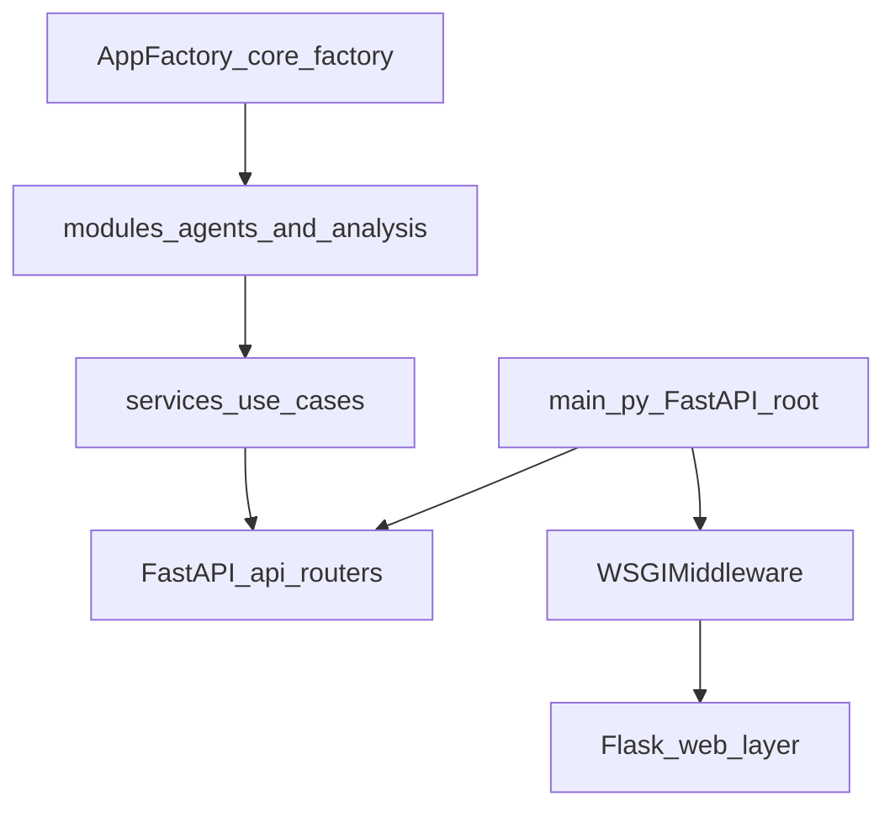

# Architecture Principles

## Purpose

Define non-negotiable architecture invariants for GPA Analyzer and align documentation with the current codebase state.

## Invariants

### 1) Factory-first

- Module lifecycle is centralized in `app_gpa/core/factory.py`.
- Registration is explicit in `app_gpa/core/bootstrap.py`:
  - `AppFactory.register("agents", AgentModule())`
  - `AppFactory.register("analysis", AnalysisModule())`
  - `AppFactory.wire()`
- New domain modules must implement `ModuleBase` (`setup`, `health`, `metadata`).

### 2) FastAPI-first

- Canonical JSON API lives in `app_gpa/api/routers/*`.
- API app is created in `app_gpa/api/app_factory.py` and mounted from `app_gpa/main.py` at `/api`.
- Flask is allowed only for legacy HTML/UI routes and transitional job/SSE surface.

### 3) Explicit Legacy Tracking

- Any Flask JSON endpoint under `/api/*` is considered architectural debt.
- Debt items must be listed in [Flask Remnants Backlog](../refactoring/flask_remnants.md) with target migration and priority.

## Runtime Topology (Current)

## Target Topology

- FastAPI owns all `/api/*` endpoints.
- Flask surface is narrowed to HTML pages only, then either:
  - retained as pure UI shell, or
  - replaced by FastAPI-native UI serving strategy.

## Gaps Observed

- Hybrid mode is still active (`WSGIMiddleware(webapp.app)`).
- Flask blueprints still contain `/api/*` handlers in standalone mode.
- Some contracts still import Flask helpers in module layer (`modules/analysis/api_contracts.py`).
